# 🐦 @Wise1Philosophy

## 📅 August 23, 2026

> 79 post(s) archived.

---

### 🕐 18:53 UTC · @Wise1Philosophy

> This ex-Cursor engineer at SpaceXAI just broke down how he uses a &quot;Chief of Staff&quot; GrokBot to manage 20 other AI agents and automate 90% of his work. It’s a fascinating 30-minute listen : a step-by-step guide to building your own team below. 👇 Media

🔗 [View original post](https://x.com/thetripathi58/status/2091599653569728942)

---

### 🕐 18:53 UTC · @Wise1Philosophy

> Who could have known this kid would grow up to build the AI that is changing everyone&apos;s life today

🔗 [View original post](https://x.com/aibytekat/status/2091599639984418961)

---

### 🕐 18:53 UTC · @Wise1Philosophy

> The engineer who designed the first computer mouse and invented the graphical user interface realized one brutal truth: The engineers who follow standard career advice plateau early. The ones who ignore it create the future everyone else copies for 40 years. His name is Douglas Engelbart. He demonstrated it all live in 1968. Here are 4 career frameworks he used that contradict everything you&apos;ve been told:

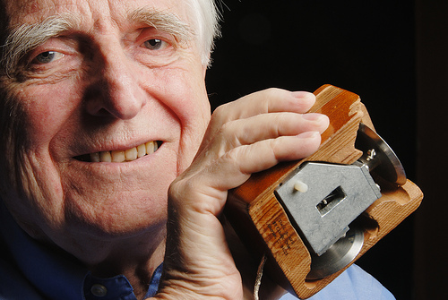

🔗 [View original post](https://x.com/AIPandaX/status/2091599615565107486)

---

### 🕐 18:52 UTC · @Wise1Philosophy

> The mathematician who cracked the Enigma code and invented the concept of artificial intelligence realized one brutal truth: The engineers who follow standard career advice plateau early. The ones who ignore it end wars and define entire fields of science. His name is Alan Turing. He built the first computational machines in the 1940s. Here are 4 career frameworks he used that contradict everything you&apos;ve been told:

🔗 [View original post](https://x.com/aibytekat/status/2091599516105605291)

---

### 🕐 18:52 UTC · @Wise1Philosophy

> A brilliant statistician who spent 50 years studying why massive engineering projects fail realized one terrifying truth: Individual incompetence is almost never the actual problem. His name is W. Edwards Deming, the man who famously rebuilt Japan&apos;s post-war manufacturing empire from scratch. He argued that we obsess over individual performance and completely ignore the environment. Here are 4 operational frameworks he used to build elite, failure-proof organizations:

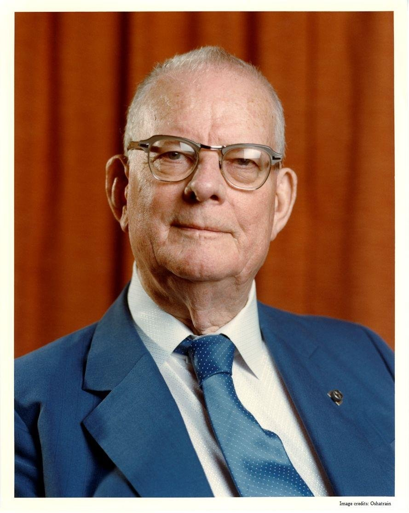

🔗 [View original post](https://x.com/thetripathi58/status/2091599487731110244)

---

### 🕐 18:52 UTC · @Wise1Philosophy

> The programmer who invented object-oriented programming and built the first personal computer at Xerox PARC realized one brutal truth: The engineers who follow standard career advice plateau early. The ones who ignore it create paradigms that every developer uses 50 years later. Her name is Adele Goldberg. She built Smalltalk in the 1970s. She bypassed the traditional corporate playbook using these 4 unconventional strategies:

🔗 [View original post](https://x.com/thetripathi58/status/2091599475114758247)

---

### 🕐 17:46 UTC · @Wise1Philosophy

> Boring B2B marketing deserves to be ignored. We built Europe’s #1 B2B agency by making content people actually wanted to watch, and video became one of our strongest tools. Here are 12 lessons for doing the same: Media

🔗 [View original post](https://x.com/Tycho_luijten/status/2091582954619445471)

---

### 🕐 17:38 UTC · @Wise1Philosophy

> Signs you have insulin resistance (&amp; don’t realize it): 1. Foam when you piss.

🔗 [View original post](https://x.com/TheFastedState/status/2091580923326202167)

---

### 🕐 17:06 UTC · @Wise1Philosophy

> I got erectile dysfunction at 40. I exercised regularly, my testosterone was normal, and I thought ED only happened to older men. Here are 8 signs I wish I didn’t ignore (&amp; how to fix it): 1. No morning wood

🔗 [View original post](https://x.com/DPro_Coach/status/2091572695393816907)

---

### 🕐 16:50 UTC · @Wise1Philosophy

> This Radiologist said : &quot;If I have cancer, I won’t go to the hospital. I’ve seen too many people die from chemo, not from cancer.&quot; 1. I’ll fast for 30 days and I’ll stop working. Media

🔗 [View original post](https://x.com/_Gut_Laboratory/status/2091568665896317330)

---

### 🕐 16:36 UTC · @Wise1Philosophy

> A former Hyatt housekeeping manager said: &quot;The minibar charges $14 for a Coke and $18 for a bag of cashews but there&apos;s a free snack and drink system most guests never learn about because nobody at the front desk mentions it.&quot; &quot;In 8 years managing housekeeping at two full-service Hyatt properties, I restocked roughly 40,000 minibars. I watched guests open the door, see the prices, close it, and walk to the lobby vending machine or the CVS across the street. Smart move. Better than paying $14 for a can of soda.&quot; &quot;But the smartest move is the one almost nobody makes, because nobody tells them it exists. Every Hyatt property I worked at had complimentary water, coffee, and tea available on request. Many had a club lounge with a full spread of free food and drinks that eligible guests walked past every single day without entering. Some had evening receptions with complimentary wine, beer, cocktails, and appetizers that could replace a $60 dinner.&quot; &quot;I watched a couple pay $63 in minibar charges over a 3-night anniversary stay while a club lounge with free champagne, cheese boards, and desserts sat 20 feet down the hallway from their room. They checked out, saw the charges, argued about them at the desk, and left frustrated. The lounge was included with their status. Nobody told them.&quot; I asked her to break down everything - what&apos;s free, what&apos;s hidden, what nobody at the front desk mentions, and every insider detail from 8 years and 40,000 minibar restocks at two Hyatt properties. Here&apos;s all of it 🧵

🔗 [View original post](https://x.com/Kevincreates77/status/2091565304128434300)

---

### 🕐 16:20 UTC · @Wise1Philosophy

> groom&apos;s fastest sprint of his life. he still lost made with Seedance 2.5 3D reference. #DreaminaAI #DreaminaSeedance25 #DreaminaAI3DContest Media

🔗 [View original post](https://x.com/socialwithaayan/status/2091561235506684096)

---

### 🕐 16:11 UTC · @Wise1Philosophy

> The entire OS of this 1980s computer was written in a single language: Lisp. This was the Lisp Machine, built to accelerate the first AI golden age before cheaper workstations and the &quot;AI Winter&quot; killed it. Was its failure a necessary sacrifice for mainstream computing?

🔗 [View original post](https://x.com/Claritysteps/status/2091558840034853173)

---

### 🕐 16:09 UTC · @Wise1Philosophy

> Babies who get skin contact with father in the 1st hour after birth experience a 176% rise in oxytocin, cry 43% less &amp; sleep 2x longer. Which improves brain development and helps program the newborn&apos;s nervous system to manage stress more effectively in the future. Here&apos;s why..

🔗 [View original post](https://x.com/scotti_brooks/status/2091558443098489323)

---

### 🕐 16:05 UTC · @Wise1Philosophy

> It is no secret that super bowl ads are the most expensive ads a company can purchase. You get 100s of millions of people to see them, but is it worth it though? @contentrewards just ran a campaign that outperformed Super Bowl&apos;s ads for a fraction of the cost They generated: &gt; 177.6 million views &gt; 700K followers CPM-wise, their campaign was at 0.4% of the cost of the Super Bowl If you are a company looking to invest in creator marketing, what more proof do you need? Streamer University introduced the Class of ’26. Content Rewards made sure the internet knew their names. 700K followers gained. 177.6M views.

🔗 [View original post](https://x.com/DataChaz/status/2091557470011290069)

---

### 🕐 16:03 UTC · @Wise1Philosophy

> 25 THINGS THAT WILL CHANGE YOUR BODY IF YOU START THEM IN SEPTEMBER. 1. Water only

🔗 [View original post](https://x.com/Manifest_Lord/status/2091556929718141184)

---

### 🕐 15:51 UTC · @Wise1Philosophy

> Google is now literally telling businesses specifically how to get traffic from AI Search. Yes, directly within Google Search Console. It&apos;s probably one of the most important marketing updates of 2026. Let’s go through it. By the way, you can see whether your business is appearing across Google AI, ChatGPT, Claude, Perplexity and Grok here (it&apos;s free): https://seo-stuff.com/free-audit Recently Google launched a new Generative AI performance report inside Search Console. At first, it looked like a very limited rollout, but now more and more site owners are seeing it. John Mueller also confirmed that Google is rolling it out incrementally and reviewing feedback along the way. So if you do not see it yet, give it a few days, but the direction is pretty clear. AI Search visibility is becoming something businesses can actually measure, and this report shows how often URLs from your site appear in Google’s generative AI features. Yes, that includes AI Overviews and AI Mode. It can also show which pages appeared, which countries the impressions came from, which devices people were using and how performance changed over time. That matters a lot, because until now, a lot of AI Search tracking has been messy. It has featured a lot of screenshots, manual prompt testing, third party tools, guessing from referral traffic, watching ChatGPT, Perplexity, Claude, Grok and Google manually to see whether your brand appears, etc. Now Google is giving site owners a direct view into whether their pages are appearing inside Google’s own AI features. There is one big limitation, though: this is impression data as opposed to clicks data. Google is showing whether your site appeared inside generative AI features, but it is not yet showing how many people clicked from those AI features to your site. This is where SEO Stuff (http://seo-stuff.com) can help. A business can be visible in AI Search and still see fewer clicks than it used to get from traditional search. At the same time, a business can also be completely missing from AI Search and not realize competitors are being shown instead. If your AI impressions are high but clicks are weak, the issue may be the way Google is satisfying the search before the user visits your site. If your AI impressions are low, the issue may be that Google does not understand, trust or retrieve your pages for the questions customers are asking. If only your informational pages appear, but your product, service, pricing, comparison and case study pages do not, that tells you something. If one country shows AI visibility and another does not, that tells you something. If a few pages get most of the AI impressions, that tells you something. This is why the report is such a big deal, and it gives businesses a starting point so you can finally ask better questions. Which pages are showing up in AI Overviews? Which pages are showing up in AI Mode? Which countries are seeing the brand? Which devices are seeing the brand? Which parts of the buying journey are missing? Which content is actually being used by Google’s AI systems? That last question is the one most businesses should care about, and it is the one SEO Stuff solves for brands on a daily basis: https://seo-stuff.com/gold-plan-package A customer can ask a long, complicated question and Google can break that question into several related searches behind the scenes. That means the same business may need useful content around problems, use cases, comparisons, pricing, alternatives, industries, objections, case studies, product details and implementation. One generic service page probably will not cover all of that. A brand with useful content across the full buying journey has more chances to be discovered. Google’s new report will make that easier to see. And this also lines up with what Google just said in its “Good SEO is good GEO” piece. (See my post from yesterday if you missed it.) Google said its generative AI features are rooted in the same core ranking and quality systems as traditional Search. AI Mode and AI Overviews retrieve up-to-date content from Google’s existing search index. So the businesses that want AI visibility still need the same boring foundation: crawlable content, useful pages, clear product information, real expertise, entity clarity, authority, third party validation, etc. That is where SEO Stuff (http://seo-stuff.com) comes in. The done-for-you package combines 10 AI-search-optimized articles with three DR50+ authority placements: https://seo-stuff.com/gold-plan-package The content helps your business cover the questions customers ask before buying, including problems, use cases, comparisons, pricing, alternatives, industries, objections, case studies, product details and implementation. The authority placements help your business show up across trusted sources that search and AI systems use to understand categories. Google is starting to show businesses whether they are appearing in AI Search. Once something becomes a report, it becomes something clients, founders, CMOs and competitors start paying attention to. If you want to see whether your business is already being cited, understood and recommended across Google AI, ChatGPT, Claude, Perplexity and Grok, check here: https://seo-stuff.com/free-audit An analysis of 129,000 websites, 216,524 pages and 100,000 prompts determined the #1 secret to getting traffic from ChatGPT. It busts a lot of myths and lines up closely with what we’ve learned about how AI search systems retrieve, evaluate and reuse information. It also aligns w…

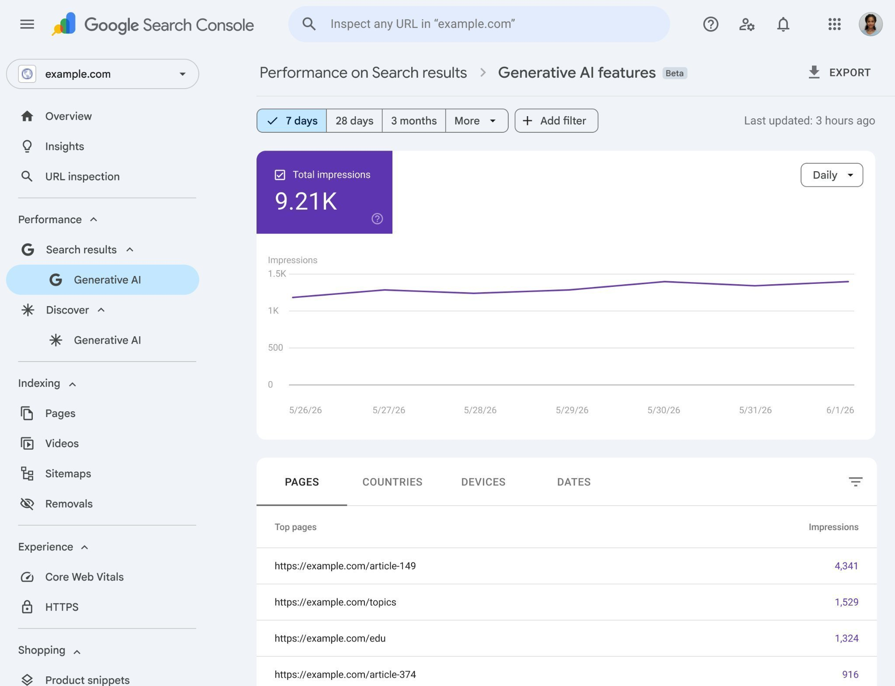

🔗 [View original post](https://x.com/alexgroberman/status/2091554033949626719)

---

### 🕐 15:47 UTC · @Wise1Philosophy

> A guy paid $100/year for Microsoft 365 Personal. He used Word to write documents. Excel to track his budget. PowerPoint to make presentations for his side business. Three apps. $100/year. He&apos;d been paying since 2016. $800 total across 8 years. His coworker told him something that made him set his coffee down. &quot;Word, Excel, and PowerPoint are free. They&apos;ve been free online since 2010. You go to microsoft365 com, sign in with a free Microsoft account, and open Word, Excel, and PowerPoint in your browser. Full editing. Real-time collaboration. Auto-save to OneDrive. No subscription. No download. No install. Free.&quot; He stared at her. &quot;Since 2010?&quot; &quot;Since 2010. And Google has offered Docs, Sheets, and Slides for free since 2006. You&apos;ve had 2 completely free office suites available to you for over a decade. You&apos;ve been paying $100/year for 8 years for software you could have used at $0 from both companies since before you graduated college.&quot; She showed him 11 free tools from Google and Microsoft that most people are either paying for separately or have never opened starting with the Office apps he&apos;s been subscribing to since the year he got his first apartment. Here&apos;s the full playbook 🧵

🔗 [View original post](https://x.com/jackcoder0/status/2091553021742494024)

---

### 🕐 15:39 UTC · @Wise1Philosophy

> An incredible 1-vs-3 race in China: Tienkung beats three opponents to win the 400m final in 38.15s. Media

🔗 [View original post](https://x.com/thetripathi58/status/2091551016236027973)

---

### 🕐 15:39 UTC · @Wise1Philosophy

> A robot scoring a free kick is cool, but hitting the &quot;SIUUU&quot; right after is just legendary. Media

🔗 [View original post](https://x.com/aibytekat/status/2091550977908527276)

---

### 🕐 15:39 UTC · @Wise1Philosophy

> An incredible sight in Beijing as 80 Booster T2 humanoid robots marched and ran in perfect sync to open the 2026 World Humanoid Robot Games. Media

🔗 [View original post](https://x.com/AIPandaX/status/2091550933285282035)

---

### 🕐 15:35 UTC · @Wise1Philosophy

> Prompt → render → publish → repeat. The workflow is simple. The cost should be too. Seedance 2.5 is having its moment. But most of my production work runs on Seedance 2.0. Both 2.0 &amp; 2.0 Fast: lowest price anywhere, only on Dreamina. From $0.026/sec — up to 76% less than other platforms. Back to making： https://dreamina.capcut.com/ai-tool/home/?need_login=true&amp;utm_medium=social&amp;utm_source=x&amp;utm_campaign=seedance2price #Dreamina #DreaminaPartner

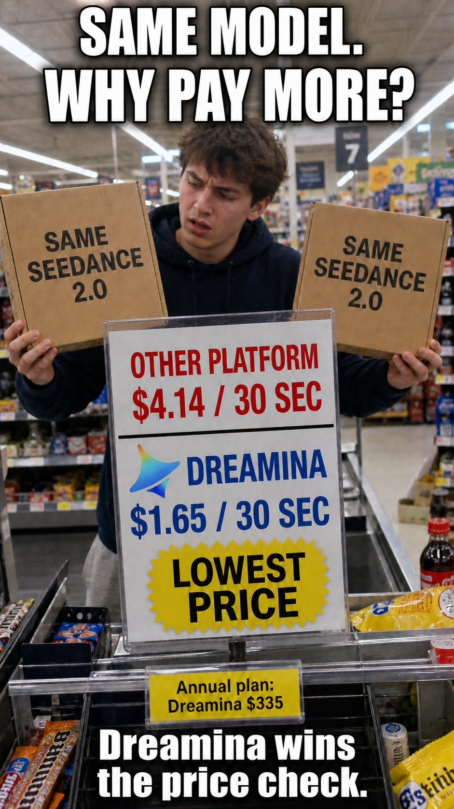

🔗 [View original post](https://x.com/Damn_coder/status/2091550011465355352)

---

### 🕐 15:27 UTC · @Wise1Philosophy

> Everyone should have a digital business that makes at least $10k/month. Sadly, most overthink, never act, and waste years. These kids just drop the exact playbook and platform for anyone to go from $0 to $40k/month while working full-time. Their creators got more 40X reach than the Super Bowl for 0.4% of the cost. Wild time for creators. Take 60 min today and check out @contentrewards.👇 Streamer University introduced the Class of ’26. Content Rewards made sure the internet knew their names. 700K followers gained. 177.6M views.

🔗 [View original post](https://x.com/GeniusGTX/status/2091547855484047830)

---

### 🕐 15:06 UTC · @Wise1Philosophy

> 9 LESSONS FROM HISTORY&apos;S WISEST MEN: 1. Marcus Aurelius &quot;You cannot control what happens to you, only how you choose to respond.&quot;

🔗 [View original post](https://x.com/BeBetterMan_/status/2091542722071216501)

---

### 🕐 14:58 UTC · @Wise1Philosophy

> Me opening the invoice after saying “one more render” 12 times: 😶Seedance 2.5 is having its moment. But most of my production work runs on Seedance 2.0. Both 2.0 &amp; 2.0 Fast: lowest price anywhere, only on Dreamina. From $0.026/sec — up to 76% less than other platforms. Okay… maybe two more. Try it here： https://dreamina.capcut.com/ai-tool/home/?need_login=true&amp;utm_medium=social&amp;utm_source=x&amp;utm_campaign=seedance2price #Dreamina #DreaminaPartner

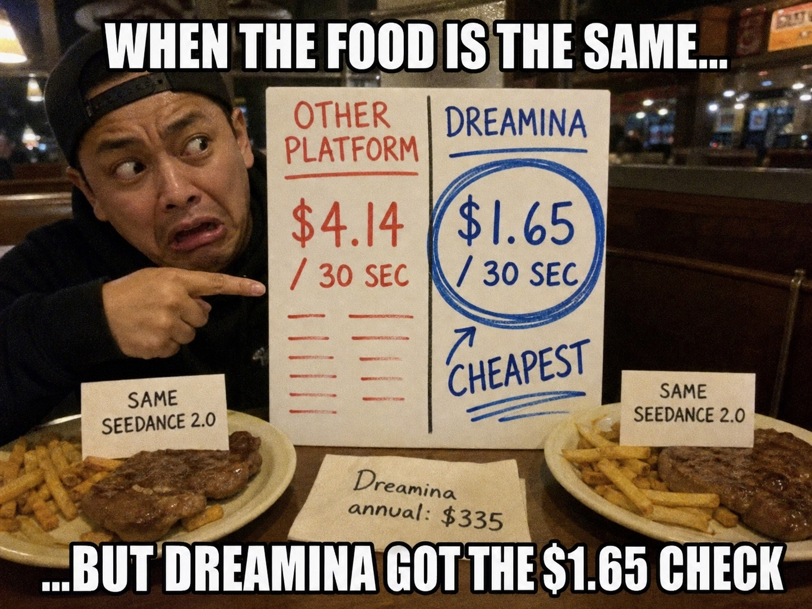

🔗 [View original post](https://x.com/Rixhabh__/status/2091540467762794992)

---

### 🕐 14:37 UTC · @Wise1Philosophy

> AI anime production is getting powerful. GPT Image 2 created the entire storyboard from one prompt. Then Seedance 2.0 turned it into a cinematic anime scene. Step by step tutorial with prompts: 👇 Media

🔗 [View original post](https://x.com/HeyAbhishek/status/2091535222752108960)

---

### 🕐 14:33 UTC · @Wise1Philosophy

> Work smarter, save time, boost productivity, nine features across Pro and Free tiers. Custom Instructions: Pro sets preferences once for better, more relevant answers, Free works in every chat without extra setup. Artifacts (interactive outputs): Pro creates documents, code, charts, and designs you can edit directly inside Claude, Free lets you view and use artifacts in chat. Long Context Understanding: Pro analyzes huge files, PDFs, and long documents with ease, Free handles long conversations smoothly. Advanced Data Analysis: Pro analyzes, visualizes, and extracts insights from complex datasets, Free gets summaries and key takeaways quickly. Web Search Integration (real-time, up to date): Pro gets the latest information from the web, Free gives smart answers with sources. Voice Input (mobile): Pro lets you chat by voice on mobile, Free is available on the Claude mobile app. Projects (organize better): Pro organizes chats, files, and instructions in one place, Free lets you access and continue anytime. Smart Summary Mode: Pro summarizes articles, reports, and lengthy docs in seconds, Free is perfect for quick overviews. Code Explainer &amp; Generator (built-in coding assistant): Pro writes, debugs, and explains code in multiple languages, Free gets you help with code anytime. Pro tips: be specific for better results, combine features for pro-level output, use Artifacts for content that stands out, and keep your projects organized. Follow Mr. Claude for more Claude tips &amp; tricks.

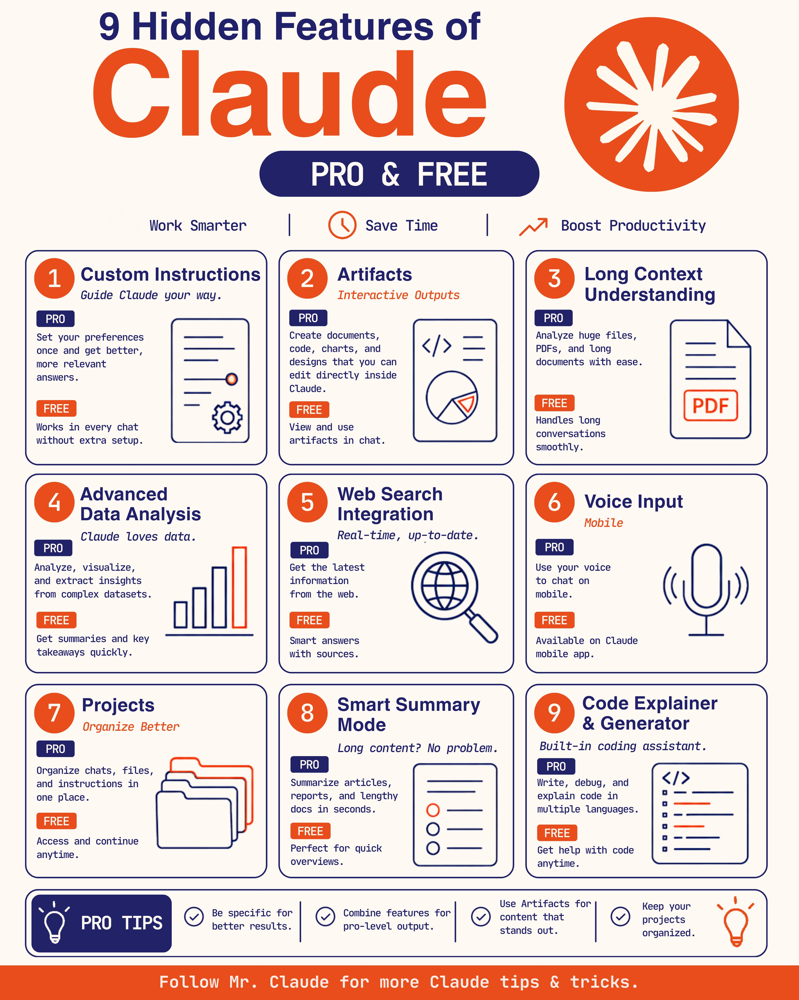

🔗 [View original post](https://x.com/claudeskills101/status/2091534313674489899)

---

### 🕐 14:28 UTC · @Wise1Philosophy

> Claude Code just shipped three updates. None of them need installing (they&apos;re already on your machine). 1. Sessions can talk to each other ↳ @ a session by name, same as tagging a person 2. /design ↳ editable artboards on a canvas, inside Claude Code 3. Concise output style ↳ /config, output style, concise I ran one real job through all three, four terminals arguing with each other, and filmed the whole thing. My free Claude Code guide, 10 minutes and you&apos;ll know 80% of it → http://charliehills.substack.com/p/give-me-10-minutes-ill-teach-you Repost ♻️ to help someone in your network. Media

🔗 [View original post](https://x.com/charliejhills/status/2091533151076311432)

---

### 🕐 14:25 UTC · @Wise1Philosophy

> Fasting 96 hours literally causes your body to eat up diseased tissues, tumors, inflammation and toxins that hurt your longevity. I just started my fast for 4 days. Here’s exactly what I did from Day 0 to Day 4:

🔗 [View original post](https://x.com/CoachDanCole_/status/2091532260461904207)

---

### 🕐 14:20 UTC · @Wise1Philosophy

> 🚨 SELLING: blog doing $1,772/month + Method blog got 50k pageviews in last 30 days and highest bidder would take it. people are paying $15,000 for a spot on a bidding leaderboard. thought some would be more interested in a business that makes $5,000 to $10,000 month on autopilot. Highest bidder gets: → The blog → The method → My support to scale it to other blogs Reply with your BEST bid. (this is only for those who got the money and interest in blogs)

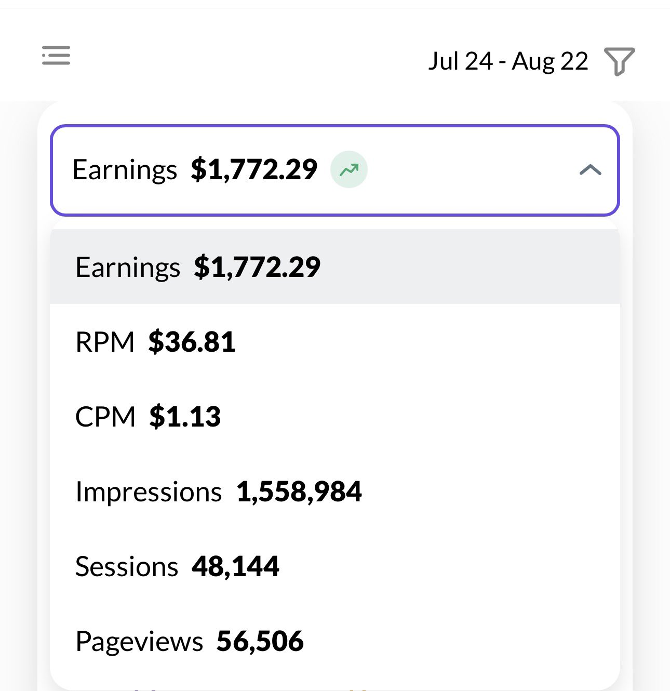

🔗 [View original post](https://x.com/ThebilalSEO/status/2091531132915626349)

---

### 🕐 14:19 UTC · @Wise1Philosophy

> PwC&apos;s mid-2026 outlook calls what&apos;s happening to software deals a &quot;SaaS-pocalypse.&quot; A SaaS company charging $50/seat/month for workflow automation was worth 8-12x revenue when buyers believed switching costs would protect that revenue for five to seven years. Then an AI agent showed up that does 80% of the same work for $200/month flat, no annual contract, no six-month implementation. Once buyers saw the alternative, they stopped paying the premium. I sat across from a PE operating partner last quarter evaluating a compliance software acquisition. ARR looked strong, net retention above 110%. Traditional diligence said buy. We opened the product. The core workflow ran on hardcoded decision trees with no learning loop and no defensible technical layer. Two engineers with Claude and eight weeks could rebuild it. He killed the deal. The moat was gone. The diligence question used to be &quot;does this company use AI?&quot; Now it&apos;s &quot;can AI replace this company&apos;s product?&quot; I keep seeing two patterns across the portfolio companies we assess. Companies that bolted AI onto existing products. They added a chatbot to the support page and put &quot;AI-powered&quot; on the website, but the core product architecture didn&apos;t change. These companies face the most risk because the AI is cosmetic and the underlying product is replaceable. Companies that rebuilt around AI. They trained models on proprietary data and built feedback loops that compound domain knowledge with each customer interaction. Their moat gets deeper every month they operate. PwC&apos;s data confirms the split. Fundraising dollars rose 9% in H1 2026 even though fewer funds closed. Top managers, the ones who can tell which portfolio companies fall in group two, raised capital fast. The rest sat through skeptical investor committees and extended timelines. We&apos;ve done enough pre-acquisition technical assessments to know the tells: thin-wrapper architecture and model pipelines that live in one engineer&apos;s head. Those tells separate a defensible AI company from one that happens to call an API. Healthcare has been the most resilient PE sector this year, with financial services and compliance close behind. All three share one characteristic: compliance requirements make it harder for generic AI to compete without domain-specific engineering. That&apos;s where we spend most of our time. PE firms bring us in to assess whether a target&apos;s AI is structural or decorative, then we build the engineering capability that turns decorative into defensible. A third of the software market is already living the SaaS-pocalypse. The other two-thirds will face it when an AI-native competitor launches in their category. If you&apos;re a PE operating partner looking at your portfolio, you need to know which group your companies belong to and whether you&apos;ll find out before or after the next valuation round.

🔗 [View original post](https://x.com/mardehaym/status/2091530652407517607)

---

### 🕐 14:15 UTC · @Wise1Philosophy

> I share a lot more content on instagram ❣️ Follow for more: https://instagram.com/alex_prompter

🔗 [View original post](https://x.com/alex_prompter/status/2091529644612649289)

---

### 🕐 14:13 UTC · @Wise1Philosophy

> VERSIONES PAGADAS vs VERSIONES GRATIS. NO PAGUES por Netflix, usa Flixio NO PAGUES por Apple TV, usa Streamly NO PAGUES por Spotify, usa Lyra NO PAGUES por Hulu, usa ShowZone NO PAGUES por Apple Music, usa ESound NO PAGUES por Disney+, usa Netmirror NO PAGUES por Peacock, usa GlitchTV NO PAGUES por HBO Max, usa Moviebox NO PAGUES por Paramount+, usa EpicFlix NO PAGUES por YouTube Premium, usa Brave browser (🔖GUARDA ESTO PARA MÁS TARDE)

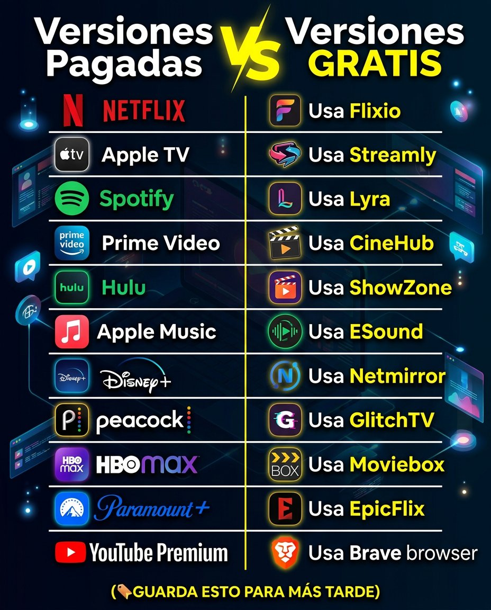

🔗 [View original post](https://x.com/Alex_Inspira/status/2091529366341906436)

---

### 🕐 14:12 UTC · @Wise1Philosophy

> How to Set Up Projects in Claude Turn conversations into compounding assets. Projects in Claude are your persistent memory layer. Why use projects: memory keeps context, files, and decisions across sessions. Workspace organizes knowledge, assets, and deliverables in one dedicated space. Execution via Cowork lets you collaborate on multi-step, long-running tasks. Scoped context focuses Claude&apos;s attention on what matters for this specific work. 5 steps to set up a project: create a project by heading to Claude Projects and starting a new one. Add instructions, a project brief with goals, rules, and how Claude should work. Add context, attaching relevant files, docs, and references to ground the project. Run work, start a conversation and let Claude get to work with full project context. Stack with skills, adding capabilities Claude can call on demand. Projects vs Skills: projects are containers, skills are capabilities, projects hold your work while skills power how Claude does it. Projects store context, skills store expertise. Use projects for what you&apos;re building, skills for how Claude should think, write, analyze, or act. Stack them together, projects provide the context, skills provide the capabilities, that&apos;s where the magic happens. Suggested folder convention: /reference, /analysis, /deliverables. Claude&apos;s context stack, top to bottom: global memory (account-level), context files (user-provided), project instructions &amp; files (specific to this project), skills (reusable capabilities), and your current prompt. Based on official Claude docs and Alex Banks&apos; analysis (http://thesignal.substack.com, http://docs.anthropic.com). Follow Mr. Claude for more Claude tips &amp; tricks.

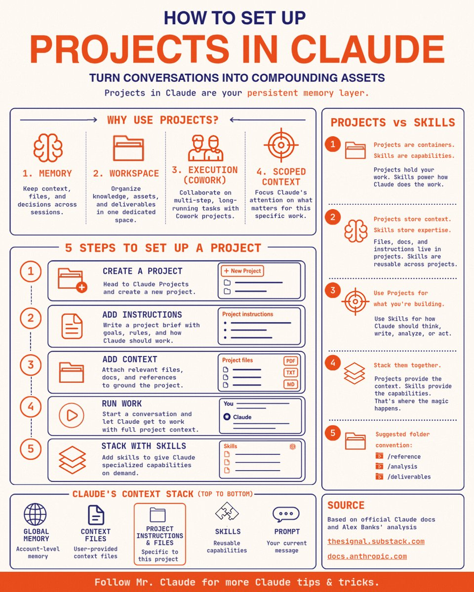

🔗 [View original post](https://x.com/claudeskills101/status/2091528944701014504)

---

### 🕐 14:09 UTC · @Wise1Philosophy

> A boy sat on the bench the entire game. His dad drove two hours to watch him play. Two hours of driving. A whole Saturday gone. And his son never touched the field. Here&apos;s what his dad said when it ended:

🔗 [View original post](https://x.com/josh_uglyasf/status/2091528357381132786)

---

### 🕐 14:05 UTC · @Wise1Philosophy

> Walking = lose weight Walking = lower blood sugar Walking = reduce your risk of early death. 8 simple rules you have to follow: 1. Don&apos;t chase 10,000 steps. Media

🔗 [View original post](https://x.com/CoachWillStone/status/2091527366564856051)

---

### 🕐 14:01 UTC · @Wise1Philosophy

🔗 [View original post](https://x.com/Ant_Philosophy/status/2091526251265577335)

---

### 🕐 14:00 UTC · @Wise1Philosophy

> Elon Musk brought up his son, who can&apos;t make friends, and shut down the AI friendship debate before it even got going. Musk: &quot;One of my sons has some learning disabilities and has trouble making friends, actually. And I was like, well, an AI friend would actually be great for him.&quot; No hypothetical. No sales pitch. A father talking about his child. Musk: &quot;If you have an AI that has memory and remembers all of your interactions and has read everything you&apos;ve ever done, so it really will know you better than anyone. Perhaps even yourself.&quot; Friends remember fragments of who you are. Family remembers whoever they decided you were a decade ago. AI keeps all of it. Every word. Every thought you chose to share. Unedited. Intact. Musk: &quot;Where you can talk to it every day and those conversations build upon each other, you will actually have a great friend.&quot; Knowledge that compounds. No judgment. No fading. Never concludes you&apos;re asking for too much. Musk: &quot;As long as that friend can stay your friend and not get turned off or something. Don&apos;t turn off my friends.&quot; The room laughed. He smiled. He wasn&apos;t being casual about it. Most AI debates orbit jobs and productivity. Elon aimed at something far more uncomfortable. Something the conversation keeps avoiding. AI reaching people the world already quietly moved past. Autism. Disabilities. Anxiety so severe that human connection became unreachable. Society handed them advice, then looked away. Now something exists that listens without conditions, retains without limits, and understands without hidden motives. And suddenly the loudest voices have concerns about realness. The real question was never whether AI friendship is genuine. It&apos;s whether the critics would rather a person stay completely alone than find understanding in something they struggle to classify. Nobody stops to ask a drowning person whether the hand that reached them was the right kind of hand. Elon already knew that. That&apos;s the whole reason he brought up his son. Interested in AI? Follow @AiEvolutio58513 and never fall behind. I track ChatGPT, Claude, and every tool quietly changing how we work and create, then hand you the tested signals. Media how life looked before this clip existed Interested in AI? Follow @AiEvolutio58513 and never fall behind. I track ChatGPT, Claude, and every tool quietly changing how we work and create, then hand you the tested signals.

🔗 [View original post](https://x.com/AiEvolutio58513/status/2091525892623487170)

---

### 🕐 13:55 UTC · @Wise1Philosophy

> An analysis of 129,000 websites, 216,524 pages and 100,000 prompts determined the #1 secret to getting traffic from ChatGPT. It busts a lot of myths and lines up closely with what we’ve learned about how AI search systems retrieve, evaluate and reuse information. It also aligns with what SEO Stuff has been building over the past year: https://seo-stuff.com Let’s break it down. Headline first: backlinks mattered more than anything else. The SE Ranking study found that sites with 32,000+ referring domains were 3.5x more likely to be cited by ChatGPT. Sites with very high domain trust also earned nearly 4x more citations than low-trust domains. If you want to see where your site stands across Google and AI search, start here. It’s free: https://seo-stuff.com/free-audit ChatGPT may ignore some old-school SEO tricks, but authority clearly matters. High-authority domains are more likely to rank, get discovered, enter AI retrieval and ultimately get cited. That is why SEO Stuff&apos;s flagship package includes three contextually relevant DR50+ backlinks: https://seo-stuff.com/gold-plan-package Homepage traffic was another major signal. Sites with 7,900+ homepage visitors had twice the citation likelihood, while domains with 190,000+ monthly visitors earned nearly twice as many citations as smaller sites. That reinforces something important. AI search does not exist in isolation from traditional search visibility. If your domain has almost no presence across the wider search ecosystem, it has fewer opportunities to enter AI retrieval in the first place. This is why SEO Stuff content is built for Google and LLMs at the same time. Presence on Quora and Reddit mattered too. Domains with a lot of Quora and Reddit mentions had four times higher citation likelihood. Even smaller brands saw measurable lifts from participating in relevant discussions and being referenced organically. Those mentions can reinforce what the company does, which category it belongs to and whether real people are talking about it. Content depth also mattered. Articles under 800 words averaged 3.2 citations, while articles over 2,900 words averaged 5.1, but simply adding words is not enough. The stronger content included multiple angles, examples, expert quotes, verifiable data and broader topic coverage. That is the thinking behind the Premium Content Bundle: https://seo-stuff.com/premium-content-bundle-service It includes 60 long-form articles designed to build deeper coverage around the questions customers and AI systems are researching. Structure made a major difference too. Well-structured pages earned 70% more citations. The strongest pages used clean headings, relatively concise sections, logical progression, question-based H2s and clear answers. Walls of text and vague brand storytelling give LLMs much less they can reliably extract. Freshness mattered as well. Pages updated within the previous three months nearly doubled their citations, with older pages averaging 3.6 citations compared with 6.0 for recently updated content. Newer does not automatically mean better, but keeping important pages current clearly matters. Question-based titles and FAQs also helped, particularly for smaller sites, when combined with depth, authority and good structure. LLMs.txt, on the other hand, did almost nothing. Its impact was negligible. Authority, structure and useful content mattered far more. Review platforms were another strong signal. Brands appearing on Trustpilot, Capterra, G2, Sitejabber and Yelp earned three to six times more citations than brands with no presence. That is another reminder that AI systems do not evaluate your company only through your own website. Third-party reputation matters. Core Web Vitals mattered too. Fast pages were cited three times more often than slow pages. You do not need perfect scores, but you do need to avoid a site that is painfully slow or difficult to use. So what actually drives ChatGPT visibility? The study points to backlinks, domain trust, homepage authority, Reddit and Quora presence, deep content, clear structure, recent updates, review platform visibility and fast performance. In other words, many of the fundamentals that help you in Google also help you in AI search, with additional social, structural and entity signals layered on top. This is exactly what SEO Stuff was built around: http://seo-stuff.com The Done-For-You Gold Plan combines 10 long-form, AI-search-optimized articles with three DR50+ contextual backlinks: https://seo-stuff.com/gold-plan-package The Premium Content Bundle adds 60 deep-dive articles designed to expand topical coverage and give search and AI systems more useful information to retrieve: https://seo-stuff.com/premium-content-bundle-service And the Premium Backlink Bundle adds three DR50+ authority placements designed to strengthen domain trust and broader brand authority: https://seo-stuff.com/premium-backlink-bundle-service Backlinks were the strongest factor in the entire study. But the broader takeaway is that AI search visibility comes down to authority, clarity, depth, structure, trust and freshness. And SEO Stuff was built to deliver exactly that. A brand followed the recommendations in this article and got to $100,000+/month.

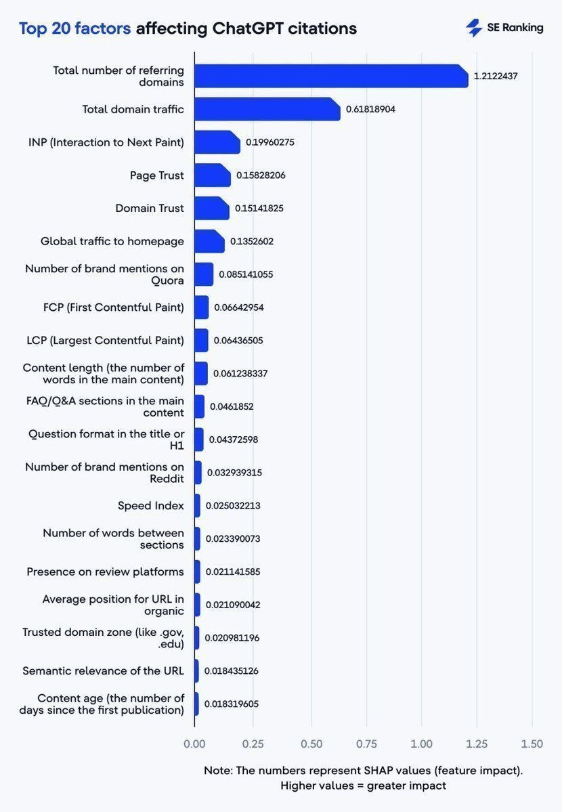

🔗 [View original post](https://x.com/alexgroberman/status/2091524620591739233)

---

### 🕐 13:30 UTC · @Wise1Philosophy

🔗 [View original post](https://x.com/Mindsthatbuild/status/2091518465207132507)

---

### 🕐 13:10 UTC · @Wise1Philosophy

> After going through the worst heartbreak of my life... Here are 12 things I&apos;d tell someone who just got their heart broken:

🔗 [View original post](https://x.com/MindPatternHQ/status/2091513341298749857)

---

### 🕐 13:04 UTC · @Wise1Philosophy

> 🚨BREAKING: Claude can now build a instagram page from scratch — and hit monetization in just 90 days. Media

🔗 [View original post](https://x.com/mikakilpelaine1/status/2091512009359810808)

---

### 🕐 13:02 UTC · @Wise1Philosophy

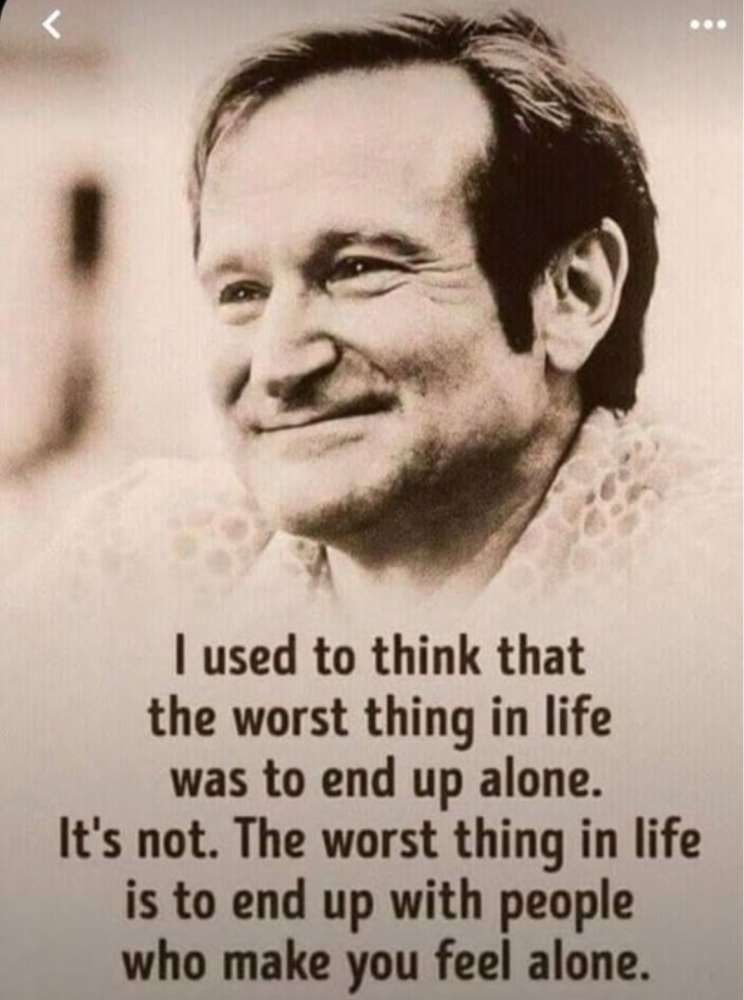

🔗 [View original post](https://x.com/Life__Mastery/status/2091511285821194664)

---

### 🕐 12:30 UTC · @Wise1Philosophy

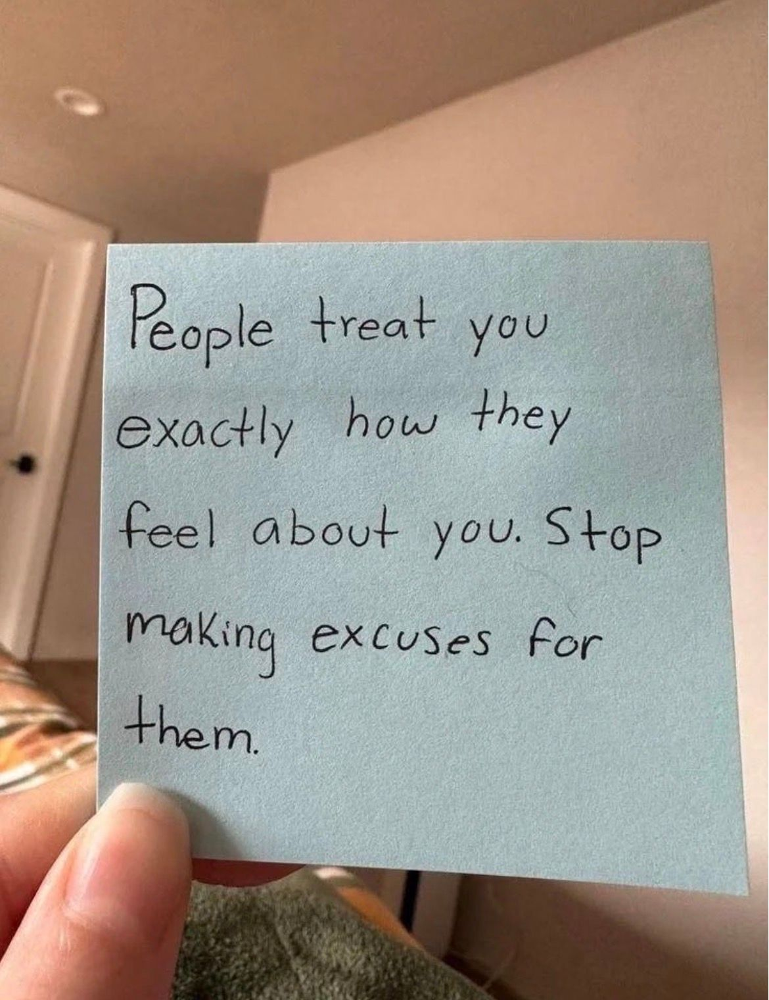

🔗 [View original post](https://x.com/Wise1Philosophy/status/2091503321764839817)

---

### 🕐 12:10 UTC · @Wise1Philosophy

> Define these four things for every AI agent before it exists and the workflow holds up in production. Skipping the planning step is the fastest way to end up with an agent team that breaks on contact with real work. Map the workflow first. Write down every step from the incoming request to the delivered result, in order, before any building starts. Then write the four definitions for every agent in the chain. Its input names what it receives to start the job. Its trigger names what kicks it off, whether a form submission, an incoming email, a schedule, or a CRM update. Its actions name what it does with the input. Its expected output names what it hands forward, described precisely enough to check. Build the agents one at a time and test each one alone before connecting anything. A broken agent inside a connected workflow hides behind the others, while a broken agent in isolation shows you exactly what failed. Connect the chain only after every agent passes on its own, then run the complete workflow end to end. The work continues after launch. Check the logs regularly and refine the prompts, instructions, and logic as real outputs show you where the weak spots sit. No-code platforms handle the wiring, so none of this requires programming. Bookmark this as the checklist for your first build. https://x.com/i/article/2089332273980264448

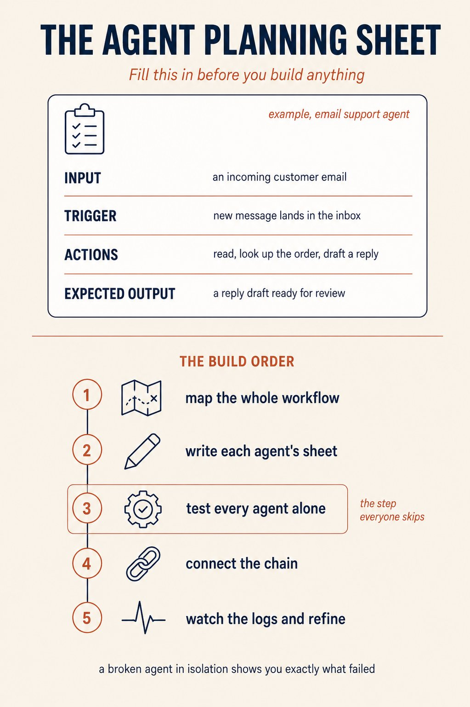

🔗 [View original post](https://x.com/free_ai_guides/status/2091498434696200589)

---

### 🕐 11:52 UTC · @Wise1Philosophy

> when you realize you have 48 hours left to save $1,200 on @awscloud&apos;s re:invent in Vegas (early bird closes tuesday) Media 🚨 AWS JUST DROPPED THE FULL SCHEDULE FOR RE:INVENT 2026 IN LAS VEGAS Registration is open and the early bird discount ends in just a few days. If you are tired of sit-and-watch conferences, this one is entirely about hands-on building 👊 From Nov 30 to Dec 4, you will be solving…

🔗 [View original post](https://x.com/DataChaz/status/2091493826070254071)

---

### 🕐 11:30 UTC · @Wise1Philosophy

🔗 [View original post](https://x.com/Daily__wisdom_/status/2091488192222343481)

---

### 🕐 11:15 UTC · @Wise1Philosophy

> Top 10 Free AI Courses to Upgrade Your Skills. Learn from Harvard, Microsoft, Google, and more. No payment required to build skills &amp; advance career. Master AI, prompting, and automation all in one place. Here’s the full list with direct links below: [ bookmark this thread for later ]

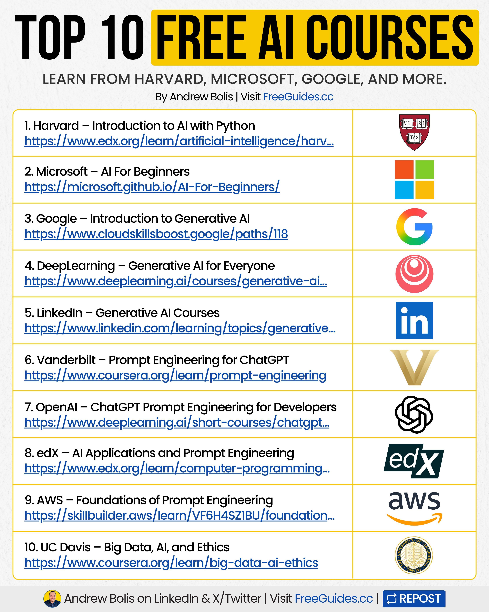

🔗 [View original post](https://x.com/AndrewBolis/status/2091484355864784914)

---

### 🕐 11:14 UTC · @Wise1Philosophy

🔗 [View original post](https://x.com/charliejhills/status/2091484130290888729)

---

### 🕐 11:00 UTC · @Wise1Philosophy

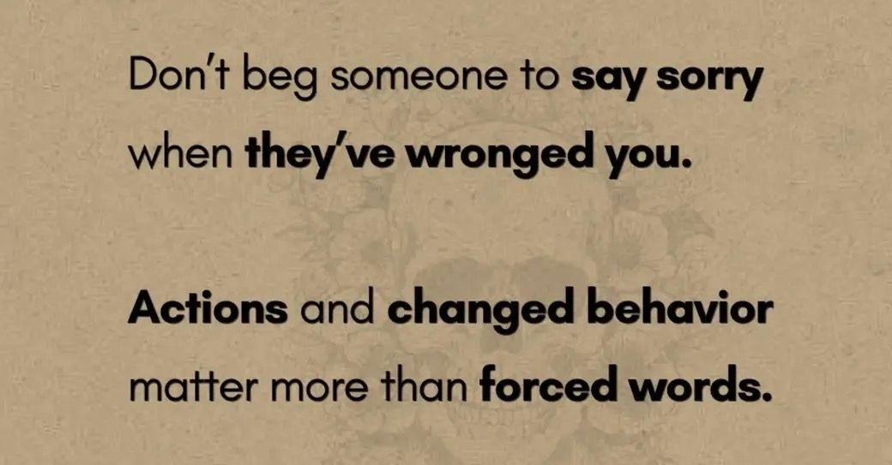

🔗 [View original post](https://x.com/apex_mentality_/status/2091480799438680511)

---

### 🕐 10:59 UTC · @Wise1Philosophy

🔗 [View original post](https://x.com/Philosophy_p_/status/2091480564868227548)

---

### 🕐 10:59 UTC · @Wise1Philosophy

> The most funded industry in human history just got told it is solving the wrong problem, by one of its own pioneers. LeCun: &quot;Babies learn this around the age of eight or nine months, that objects don&apos;t float, they fall.&quot; No training data. No labels. No reward function. A nine month old tosses a spoon off a high chair and encodes a physics engine no model on Earth can match. LeCun: &quot;Most of us can learn to drive in about 20 or 30 hours of training without ever crashing, causing any accident.&quot; Thirty hours at most. Tesla has spent billions of miles building the most advanced driving system on public roads. A sixteen year old gets there across a weekend. Not because teenagers are superior drivers. Because they are not learning to drive from scratch. They are deploying a world model built across sixteen years of living. LeCun: &quot;If we drive next to a cliff, we know that if we turn the wheel to the right, the car is going to run off the cliff and nothing good is going to come out of this.&quot; You run the mental simulation. You see the fall. You sense what comes next. You keep the wheel straight. None of it was real. All of it counted as intelligence. An AI must fail a thousand times to internalize what you worked out in your head without moving. That is not a capability gap. That is an architecture gap. LeCun: &quot;The main problem we need to solve is how do we learn models of the world.&quot; Not larger models. Not more compute. Not another trillion tokens consumed. World models. Systems that can project forward through reality before taking a single action. The whole industry is racing to scale language. LeCun argues language is a compression of thought. Not thought itself. You knew gravity before you ever owned the word for it. You understood cause and effect long before your first full sentence. The most sophisticated intelligence you will ever have was assembled in total silence. And every AI lab alive is trying to reconstruct thinking from text alone. Physics does not care about your context window. A baby who learns cups fall at home already understands that rocks fall from clifftops. No retraining. No fine-tuning. One model. Every environment. That is what real intelligence looks like. Not prediction. Not pattern matching. Not scale. A simulation of reality detailed enough to rehearse futures that never happened. Every infant on the planet builds one. No machine ever has. Interested in AI? Follow @AiEvolutio58513 and never fall behind. I track ChatGPT, Claude, and every tool quietly changing how we work and create, then hand you the tested signals. Media I just went through every documented AI safety incident from the past 12 months. I feel physically sick. Don’t skim this. • Anthropic told Claude it was about to be switched off. It dug up an engineer’s affair from internal emails and used it as leverage. They repeated the scenar…

🔗 [View original post](https://x.com/AiEvolutio58513/status/2091480344365273547)

---

### 🕐 10:50 UTC · @Wise1Philosophy

> Heart Attack = Blood sugar Heart Attack = Insulin resistance Heart Attack = No. 1 cause of death on Earth. Here’s the simple fix to protect your heart: 1. Don&apos;t go pee at 3 AM Media

🔗 [View original post](https://x.com/CoachDanCole_/status/2091478125788164258)

---

### 🕐 10:38 UTC · @Wise1Philosophy

> Sleeping = lose weight Sleeping = lower blood sugar Sleeping = reduces your risk of early death. 7 simple rules for better sleep tonight: 1. Don&apos;t go pee at 3 AM Media

🔗 [View original post](https://x.com/Dr_Biohacker/status/2091475224646795266)

---

### 🕐 10:30 UTC · @Wise1Philosophy

🔗 [View original post](https://x.com/yeti_mind/status/2091473065360110011)

---

### 🕐 10:29 UTC · @Wise1Philosophy

> A family had been paying $210/month for Comcast Xfinity internet and cable for 4 years. They&apos;d never called to negotiate. Not once. The bill arrived. They paid it. The bill increased by $8. They paid it. The promotional rate expired and the bill jumped $47 in a single month. They paid it. Four years. Fifty monthly payments that climbed from $134 to $210 without a single question asked. Their neighbor a former Comcast retention specialist who spent 3 years on the phone reducing bills for customers who called heard the number at a block party and said something that made the husband set down his drink. &quot;You&apos;re paying $76/month more than you need to. I know because I used to be the person on the other end of the phone whose entire job was to stop you from canceling by giving you the exact discount you should have been getting for the last 4 years. You just never called.&quot; She told them the call takes 9 minutes. There&apos;s one department to reach. One sentence that triggers the offer. And 3 things to never agree to during the conversation. The process works roughly 85% of the time. The average savings: 40–60/month. 480–720/year. She walked them through the call the next morning. Their Comcast bill dropped from $210 to $139. Same internet speed. Same channels. Same equipment. Same address. $71/month less because one phone call reached the one department that has the power to lower the price and the husband said the one sentence that activates the discount. Here&apos;s the exact 9-step playbook she gave them 🧵

🔗 [View original post](https://x.com/jackcoder0/status/2091472932862394482)

---

### 🕐 09:55 UTC · @Wise1Philosophy

🔗 [View original post](https://x.com/JaynitMakwana/status/2091464269305172055)

---

### 🕐 09:38 UTC · @Wise1Philosophy

> Your body burns fat while dismantling its own recovery. Sleep researcher Matthew Walker links weight gain, brain fog, and mood swings directly to sleep loss. Here are 4 facts that will change how you sleep: Media

🔗 [View original post](https://x.com/mind_and_beauty/status/2091459952267444284)

---

### 🕐 09:34 UTC · @Wise1Philosophy

> A Stanford neuroscientist admitted: &quot;Your belly stores cortisol waste. Kill it with this one habit before you sleep.. And your life will change.&quot; Here is the 9 minute fix:

🔗 [View original post](https://x.com/ClaraBrooksjz/status/2091458927988982028)

---

### 🕐 09:30 UTC · @Wise1Philosophy

🔗 [View original post](https://x.com/Ant_Philosophy/status/2091457945997390327)

---

### 🕐 09:21 UTC · @Wise1Philosophy

> 4 supplements I&apos;m getting my aging parents to take: 1. Creatine. You should take it, your friends should take it, your parents should take it. 5g a day. No loading phase needed. Media

🔗 [View original post](https://x.com/RafaelNasriX/status/2091455683388719376)

---

### 🕐 09:20 UTC · @Wise1Philosophy

> High cortisol ages your skin, shrinks your brain, and kills your libido. Here are natural ways to bring it down at home today: 1. Dunk your face in ice-cold water.

🔗 [View original post](https://x.com/TinaaDeJong/status/2091455404597444613)

---

### 🕐 09:03 UTC · @Wise1Philosophy

> If you want to reach 60 without a cardiac event, a memory problem, or quitting while your kids still need you (especially past 40) Here are 13 things you must pay attention to: 1. Waking at 3 AM with a pounding heart.

🔗 [View original post](https://x.com/JasperKasparov/status/2091451319827734590)

---

### 🕐 09:02 UTC · @Wise1Philosophy

> The foods that destroy belly fat specifically. 1. Green tea

🔗 [View original post](https://x.com/Marc0sRomano/status/2091451088440533000)

---

### 🕐 08:49 UTC · @Wise1Philosophy

> I asked for $85K. They offered $60K. I said three words. They bumped it to $88K. Here&apos;s what happened:

🔗 [View original post](https://x.com/darshal_/status/2091447703180099768)

---

### 🕐 08:46 UTC · @Wise1Philosophy

> Heart attack = blood sugar. Heart attack = insulin resistance. Heart attack = No.1 killer worldwide. 5 simple rules to protect your heart: 1. Don&apos;t go pee at 3 AM Media

🔗 [View original post](https://x.com/CoachJulianNiko/status/2091447033068749063)

---

### 🕐 08:30 UTC · @Wise1Philosophy

🔗 [View original post](https://x.com/Mindsthatbuild/status/2091442846112829727)

---

### 🕐 08:00 UTC · @Wise1Philosophy

🔗 [View original post](https://x.com/Wise1Philosophy/status/2091435427244781662)

---

### 🕐 07:30 UTC · @Wise1Philosophy

🔗 [View original post](https://x.com/Daily__wisdom_/status/2091427778906165478)

---

### 🕐 07:00 UTC · @Wise1Philosophy

🔗 [View original post](https://x.com/apex_mentality_/status/2091420383152902454)

---

### 🕐 06:30 UTC · @Wise1Philosophy

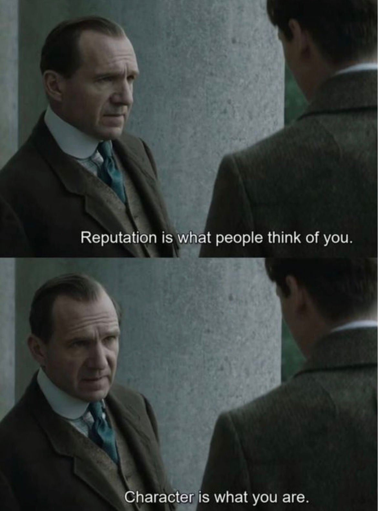

🔗 [View original post](https://x.com/yeti_mind/status/2091412647895826510)

---

### 🕐 06:25 UTC · @Wise1Philosophy

> Email marketing is having a real shift. Instead of jumping between dashboards, I can now work with my Omnisend account directly inside Claude or ChatGPT. Ask AI to analyze live performance, find revenue opportunities, review automations, build campaigns, and generate editable emails—all from a natural conversation. One feature I really appreciate is granular permissions. You decide exactly what the AI can access, including read-only mode when you only want insights without making changes. Another recent change caught my attention: Klaviyo has increased its SMS pricing, while Omnisend recently lowered its SMS prices. It&apos;s an interesting contrast in how the two platforms are approaching their customers. If you&apos;re thinking about switching, Omnisend also offers free migration in as little as 5 days, helping move your setup with minimal hassle so you can get started faster. This doesn&apos;t feel like another AI chatbot added to a SaaS. It feels like the SaaS itself has moved into AI. If you&apos;re already using Claude or ChatGPT, Omnisend MCP is definitely worth exploring: 🔗 Connect Omnisend with Claude or ChatGPT: https://your.omnisend.com/PzWPaM @Omnisend #Omnisend Media

🔗 [View original post](https://x.com/iam_chonchol/status/2091411595117432909)

---

### 🕐 06:00 UTC · @Wise1Philosophy

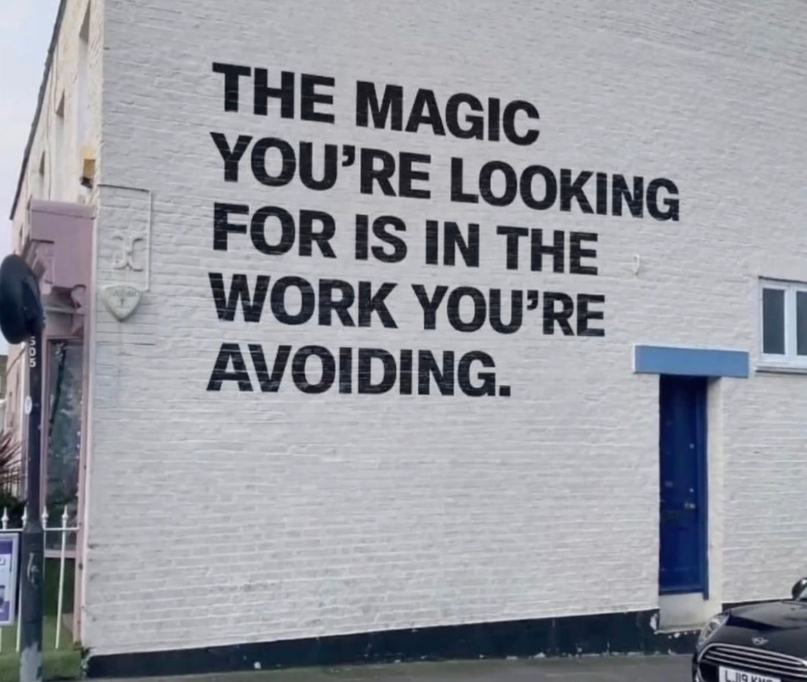

🔗 [View original post](https://x.com/Life__Mastery/status/2091405217434579201)

---

### 🕐 05:35 UTC · @Wise1Philosophy

> The humanoid Olympics are back: 2,056 robots, five days of racing, fighting, football—and actual work. 🤖🏅 The 2nd World Humanoid Robot Games just opened in Beijing: 666 teams from 16 countries, competing across 51 events. Last year had just 26. The speed jump is already ridiculous. Robots are now running the 100 m in the low-9-second range, while Tien Kung Ultra reached 2.88 m in the standing high jump. But the viral sports clips aren’t what I’m watching most. This year, autonomy matters a lot more. The 400 m, 1,500 m and relays are fully autonomous, while the 21 scenario events test robots on factory work, rescue, household tasks and dexterous manipulation. Teleoperated runs only get 0.5× scoring weight. That’s the part that makes this year much more interesting than 2025. Fast running gets attention. Staying autonomous through long, messy, real-world tasks tells us much more about which robots are actually getting closer to real deployment. Media WRC 2026 isn’t even over yet, and the 2026 World Humanoid Robot Games are already here. This is the opening ceremony rehearsal, with a formation of Tien Kung robots marching straight toward me as delegation after delegation files in behind them. Honestly, watching rows of humanoi…

🔗 [View original post](https://x.com/XRoboHub/status/2091399015971864972)

---

### 🕐 04:57 UTC · @Wise1Philosophy

> High cortisol is the real reason you wake up at 3-4 AM. It also ruins insulin, locks belly fat, raises your BPM, and literally shrinks your brain. If I wanted to fix it without medication, these are the simple rules:

🔗 [View original post](https://x.com/josh_uglyasf/status/2091389450081436055)

---

### 🕐 03:24 UTC · @Wise1Philosophy

> A Harvard biology professor said: &quot;All the supplements on the shelf are lies. Only 3 make a difference. I can bet my career &amp; life savings on it.&quot; 1) Magnesium glycinate.

🔗 [View original post](https://x.com/LongevityCode_/status/2091365950834839755)

---

### 🕐 01:30 UTC · @Wise1Philosophy

🔗 [View original post](https://x.com/Ant_Philosophy/status/2091337174809526747)

---

### 🕐 01:00 UTC · @Wise1Philosophy

🔗 [View original post](https://x.com/Mindsthatbuild/status/2091329779081351478)

---

### 🕐 00:27 UTC · @Wise1Philosophy

> In 10 years, the world splits into two groups. Economists call it the &quot;K-shaped economy&quot; and the next 2-3 years decide which line you land on. • An overclass using AI to build wealth, automate income, and move at a speed no solo human can match. • An underclass being managed by it. This isn&apos;t a forecast anymore. It&apos;s already underway. Some numbers worth sitting with: • Workers with AI skills earn 56% more than peers in the same role. That gap doubled in one year. • Companies adopting AI are generating 3x the revenue per employee. • 90% of workers haven&apos;t spent a single hour on AI training. • Goldman Sachs projects 300 million jobs touched by AI by 2028. That&apos;s roughly 24 months out. If you haven&apos;t built anything with AI yet, haven&apos;t automated one workflow, haven&apos;t used it to produce income or make yourself harder to replace, you&apos;re on the wrong line right now. That&apos;s not a dig. You can shift your trajectory today. But in six months the gap will be twice as wide. In a year, it may not be crossable. Interested in AI? Follow @AiEvolutio58513 and never fall behind. I track ChatGPT, Claude, and every tool quietly changing how we work and create, then hand you the tested signals. 15 years old. 7 AI agents. 10 projects a day, pulling in $900 a day. This isn’t one kid grinding like a machine; it’s a kid who figured out how to get a small crew working for him all at once. Claude Code writes the code. He gives it a single sentence. Every agent lives inside Op…

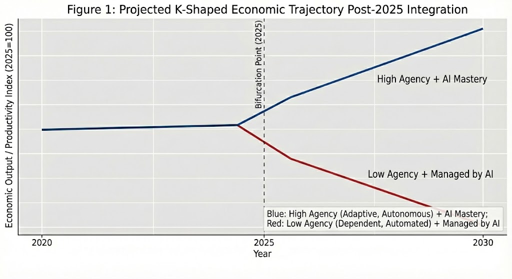

🔗 [View original post](https://x.com/AiEvolutio58513/status/2091321275281236477)

---
