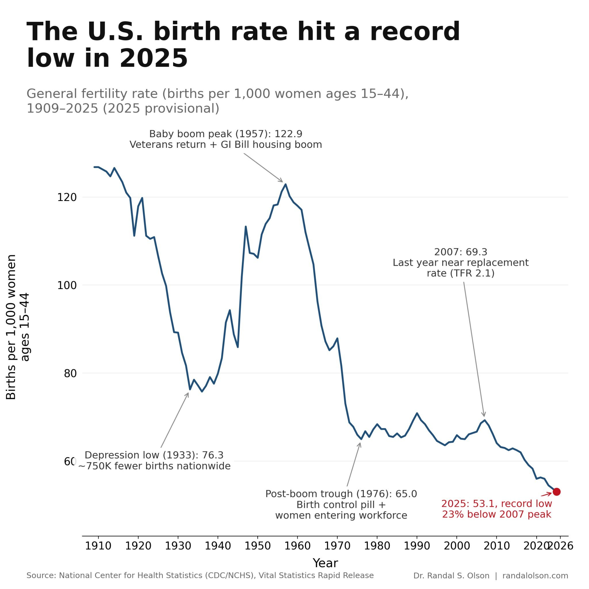
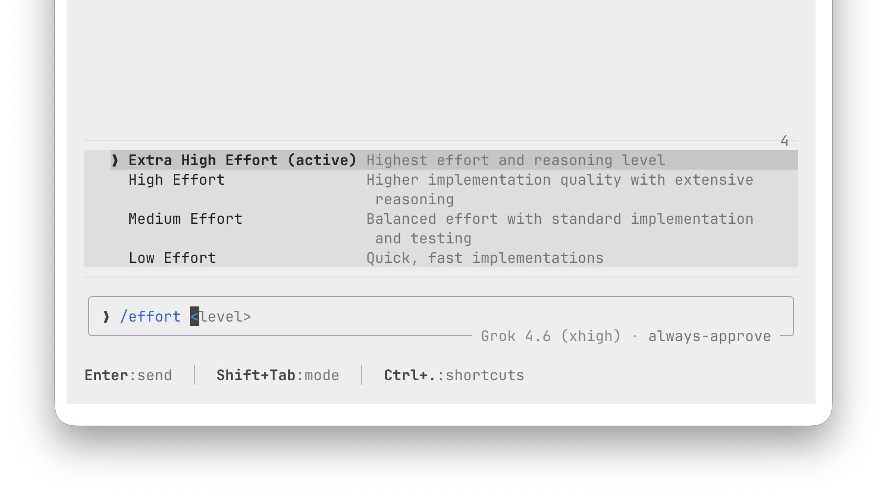
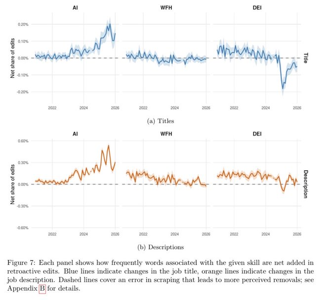
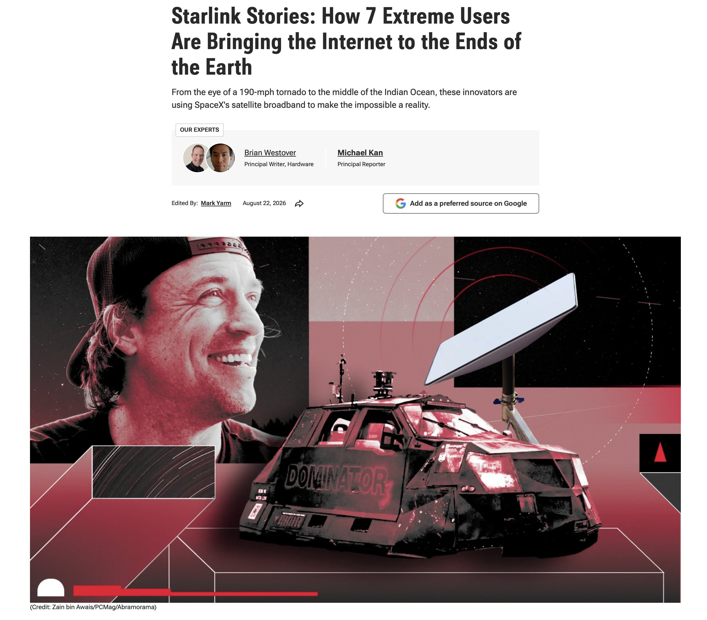
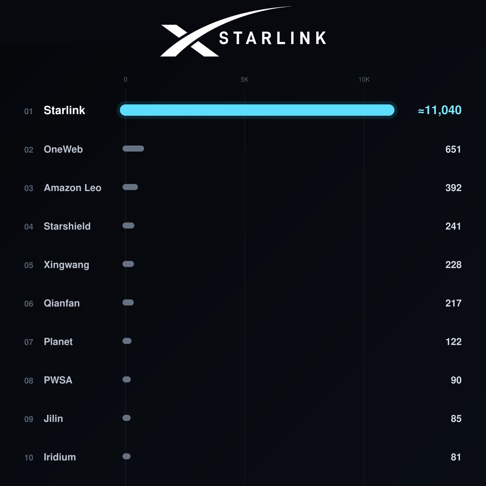

# 🐦 @elonmusk

## 📅 August 23, 2026

> 29 post(s) archived.

---

### 🕐 23:33 UTC · @elonmusk

> California has officially signed the “Stop Nick Shirley Act” (AB 2624) into law. This bill was created only after I exposed widespread fraud in immigrant communities across America, specifically in California’s Medicaid, nonprofits and other welfare programs funded by our tax dollars. These politicians need the fraud to continue and they sadly use immigrants to do so often. They fund nonprofits and NGOs with hundreds of millions of taxpayer dollars every year for immigration services, including free healthcare and have now made “immigration support service providers” essentially a protected class in California. For example, if I film a hospice or a “learing center” with no patients receiving millions through Medicaid and the owner gives me a paper saying I cannot publish the video, I cannot publish it. If I publish it to expose them and they claim it caused them “fear” or a third party threatens them, I face a minimum $4,000 civil fine plus the legal fees of the individual or group suing me. This bill was created by the Attorney General’s wife and co-sponsored by CHIRLA, a nonprofit that has received over $80,000,000 in taxpayer dollars for “immigrant support services.” Do you understand how this works yet? When the fraud is exposed, they create new laws to protect the fraudsters and penalize those who expose it. By signing this bill, the Governor and California politicians expose themselves as the corrupt politicians they are. This is not the end, the fight has just begun. More to come soon, this is far from over.

🔗 [View original post](https://x.com/nickshirleyy/status/2091670169789886554)

---

### 🕐 22:14 UTC · @elonmusk

> This chart really scares the hell out of me you can see how dramatically U.S. birth rates have fallen in just a few decades… and they’re still falling If this continues, we’re heading toward a place with far fewer children and young people, and an increasingly old population....that would be very depressing future Even if we achieve the abundance through AI, what does abundance mean if there are fewer and fewer people around to inherit the future? this is a really big problem, and it&apos;s something most people don&apos;t realize it yet and we don&apos;t really have much time until it&apos;s too late

🔗 [View original post](https://x.com/XFreeze/status/2091650376365666545)

---

### 🕐 21:44 UTC · @elonmusk

> Reminder: Grok Build has xhigh effort, and it’s insanely powerful If you want to brute-force your way through a difficult project, just type: /effort Then switch to Extra High Effort It gives Grok 4.6 its highest reasoning and implementation effort for the really hard stuff

🔗 [View original post](https://x.com/XFreeze/status/2091642814606032998)

---

### 🕐 21:44 UTC · @elonmusk

> Interesting Suspect we will start to hear about a “Pareto optimal” balance of computationally efficient humans, cheaper open-source tokens and frontier tokens. Our internal AI spend @Atreidesmgmt will be roughly 100x higher in August 2026 vs. March 2026. Still roughly doubling every month. N…

🔗 [View original post](https://x.com/elonmusk/status/2091642655264649324)

---

### 🕐 21:40 UTC · @elonmusk

> I’ve been warning about this for years people don’t realize this, but 2026 appears to be the first year in human history where humanity as a whole is below replacement fertility. this has never happened before. not during wars. not during pandemics. for the first time in human history, we are not producing enough chil…

🔗 [View original post](https://x.com/elonmusk/status/2091641789400993848)

---

### 🕐 20:34 UTC · @elonmusk

> As foretold in the prophecy Did you know Elon Musk was weirdly &quot;predicted&quot; in a Wernher von Braun book nearly 80 years ago? In his 1948 novel *Project Mars*, von Braun describes a future Martian government led by a figure called the &quot;Elon.&quot; It&apos;s not a person&apos;s name, but a title for the head of government. S…

🔗 [View original post](https://x.com/elonmusk/status/2091625211376603480)

---

### 🕐 20:05 UTC · @elonmusk

> This is why I switched Starship to stainless steel. We have since created our own new alloys and no longer use 301. Why did SpaceX choose 301 stainless steel for Starship 👇👇

🔗 [View original post](https://x.com/elonmusk/status/2091617925669245333)

---

### 🕐 19:46 UTC · @elonmusk

> Grok @Bot edited this video entirely......yes, it can edit videos too It even synced the music perfectly Media

🔗 [View original post](https://x.com/XFreeze/status/2091612968484032999)

---

### 🕐 18:23 UTC · @elonmusk

> They faced the same issues in Ancient Rome Rome handed out free grain to 40,000 citizens in 73 BC. By 46 BC, Julius Caesar found 320,000 people lining up for their monthly ration. That eight-fold expansion happened in under three decades, and it shows you how welfare states actually grow. No Roman senator stood up and ann…

🔗 [View original post](https://x.com/elonmusk/status/2091592267496907239)

---

### 🕐 18:21 UTC · @elonmusk

> Grok Bot can do amazing things! Three months later, Grok’s progress is amazing, and @bot makes it even more powerful and easier to use. This is the fidelity using the same prompt: “Explain Navier-Stokes equation and how it relates to airfoil design with actual fluid dynamics simulation.”

🔗 [View original post](https://x.com/elonmusk/status/2091591712833753456)

---

### 🕐 18:20 UTC · @elonmusk

> LinkedIn users have been editing their work histories to add &quot;AI&quot; and remove &quot;DEI&quot;.

🔗 [View original post](https://x.com/paulg/status/2091591334570397979)

---

### 🕐 17:09 UTC · @elonmusk

> Hi friends! Going to walk through Grok Bot for GTM this week, come join and we can chat about our @bot teams: https://luma.com/wb8mrs0g

🔗 [View original post](https://x.com/kristaletz/status/2091573453409472513)

---

### 🕐 16:35 UTC · @elonmusk

> AIDS is...not what we were told in high school in the 1990s. If you had condomless sex with 100 random white women, the odds of getting HIV would be 1 in 105,000. That’s before adjusting for college and lack of injection drug use, and other factors.

🔗 [View original post](https://x.com/wil_da_beast630/status/2091565066546029026)

---

### 🕐 15:55 UTC · @elonmusk

> HOLY SH*T, I BUILT A F**KING COMPANY INSIDE GROK BOT i split the operation into separate roles for research, writing, outreach, ops, finance and support. each agent owns one narrow job 6 agents → 1 shared operation → automatic handoffs → human approval each bot keeps its own workflow and memory, then passes finished work forward instead of routing everything back through me the control layer catches anything that sends, spends, publishes or deletes and pushes it into approval before anything happens after a few runs this stops feeling like ai chat. it feels like a 24/7 operations team running behind one dashboard Media

🔗 [View original post](https://x.com/gippp69/status/2091554828858069191)

---

### 🕐 14:08 UTC · @elonmusk

> Starlink Stories: From the eye of a 190-mph tornado to the middle of the Indian Ocean, these innovators are using @Starlink to make the impossible a reality. &quot;Starlink is probably our most crucial piece of equipment. It&apos;s really been a game-changer.&quot; &quot;I am a lot braver when it comes to entering foreign lands thanks to Starlink.&quot; &quot;Previously, wirelessly downloading a single AutoPath mapping file took 20 to 30 minutes of agonizing wait time, during which the tractor engine had to remain running. &quot;Every minute we&apos;re sitting there just idling the tractor is costing us money, whether in fuel or wasted, useless hours we put on the machine. With Starlink, files download almost instantly.&quot; &quot;We can save lives with a functional real-time earthquake monitoring network like the one we operate.&quot; It&apos;s worth reading these stories in the article: https://www.pcmag.com/articles/starlink-stories-7-extreme-users-bringing-the-internet-to-the-ends-of-earth

🔗 [View original post](https://x.com/SawyerMerritt/status/2091527932271292925)

---

### 🕐 11:15 UTC · @elonmusk

> Starlink has around 11,040 working satellites in orbit. The next nine largest LEO constellations combined have only about 2,100. Starlink alone is more than 5x bigger than all nine combined.

🔗 [View original post](https://x.com/cb_doge/status/2091484490141143284)

---

### 🕐 10:57 UTC · @elonmusk

> Precisely articulated One of the most eloquent explanations of immigration you’ll ever hear. Milton Friedman had an extraordinary ability to cut through the political bullshit and explain complicated issues with simple economic logic. Still relevant today. 🎯

🔗 [View original post](https://x.com/elonmusk/status/2091480040714478074)

---

### 🕐 10:45 UTC · @elonmusk

> Don’t pass on generational trauma Be a chainbreaker - Dad’s are everything ❤️

🔗 [View original post](https://x.com/elonmusk/status/2091476952280711254)

---

### 🕐 10:41 UTC · @elonmusk

> Truth is better than fiction Preorder Roll the Calls ⬇️ https://a.co/d/0gaDvahC

🔗 [View original post](https://x.com/elonmusk/status/2091476029860884897)

---

### 🕐 10:28 UTC · @elonmusk

> Exactly 1000% Just stop doing this dumb shit. If some made-up rule says you have to, just break or change it.

🔗 [View original post](https://x.com/elonmusk/status/2091472525205332124)

---

### 🕐 10:27 UTC · @elonmusk

> Yeah, that was dumb No amount of penance will suffice to stop the suicide of the West. In 2006, Pascal Bruckner diagnosed the illness as “Western masochism”, a civilization so convinced its own sins explain every problem on earth that it turns self-hatred into a strange form of narcissism. &gt;Corporat…

🔗 [View original post](https://x.com/elonmusk/status/2091472298587156988)

---

### 🕐 10:05 UTC · @elonmusk

> 🤔… 😔

🔗 [View original post](https://x.com/TheAliceSmith/status/2091466907090108823)

---

### 🕐 05:43 UTC · @elonmusk

> NICK SHIRLEY: &quot;The most powerful people in the world use 𝕏. I&apos;m able to reach the audience of people that are trying to make change in the world. The producers are on 𝕏. The people that are making changes in the world are on 𝕏.” Media

🔗 [View original post](https://x.com/teslaownersSV/status/2091400843505615236)

---

### 🕐 05:28 UTC · @elonmusk

> Curious about the journey from photons to the image or video on your phone? I made a video with Grok @bot, @imagine, and Voice explaining the physics and theory behind it—100% on my phone just chatting. Part I: photons to digital signal Part II: digital signal to pretty picture Pro tip for Grok @bot: Ask it to QA every single frame before handing it back. It saves QA time so you can focus on high-level direction. All technical visualization, including relinearization of the video footage from Grok @imagine to be physically accurate, is done by Grok @bot. Update: added more technical details with higher quality encoding for completion. Media

🔗 [View original post](https://x.com/yunta_tsai/status/2091397023484576069)

---

### 🕐 05:19 UTC · @elonmusk

> we’re having debates about datacenters and China is publicly developing superhuman robot armies what the actual hell are we doing here guys china’s AI robot just hit 14.5 m/s

🔗 [View original post](https://x.com/ArthurMacwaters/status/2091394815543898327)

---

### 🕐 02:32 UTC · @elonmusk

> Elon Musk described the mechanism that lets millions of intelligent people arrive at the same conclusion without a single independent input between them. Musk: “If your entire exposure is to legacy mainstream media, so that all your information sources are that Trump is basically Hitler, and your friend group has that same information, you have no countervailing opinion.” One source, repeated back by a friend group drawing on that same source, is a single input arriving twelve times. Agreement gets counted as evidence. A belief that has never met resistance feels, from the inside, identical to one that survived it. That is why almost nobody catches it in themselves. Musk: “Then they actually just think Trump is Hitler, even though it’s a little strange he didn’t do Hitler things the last four years.” The comparison had four years of executive power to prove itself and produced nothing. The belief held anyway. Any description of a person that survives the total absence of supporting events was never built on events. Then the same apparatus turned on the man saying it. He spent a decade celebrated as the builder of the electric car company and the rocket company that put American astronauts back in orbit from American soil. The engineering never changed. His politics did, and the coverage inverted inside a single news cycle. Output was never the variable being measured. No conspiracy is required. Outrage outperforms accuracy on every number a newsroom is graded on. Thousands of people chasing one incentive produce coordination nobody had to organize. The arrangement collapsed when the layer between the source and the reader disappeared. The person who was in the room posts it, and the correction comes from someone else who was in the room. It is louder, uglier, and far more honest. Contradiction now arrives whether you invite it or not. Even the owner of the platform gets corrected on his own posts by his own product. For most of the last century a few dozen editors decided what an entire country believed had happened that day. People accepted it as the natural order because no alternative had ever existed to measure it against. Every civilization inherits its picture of reality from whoever controls the distance between an event and the people who hear about it. That distance is now close to zero for the first time in human history. The filter is gone and it cannot be rebuilt. What you believe is finally yours. Media

🔗 [View original post](https://x.com/r0ck3t23/status/2091352963600060888)

---

### 🕐 01:14 UTC · @elonmusk

> The Bolsheviks killed more ppl &amp; committed more acts of systematic mass murder &amp; pure horror than any other group in the 20th century. Yet it is nothing more than a footnote in our schools. We are taught that “we won the cold war,” but the truth is we were defeated from within. Media

🔗 [View original post](https://x.com/ClassicLearner/status/2091333264971563501)

---

### 🕐 01:14 UTC · @elonmusk

> A French writer explained the error in 1850. A Nobel economist repeated it in a Pennsylvania lecture hall in 1978. Governments still make it every year. Almost nobody watches the clip. This is Milton Friedman on the parable of the broken window, the oldest mistake in economics. The trick is that the destruction is visible and the cost is not. You see the glazier get paid. You never see what the shopkeeper would have bought instead. Watch how he sets it up before he names the fallacy. He lets the audience agree with the wrong answer first. 176 years of warnings. Still the most persuasive bad idea in politics. Media

🔗 [View original post](https://x.com/0gMirren/status/2091333126614065614)

---

### 🕐 00:22 UTC · @elonmusk

> A world with zero discrimination would still produce wildly unequal group outcomes. Thomas Sowell demonstrated how firstborn sons score higher on IQ tests and land more prestigious careers than their younger brothers, but nobody blames discrimination for that gap. Canadian junior hockey shows that players born January through March dominate the leagues because the January 1 cutoff makes them the oldest and strongest kids in every age group. Overseas Chinese communities run retail across Southeast Asia, Lebanese merchants dominate trade in West Africa, and German immigrants once owned the American brewing industry. Same specialization repeats under completely different majorities and legal systems. Treating every disparity as automatic proof of discrimination starts with the wrong diagnosis, and the wrong diagnosis never delivers the right cure. But the fantasy that some planner can just rearrange people like chess pieces and force equal results remains one of the most stubborn fallacies in economics. Media

🔗 [View original post](https://x.com/Rothmus/status/2091320021653852309)

---
