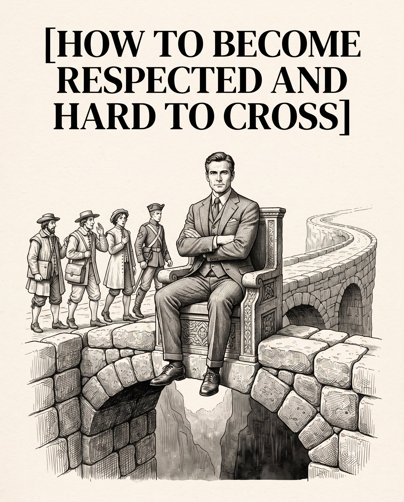

# 🐦 @theendeavorpath

## 📅 August 23, 2026

> 3 post(s) archived.

---

### 🕐 11:01 UTC · @theendeavorpath

> 8. Become Comfortable Being Alone If you cannot sit with yourself in peace, you will settle for anyone just to avoid temporary loneliness. Example: You spend a Friday night completely by yourself, reading or building your skills, and actually enjoy the quiet. Real Talk: When you enjoy your own company, nobody has the power to hold you hostage.

🔗 [View original post](https://x.com/theendeavorpath/status/2091481028192043308)

---

### 🕐 11:01 UTC · @theendeavorpath

> 7. Stop Seeking Instant Validation The moment you stop posting or talking about every move you make, your focus sharpens and your power multiplies tenfold. Example: You start a new project. Instead of telling everyone on social media, you work on it secretly until it is finished. Real Talk: Move in silence. Let the final result shock the room.

🔗 [View original post](https://x.com/theendeavorpath/status/2091481024098431144)

---

### 🕐 11:01 UTC · @theendeavorpath

> HOW TO BECOME RESPECTED AND HARD TO CROSS:

🔗 [View original post](https://x.com/theendeavorpath/status/2091480992091717922)

---
