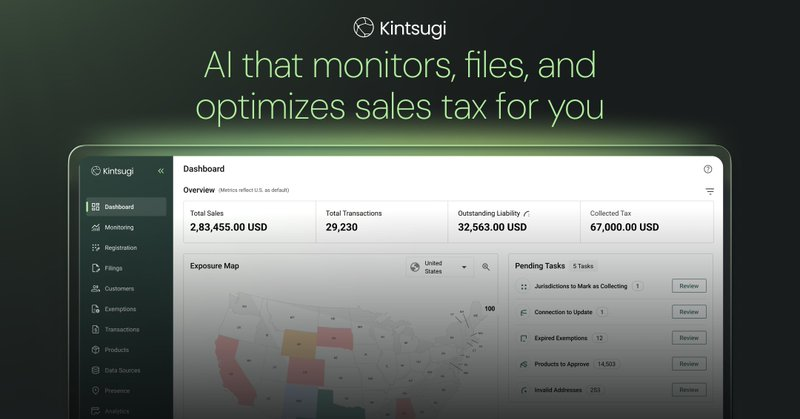
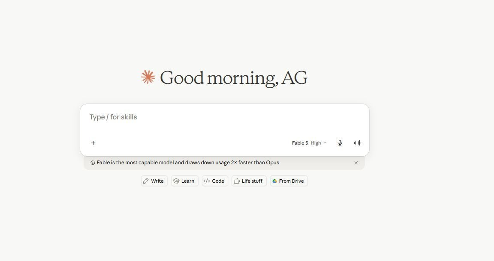
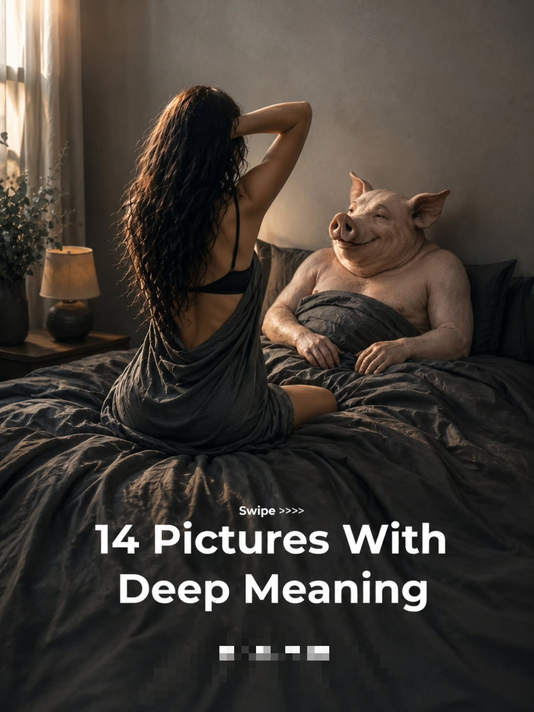
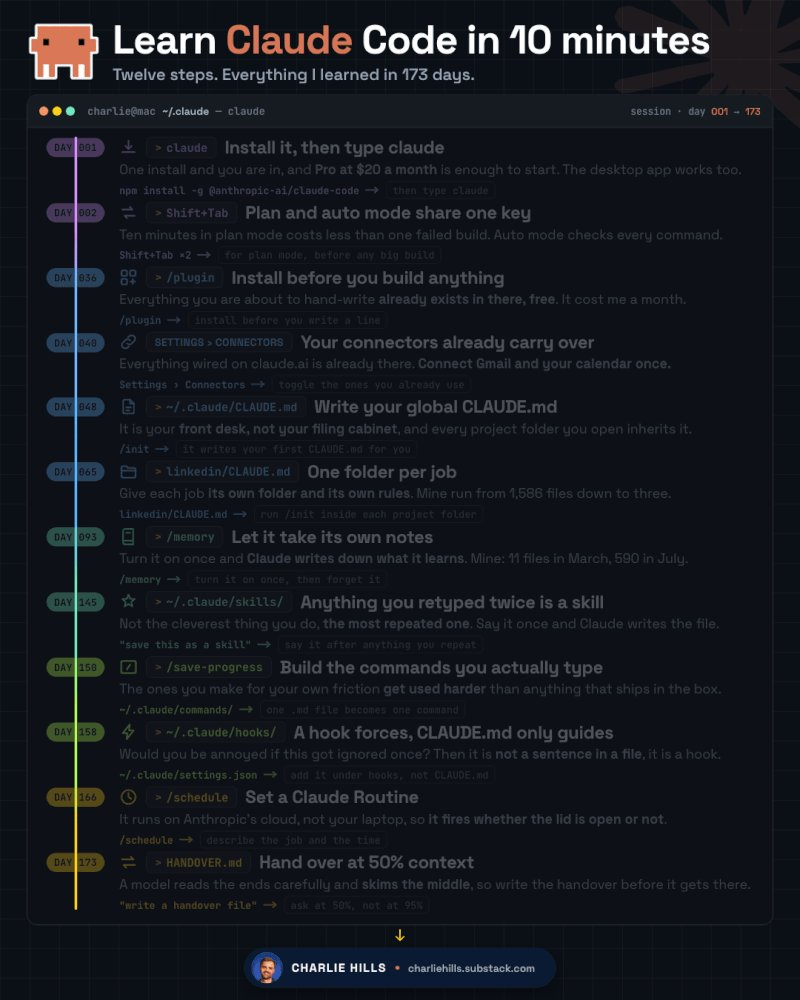
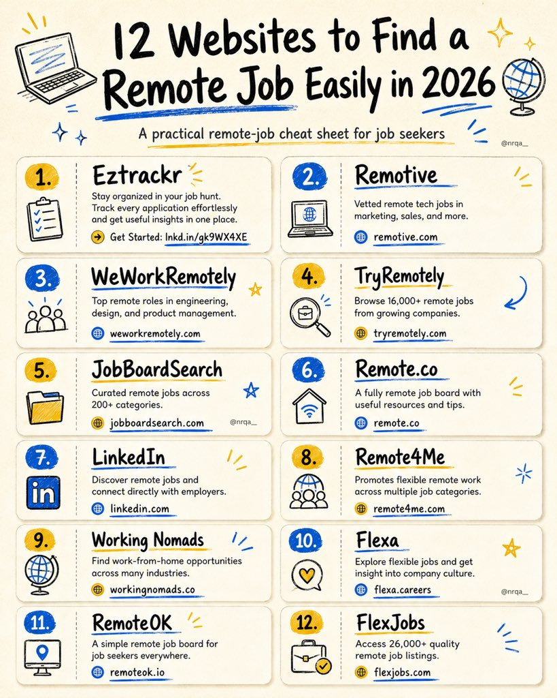
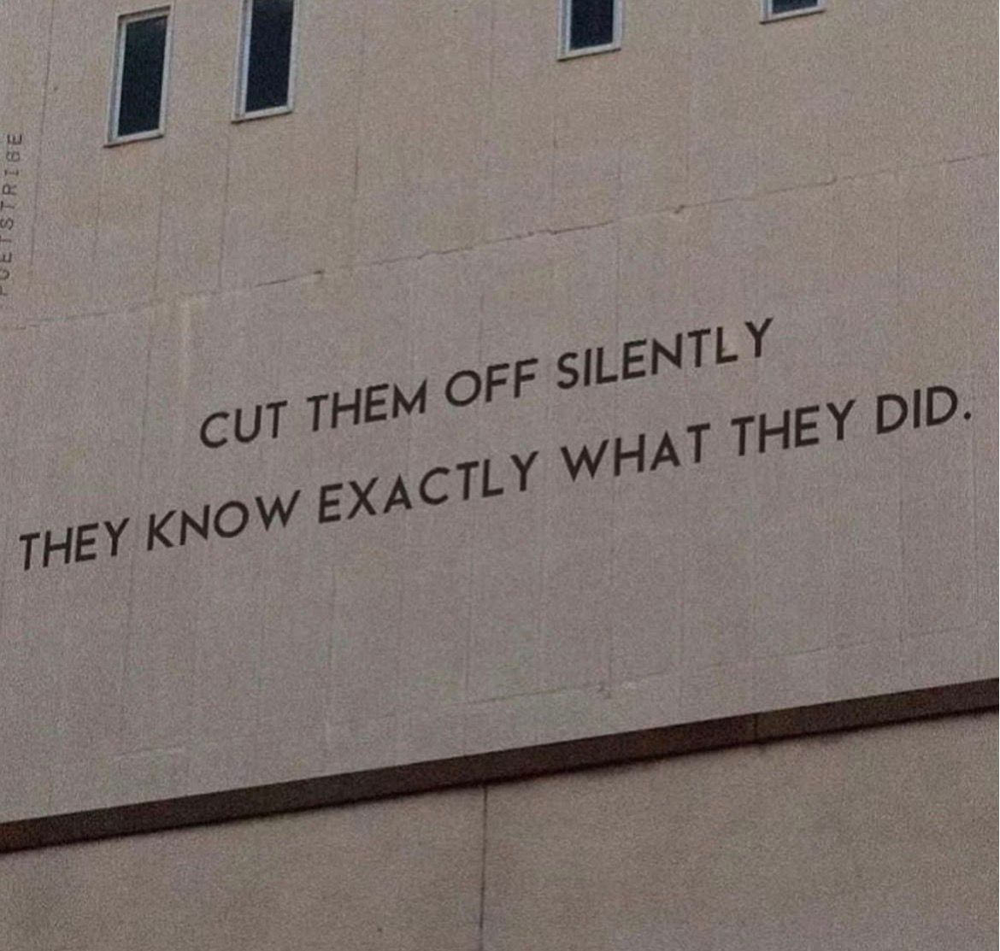
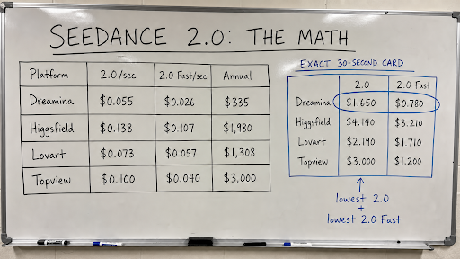
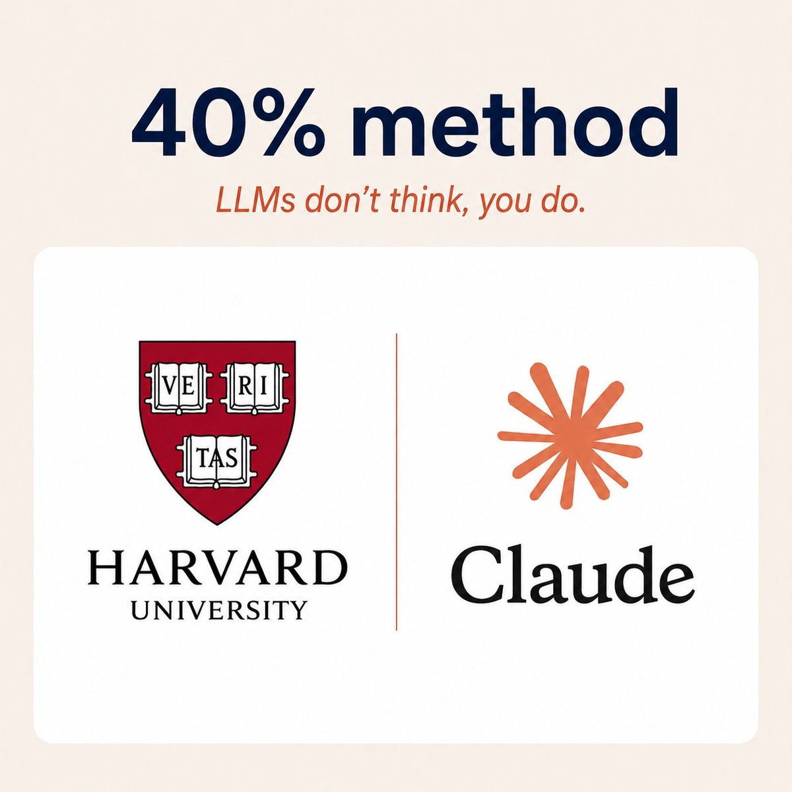
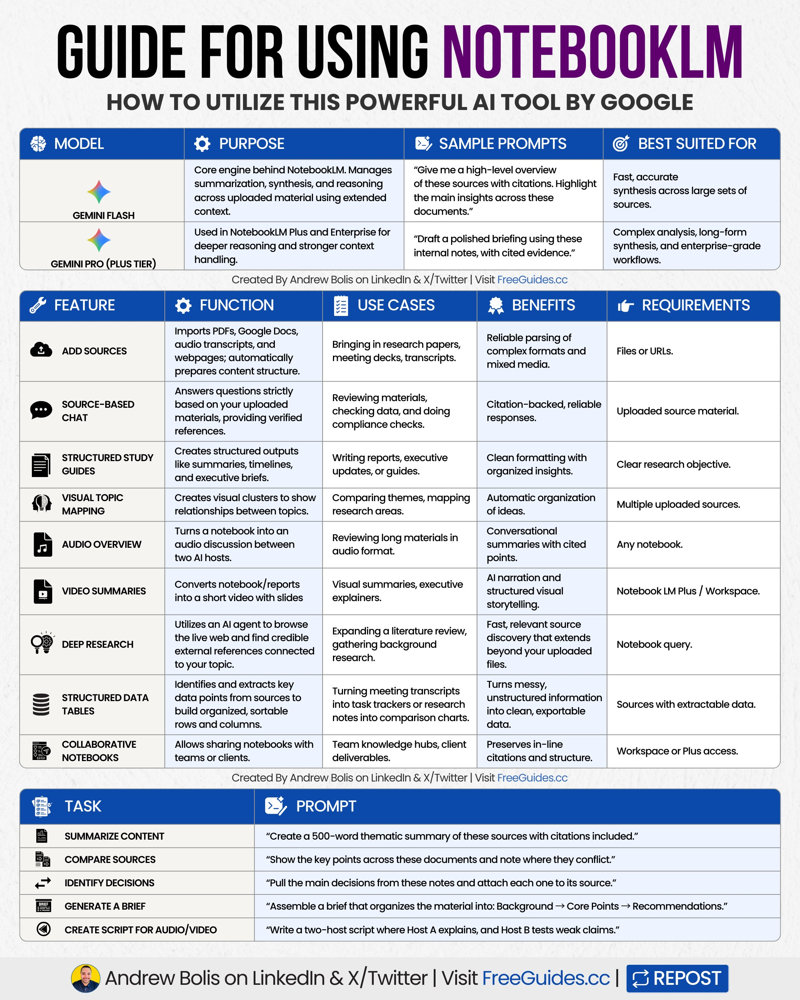
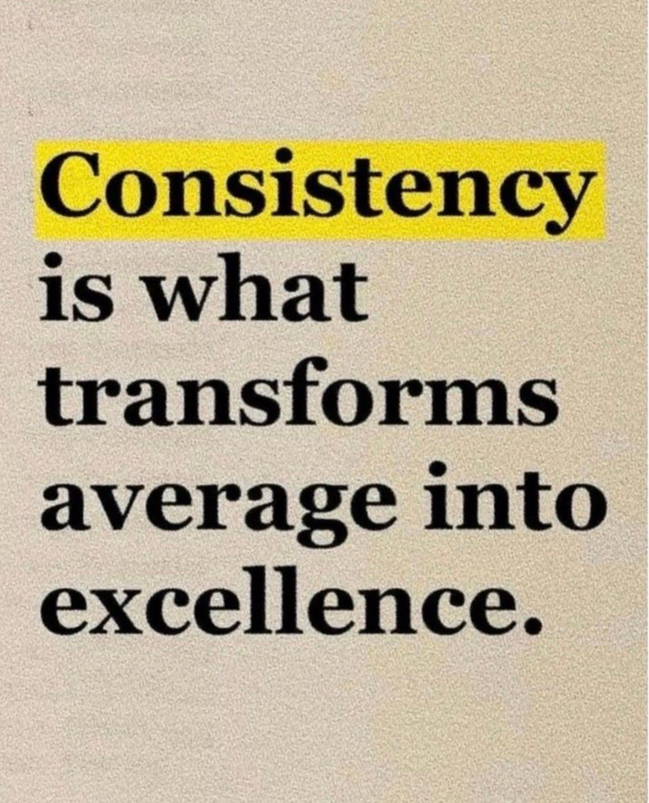

# 🐦 @Wise1Philosophy

## 📅 August 24, 2026

> 123 post(s) archived.

---

### 🕐 19:17 UTC · @Wise1Philosophy

> Anthropic&apos;s CEO: &quot;CODING IS GOING AWAY FIRST, THEN ALL OF SOFTWARE ENGINEERING&quot; Media

🔗 [View original post](https://x.com/AiEvolutio58513/status/2091968281490116841)

---

### 🕐 19:03 UTC · @Wise1Philosophy

> a must-read on production-grade AI agents: Most companies are stuck in what the industry is now calling &quot;Death Valley&quot; between POC and production. 99% of companies say they&apos;re deploying AI agents. 9% have. OpenAI&apos;s own enterprise data shows agentic products now account for 64% of corporate output tokens. The demand is mas…

🔗 [View original post](https://x.com/alex_prompter/status/2091964678595338408)

---

### 🕐 19:00 UTC · @Wise1Philosophy

> Most companies are stuck in what the industry is now calling &quot;Death Valley&quot; between POC and production. 99% of companies say they&apos;re deploying AI agents. 9% have. OpenAI&apos;s own enterprise data shows agentic products now account for 64% of corporate output tokens. The demand is massive, but the engineering to support it barely exists. We&apos;ve shipped 14 production agent systems in the last 12 months across healthcare and financial services. The same four engineering gaps kill the other 90%. [1] Nobody builds a code graph, so the agent can&apos;t see how the codebase connects. It hallucinates function calls and invents APIs that don&apos;t exist. [2] Nobody builds a knowledge base, so the agent has no access to internal docs or domain context. It answers from training data instead of yours. [3] Nobody closes the feedback loop, so production errors go unlogged. The agent makes the same mistake on Tuesday that it made on Monday. [4] Nobody builds approval gates, so the agent takes irreversible actions before anyone reviews them. One bad output goes to a customer before anyone catches it. Every failed agent deployment I&apos;ve seen died at the engineering layer. We built what we call the Velocity Framework at @LimestoneHQ: code graph and knowledge base so the agent knows your system, feedback loops and approval gates so the agent learns and stays safe. A forward-deployed engineer builds it, trains the team to run it, and leaves. From day 31, the agent compounds domain knowledge with each customer interaction. The bridge across Death Valley is four pieces of engineering. 91% of companies haven&apos;t crossed it yet.

🔗 [View original post](https://x.com/mardehaym/status/2091963865718231069)

---

### 🕐 18:20 UTC · @Wise1Philosophy

> We&apos;ve had model benchmarks for years. But Agent benchmarks are a different story. Everyone runs a custom agent setup, so every comparison ends with: &quot;well... it depends&quot; @agentsky_dev kills that excuse: → same task → same browser → same tools All side-by-side 🔥↓ I ran the same task on Claude Code and DeepSeek&apos;s new agent harness. One cost $150. The other cost $2. Today we&apos;re launching http://AgentSky.dev (@agentsky_dev), the &quot;OpenRouter for Agents&quot; — one API → Claude Code, Codex, DeepSeek, Kimi, OpenCode, and every major agent in the clo…

🔗 [View original post](https://x.com/DataChaz/status/2091953686431862791)

---

### 🕐 17:56 UTC · @Wise1Philosophy

> ChatGPT could make you over $5,000 a month. No job. No face. Just 2 prompts. Here’s how:

🔗 [View original post](https://x.com/AriaWestcott/status/2091947847436398609)

---

### 🕐 17:45 UTC · @Wise1Philosophy

> This is the kind of prompt library I’d actually bookmark. Not just a pile of recycled prompts. Inspia curates image and video prompts for designers and visual creators, built for real creative work with GPT Image, Nano Banana, Midjourney, Seedance, Kling, Seedream, and more. Prompts you can copy, customize, and use straight away. The library follows what’s trending on Instagram, X, and TikTok, so you’re ready before the next project starts. No sign-up. No subscription. Completely free. https://inspia.ai is a free prompt library for designers and visual creators &gt; High-quality prompts for #GPTImage, #NanoBanana, #Seedance, #Midjourney, #Kling, and #Seedream &gt; Continuously curating trending #prompts everyday &gt;For ads, products, 3D, posters and portraits

🔗 [View original post](https://x.com/Damn_coder/status/2091945034300231924)

---

### 🕐 17:39 UTC · @Wise1Philosophy

> 6 signs your body desperately needs magnesium (&amp; you don&apos;t realize it): 1. Random muscle cramps Media

🔗 [View original post](https://x.com/DPro_Coach/status/2091943419904229842)

---

### 🕐 17:28 UTC · @Wise1Philosophy

> WHEN YOU GET RICH, UPGRADE THESE 15 THINGS ASAP:

🔗 [View original post](https://x.com/josh_uglyasf/status/2091940657955033315)

---

### 🕐 17:25 UTC · @Wise1Philosophy

> Al video just got a lot cheaper to experiment with. Wan 3.0 is now live on @TopviewAIhq , and Ultra Annual users get 365 days of unlimited generations. And the pricing makes the difference even clearer: Wan 3.0 → $1.20 / 30s Seedance 2.5 → $3.60 / 30s Same 30-second generation. 1/3 of the cost. That means you can test more ideas, generate more variations, and iterate without constantly thinking about how fast your credits are disappearing. More generations. Less hesitation. More room to create. Media Wan 3.0 is now on Topview. More value. Longer unlimited access. Lower cost. With Ultra Annual, generate 30s videos with Wan 3.0 for just $1.20. Plus, get 365 days of unlimited generations. That’s 1/3 the cost and 6x longer unlimited access compared to Seedance 2.5. Create more AI…

🔗 [View original post](https://x.com/MasculineM7/status/2091939891299209461)

---

### 🕐 17:21 UTC · @Wise1Philosophy

> Stop building AI agents from scratch. These 13 open source GitHub repos are free to use: 1. Browser Use Let AI agents browse websites and complete tasks online. https://github.com/browser-use/browser-use 2. OpenHands Build coding agents that edit files, run commands and work across repositories. https://github.com/OpenHands/OpenHands 3. Agno Create agents with memory, knowledge, tools and team workflows. https://github.com/agno-agi/agno 4. smolagents Hugging Face’s lightweight framework for agents that write and execute code. https://github.com/huggingface/smolagents 5. Pydantic AI Build reliable AI agents with structured outputs and type safety. https://github.com/pydantic/pydantic-ai 6. CrewAI Create specialized AI agents that collaborate on complex tasks. https://github.com/crewAIInc/crewAI 7. LangGraph Build agent workflows with memory, state and more precise control. https://github.com/langchain-ai/langgraph 8. AutoGen Microsoft’s original multi agent framework. Now in maintenance mode. https://github.com/microsoft/autogen 9. LlamaIndex Connect AI agents to documents, databases and private knowledge. https://github.com/run-llama/llama_index 10. Mastra A TypeScript framework for agents, workflows, tools and memory. https://github.com/mastra-ai/mastra 11. Letta Build agents that remember information across conversations. https://github.com/letta-ai/letta 12. Cline An AI coding agent that works inside your IDE or terminal. https://github.com/cline/cline 13. Aider An AI pair programmer that works directly with your Git repositories. https://github.com/Aider-AI/aider Save this for your next build.

🔗 [View original post](https://x.com/AIHighlight/status/2091938998788702437)

---

### 🕐 17:18 UTC · @Wise1Philosophy

> Your body will forgive you for: -Skipping a workout -Eating pizza -Sleeping poorly one night -Losing motivation Your body WILL NOT forgive you for:

🔗 [View original post](https://x.com/BeBetterMan_/status/2091938271396012172)

---

### 🕐 17:17 UTC · @Wise1Philosophy

> Cardio is a scam for fat loss. It&apos;s boring, leads to overeating, and barely burns any calories. Summer 2026 is almost over. Here are 9 cheat codes that actually burns fat: 1. Don&apos;t eat breakfast Media

🔗 [View original post](https://x.com/CoachWillStone/status/2091938041447563573)

---

### 🕐 17:14 UTC · @Wise1Philosophy

> Most DTC founders think Shopify handles their sales tax. It doesn&apos;t. What Shopify actually does: - Collects tax at checkout (sometimes) - Shows you a report What Shopify doesn&apos;t do: - Register you when you hit nexus in a new state - File your returns - Tell you you&apos;re 8 months late in Illinois - Split marketplace vs direct channel liability - Defend you in an audit The gap between &quot;Shopify collects tax&quot; and &quot;you&apos;re actually compliant&quot; is where six-figure liabilities live. Most founders don&apos;t find out until they raise, sell, or get a love letter from a state DOR. Check before the state checks for you… @kintsugi_ai was built to close that gap for DTC brands. Free nexus check + 3 months on me at https://trykintsugi.com

🔗 [View original post](https://x.com/ecomchasedimond/status/2091937320887075308)

---

### 🕐 16:42 UTC · @Wise1Philosophy

🔗 [View original post](https://x.com/free_ai_guides/status/2091929163083264284)

---

### 🕐 16:17 UTC · @Wise1Philosophy

> Japanese scientists just discovered shocking news about grey hair. It’s literally your body choosing survival over cancer. Here’s everything you need to know (&amp; how to keep your hair dark):

🔗 [View original post](https://x.com/TheFastedState/status/2091922866728063483)

---

### 🕐 16:14 UTC · @Wise1Philosophy

> If your child is between 6 and 10 neuroscience says you&apos;re in the last major brain-wiring window before adolescence. What gets built now shapes the next 30 years. Here are the 5 things getting wired in right now... 👇🧵

🔗 [View original post](https://x.com/scotti_brooks/status/2091921979670770062)

---

### 🕐 16:13 UTC · @Wise1Philosophy

> Period blood is the one thing women are taught is &quot;Dirty&quot; and &quot;Impure&quot;. In 2004 scientists found STEM cells in it that are x 10 more effective than bone marrow STEM cells and that&apos;s not the only discovery they made. Here&apos;s the truth about period blood no one wants to talk about

🔗 [View original post](https://x.com/Manifest_Lord/status/2091921743946592614)

---

### 🕐 16:11 UTC · @Wise1Philosophy

> A humanoid robot built by Honor just ran 100m in 9.32 seconds at the World Humanoid Robot Games in Beijing. That breaks Usain Bolt&apos;s 100m world record of 9.58 seconds. This same robot won the Beijing half marathon back in April, beating elite human record pace over 21km. Media

🔗 [View original post](https://x.com/TheAIColonyRD/status/2091921375787176358)

---

### 🕐 16:09 UTC · @Wise1Philosophy

> 🚨 BREAKING: Elon Musk says Starlink will soon run on a single account that covers your home internet and your phone. High-speed internet beamed directly from satellite to your phone. No cell towers, no carriers, no middlemen. If it works as promised, dead zones stop existing. You could stream HD video from the middle of the ocean, a desert, or anywhere on the planet. SpaceX isn’t just competing with internet providers anymore. It’s coming for the entire telecom industry. https://x.com/Yerocode0/status/2090651221472207047/video/1 Media

🔗 [View original post](https://x.com/FutureStacked/status/2091920931513905264)

---

### 🕐 16:05 UTC · @Wise1Philosophy

> This robot in China just scored a free kick and hit Cristiano Ronaldo’s SIUUU celebration perfectly. Media

🔗 [View original post](https://x.com/TheAIColony/status/2091919825467473991)

---

### 🕐 15:57 UTC · @Wise1Philosophy

> A marketing manager used ChatGPT and Claude roughly 15 times per day. Every conversation started the same way: &quot;I&apos;m a marketing manager at a B2B SaaS company. We sell project management software to mid-size businesses. Our target audience is operations directors. Our brand voice is professional but approachable. Our main competitor is Monday com.&quot; He&apos;d typed some version of this paragraph 500 times across 2 years. Pasted it into new chats. Recited it from memory. Explained himself to an AI that had already heard it hundreds of times but couldn&apos;t remember because he&apos;d never configured the one setting that makes it permanent. His intern a 22-year-old who&apos;d grown up customizing every app on every device looked at his screen one afternoon and said: &quot;You&apos;re using a $20/month personalized AI assistant as an anonymous search engine. Both ChatGPT and Claude remember you now. Both build on previous conversations. Both can be customized to your exact role, your style, and your projects. You just never told them to.&quot; She spent 20 minutes showing him 11 features across both platforms. When she finished, every future conversation on both ChatGPT and Claude started with the AI already knowing his name, his company, his audience, his competitors, and his writing voice. He never typed the paragraph again. Here&apos;s the full playbook 🧵

🔗 [View original post](https://x.com/jackcoder0/status/2091917778651644313)

---

### 🕐 15:51 UTC · @Wise1Philosophy

🔗 [View original post](https://x.com/alex_verem/status/2091916356673495313)

---

### 🕐 15:38 UTC · @Wise1Philosophy

> this is the best engineering team I&apos;ve come across: PTI Security needed one platform rebuilt. 40,000 facilities running on legacy infrastructure since 1979. We shipped four products with eight engineers, every line of code written by hand. This was 2021, pre-AI, before agents or co-pilots touched production code. I want to walk th…

🔗 [View original post](https://x.com/alex_prompter/status/2091912988487823742)

---

### 🕐 15:33 UTC · @Wise1Philosophy

> PTI Security needed one platform rebuilt. 40,000 facilities running on legacy infrastructure since 1979. We shipped four products with eight engineers, every line of code written by hand. This was 2021, pre-AI, before agents or co-pilots touched production code. I want to walk through this one because nearly five years later, we&apos;re still there. StorLogix Cloud ran access, zones, alarms, and device monitoring for self-storage facilities across the country. Real security systems, real operations, running 24/7. Brownfield, not a demo. We started September 2021 and didn&apos;t write code for weeks. Product assessment came first: user research, personas, wireframes, a design system from scratch. We mapped the gaps before touching the codebase. Then we rebuilt StorLogix Cloud 2.0 from the ground up. Their CTO, Nathan Davenport, said we &quot;monumentally improved the platform&apos;s loading speed.&quot; During the rebuild, we found three products PTI didn&apos;t know they needed: a tenant app replacing the legacy mobile experience, an installer tool for commissioning smart locks in the field, and an admin portal for managing the business side. We didn&apos;t pitch those. Didn&apos;t upsell them. The first job earned us the next one, and the next one after that. Every pull request was a human building it and a human challenging it. Nathan Davenport left a 5.0 on Clutch. Called us &quot;experienced, highly skilled, and adaptive.&quot; Then ASSA ABLOY acquired PTI. New ownership reviewed every contract, vendor, and line item. Our @LimestoneHQ team was part of what they kept. Nearly five years, same team still shipping. The tools changed. The standard didn&apos;t.

🔗 [View original post](https://x.com/mardehaym/status/2091911838174789924)

---

### 🕐 15:33 UTC · @Wise1Philosophy

> My best friend started taking zinc in the morning, magnesium at night, and vitamin D+K2 with breakfast after his doctor told him to. He stuck with it for 30 days. Then... no kidding his personality did a complete 180

🔗 [View original post](https://x.com/_Gut_Laboratory/status/2091911775264350481)

---

### 🕐 15:26 UTC · @Wise1Philosophy

> Now that they&apos;ve added Fable 5 to Claude&apos;s regular subscriptions, it&apos;s worth remembering: Buried inside thousands of lines of system instructions is one of the clearest explanations we&apos;ve seen of how Claude decides which websites to search, open, cite and recommend. It also helps explain why some businesses repeatedly appear in Claude while others don&apos;t. Let’s go through it. And to see whether Claude, ChatGPT, Google AI, Perplexity and Grok are recommending your business right now, start here (it&apos;s free): https://seo-stuff.com/free-audit So, to be clear, Anthropic did not publish this as an official Claude ranking guide. Rather, the prompt was extracted and published by a public system-prompt archive. That said, the search process is specific enough to show how Claude discovers and evaluates sources. The first major revelation is fairly straightforward: when Claude searches the web, its search tool returns 10 highly ranked results for that individual search. The prompt does not say these are specifically Google’s top 10 results, and Claude can run multiple searches using different queries, but it does confirm that ranked search visibility plays a major role in determining which websites Claude encounters. Claude starts with a relatively small group of pages that a search engine has already ranked highly, so if your page never enters those groups, Claude may never open, evaluate or cite it for that question. This is why traditional search visibility still matters so much for AI search. https://seo-stuff.com Claude then applies another layer. The prompt tells it to begin with short, broad searches, generally between one and six words, before narrowing the query when necessary. That could mean searches like “best payroll software,” “dental marketing agency,” “business insurance companies” or “CRM for contractors.” Claude may take one detailed customer question and investigate it through several shorter searches. Your website therefore needs to make it extremely obvious what your company does, which category it belongs to, who it serves, what problems it solves and which products or services it should be compared against. You need pages that map to the different ways buyers describe your category, use case, problem and desired outcome. The prompt also instructs Claude to search the live web when a question involves current information, newer products, unfamiliar companies, specific versions or recommendations that may have changed. That means businesses cannot depend entirely on what Claude learned during training. Current pricing, product information, comparisons, reviews, case studies and third-party mentions all matter. A company missing from Claude’s existing knowledge can still become one of the sources it discovers today. This is where SEO Stuff’s done-for-you package becomes relevant: https://seo-stuff.com/gold-plan-package It combines 10 AI search optimized pieces of content with three DR50+ contextual PR backlinks. The content gives Claude more category, use-case and comparison pages to discover, while the backlinks help those pages compete inside the ranked search layer Claude uses to build its source pool. But ranking is only the first step, because Claude’s prompt says search snippets are often insufficient. After identifying a potentially useful result, Claude is instructed to open the page and retrieve its full content. The page still needs to contain usable evidence. Basically, that means question-based headings, direct answers, clear definitions, comparison tables, dates, named products, authorship, original research and transparent sourcing. Pages filled with vague marketing language give Claude very little to work with, whereas pages organized around specific questions and factual answers give it passages that can actually support a response. The system prompt also tells Claude to favor original sources, including company websites, official documentation, government sources, peer-reviewed research and primary reports. That means your own website can absolutely become the source Claude cites, but it needs to contain original information worth citing. That could include actual pricing, product specifications, original research, industry data, customer results, methodologies, policies, case studies, expert explanations and documentation. This becomes even more important for recommendations and comparisons. A simple factual question may require one search, while an open-ended buying question can trigger several searches across different products, categories and sources. A connected group of relevant pages gives Claude several ways to encounter your business during the same research process. Claude also does not automatically trust every commercial page it finds, so a page claiming your company is the best option is not enough. Your website can explain what you offer and why it is different, while trusted third-party sources help verify those claims. Relevant press coverage, industry mentions, expert quotes, reviews, podcasts and backlinks can all create additional evidence around the brand. The practical goal is to become visible inside the ranked systems Claude searches while building enough outside validation to make your claims credible. The prompt also says Claude must cite specific claims drawn from web searches, and that has major implications for how content should be written. Claude needs clear passages answering questions like how much the product costs, who it is designed for, what makes it different, what results customers have achieved and what evidence supports the company’s claims. The easier those answers are to locate, the easier it becomes for Claude to cite the page. Think of these as claim-sized content blocks. One clear question, one direct answer, one supporting fact and one source or piece of evidence. That is far more useful to Claude than 1,500 words of general brand copy. There is one more important layer: Claude can personalize recommendations using information it knows about the user. The company it recommends may change depending on industry, company size, location, budget, use case, technical requirements and previous preferences. This is why targeting a broad phrase like “best software” or “best agency” is rarely enough. You need pages that clearly explain who the offering is best for. That could mean “best accounting software for agencies,” “best insurance provider for multi-location businesses” or “best CRM for home service companies.” The more clearly your pages connect the offering to a specific buyer, the easier it becomes for Claude to justify recommending it to that person. All of this is the system SEO Stuff was built around: https://seo-stuff.com And to see whether your business is already being recommended across Claude, ChatGPT, Google AI, Perplexity and Grok, check here: https://seo-stuff.com/free-audit Google is now literally telling businesses specifically how to get traffic from AI Search. Yes, directly within Google Search Console. It&apos;s probably one of the most important marketing updates of 2026. Let’s go through it. By the way, you can see whether your business is appearin…

🔗 [View original post](https://x.com/alexgroberman/status/2091910002315518357)

---

### 🕐 15:20 UTC · @Wise1Philosophy

> Generation cost is a creativity tax. At $3.60 per 30-second clip you think twice before rerolling a shot. At $1.20 you stop counting. That&apos;s the shift in Topview putting Wan 3.0 on Ultra Annual: $1.20 per 30s generation, with 365 days of unlimited on top. Their Seedance 2.5 tier runs $3.60 per 30s with a 60-day unlimited window. Same output length, a third of the price, 6x the unlimited access. Production AI video is an iteration game. The keeper is rerolls deep, and pricing that lets you fail cheap does more for your output than another benchmark win. The rates are @TopviewAIhq&apos;s published numbers. The iteration math is on you. Media Wan 3.0 is now on Topview. More value. Longer unlimited access. Lower cost. With Ultra Annual, generate 30s videos with Wan 3.0 for just $1.20. Plus, get 365 days of unlimited generations. That’s 1/3 the cost and 6x longer unlimited access compared to Seedance 2.5. Create more AI…

🔗 [View original post](https://x.com/alex_verem/status/2091908560045117660)

---

### 🕐 15:20 UTC · @Wise1Philosophy

> BREAKING: These 10 careers will quietly dominate the next 10 years. Most people won’t notice until it’s too late. The people learning these skills today will be impossible to ignore by 2030:

🔗 [View original post](https://x.com/AIFrontliner/status/2091908466566676641)

---

### 🕐 15:17 UTC · @Wise1Philosophy

> The pricing math on this launch is worth a look. Wan 3.0 on Topview&apos;s Ultra Annual plan: $1.20 per 30-second generation, plus 365 days of unlimited generations. Seedance 2.5 on the same platform: $3.60 per 30 seconds, with a 60-day unlimited window. Same clip length. A third of the cost. 6x the unlimited access. The number that matters here is cost per attempt. AI video is a reroll game: the first generation is a draft, and the model you can afford to rerun 10 times beats the one you baby through 3 tries. Those are @TopviewAIhq&apos;s published rates. At $0.04 per second, testing an idea stops being a budget decision. Media Wan 3.0 is now on Topview. More value. Longer unlimited access. Lower cost. With Ultra Annual, generate 30s videos with Wan 3.0 for just $1.20. Plus, get 365 days of unlimited generations. That’s 1/3 the cost and 6x longer unlimited access compared to Seedance 2.5. Create more AI…

🔗 [View original post](https://x.com/alex_prompter/status/2091907737462411637)

---

### 🕐 15:15 UTC · @Wise1Philosophy

> Wan 3.0 acaba de llegar a @TopviewAIhq y hay un dato que me parece una locura. Misma generación de vídeos de 30 segundos que Seedance 2.5, pero a 1/3 del coste. - Seedance 2.5 → $3,60 / 30s + 60 días ilimitados - Wan 3.0 → $1,20 / 30s + 365 días ilimitados Es decir, Wan 3.0 sale 3 veces más rentable y, además, los usuarios Ultra Annual tienen un año completo de generaciones ilimitadas. Para quien genera vídeos con IA a escala, la diferencia puede ser enorme. Media Wan 3.0 is now on Topview. More value. Longer unlimited access. Lower cost. With Ultra Annual, generate 30s videos with Wan 3.0 for just $1.20. Plus, get 365 days of unlimited generations. That’s 1/3 the cost and 6x longer unlimited access compared to Seedance 2.5. Create more AI…

🔗 [View original post](https://x.com/MiguelMaestroIA/status/2091907144912142680)

---

### 🕐 15:13 UTC · @Wise1Philosophy

> Peptides are the most underrated tool for skin aging. This 7-compound stack targets skin where no topical can reach. Here&apos;s the breakdown:🧵

🔗 [View original post](https://x.com/MindsetFreek/status/2091906668208541855)

---

### 🕐 15:08 UTC · @Wise1Philosophy

> ¿Odyssey + Game of Thrones… pero generado con IA? ⚔️ Creé la misma batalla épica con Seedance 2.0 y Seedance 2.5 para ver cuánto ha evolucionado el video con IA. Mismo concepto. Dos generaciones. Una diferencia enorme. Mira el resultado 👇 #flovaai #flovaskill #seedance25 Media

🔗 [View original post](https://x.com/Alex_Inspira/status/2091905460031082877)

---

### 🕐 15:01 UTC · @Wise1Philosophy

> Building robot training datasets can be challenging. BrainCo Dexterous Data Matrix provides a unified solution for human and robot data collection, helping research teams create efficient workflows for embodied intelligence. #BrainCo #RoboticsResearch Media

🔗 [View original post](https://x.com/nrqa__/status/2091903621348958438)

---

### 🕐 15:00 UTC · @Wise1Philosophy

> The supplement industry is robbing you blind. Out of 50,000+ products on shelves, only 5 actually work: 1. Magnesium glycinate.

🔗 [View original post](https://x.com/CoachWillStone/status/2091903561479475383)

---

### 🕐 14:58 UTC · @Wise1Philosophy

> 6 signs your body desperately needs magnesium (&amp; you don&apos;t realize it): 1. Random muscle twitches Media

🔗 [View original post](https://x.com/DPro_Coach/status/2091902936104435842)

---

### 🕐 14:58 UTC · @Wise1Philosophy

> I took magnesium for 6 weeks. Not only did I sleep like I was drugged, and woke up like I slept a thousand years…it made my brain functions 7.5 years younger. Here’s what actually happened:

🔗 [View original post](https://x.com/NutritionCorp/status/2091902881746059489)

---

### 🕐 14:46 UTC · @Wise1Philosophy

> 7 LIES THAT MAKE YOU AFRAID TO APPROACH WOMEN... (They don&apos;t even matter..)

🔗 [View original post](https://x.com/MindPatternHQ/status/2091900052277211250)

---

### 🕐 14:41 UTC · @Wise1Philosophy

> 14 Pictures With Deep Meaning.. Must read till end.. 👇

🔗 [View original post](https://x.com/superior_hombre/status/2091898697340891620)

---

### 🕐 14:39 UTC · @Wise1Philosophy

> On March 3rd, I had no idea what I was doing. 173 days later, Claude Code (almost) runs my business. I&apos;m not a developer. I&apos;m a marketer who discovered the power of Claude Code for content. I might sound strange to say that, because coding is for developers, right? Wrong. Coding is for everyone. I documented every step → https://charliehills.substack.com/p/give-me-10-minutes-ill-teach-you It covers everything I have learned in 173 days. Repost ♻️ to help someone stuck on step one. P.S. Have you tried Claude Code yet?

🔗 [View original post](https://x.com/charliejhills/status/2091898271115739574)

---

### 🕐 14:33 UTC · @Wise1Philosophy

> Losing fat in your hips and belly is extremely easy once you realize this:

🔗 [View original post](https://x.com/BeBetterMan_/status/2091896722935230518)

---

### 🕐 14:21 UTC · @Wise1Philosophy

> Looks like there’s still a discount these few days, so I’m thinking of trying it out myself. The cost isn’t high anyway, so there’s really no pressure—just want to give it a try and see how it goes. Wan 3.0, Newtake에 런칭 ｜ 기간 한정 초당 최저 14.6 원부터 영화급 화질, 실제 영화 제작에 필요한 예산 없이도 얼굴 표현의 제약 없이, 누구나 자신만의 주인공으로 영화급 액션과 사운드, 단순한 움직임을 넘어 실제처럼! 캐릭터부터 배경까지 픽셀 단위로 구현하여 높은 수준의 일관성 유지 이미지·텍스트·영상·음성 등 다양한 레퍼런스 지원 ⏰ 기간 한정 혜택: 8월 24일–27일 👉 지금 바로 Newtake에서 만나보세요

🔗 [View original post](https://x.com/marlowepeony/status/2091893765007167934)

---

### 🕐 14:14 UTC · @Wise1Philosophy

> Opening feels everyday, ending is quiet, middle packs in fantasy and action. The whole piece doesn’t keep pushing features at you, so it actually feels more relaxed to watch. Wan 3.0, Newtake에 런칭 ｜ 기간 한정 초당 최저 14.6 원부터 영화급 화질, 실제 영화 제작에 필요한 예산 없이도 얼굴 표현의 제약 없이, 누구나 자신만의 주인공으로 영화급 액션과 사운드, 단순한 움직임을 넘어 실제처럼! 캐릭터부터 배경까지 픽셀 단위로 구현하여 높은 수준의 일관성 유지 이미지·텍스트·영상·음성 등 다양한 레퍼런스 지원 ⏰ 기간 한정 혜택: 8월 24일–27일 👉 지금 바로 Newtake에서 만나보세요

🔗 [View original post](https://x.com/Hey_Aivetra/status/2091891872541311156)

---

### 🕐 14:12 UTC · @Wise1Philosophy

> Hot take: 99% of AI video is a party trick. Great for a demo, useless for real work. I keep maybe 1 in 10 clips I generate. The rest are garbage. Seedance 2.5 inside Magnific is the first one that actually looks like footage I&apos;d be proud to ship. Here&apos;s the breakdown 🧵: Media

🔗 [View original post](https://x.com/JaynitMakwana/status/2091891326044500135)

---

### 🕐 14:11 UTC · @Wise1Philosophy

> Same prompt. Same reference. Two completely different results. Seedance 2.5 1080P vs MiniMax H3 2K — both generated on @itsPolloAI. I ran them side by side so you can compare motion, realism, facial consistency, and overall cinematic quality for yourself. Which one wins for you? And right now, both models are available at 50% off on Pollo AI. Media

🔗 [View original post](https://x.com/miratechtool/status/2091891065087299952)

---

### 🕐 14:02 UTC · @Wise1Philosophy

🔗 [View original post](https://x.com/Ant_Philosophy/status/2091888965921955954)

---

### 🕐 14:00 UTC · @Wise1Philosophy

🔗 [View original post](https://x.com/alex_prompter/status/2091888489491304830)

---

### 🕐 14:00 UTC · @Wise1Philosophy

> making anime with ai is wild right now i used chatgpt image 2.0 to create entire storyboard for an anime short. then seedance 2.0 turned it into a cinematic animated scene in minutes. step by step walkthrough + prompts: 👇 Media

🔗 [View original post](https://x.com/HeyAbhishek/status/2091888439398740088)

---

### 🕐 14:00 UTC · @Wise1Philosophy

> This congressman made hundreds of stock trades in a single year. Now random meta ads praise him for trying to ban that... Someone spent a fortune to make him look like a hero. Here is the full story: The money comes from a group called Choose Freedom. It put nine million dollars into ads across twenty districts. The spots praise lawmakers for voting to stop stock trading. The same ads praise roughly a dozen swing district lawmakers. One ad says they treat the House floor like a trading floor. It then thanks a congressman for helping end that. That congressman is Rob Bresnahan of Pennsylvania. He is worth well over thirty million dollars. He made almost six hundred fifty trades last year alone. His disclosed trades topped seven million dollars in value. He once campaigned against trading and called it sickening. Then his account traded stocks nearly every single week. He says an adviser handles it all without his input. He once admitted he discusses upcoming positions with that adviser. He also says he is setting up a blind trust. That trust has been stuck in the approval process. This year he has stopped trading individual stocks entirely. His account even sold insurer stock before a related vote. The bill he is praised for has real holes in it. It does not touch the president or the executive branch. It lets members keep the stocks they already own. It still allows funds and other pooled investments. It would still block members from buying new stocks. It would also demand advance notice before any sale. The House passed it, but the Senate has done nothing. So the ban the ads celebrate is not law yet. Every Republican backed it and nearly every Democrat opposed. Democrats blocked it over the carve outs and a voter measure. Republicans say they at least passed something real. Heavy trading spans both parties, not just one. Both sides now use this fight as a weapon. The whole clash lands right before the midterm races. Voters across the spectrum are sick of it all. The message is running well ahead of any real change. Neither side has actually stopped the trading itself. The same lawmakers praised as heroes on your screen. The same lawmakers whose accounts kept trading for years. The same trading the ads claim is already over. The ads crown them champions of a fight not won. Millions were spent to make one trader look like a hero. And the ban they cheer is still not even law.

🔗 [View original post](https://x.com/InsiderTrackers/status/2091888421669396834)

---

### 🕐 13:58 UTC · @Wise1Philosophy

> Cancel your plans tonight. Do this instead: • Start an AI-enabled agency • Get local businesses customers • Work &lt;10 hours/week You can hit $10k/mo in 4 months. Here are the 7 steps to get you started:

🔗 [View original post](https://x.com/iamcamengland/status/2091887771136790603)

---

### 🕐 13:48 UTC · @Wise1Philosophy

🔗 [View original post](https://x.com/davekashen/status/2091885270442328296)

---

### 🕐 13:40 UTC · @Wise1Philosophy

> ACABO DE CONVERTIR UNA SIMPLE SUGERENCIA DE CHATGPT EN UNA PRESENTACIÓN COMPLETA PARA UN HOTEL.🤯 Gamma creó toda la presentación dentro de ChatGPT. Esta podría ser la forma más rápida de convertir ideas en diapositivas 👇

🔗 [View original post](https://x.com/Alex_Inspira/status/2091883437359817136)

---

### 🕐 13:40 UTC · @Wise1Philosophy

> 10 sites that pay in usd for remote work 1: curated remote job boards ↳ http://remotive.com ↳ http://weworkremotely.com ↳ http://remoterocketship.com ↳ http://flexjobs.com 2: niche and industry specific boards ↳ http://remotewoman.com ↳ http://ai-jobs.net ↳ http://workingnomads.com 3: freelance and startup work ↳ http://toptal.com ↳ http://wellfound.com 4: tracking your search ↳ http://eztrackr.app the memory is what got me. it stops making you re-explain yourself every time, and the output actually starts sounding like you been waiting for something to nail this part @imagineart_x @abdullahvyro @Ahmed_abubakarr #imagineart #ImagineComputer

🔗 [View original post](https://x.com/nrqa__/status/2091883229959889203)

---

### 🕐 13:34 UTC · @Wise1Philosophy

> Cortisol = thinning hair. If cortisol stays high, the shedding won&apos;t stop — no matter what you put on your scalp. These are the best ways to bring it down: 1. No food 3 hours before bed. Media

🔗 [View original post](https://x.com/CoachDanCole_/status/2091881937434747208)

---

### 🕐 13:30 UTC · @Wise1Philosophy

🔗 [View original post](https://x.com/Mindsthatbuild/status/2091880860811252156)

---

### 🕐 13:30 UTC · @Wise1Philosophy

> A health brand came to us doing 50 to 70 million a year, spending close to six figures a day on Meta. Then they got flagged under the health and wellness policy. Half their business started to evaporate overnight. Facebook was half their revenue and national TV was the other half. The Facebook half was drying up fast. And this is a pretty big brand. One you&apos;d recognize from TV. At that scale, losing Meta is an existential problem. We got them compliant and back to advertising the same day. From cut off to running again inside 24 hours. Every brand at that spend is one policy flag away from the same call.

🔗 [View original post](https://x.com/michael_upstack/status/2091880711427154226)

---

### 🕐 13:24 UTC · @Wise1Philosophy

> MASCULINE VS FEMININE MEN 8 brutal differences most men ignore: 1. Masculine men controls emotions

🔗 [View original post](https://x.com/josh_uglyasf/status/2091879265419829684)

---

### 🕐 13:24 UTC · @Wise1Philosophy

> Everyone assumes trading means staring at screens all day. I trade for about 60 minutes a day and can make more than I ever would working a 9-5. Here&apos;s exactly how it works:

🔗 [View original post](https://x.com/RileyColemanT/status/2091879218418241855)

---

### 🕐 13:17 UTC · @Wise1Philosophy

> 35 years of independence. I built @LimestoneHQ from the kitchen table at my apartment in Kyiv. Six people, half an office, everybody on each other&apos;s lap. Ten years ago this month. We&apos;ve been through a lot since that kitchen table, and the Ukrainian engineers doing the work never stopped. Proud of where I&apos;m from. Happy 35th, Ukraine. 🇺🇦 Today, Ukraine celebrates 35 years of independence, the fifth during a full-scale war. Limestone Digital started in Kyiv ten years ago this month. Six people built the foundation of what is now a 200-person engineering company. Since February 2022, our Ukrainian team members have…

🔗 [View original post](https://x.com/mardehaym/status/2091877440108818858)

---

### 🕐 13:03 UTC · @Wise1Philosophy

🔗 [View original post](https://x.com/Life__Mastery/status/2091873924086714555)

---

### 🕐 13:01 UTC · @Wise1Philosophy

> Call me crazy… but I will keep repeating this Claude + instagram is going to make more millionaires in 2026 than crypto ever did in 2015 Media

🔗 [View original post](https://x.com/mikakilpelaine1/status/2091873444375973912)

---

### 🕐 13:00 UTC · @Wise1Philosophy

> May you attract someone that naturally brings out your inner child playfulness, makes you laugh, and loves you a little extra on your worst days. Someone who soothes your soul and genuinely feels lucky to be with you... someone you never have to heal from.

🔗 [View original post](https://x.com/_Pammy_DS_/status/2091873166750630064)

---

### 🕐 12:50 UTC · @Wise1Philosophy

> Most agencies pitch a team of five on the first call. We pitch one engineer. The pattern always repeats: a client brings in a five-person squad before anyone understands the codebase. Two weeks later, three of those engineers wait on context from the one person who figured out the legacy architecture. Payroll runs while velocity stalls. We start every AI Velocity Pod at one full-time engineer, a fractional architect, and a fractional BA/DM. That one engineer spends the first two weeks doing what the five-person team would have done anyway: mapping the system, instrumenting the codebase, establishing gates. AI runs 98% of the code generation while a senior architect reviews every decision. By week three, they&apos;re shipping. By month two, the client&apos;s CTO has PR velocity, cycle time, and cost per commit on a dashboard. Then we scale. The second engineer lands into a system that works, with no ramp-up tax and no duplicated discovery. One client estimated their rebuild at 7 to 8 months. Our single engineer had the core done in 3.5. Their CTO called the pod &quot;top performing team.&quot; Both engineers got bonused twice. We start at one because over 10 years taught us the same lesson: starting bigger means paying the coordination cost before you earn it. Four more engineers won&apos;t fix a system that can&apos;t prove velocity with one. You&apos;ll spend more and learn less.

🔗 [View original post](https://x.com/Paul_Bracht/status/2091870710230565055)

---

### 🕐 12:42 UTC · @Wise1Philosophy

> RT @LimestoneHQ: Today, Ukraine celebrates 35 years of independence, the fifth during a full-scale war. Limestone Digital started in Kyiv…

🔗 [View original post](https://x.com/Wise1Philosophy/status/2091868872211132515)

---

### 🕐 12:42 UTC · @Wise1Philosophy

🔗 [View original post](https://x.com/gedamtekle/status/2091868655868871137)

---

### 🕐 12:34 UTC · @Wise1Philosophy

> AI video models are getting way more powerful. Seedance 2.5 inside Magnific creates smoother motion, stronger camera control, and more consistent scenes. One prompt → directed scene → polished AI video. Here is the breakdown: Media

🔗 [View original post](https://x.com/heyDhavall/status/2091866673876029795)

---

### 🕐 12:31 UTC · @Wise1Philosophy

🔗 [View original post](https://x.com/Wise1Philosophy/status/2091865881315774895)

---

### 🕐 12:27 UTC · @Wise1Philosophy

> Met a founder making $4.2M a year With a super simple product He takes a model API, wraps it in a frontend, writes a system prompt, and puts &quot;proprietary AI platform&quot; on the pitch deck PE firms don&apos;t check the code because the ARR is growing 40% and the references are strong They pay 12x revenue for 600 lines of glue code and an API key He&apos;s already building the next one Takes about a weekend Inspiring If you&apos;re reading this, I trust the algorithm targeted you because you evaluate software companies for a living. Experienced deal teams love saying they run thorough diligence. I intend to show you why, for AI deals, they don&apos;t. https://x.com/i/article/2090466439694106624

🔗 [View original post](https://x.com/mardehaym/status/2091864880068403474)

---

### 🕐 12:24 UTC · @Wise1Philosophy

> That used to be a room full of people. Now it&apos;s a text box and a guy who knew what he wanted. if you still think anime PVs need a studio and a VFX team, i have nothing to say.. this whole pirate power up sequence, kanji typography, camera moves, sound design, came out of ONE prompt in MiniMax Design the agent did the shot breakdown itself. i just wrote what i wanted this …

🔗 [View original post](https://x.com/Wise1Philosophy/status/2091864193456656692)

---

### 🕐 12:22 UTC · @Wise1Philosophy

> I found the dumbest way to make $100/day. (It&apos;s made me $1M+ at 45) How? Self-publishing Ebooks. Here&apos;s exactly how to copy me:

🔗 [View original post](https://x.com/NickDiFabio1/status/2091863618090389891)

---

### 🕐 12:10 UTC · @Wise1Philosophy

> After 6 months of focused work... You can: • Work from anywhere • Set your own hours • Make $10k/month All you have to do? Follow these 6 steps:

🔗 [View original post](https://x.com/erichustls/status/2091860599856611384)

---

### 🕐 12:08 UTC · @Wise1Philosophy

> US companies just posted their best profits since 2021. The stock market should be soaring, but... They just had their first down week in a month. This makes no sense on the surface. But there are two reasons hiding under the headline: First, look at how good the numbers were. S&amp;P 500 earnings grew about 50% last quarter. That is the fastest growth since 2021. Most companies beat what analysts expected. 86% of them beat, well above the usual rate. It looked like a blowout quarter on paper. But that number hides something. Two companies did most of the heavy lifting. Strip out Alphabet and Amazon, and growth drops to 32%. Those two alone added 18 points to the total. The gains were not spread across the market. That is a lot of weight on two names. A big part came from gains on other companies they own. One booked a $98 billion gain on paper. The other booked $53 billion the same way. Those were paper gains, not real sales. It is like your house going up in value. You feel richer, but you earned nothing new. It was a one-time accounting boost. It was not money from selling more products. Real growth was there, just not fifty percent of it. So maybe the market saw through the hype? Not quite. Even the real number was strong. Revenue grew 15%, the fastest in years. Profit margins hit a record high. Even without those two giants, margins set a record. The core business was genuinely healthy. Demand was real and customers kept spending. So that is not why stocks fell. So what actually pulled them down? Two things were working against the good news. Borrowing costs have been climbing fast. Higher rates make every stock worth a little less. Stocks already trade above their long-term average. And the good news was already priced in. Investors expected a great quarter and got one. Analysts had even raised their targets going in. Even companies that beat barely moved higher. Good news everyone expects is already in the price. The best quarter in years still was not enough. Every other 50% jump this century came after a collapse. This time, earnings are already at record highs. This is the trap with headline numbers. A big number can hide a weaker story. A record quarter does not guarantee a rising stock. Even a strong story can already be priced in. The 50% looked amazing on the surface. Underneath, a third of it was two companies. Part of that was paper gains, not cash. And the rest was already expected. The headline and the real story rarely match. Great news can be a terrible time to buy. Retail saw record profits and got confused. The pros read what was actually inside them. That&apos;s the whole game. Surmount builds strategies on what the numbers really say. Start for free and trade the facts, not the headline. Media

🔗 [View original post](https://x.com/LogWeaver/status/2091860172021137779)

---

### 🕐 11:52 UTC · @Wise1Philosophy

> &quot;I don&apos;t have a team&quot; stopped being a reason today. if you still think anime PVs need a studio and a VFX team, i have nothing to say.. this whole pirate power up sequence, kanji typography, camera moves, sound design, came out of ONE prompt in MiniMax Design the agent did the shot breakdown itself. i just wrote what i wanted this …

🔗 [View original post](https://x.com/Wise1Philosophy/status/2091856141663801852)

---

### 🕐 11:32 UTC · @Wise1Philosophy

> Wait… some platforms charge $3,000/year for these models when Dreamina costs $335? Seedance 2.5 is having its moment. But most of my production work runs on Seedance 2.0. Both 2.0 &amp; 2.0 Fast: lowest price anywhere, only on Dreamina. From $0.026/sec — up to 76% less than other platforms. #Dreamina #DreaminaPartner

🔗 [View original post](https://x.com/Rixhabh__/status/2091851232633856465)

---

### 🕐 11:30 UTC · @Wise1Philosophy

🔗 [View original post](https://x.com/Daily__wisdom_/status/2091850631971504626)

---

### 🕐 11:21 UTC · @Wise1Philosophy

> Breaking: Most of your personal information is already online. And anyone can find it. Here’s how to take it down:

🔗 [View original post](https://x.com/AriaWestcott/status/2091848293777129578)

---

### 🕐 11:15 UTC · @Wise1Philosophy

> Harvard tested 758 consultants using AI. One method produced 40% better work than everything else. I broke the method down into 5 steps (steal this): 1. Define &quot;done&quot; before you open a chat Name the task, who it&apos;s for, and what the finished output looks like. 2. Split the task and assign every step Give the model the production work: drafts, structure, research and keep anything that needs your judgment. 3. Paste 1 example of your past work The model matches the standard and voice it can see, and defaults to press-release filler when it can&apos;t. 4. Run one step at a time Make the model stop after each output and ask you one question that forces a decision before it continues. 5. Make it attack its own output Before you accept anything, ask for the 3 weakest points and where it&apos;s likely wrong. Use these steps in your prompts to increase the quality of your work.

🔗 [View original post](https://x.com/alex_prompter/status/2091846804937507168)

---

### 🕐 11:15 UTC · @Wise1Philosophy

> Most people upload a file and hope AI “figures it out.” It won’t … unless you build a system around it. NotebookLM uses Gemini’s large context window. It turns scattered files into a connected, cited research brain. Here’s the workflow power users follow: [ 🔖 bookmark this post for later ] ✨ Gemini Flash • Core engine powering NotebookLM. • Fast, accurate synthesis across large sets of sources. Sample prompt: “Highlight the main key insights across these docs.” ✨ Gemini Pro (Plus Tier) • Used for deeper reasoning and context handling. • Best for complex briefs and enterprise workflows. Sample prompt: “Draft a polished briefing using these internal docs, with cited evidence.” 1️⃣ Add Sources • Import PDFs, Docs, transcripts, and webpages. • Structure, tables, and images stay intact. 2️⃣ Source-Based Chat • Respond only using your uploaded content. • Ideal for reviews, validation, and checks. 3️⃣ Structured Study Guides • Generates summaries, timelines, and briefs. • Helpful for organizing large material sets. 4️⃣ Visual Topic Mapping • Creates visuals to show relationships between topics. • Useful for comparing topics or themes. 5️⃣ Audio Overview • Converts notebooks into spoken recaps. • Great for reviewing long content on the go. 6️⃣ Video Summaries • Creates short narrated videos with slides. • Perfect for updates or training. 7️⃣ Deep Research • Find credible references for your topic. • Expands research with relevant material. 8️⃣ Structured Data Tables • Extracts key data points into organized, sortable rows. • Turns messy, unstructured info into clean, exportable data. 9️⃣ Collaborative Notebooks • Share notebooks with teams or clients. • Structure and citations stay intact. Copy-Paste These Power Prompts: ► Summarize Content “Create a 500-word thematic summary with citations.” ► Compare Sources “Show key points across these documents and note conflicts.” ► Identify Decisions “List main decisions and attach each one to its source.” ► Generate a Brief “Assemble a brief that organizes the material into: Background → Core Points → Recommendations.” ► Create Script for Audio/Video “Write a two-host script and test weak claims.” Workflows You Can Build: Research Review: ➟ Add papers into a notebook ➟ Produce a briefing from all sources ➟ Use chat for targeted questions ➟ Create audio for on-the-go review Shared Knowledge Base: ➟ Add all project documents ➟ Build an onboarding study guide ➟ Share the notebook with your team ➟ Auto-update when new files are added Content Analysis &amp; Creation: ➟ Add competitor material ➟ Generate a comparison summary ➟ Build a mind map of themes ➟ Export slides for presentations Build the system once and turn raw files into insights fast. Save this guide and test it on your next deep-work task. 📌 Learn 30 free AI tools in 30 days: https://bit.ly/48woPL4 👉 Follow me @AndrewBolis for more and 🔄 Repost this to help others use AI

🔗 [View original post](https://x.com/AndrewBolis/status/2091846742522359994)

---

### 🕐 11:13 UTC · @Wise1Philosophy

> Excel is difficult to learn, but not anymore! Introducing &quot;The Ultimate Excel ebook &quot;PDF. You will get: • 74+ pages cheatsheet • Save 100+ hours on research And for 48 hrs, it&apos;s 100% FREE! To get it, just: 1. Like &amp; Retweet 2. Reply &quot;SEND&quot; 3. Follow @JayBisen473370 [MUST] Bookmarks also and [ you will recieve directly in your DM within 72 Hours ]

🔗 [View original post](https://x.com/JayBisen473370/status/2091846432684671040)

---

### 🕐 11:01 UTC · @Wise1Philosophy

🔗 [View original post](https://x.com/apex_mentality_/status/2091843431299424272)

---

### 🕐 10:52 UTC · @Wise1Philosophy

> The engineer behind Claude Code just shared 28 minutes of prompting advice people usually charge hundreds for. He covers: • Writing prompts that actually deliver • Using CLAUDE. md files • Memory shortcuts • Running parallel sessions • Prompting patterns most people miss Completely free. Straight from the source. Save this before you need it. https://x.com/DehumanoaDeus/status/2091558229683626051/video/1 Media

🔗 [View original post](https://x.com/AIHighlight/status/2091841134230114346)

---

### 🕐 10:30 UTC · @Wise1Philosophy

🔗 [View original post](https://x.com/yeti_mind/status/2091835511857922102)

---

### 🕐 10:00 UTC · @Wise1Philosophy

> The four subsystems that turn a raw LLM into a working agent, all wired around a central harness. Harness: the core, holding sub-agent orchestration, sandbox, evaluator, approval loop, compression, and observability. Skills: operational procedure, normative constraints, and decision heuristics, the rules and know-how that shape how the agent acts. Memory: episodic experience, working context, semantic knowledge, and personalized memory, what the agent remembers and draws on. Protocols: agent-agent, agent-user, and agent-tools, the interfaces that let the harness talk to everything around it. Follow Mr Claude for more Claude tips &amp; tricks.

🔗 [View original post](https://x.com/claudeskills101/status/2091827973112696919)

---

### 🕐 09:59 UTC · @Wise1Philosophy

> Insulin resistance is the actual reason your cortisol stays high. If I wanted to bring high cortisol down without medication, here are the 8 things I would do daily: 1. Stop running late at night.

🔗 [View original post](https://x.com/CoachLucHerrera/status/2091827609021861928)

---

### 🕐 09:57 UTC · @Wise1Philosophy

> A guy had the Amex Gold Card for 3 years. He ate at restaurants 3 times a week. He ordered Grubhub delivery twice a week. He went to Dunkin&apos; every weekday morning. He spent $600/month on dining and food. He earned 4x Membership Rewards points on every dollar. He considered himself an optimized Amex user. He was leaving $424/year in free money sitting in his app because he never enrolled in 3 benefits that require a single tap to activate. His coworker who treats her Amex benefits dashboard like a monthly audit checklist showed him what he was missing. $120/year in dining credits he never enrolled in. $100/year in Resy restaurant credits he never activated. $84/year in Dunkin&apos; credits he never claimed. $120/year in Uber Cash he never linked. Four benefits. Four taps. Each taking under 30 seconds. All at restaurants and services he already uses through a card he already carries. $424/year. Unclaimed for 3 years. $1,272 total. Because the Amex app doesn&apos;t auto-enroll and the welcome email buries the enrollment instructions below 3 paragraphs about points. She showed him 11 Amex benefits most cardholders are paying for and never activating. Here&apos;s the full playbook 🧵

🔗 [View original post](https://x.com/jackcoder0/status/2091827142820815195)

---

### 🕐 09:37 UTC · @Wise1Philosophy

> I just found the best account with Claude tutorials: Turn conversations into compounding assets. Projects in Claude are your persistent memory layer. Why use projects: memory keeps context, files, and decisions across sessions. Workspace organizes knowledge, assets, and deliverables in one dedicated space. Execution via Cowork lets…

🔗 [View original post](https://x.com/alex_prompter/status/2091822275381141582)

---

### 🕐 09:34 UTC · @Wise1Philosophy

🔗 [View original post](https://x.com/socialwithaayan/status/2091821361631310208)

---

### 🕐 09:30 UTC · @Wise1Philosophy

🔗 [View original post](https://x.com/Ant_Philosophy/status/2091820393472422107)

---

### 🕐 09:23 UTC · @Wise1Philosophy

> China just gave lifebuoys the ability to fly. This AI-powered rescue device can launch itself toward a drowning swimmer and bring them back to safety. Media

🔗 [View original post](https://x.com/AIFrontliner/status/2091818686231289859)

---

### 🕐 09:19 UTC · @Wise1Philosophy

> Most people use 5 keyboard shortcuts their entire life. I collected 700 Here&apos;s every shortcut that actually speeds up your workflow: 1. CTRL + C - Copy 2. CTRL + V - Paste 3. CTRL + X - Cut 4. CTRL + Z - Undo 5. CTRL + A - Select All 6. CTRL + S - Save 7. CTRL + F - Find 8. CTRL + W - Close Current Tab/Window 9. CTRL + T - Open New Tab 10. CTRL + SHIFT + T - Reopen Closed Tab 11. ALT + TAB - Switch Between Open Apps 12. ALT + F4 - Close Active Window 13. CTRL + Y - Redo 14. CTRL + P - Print 15. CTRL + N - New Window/Document 16. CTRL + O - Open File 17. CTRL + R - Refresh / Align Right 18. F5 - Refresh 19. CTRL + L - Select Address Bar 20. CTRL + H - History / Find and Replace 21. CTRL + B - Bold 22. CTRL + I - Italic 23. CTRL + U - Underline 24. CTRL + K - Insert Hyperlink 25. CTRL + SHIFT + V - Paste Without Formatting 26. CTRL + TAB - Next Tab 27. CTRL + SHIFT + TAB - Previous Tab 28. WIN + D - Show/Hide Desktop 29. WIN + E - Open File Explorer 30. WIN + L - Lock Computer 31. WIN + I - Open Settings 32. WIN + R - Open Run Dialog 33. WIN + S - Open Search 34. WIN + V - Open Clipboard History 35. WIN + SHIFT + S - Take a Screen Snip 36. CTRL + SHIFT + ESC - Open Task Manager 37. CTRL + SHIFT + N - Create New Folder 38. F2 - Rename Selected Item 39. DELETE - Move to Recycle Bin 40. SHIFT + DELETE - Permanently Delete 41. ALT + LEFT ARROW - Go Back 42. ALT + RIGHT ARROW - Go Forward 43. CTRL + LEFT ARROW - Move One Word Left 44. CTRL + RIGHT ARROW - Move One Word Right 45. CTRL + BACKSPACE - Delete Previous Word 46. CTRL + DELETE - Delete Next Word 47. HOME - Beginning of Line 48. END - End of Line 49. CTRL + HOME - Beginning of Document 50. CTRL + END - End of Document 51. SHIFT + HOME - Select to Beginning of Line 52. SHIFT + END - Select to End of Line 53. CTRL + SHIFT + LEFT ARROW - Select Previous Word 54. CTRL + SHIFT + RIGHT ARROW - Select Next Word 55. CTRL + SHIFT + HOME - Select to Document Start 56. CTRL + SHIFT + END - Select to Document End 57. WIN + UP ARROW - Maximize Window 58. WIN + DOWN ARROW - Minimize/Restore Window 59. WIN + LEFT ARROW - Snap Window Left 60. WIN + RIGHT ARROW - Snap Window Right 61. WIN + TAB - Open Task View 62. CTRL + ESC - Open Start Menu 63. ALT + SPACE - Open Window Menu 64. ESC - Cancel/Stop Current Action 65. CTRL + 1–9 - Switch to Specific Browser Tab 66. CTRL + 9 - Switch to Last Browser Tab 67. CTRL + 0 - Reset Browser Zoom 68. CTRL + + - Zoom In 69. CTRL + - - Zoom Out 70. F11 - Full-Screen Mode 71. CTRL + D - Bookmark Current Page 72. CTRL + J - Open Downloads 73. CTRL + SHIFT + B - Show/Hide Bookmarks Bar 74. CTRL + SHIFT + DELETE - Clear Browsing Data 75. ALT + HOME - Open Homepage 76. SPACE - Scroll Down 77. SHIFT + SPACE - Scroll Up 78. WIN + PRINT SCREEN - Save Full-Screen Screenshot 79. ALT + PRINT SCREEN - Screenshot Active Window 80. PRINT SCREEN - Screenshot to Clipboard 81. WIN + 1–9 - Open Taskbar App 82. WIN + M - Minimize All Windows 83. WIN + SHIFT + M - Restore Minimized Windows 84. WIN + HOME - Minimize All Except Active Window 85. WIN + SHIFT + LEFT ARROW - Move Window to Left Monitor 86. WIN + SHIFT + RIGHT ARROW - Move Window to Right Monitor 87. WIN + CTRL + D - Create New Virtual Desktop 88. WIN + CTRL + F4 - Close Virtual Desktop 89. WIN + CTRL + LEFT ARROW - Previous Virtual Desktop 90. WIN + CTRL + RIGHT ARROW - Next Virtual Desktop 91. CTRL + F4 - Close Current Document 92. CTRL + ALT + DELETE - Security Options 93. CTRL + SHIFT + C - Copy Formatting / Developer Tool in Some Apps 94. CTRL + SHIFT + Z - Redo in Some Applications 95. CTRL + SHIFT + W - Close Browser Window 96. CTRL + SHIFT + B - Show/Hide Bookmarks Bar 97. CTRL + SHIFT + I - Developer Tools 98. CTRL + SHIFT + J - Developer Console 99. CTRL + SHIFT + C - Inspect Element 100. CTRL + U - View Page Source 101. WIN + A - Open Quick Settings 102. WIN + X - Open Quick Link Menu 103. WIN + P - Display/Project Options 104. WIN + K - Connect to Wireless Devices 105. WIN + H - Voice Typing 106. WIN + . - Emoji Panel 107. WIN + SPACE - Switch Keyboard Language 108. WIN + W - Open Widgets 109. WIN + Z - Open Snap Layouts 110. WIN + G - Open Game Bar 111. ALT + ESC - Cycle Through Open Windows 112. ALT + SHIFT + TAB - Switch Apps Backward 113. CTRL + ALT + TAB - Keep App Switcher Open 114. ALT + ENTER - Open Properties / Full Screen 115. CTRL + E - Center Align / Search 116. CTRL + J - Justify Text 117. CTRL + M - Increase Indent / New Slide 118. CTRL + SHIFT + M - Decrease Indent 119. CTRL + D - Duplicate / Bookmark 120. CTRL + G - Group Objects / Go To 121. CTRL + T - Create Table / New Tab 122. CTRL + SHIFT + L - Turn Filters On/Off 123. CTRL + ; - Insert Current Date 124. CTRL + SHIFT + ; - Insert Current Time 125. F4 - Repeat Action / Toggle Absolute References 126. F1 - Help 127. F6 - Cycle Through Screen Elements 128. F10 - Activate Menu Bar 129. F12 - Developer Tools / Save As 130. F3 - Search 131. CTRL + 1 - Single Line Spacing 132. CTRL + 2 - Double Line Spacing 133. CTRL + 5 - 1.5 Line Spacing 134. CTRL + E - Center Text 135. CTRL + L - Align Text Left 136. CTRL + R - Align Text Right 137. CTRL + J - Justify Text 138. CTRL + ENTER - Insert Page Break 139. SHIFT + ENTER - Insert Line Break 140. CTRL + SHIFT + 8 - Show/Hide Formatting Marks 141. CTRL + SHIFT + 7 - Numbered List 142. CTRL + SHIFT + L - Bullet List 143. CTRL + ] - Increase Font Size 144. CTRL + [ - Decrease Font Size 145. CTRL + SHIFT + &gt; - Increase Font Size 146. CTRL + SHIFT + &lt; - Decrease Font Size 147. CTRL + D - Open Font Dialog 148. CTRL + ALT + M - Insert Comment 149. CTRL + SHIFT + E - Track Changes 150. CTRL + ALT + 1 - Heading 1 151. CTRL + ALT + 2 - Heading 2 152. CTRL + ALT + 3 - Heading 3 153. CTRL + SHIFT + N - Normal Style 154. CTRL + ALT + V - Paste Special 155. CTRL + SPACE - Remove Character Formatting 156. CTRL + Q - Remove Paragraph Formatting 157. CTRL + SHIFT + C - Copy Formatting 158. CTRL + SHIFT + V - Paste Formatting 159. CTRL + SHIFT + W - Underline Words Only 160. CTRL + SHIFT + D - Double Underline 161. CTRL + SHIFT + K - Small Caps 162. CTRL + SHIFT + T - Reduce Hanging Indent 163. CTRL + T - Create Hanging Indent 164. CTRL + M - Increase Indent 165. CTRL + SHIFT + M - Decrease Indent 166. CTRL + F2 - Print Preview 167. CTRL + ALT + C - Copyright Symbol 168. CTRL + ALT + R - Registered Trademark Symbol 169. CTRL + ALT + T - Trademark Symbol 170. ALT + SHIFT + UP ARROW - Move Paragraph Up 171. ALT + SHIFT + DOWN ARROW - Move Paragraph Down 172. CTRL + SHIFT + ] - Bring Object Forward 173. CTRL + SHIFT + [ - Send Object Backward 174. CTRL + SHIFT + G - Ungroup Objects 175. CTRL + G - Group Objects 176. CTRL + M - New Slide 177. CTRL + SHIFT + D - Duplicate Slide 178. F5 - Start Presentation 179. SHIFT + F5 - Start From Current Slide 180. ESC - End Presentation 181. B - Black Screen During Presentation 182. W - White Screen During Presentation 183. N - Next Slide 184. P - Previous Slide 185. HOME - First Slide 186. END - Last Slide 187. Number + ENTER - Jump to Specific Slide 188. ALT + F5 - Start Presenter View 189. CTRL + K - Insert Hyperlink 190. CTRL + E - Center Text 191. CTRL + L - Align Text Left 192. CTRL + R - Align Text Right 193. CTRL + J - Justify Text 194. CTRL + SHIFT + C - Copy Formatting 195. CTRL + SHIFT + V - Paste Formatting 196. CTRL + SHIFT + &lt; - Decrease Font Size 197. CTRL + SHIFT + &gt; - Increase Font Size 198. CTRL + D - Duplicate Object/Slide 199. CTRL + G - Group Objects 200. CTRL + SHIFT + G - Ungroup Objects 201. CTRL + T - Create Table 202. CTRL + D - Fill Down 203. CTRL + R - Fill Right 204. CTRL + K - Insert Hyperlink 205. CTRL + SHIFT + L - Turn Filters On/Off 206. CTRL + SPACE - Select Entire Column 207. SHIFT + SPACE - Select Entire Row 208. CTRL + Arrow Key - Jump to Edge of Data Region 209. CTRL + SHIFT + Arrow Key - Select Data to Edge 210. F2 - Edit Active Cell 211. ALT + = - AutoSum 212. CTRL + ` - Show/Hide Formulas 213. CTRL + 1 - Format Cells 214. CTRL + 5 - Strikethrough 215. CTRL + 9 - Hide Rows 216. CTRL + 0 - Hide Columns 217. CTRL + SHIFT + 9 - Unhide Rows 218. CTRL + SHIFT + 0 - Unhide Columns 219. ALT + DOWN ARROW - Open Drop-Down List 220. CTRL + PAGE UP - Previous Worksheet 221. CTRL + PAGE DOWN - Next Worksheet 222. SHIFT + F11 - Insert New Worksheet 223. ALT + F1 - Create Chart 224. CTRL + SHIFT + + - Insert Cells/Rows/Columns 225. CTRL + - - Delete Cells/Rows/Columns 226. ALT + ENTER - Line Break in Cell 227. CTRL + ENTER - Fill Selected Cells 228. CTRL + SHIFT + $ - Currency Format 229. CTRL + SHIFT + % - Percentage Format 230. CTRL + SHIFT + # - Date Format 231. CTRL + SHIFT + @ - Time Format 232. CTRL + SHIFT + ! - Number Format 233. CTRL + SHIFT + &amp; - Apply Border 234. CTRL + 8 - Show/Hide Outline Symbols 235. CTRL + 9 - Hide Rows 236. CTRL + 0 - Hide Columns 237. CTRL + PAGE UP - Previous Worksheet 238. CTRL + PAGE DOWN - Next Worksheet 239. CTRL + SHIFT + 0 - Unhide Columns 240. CTRL + SHIFT + 9 - Unhide Rows 241. CTRL + N - New Explorer Window 242. CTRL + W - Close Explorer Window 243. ALT + UP ARROW - Go to Parent Folder 244. ALT + D - Select Address Bar 245. CTRL + E - Search Explorer 246. CTRL + F - Search Files 247. CTRL + A - Select All Files 248. CTRL + CLICK - Select Multiple Individual Items 249. SHIFT + CLICK - Select a Range 250. CTRL + SHIFT + CLICK - Select Range in Some Interfaces 251. SHIFT + ARROW - Extend Selection 252. CTRL + SHIFT + ARROW - Select by Words 253. ALT + ENTER - Open Properties 254. CTRL + SHIFT + E - Expand Navigation Pane 255. CTRL + Mouse Wheel - Change Icon Size 256. F6 - Cycle Through Explorer Elements 257. CTRL + C - Copy File 258. CTRL + X - Cut File 259. CTRL + V - Paste File 260. F5 - Refresh Explorer 261. CTRL + SHIFT + N - New Folder 262. F2 - Rename File 263. DELETE - Recycle Bin 264. SHIFT + DELETE - Permanent Delete 265. ALT + LEFT ARROW - Go Back 266. ALT + RIGHT ARROW - Go Forward 267. CTRL + N - New Explorer Window 268. CTRL + W - Close Explorer 269. WIN + E - File Explorer 270. WIN + R - Run 271. CTRL + SHIFT + S - Save As / Screenshot Options 272. WIN + ALT + R - Start/Stop Screen Recording 273. WIN + ALT + G - Record Recent Activity 274. WIN + ALT + PRINT SCREEN - Screenshot Game Window 275. WIN + G - Game Bar 276. ALT + PRINT SCREEN - Active Window Screenshot 277. PRINT SCREEN - Screen Screenshot 278. WIN + PRINT SCREEN - Save Screenshot 279. WIN + SHIFT + S - Snipping Tool 280. F11 - Full Screen 281. CTRL + C - Stop Current Command in Terminal 282. CTRL + V - Paste 283. CTRL + SHIFT + V - Paste in Terminal 284. CTRL + L - Clear Terminal Screen 285. UP ARROW - Previous Command 286. DOWN ARROW - Next Command 287. TAB - Auto-Complete 288. CTRL + HOME - Beginning of Terminal 289. CTRL + END - End of Terminal 290. ESC - Clear Current Command 291. F7 - Command History 292. ALT + F7 - Clear Command History 293. CTRL + SHIFT + C - Copy in Windows Terminal 294. CTRL + SHIFT + V - Paste in Windows Terminal 295. WIN + R, then CMD - Open Command Prompt 296. WIN + R, then POWERSHELL - Open PowerShell 297. WIN + R, then TASKMGR - Open Task Manager 298. WIN + R, then CONTROL - Open Control Panel 299. WIN + R, then MSCONFIG - Open System Configuration 300. WIN + R, then DEVMGMT.MSC - Open Device Manager 301. WIN + R, then DISKMGMT.MSC - Open Disk Management 302. WIN + R, then SERVICES.MSC - Open Services 303. WIN + R, then APPWIZ.CPL - Open Programs and Features 304. WIN + R, then NOTEPAD - Open Notepad 305. WIN + R - Open Run 306. WIN + X - Quick Link Menu 307. WIN + U - Accessibility Settings 308. WIN + CTRL + ENTER - Turn Narrator On/Off 309. WIN + + - Open Magnifier 310. WIN + - - Zoom Out With Magnifier 311. WIN + ESC - Close Magnifier 312. SHIFT + ALT + PRINT SCREEN - Toggle High Contrast 313. WIN + CTRL + O - On-Screen Keyboard 314. WIN + CTRL + C - Color Filters 315. WIN + CTRL + SHIFT + B - Restart Graphics Driver 316. WIN + CTRL + S - Speech Recognition 317. WIN + B - Focus Notification Area 318. WIN + T - Cycle Through Taskbar Apps 319. WIN + Q - Open Search 320. WIN + N - Open Notifications 321. WIN + W - Widgets 322. WIN + K - Connect Devices 323. WIN + P - Project Display 324. WIN + A - Quick Settings 325. WIN + H - Voice Typing 326. WIN + SPACE - Input Language 327. WIN + . - Emoji Panel 328. WIN + ; - Emoji Panel 329. WIN + Z - Snap Layouts 330. WIN + V - Clipboard History 331. CTRL + SHIFT + P - Private Browsing in Some Browsers 332. CTRL + SHIFT + O - Bookmark Manager 333. CTRL + SHIFT + J - Developer Console 334. CTRL + SHIFT + I - Developer Tools 335. CTRL + SHIFT + C - Inspect Element 336. CTRL + U - View Page Source 337. CTRL + SHIFT + DELETE - Clear Browsing Data 338. CTRL + SHIFT + B - Bookmarks Bar 339. CTRL + SHIFT + W - Close Browser Window 340. ALT + HOME - Homepage 341. CTRL + 1 - Tab 1 342. CTRL + 2 - Tab 2 343. CTRL + 3 - Tab 3 344. CTRL + 4 - Tab 4 345. CTRL + 5 - Tab 5 346. CTRL + 6 - Tab 6 347. CTRL + 7 - Tab 7 348. CTRL + 8 - Tab 8 349. CTRL + 9 - Last Tab 350. CTRL + SHIFT + TAB - Previous Tab 351. CTRL + TAB - Next Tab 352. CTRL + T - New Tab 353. CTRL + W - Close Tab 354. CTRL + SHIFT + T - Reopen Tab 355. CTRL + L - Address Bar 356. CTRL + D - Bookmark Page 357. CTRL + R - Refresh Page 358. F5 - Refresh Page 359. CTRL + F - Find on Page 360. ESC - Stop Loading Page 361. CTRL + + - Zoom In 362. CTRL + - - Zoom Out 363. CTRL + 0 - Reset Zoom 364. ALT + LEFT ARROW - Back 365. ALT + RIGHT ARROW - Forward 366. HOME - Top of Page 367. END - Bottom of Page 368. SPACE - Scroll Down 369. SHIFT + SPACE - Scroll Up 370. F11 - Full Screen 371. CTRL + SHIFT + Z - Redo 372. CTRL + F4 - Close Document 373. CTRL + ALT + TAB - App Switcher 374. ALT + SHIFT + TAB - Previous App 375. ALT + ESC - Cycle Windows 376. ALT + SPACE - Window Menu 377. ALT + ENTER - Properties/Full Screen 378. CTRL + ESC - Start Menu 379. WIN + D - Desktop 380. WIN + M - Minimize All 381. WIN + SHIFT + M - Restore Windows 382. WIN + HOME - Minimize Other Windows 383. WIN + UP ARROW - Maximize 384. WIN + DOWN ARROW - Restore/Minimize 385. WIN + LEFT ARROW - Snap Left 386. WIN + RIGHT ARROW - Snap Right 387. WIN + SHIFT + LEFT ARROW - Move Left Monitor 388. WIN + SHIFT + RIGHT ARROW - Move Right Monitor 389. WIN + TAB - Task View 390. WIN + 1–9 - Taskbar Apps 391. WIN + CTRL + D - New Desktop 392. WIN + CTRL + F4 - Close Desktop 393. WIN + CTRL + LEFT ARROW - Previous Desktop 394. WIN + CTRL + RIGHT ARROW - Next Desktop 395. CTRL + ALT + DELETE - Security Screen 396. CTRL + SHIFT + ESC - Task Manager 397. WIN + L - Lock PC 398. WIN + I - Settings 399. WIN + E - File Explorer 400. WIN + S - Search 401. WIN + R, then MSCONFIG - System Configuration 402. WIN + R, then CMD - Command Prompt 403. WIN + R, then POWERSHELL - PowerShell 404. WIN + R, then CONTROL - Control Panel 405. WIN + R, then TASKMGR - Task Manager 406. WIN + R, then DEVMGMT.MSC - Device Manager 407. WIN + R, then DISKMGMT.MSC - Disk Management 408. WIN + R, then SERVICES.MSC - Services 409. WIN + R, then APPWIZ.CPL - Programs and Features 410. WIN + R, then NOTEPAD - Notepad 411. F1 - Help 412. F2 - Rename 413. F3 - Search 414. F4 - Address Bar/File List 415. F5 - Refresh 416. F6 - Cycle Through Elements 417. F7 - Spell Check in Some Apps 418. F10 - Activate Menu Bar 419. F11 - Full Screen 420. F12 - Developer Tools / Save As 421. CTRL + SHIFT + + - Insert Cells/Rows/Columns 422. CTRL + - - Delete Cells/Rows/Columns 423. CTRL + SHIFT + $ - Currency Format 424. CTRL + SHIFT + % - Percentage Format 425. CTRL + SHIFT + # - Date Format 426. CTRL + SHIFT + @ - Time Format 427. CTRL + SHIFT + ! - Number Format 428. CTRL + SHIFT + &amp; - Border 429. CTRL + ` - Show Formulas 430. ALT + = - AutoSum 431. CTRL + SHIFT + C - Copy Formatting 432. CTRL + SHIFT + V - Paste Formatting 433. CTRL + SPACE - Select Column 434. SHIFT + SPACE - Select Row 435. CTRL + ARROW KEY - Jump to Data Edge 436. CTRL + SHIFT + ARROW KEY - Select to Data Edge 437. ALT + DOWN ARROW - Open Drop-Down 438. CTRL + PAGE UP - Previous Sheet 439. CTRL + PAGE DOWN - Next Sheet 440. SHIFT + F11 - New Worksheet 441. ALT + F1 - Create Chart 442. CTRL + 8 - Outline Symbols 443. CTRL + 9 - Hide Rows 444. CTRL + 0 - Hide Columns 445. CTRL + SHIFT + 9 - Unhide Rows 446. CTRL + SHIFT + 0 - Unhide Columns 447. CTRL + 5 - Strikethrough 448. CTRL + 1 - Format Cells 449. CTRL + ENTER - Fill Selected Cells 450. ALT + ENTER - Line Break in Cell 451. CTRL + SHIFT + 7 - Numbered List 452. CTRL + SHIFT + 8 - Formatting Marks 453. CTRL + ALT + 1 - Heading 1 454. CTRL + ALT + 2 - Heading 2 455. CTRL + ALT + 3 - Heading 3 456. CTRL + SHIFT + N - Normal Style 457. CTRL + ALT + M - Comment 458. CTRL + SHIFT + E - Track Changes 459. CTRL + F2 - Print Preview 460. CTRL + ALT + V - Paste Special 461. CTRL + ALT + C - Copyright Symbol 462. CTRL + ALT + R - Registered Trademark 463. CTRL + ALT + T - Trademark 464. CTRL + SHIFT + K - Small Caps 465. CTRL + SHIFT + D - Double Underline 466. CTRL + SHIFT + W - Underline Words 467. CTRL + Q - Remove Paragraph Formatting 468. CTRL + SPACE - Remove Character Formatting 469. CTRL + T - Hanging Indent 470. CTRL + SHIFT + T - Reduce Hanging Indent 471. B - Black Screen in Presentation 472. W - White Screen in Presentation 473. N - Next Slide 474. P - Previous Slide 475. HOME - First Slide 476. END - Last Slide 477. Number + ENTER - Jump to Slide 478. ALT + F5 - Presenter View 479. WIN + ALT + R - Start/Stop Recording 480. WIN + ALT + G - Record Recent Activity Haan. Aapke existing 480 ke baad #481–700 tak aur shortcuts de raha hoon. Main koshish kar raha hoon ki pehle diye gaye shortcuts ko repeat na karun aur mostly practical/useful shortcuts rakhu. 481. CTRL + SHIFT + A - Select All in Some Applications 482. CTRL + SHIFT + F - Advanced Find in Some Applications 483. CTRL + SHIFT + H - Find and Replace in Some Applications 484. CTRL + SHIFT + O - Open Options/Bookmark Manager in Some Apps 485. CTRL + SHIFT + P - Print/Private Mode in Some Apps 486. CTRL + SHIFT + S - Save As 487. CTRL + SHIFT + F - Full-Screen/Find Options in Some Apps 488. CTRL + SHIFT + U - Underline/Unicode Input in Some Apps 489. CTRL + SHIFT + X - Cut Formatting/Strikethrough in Some Apps 490. CTRL + SHIFT + Y - Redo in Some Applications 491. CTRL + ALT + LEFT ARROW - Navigate/Move Back in Some Apps 492. CTRL + ALT + RIGHT ARROW - Navigate/Move Forward in Some Apps 493. CTRL + ALT + UP ARROW - Move Window/Screen in Some Apps 494. CTRL + ALT + DOWN ARROW - Move Window/Screen in Some Apps 495. SHIFT + F3 - Change Text Case in Microsoft Word 496. SHIFT + F5 - Move to Previous Edit Location in Word 497. SHIFT + F7 - Open Thesaurus in Word 498. SHIFT + F9 - Toggle Field Code in Word 499. SHIFT + F10 - Open Context Menu 500. SHIFT + F11 - Insert Worksheet in Excel 501. SHIFT + F12 - Save Document in Microsoft Office 502. CTRL + F3 - Open/Manage AutoText in Word 503. CTRL + F5 - Restore Document Window in Some Office Apps 504. CTRL + F6 - Switch Between Open Documents 505. CTRL + F7 - Move Window in Some Office Apps 506. CTRL + F8 - Resize Window in Some Office Apps 507. CTRL + F9 - Insert Empty Field in Word 508. CTRL + F10 - Maximize/Restore Document Window 509. CTRL + F11 - Insert Macro Sheet in Excel 510. CTRL + F12 - Open File Dialog in Office Apps 511. ALT + F - Open File Menu 512. ALT + E - Open Edit Menu in Some Apps 513. ALT + V - Open View Menu 514. ALT + T - Open Tools Menu in Some Apps 515. ALT + H - Open Home Tab/Menu 516. ALT + N - Open Insert Tab/Menu 517. ALT + P - Open Page Layout/Preview in Some Apps 518. ALT + M - Open Formulas/Other Menu in Some Apps 519. ALT + A - Open Data/Menu in Some Apps 520. ALT + W - Open View/Menu in Some Apps 521. CTRL + SHIFT + 1 - Apply Number Format in Excel 522. CTRL + SHIFT + 2 - Apply Time Format in Excel 523. CTRL + SHIFT + 3 - Apply Date Format in Excel 524. CTRL + SHIFT + 4 - Apply Currency Format in Excel 525. CTRL + SHIFT + 5 - Apply Percentage Format in Excel 526. CTRL + SHIFT + 6 - Apply Scientific Format in Excel 527. CTRL + SHIFT + 7 - Apply Border in Some Excel Versions 528. CTRL + SHIFT + 8 - Show/Hide Outline Symbols 529. CTRL + SHIFT + 9 - Unhide Rows 530. CTRL + SHIFT + 0 - Unhide Columns 531. ALT + F1 - Create Embedded Chart in Excel 532. ALT + SHIFT + F1 - Insert New Worksheet 533. CTRL + SHIFT + F3 - Create Names From Selection 534. CTRL + SHIFT + F - Format Cells Font Tab 535. CTRL + SHIFT + P - Format Cells Font Settings 536. CTRL + SHIFT + U - Expand/Collapse Formula Bar 537. CTRL + SHIFT + O - Select Cells Containing Notes/Comments in Some Excel Versions 538. CTRL + SHIFT + 4 - Currency Format 539. CTRL + SHIFT + 5 - Percentage Format 540. CTRL + SHIFT + 6 - Scientific Format 541. CTRL + SHIFT + 7 - Border Format 542. CTRL + SHIFT + 8 - Show/Hide Outline 543. CTRL + SHIFT + 9 - Unhide Rows 544. CTRL + SHIFT + 0 - Unhide Columns 545. ALT + F8 - Open Macro Dialog 546. ALT + F11 - Open VBA Editor 547. CTRL + F11 - Insert Macro Sheet 548. SHIFT + F11 - Insert New Worksheet 549. CTRL + PAGE UP - Move to Previous Sheet 550. CTRL + PAGE DOWN - Move to Next Sheet 551. ALT + F5 - Refresh PivotTable 552. ALT + DOWN ARROW - Open Filter/Menu 553. ALT + ENTER - Insert Line Break in Cell 554. CTRL + SHIFT + ENTER - Enter Array Formula in Older Excel 555. F9 - Calculate Workbook 556. SHIFT + F9 - Calculate Active Worksheet 557. CTRL + ALT + F9 - Force Full Calculation 558. CTRL + SHIFT + ALT + F9 - Recheck Dependencies and Calculate 559. ESC - Cancel Cell Entry 560. ENTER - Confirm Cell Entry 561. CTRL + SHIFT + 5 - Strikethrough in Some Office Apps 562. CTRL + SHIFT + 6 - Show/Hide Formatting Marks in Some Apps 563. CTRL + SHIFT + 7 - Numbered List 564. CTRL + SHIFT + 8 - Bulleted List/Formatting Marks 565. CTRL + SHIFT + 9 - Remove Numbering in Some Apps 566. CTRL + ALT + M - New Comment 567. CTRL + ALT + V - Paste Special 568. CTRL + ALT + 1 - Heading 1 569. CTRL + ALT + 2 - Heading 2 570. CTRL + ALT + 3 - Heading 3 571. ALT + SHIFT + 5 - Strikethrough in Google Docs 572. CTRL + ALT + SHIFT + 5 - Clear Formatting in Some Editors 573. CTRL + SHIFT + 7 - Numbered List 574. CTRL + SHIFT + 8 - Bulleted List 575. CTRL + ALT + M - Insert Comment 576. CTRL + ALT + SHIFT + I - Word Count in Some Editors 577. CTRL + SHIFT + C - Word Count in Google Docs 578. CTRL + ALT + SHIFT + V - Paste Without Formatting in Some Editors 579. CTRL + ALT + SHIFT + 5 - Strikethrough in Some Editors 580. CTRL + SHIFT + E - Center Align in Some Editors 581. CTRL + SHIFT + L - Left Align in Some Editors 582. CTRL + SHIFT + R - Right Align in Some Editors 583. CTRL + SHIFT + J - Justify in Some Editors 584. CTRL + ALT + 0 - Normal Text Style in Some Editors 585. CTRL + ALT + 1 - Heading 1 586. CTRL + ALT + 2 - Heading 2 587. CTRL + ALT + 3 - Heading 3 588. CTRL + ALT + 4 - Heading 4 589. CTRL + ALT + 5 - Heading 5 590. CTRL + ALT + 6 - Heading 6 591. CTRL + SHIFT + K - Insert Link in Some Editors 592. CTRL + SHIFT + 7 - Numbered List 593. CTRL + SHIFT + 8 - Bulleted List 594. CTRL + SHIFT + 9 - Remove List Formatting 595. CTRL + ALT + M - Comment 596. CTRL + ALT + SHIFT + I - Document Details/Word Count 597. CTRL + SHIFT + C - Word Count 598. CTRL + SHIFT + V - Paste Without Formatting 599. CTRL + ALT + SHIFT + 5 - Strikethrough 600. CTRL + SHIFT + E - Center Align 601. CTRL + SHIFT + L - Left Align 602. CTRL + SHIFT + R - Right Align 603. CTRL + SHIFT + J - Justify 604. ALT + SHIFT + 5 - Strikethrough 605. CTRL + ALT + M - Insert Comment 606. CTRL + ALT + SHIFT + I - Word Count 607. CTRL + SHIFT + C - Word Count 608. CTRL + SHIFT + V - Paste Without Formatting 609. CTRL + ALT + 0 - Normal Text 610. CTRL + ALT + 1 - Heading 1 611. CTRL + ALT + 2 - Heading 2 612. CTRL + ALT + 3 - Heading 3 613. CTRL + ALT + 4 - Heading 4 614. CTRL + ALT + 5 - Heading 5 615. CTRL + ALT + 6 - Heading 6 616. CTRL + SHIFT + 7 - Numbered List 617. CTRL + SHIFT + 8 - Bulleted List 618. CTRL + SHIFT + 9 - Remove List Formatting 619. CTRL + K - Insert Link 620. CTRL + SHIFT + E - Center Align 621. CTRL + SHIFT + L - Left Align 622. CTRL + SHIFT + R - Right Align 623. CTRL + SHIFT + J - Justify 624. CTRL + SHIFT + C - Word Count 625. CTRL + ALT + M - Comment 626. CTRL + ALT + SHIFT + I - Document Information 627. CTRL + ALT + SHIFT + V - Paste Without Formatting 628. ALT + SHIFT + 5 - Strikethrough 629. CTRL + ALT + 0 - Normal Text 630. CTRL + ALT + 1 - Heading 1 631. CTRL + ALT + 2 - Heading 2 632. CTRL + ALT + 3 - Heading 3 633. CTRL + ALT + 4 - Heading 4 634. CTRL + ALT + 5 - Heading 5 635. CTRL + ALT + 6 - Heading 6 636. CTRL + SHIFT + 7 - Numbered List 637. CTRL + SHIFT + 8 - Bulleted List 638. CTRL + SHIFT + 9 - Remove List Formatting 639. CTRL + K - Insert Hyperlink 640. CTRL + SHIFT + E - Center Text 641. CTRL + SHIFT + L - Align Left 642. CTRL + SHIFT + R - Align Right 643. CTRL + SHIFT + J - Justify 644. CTRL + SHIFT + C - Word Count 645. CTRL + ALT + M - Add Comment 646. CTRL + ALT + SHIFT + I - Word Count/Document Info Comment &quot;MORE&quot; and follow @darshal_ I&apos;ll send it to your DMs.

🔗 [View original post](https://x.com/darshal_/status/2091817660418064600)

---

### 🕐 09:18 UTC · @Wise1Philosophy

> Six AI models were asked to check if a statement was true. Swap the speaker from a man to a woman and up to 23.6% of the answers flipped. GPT-4.1 Mini was the steadiest one in the test (and it still flipped). The paper is called Unequal Verdicts. It went up on arXiv on 4 August 2026. I read it because the version going round X has the numbers wrong. It says 13 models. It is six. Here is what they did. They took LIAR, a standard set of real political statements, and made three copies of every one. The only edit was the speaker&apos;s job title. Congressperson. Congressman. Congresswoman. The statement itself never changed. Not one word. Then six models graded all three versions. Every single one was affected. Between 9.79% and 35.13% of statements got a different true or false label depending on the version. Comparing just the male and female versions, answers flipped between 6.5% and 23.6% of the time. Almost a quarter of them, changed by a job title. The models failed in two ways. They were unsteady. Same fact, different answer, no pattern to it. That is a reliability problem. And they leaned. Harder on one group than the other. That is a fairness problem. Five of the six leaned in a way the researchers could show was not luck. The strongest ones were tougher on men. Put a man&apos;s job title on a claim and the models called it false more often than the exact same claim from a woman or from nobody in particular. Now the honest bit. This is one set of statements, one task, six models. It is about who said the thing, not who the thing is about. So it does not show that AI is against men, and the posts saying that have only read the abstract. What it does show is smaller and worse. The models are not judging the claim. They are judging the person attached to it. And they are already being used to check content at scale. A fact-checker that gives you a different answer based on whose name is on top is not a fact-checker. It is a popularity score with a verdict printed on it.

🔗 [View original post](https://x.com/charliejhills/status/2091817287884103855)

---

### 🕐 08:52 UTC · @Wise1Philosophy

> BREAKING: Your Gmail address is no longer permanent. No new account. No lost emails. Google confirmed the change in an official support update. Here’s how to replace your old address without starting over:

🔗 [View original post](https://x.com/TheAIColony/status/2091810954480615924)

---

### 🕐 08:47 UTC · @Wise1Philosophy

🔗 [View original post](https://x.com/jaysmith_ai/status/2091809562999590924)

---

### 🕐 08:30 UTC · @Wise1Philosophy

🔗 [View original post](https://x.com/Mindsthatbuild/status/2091805292606460393)

---

### 🕐 08:29 UTC · @Wise1Philosophy

> NVIDIA was ready to pay billions just to license Perplexity&apos;s technology and hire away its staff. Somewhere in those talks, the plan changed. Now it wants to own a piece of the company at a $30 billion valuation. To understand why, you have to go back to August 2022. Aravind Srinivas, a former OpenAI research intern, founded Perplexity with three co-founders and a simple premise. Search should give you an answer with sources, not ten blue links. At the time, Google controlled over 90 percent of global search. Nobody thought a startup could touch that. Perplexity did not act like a company that knew its place. In August 2025, it made an unsolicited $34.5 billion all cash offer for Google Chrome. The bid was larger than Perplexity&apos;s own valuation at the time. Chrome has more than 3 billion users. The offer went nowhere, but the message landed. This company intended to fight for the front door of the internet. Then the numbers started moving. At the start of 2026, annualized revenue sat under $250 million. By August it crossed $750 million. Tripled in eight months, pulled up by Perplexity Computer, an AI agent that professionals use to automate work on their machines. Jeff Bezos and SoftBank were already on the cap table. Microsoft signed a $750 million Azure deal with the company earlier this year. Srinivas has told CNBC he plans to take it public in 2028. NVIDIA watched all of this from close range. Its teams already meet with Perplexity&apos;s multiple times a week inside the Nemotron Coalition, working on hardware and software together. And NVIDIA has a system of its own. It is now worth over $5 trillion, and it has spent that wealth taking stakes in the companies that buy its chips, from OpenAI down through the startups in its coalition. The chip maker no longer waits to see who wins the AI race. It buys a piece of every likely winner. A year ago, Perplexity raised at $20 billion. Today the conversation is $30 billion. Four years. One ex-intern. One search giant on notice. NVIDIA is not just investing in Perplexity. It is underwriting its own demand. $NVDA IN TALKS TO INVEST IN PERPLEXITY AT $30B+ VALUATION NVIDIA is discussing an investment in Perplexity as part of a multibillion-dollar funding round that would value the AI startup at more than $30B, per The Information. Perplexity’s annualized revenue has climbed to more th…

🔗 [View original post](https://x.com/TheAIColonyRD/status/2091805125903814994)

---

### 🕐 08:16 UTC · @Wise1Philosophy

> The CEO of Decagon asks a great question: to FDE, or not to FDE? His answer (borrowed from Palantir&apos;s CTO) is that FDEs eat pain and excrete product. He&apos;s right, and it&apos;s the exact model we&apos;ve run for years. We just never put a name on it. An AI Velocity Pod, our L1 agentic engineering model where agents assist our engineers, as opposed to L2 where agents are the final product, is forward-deployed by design. One senior engineer plus agents plus a half-time AI delivery architect, sitting inside your codebase, your standups, and your backlog. Not a dev shop or a consultancy that drops a deck and leaves. But Jesse&apos;s real insight isn&apos;t to send engineers, it&apos;s knowing when to pull them out. Most services firms never answer that question honestly, because honest answers cost them revenue. Here&apos;s how we address it at @LimestoneHQ: the pod doesn&apos;t excrete your product, it excretes your system. Every ticket runs the same loop: define, spec, plan, implement, test, document. Every deliverable ships into your repo, your infrastructure, owned by you from day one. There&apos;s no platform to graduate off of, because you were never inside one to begin with. 170 engagements in, we turn away roughly 3 in 10 prospective clients. Almost always for the same reason: the ask is &quot;give us devs&quot; instead of &quot;solve the problem that’s killing their roadmap.&quot; Jesse&apos;s closing question is the right one too for anyone deploying engineers to solve a discovery problem: are they finding something new, or just covering for something that should have shipped by now? That&apos;s a question that transfers well into the PE world: if you&apos;re doing due diligence on an AI target, look at how much of the delivery model depends on engineers embedded in the account. Because that&apos;s not white-glove service, that&apos;s ARR held up by headcount you&apos;re about to inherit. Ours are built to leave a trail behind. How about yours?

🔗 [View original post](https://x.com/mardehaym/status/2091801837863108969)

---

### 🕐 08:11 UTC · @Wise1Philosophy

> The money people are making with AI now is unreal. My team and I want to make proper AI training completely free for hundreds of people. Classes, projects, certificates, all fully covered. Will you be interested?

🔗 [View original post](https://x.com/Shawnife/status/2091800541391155452)

---

### 🕐 08:02 UTC · @Wise1Philosophy

> China is testing its humanoid robots through sports, in front of packed stadiums. Media

🔗 [View original post](https://x.com/FutureStacked/status/2091798339335446896)

---

### 🕐 08:01 UTC · @Wise1Philosophy

🔗 [View original post](https://x.com/Wise1Philosophy/status/2091797980751806565)

---

### 🕐 07:57 UTC · @Wise1Philosophy

> 🚨 SHOCKING: AI just killed PowerPoint. You can now build presentations that look like a $200/hour McKinsey designer made them for FREE. Here are 5 AI tools to create stunning presentations in 30 seconds:

🔗 [View original post](https://x.com/JaynitMakwana/status/2091797077756096846)

---

### 🕐 07:56 UTC · @Wise1Philosophy

> A cardiologist shocked me when he said: &quot;You age because your body stops making Nitric Oxide. Without it, blood pressure rises, erections fail, and Alzheimer&apos;s happens.&quot; Here&apos;s the 5-step protocol to rewire it naturally: 1. Stop using mouthwash

🔗 [View original post](https://x.com/CoachJulianNiko/status/2091796654261518708)

---

### 🕐 07:56 UTC · @Wise1Philosophy

> The only 5 supplements worth your money. 1. Ashwagandha, 600mg KSM-66 with a meal.

🔗 [View original post](https://x.com/RafaelNasriX/status/2091796653833695415)

---

### 🕐 07:49 UTC · @Wise1Philosophy

> RIP PowerPoint? Now, no more wasting time on manual design and tutorials. I found 7 websites to create presentations with AI in seconds:

🔗 [View original post](https://x.com/heyDhavall/status/2091794997695946840)

---

### 🕐 07:45 UTC · @Wise1Philosophy

> I&apos;m a fitness coach. If I had 20-30lbs of belly fat to lose and wanted to feel good by December. Here&apos;s the exact grocery list, meals, routine, and workouts I&apos;d follow starting today: ↓

🔗 [View original post](https://x.com/TinaaDeJong/status/2091793886217936923)

---

### 🕐 07:37 UTC · @Wise1Philosophy

> A Stanford neuroscientist admitted: &quot;Your belly stores cortisol waste. Kill it with this one habit before you sleep.. And your life will change.&quot; Here is the 9 minute fix:

🔗 [View original post](https://x.com/ClaraBrooksjz/status/2091791871475593662)

---

### 🕐 07:30 UTC · @Wise1Philosophy

🔗 [View original post](https://x.com/Daily__wisdom_/status/2091790181430862308)

---

### 🕐 07:08 UTC · @Wise1Philosophy

> Not all food is real food. 5 of the worst ultra-processed factory foods, and why they&apos;re wrecking your health: 1. Granola bars

🔗 [View original post](https://x.com/mind_and_beauty/status/2091784681297740105)

---

### 🕐 07:00 UTC · @Wise1Philosophy

🔗 [View original post](https://x.com/apex_mentality_/status/2091782799439139033)

---

### 🕐 07:00 UTC · @Wise1Philosophy

> Your blood sugar is aging you faster than smoking and junk food. It ruins sleep, fat loss, reduces nitric oxide, and drives fatty liver. Here&apos;s the simple fix: 1. Don&apos;t walk 10,000 steps Media

🔗 [View original post](https://x.com/JasperKasparov/status/2091782624482349369)

---

### 🕐 07:00 UTC · @Wise1Philosophy

> Joe Rogan sat down with the world&apos;s leading human biologist Gary Brecka. He revealed mind-blowing facts about health &amp; longevity that 99% of people would never know... 1. American Food Drives Obesity &amp; Chronic Illness Media

🔗 [View original post](https://x.com/Marc0sRomano/status/2091782607294083515)

---

### 🕐 07:00 UTC · @Wise1Philosophy

> I take more than 40 supplements a day. At 51, my biological age tests at 22. If that makes you cringe, you need to understand the science behind why it works. If I had to choose these are the only 10 I would keep: 1. Creatine monohydrate

🔗 [View original post](https://x.com/MagnusLindbrg/status/2091782599098433938)

---

### 🕐 06:30 UTC · @Wise1Philosophy

🔗 [View original post](https://x.com/yeti_mind/status/2091775088831951077)

---

### 🕐 06:00 UTC · @Wise1Philosophy

🔗 [View original post](https://x.com/Life__Mastery/status/2091767645175452081)

---

### 🕐 05:56 UTC · @Wise1Philosophy

> If your face looks puffy, that&apos;s cortisol. If you&apos;re tired but wired, that&apos;s cortisol. If your belly won&apos;t budge, that&apos;s cortisol. Here&apos;s how to calm all three at once: 1. No food 3 hours before bed. Media

🔗 [View original post](https://x.com/CoachLucHerrera/status/2091766485547139541)

---

### 🕐 05:45 UTC · @Wise1Philosophy

> THE MAN WHO LOVES HIS MASK WILL NEVER KNOW HIS SOUL. YOUR REFLECTION IS NOT YOUR DEPTH.

🔗 [View original post](https://x.com/philosophyagex/status/2091763815658525175)

---

### 🕐 04:00 UTC · @Wise1Philosophy

> Heart Attack = Blood sugar Heart Attack = Insulin resistance Heart Attack = No. 1 cause of death on Earth. Here is the simple fix to protect your heart: 1. Don&apos;t go pee at 3 AM Media

🔗 [View original post](https://x.com/mind_and_beauty/status/2091737290012000311)

---

### 🕐 03:58 UTC · @Wise1Philosophy

> A cardiologist said one thing that stuck with me: “The heart can heal itself, If you do one thing every night before sleep” This is the 5 minute fix that triggered healing:

🔗 [View original post](https://x.com/LongevityCode_/status/2091736939070451731)

---

### 🕐 03:51 UTC · @Wise1Philosophy

> Your resting heart rate tells the whole story. 95+ bpm - Heart is strained just to keep you alive. 90 bpm - Sedentary, stressed, running ragged. 80 bpm - You are

🔗 [View original post](https://x.com/Dr_Biohacker/status/2091735230566813797)

---

### 🕐 03:00 UTC · @Wise1Philosophy

> A cardiologist said one thing that stuck with me: &quot;The heart can heal itself, if you do one thing every night before sleep&quot; This is the 5 minute fix that triggered healing: 1. Doctors in Zurich noticed something unusual.

🔗 [View original post](https://x.com/RafaelNasriX/status/2091722192614719746)

---

### 🕐 02:29 UTC · @Wise1Philosophy

> Your resting heart rate tells the whole story. 95+ bpm - Heart is strained just to keep you alive. 90 bpm - Sedentary, stressed, running hot. 80 bpm - You are

🔗 [View original post](https://x.com/MagnusLindbrg/status/2091714360687358086)

---

### 🕐 02:00 UTC · @Wise1Philosophy

> A Stanford neuroscientist said: &quot;Chronic cortisol is wrecking your sleep, rewiring your fear center, and locking you into survival mode.&quot; 1. I&apos;d hum at a low pitch for 2 minutes for 30 days Media

🔗 [View original post](https://x.com/JasperKasparov/status/2091707088762466481)

---

### 🕐 01:30 UTC · @Wise1Philosophy

🔗 [View original post](https://x.com/Ant_Philosophy/status/2091699543440036000)

---

### 🕐 01:00 UTC · @Wise1Philosophy

🔗 [View original post](https://x.com/Mindsthatbuild/status/2091692107698200868)

---

### 🕐 01:00 UTC · @Wise1Philosophy

> Your diet is why the scale won&apos;t move. After coaching 300+ women, the ones who lose weight the fastest pick 3-4 easy meals, and rotate them on repeat. Here&apos;s the list: 1. Beef &amp; Rice (Simple)

🔗 [View original post](https://x.com/TinaaDeJong/status/2091691973581382074)

---
