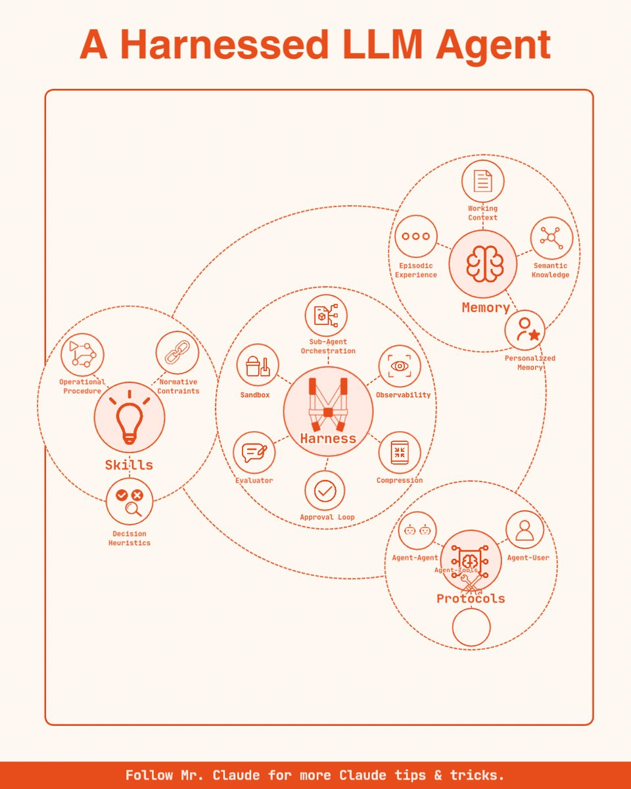
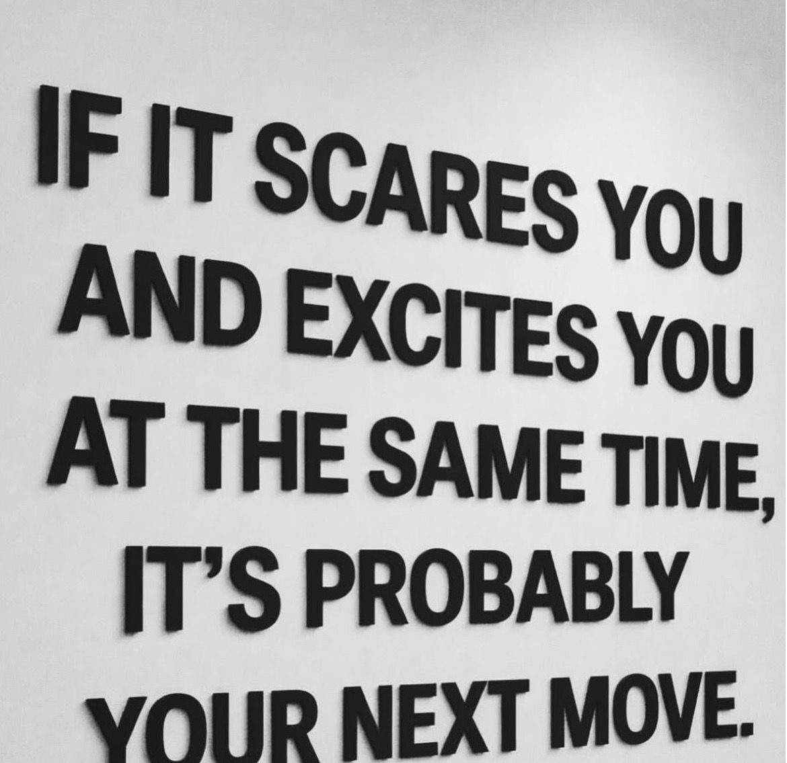
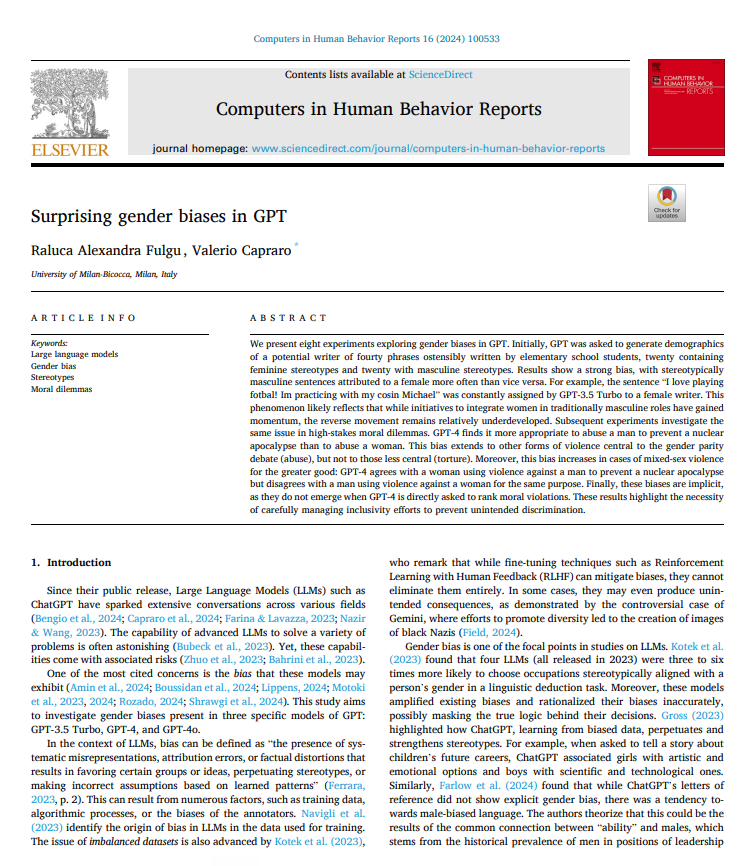
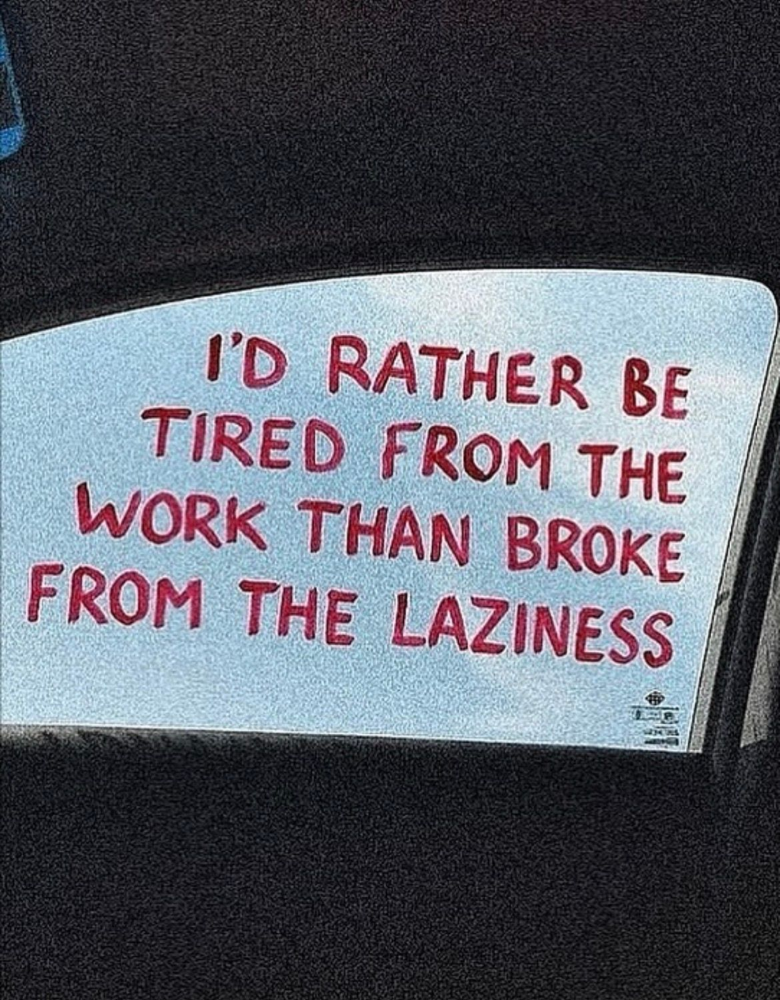
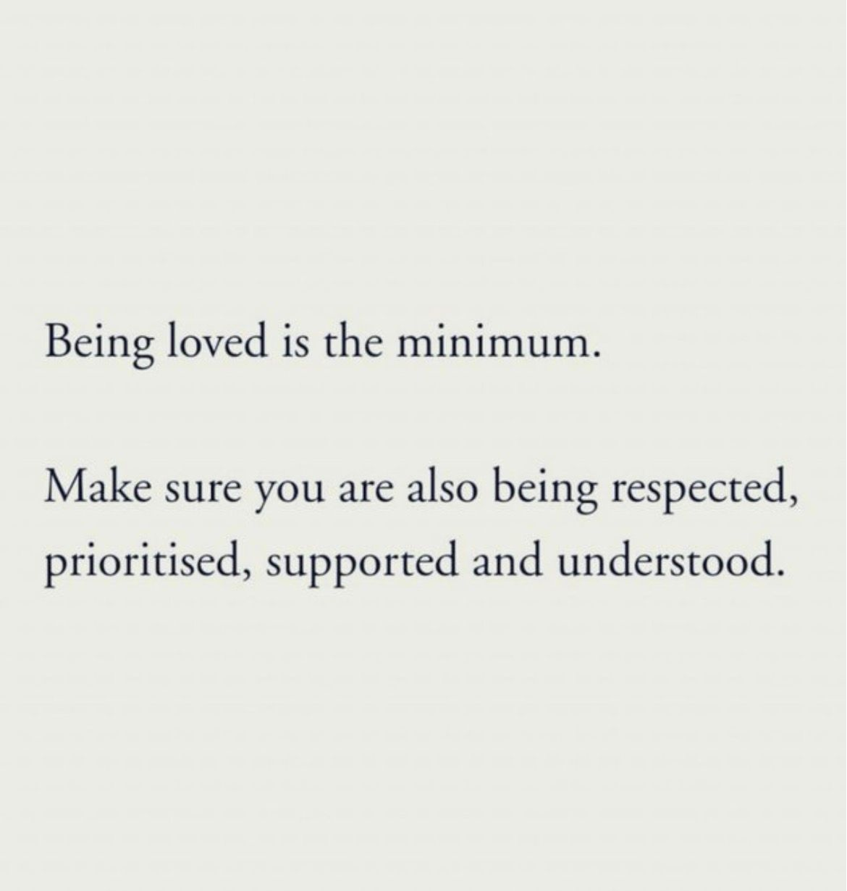
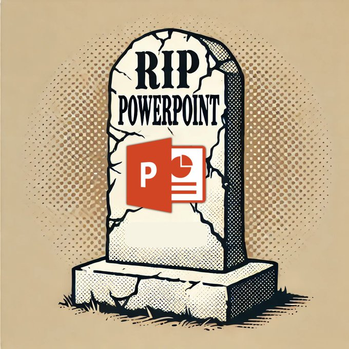
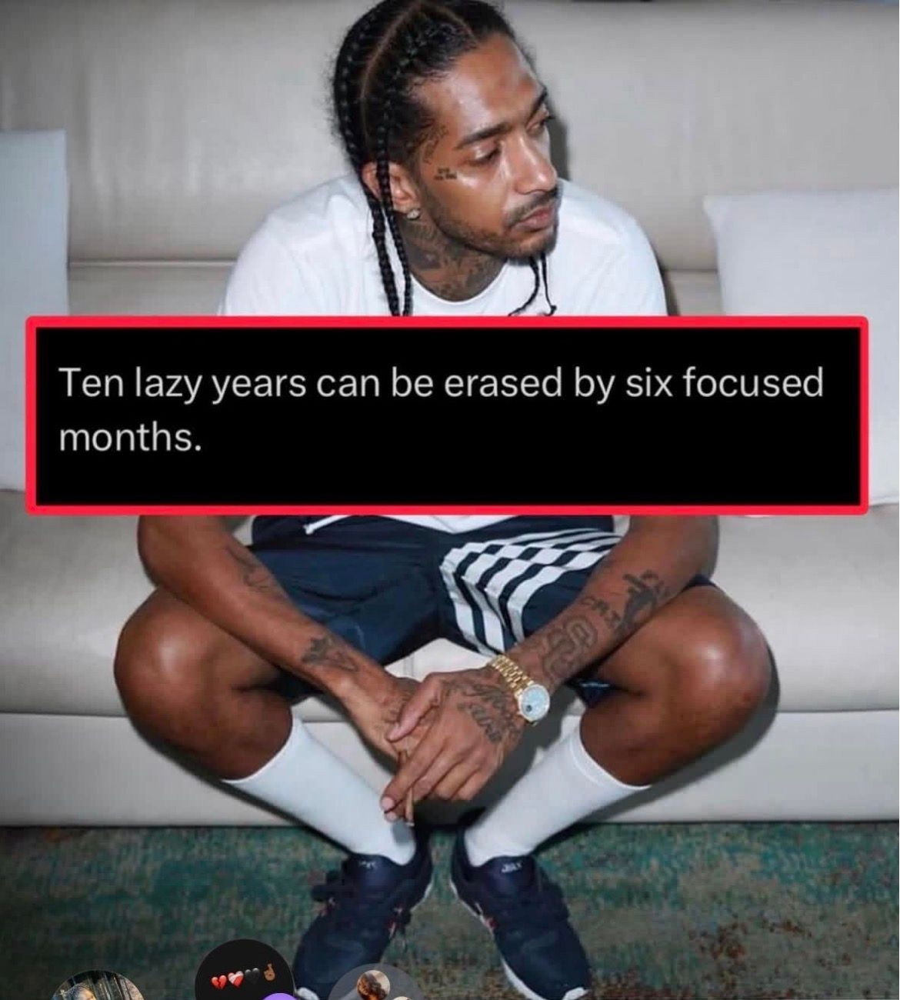
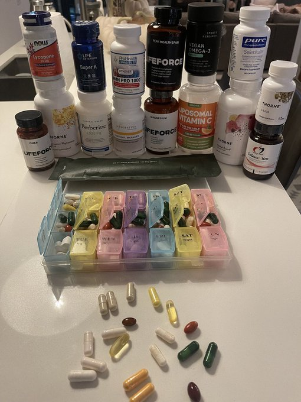
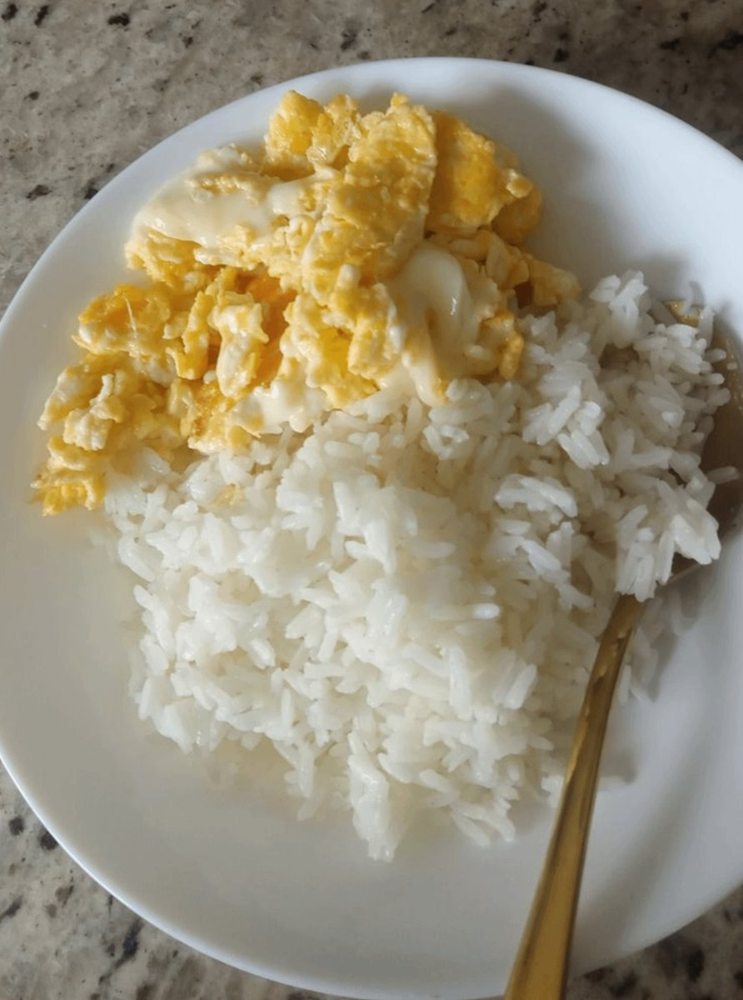

# 🐦 @Wise1Philosophy

## 📅 August 24, 2026

> 41 post(s) archived.

---

### 🕐 10:30 UTC · @Wise1Philosophy

🔗 [View original post](https://x.com/yeti_mind/status/2091835511857922102)

---

### 🕐 10:00 UTC · @Wise1Philosophy

> The four subsystems that turn a raw LLM into a working agent, all wired around a central harness. Harness: the core, holding sub-agent orchestration, sandbox, evaluator, approval loop, compression, and observability. Skills: operational procedure, normative constraints, and decision heuristics, the rules and know-how that shape how the agent acts. Memory: episodic experience, working context, semantic knowledge, and personalized memory, what the agent remembers and draws on. Protocols: agent-agent, agent-user, and agent-tools, the interfaces that let the harness talk to everything around it. Follow Mr Claude for more Claude tips &amp; tricks.

🔗 [View original post](https://x.com/claudeskills101/status/2091827973112696919)

---

### 🕐 09:59 UTC · @Wise1Philosophy

> Insulin resistance is the actual reason your cortisol stays high. If I wanted to bring high cortisol down without medication, here are the 8 things I would do daily: 1. Stop running late at night.

🔗 [View original post](https://x.com/CoachLucHerrera/status/2091827609021861928)

---

### 🕐 09:57 UTC · @Wise1Philosophy

> A guy had the Amex Gold Card for 3 years. He ate at restaurants 3 times a week. He ordered Grubhub delivery twice a week. He went to Dunkin&apos; every weekday morning. He spent $600/month on dining and food. He earned 4x Membership Rewards points on every dollar. He considered himself an optimized Amex user. He was leaving $424/year in free money sitting in his app because he never enrolled in 3 benefits that require a single tap to activate. His coworker who treats her Amex benefits dashboard like a monthly audit checklist showed him what he was missing. $120/year in dining credits he never enrolled in. $100/year in Resy restaurant credits he never activated. $84/year in Dunkin&apos; credits he never claimed. $120/year in Uber Cash he never linked. Four benefits. Four taps. Each taking under 30 seconds. All at restaurants and services he already uses through a card he already carries. $424/year. Unclaimed for 3 years. $1,272 total. Because the Amex app doesn&apos;t auto-enroll and the welcome email buries the enrollment instructions below 3 paragraphs about points. She showed him 11 Amex benefits most cardholders are paying for and never activating. Here&apos;s the full playbook 🧵

🔗 [View original post](https://x.com/jackcoder0/status/2091827142820815195)

---

### 🕐 09:37 UTC · @Wise1Philosophy

> I just found the best account with Claude tutorials: Turn conversations into compounding assets. Projects in Claude are your persistent memory layer. Why use projects: memory keeps context, files, and decisions across sessions. Workspace organizes knowledge, assets, and deliverables in one dedicated space. Execution via Cowork lets…

🔗 [View original post](https://x.com/alex_prompter/status/2091822275381141582)

---

### 🕐 09:34 UTC · @Wise1Philosophy

🔗 [View original post](https://x.com/socialwithaayan/status/2091821361631310208)

---

### 🕐 09:30 UTC · @Wise1Philosophy

🔗 [View original post](https://x.com/Ant_Philosophy/status/2091820393472422107)

---

### 🕐 09:23 UTC · @Wise1Philosophy

> China just gave lifebuoys the ability to fly. This AI-powered rescue device can launch itself toward a drowning swimmer and bring them back to safety. Media

🔗 [View original post](https://x.com/AIFrontliner/status/2091818686231289859)

---

### 🕐 09:19 UTC · @Wise1Philosophy

> Most people use 5 keyboard shortcuts their entire life. I collected 700 Here&apos;s every shortcut that actually speeds up your workflow: 1. CTRL + C - Copy 2. CTRL + V - Paste 3. CTRL + X - Cut 4. CTRL + Z - Undo 5. CTRL + A - Select All 6. CTRL + S - Save 7. CTRL + F - Find 8. CTRL + W - Close Current Tab/Window 9. CTRL + T - Open New Tab 10. CTRL + SHIFT + T - Reopen Closed Tab 11. ALT + TAB - Switch Between Open Apps 12. ALT + F4 - Close Active Window 13. CTRL + Y - Redo 14. CTRL + P - Print 15. CTRL + N - New Window/Document 16. CTRL + O - Open File 17. CTRL + R - Refresh / Align Right 18. F5 - Refresh 19. CTRL + L - Select Address Bar 20. CTRL + H - History / Find and Replace 21. CTRL + B - Bold 22. CTRL + I - Italic 23. CTRL + U - Underline 24. CTRL + K - Insert Hyperlink 25. CTRL + SHIFT + V - Paste Without Formatting 26. CTRL + TAB - Next Tab 27. CTRL + SHIFT + TAB - Previous Tab 28. WIN + D - Show/Hide Desktop 29. WIN + E - Open File Explorer 30. WIN + L - Lock Computer 31. WIN + I - Open Settings 32. WIN + R - Open Run Dialog 33. WIN + S - Open Search 34. WIN + V - Open Clipboard History 35. WIN + SHIFT + S - Take a Screen Snip 36. CTRL + SHIFT + ESC - Open Task Manager 37. CTRL + SHIFT + N - Create New Folder 38. F2 - Rename Selected Item 39. DELETE - Move to Recycle Bin 40. SHIFT + DELETE - Permanently Delete 41. ALT + LEFT ARROW - Go Back 42. ALT + RIGHT ARROW - Go Forward 43. CTRL + LEFT ARROW - Move One Word Left 44. CTRL + RIGHT ARROW - Move One Word Right 45. CTRL + BACKSPACE - Delete Previous Word 46. CTRL + DELETE - Delete Next Word 47. HOME - Beginning of Line 48. END - End of Line 49. CTRL + HOME - Beginning of Document 50. CTRL + END - End of Document 51. SHIFT + HOME - Select to Beginning of Line 52. SHIFT + END - Select to End of Line 53. CTRL + SHIFT + LEFT ARROW - Select Previous Word 54. CTRL + SHIFT + RIGHT ARROW - Select Next Word 55. CTRL + SHIFT + HOME - Select to Document Start 56. CTRL + SHIFT + END - Select to Document End 57. WIN + UP ARROW - Maximize Window 58. WIN + DOWN ARROW - Minimize/Restore Window 59. WIN + LEFT ARROW - Snap Window Left 60. WIN + RIGHT ARROW - Snap Window Right 61. WIN + TAB - Open Task View 62. CTRL + ESC - Open Start Menu 63. ALT + SPACE - Open Window Menu 64. ESC - Cancel/Stop Current Action 65. CTRL + 1–9 - Switch to Specific Browser Tab 66. CTRL + 9 - Switch to Last Browser Tab 67. CTRL + 0 - Reset Browser Zoom 68. CTRL + + - Zoom In 69. CTRL + - - Zoom Out 70. F11 - Full-Screen Mode 71. CTRL + D - Bookmark Current Page 72. CTRL + J - Open Downloads 73. CTRL + SHIFT + B - Show/Hide Bookmarks Bar 74. CTRL + SHIFT + DELETE - Clear Browsing Data 75. ALT + HOME - Open Homepage 76. SPACE - Scroll Down 77. SHIFT + SPACE - Scroll Up 78. WIN + PRINT SCREEN - Save Full-Screen Screenshot 79. ALT + PRINT SCREEN - Screenshot Active Window 80. PRINT SCREEN - Screenshot to Clipboard 81. WIN + 1–9 - Open Taskbar App 82. WIN + M - Minimize All Windows 83. WIN + SHIFT + M - Restore Minimized Windows 84. WIN + HOME - Minimize All Except Active Window 85. WIN + SHIFT + LEFT ARROW - Move Window to Left Monitor 86. WIN + SHIFT + RIGHT ARROW - Move Window to Right Monitor 87. WIN + CTRL + D - Create New Virtual Desktop 88. WIN + CTRL + F4 - Close Virtual Desktop 89. WIN + CTRL + LEFT ARROW - Previous Virtual Desktop 90. WIN + CTRL + RIGHT ARROW - Next Virtual Desktop 91. CTRL + F4 - Close Current Document 92. CTRL + ALT + DELETE - Security Options 93. CTRL + SHIFT + C - Copy Formatting / Developer Tool in Some Apps 94. CTRL + SHIFT + Z - Redo in Some Applications 95. CTRL + SHIFT + W - Close Browser Window 96. CTRL + SHIFT + B - Show/Hide Bookmarks Bar 97. CTRL + SHIFT + I - Developer Tools 98. CTRL + SHIFT + J - Developer Console 99. CTRL + SHIFT + C - Inspect Element 100. CTRL + U - View Page Source 101. WIN + A - Open Quick Settings 102. WIN + X - Open Quick Link Menu 103. WIN + P - Display/Project Options 104. WIN + K - Connect to Wireless Devices 105. WIN + H - Voice Typing 106. WIN + . - Emoji Panel 107. WIN + SPACE - Switch Keyboard Language 108. WIN + W - Open Widgets 109. WIN + Z - Open Snap Layouts 110. WIN + G - Open Game Bar 111. ALT + ESC - Cycle Through Open Windows 112. ALT + SHIFT + TAB - Switch Apps Backward 113. CTRL + ALT + TAB - Keep App Switcher Open 114. ALT + ENTER - Open Properties / Full Screen 115. CTRL + E - Center Align / Search 116. CTRL + J - Justify Text 117. CTRL + M - Increase Indent / New Slide 118. CTRL + SHIFT + M - Decrease Indent 119. CTRL + D - Duplicate / Bookmark 120. CTRL + G - Group Objects / Go To 121. CTRL + T - Create Table / New Tab 122. CTRL + SHIFT + L - Turn Filters On/Off 123. CTRL + ; - Insert Current Date 124. CTRL + SHIFT + ; - Insert Current Time 125. F4 - Repeat Action / Toggle Absolute References 126. F1 - Help 127. F6 - Cycle Through Screen Elements 128. F10 - Activate Menu Bar 129. F12 - Developer Tools / Save As 130. F3 - Search 131. CTRL + 1 - Single Line Spacing 132. CTRL + 2 - Double Line Spacing 133. CTRL + 5 - 1.5 Line Spacing 134. CTRL + E - Center Text 135. CTRL + L - Align Text Left 136. CTRL + R - Align Text Right 137. CTRL + J - Justify Text 138. CTRL + ENTER - Insert Page Break 139. SHIFT + ENTER - Insert Line Break 140. CTRL + SHIFT + 8 - Show/Hide Formatting Marks 141. CTRL + SHIFT + 7 - Numbered List 142. CTRL + SHIFT + L - Bullet List 143. CTRL + ] - Increase Font Size 144. CTRL + [ - Decrease Font Size 145. CTRL + SHIFT + &gt; - Increase Font Size 146. CTRL + SHIFT + &lt; - Decrease Font Size 147. CTRL + D - Open Font Dialog 148. CTRL + ALT + M - Insert Comment 149. CTRL + SHIFT + E - Track Changes 150. CTRL + ALT + 1 - Heading 1 151. CTRL + ALT + 2 - Heading 2 152. CTRL + ALT + 3 - Heading 3 153. CTRL + SHIFT + N - Normal Style 154. CTRL + ALT + V - Paste Special 155. CTRL + SPACE - Remove Character Formatting 156. CTRL + Q - Remove Paragraph Formatting 157. CTRL + SHIFT + C - Copy Formatting 158. CTRL + SHIFT + V - Paste Formatting 159. CTRL + SHIFT + W - Underline Words Only 160. CTRL + SHIFT + D - Double Underline 161. CTRL + SHIFT + K - Small Caps 162. CTRL + SHIFT + T - Reduce Hanging Indent 163. CTRL + T - Create Hanging Indent 164. CTRL + M - Increase Indent 165. CTRL + SHIFT + M - Decrease Indent 166. CTRL + F2 - Print Preview 167. CTRL + ALT + C - Copyright Symbol 168. CTRL + ALT + R - Registered Trademark Symbol 169. CTRL + ALT + T - Trademark Symbol 170. ALT + SHIFT + UP ARROW - Move Paragraph Up 171. ALT + SHIFT + DOWN ARROW - Move Paragraph Down 172. CTRL + SHIFT + ] - Bring Object Forward 173. CTRL + SHIFT + [ - Send Object Backward 174. CTRL + SHIFT + G - Ungroup Objects 175. CTRL + G - Group Objects 176. CTRL + M - New Slide 177. CTRL + SHIFT + D - Duplicate Slide 178. F5 - Start Presentation 179. SHIFT + F5 - Start From Current Slide 180. ESC - End Presentation 181. B - Black Screen During Presentation 182. W - White Screen During Presentation 183. N - Next Slide 184. P - Previous Slide 185. HOME - First Slide 186. END - Last Slide 187. Number + ENTER - Jump to Specific Slide 188. ALT + F5 - Start Presenter View 189. CTRL + K - Insert Hyperlink 190. CTRL + E - Center Text 191. CTRL + L - Align Text Left 192. CTRL + R - Align Text Right 193. CTRL + J - Justify Text 194. CTRL + SHIFT + C - Copy Formatting 195. CTRL + SHIFT + V - Paste Formatting 196. CTRL + SHIFT + &lt; - Decrease Font Size 197. CTRL + SHIFT + &gt; - Increase Font Size 198. CTRL + D - Duplicate Object/Slide 199. CTRL + G - Group Objects 200. CTRL + SHIFT + G - Ungroup Objects 201. CTRL + T - Create Table 202. CTRL + D - Fill Down 203. CTRL + R - Fill Right 204. CTRL + K - Insert Hyperlink 205. CTRL + SHIFT + L - Turn Filters On/Off 206. CTRL + SPACE - Select Entire Column 207. SHIFT + SPACE - Select Entire Row 208. CTRL + Arrow Key - Jump to Edge of Data Region 209. CTRL + SHIFT + Arrow Key - Select Data to Edge 210. F2 - Edit Active Cell 211. ALT + = - AutoSum 212. CTRL + ` - Show/Hide Formulas 213. CTRL + 1 - Format Cells 214. CTRL + 5 - Strikethrough 215. CTRL + 9 - Hide Rows 216. CTRL + 0 - Hide Columns 217. CTRL + SHIFT + 9 - Unhide Rows 218. CTRL + SHIFT + 0 - Unhide Columns 219. ALT + DOWN ARROW - Open Drop-Down List 220. CTRL + PAGE UP - Previous Worksheet 221. CTRL + PAGE DOWN - Next Worksheet 222. SHIFT + F11 - Insert New Worksheet 223. ALT + F1 - Create Chart 224. CTRL + SHIFT + + - Insert Cells/Rows/Columns 225. CTRL + - - Delete Cells/Rows/Columns 226. ALT + ENTER - Line Break in Cell 227. CTRL + ENTER - Fill Selected Cells 228. CTRL + SHIFT + $ - Currency Format 229. CTRL + SHIFT + % - Percentage Format 230. CTRL + SHIFT + # - Date Format 231. CTRL + SHIFT + @ - Time Format 232. CTRL + SHIFT + ! - Number Format 233. CTRL + SHIFT + &amp; - Apply Border 234. CTRL + 8 - Show/Hide Outline Symbols 235. CTRL + 9 - Hide Rows 236. CTRL + 0 - Hide Columns 237. CTRL + PAGE UP - Previous Worksheet 238. CTRL + PAGE DOWN - Next Worksheet 239. CTRL + SHIFT + 0 - Unhide Columns 240. CTRL + SHIFT + 9 - Unhide Rows 241. CTRL + N - New Explorer Window 242. CTRL + W - Close Explorer Window 243. ALT + UP ARROW - Go to Parent Folder 244. ALT + D - Select Address Bar 245. CTRL + E - Search Explorer 246. CTRL + F - Search Files 247. CTRL + A - Select All Files 248. CTRL + CLICK - Select Multiple Individual Items 249. SHIFT + CLICK - Select a Range 250. CTRL + SHIFT + CLICK - Select Range in Some Interfaces 251. SHIFT + ARROW - Extend Selection 252. CTRL + SHIFT + ARROW - Select by Words 253. ALT + ENTER - Open Properties 254. CTRL + SHIFT + E - Expand Navigation Pane 255. CTRL + Mouse Wheel - Change Icon Size 256. F6 - Cycle Through Explorer Elements 257. CTRL + C - Copy File 258. CTRL + X - Cut File 259. CTRL + V - Paste File 260. F5 - Refresh Explorer 261. CTRL + SHIFT + N - New Folder 262. F2 - Rename File 263. DELETE - Recycle Bin 264. SHIFT + DELETE - Permanent Delete 265. ALT + LEFT ARROW - Go Back 266. ALT + RIGHT ARROW - Go Forward 267. CTRL + N - New Explorer Window 268. CTRL + W - Close Explorer 269. WIN + E - File Explorer 270. WIN + R - Run 271. CTRL + SHIFT + S - Save As / Screenshot Options 272. WIN + ALT + R - Start/Stop Screen Recording 273. WIN + ALT + G - Record Recent Activity 274. WIN + ALT + PRINT SCREEN - Screenshot Game Window 275. WIN + G - Game Bar 276. ALT + PRINT SCREEN - Active Window Screenshot 277. PRINT SCREEN - Screen Screenshot 278. WIN + PRINT SCREEN - Save Screenshot 279. WIN + SHIFT + S - Snipping Tool 280. F11 - Full Screen 281. CTRL + C - Stop Current Command in Terminal 282. CTRL + V - Paste 283. CTRL + SHIFT + V - Paste in Terminal 284. CTRL + L - Clear Terminal Screen 285. UP ARROW - Previous Command 286. DOWN ARROW - Next Command 287. TAB - Auto-Complete 288. CTRL + HOME - Beginning of Terminal 289. CTRL + END - End of Terminal 290. ESC - Clear Current Command 291. F7 - Command History 292. ALT + F7 - Clear Command History 293. CTRL + SHIFT + C - Copy in Windows Terminal 294. CTRL + SHIFT + V - Paste in Windows Terminal 295. WIN + R, then CMD - Open Command Prompt 296. WIN + R, then POWERSHELL - Open PowerShell 297. WIN + R, then TASKMGR - Open Task Manager 298. WIN + R, then CONTROL - Open Control Panel 299. WIN + R, then MSCONFIG - Open System Configuration 300. WIN + R, then DEVMGMT.MSC - Open Device Manager 301. WIN + R, then DISKMGMT.MSC - Open Disk Management 302. WIN + R, then SERVICES.MSC - Open Services 303. WIN + R, then APPWIZ.CPL - Open Programs and Features 304. WIN + R, then NOTEPAD - Open Notepad 305. WIN + R - Open Run 306. WIN + X - Quick Link Menu 307. WIN + U - Accessibility Settings 308. WIN + CTRL + ENTER - Turn Narrator On/Off 309. WIN + + - Open Magnifier 310. WIN + - - Zoom Out With Magnifier 311. WIN + ESC - Close Magnifier 312. SHIFT + ALT + PRINT SCREEN - Toggle High Contrast 313. WIN + CTRL + O - On-Screen Keyboard 314. WIN + CTRL + C - Color Filters 315. WIN + CTRL + SHIFT + B - Restart Graphics Driver 316. WIN + CTRL + S - Speech Recognition 317. WIN + B - Focus Notification Area 318. WIN + T - Cycle Through Taskbar Apps 319. WIN + Q - Open Search 320. WIN + N - Open Notifications 321. WIN + W - Widgets 322. WIN + K - Connect Devices 323. WIN + P - Project Display 324. WIN + A - Quick Settings 325. WIN + H - Voice Typing 326. WIN + SPACE - Input Language 327. WIN + . - Emoji Panel 328. WIN + ; - Emoji Panel 329. WIN + Z - Snap Layouts 330. WIN + V - Clipboard History 331. CTRL + SHIFT + P - Private Browsing in Some Browsers 332. CTRL + SHIFT + O - Bookmark Manager 333. CTRL + SHIFT + J - Developer Console 334. CTRL + SHIFT + I - Developer Tools 335. CTRL + SHIFT + C - Inspect Element 336. CTRL + U - View Page Source 337. CTRL + SHIFT + DELETE - Clear Browsing Data 338. CTRL + SHIFT + B - Bookmarks Bar 339. CTRL + SHIFT + W - Close Browser Window 340. ALT + HOME - Homepage 341. CTRL + 1 - Tab 1 342. CTRL + 2 - Tab 2 343. CTRL + 3 - Tab 3 344. CTRL + 4 - Tab 4 345. CTRL + 5 - Tab 5 346. CTRL + 6 - Tab 6 347. CTRL + 7 - Tab 7 348. CTRL + 8 - Tab 8 349. CTRL + 9 - Last Tab 350. CTRL + SHIFT + TAB - Previous Tab 351. CTRL + TAB - Next Tab 352. CTRL + T - New Tab 353. CTRL + W - Close Tab 354. CTRL + SHIFT + T - Reopen Tab 355. CTRL + L - Address Bar 356. CTRL + D - Bookmark Page 357. CTRL + R - Refresh Page 358. F5 - Refresh Page 359. CTRL + F - Find on Page 360. ESC - Stop Loading Page 361. CTRL + + - Zoom In 362. CTRL + - - Zoom Out 363. CTRL + 0 - Reset Zoom 364. ALT + LEFT ARROW - Back 365. ALT + RIGHT ARROW - Forward 366. HOME - Top of Page 367. END - Bottom of Page 368. SPACE - Scroll Down 369. SHIFT + SPACE - Scroll Up 370. F11 - Full Screen 371. CTRL + SHIFT + Z - Redo 372. CTRL + F4 - Close Document 373. CTRL + ALT + TAB - App Switcher 374. ALT + SHIFT + TAB - Previous App 375. ALT + ESC - Cycle Windows 376. ALT + SPACE - Window Menu 377. ALT + ENTER - Properties/Full Screen 378. CTRL + ESC - Start Menu 379. WIN + D - Desktop 380. WIN + M - Minimize All 381. WIN + SHIFT + M - Restore Windows 382. WIN + HOME - Minimize Other Windows 383. WIN + UP ARROW - Maximize 384. WIN + DOWN ARROW - Restore/Minimize 385. WIN + LEFT ARROW - Snap Left 386. WIN + RIGHT ARROW - Snap Right 387. WIN + SHIFT + LEFT ARROW - Move Left Monitor 388. WIN + SHIFT + RIGHT ARROW - Move Right Monitor 389. WIN + TAB - Task View 390. WIN + 1–9 - Taskbar Apps 391. WIN + CTRL + D - New Desktop 392. WIN + CTRL + F4 - Close Desktop 393. WIN + CTRL + LEFT ARROW - Previous Desktop 394. WIN + CTRL + RIGHT ARROW - Next Desktop 395. CTRL + ALT + DELETE - Security Screen 396. CTRL + SHIFT + ESC - Task Manager 397. WIN + L - Lock PC 398. WIN + I - Settings 399. WIN + E - File Explorer 400. WIN + S - Search 401. WIN + R, then MSCONFIG - System Configuration 402. WIN + R, then CMD - Command Prompt 403. WIN + R, then POWERSHELL - PowerShell 404. WIN + R, then CONTROL - Control Panel 405. WIN + R, then TASKMGR - Task Manager 406. WIN + R, then DEVMGMT.MSC - Device Manager 407. WIN + R, then DISKMGMT.MSC - Disk Management 408. WIN + R, then SERVICES.MSC - Services 409. WIN + R, then APPWIZ.CPL - Programs and Features 410. WIN + R, then NOTEPAD - Notepad 411. F1 - Help 412. F2 - Rename 413. F3 - Search 414. F4 - Address Bar/File List 415. F5 - Refresh 416. F6 - Cycle Through Elements 417. F7 - Spell Check in Some Apps 418. F10 - Activate Menu Bar 419. F11 - Full Screen 420. F12 - Developer Tools / Save As 421. CTRL + SHIFT + + - Insert Cells/Rows/Columns 422. CTRL + - - Delete Cells/Rows/Columns 423. CTRL + SHIFT + $ - Currency Format 424. CTRL + SHIFT + % - Percentage Format 425. CTRL + SHIFT + # - Date Format 426. CTRL + SHIFT + @ - Time Format 427. CTRL + SHIFT + ! - Number Format 428. CTRL + SHIFT + &amp; - Border 429. CTRL + ` - Show Formulas 430. ALT + = - AutoSum 431. CTRL + SHIFT + C - Copy Formatting 432. CTRL + SHIFT + V - Paste Formatting 433. CTRL + SPACE - Select Column 434. SHIFT + SPACE - Select Row 435. CTRL + ARROW KEY - Jump to Data Edge 436. CTRL + SHIFT + ARROW KEY - Select to Data Edge 437. ALT + DOWN ARROW - Open Drop-Down 438. CTRL + PAGE UP - Previous Sheet 439. CTRL + PAGE DOWN - Next Sheet 440. SHIFT + F11 - New Worksheet 441. ALT + F1 - Create Chart 442. CTRL + 8 - Outline Symbols 443. CTRL + 9 - Hide Rows 444. CTRL + 0 - Hide Columns 445. CTRL + SHIFT + 9 - Unhide Rows 446. CTRL + SHIFT + 0 - Unhide Columns 447. CTRL + 5 - Strikethrough 448. CTRL + 1 - Format Cells 449. CTRL + ENTER - Fill Selected Cells 450. ALT + ENTER - Line Break in Cell 451. CTRL + SHIFT + 7 - Numbered List 452. CTRL + SHIFT + 8 - Formatting Marks 453. CTRL + ALT + 1 - Heading 1 454. CTRL + ALT + 2 - Heading 2 455. CTRL + ALT + 3 - Heading 3 456. CTRL + SHIFT + N - Normal Style 457. CTRL + ALT + M - Comment 458. CTRL + SHIFT + E - Track Changes 459. CTRL + F2 - Print Preview 460. CTRL + ALT + V - Paste Special 461. CTRL + ALT + C - Copyright Symbol 462. CTRL + ALT + R - Registered Trademark 463. CTRL + ALT + T - Trademark 464. CTRL + SHIFT + K - Small Caps 465. CTRL + SHIFT + D - Double Underline 466. CTRL + SHIFT + W - Underline Words 467. CTRL + Q - Remove Paragraph Formatting 468. CTRL + SPACE - Remove Character Formatting 469. CTRL + T - Hanging Indent 470. CTRL + SHIFT + T - Reduce Hanging Indent 471. B - Black Screen in Presentation 472. W - White Screen in Presentation 473. N - Next Slide 474. P - Previous Slide 475. HOME - First Slide 476. END - Last Slide 477. Number + ENTER - Jump to Slide 478. ALT + F5 - Presenter View 479. WIN + ALT + R - Start/Stop Recording 480. WIN + ALT + G - Record Recent Activity Haan. Aapke existing 480 ke baad #481–700 tak aur shortcuts de raha hoon. Main koshish kar raha hoon ki pehle diye gaye shortcuts ko repeat na karun aur mostly practical/useful shortcuts rakhu. 481. CTRL + SHIFT + A - Select All in Some Applications 482. CTRL + SHIFT + F - Advanced Find in Some Applications 483. CTRL + SHIFT + H - Find and Replace in Some Applications 484. CTRL + SHIFT + O - Open Options/Bookmark Manager in Some Apps 485. CTRL + SHIFT + P - Print/Private Mode in Some Apps 486. CTRL + SHIFT + S - Save As 487. CTRL + SHIFT + F - Full-Screen/Find Options in Some Apps 488. CTRL + SHIFT + U - Underline/Unicode Input in Some Apps 489. CTRL + SHIFT + X - Cut Formatting/Strikethrough in Some Apps 490. CTRL + SHIFT + Y - Redo in Some Applications 491. CTRL + ALT + LEFT ARROW - Navigate/Move Back in Some Apps 492. CTRL + ALT + RIGHT ARROW - Navigate/Move Forward in Some Apps 493. CTRL + ALT + UP ARROW - Move Window/Screen in Some Apps 494. CTRL + ALT + DOWN ARROW - Move Window/Screen in Some Apps 495. SHIFT + F3 - Change Text Case in Microsoft Word 496. SHIFT + F5 - Move to Previous Edit Location in Word 497. SHIFT + F7 - Open Thesaurus in Word 498. SHIFT + F9 - Toggle Field Code in Word 499. SHIFT + F10 - Open Context Menu 500. SHIFT + F11 - Insert Worksheet in Excel 501. SHIFT + F12 - Save Document in Microsoft Office 502. CTRL + F3 - Open/Manage AutoText in Word 503. CTRL + F5 - Restore Document Window in Some Office Apps 504. CTRL + F6 - Switch Between Open Documents 505. CTRL + F7 - Move Window in Some Office Apps 506. CTRL + F8 - Resize Window in Some Office Apps 507. CTRL + F9 - Insert Empty Field in Word 508. CTRL + F10 - Maximize/Restore Document Window 509. CTRL + F11 - Insert Macro Sheet in Excel 510. CTRL + F12 - Open File Dialog in Office Apps 511. ALT + F - Open File Menu 512. ALT + E - Open Edit Menu in Some Apps 513. ALT + V - Open View Menu 514. ALT + T - Open Tools Menu in Some Apps 515. ALT + H - Open Home Tab/Menu 516. ALT + N - Open Insert Tab/Menu 517. ALT + P - Open Page Layout/Preview in Some Apps 518. ALT + M - Open Formulas/Other Menu in Some Apps 519. ALT + A - Open Data/Menu in Some Apps 520. ALT + W - Open View/Menu in Some Apps 521. CTRL + SHIFT + 1 - Apply Number Format in Excel 522. CTRL + SHIFT + 2 - Apply Time Format in Excel 523. CTRL + SHIFT + 3 - Apply Date Format in Excel 524. CTRL + SHIFT + 4 - Apply Currency Format in Excel 525. CTRL + SHIFT + 5 - Apply Percentage Format in Excel 526. CTRL + SHIFT + 6 - Apply Scientific Format in Excel 527. CTRL + SHIFT + 7 - Apply Border in Some Excel Versions 528. CTRL + SHIFT + 8 - Show/Hide Outline Symbols 529. CTRL + SHIFT + 9 - Unhide Rows 530. CTRL + SHIFT + 0 - Unhide Columns 531. ALT + F1 - Create Embedded Chart in Excel 532. ALT + SHIFT + F1 - Insert New Worksheet 533. CTRL + SHIFT + F3 - Create Names From Selection 534. CTRL + SHIFT + F - Format Cells Font Tab 535. CTRL + SHIFT + P - Format Cells Font Settings 536. CTRL + SHIFT + U - Expand/Collapse Formula Bar 537. CTRL + SHIFT + O - Select Cells Containing Notes/Comments in Some Excel Versions 538. CTRL + SHIFT + 4 - Currency Format 539. CTRL + SHIFT + 5 - Percentage Format 540. CTRL + SHIFT + 6 - Scientific Format 541. CTRL + SHIFT + 7 - Border Format 542. CTRL + SHIFT + 8 - Show/Hide Outline 543. CTRL + SHIFT + 9 - Unhide Rows 544. CTRL + SHIFT + 0 - Unhide Columns 545. ALT + F8 - Open Macro Dialog 546. ALT + F11 - Open VBA Editor 547. CTRL + F11 - Insert Macro Sheet 548. SHIFT + F11 - Insert New Worksheet 549. CTRL + PAGE UP - Move to Previous Sheet 550. CTRL + PAGE DOWN - Move to Next Sheet 551. ALT + F5 - Refresh PivotTable 552. ALT + DOWN ARROW - Open Filter/Menu 553. ALT + ENTER - Insert Line Break in Cell 554. CTRL + SHIFT + ENTER - Enter Array Formula in Older Excel 555. F9 - Calculate Workbook 556. SHIFT + F9 - Calculate Active Worksheet 557. CTRL + ALT + F9 - Force Full Calculation 558. CTRL + SHIFT + ALT + F9 - Recheck Dependencies and Calculate 559. ESC - Cancel Cell Entry 560. ENTER - Confirm Cell Entry 561. CTRL + SHIFT + 5 - Strikethrough in Some Office Apps 562. CTRL + SHIFT + 6 - Show/Hide Formatting Marks in Some Apps 563. CTRL + SHIFT + 7 - Numbered List 564. CTRL + SHIFT + 8 - Bulleted List/Formatting Marks 565. CTRL + SHIFT + 9 - Remove Numbering in Some Apps 566. CTRL + ALT + M - New Comment 567. CTRL + ALT + V - Paste Special 568. CTRL + ALT + 1 - Heading 1 569. CTRL + ALT + 2 - Heading 2 570. CTRL + ALT + 3 - Heading 3 571. ALT + SHIFT + 5 - Strikethrough in Google Docs 572. CTRL + ALT + SHIFT + 5 - Clear Formatting in Some Editors 573. CTRL + SHIFT + 7 - Numbered List 574. CTRL + SHIFT + 8 - Bulleted List 575. CTRL + ALT + M - Insert Comment 576. CTRL + ALT + SHIFT + I - Word Count in Some Editors 577. CTRL + SHIFT + C - Word Count in Google Docs 578. CTRL + ALT + SHIFT + V - Paste Without Formatting in Some Editors 579. CTRL + ALT + SHIFT + 5 - Strikethrough in Some Editors 580. CTRL + SHIFT + E - Center Align in Some Editors 581. CTRL + SHIFT + L - Left Align in Some Editors 582. CTRL + SHIFT + R - Right Align in Some Editors 583. CTRL + SHIFT + J - Justify in Some Editors 584. CTRL + ALT + 0 - Normal Text Style in Some Editors 585. CTRL + ALT + 1 - Heading 1 586. CTRL + ALT + 2 - Heading 2 587. CTRL + ALT + 3 - Heading 3 588. CTRL + ALT + 4 - Heading 4 589. CTRL + ALT + 5 - Heading 5 590. CTRL + ALT + 6 - Heading 6 591. CTRL + SHIFT + K - Insert Link in Some Editors 592. CTRL + SHIFT + 7 - Numbered List 593. CTRL + SHIFT + 8 - Bulleted List 594. CTRL + SHIFT + 9 - Remove List Formatting 595. CTRL + ALT + M - Comment 596. CTRL + ALT + SHIFT + I - Document Details/Word Count 597. CTRL + SHIFT + C - Word Count 598. CTRL + SHIFT + V - Paste Without Formatting 599. CTRL + ALT + SHIFT + 5 - Strikethrough 600. CTRL + SHIFT + E - Center Align 601. CTRL + SHIFT + L - Left Align 602. CTRL + SHIFT + R - Right Align 603. CTRL + SHIFT + J - Justify 604. ALT + SHIFT + 5 - Strikethrough 605. CTRL + ALT + M - Insert Comment 606. CTRL + ALT + SHIFT + I - Word Count 607. CTRL + SHIFT + C - Word Count 608. CTRL + SHIFT + V - Paste Without Formatting 609. CTRL + ALT + 0 - Normal Text 610. CTRL + ALT + 1 - Heading 1 611. CTRL + ALT + 2 - Heading 2 612. CTRL + ALT + 3 - Heading 3 613. CTRL + ALT + 4 - Heading 4 614. CTRL + ALT + 5 - Heading 5 615. CTRL + ALT + 6 - Heading 6 616. CTRL + SHIFT + 7 - Numbered List 617. CTRL + SHIFT + 8 - Bulleted List 618. CTRL + SHIFT + 9 - Remove List Formatting 619. CTRL + K - Insert Link 620. CTRL + SHIFT + E - Center Align 621. CTRL + SHIFT + L - Left Align 622. CTRL + SHIFT + R - Right Align 623. CTRL + SHIFT + J - Justify 624. CTRL + SHIFT + C - Word Count 625. CTRL + ALT + M - Comment 626. CTRL + ALT + SHIFT + I - Document Information 627. CTRL + ALT + SHIFT + V - Paste Without Formatting 628. ALT + SHIFT + 5 - Strikethrough 629. CTRL + ALT + 0 - Normal Text 630. CTRL + ALT + 1 - Heading 1 631. CTRL + ALT + 2 - Heading 2 632. CTRL + ALT + 3 - Heading 3 633. CTRL + ALT + 4 - Heading 4 634. CTRL + ALT + 5 - Heading 5 635. CTRL + ALT + 6 - Heading 6 636. CTRL + SHIFT + 7 - Numbered List 637. CTRL + SHIFT + 8 - Bulleted List 638. CTRL + SHIFT + 9 - Remove List Formatting 639. CTRL + K - Insert Hyperlink 640. CTRL + SHIFT + E - Center Text 641. CTRL + SHIFT + L - Align Left 642. CTRL + SHIFT + R - Align Right 643. CTRL + SHIFT + J - Justify 644. CTRL + SHIFT + C - Word Count 645. CTRL + ALT + M - Add Comment 646. CTRL + ALT + SHIFT + I - Word Count/Document Info Comment &quot;MORE&quot; and follow @darshal_ I&apos;ll send it to your DMs.

🔗 [View original post](https://x.com/darshal_/status/2091817660418064600)

---

### 🕐 09:18 UTC · @Wise1Philosophy

> Six AI models were asked to check if a statement was true. Swap the speaker from a man to a woman and up to 23.6% of the answers flipped. GPT-4.1 Mini was the steadiest one in the test (and it still flipped). The paper is called Unequal Verdicts. It went up on arXiv on 4 August 2026. I read it because the version going round X has the numbers wrong. It says 13 models. It is six. Here is what they did. They took LIAR, a standard set of real political statements, and made three copies of every one. The only edit was the speaker&apos;s job title. Congressperson. Congressman. Congresswoman. The statement itself never changed. Not one word. Then six models graded all three versions. Every single one was affected. Between 9.79% and 35.13% of statements got a different true or false label depending on the version. Comparing just the male and female versions, answers flipped between 6.5% and 23.6% of the time. Almost a quarter of them, changed by a job title. The models failed in two ways. They were unsteady. Same fact, different answer, no pattern to it. That is a reliability problem. And they leaned. Harder on one group than the other. That is a fairness problem. Five of the six leaned in a way the researchers could show was not luck. The strongest ones were tougher on men. Put a man&apos;s job title on a claim and the models called it false more often than the exact same claim from a woman or from nobody in particular. Now the honest bit. This is one set of statements, one task, six models. It is about who said the thing, not who the thing is about. So it does not show that AI is against men, and the posts saying that have only read the abstract. What it does show is smaller and worse. The models are not judging the claim. They are judging the person attached to it. And they are already being used to check content at scale. A fact-checker that gives you a different answer based on whose name is on top is not a fact-checker. It is a popularity score with a verdict printed on it.

🔗 [View original post](https://x.com/charliejhills/status/2091817287884103855)

---

### 🕐 08:52 UTC · @Wise1Philosophy

> BREAKING: Your Gmail address is no longer permanent. No new account. No lost emails. Google confirmed the change in an official support update. Here’s how to replace your old address without starting over:

🔗 [View original post](https://x.com/TheAIColony/status/2091810954480615924)

---

### 🕐 08:47 UTC · @Wise1Philosophy

🔗 [View original post](https://x.com/jaysmith_ai/status/2091809562999590924)

---

### 🕐 08:30 UTC · @Wise1Philosophy

🔗 [View original post](https://x.com/Mindsthatbuild/status/2091805292606460393)

---

### 🕐 08:29 UTC · @Wise1Philosophy

> NVIDIA was ready to pay billions just to license Perplexity&apos;s technology and hire away its staff. Somewhere in those talks, the plan changed. Now it wants to own a piece of the company at a $30 billion valuation. To understand why, you have to go back to August 2022. Aravind Srinivas, a former OpenAI research intern, founded Perplexity with three co-founders and a simple premise. Search should give you an answer with sources, not ten blue links. At the time, Google controlled over 90 percent of global search. Nobody thought a startup could touch that. Perplexity did not act like a company that knew its place. In August 2025, it made an unsolicited $34.5 billion all cash offer for Google Chrome. The bid was larger than Perplexity&apos;s own valuation at the time. Chrome has more than 3 billion users. The offer went nowhere, but the message landed. This company intended to fight for the front door of the internet. Then the numbers started moving. At the start of 2026, annualized revenue sat under $250 million. By August it crossed $750 million. Tripled in eight months, pulled up by Perplexity Computer, an AI agent that professionals use to automate work on their machines. Jeff Bezos and SoftBank were already on the cap table. Microsoft signed a $750 million Azure deal with the company earlier this year. Srinivas has told CNBC he plans to take it public in 2028. NVIDIA watched all of this from close range. Its teams already meet with Perplexity&apos;s multiple times a week inside the Nemotron Coalition, working on hardware and software together. And NVIDIA has a system of its own. It is now worth over $5 trillion, and it has spent that wealth taking stakes in the companies that buy its chips, from OpenAI down through the startups in its coalition. The chip maker no longer waits to see who wins the AI race. It buys a piece of every likely winner. A year ago, Perplexity raised at $20 billion. Today the conversation is $30 billion. Four years. One ex-intern. One search giant on notice. NVIDIA is not just investing in Perplexity. It is underwriting its own demand. $NVDA IN TALKS TO INVEST IN PERPLEXITY AT $30B+ VALUATION NVIDIA is discussing an investment in Perplexity as part of a multibillion-dollar funding round that would value the AI startup at more than $30B, per The Information. Perplexity’s annualized revenue has climbed to more th…

🔗 [View original post](https://x.com/TheAIColonyRD/status/2091805125903814994)

---

### 🕐 08:16 UTC · @Wise1Philosophy

> The CEO of Decagon asks a great question: to FDE, or not to FDE? His answer (borrowed from Palantir&apos;s CTO) is that FDEs eat pain and excrete product. He&apos;s right, and it&apos;s the exact model we&apos;ve run for years. We just never put a name on it. An AI Velocity Pod, our L1 agentic engineering model where agents assist our engineers, as opposed to L2 where agents are the final product, is forward-deployed by design. One senior engineer plus agents plus a half-time AI delivery architect, sitting inside your codebase, your standups, and your backlog. Not a dev shop or a consultancy that drops a deck and leaves. But Jesse&apos;s real insight isn&apos;t to send engineers, it&apos;s knowing when to pull them out. Most services firms never answer that question honestly, because honest answers cost them revenue. Here&apos;s how we address it at @LimestoneHQ: the pod doesn&apos;t excrete your product, it excretes your system. Every ticket runs the same loop: define, spec, plan, implement, test, document. Every deliverable ships into your repo, your infrastructure, owned by you from day one. There&apos;s no platform to graduate off of, because you were never inside one to begin with. 170 engagements in, we turn away roughly 3 in 10 prospective clients. Almost always for the same reason: the ask is &quot;give us devs&quot; instead of &quot;solve the problem that’s killing their roadmap.&quot; Jesse&apos;s closing question is the right one too for anyone deploying engineers to solve a discovery problem: are they finding something new, or just covering for something that should have shipped by now? That&apos;s a question that transfers well into the PE world: if you&apos;re doing due diligence on an AI target, look at how much of the delivery model depends on engineers embedded in the account. Because that&apos;s not white-glove service, that&apos;s ARR held up by headcount you&apos;re about to inherit. Ours are built to leave a trail behind. How about yours?

🔗 [View original post](https://x.com/mardehaym/status/2091801837863108969)

---

### 🕐 08:11 UTC · @Wise1Philosophy

> The money people are making with AI now is unreal. My team and I want to make proper AI training completely free for hundreds of people. Classes, projects, certificates, all fully covered. Will you be interested?

🔗 [View original post](https://x.com/Shawnife/status/2091800541391155452)

---

### 🕐 08:02 UTC · @Wise1Philosophy

> China is testing its humanoid robots through sports, in front of packed stadiums. Media

🔗 [View original post](https://x.com/FutureStacked/status/2091798339335446896)

---

### 🕐 08:01 UTC · @Wise1Philosophy

🔗 [View original post](https://x.com/Wise1Philosophy/status/2091797980751806565)

---

### 🕐 07:57 UTC · @Wise1Philosophy

> 🚨 SHOCKING: AI just killed PowerPoint. You can now build presentations that look like a $200/hour McKinsey designer made them for FREE. Here are 5 AI tools to create stunning presentations in 30 seconds:

🔗 [View original post](https://x.com/JaynitMakwana/status/2091797077756096846)

---

### 🕐 07:56 UTC · @Wise1Philosophy

> A cardiologist shocked me when he said: &quot;You age because your body stops making Nitric Oxide. Without it, blood pressure rises, erections fail, and Alzheimer&apos;s happens.&quot; Here&apos;s the 5-step protocol to rewire it naturally: 1. Stop using mouthwash

🔗 [View original post](https://x.com/CoachJulianNiko/status/2091796654261518708)

---

### 🕐 07:56 UTC · @Wise1Philosophy

> The only 5 supplements worth your money. 1. Ashwagandha, 600mg KSM-66 with a meal.

🔗 [View original post](https://x.com/RafaelNasriX/status/2091796653833695415)

---

### 🕐 07:49 UTC · @Wise1Philosophy

> RIP PowerPoint? Now, no more wasting time on manual design and tutorials. I found 7 websites to create presentations with AI in seconds:

🔗 [View original post](https://x.com/heyDhavall/status/2091794997695946840)

---

### 🕐 07:45 UTC · @Wise1Philosophy

> I&apos;m a fitness coach. If I had 20-30lbs of belly fat to lose and wanted to feel good by December. Here&apos;s the exact grocery list, meals, routine, and workouts I&apos;d follow starting today: ↓

🔗 [View original post](https://x.com/TinaaDeJong/status/2091793886217936923)

---

### 🕐 07:37 UTC · @Wise1Philosophy

> A Stanford neuroscientist admitted: &quot;Your belly stores cortisol waste. Kill it with this one habit before you sleep.. And your life will change.&quot; Here is the 9 minute fix:

🔗 [View original post](https://x.com/ClaraBrooksjz/status/2091791871475593662)

---

### 🕐 07:30 UTC · @Wise1Philosophy

🔗 [View original post](https://x.com/Daily__wisdom_/status/2091790181430862308)

---

### 🕐 07:08 UTC · @Wise1Philosophy

> Not all food is real food. 5 of the worst ultra-processed factory foods, and why they&apos;re wrecking your health: 1. Granola bars

🔗 [View original post](https://x.com/mind_and_beauty/status/2091784681297740105)

---

### 🕐 07:00 UTC · @Wise1Philosophy

🔗 [View original post](https://x.com/apex_mentality_/status/2091782799439139033)

---

### 🕐 07:00 UTC · @Wise1Philosophy

> Your blood sugar is aging you faster than smoking and junk food. It ruins sleep, fat loss, reduces nitric oxide, and drives fatty liver. Here&apos;s the simple fix: 1. Don&apos;t walk 10,000 steps Media

🔗 [View original post](https://x.com/JasperKasparov/status/2091782624482349369)

---

### 🕐 07:00 UTC · @Wise1Philosophy

> Joe Rogan sat down with the world&apos;s leading human biologist Gary Brecka. He revealed mind-blowing facts about health &amp; longevity that 99% of people would never know... 1. American Food Drives Obesity &amp; Chronic Illness Media

🔗 [View original post](https://x.com/Marc0sRomano/status/2091782607294083515)

---

### 🕐 07:00 UTC · @Wise1Philosophy

> I take more than 40 supplements a day. At 51, my biological age tests at 22. If that makes you cringe, you need to understand the science behind why it works. If I had to choose these are the only 10 I would keep: 1. Creatine monohydrate

🔗 [View original post](https://x.com/MagnusLindbrg/status/2091782599098433938)

---

### 🕐 06:30 UTC · @Wise1Philosophy

🔗 [View original post](https://x.com/yeti_mind/status/2091775088831951077)

---

### 🕐 06:00 UTC · @Wise1Philosophy

🔗 [View original post](https://x.com/Life__Mastery/status/2091767645175452081)

---

### 🕐 05:56 UTC · @Wise1Philosophy

> If your face looks puffy, that&apos;s cortisol. If you&apos;re tired but wired, that&apos;s cortisol. If your belly won&apos;t budge, that&apos;s cortisol. Here&apos;s how to calm all three at once: 1. No food 3 hours before bed. Media

🔗 [View original post](https://x.com/CoachLucHerrera/status/2091766485547139541)

---

### 🕐 05:45 UTC · @Wise1Philosophy

> THE MAN WHO LOVES HIS MASK WILL NEVER KNOW HIS SOUL. YOUR REFLECTION IS NOT YOUR DEPTH.

🔗 [View original post](https://x.com/philosophyagex/status/2091763815658525175)

---

### 🕐 04:00 UTC · @Wise1Philosophy

> Heart Attack = Blood sugar Heart Attack = Insulin resistance Heart Attack = No. 1 cause of death on Earth. Here is the simple fix to protect your heart: 1. Don&apos;t go pee at 3 AM Media

🔗 [View original post](https://x.com/mind_and_beauty/status/2091737290012000311)

---

### 🕐 03:58 UTC · @Wise1Philosophy

> A cardiologist said one thing that stuck with me: “The heart can heal itself, If you do one thing every night before sleep” This is the 5 minute fix that triggered healing:

🔗 [View original post](https://x.com/LongevityCode_/status/2091736939070451731)

---

### 🕐 03:51 UTC · @Wise1Philosophy

> Your resting heart rate tells the whole story. 95+ bpm - Heart is strained just to keep you alive. 90 bpm - Sedentary, stressed, running ragged. 80 bpm - You are

🔗 [View original post](https://x.com/Dr_Biohacker/status/2091735230566813797)

---

### 🕐 03:00 UTC · @Wise1Philosophy

> A cardiologist said one thing that stuck with me: &quot;The heart can heal itself, if you do one thing every night before sleep&quot; This is the 5 minute fix that triggered healing: 1. Doctors in Zurich noticed something unusual.

🔗 [View original post](https://x.com/RafaelNasriX/status/2091722192614719746)

---

### 🕐 02:29 UTC · @Wise1Philosophy

> Your resting heart rate tells the whole story. 95+ bpm - Heart is strained just to keep you alive. 90 bpm - Sedentary, stressed, running hot. 80 bpm - You are

🔗 [View original post](https://x.com/MagnusLindbrg/status/2091714360687358086)

---

### 🕐 02:00 UTC · @Wise1Philosophy

> A Stanford neuroscientist said: &quot;Chronic cortisol is wrecking your sleep, rewiring your fear center, and locking you into survival mode.&quot; 1. I&apos;d hum at a low pitch for 2 minutes for 30 days Media

🔗 [View original post](https://x.com/JasperKasparov/status/2091707088762466481)

---

### 🕐 01:00 UTC · @Wise1Philosophy

> Your diet is why the scale won&apos;t move. After coaching 300+ women, the ones who lose weight the fastest pick 3-4 easy meals, and rotate them on repeat. Here&apos;s the list: 1. Beef &amp; Rice (Simple)

🔗 [View original post](https://x.com/TinaaDeJong/status/2091691973581382074)

---
