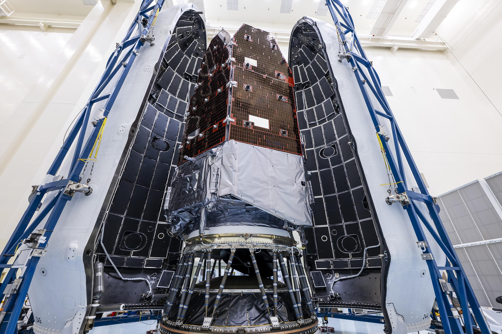
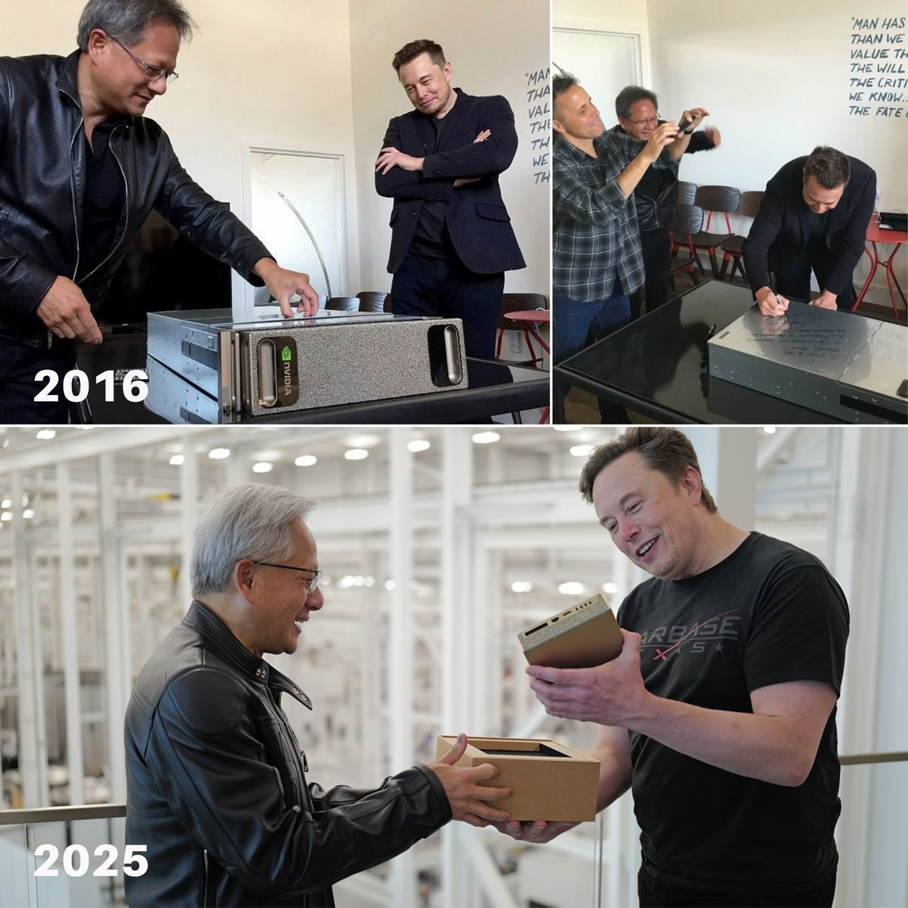

# 🐦 @elonmusk

## 📅 August 24, 2026

> 19 post(s) archived.

---

### 🕐 19:16 UTC · @elonmusk

> Grok Bot makes clipping YouTube podcasts ridiculously easy. I just send it a link and say: “Cut from 16:43 to 18:17.” A few minutes later, the exact HD clip is ready in the chat. My Clipper bot has already sent it to my Researcher and Writer bots, which pull the best quotes and prepare the caption. I didn’t code any of this. I literally just logged into my Google account on Grok Bot and asked it to clip a YouTube video. I’ve wanted this for years: tell an AI which part of a podcast you want, and it automatically cuts the HD clip, transcribes it, and starts preparing the post. Grok Bot makes workflows like this incredibly simple for a non-coder.

🔗 [View original post](https://x.com/KanekoaTheGreat/status/2091968024370897102)

---

### 🕐 18:59 UTC · @elonmusk

> NASA’s Roman Space Telescope was encapsulated into Falcon Heavy’s fairing this past week ahead of launch on Sunday, August 30 from pad 39A in Florida → https://spacex.com/launches/roman

🔗 [View original post](https://x.com/SpaceX/status/2091963575296262434)

---

### 🕐 18:49 UTC · @elonmusk

> Everyone’s against eugenics until they roll up to the sperm bank.

🔗 [View original post](https://x.com/ArtemisConsort/status/2091961211235738043)

---

### 🕐 18:35 UTC · @elonmusk

> Humans are disappearing Singapore just went all in on birth rates Fertility fell to a record-low 0.87 in 2025. Birth rates have fallen seriously low That’s not just a dip. That’s a whole country nowhere near replacing itself. It&apos;s a massive problem for the country So Singapore is going directly after th…

🔗 [View original post](https://x.com/elonmusk/status/2091957536874451173)

---

### 🕐 17:44 UTC · @elonmusk

> Very few people know that the reason we launched my old Tesla Roadster to orbit Earth and Mars is that the probability of failure was very high and we didn’t want to risk anything valuable Elon Musk reveals why he launched his Tesla Roadster into space. &quot;I fully expected this flight to fail.&quot; Musk was talking about Falcon Heavy&apos;s first flight. Since he thought the rocket might fail, he didn&apos;t want to put something boring on top of it. Instead, SpaceX launched his p…

🔗 [View original post](https://x.com/elonmusk/status/2091944733396631770)

---

### 🕐 17:32 UTC · @elonmusk

> Grok @Bot ported Doom to a new device in 10 mins Grok @bot now passes the DOOM test. It ported the entire DOOM to ESP32-S running at a high frame rate without trouble.

🔗 [View original post](https://x.com/elonmusk/status/2091941626717569460)

---

### 🕐 17:26 UTC · @elonmusk

> Our design is significantly simpler, lower cost, denser and lighter than a traditional rack

🔗 [View original post](https://x.com/elonmusk/status/2091940127866257601)

---

### 🕐 17:22 UTC · @elonmusk

> SpaceX, in partnership with Nvidia, has designed a space-optimized Vera Rubin NVL72 system for launch to orbit in Q4 next year, with significant scale in 2028 The first CPU built for agents is going to work at scale. @SpaceX is deploying NVIDIA Vera to accelerate the orchestration, code execution, and data processing that powers its next generation of agentic AI — keeping GPUs fed and agents acting fast. From gigawatt AI factories to o…

🔗 [View original post](https://x.com/elonmusk/status/2091939113008238838)

---

### 🕐 16:47 UTC · @elonmusk

> Grok Imagine just got some very useful new image editing tools from @SpaceXAI! You can now change an image’s color palette using presets or colors extracted directly from the image, plus crop images without leaving Imagine. It’s quickly turning into a much more complete image editor!

🔗 [View original post](https://x.com/mark_k/status/2091930315593777225)

---

### 🕐 16:21 UTC · @elonmusk

> I did not know that George Floyd had overdosed on fentanyl just 8 weeks before his death - that he had actually been in intensive care because of it. Years later we&apos;re still learning new facts proving Derek Chauvin and the other officers were railroaded. George Floyd had 4 times the fatal dose of fentanyl in his system when he died. We were told that was immaterial because he had developed a &quot;tolerance.&quot; @TJHarker explains why that&apos;s false on the latest episode of Counterweight.

🔗 [View original post](https://x.com/FischerKing64/status/2091923875869471056)

---

### 🕐 16:20 UTC · @elonmusk

> How it started → How it’s going Elon Musk and Jensen Huang were the first to begin the modern AI revolution...this is how it all started One was betting on building superintelligence The other was building the compute that would power it

🔗 [View original post](https://x.com/XFreeze/status/2091923616040358037)

---

### 🕐 16:09 UTC · @elonmusk

> Thank you @mrbobodenkirk. Preorder Roll the Calls audiobook: https://www.amazon.com/Roll-the-Calls-A-Memoir/dp/B0GHDNX494/ref=tmm_aud_swatch_0 Media

🔗 [View original post](https://x.com/AriEmanuel/status/2091920919673683999)

---

### 🕐 14:24 UTC · @elonmusk

> Communist authorities engineered cannibalism on purpose. In May 1933 they dumped 6,000 ordinary people on a bare island in Siberia’s Ob River with no food, no tools, and almost no shelter. Local police had grabbed them off city streets to meet arrest quotas during Stalin’s collectivization drive, many still carrying valid papers, and shipped them east without trial. Guards left a single sack of flour on the shore and departed. Within days the starving started dying by the hundreds and the living began eating the dead. A Communist Party inspector documented the mass graves and the cannibalism in a secret report. 4,000 were dead by the time the survivors were pulled off the island 2 months later. That report stayed locked in a Soviet archive for 60 years until the regime that buried it finally collapsed. Media The Bolsheviks declared war on the Russian Orthodox Church as soon as they seized power. They stripped it of legal status and property, then executed thousands of priests, monks, and believers in the Red Terror. Metropolitan Vladimir of Kiev was dragged from the Monastery of the …

🔗 [View original post](https://x.com/Rothmus/status/2091894481645703464)

---

### 🕐 13:23 UTC · @elonmusk

> Thomas Sowell on Paul Krugman’s favorite inequality talking point. Krugman claimed that between 1979 and 2005, median household income rose only 13 percent while the top 0.1 percent rose nearly 300 percent. America, he said, is no longer a middle-class society. Sowell’s response is immediate: “All I have to hear is the word household income, and I know we’re not serious.” Households are not the same size. The bottom 20 percent contain 39 million people. The top 20 percent contain 64 million. Households have been getting smaller over time. When a household drops from three working adults to two and still earns the same total money, that is not stagnation — it is a 50 percent rise in per capita income. Per capita income always means one person. Household income is a political metric, not an economic one. Media

🔗 [View original post](https://x.com/sowelleconomics/status/2091879082594042205)

---

### 🕐 13:01 UTC · @elonmusk

> Grok @Bot works 24/7 ex-Apple engineer gave Grok 4.6 two jobs inside Cursor, went to sleep, and opened the results live the next morning: no babysitting, no checking every generation, just a model left running on real work for hours. • 00:42 - reveal the website Grok redesigned overnight • 23:21 - go…

🔗 [View original post](https://x.com/elonmusk/status/2091873571031372003)

---

### 🕐 11:53 UTC · @elonmusk

> 🚨 European media are SHOCKED: They said the AfD party and RN party had reached their maximum support. Today, BOTH broke their national polling records. Marine Le Pen hit 38% (+2), with AfD hitting 29% (+1)… 🇫🇷🇩🇪

🔗 [View original post](https://x.com/Inevitablewest/status/2091856421151207892)

---

### 🕐 06:05 UTC · @elonmusk

> the reason i&apos;m so chronically online on X is that i owe my entire career to it. every job i&apos;ve had has been through relationships i&apos;ve made here, and as i hit 50k - a number i never thought i&apos;d see on my profile - i can&apos;t help but feel a little emotional. you see, i started building up my profile when @wifelette and @tomdale took a chance on me many years ago - a nobody in melbourne who was still learning how to code in js - and invited me to speak at @EmberConf. i had never been to a conference at that point in my life, let alone speak at one. they found me through my tweets sharing my blogposts about learning the framework. i&apos;m not exaggerating when i say that my life changed after doing that talk. public speaking was my greatest fear and i was visibly shaking for the first 5 minutes of my talk, but somehow i managed to remember everything i had practiced. that talk was how i got my first real job (and moved to the US) at @DockYard, thanks to @bcardarella also taking a chance on me. throughout this time i continued posting on twitter and building up my profile little by little. after you&apos;ve done one talk, the next one is a little easier and so i kept doing more of it - seeing the world i had never been exposed to before. i got my job @netflix the same way, through doing a talk, and people taking a chance on me. some of you may be surprised to know that i never majored in CS and that i&apos;m a self taught programmer. so going through a FAANG interview was inconceivable to me at that point in my life. i actually tried to back out of the interview, but they convinced me to do it anyway, and im glad that i did. i then got my job at facebook through Dan Abramov (i miss him here!!), who i met at a conference talk i did in London. we stayed in touch on twitter for a while before he reached out to me asking if i would be interested in working on the react team (uh, hell yes?! but wait, me??). massive imposter syndrome has followed me everywhere. now at @cursor_ai and @SpaceXAI, i feel so lucky that i get to work alongside such crazy talented, driven, and ambitious people who want to build beautiful products for everyone. and i&apos;m also still in disbelief that this many people care about what i have to say here. thank you everyone for taking a chance on me, and thanks @X for being there for me this whole time 🤍

🔗 [View original post](https://x.com/poteto/status/2091768756687258052)

---

### 🕐 02:27 UTC · @elonmusk

> Nvidia CEO Jensen Huang on Elon Musk and @xAI “Never been done before – xAI did in 19 days what everyone else needs one year to accomplish. That is superhuman – There&apos;s only one person in the world who could do that – Elon Musk is singular in his understanding of engineering.” https://x.com/teslaownersSV/status/2004073051160564121/video/1 Media

🔗 [View original post](https://x.com/teslaownersSV/status/2091714055442665567)

---

### 🕐 02:19 UTC · @elonmusk

> Yes Unless rectified quickly, most of the US, Europe, and Asia will go extinct This is a true existential risk

🔗 [View original post](https://x.com/elonmusk/status/2091711928523723176)

---
