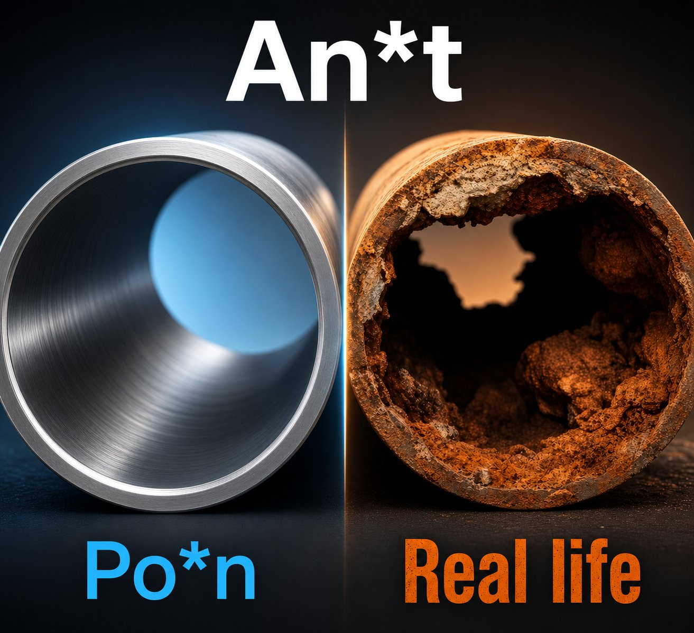
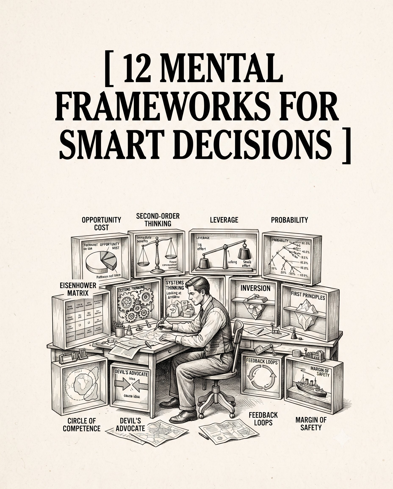

# 🐦 @theendeavorpath

## 📅 August 24, 2026

> 7 post(s) archived.

---

### 🕐 17:42 UTC · @theendeavorpath

> 8 FEMALE PSYCHOLOGIES EVERY MAN SHOULD REMEMBER

🔗 [View original post](https://x.com/EnergyUp_/status/2091944305514643743)

---

### 🕐 16:26 UTC · @theendeavorpath

> Porn is a trap in real life sex.

🔗 [View original post](https://x.com/stoicmen_/status/2091925006829707583)

---

### 🕐 14:12 UTC · @theendeavorpath

> 12. Compounding Small daily improvements accumulate into explosive, unstoppable results over time. Ray Dalio highlights the exponential power of micro habits. Example: Reading ten pages a day creates a master scholar over a few years. Try this: Commit to one tiny one percent upgrade every morning without fail.

🔗 [View original post](https://x.com/theendeavorpath/status/2091891400606703761)

---

### 🕐 14:12 UTC · @theendeavorpath

> 11. Asymmetric Risk Seek out ventures where the downside is strictly capped while the upside is massive. Nassim Taleb champions exposure to positive black swans. Example: Writing a public article costs little time but creates infinite upside. Try this: Cut out all high-risk, low-reward habits from your daily routine.

🔗 [View original post](https://x.com/theendeavorpath/status/2091891394763972653)

---

### 🕐 14:12 UTC · @theendeavorpath

> 6. The 80/20 Rule Identify the tiny twenty percent of actions generating eighty percent of your progress. Joseph Juran proved a vital few factors drive outcomes. Henry Kissinger focused only on structural levers. Example: Fire draining clients and serve your top twenty percent with absolute obsession. Try this: Cross out four out of five tasks and execute only the one that transforms you.

🔗 [View original post](https://x.com/theendeavorpath/status/2091891369979846902)

---

### 🕐 14:12 UTC · @theendeavorpath

> 5. Occam&apos;s Razor When chaos hits, the simplest explanation is almost always the absolute truth. William of Ockham argued that the fewest assumptions win. People love complex drama because they crave excitement. Example: When a friend goes quiet, ignore wild narratives; they are just busy. Try this: When a venture collapses, write down the most boring, obvious physical truth

🔗 [View original post](https://x.com/theendeavorpath/status/2091891364032303405)

---

### 🕐 14:12 UTC · @theendeavorpath

> 12 MENTAL FRAMEWORKS FOR SMART DECISIONS:

🔗 [View original post](https://x.com/theendeavorpath/status/2091891336341557485)

---
