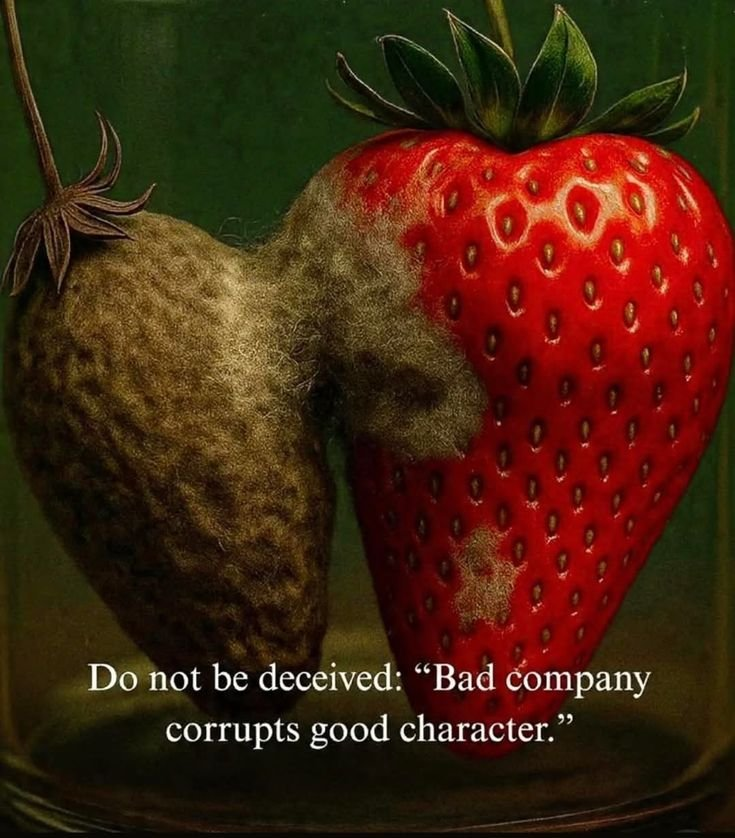
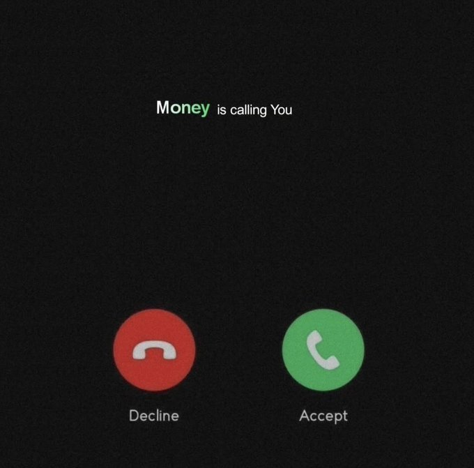
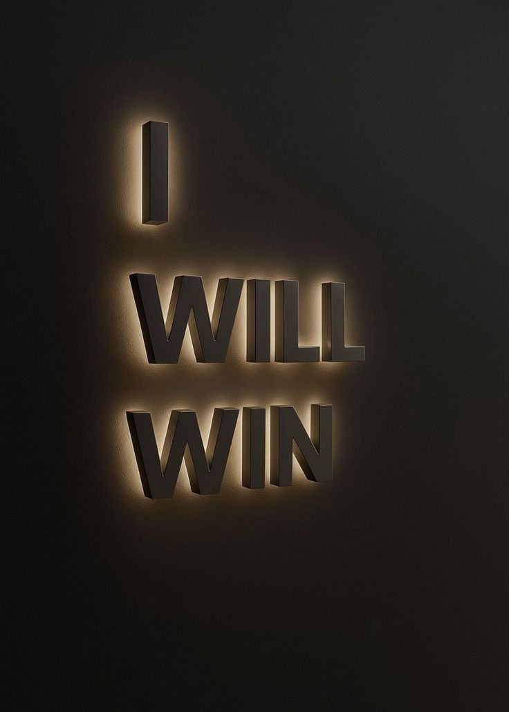

# 🐦 @Alphafiles1

## 📅 August 25, 2026

> 10 post(s) archived.

---

### 🕐 10:02 UTC · @Alphafiles1

> Show me your friends and I will know who you are.

🔗 [View original post](https://x.com/realmantalk3/status/2092190784741146809)

---

### 🕐 10:01 UTC · @Alphafiles1

> Jesus will never fail you.

🔗 [View original post](https://x.com/TheRich_Gospel/status/2092190567564292215)

---

### 🕐 10:00 UTC · @Alphafiles1

> Go hard or go home!!

🔗 [View original post](https://x.com/Alphafiles1/status/2092190432755081632)

---

### 🕐 08:09 UTC · @Alphafiles1

> I always tell people this: it’s completely okay to step away from friendships for a while until you get your life together. If your pockets are dry, stop stressing yourself trying to keep up with your friends. You don’t have to be at every party, every plan, every outing just because you’re scared of being left behind. Pull back for a while. Fix your life. Let that hunger push you. Because nothing kills your dignity faster than showing up to a party and having your friends sort out your food, fare, drinks, and everything else. Don’t lower yourself just because you want to fit into the circle. Disappear for a bit. Find your way. Get yourself together. You’ll meet them ahead.

🔗 [View original post](https://x.com/LifeInQuiet/status/2092162510375825555)

---

### 🕐 07:24 UTC · @Alphafiles1

> Accept

🔗 [View original post](https://x.com/Alphafiles1/status/2092151129085743291)

---

### 🕐 06:36 UTC · @Alphafiles1

> Soonest.

🔗 [View original post](https://x.com/realmantalk3/status/2092138916052717708)

---

### 🕐 06:35 UTC · @Alphafiles1

> God will Alwayyyyys come through for you.

🔗 [View original post](https://x.com/TheRich_Gospel/status/2092138720228950403)

---

### 🕐 06:34 UTC · @Alphafiles1

> Alwayyyyys

🔗 [View original post](https://x.com/Alphafiles1/status/2092138430809477142)

---

### 🕐 06:01 UTC · @Alphafiles1

> As a man Physical fitness is the bedrock of personal discipline. • Health • Confidence • Mental clarity • Personal achievement • Stress management • Physical capability It shapes every aspect of your life. Invest in it wholeheartedly.

🔗 [View original post](https://x.com/Alphafiles1/status/2092130258119975085)

---

### 🕐 05:52 UTC · @Alphafiles1

> Own your mistakes. Be confident enough to admit when you messed up, forgive yourself quickly, learn from it, and move on. You don’t have to make a whole drama out of every mistake.

🔗 [View original post](https://x.com/LifeInQuiet/status/2092128037290590333)

---
