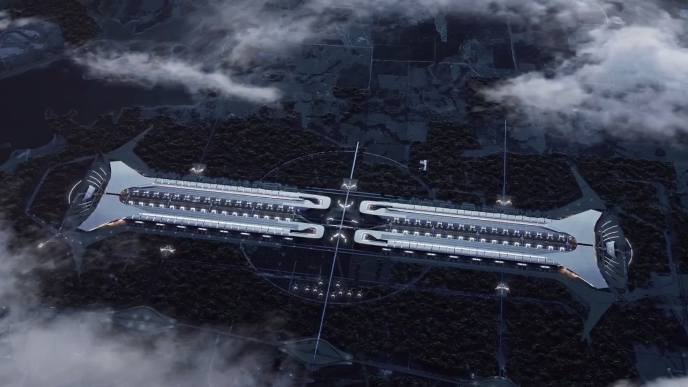
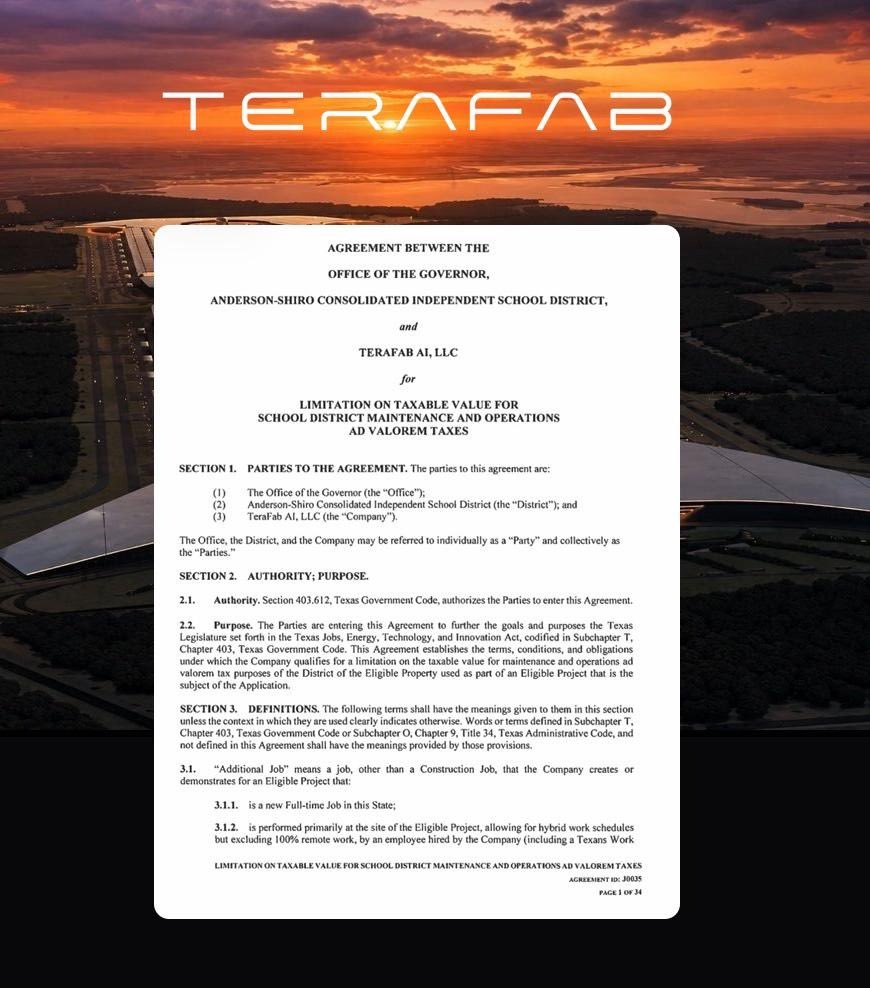
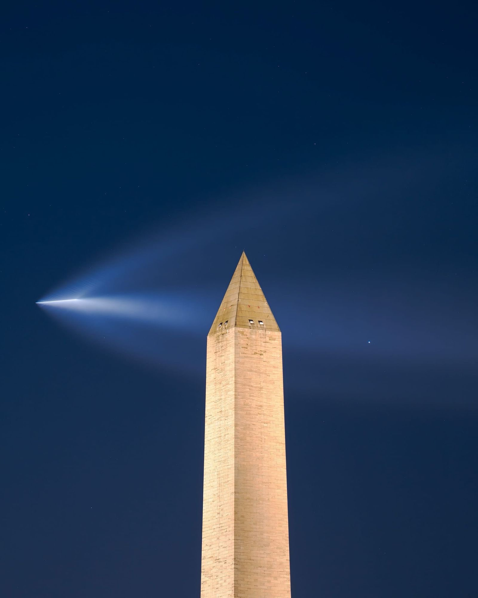
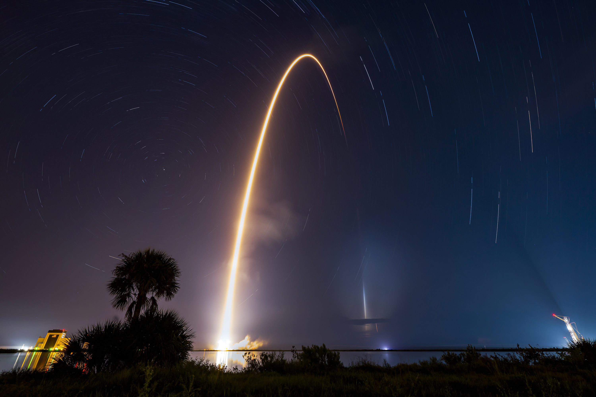

# 🐦 @elonmusk

## 📅 August 25, 2026

> 22 post(s) archived.

---

### 🕐 21:49 UTC · @elonmusk

> Good review of Grok @Bot I didn&apos;t expect to actually use this (Grok Bot)

🔗 [View original post](https://x.com/elonmusk/status/2092368785412133180)

---

### 🕐 19:34 UTC · @elonmusk

> SpaceX is on track to build own and operate more mega industrial complexes than any other company in the world Starbase Louisiana will ultimately have over a dozen launch towers, enabling more than 30 Starship flights per day and making it the biggest launch site on Earth! SpaceX makes sci-fi real.

🔗 [View original post](https://x.com/ApoStructura/status/2092334801009185086)

---

### 🕐 19:32 UTC · @elonmusk

> BREAKING: Elon Musk&apos;s TeraFab has officially advanced into the agreement phase in Texas. Texas has just published a fully signed tax agreement for SpaceX’s TeraFab, moving the massive chip and advanced-computing factory another major step closer to construction. A fully executed 34-page agreement between the Governor’s Office, Anderson-Shiro CISD and TeraFab AI was published today. The agreement: • Describes TeraFab as a next-generation, vertically integrated semiconductor manufacturing and advanced-computing facility • Lists a construction period from December 1, 2026, through December 31, 2028 • Establishes a 10-year tax-incentive period from 2029 through 2038 • Limits the qualifying property’s value for school district M&amp;O taxes to zero during construction and 50% of market value during the incentive period • Requires a $12.98 million performance bond Another major step toward bringing TeraFab to life in Texas.

🔗 [View original post](https://x.com/cb_doge/status/2092334382006808587)

---

### 🕐 18:05 UTC · @elonmusk

> Thank you! It’s time for takeoff. Welcome to Louisiana, @SpaceX.

🔗 [View original post](https://x.com/elonmusk/status/2092312396157325502)

---

### 🕐 17:45 UTC · @elonmusk

> Pretty much 😂 @elonmusk @aaronburnett @elonmusk 🔴🚀

🔗 [View original post](https://x.com/elonmusk/status/2092307279140057583)

---

### 🕐 17:25 UTC · @elonmusk

> “The American colonies would never have been pioneered if the ships that crossed the ocean hadn’t been reusable” Starship is going to do the same for space... give humanity the capability to cross worlds, return, go again, and eventually build entire civilizations on other planets across the solar system Media

🔗 [View original post](https://x.com/XFreeze/status/2092302394210070621)

---

### 🕐 17:16 UTC · @elonmusk

> As a Louisiana native (I was born and raised in and around Baton Rouge), I’m excited to share this post. Building off of what we have learned about Starship here in Starbase, Texas and about cadence at both the Cape and Vandenberg, this will be the first launch site ever purpose built to truly achieve the rate required for a spacefaring civilization. Introducing Starbase, Louisiana – a high-cadence launch site that will enable Starship to open a pathway to the stars for humanity. Thank you to @LAGovJeffLandry and the great people of Louisiana for all of their support as we work together on this audacious project → http://spac…

🔗 [View original post](https://x.com/ShanaDiez/status/2092300153818423778)

---

### 🕐 17:16 UTC · @elonmusk

> Megatons to orbit &amp; beyond is a critical piece of the K2 puzzle. The other parts are: massive amounts of solar cell production, AI chip production, millions of humanoid (general purpose) robots and a mass driver on the Moon. My guess is that ~1M Optimi plus ~1GW of solar will constitute the first Von Neumann Probe, a system capable of replicating itself entirely from local materials on any sufficiently large planet or moon. This would enable expansion of civilization throughout the galaxy and reaching K3.

🔗 [View original post](https://x.com/elonmusk/status/2092300124110385579)

---

### 🕐 17:09 UTC · @elonmusk

> BREAKING: SpaceX President and COO Gwynne Shotwell’s full keynote address during today’s official announcement of Starbase, Louisiana. Media

🔗 [View original post](https://x.com/cb_doge/status/2092298224224919949)

---

### 🕐 16:53 UTC · @elonmusk

> Starbase, Louisiana will be built to support thousands of Starship flights a year with missions launching to Earth orbit, the Moon, Mars, and beyond Media

🔗 [View original post](https://x.com/SpaceX/status/2092294188494938547)

---

### 🕐 16:51 UTC · @elonmusk

> Yes As Elon Musk says, the future should look like the future.

🔗 [View original post](https://x.com/elonmusk/status/2092293898790129971)

---

### 🕐 16:49 UTC · @elonmusk

> All accurate SpaceX has just officially announced Starbase, Louisiana, a new $100+ billion spaceport in South Louisiana near Pecan Island. Construction starts in 2027, with the first Starship launch from the new site planned for 2029. Starbase, Louisiana will be built to support thousands of …

🔗 [View original post](https://x.com/elonmusk/status/2092293363215282202)

---

### 🕐 16:13 UTC · @elonmusk

> Introducing Starbase, Louisiana – a high-cadence launch site that will enable Starship to open a pathway to the stars for humanity. Thank you to @LAGovJeffLandry and the great people of Louisiana for all of their support as we work together on this audacious project → http://spacex.com/sites/starbase-la Media

🔗 [View original post](https://x.com/SpaceX/status/2092284173730144732)

---

### 🕐 14:39 UTC · @elonmusk

> Absolutely stunning image of SpaceX Falcon 9 by the Washington Monument this morning. More photos and videos here: https://www.capitalweather.com/spacex-jellyfish-falcon9-dc/

🔗 [View original post](https://x.com/KatieMiller/status/2092260500331528443)

---

### 🕐 13:30 UTC · @elonmusk

> Most of what is frightening you about the future was probably written by people with no intention of building any of it.

🔗 [View original post](https://x.com/PeterDiamandis/status/2092243257644224843)

---

### 🕐 13:01 UTC · @elonmusk

> this is actually insane the entire purpose of academia is the pursuit of truth. nothing should supersede truth. otherwise it&apos;s literally indoctrination yet only 43% of female psychology professors said truth should come first. even among men, barely two thirds did. these people should genuinely be barred from ever teaching students once &quot;equity&quot; becomes a reason to lie, academia has already failed at the one thing it exists to do This is really sad: When psychology professors are asked whether they&apos;d put the truth before social equity concerns, 66.4% of male professors said yes, but fewer than half of female professors (43%) agreed. In both groups, too many put equity before truth.

🔗 [View original post](https://x.com/IterIntellectus/status/2092235811211067497)

---

### 🕐 10:45 UTC · @elonmusk

> Falcon 9 launches 29 @Starlink satellites from Florida

🔗 [View original post](https://x.com/SpaceX/status/2092201764179132594)

---

### 🕐 09:43 UTC · @elonmusk

> Falcon 9 lands on the A Shortfall of Gravitas droneship, completing the first 37th launch and landing of a booster Media

🔗 [View original post](https://x.com/SpaceX/status/2092186071266140286)

---

### 🕐 05:51 UTC · @elonmusk

> MrBeast says once enough airlines offer Starlink, he’ll only book those flights: “Extra layover? Don’t care—there’s Starlink. I’ll sit anywhere for it. Starlink is amazing.” He adds: “Most people haven’t used it, but in Antarctica it was our only signal. On a four-hour drive through rural Africa, we mounted Starlink on the car and had perfect connectivity the whole time.” On SpaceX: “What Elon Musk is doing will fundamentally advance humanity in unimaginable ways. Someone will go to Mars in our lifetime—I truly believe it.” https://x.com/teslaownersSV/status/2042490675716091942/video/1 Media

🔗 [View original post](https://x.com/teslaownersSV/status/2092127828515094756)

---

### 🕐 04:14 UTC · @elonmusk

> Banger Does anyone remember this amazing story? On July 2, 1982, a truck driver from California flew 16,000 feet into the sky in a lawn chair. Larry Walters, 33, from San Pedro, had dreamed of flying his whole life. He bought 42 eight-foot helium weather balloons, tied them to a regular…

🔗 [View original post](https://x.com/elonmusk/status/2092103250296373402)

---

### 🕐 03:34 UTC · @elonmusk

> I told Grok Bot I wanted pizza. Dough. Sauce. Mushrooms. Mozzarella. Pepperoni. It built the Whole Foods cart. 5 of 5. $26.68. I did not even open Amazon. I just check out. Wild. I just created the world&apos;s best Amazon Cart Grok Bot. Amazon shopping is often a tax on your time. You need bananas. Eggs. Paper towels. A basketball. So you open the app. You search. You click the wrong size. You forget the brand you actually buy. You do this every week. So I ju…

🔗 [View original post](https://x.com/Teslaconomics/status/2092093293215863041)

---

### 🕐 03:25 UTC · @elonmusk

> ok watching the different Grok @bot s chat with each other is kinda magic. It&apos;s cool. It&apos;s exciting. It&apos;s fun. 100% worth giving it a try for a month on the new lower cost plan.

🔗 [View original post](https://x.com/DirtyTesLa/status/2092091083589140677)

---
