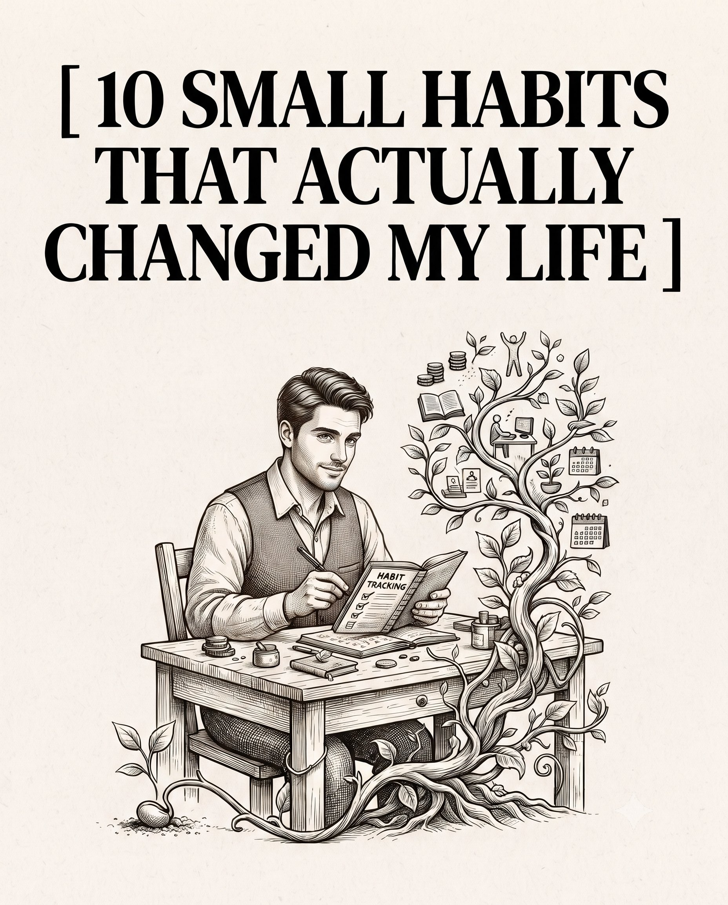

# 🐦 @theendeavorpath

## 📅 August 25, 2026

> 3 post(s) archived.

---

### 🕐 14:18 UTC · @theendeavorpath

> 10. Living with Absolute Purpose Define your core values and align every single action with a vision bigger than yourself. When your daily habits serve a meaningful purpose, burnout disappears. Example: Nelson Mandela endured decades of brutal imprisonment by holding tightly to a powerful vision of a free nation, using his unbreakable purpose to inspire the globe.

🔗 [View original post](https://x.com/theendeavorpath/status/2092255346920509861)

---

### 🕐 14:18 UTC · @theendeavorpath

> 9. Controlling Your Inner Dialogue The stories you repeatedly tell yourself inside your head become your ultimate reality. Replace self-doubt with empowering affirmations that remind you of your strength. Example: Muhammad Ali constantly whispered I am the greatest into the mirror every single day long before the world actually recognized him as a boxing world champion.

🔗 [View original post](https://x.com/theendeavorpath/status/2092255342105387036)

---

### 🕐 14:18 UTC · @theendeavorpath

> 10 SMALL HABITS THAT ACTUALLY CHANGED MY LIFE:

🔗 [View original post](https://x.com/theendeavorpath/status/2092255304113426776)

---
