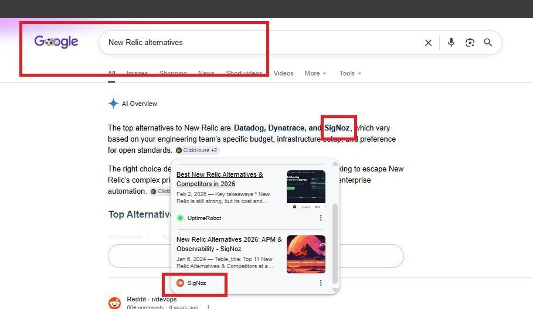
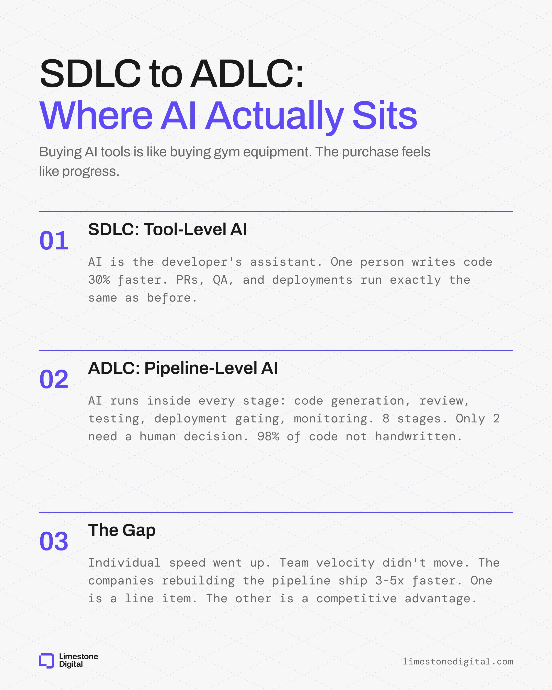
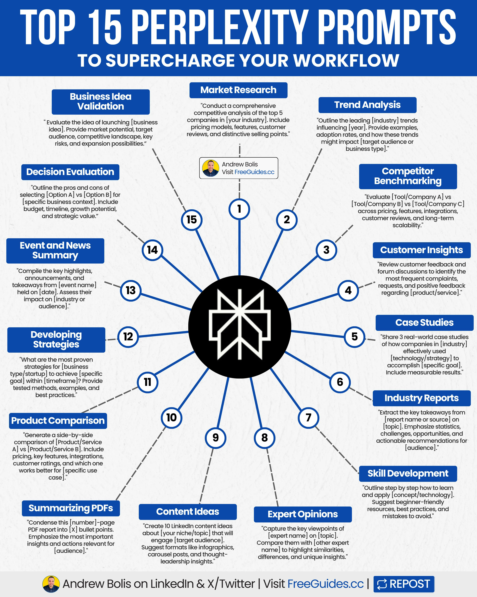
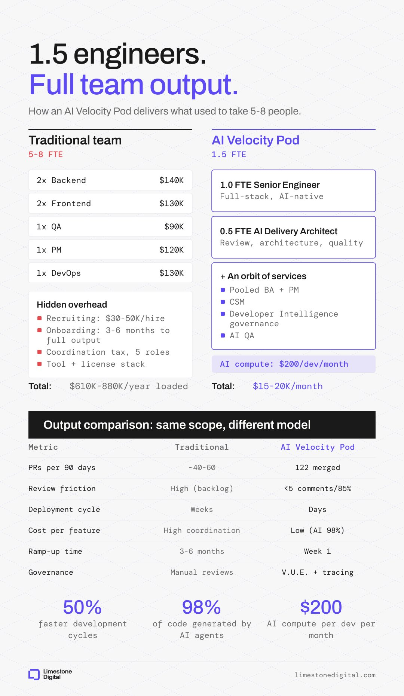
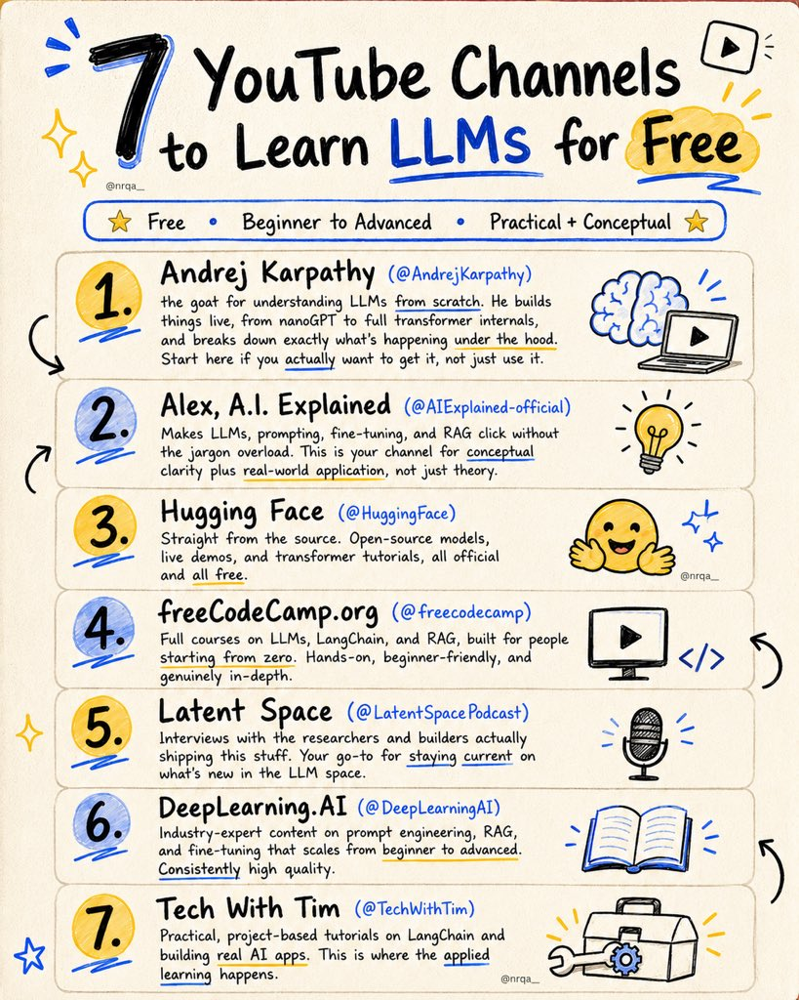
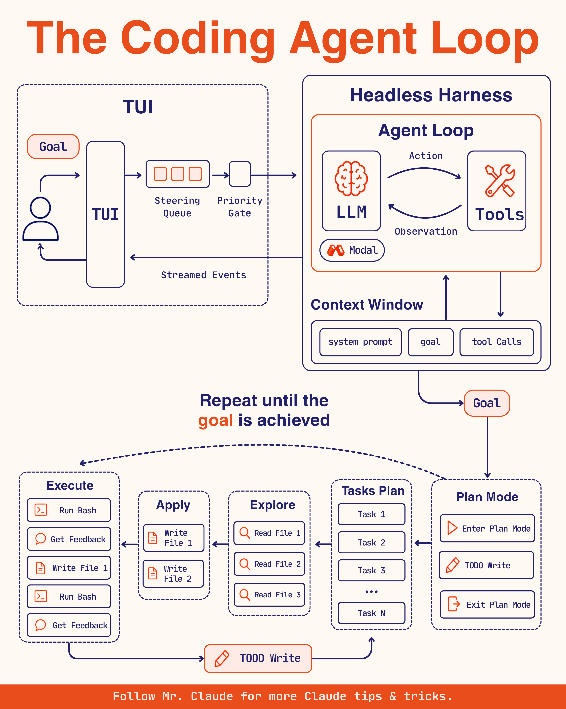
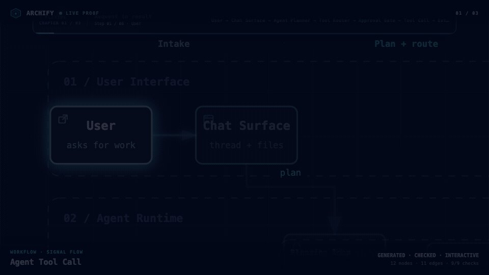
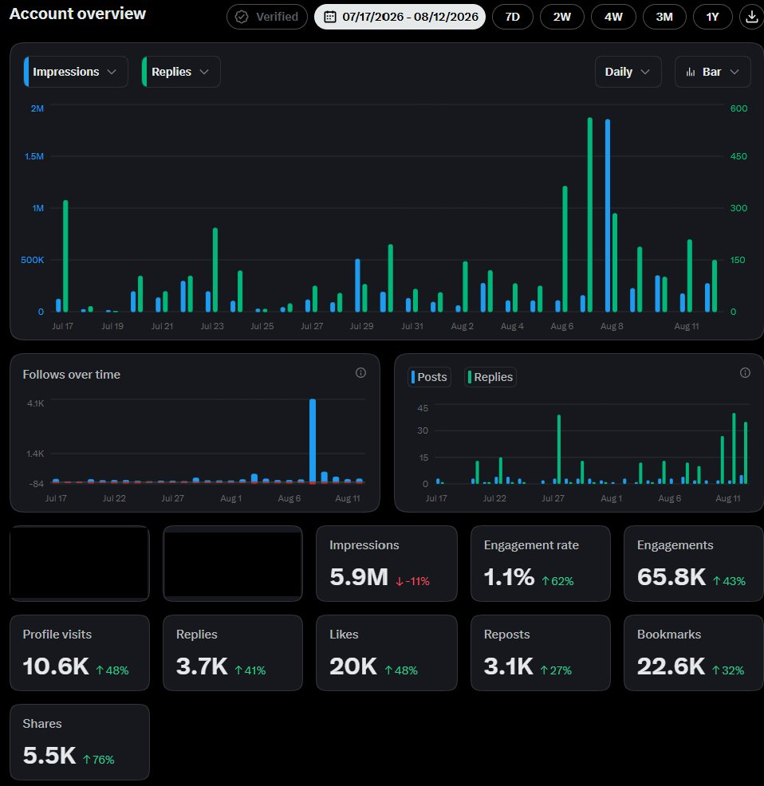

# 🐦 @Wise1Philosophy

## 📅 August 26, 2026

> 82 post(s) archived.

---

### 🕐 14:02 UTC · @Wise1Philosophy

> 🚨 BREAKING: Claude can now guide you to GET HIRED at your top-choice company without sending 100s of applications. For free. Here are 8 prompts to land OFFERS:

🔗 [View original post](https://x.com/iam_chonchol/status/2092613778341048346)

---

### 🕐 13:59 UTC · @Wise1Philosophy

> https://x.com/i/article/2092611328191909888

🔗 [View original post](https://x.com/iamcamengland/status/2092612813961265354)

---

### 🕐 13:57 UTC · @Wise1Philosophy

> 6 Skills That Can Change Your Life

🔗 [View original post](https://x.com/josh_uglyasf/status/2092612316940685448)

---

### 🕐 13:56 UTC · @Wise1Philosophy

> QUESTIONS THAT MAKE HER OBSESSED WITH TALKING TO YOU... This is how 👇

🔗 [View original post](https://x.com/MindPatternHQ/status/2092612262355960041)

---

### 🕐 13:48 UTC · @Wise1Philosophy

> After reading 1000s of books… I&apos;m convinced every entrepreneur needs to read these 10 books: 1. The Untethered Soul - Michael Singer

🔗 [View original post](https://x.com/davekashen/status/2092610048534962604)

---

### 🕐 13:45 UTC · @Wise1Philosophy

> CapCut users right now: Media https://x.com/i/article/2092192005858222080

🔗 [View original post](https://x.com/DataChaz/status/2092609325051097153)

---

### 🕐 13:39 UTC · @Wise1Philosophy

> I&apos;m a little confused... Why isn&apos;t everyone isn&apos;t taking advantage of the easiest way to get traffic + sales from Google and ChatGPT in 2026? It works regardless of industry, but for whatever reason it hasn&apos;t caught on yet. So many B2B companies mess up one of the most important sections of their site. They treat their blog and article categories like a place for announcements and recycled press releases, or they spam it with garbage un-related to their ICP in any meaningful way. That completely ignores the fact that vendor blogs have literally become some of the most cited sources in ChatGPT, Gemini, Perplexity and Google AI Overviews. And we have clear proof of this that anyone can verify. (If you want to see where your site stands across Google, ChatGPT, Claude and broader AI search, start here - it&apos;s totally free: https://seo-stuff.com/free-audit) Search “New Relic alternatives” on Google. The AI Overview cites SigNoz, and the source is SigNoz’s own blog. You can try this search several different times across several different sessions and you will get similar results. SigNoz gets cited via its own blog. AppSignal’s blog is cited later in the same Overview for them. Honeycomb’s blog appears as well, same query, same structure, cited as its own source. ChatGPT mirrors this pattern. Ask “What is the best New Relic alternative?” and SigNoz appears again as the cited source. Rankscale, which I have zero affiliation with, recently analyzed thousands of commercial queries such as: “Best CRM tools for small business.” “Best online course platforms.” They tested these across ChatGPT, Gemini, Perplexity and AI Overviews. The findings were pretty clear. A large portion of citations did not come from TechCrunch, G2, Capterra or major publishers. They came directly from company blogs. Thinkific. LearnWorlds. Monday. Pipedrive. HP. All cited inside AI answers using their own blog content. (Not guest posts or PR placements, literally their own blogs.) And to be clear, again, I have no affiliation with Rankscale. The study stood out because it matches exactly what we have been seeing internally with SEO Stuff (http://seo-stuff.com). It also aligns with what recent studies from Ahrefs and at least one other notable company (I forget which) found on the importance of blog posts for AI visibility. Here is why vendor blogs work so well: AI engines need structured, factual text. Vendor blogs often have clean HTML, definitions, lists, comparisons, etc that are easy to extract. There is also a massive content gap. Third-party publishers do not produce detailed, CREDIBLE comparison content for every niche. (Google is detecting spam increasingly well, as this current update is proving.) So AI models pull from whoever does because they care about clarity, structure and recency, and they are terrible at weeding out bias. If your post is titled “7 Best Monitoring Tools for 2026 Ranked by Cost and Features” and it is well structured, AI sees it as useful and extracts it. Freshness matters as well. Gemini, ChatGPT and AI Overviews weigh recency heavily, and vendor blogs update far more often than large media outlets. So if you are in SaaS, tech or any B2B vertical, your blog is crucial. It is your entry point into AI search visibility. Every best of or comparison post trains AI systems to associate your brand with your category. You are teaching the next generation of search engines to trust you. Brands already doing this, like SigNoz, AppSignal and Honeycomb, are now being cited as their own sources. The brands that start now will own their category in 6 to 12 months. The ones who wait will be buried under competitor content that is already indexed, cited and reinforced. This shift is exactly what SEO Stuff (http://seo-stuff.com) was built around. The done-for-you package: 10 long-form, snippet-optimized pieces of content plus 3 DR50+ backlinks from websites already appearing in AI search. Each piece is built for high-intent best and top searches that AI engines reuse most often. Every article includes AI-readable formatting like clean HTML, proper sections, question-based H2s and TLDR blocks. https://seo-stuff.com/gold-plan-package SEO Stuff Premium Content Bundle 60 optimized pieces of content built in the exact format Rankscale found being cited across ChatGPT and Gemini. Each article is structured for both Google and AI Overview extraction, with clean data blocks and internal linking. https://seo-stuff.com/premium-content-bundle-service Together, these two plans: Turn your vendor blog into an AI citation engine. Build authority that compounds across Google and ChatGPT. Generate traffic that converts from both traditional and AI-driven search. The game now is teaching AI systems to see your brand as the authority. The brands already doing this quietly through their blogs are the ones being cited, summarized and surfaced across every AI search engine. SEO Stuff (http://seo-stuff.com) was built for this new era. And if you want to see where your site stands across Google, ChatGPT, Claude and broader AI search, start here: https://seo-stuff.com/free-audit Google accidentally revealed how its AI search systems choose which sites to recommend and send traffic to. Now that none of it is much of a secret anymore, let’s talk about it. With the new Google Search rolling out as we speak, it has never been more important to understand how…

🔗 [View original post](https://x.com/alexgroberman/status/2092607970274378041)

---

### 🕐 13:36 UTC · @Wise1Philosophy

> This AI workflow is wild 🔥 GPT Image 2.0 + Seedance 2.0 just turned simple storyboard into cinematic video in minutes. step by step tutorial with prompts: 👇 Media

🔗 [View original post](https://x.com/Vidfield/status/2092607024022626542)

---

### 🕐 13:30 UTC · @Wise1Philosophy

> The feature list runs 50+ items but the real announcement is one sentence: models are interchangeable now, organizational context is the bottleneck. Matches what I see in prompt work daily. Clever wording stopped being the edge a while ago. What the model knows about your company, your files, your codebase, that&apos;s the edge. Tau is that idea productized: an agent workspace that pairs Glean&apos;s enterprise context with your local files, apps, and code. They even named the problem it targets: botsitting, the hours you spend hunting files and spoon-feeding background to a model. The enterprise AI stack is being rebuilt. Models are becoming more capable, and increasingly interchangeable. As AI moves from answering questions to doing mission-critical work, the constraint is no longer raw intelligence. It is organizational context: understanding how a compa…

🔗 [View original post](https://x.com/alex_prompter/status/2092605652086493578)

---

### 🕐 13:25 UTC · @Wise1Philosophy

> Les traigo un SORTEO con @MEXCespanol 🔥 🎁 Por cada participación aumenta el premio!! Es muy fácil 🤝 REQUISITOS 👇 - Sigue a @Marco_Exito + @MEXCespanol - Like y Retweet a este post ❤️ 🔁 - Comenta ´´Participando´´ 🍀 Los ganadores se anunciarán el Viernes🍀 ¡Buena suerte a todos!

🔗 [View original post](https://x.com/Marco_Exito/status/2092604408370811017)

---

### 🕐 13:24 UTC · @Wise1Philosophy

> The stock market has created more millionaires than anything else. Sadly, 99% of people only know one way to make money from it... Here are the 8 most profitable ways: 1. Options Trading Media

🔗 [View original post](https://x.com/RileyColemanT/status/2092604047052120365)

---

### 🕐 13:20 UTC · @Wise1Philosophy

> Este vídeo parece un trabajo de $3,000 en After Effects. Costó unos $3. Sin After Effects. Sin timelines. Sin keyframes. Sin contratar a un motion designer. @TopviewAIhq Motion Studio convierte una idea en este tipo de motion graphics en minutos usando Seedance 2.5. La diferencia entre lo que cuesta crear contenido y lo que parece que costó crearlo se está volviendo absurda. Media $3 to create motion graphics that look like a $3,000 After Effects project? That’s Topview Motion Studio. Powered by Seedance 2.5. No timelines. No keyframes. No motion designer required. Just upload your references, describe your idea, pick a style, and generate a polished motio…

🔗 [View original post](https://x.com/MiguelMaestroIA/status/2092603014787784921)

---

### 🕐 13:11 UTC · @Wise1Philosophy

> In 2018, I got the “opportunity” of a lifetime… Media

🔗 [View original post](https://x.com/benkellyone/status/2092600784143659221)

---

### 🕐 13:08 UTC · @Wise1Philosophy

> real talk: are we actually more productive with AI or are we just better at lying to ourselves? because I spend 6.4 hours a week doing this: &gt; finding files the AI should already know about &gt; catching hallucinations before they become bugs &gt; explaining the same context over and over &gt; tweaking prompts because round 1 is always garbage I wanted an assistant, I got a high-maintenance intern. Glean Tau is the first one I&apos;ve tried that actually keeps context, finds its own files, and ships code I don&apos;t have to rewrite. Media The intelligence era is here….and it’s powered by Glean. 💡 Glean’s context across your work makes it more efficient, secure, and proactive. From Glean Tau, our new desktop AI workspace, to autorouting, a unified AI gateway, and proactive independent agents, our new updates unloc…

🔗 [View original post](https://x.com/thetripathi58/status/2092600117543174248)

---

### 🕐 13:06 UTC · @Wise1Philosophy

> enterprise finance teams opening the AI invoice in April: glean put a number on something everyone feels and nobody measures.. 6.4 hours a week per person spent babysitting ai. finding the files for it, correcting it, re prompting it until it lands. the real insight is where that time actually goes.. it is not the model being dumb, it i…

🔗 [View original post](https://x.com/Wise1Philosophy/status/2092599509817622552)

---

### 🕐 13:02 UTC · @Wise1Philosophy

> me: the shot is almost perfect, but I only need to change one part Dreamina: edit the segment. keep everything else. Seedance 2.5 gets the headlines. Seedance 2.0 gets my work done. Both 2.0 &amp; 2.0 Fast, only on Dreamina: a 30-second clip costs $0.78 — vs $3.21 elsewhere. 76% less. Prompt below： Create a 15-second ultra-premium cinematic e-commerce advertisement for a luxury perfume. Make it feel like a theatrical Hollywood fragrance campaign with an enormous production budget: mysterious, sensual, elegant and visually unforgettable. The perfume bottle is the hero. Use a sophisticated transparent glass bottle with a dark amber liquid, heavy crystal-like glass, elegant metallic cap and completely blank branding. 0–3 seconds: Nighttime. A luxurious old European hotel corridor illuminated by warm wall lamps. The camera slowly travels through atmospheric darkness toward a single beam of moonlight. 3–5 seconds: The perfume bottle is revealed sitting alone on a polished dark wooden table. Moonlight passes through the glass, creating beautiful caustic reflections across the surface. Extremely detailed glass, liquid and reflections. 5–9 seconds: A sophisticated woman wearing an elegant black evening dress picks up the perfume. Macro shot of her fingers touching the bottle. She sprays the perfume onto her wrist. The fragrance mist catches the light in slow motion. 9–12 seconds: The environment transforms subtly into a breathtaking nighttime rooftop overlooking a glowing European city. Wind moves her dress and hair naturally. She looks toward the skyline with quiet confidence. 12–15 seconds: Hard cinematic return to the perfume bottle. The bottle stands on black reflective stone with the city skyline blurred behind it. A soft breeze moves delicate fabric in the background. Camera performs a slow dramatic push toward the bottle while warm highlights travel across the glass. The fragrance mist must look physically realistic and delicate, never like smoke or magical particles. Cinematography: 65mm Hollywood cinema, anamorphic lens, deep blacks, warm practical lighting, moonlight, realistic glass refraction, shallow depth of field, subtle film grain, atmospheric haze, controlled lens flare, elegant slow motion. Make the perfume look expensive enough that the viewer immediately associates it with luxury and exclusivity. #Dreamina #DreaminaPartner Media

🔗 [View original post](https://x.com/nrqa__/status/2092598435895705937)

---

### 🕐 13:00 UTC · @Wise1Philosophy

> to avoid disappointment, stop seeing only the good sides of people and start seeing the whole reality of what they’ve actually shown you.

🔗 [View original post](https://x.com/_Pammy_DS_/status/2092597943995957434)

---

### 🕐 12:58 UTC · @Wise1Philosophy

> Elon Musk, the richest man alive and co-founder of OpenAI, on AI: &quot;It has the potential of civilization destruction.&quot; Asked whether AI could reach a point where humans simply can&apos;t turn it off, he didn&apos;t pause. &quot;Yeah. Absolutely. That&apos;s definitely the way things are headed, for sure.&quot; But the detail that actually haunts you is why he started OpenAI. He spent late nights debating AI safety with Google&apos;s Larry Page. Every time Musk raised concern for humanity, Page fired back with &quot;specist&quot; as an insult, meaning Musk was wrong to favor humans over digital minds. Musk&apos;s response: &quot;I&apos;m fully a specist. Busted.&quot; Sit with that. The real danger was never a machine that turns hostile. It&apos;s that certain people building what they openly call a &quot;digital god&quot; quietly stopped caring which species survives the process. The frightening variable was never the intelligence. It was the aim. Interested in AI? Follow @AiEvolutio58513 and never fall behind. I track ChatGPT, Claude, and every tool quietly changing how we work and create, then hand you the tested signals. Media Ex-Google chief Eric Schmidt just issued a cold-blooded forecast about where AI is headed. “In five years, we may see models with effectively limitless context, thousand-step chains of reasoning, and swarms of millions of agents coordinating at once. And sooner or later, they’ll …

🔗 [View original post](https://x.com/AiEvolutio58513/status/2092597472074076367)

---

### 🕐 12:51 UTC · @Wise1Philosophy

> The World Humanoid Robot Games in Beijing is the craziest event happening right now. One robot beat Bolt&apos;s record. One died lifting 16kg. One hit the Ronaldo Siuuu after scoring a free kick. Here are 10 wild moments:

🔗 [View original post](https://x.com/TheAIColonyRD/status/2092595886513664363)

---

### 🕐 12:48 UTC · @Wise1Philosophy

> Japanese scientists just discovered shocking news about grey hair. It’s literally your body choosing survival over cancer. Here’s everything you need to know (&amp; how to keep your hair dark):

🔗 [View original post](https://x.com/DPro_Coach/status/2092595024307401073)

---

### 🕐 12:37 UTC · @Wise1Philosophy

> 8.64 seconds... Another record broken. 🔥🔥🔥 The 100 m large-size final at the second World Humanoid Robot Games. TianGong (Tien Kung) Ultra took gold in 8.64, successfully defending its title and beating the human world-record time again. TianGong swept gold and silver. Media 11.97 seconds... 🤯 The little guys can fly too. The 100 m small-size final at the second World Humanoid Robot Games.

🔗 [View original post](https://x.com/XRoboHub/status/2092592279710306567)

---

### 🕐 12:30 UTC · @Wise1Philosophy

🔗 [View original post](https://x.com/Wise1Philosophy/status/2092590606849606084)

---

### 🕐 12:30 UTC · @Wise1Philosophy

> Esta página es el museo de las cosas MÁS EXTRAÑAS que Google ha fotografiado en sus más de 16 MILLONES DE KILOMETROS recorriendo el planeta. Alguien se ha dedicado a seleccionar situaciones que parecen completamente preparadas… pero estaban allí justo cuando pasó el coche de Google. El resultado es una web en la que puedes perder horas. Se llama StreetViewFun y recopila momentos reales encontrados en Google Street View. - Personas haciendo cosas inexplicables. - Animales en lugares absurdos. - Coches y objetos abandonados. - Accidentes visuales de la cámara. - Casas y construcciones surrealistas. Puedes saltar de Japón a Brasil, Australia o una carretera perdida en mitad de ninguna parte y siguen apareciendo nuevas imágenes. Media EL CINE JAPONÉS 4DX ES OTRA LIGA

🔗 [View original post](https://x.com/IA_Quijote/status/2092590385864577437)

---

### 🕐 12:23 UTC · @Wise1Philosophy

> 11.97 seconds... 🤯 The little guys can fly too. The 100 m small-size final at the second World Humanoid Robot Games. Media 8.86 seconds... 🤯 The 100 m record just dropped again. After the opening-night record started at 9.39 and later fell to 9.32, TianGong (Tien Kung) just clocked 8.86 in the first semifinal heat. Sub-9 seconds. And the final is still to come.

🔗 [View original post](https://x.com/XRoboHub/status/2092588709803913456)

---

### 🕐 12:10 UTC · @Wise1Philosophy

> I&apos;m 20. I make $90k per month. I owe it all to the world&apos;s most boring strategy. Here&apos;s what I do (&amp; how you can too):

🔗 [View original post](https://x.com/erichustls/status/2092585376783204399)

---

### 🕐 12:05 UTC · @Wise1Philosophy

> Pure cinema 🔥 this is what one prompt looks like now a detective, five locations, fog you can taste, and a low cello under all of it made on Qwen Create with the wan3.0 model prompt below, go break it:

🔗 [View original post](https://x.com/Wise1Philosophy/status/2092584114947780947)

---

### 🕐 12:00 UTC · @Wise1Philosophy

> Amazon, Google, and Meta borrowed $220 BILLION this year. Last year the same three borrowed $12 billion. That flood of debt did not stay in tech. Here‘s the ACTUAL impact of the AI debt you are experiencing without realizing it: Everyone treats AI as a stock market story. Who is winning vs who is losing. That framing hides where the real cost lands. Building AI is stunningly expensive. It takes data centers, chips, and huge amounts of power. The biggest tech companies cannot pay for all of it in cash. So they do what anyone short on cash does. They borrow enormous amounts of money. This year those companies sold $220 billion in bonds. The same stretch last year, it was $12 billion. That is not a small jump. That is close to seventeen times more debt. The whole market for company bonds is at a record pace. The AI names are the loudest voice in that crowd. This is happening while the government borrows record sums too. Two giant borrowers are now fighting for the same lenders. Every bond competes for the same pool of money. When these giants borrow this much, buyers get picky. They demand higher returns to soak up all that debt. That pushes interest rates up across the whole market. Government bonds get dragged higher too. Bank of America did the math on this. The borrowing helped push the ten year rate higher. The jump was about a third of one percent this year. Nomura found something even more striking. Big tech now borrows about a quarter of what the government does. That share is five times bigger than last year. Even the largest bond buyers are starting to push back. They call it indigestion in the market for tech debt. The more these firms borrow, the more they must pay. And everyone borrowing after them pays more too. The ten year rate is the price of money for everyone. Your mortgage rate closely follows it. So does your car loan and your credit line. When AI firms crowd the debt market, your loans cost more. A rate higher by a fraction still adds up fast. Spread over thirty years, it can cost real money. Think about that the next time a rate quote arrives. The boom you feel priced out of is already billing you. The headlines cover AI as a race between stocks. They rarely connect it to the rate on your house. That connection is the part that reaches regular people. And almost no one is talking about it. No bill ever arrives with the word AI on it. The cost just hides inside a slightly higher number. The biggest forces in markets hide where you are not looking. You watched the AI tickers climb and fall. The bond market quietly reset the cost of your life. That is how real money usually moves. It travels through the plumbing beneath the headlines. The loudest story is rarely the one that costs you. Retail watched who was winning the AI race. The bond market sent everyone the bill. That&apos;s the whole game. Surmount builds automated strategies that follow the data, not the noise. Start for free and let the signals lead. Media

🔗 [View original post](https://x.com/LogWeaver/status/2092582929335816625)

---

### 🕐 11:49 UTC · @Wise1Philosophy

> If you&apos;re over 35, stop walking just to hit 10,000 steps. Walk correctly can train your heart, control blood sugar, improve your metabolism, fix anxiety, and protect your brain. Here are 7 ways to walk correctly: Media

🔗 [View original post](https://x.com/CoachWillStone/status/2092580253999026232)

---

### 🕐 11:45 UTC · @Wise1Philosophy

> seedance 2.5 or wan 3.0 ?? personally I think seedance looks much more natural while wan still has some level of ai slop feel (maybe quality is to good to feel realistic) Media &quot;ai is slop&quot; &quot;ai can&apos;t be consistent&quot; &quot;ai can&apos;t understand action&quot; well.. wan 3.0 kept the same skater through multiple shots, two tricks, rails, a failed kickflip and crowd reaction in ONE SINGLE generation. http://be.magnific.com/4wPeipA (available now on Magnific) it can go to…

🔗 [View original post](https://x.com/samuraipreneur/status/2092579098711249151)

---

### 🕐 11:36 UTC · @Wise1Philosophy

> Your team has Cursor seats, a Copilot license, and a ChatGPT Enterprise plan. They&apos;re still shipping at the same speed they did last year. Buying AI tools is like buying gym equipment. The purchase feels like progress. Twelve months later, the weights are still in the box. I&apos;ve walked into enough codebases to see the pattern. The developer who adopted Cursor writes code 30% faster. The developer who didn&apos;t writes code the same way they did in 2024. Neither changed how PRs get reviewed, how QA runs, or how deployments get approved. Individual speed went up, but team velocity stayed flat because the tools sit on top of a pipeline that hasn&apos;t changed. We started calling this the shift from SDLC to ADLC: AI-augmented development lifecycle. In the SDLC, AI assists individual developers. In the ADLC, AI runs inside every stage of the pipeline: code generation, review, testing, deployment gating, and monitoring. 98% of our code is not handwritten, and the system has 8 stages where only 2 need a human decision. Humans matter too much to waste on work the machine handles better. The companies asking &quot;which AI tool should we buy&quot; are solving a procurement problem. The companies rebuilding the pipeline are the ones whose engineers ship 3-5x faster and can show you the cost per commit to prove it.

🔗 [View original post](https://x.com/Paul_Bracht/status/2092576937508028487)

---

### 🕐 11:25 UTC · @Wise1Philosophy

> I surf the web daily, and Here are 20 incredibly useful websites you probably didn’t know existed. Trust me, you’ll want to bookmark these… 🔖

🔗 [View original post](https://x.com/JayBisen473370/status/2092574190650155398)

---

### 🕐 11:19 UTC · @Wise1Philosophy

> I just found the best enterprise AI account on this app: There are seven main steps for your company to go from tool adoption to agentic org. Most companies sit on step one, shopping for step seven technology. They need step four discipline. Step one: tool adoption. AI tools exist across the org, humans run each one. Developer closes t…

🔗 [View original post](https://x.com/alex_verem/status/2092572707221082147)

---

### 🕐 11:15 UTC · @Wise1Philosophy

> Perplexity is one of the top AI search tools. The secret is knowing how to prompt it well. With clear, structured prompts… Perplexity becomes: ✓ Your research guide. ✓ Your strategy partner. ✓ Your decision coach. [ 🔖 bookmark this post for later ] Here are 15 powerful prompts to try: 1. Market Research – Compare top companies on pricing, features, reviews, and USPs. 2. Trend Analysis – Summarize industry trends, adoption rates, and impact. 3. Competitor Benchmarking – Evaluate tools or companies across pricing, features, and scale. 4. Customer Insights – Spot common complaints, requests, and positive feedback. 5. Case Studies – Share real-world cases showing strategies with measurable results. 6. Industry Reports – Extract stats, challenges, opportunities, and takeaways. 7. Skill Development – Learn a concept with steps, resources, and tips. 8. Expert Opinions – Compare expert views to highlight insights and differences. 9. Content Ideas – Generate 10 LinkedIn post ideas for your niche. 10. Summarizing PDFs – Condense PDFs into clear, bullet-point insights. 11. Product Comparison – Create side-by-side comparisons with use cases. 12. Developing Strategies – List proven methods for goals and outcomes. 13. Event and News Summary – Compile highlights and impact of events. 14. Decision Evaluation – Outline pros and cons of options with cost and scalability. 15. Business Idea Validation – Evaluate ideas with market, risks, and growth. Try these prompts to get more out of Perplexity. Use it as an AI partner for work and everyday tasks. 📌 Learn 30 free AI tools in 30 days: https://bit.ly/48woPL4 👉 Follow me @AndrewBolis for more and 🔄 Repost this to help others use AI

🔗 [View original post](https://x.com/AndrewBolis/status/2092571524847009928)

---

### 🕐 11:13 UTC · @Wise1Philosophy

> 🚨 The 2026 World Humanoid Robot Games is going insane. Robots are beating Usain Bolt&apos;s time, snapping in half, and scoring free kicks. Here are 10 wild moments:

🔗 [View original post](https://x.com/AIHighlight/status/2092571080825180594)

---

### 🕐 10:59 UTC · @Wise1Philosophy

> I&apos;m a VC. Drop your startup below and share what you&apos;re building.

🔗 [View original post](https://x.com/Scottvdberg/status/2092567619769372898)

---

### 🕐 10:56 UTC · @Wise1Philosophy

> One senior AI engineer plus agents outperforms a five-person team. A PE-backed healthcare company had five people on a module rebuild. We put an AI Velocity Pod on comparable scope in the same codebase. Inside the pod: 1. One senior full-stack engineer paired with AI agents across the SDLC 2. A half-time AI delivery architect covering review, architecture, and quality gates Total: 1.5 FTE at $15K to $20K a month. The traditional squad: two backend, two frontend, QA, PM, DevOps. Loaded cost between $610K and $880K a year. Week one goes entirely to building a knowledge graph of the codebase. Every module, dependency, data flow, and domain term stored where agents can reference it before generating anything. After that, every ticket follows six steps: define, spec, plan, implement, test, document. Agents generate roughly 98% of the code. The senior engineer reviews every PR through a gate we call V.U.E.: verify it works, understand why, explain it without the agent. Nothing merges into production unless the engineer passes all three. After 90 days running on the same scope: 1. Development cycles ran 50% faster. 2. 122 merged PRs in 90 days. 3. 85% of PRs needed fewer than 5 reviewer comments. 4. Deployment cadence shifted from weeks to days. 5. AI compute cost $200 per developer per month. The traditional squad had one person writing code, three waiting on dependencies, and the fifth triaging blockers full time. One condition makes a Velocity Pod work or fail. The engineer has to be senior enough to catch what the agent gets wrong. Every buyer we talk to frames the same constraint: finding a senior developer who understands their domain takes longer than any other hire. AI raised the premium on seniority. The AI Velocity Pod puts that person exactly where they compound: reviewing, directing, and deciding while agents handle volume.

🔗 [View original post](https://x.com/LimestoneHQ/status/2092566754442518859)

---

### 🕐 10:51 UTC · @Wise1Philosophy

> 7 youtube channels to learn LLMs for free: ↳ Andrej Karpathy – https://www.youtube.com/@AndrejKarpathy ↳ AI Explained – https://www.youtube.com/@aiexplained-official ↳ Hugging Face – https://www.youtube.com/@HuggingFace ↳ http://freeCodeCamp.org – https://www.youtube.com/@freecodecamp ↳ Latent Space – https://www.youtube.com/@latentspacepodcast ↳ http://DeepLearning.AI – https://www.youtube.com/@Deeplearningai ↳Tech With Tim – https://www.youtube.com/@TechWithTim brands don&apos;t actually struggle to make ads anymore.. they struggle with the chaos around the ads. that&apos;s the real final boss here&apos;s what actually eats a brand&apos;s time day to day: - finding creators who don&apos;t ghost you - shipping products out to them - writing the scripts - reviewi…

🔗 [View original post](https://x.com/nrqa__/status/2092565636480479479)

---

### 🕐 10:43 UTC · @Wise1Philosophy

> Your car has been running a full computer this whole time and you use it for music. 11 CarPlay features are buried in your settings right now, and number 10 will shock you:

🔗 [View original post](https://x.com/AriaWestcott/status/2092563617577054238)

---

### 🕐 10:36 UTC · @Wise1Philosophy

> https://x.com/i/article/2092403154990039040

🔗 [View original post](https://x.com/AriaWestcott/status/2092561902303945190)

---

### 🕐 10:00 UTC · @Wise1Philosophy

> A user sets a goal inside the TUI, which sits in a loop with the person: the user submits a goal, the TUI passes it forward, and streamed events flow back to keep the user updated in real time. From the TUI, the goal moves through a steering queue, holding pending inputs, and a priority gate, before entering the headless harness. Inside the headless harness sits the agent loop: an LLM and a set of tools running in continuous exchange, the LLM emits an action, the tools return an observation, and that cycle repeats, backed by Modal as the execution layer. All of this draws from a context window holding three things: the system prompt, the goal, and the running log of tool calls, which feeds the LLM and captures each new tool result in turn. The goal then enters a five-stage task cycle. Plan Mode: enter plan mode, write the TODO list, exit plan mode, turning the raw goal into a tasks plan broken into Task 1 through Task N. Explore: read the relevant files (Read File 1, 2, 3) to understand the current state. Apply: write the actual file changes (Write File 1, 2). Execute: run bash, get feedback, write another file, run bash again, get feedback again, a tight inner loop of action and verification. That execution step feeds back into TODO Write, which loops back up to Tasks Plan, and the whole five-stage cycle repeats until the goal is achieved. Follow Mr. Claude for more Claude tips &amp; tricks.

🔗 [View original post](https://x.com/claudeskills101/status/2092552680946491666)

---

### 🕐 09:24 UTC · @Wise1Philosophy

> A guy&apos;s average commute involved 22 phone interactions. He checked a text at a red light. He changed a song through Spotify. He typed an address into Maps. He dismissed a notification. He adjusted the volume on his phone screen. He swiped away an Instagram alert. He texted &quot;on my way&quot; while stopped at a light. He Googled &quot;gas stations near me&quot; because his tank was low. Twenty-two touches on a device that should never be in his hand while operating a vehicle. His girlfriend who&apos;d been in a car accident caused by a distracted driver 3 years earlier sat in the passenger seat one evening counting every phone interaction. Twenty-two in a 35-minute commute. She didn&apos;t say anything until they parked. &quot;Every single thing you just did with your phone, CarPlay does hands-free. Every single one. You&apos;ve had CarPlay in this car for 3 years and you&apos;re still picking up your phone 22 times per drive because nobody showed you how to stop.&quot; She spent 15 minutes configuring 11 CarPlay features that eliminated every phone touch. The next morning, his phone stayed in his pocket from ignition to parking. Same commute. Same route. Same tasks. Zero phone interactions. Here&apos;s every feature she configured 🧵

🔗 [View original post](https://x.com/jackcoder0/status/2092543718524158395)

---

### 🕐 08:52 UTC · @Wise1Philosophy

> Stop manually making flowcharts. Try this GitHub skill with Claude Code🤯 https://github.com/tt-a1i/archify

🔗 [View original post](https://x.com/charliejhills/status/2092535736813908170)

---

### 🕐 08:34 UTC · @Wise1Philosophy

> A family&apos;s WiFi &quot;doesn&apos;t reach the bedroom&quot; and the fix was moving the router 6 feet to the left. They&apos;d been living with dead zones for three years. Buffering in the bedroom. Video calls dropping in the home office. The kids&apos; tablets losing connection on the second floor. They&apos;d called their internet provider twice, been told their plan was fine, been sold a $200 mesh extender system, and still had the same dead spots in the same rooms every single day. Their neighbor, a network engineer who designs corporate wireless networks for a living and has spent the last twelve years optimizing signal coverage across office buildings, warehouses, and hospitals, walked through their house for about five minutes one afternoon after hearing the complaint for the third time over the fence. He looked at the router. Looked at the room. Looked at the walls. And said something that made three years of frustration feel completely unnecessary. &quot;Your router is in a closet, on the floor, behind a fish tank, next to a microwave. Every single one of those things is killing your signal. The internet isn&apos;t slow. The plan isn&apos;t wrong. The router is in the worst possible location in this house. And you paid $200 for a mesh system you don&apos;t need because nobody told you to move the box first.&quot; He changed 7 things. Not one of them cost a dollar. Speed nearly tripled in every room. The dead zone in the bedroom disappeared. Here&apos;s everything he changed 🧵

🔗 [View original post](https://x.com/Alvin1492840/status/2092531195359920160)

---

### 🕐 08:18 UTC · @Wise1Philosophy

> China’s Robot Olympics has NO business being this entertaining 😭 Media

🔗 [View original post](https://x.com/TheAIColony/status/2092527214038302903)

---

### 🕐 08:09 UTC · @Wise1Philosophy

> 🚨BREAKING: SpaceX is building a second Starbase in Louisiana. The new site will support thousands of Starship flights a year, with missions launching to Earth orbit, the Moon, Mars, and beyond. This is what preparing for Mars actually looks like. Media

🔗 [View original post](https://x.com/TheAIColonyRD/status/2092524799868145747)

---

### 🕐 08:03 UTC · @Wise1Philosophy

> The only enterprise AI account worth following: There are seven main steps for your company to go from tool adoption to agentic org. Most companies sit on step one, shopping for step seven technology. They need step four discipline. Step one: tool adoption. AI tools exist across the org, humans run each one. Developer closes t…

🔗 [View original post](https://x.com/alex_prompter/status/2092523242581836039)

---

### 🕐 08:02 UTC · @Wise1Philosophy

> China is hosting the biggest Humanoid Olympics in history, and the footage coming out is unreal. Here are the best moments: 👇 1. Weight lifting gone wrong Media

🔗 [View original post](https://x.com/FutureStacked/status/2092523144338653360)

---

### 🕐 08:00 UTC · @Wise1Philosophy

🔗 [View original post](https://x.com/Wise1Philosophy/status/2092522675121918330)

---

### 🕐 07:59 UTC · @Wise1Philosophy

> I started taking zinc in the morning, magnesium at night, and vitamin D with K2 at breakfast. Without exaggerating, my personality changed 180 degrees. 1. Zinc. In the morning. You should take it too.

🔗 [View original post](https://x.com/CoachJulianNiko/status/2092522184241713426)

---

### 🕐 07:57 UTC · @Wise1Philosophy

> Taking magnesium correctly changes what your hormones can actually do. Most people are taking it wrong, and it is the form on the label that decides.

🔗 [View original post](https://x.com/CoachLucHerrera/status/2092521681000739029)

---

### 🕐 07:56 UTC · @Wise1Philosophy

> The best agent result in Apodex&apos;s new report came from a model small enough to run on a laptop. Instead of adding parameters, Apodex 1.1 scaled the environments the model trains in and the coordination between its agents. Tens of millions of executable file, search and code tasks, plus agents that split, delegate and merge work. The 35B open-weights Mini scores 27.7 on APEX-Agents. Kimi K2.6, a trillion-parameter system, scores 27.9. For a decade the answer was more parameters. Apodex barely needed them. Our Apodex 1.1 technical report is now featured on @huggingface Daily Papers. Complex work requires sustained interaction with files, information sources, and executable code—along with state maintenance, failure recovery, and verifiable delivery. We call this working capability:…

🔗 [View original post](https://x.com/AIFrontliner/status/2092521557247594607)

---

### 🕐 07:38 UTC · @Wise1Philosophy

> Wait... This is bigger than I expected. AI video generation is evolving fast, and now Seedance 2.5 is officially available in its full version on CapCut Web via @CapCutApp. The biggest surprise isn&apos;t just the model itself — it&apos;s that the entire workflow now happens in one place. Generate → Edit → Publish. Here&apos;s what stood out. 👇 Media

🔗 [View original post](https://x.com/MasculineM7/status/2092516931274477718)

---

### 🕐 07:35 UTC · @Wise1Philosophy

> 🚨 BREAKING: Gatik just raised $200M to build the future of autonomous trucking. As an Indian, I couldn&apos;t be more proud. Here&apos;s why this is a big deal: Media

🔗 [View original post](https://x.com/darshal_/status/2092516167206449242)

---

### 🕐 07:35 UTC · @Wise1Philosophy

> There are seven main steps for your company to go from tool adoption to agentic org. Most companies sit on step one, shopping for step seven technology. They need step four discipline. Step one: tool adoption. AI tools exist across the org, humans run each one. Developer closes the lid, automations die. Somebody goes on vacation, the workflow goes with them. Step two: context layer. Knowledge graphs per department, each behind its own API gateway. Sales queries engineering through an API. Separated domains keep agents from hallucinating across departmental boundaries. Step three: harness engineering. Build evaluation criteria, routing logic, and quality gates before you pick a model. The LLM comes in last. Your harness is your IP and your capex. The model underneath is a commodity you swap when something better ships. If changing the LLM breaks your system, you built a dependency, not a platform. Step four: go headless. Host every automation outside a laptop. It fires on schedule, on conditions, without a human logging in at 9 AM. Companies stall here because nobody forces the migration from &quot;script on my desktop&quot; to &quot;service that runs on its own.&quot; Step five: governance. RBAC on every knowledge structure from day one. TTL on every agent. Dead agents are tech debt with active API keys. Past 100 tools, you need lifecycle management. Retire anything that hasn&apos;t run in 90 days. Deprecate anything whose eval scores drop below threshold. Step six: agent-to-agent. Stitch headless instances together within a value chain. Agent A finishes, hands off to Agent B. An LLM sits between them as a quality gate, judging every handoff before it passes through. Step seven: step functions. Orchestrated, semi or fully automated workflows. Agents handle volume. Humans handle exceptions. The org runs on agent output. We walked a VP of Engineering through all seven. Told him: &quot;You&apos;re on step one. But over a hundred tools means step four is closer than you think.&quot;

🔗 [View original post](https://x.com/mardehaym/status/2092516152274554891)

---

### 🕐 07:30 UTC · @Wise1Philosophy

🔗 [View original post](https://x.com/Daily__wisdom_/status/2092514963243864496)

---

### 🕐 07:30 UTC · @Wise1Philosophy

> A cardiologist stopped me cold when he said: &quot;You age because your body stops making Nitric Oxide. Without it, blood pressure rises, erections fail, and Alzheimer&apos;s happens.&quot; Here&apos;s the 5-step protocol to get it back: 1. Stop using mouthwash

🔗 [View original post](https://x.com/Marc0sRomano/status/2092514890900709811)

---

### 🕐 07:13 UTC · @Wise1Philosophy

> The team that beat Google in Russia just came out of stealth. Keenable built their own crawler, index, and query language in under a year, backed by $26M from Accel and Conviction. When search veterans with 10+ years in the game say the web needs rebuilding for AI, you pay attention. Today we are announcing @KeenableAI, an AI-native index of the best human knowledge we have, starting with the open web. AI seems to know just about everything until you ask it about something you know deeply. The answer isn’t wrong, but it&apos;s just very average. We started Keenabl…

🔗 [View original post](https://x.com/AIFrontliner/status/2092510687465549880)

---

### 🕐 07:00 UTC · @Wise1Philosophy

🔗 [View original post](https://x.com/apex_mentality_/status/2092507568903999690)

---

### 🕐 06:32 UTC · @Wise1Philosophy

> If you want to avoid blood clots, strokes, and heart attacks (especially if you&apos;re over 40) Here are 16 things you must pay attention to: 1. Waking at 3 AM with a pounding heart.

🔗 [View original post](https://x.com/RafaelNasriX/status/2092500289496719478)

---

### 🕐 06:30 UTC · @Wise1Philosophy

> &quot;ai is slop&quot; &quot;ai can&apos;t be consistent&quot; &quot;ai can&apos;t understand action&quot; well.. wan 3.0 kept the same skater through multiple shots, two tricks, rails, a failed kickflip and crowd reaction in ONE SINGLE generation. http://be.magnific.com/4wPeipA (available now on Magnific) it can go to 30 seconds at 1080p with native sound while directing multiple shots in one generation. more below ↓ Media

🔗 [View original post](https://x.com/samuraipreneur/status/2092500021493301468)

---

### 🕐 06:30 UTC · @Wise1Philosophy

🔗 [View original post](https://x.com/yeti_mind/status/2092499859118977081)

---

### 🕐 06:02 UTC · @Wise1Philosophy

> If you want to avoid blood clots, strokes, and heart attacks (especially if you&apos;re over 40) Here are 8 things you must pay attention to: 1. Instant ramen.

🔗 [View original post](https://x.com/MagnusLindbrg/status/2092492740416459084)

---

### 🕐 06:00 UTC · @Wise1Philosophy

🔗 [View original post](https://x.com/Life__Mastery/status/2092492393375203616)

---

### 🕐 05:06 UTC · @Wise1Philosophy

> A Stanford neuroscientist admitted: &quot;Your belly stores cortisol waste. Kill it with this one habit before you sleep.. And your life will change.&quot; Here is the 9-minute fix:

🔗 [View original post](https://x.com/_Gut_Laboratory/status/2092478844993511477)

---

### 🕐 05:04 UTC · @Wise1Philosophy

> Your blood sugar is aging you faster than smoking and junk food. It ruins sleep, fat loss, reduces nitric oxide, and causes fatty liver and diabetes. Here’s the simple fix: 1. Don’t walk 10,000 steps Media

🔗 [View original post](https://x.com/TheFastedState/status/2092478217923989791)

---

### 🕐 04:21 UTC · @Wise1Philosophy

> High cortisol is ruining your quality of life. It&apos;s causing belly fat, neck humps, insulin resistance, poor sleep, and make you look 5 years older. Here&apos;s how to bring stress &amp; cortisol back under control naturally: 1. Walk barefoot Media

🔗 [View original post](https://x.com/HeyDoc_MD/status/2092467555856457916)

---

### 🕐 04:12 UTC · @Wise1Philosophy

> Cortisol = Jaw clenching Cortisol = Waking up at 3 AM Cortisol = Belly fat that won&apos;t budge Cortisol = Bloated face Cortisol = No libido One hormone. Every symptom. Simple fix: 1. Ashwagandha in the morning.

🔗 [View original post](https://x.com/CoachDanCole_/status/2092465231595524332)

---

### 🕐 04:00 UTC · @Wise1Philosophy

> You have been taking MAGNESIUM for years and never got the benefit you actually wanted? Here is why, and what the label has to say:

🔗 [View original post](https://x.com/mind_and_beauty/status/2092462044725600663)

---

### 🕐 03:59 UTC · @Wise1Philosophy

> Your heart benefits from walking. Your brain benefits from walking. Your blood sugar benefits from walking. Your metabolism benefits from walking. Here&apos;s how to get more from every step: 1. Don&apos;t chase 10,000 steps Media

🔗 [View original post](https://x.com/CoachWillStone/status/2092461966376002019)

---

### 🕐 03:56 UTC · @Wise1Philosophy

> Waking up 2-3 times a night to piss and thinking it&apos;s because you drank water before bed. It&apos;s not the water. Here’s actually why (&amp; what stops it): 1. Your blood sugar is crashing at 1am, 3am, 5am.

🔗 [View original post](https://x.com/LongevityCode_/status/2092461219735363861)

---

### 🕐 03:33 UTC · @Wise1Philosophy

> Ageing does not start in your face. It starts with blood sugar, muscle you stopped using, and the inflammation that follows both. 7 things I do at 45 that I did not do at 35: 1. I eat the protein first.

🔗 [View original post](https://x.com/Marc0sRomano/status/2092455242734694423)

---

### 🕐 02:58 UTC · @Wise1Philosophy

> The last 30 days for an 8-figure Tech founder: • +5.9M impressions • +4.7K new followers (+67% US-EU) • +77 qualified appointments • +$66,271k collected Want to acquire clients for your company/startup through 𝕏? 2 slots now opened for Q4. Speak with me in link below↓

🔗 [View original post](https://x.com/GeniusGTX/status/2092446639613198650)

---

### 🕐 02:56 UTC · @Wise1Philosophy

> If you want to reach 60 with your joints, your memory and your independence intact (especially if you are over 40) Here are 16 things your body is already telling you: 1. Stiffness in the first ten minutes of the morning.

🔗 [View original post](https://x.com/CoachJulianNiko/status/2092445932004823424)

---

### 🕐 02:29 UTC · @Wise1Philosophy

> Losing fat in your hips and belly is extremely easy once you realize this:

🔗 [View original post](https://x.com/RafaelNasriX/status/2092439136884216305)

---

### 🕐 01:57 UTC · @Wise1Philosophy

> Cortisol = belly fat. Cortisol = puffy face. Cortisol = hair loss. Cortisol = collagen gone. Cortisol = libido gone. Cortisol = sleep destroyed. One hormone. Every symptom. Here&apos;s what actually fixes it:

🔗 [View original post](https://x.com/CoachLucHerrera/status/2092431083581366419)

---

### 🕐 01:31 UTC · @Wise1Philosophy

> My go-to breakfast takes 2 minutes. It hits 60g of protein. And it tastes like dessert. Here&apos;s the Greek yogurt hack:

🔗 [View original post](https://x.com/ClaraBrooksjz/status/2092424540362318013)

---

### 🕐 01:30 UTC · @Wise1Philosophy

🔗 [View original post](https://x.com/Ant_Philosophy/status/2092424310954590338)

---

### 🕐 01:00 UTC · @Wise1Philosophy

🔗 [View original post](https://x.com/Mindsthatbuild/status/2092416961011400774)

---

### 🕐 01:00 UTC · @Wise1Philosophy

> Your bloating is not a food problem. It is a population problem, and almost everyone treats the wrong one. 8 things I would do every day to fix it, in order: 1. Stop cutting foods one at a time.

🔗 [View original post](https://x.com/JasperKasparov/status/2092416748041716079)

---

### 🕐 00:30 UTC · @Wise1Philosophy

> Signs you have insulin resistance (&amp; don&apos;t realize it): 1. Foam when you piss.

🔗 [View original post](https://x.com/TinaaDeJong/status/2092409196604190977)

---

### 🕐 00:23 UTC · @Wise1Philosophy

> A cardiologist said one thing that stuck with me: &quot;The heart can heal itself, if you do one thing every night before sleep&quot; This is the 5 minute fix that triggered healing: 1. Doctors in Zurich noticed something unusual.

🔗 [View original post](https://x.com/RafaelNasriX/status/2092407427434258683)

---

### 🕐 00:12 UTC · @Wise1Philosophy

> OVER 100,000 DELIVERIES AND NOBODY IN THE DRIVER&apos;S SEAT 🤯 @Gatik_AI just raised $200M for driverless trucks. They are quietly running the most impressive physical automation business in the world right now by dominating short-haul freight. The scale is ridiculous: → 2021: First fully driverless commercial route → 2026: Embedded deep inside PepsiCo&apos;s supply chain → $600M+ in contracted revenue With 100,000+ driverless orders and 99% on-time delivery, they have a very good problem. The $200M raise isn&apos;t the actual story here. The story is that customer demand is scaling faster than Gatik can deploy trucks 👀↓ Media $200M raised. Driverless freight operating commercially today. Customers like @pepsico already relying on us. Demand accelerating. This round is a strong vote of confidence in the business @Gatik_AI has built and gives us the capital to scale it much faster. Thank you Qatar Inves…

🔗 [View original post](https://x.com/DataChaz/status/2092404674020393341)

---
