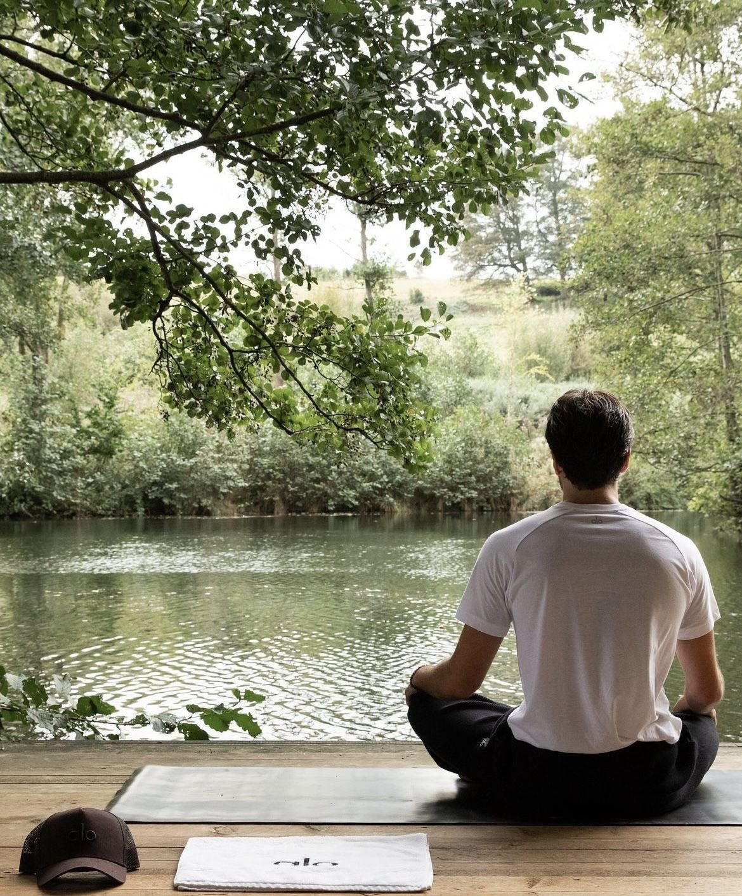
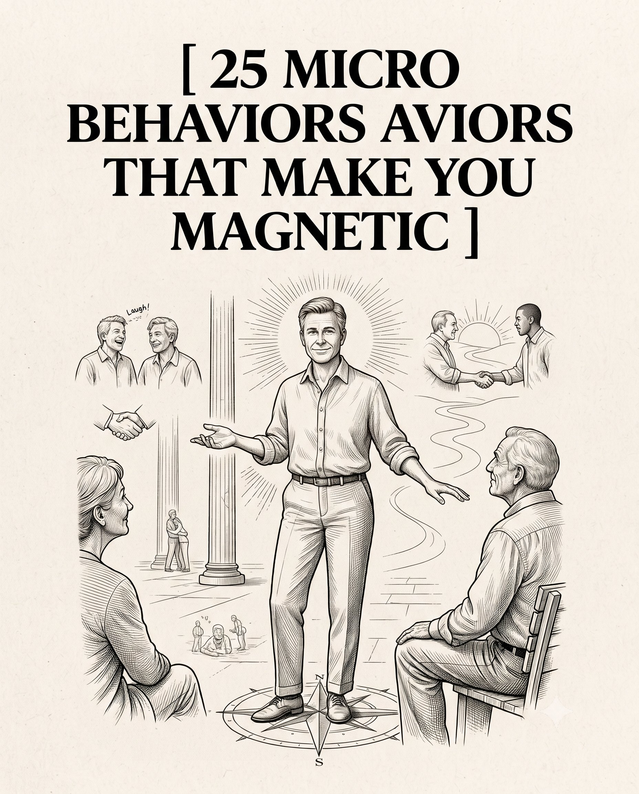

# 🐦 @theendeavorpath

## 📅 August 26, 2026

> 6 post(s) archived.

---

### 🕐 17:13 UTC · @theendeavorpath

> SIGNS THAT YOU ARE A DANGEROUS PERSON

🔗 [View original post](https://x.com/EnergyUp_/status/2092661689405894841)

---

### 🕐 14:13 UTC · @theendeavorpath

> 16. Offering brief, calm confirmations keeps conversations flowing smoothly. 17. Lowering your shoulders releases physical tension and projects dominant ease. 18. Removing phones completely proves absolute respect and rare focus. 19.Angling your head slightly signals sincere curiosity and deep empathy. 20. Praising someone&apos;s disciplined choices creates unforgettable emotional resonance.

🔗 [View original post](https://x.com/theendeavorpath/status/2092616411684430279)

---

### 🕐 14:13 UTC · @theendeavorpath

> 21. Matching another person&apos;s breathing tempo builds invisible neurological connection. 22. Answering friction with amused composure demonstrates emotional invulnerability. 23. Asking targeted, thoughtful questions breaks superficial social autopilot. 24. Releasing physical greetings first preserves comfortable personal boundaries. 25. Maintaining physical composure during tension makes you the emotional center.

🔗 [View original post](https://x.com/theendeavorpath/status/2092616414532350095)

---

### 🕐 14:13 UTC · @theendeavorpath

> 25 MICRO BEHAVIORS THAT MAKE YOU MAGNETIC:

🔗 [View original post](https://x.com/theendeavorpath/status/2092616398413643818)

---

### 🕐 13:56 UTC · @theendeavorpath

> 07 small (but useful) life tips... Must read..

🔗 [View original post](https://x.com/superior_hombre/status/2092612084114870778)

---

### 🕐 10:15 UTC · @theendeavorpath

> 9 Symptom Don&apos;t Ignore Your Body Pain: 1.

🔗 [View original post](https://x.com/stoicmen_/status/2092556537017565420)

---
