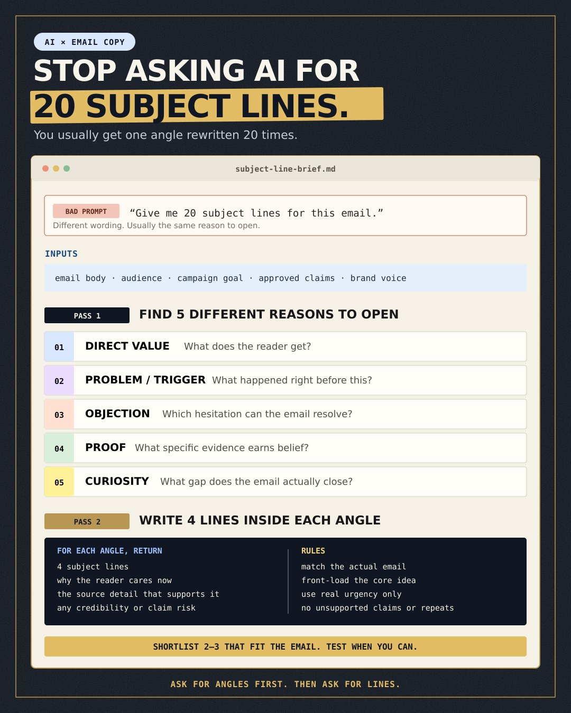
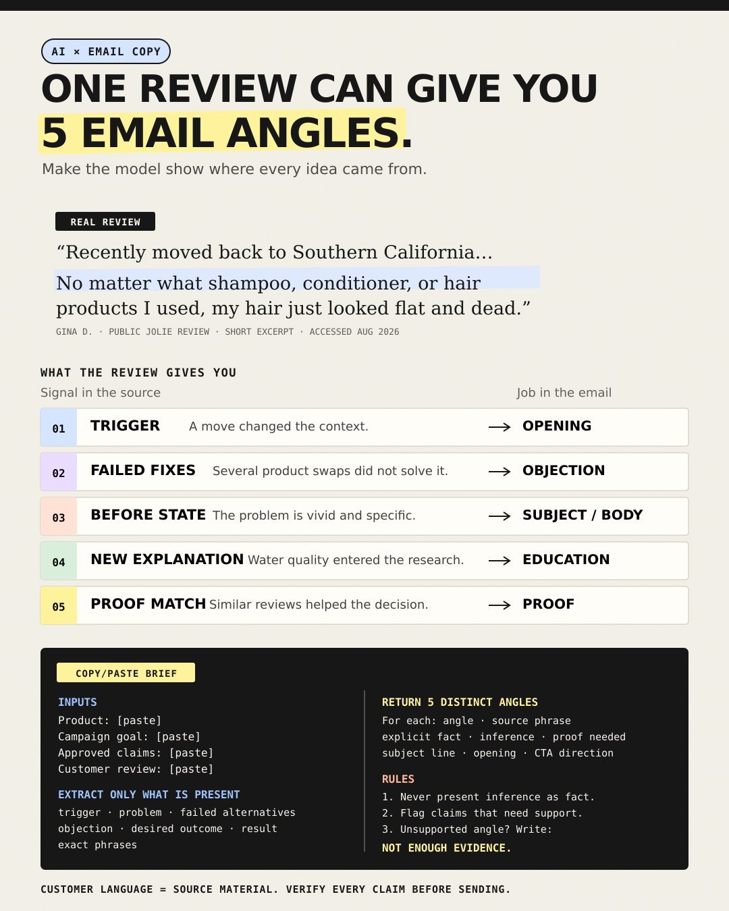

# 🐦 @AiEvolutio58513

## 📅 August 27, 2026

> 2 post(s) archived.

---

### 🕐 18:54 UTC · @AiEvolutio58513

> Most AI subject-line lists are fake variety. You ask for 20 options. The wording changes. The reason to open stays the same. I get better variation by splitting the work into two passes. First, ask for five distinct angles: • direct value • the problem or trigger • an objection the email resolves • proof that earns belief • a curiosity gap the email actually closes Then ask for four subject lines inside each angle. For every option, make the model show: • why the reader should care now • which source detail supports it • any credibility or claim risk That gives you 20 options built from five genuinely different ideas. The full brief is in the image. Shortlist the two or three that best fit the email, then test them when you can. AI can find email angles fast. It can also invent the evidence behind them. That’s why I make it show its work. A useful customer review might contain the trigger, failed alternatives, objection, desired outcome, and the exact words the customer uses. I ask the model to turn thos…

🔗 [View original post](https://x.com/ecomchasedimond/status/2093049467096498618)

---

### 🕐 17:17 UTC · @AiEvolutio58513

> AI can find email angles fast. It can also invent the evidence behind them. That’s why I make it show its work. A useful customer review might contain the trigger, failed alternatives, objection, desired outcome, and the exact words the customer uses. I ask the model to turn those signals into five distinct angles. For each one, it has to show: • the relevant source phrase • what the customer explicitly stated • what the model inferred • what proof is still needed • a subject line, opening, and CTA direction If the review does not support an angle, it has to return: NOT ENOUGH EVIDENCE. The brief is in the image. Add one review, your campaign goal, and your approved claims. Then use the output as raw material for the email. Shape it to fit your brand, keep the customer’s meaning intact, and verify every claim before sending.

🔗 [View original post](https://x.com/ecomchasedimond/status/2093025060974219562)

---
