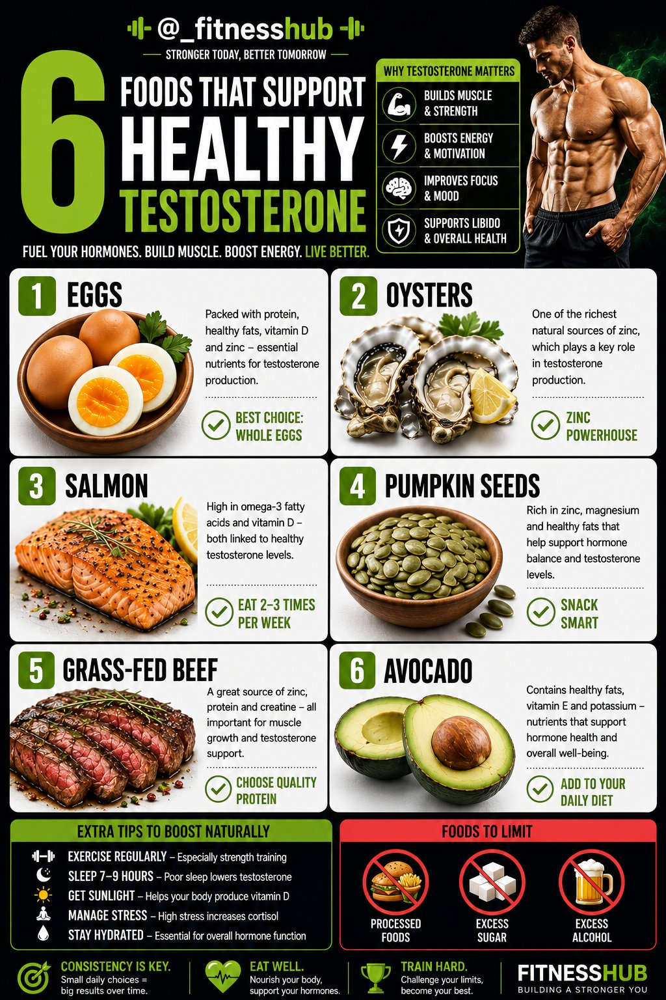
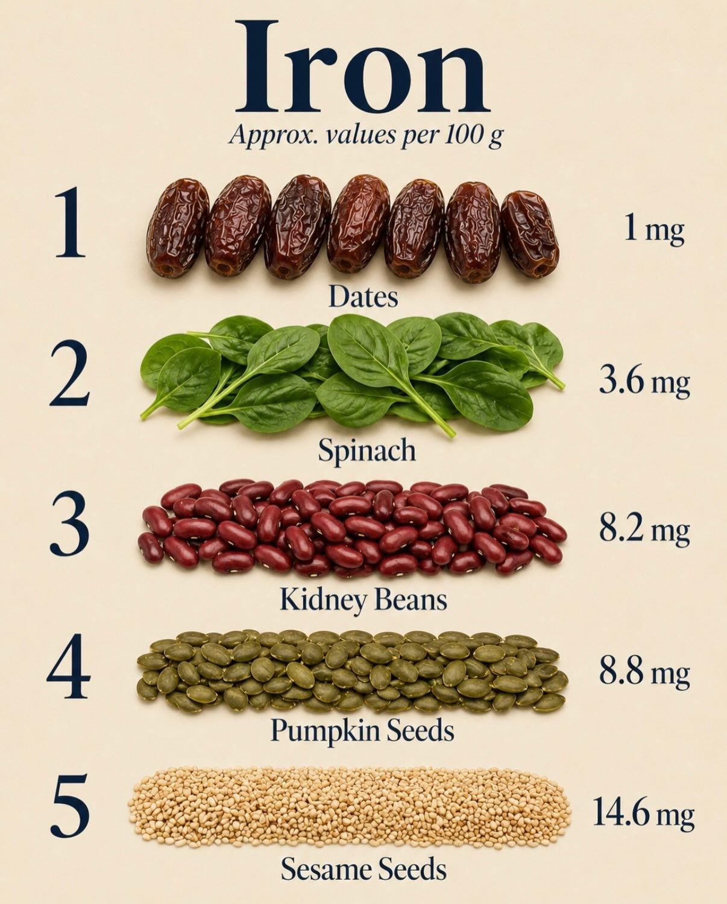
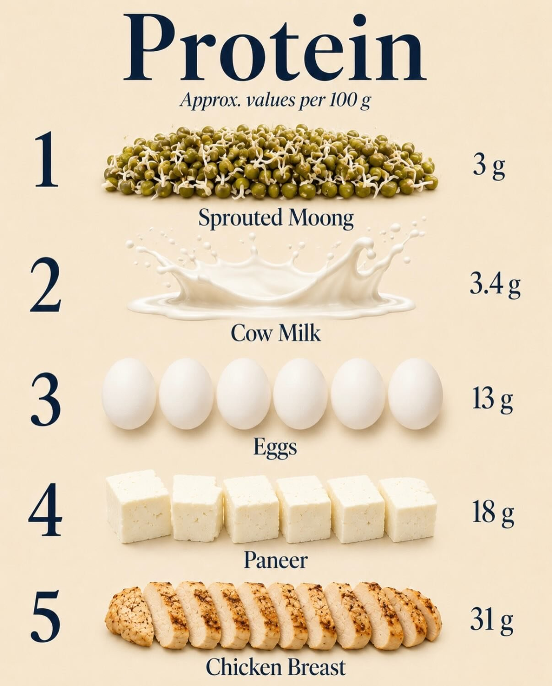
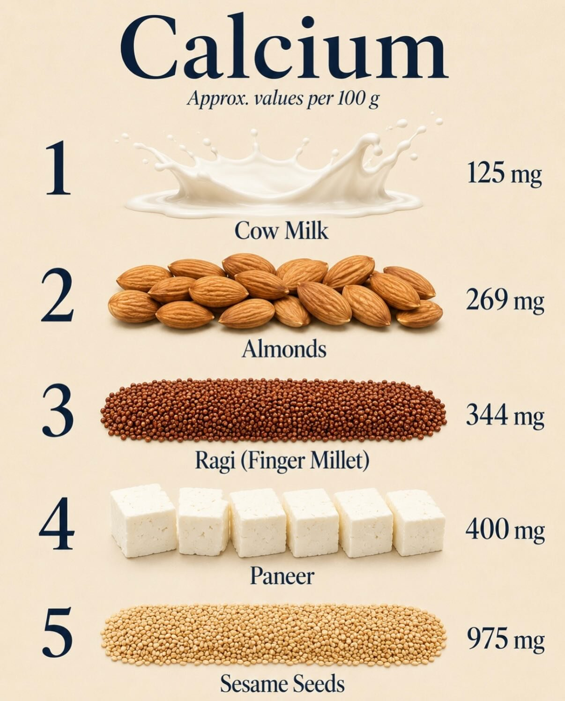
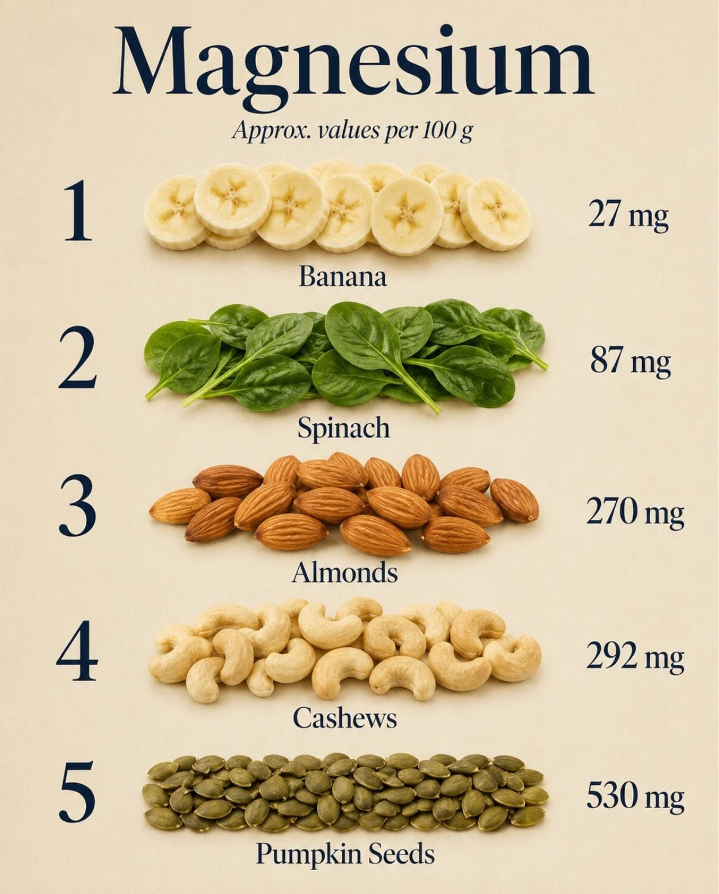
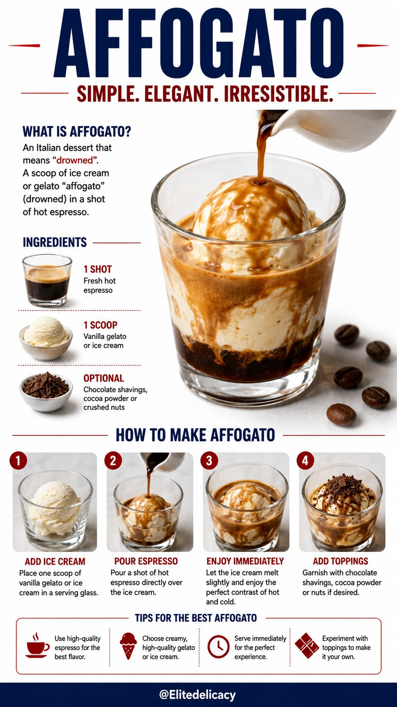
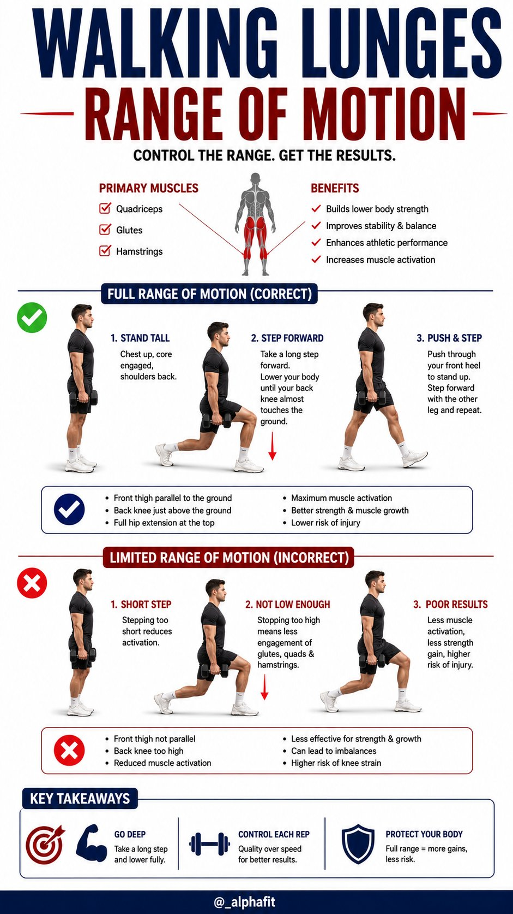

# 🐦 @Unlockyourlife_

## 📅 August 27, 2026

> 30 post(s) archived.

---

### 🕐 19:30 UTC · @Unlockyourlife_

> Set up an irrigation system in your backyard! Media

🔗 [View original post](https://x.com/Smart_Tipsx/status/2093058585521459230)

---

### 🕐 19:14 UTC · @Unlockyourlife_

> Amazing Cement Ideas! Media

🔗 [View original post](https://x.com/samx_reels/status/2093054566082212086)

---

### 🕐 17:10 UTC · @Unlockyourlife_

> Copper+Aluminum=Aluminum Brownze! Media

🔗 [View original post](https://x.com/_Brainboxx/status/2093023374310101195)

---

### 🕐 16:12 UTC · @Unlockyourlife_

> One step up. One heartbeat faster. 🔥 This step-platform HIIT combo turns a simple workout into a full-body challenge. Media

🔗 [View original post](https://x.com/_alphafit/status/2093008723090264248)

---

### 🕐 16:11 UTC · @Unlockyourlife_

> Your brain loves a challenge. 🧠⚡ Try this coordination drill and see how sharp you really are. Media

🔗 [View original post](https://x.com/BioLifex/status/2093008495293448664)

---

### 🕐 14:31 UTC · @Unlockyourlife_

> Making Money Grow On Trees 🤑 Media

🔗 [View original post](https://x.com/sciencepathx/status/2092983291984875652)

---

### 🕐 14:12 UTC · @Unlockyourlife_

> Beautiful Resin Tray🌸 Media

🔗 [View original post](https://x.com/Smart_Tipsx/status/2092978599024291993)

---

### 🕐 14:02 UTC · @Unlockyourlife_

> Cutting and peeling just got easier 😍 Media

🔗 [View original post](https://x.com/samx_reels/status/2092976008114708705)

---

### 🕐 13:47 UTC · @Unlockyourlife_

> Handmade Stove Making Process! Media

🔗 [View original post](https://x.com/_Brainboxx/status/2092972278036210124)

---

### 🕐 12:32 UTC · @Unlockyourlife_

> Natural remedies you wished you knew earlier Media

🔗 [View original post](https://x.com/FitnessDr_/status/2092953390472983035)

---

### 🕐 11:05 UTC · @Unlockyourlife_

> How to make a scissors watch and see 💇 Media

🔗 [View original post](https://x.com/Yourhackx/status/2092931608017826204)

---

### 🕐 10:26 UTC · @Unlockyourlife_

> The beauty of science! Media

🔗 [View original post](https://x.com/sciencepathx/status/2092921660294709280)

---

### 🕐 10:16 UTC · @Unlockyourlife_

> Amazing Workshop Idea! Media

🔗 [View original post](https://x.com/Smart_Tipsx/status/2092919081561203089)

---

### 🕐 10:10 UTC · @Unlockyourlife_

> Bending nature’s rules! Media

🔗 [View original post](https://x.com/samx_reels/status/2092917717309300919)

---

### 🕐 10:02 UTC · @Unlockyourlife_

> Essential tips for smooth parking and stress-free travel! 🚗 Media

🔗 [View original post](https://x.com/_Brainboxx/status/2092915756430221451)

---

### 🕐 09:48 UTC · @Unlockyourlife_

> Some meals don’t need to be complicated. Creamy avocado. Juicy shrimp. A little crunch, a little richness — and suddenly a simple plate feels restaurant-level. Proof that healthy can still look this good. Media

🔗 [View original post](https://x.com/Elitedelicacy/status/2092912099596865707)

---

### 🕐 09:43 UTC · @Unlockyourlife_

> Most people train harder. Smart people train better. A few movements. Different angles. Strength, cardio, mobility, and control — all working together. Media

🔗 [View original post](https://x.com/_alphafit/status/2092910824520069408)

---

### 🕐 08:55 UTC · @Unlockyourlife_

> How to fix Hotpoint F05 Error Code, Washing Machine Not Draining quick fix. Media

🔗 [View original post](https://x.com/_learnskills/status/2092898762729373744)

---

### 🕐 08:08 UTC · @Unlockyourlife_

> 5 knuckle push-ups. 5 regular. 5 Tyson push-ups. Same bodyweight. Completely different challenge. 💪 Sometimes you don’t need more reps, you need a harder variation. Which one are you trying first? Media

🔗 [View original post](https://x.com/BioLifex/status/2092886838474141814)

---

### 🕐 08:07 UTC · @Unlockyourlife_

> How the Human Heart Works! Media

🔗 [View original post](https://x.com/sciencepathx/status/2092886619384614917)

---

### 🕐 08:01 UTC · @Unlockyourlife_

> 6 Foods That Support Healthy Testosterone

🔗 [View original post](https://x.com/_fitnesshub/status/2092885149364961552)

---

### 🕐 07:49 UTC · @Unlockyourlife_

> Fixing Deep Scratches on this M3! Media

🔗 [View original post](https://x.com/samx_reels/status/2092882150043332756)

---

### 🕐 07:37 UTC · @Unlockyourlife_

> Hut in the wild with a hidden shelter! Media

🔗 [View original post](https://x.com/Smart_Tipsx/status/2092879258796392487)

---

### 🕐 07:30 UTC · @Unlockyourlife_

> 4. Iron

🔗 [View original post](https://x.com/FitnessDr_/status/2092877438678118663)

---

### 🕐 07:30 UTC · @Unlockyourlife_

> 3. Protein

🔗 [View original post](https://x.com/FitnessDr_/status/2092877430956409343)

---

### 🕐 07:30 UTC · @Unlockyourlife_

> 2. Calcium

🔗 [View original post](https://x.com/FitnessDr_/status/2092877423868051720)

---

### 🕐 07:30 UTC · @Unlockyourlife_

> You don&apos;t need a perfect diet - you need simple meals that cover your basics most days. Think protein + fiber + healthy fats + colorful foods. 1. Magnesium

🔗 [View original post](https://x.com/FitnessDr_/status/2092877415768850814)

---

### 🕐 07:29 UTC · @Unlockyourlife_

> Big Ben Sculpted TV remote 🕒Liquid-fillled &amp; Moving✨ Media

🔗 [View original post](https://x.com/_Brainboxx/status/2092877267177263250)

---

### 🕐 06:22 UTC · @Unlockyourlife_

> Affogato

🔗 [View original post](https://x.com/Elitedelicacy/status/2092860224570802187)

---

### 🕐 06:21 UTC · @Unlockyourlife_

> Walking Lunges Range of Motion.

🔗 [View original post](https://x.com/_alphafit/status/2092859912174874942)

---
