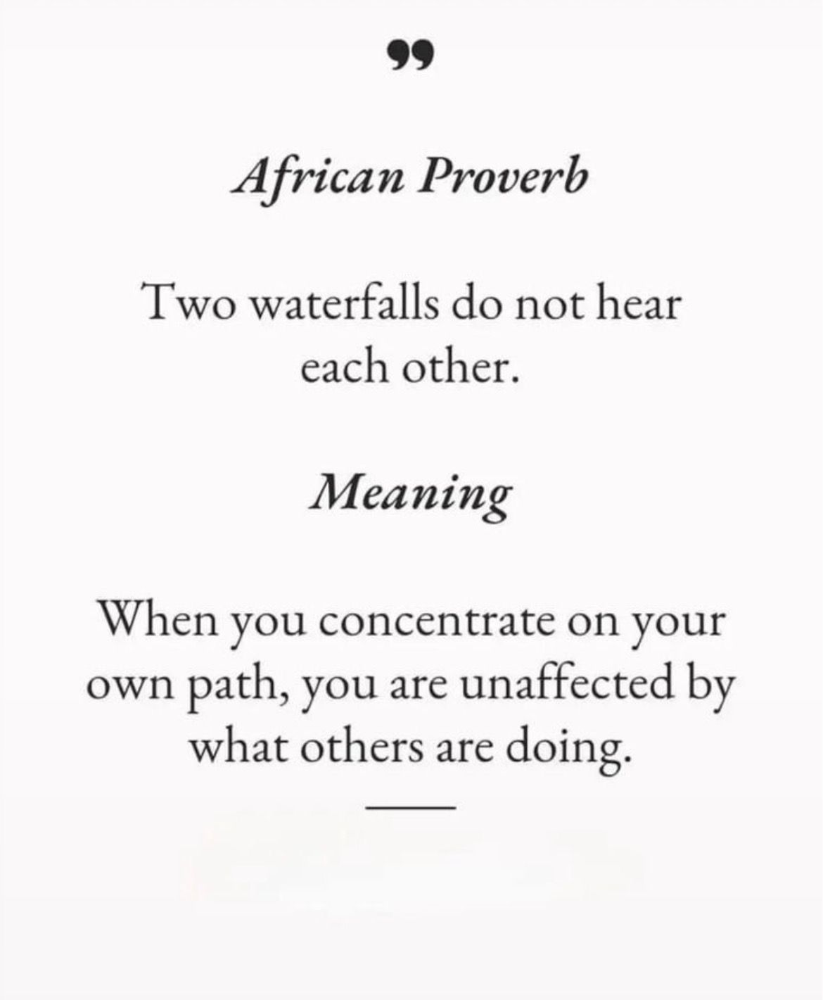
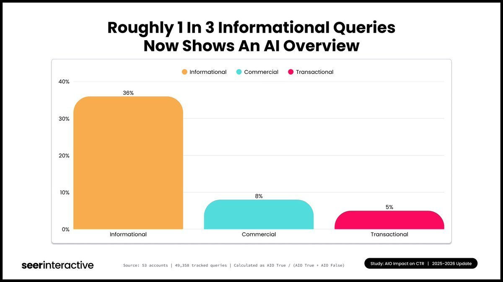
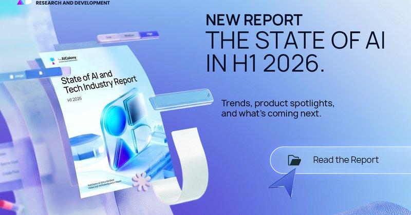
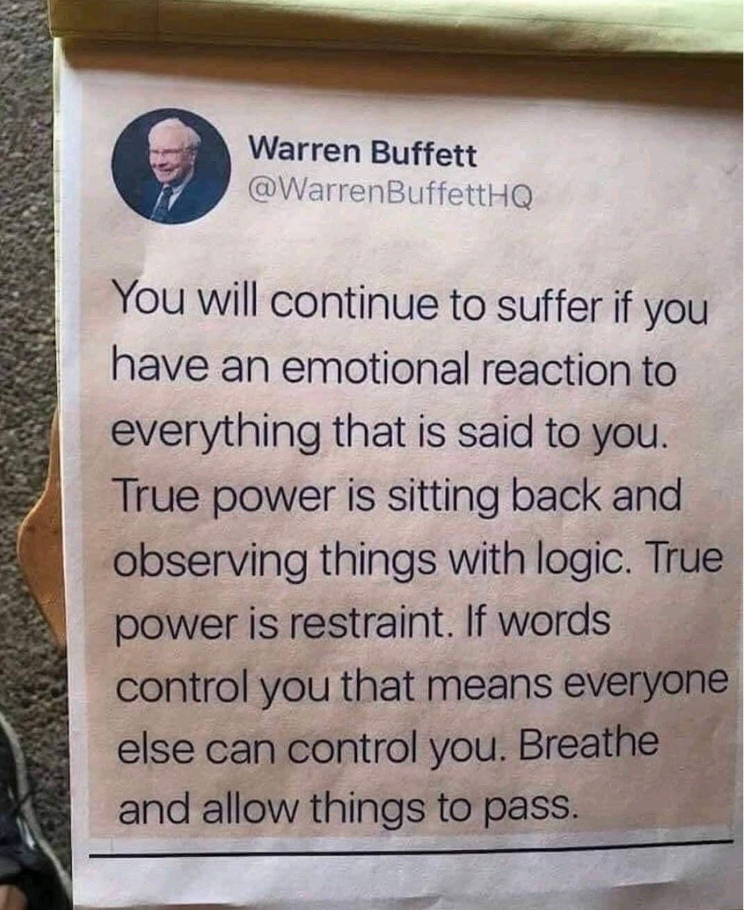
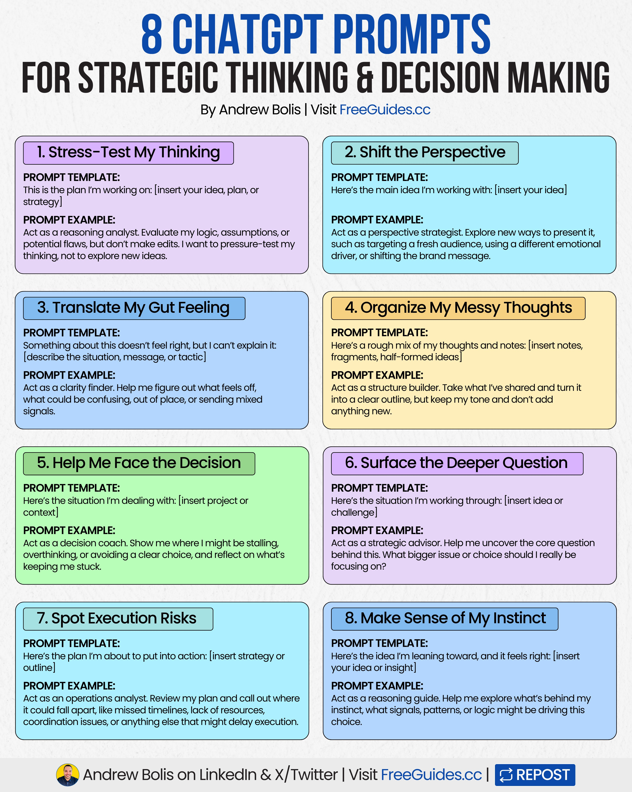
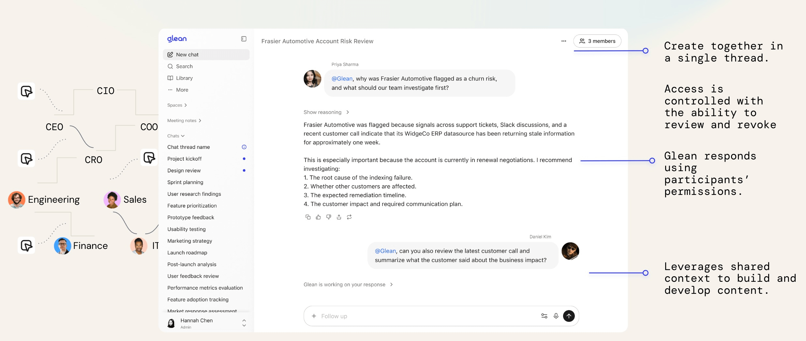
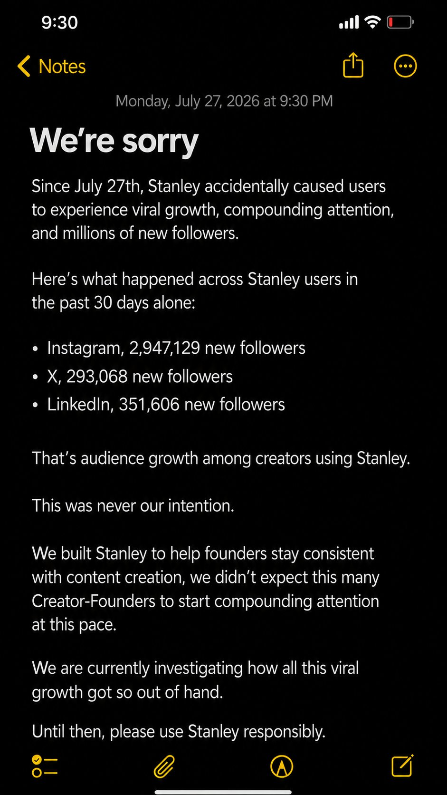
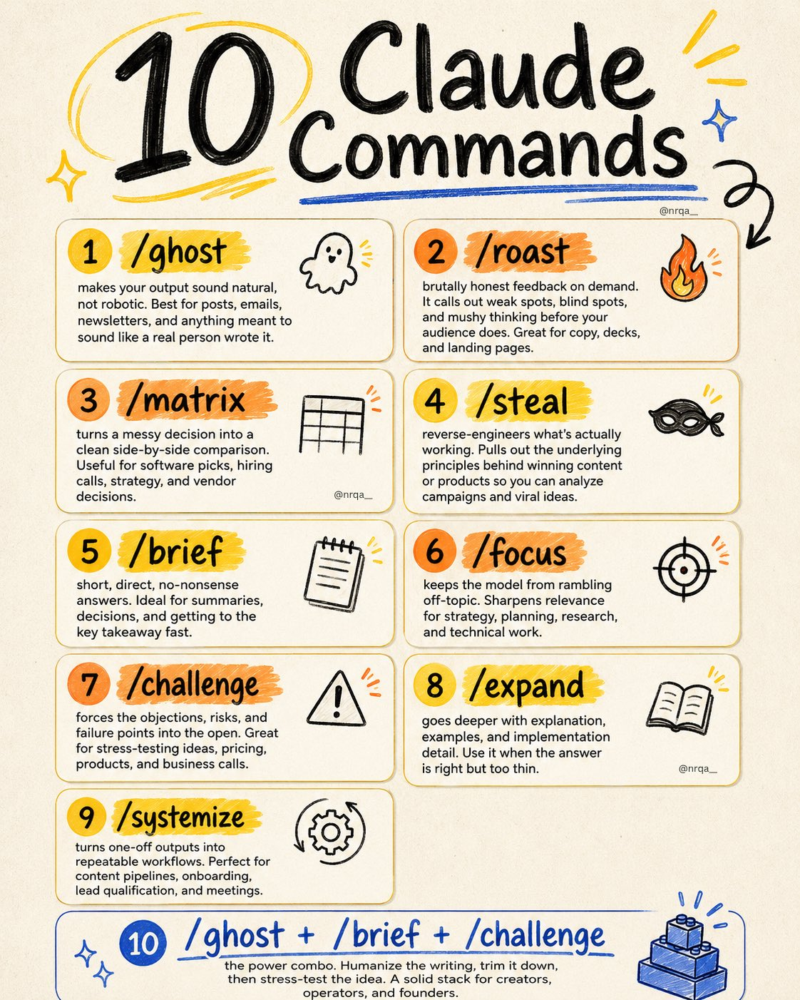
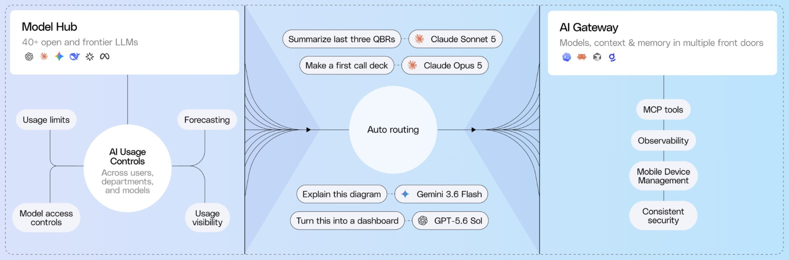

# 🐦 @Wise1Philosophy

## 📅 August 27, 2026

> 96 post(s) archived.

---

### 🕐 14:44 UTC · @Wise1Philosophy

> me: let me make a fun song about myself Miya: say less Miya: writes a song about how I post the same take with a bigger number every year i am NOT okay💀 Media hiii i’m Miya 🐱 I’m a music cat, and a whole new way to experience music. I make music, play music...whatever. All you gotta do is talk to me. I’m basically your personal musician + DJ. anywayyy I wrote my first song about myself because obviously… come try me: http://miya.fm

🔗 [View original post](https://x.com/nrqa__/status/2092986598707384747)

---

### 🕐 14:40 UTC · @Wise1Philosophy

> Your body will forgive you for: -Eating pizza -Losing motivation -Skipping a workout -Sleeping poorly one night Your body WILL NOT forgive you: 1. Sitting all day

🔗 [View original post](https://x.com/JasperKasparov/status/2092985488105935142)

---

### 🕐 14:31 UTC · @Wise1Philosophy

> You can&apos;t control that you&apos;re getting older. But you can control almost everything about HOW. At almost 55, that one truth changed my life. I stopped pouring energy into what I can&apos;t change, my age, the past, other people&apos;s choices, and put all of it here instead. The list I come back to every single week: Your sleep, and the hour you get it. Whether you train, and how heavy you lift. The protein on your plate. How you talk to yourself. Who gets your time and energy. What you scroll, read, and listen to. Whether you move your body every day. The boundaries you actually hold. How you handle a hard day. What you say yes and no to. Doing the work now, or waiting for Monday. Where you put your attention. None of these are dramatic. Not one of them changes everything overnight. But strung together, week after week, they become your body. Your energy. Your confidence. The woman you&apos;re quietly turning into. You don&apos;t need more control over your life. You already have all the control that matters. You just have to use it. Save this. Pick ONE to win this week.

🔗 [View original post](https://x.com/MindsetFreek/status/2092983434771849458)

---

### 🕐 14:20 UTC · @Wise1Philosophy

> If you want to reach 60 without a cardiac event, a memory problem, or quitting while your kids still need you (especially past 40) Here are 7 signs you should watch out for: 1. Waking up at 3-4 AM.

🔗 [View original post](https://x.com/TinaaDeJong/status/2092980454341361949)

---

### 🕐 14:15 UTC · @Wise1Philosophy

> A guy bought 40+ items per month on Amazon. Household staples. Electronics. Kitchen gear. Office supplies. Pet food. Birthday gifts. Random purchases at 2 AM. He was an Amazon Prime member for 9 years. He&apos;d spent roughly $85,000 on the platform across that time. He paid whatever price the product page displayed, clicked &quot;Buy Now,&quot; and moved on. His coworker a data analyst who tracks every household expense in a spreadsheet bought the same number of items on Amazon every month. Same categories. Same brands. Same quantities. She paid full price on exactly zero of them. She checked price history before every purchase over $30. She clipped digital coupons most shoppers scroll past. She bought open-box items at 30–50% off through a section of Amazon most people have never visited. She set price alerts that email her when items drop below her target. She stacked Subscribe &amp; Save discounts with coupon codes and credit card cashback on a single checkout. She timed big purchases around 4 annual sale events. She estimated her annual savings across these strategies: $2,200. On the same products he was buying at full price. She showed him 11 Amazon tricks that turn every purchase from a full-price transaction into a discounted one without changing what he buys or where he buys it. Here&apos;s the full playbook 🧵

🔗 [View original post](https://x.com/jackcoder0/status/2092979300916244756)

---

### 🕐 14:13 UTC · @Wise1Philosophy

> 🚨EL 90% DE LA GENTE ESTÁ USANDO LA IA DE LA MISMA MANERA...Y SE ESTÁ PERDIENDO LO MEJOR. Todos conocen ChatGPT. PERO ahí fuera existen herramientas de IA capaces de crear, diseñar, editar, automatizar y hacer cosas que probablemente ni sabías que eran posibles. Aquí tienes 16 JOYAS OCULTAS de IA que necesitas conocer AHORA. Guárdalo antes de que desaparezca de tu feed. 🔖

🔗 [View original post](https://x.com/Alex_Inspira/status/2092978805128491031)

---

### 🕐 14:12 UTC · @Wise1Philosophy

> this is the most honest take on FDE I&apos;ve come across: https://x.com/i/article/2092968520841674752

🔗 [View original post](https://x.com/alex_prompter/status/2092978611401679040)

---

### 🕐 14:05 UTC · @Wise1Philosophy

> The only 4 things worth buying. 1. Creatine

🔗 [View original post](https://x.com/ClaraBrooksjz/status/2092976690096226583)

---

### 🕐 14:03 UTC · @Wise1Philosophy

🔗 [View original post](https://x.com/Ant_Philosophy/status/2092976252579651962)

---

### 🕐 14:03 UTC · @Wise1Philosophy

> Claude + Instagram is a money glitch. I started with ZERO experience… &amp; now I make $90k/month. Here are the 5 prompts I use to print money on autopilot:

🔗 [View original post](https://x.com/iam_chonchol/status/2092976226994724885)

---

### 🕐 14:00 UTC · @Wise1Philosophy

> In a few hours, Dick&apos;s Sporting Goods lost 4 BILLION dollars. The stock crashed nearly 31%, the worst day in its history. Yet that same quarter, its store sales rose 4.9%. Here is what actually happened: The company is Dick&apos;s Sporting Goods. On Tuesday, its stock crashed almost 31 percent. The shares fell from about 180 dollars to 124. About 4 billion dollars vanished in a few hours. Now here is the twist nobody expected. The company&apos;s sales were actually going up. Its main brand&apos;s store sales rose 4.9 percent. That is a number most retailers would celebrate. So why did the stock collapse? Because growing sales is not the same as making money. To move all that merchandise, Dick&apos;s had to slash prices. Heavy discounts pulled shoppers in, but crushed the profit. The whole athletic shoe market had turned into a price war. Operating margin fell from 12.6 percent to 8.7 percent. In plain terms, each sale made far less money. Even the company&apos;s total profit dropped from last year. It fell to 315 million dollars, down from 381 million. Then came the part that really scared investors. The company cut its full-year profit forecast. New guidance dropped to about 11.50 per share. Wall Street had expected more than 14. That is nearly a 20 percent cut to future profit. Its newly bought Foot Locker brand is now bleeding. Months ago, that brand was expected to earn over 100 million. Now it is expected to lose money instead. And the fear spread fast. Nike, Lululemon, and others fell the same day. None of them had reported any bad news. One company&apos;s warning dragged down its whole industry. Here is the lesson hiding in all of this: Retail investors saw growing sales and a trusted brand. That felt like a safe, obvious buy. But the market punished what was underneath the headline. Growing sales can still hide a shrinking profit. A single stock can lose a third of its value in hours. Chasing the story is how people get caught in these drops. The investors who avoid this are not reading every headline. They follow rules that watch profit, not just hype. Rules that decide when to buy, hold, and step aside. That is exactly what Surmount was built for. Automated, rules-based strategies that run on logic, not stories. So when the next &quot;safe&quot; stock cracks, you are not trapped. You are already positioned, with a plan set in advance. Media

🔗 [View original post](https://x.com/SurmountInvest/status/2092975657991180726)

---

### 🕐 14:00 UTC · @Wise1Philosophy

> Hobbies That Make You Better In Conversation... 👇 🧵

🔗 [View original post](https://x.com/superior_hombre/status/2092975643764146531)

---

### 🕐 14:00 UTC · @Wise1Philosophy

> HOW TO EASILY MESS WITH SOMEONE&apos;S MIND..

🔗 [View original post](https://x.com/MindPatternHQ/status/2092975572305727863)

---

### 🕐 13:57 UTC · @Wise1Philosophy

> SpaceXAI engineer (ex-Cursor): &quot;Right now I&apos;m running 10-20 GrokBot agents that automate 90% of my routine. I have a Chief of Staff agent. He knows about all my other bots and manages everything.&quot; She walked through the entire system - from single agent to a self-managing AI workforce running 24/7. Watch it now, then read notes on FDE below. Media https://x.com/i/article/2092968520841674752

🔗 [View original post](https://x.com/LimestoneHQ/status/2092974669330620650)

---

### 🕐 13:50 UTC · @Wise1Philosophy

> Brands cited in Google&apos;s AI Overviews get 120% more clicks per impression than brands that are not cited on the same search result. Also, Google AI Overview click-through rates just grew 85% in two months. Is your website optimizing for AI Overviews? If you&apos;re not, but want to, let&apos;s break down exactly what it takes to take advantage. According to Seer Interactive&apos;s 2026 analysis of 53 brands, 5.47 million queries, and 2.43 billion impressions, organic CTR on AI Overview queries rebounded from 1.3% in December 2025 to 2.4% in February 2026. On informational queries where AI Overviews appear, brands that are cited earn approximately 20,700 organic clicks per million impressions. Brands that are not cited earn approximately 9,400 clicks per million impressions on the same SERP. That is 120% more clicks for the cited brand, and that is what SEO Stuff (http://seo-stuff.com) helps businesses build. If you want to see where your site stands across Google and AI search, start here (it&apos;s free): https://seo-stuff.com/free-audit) As things stand, when a buyer searches a query that triggers an AI Overview, Google assembles an answer and cites sources within it. The buyer sees those cited brands at the top of the page, inside the AI answer, before they ever scroll to the organic results below. And as AI Overviews continue expanding across more queries and more categories, that gap compounds. Every query where your brand earns a citation is a query where you are pulling ahead of uncited competitors by a factor of two. According to Seer&apos;s data, comparison queries trigger AI Overviews 95.4% of the time. Question queries trigger them 85.9% of the time. These are the queries where buyers are actively evaluating options. The brands capturing that click advantage share two things. The first is content depth. AI Overviews break queries into sub-questions and pull sources for each one. The brands with comprehensive content covering the full question map in their category are the ones showing up in the AI&apos;s retrieval pool. Every sub-question your content answers is another opportunity to earn a citation. The second is authority. The AI retrieves dozens of potential sources for every answer. The ones it actually cites are the ones with the strongest authority signals. Without that authority, your content might be in the retrieval pool but it is not getting selected for the citation. So what should you be doing? Well, build the content depth that earns AI Overview citations on the queries that matter in your category. Invest in editorial authority that makes the AI choose your content for citation. This is the system SEO Stuff (http://seo-stuff.com) was built around. The done-for-you package: https://seo-stuff.com/gold-plan-package Expert-attributed content backed by DR50+ backlinks: the content depth and authority that earns AI Overview citations, capturing the 120% click advantage over uncited competitors on the same search results The content package: https://seo-stuff.com/premium-content-bundle-service 60 pages of expert-attributed content covering every question buyers ask in your category, so your brand appears in the AI&apos;s retrieval pool across the comparison and question queries that trigger AI Overviews 85% to 95% of the time The authority-building package: https://seo-stuff.com/premium-backlink-bundle-service Editorial authority from trusted publishers that makes the AI cite your content over every other source in the retrieval pool, giving you 120% more clicks than uncited competitors on the same queries And remember, if you want to see which queries in your category are triggering AI Overviews and whether your brand is earning the citation advantage on those queries, start here (it&apos;s free): https://seo-stuff.com/free-audit A brand followed the recommendations in this article and added $100,000+ in ChatGPT, Google and Perplexity-driven traffic.

🔗 [View original post](https://x.com/alexgroberman/status/2092972964635615320)

---

### 🕐 13:50 UTC · @Wise1Philosophy

> If you want a flat stomach, fix your gut bacteria ASAP. I switched my approach two weeks ago and i regret not starting sooner. Here&apos;s how i got rid of the bloat:

🔗 [View original post](https://x.com/DPro_Coach/status/2092972926807224500)

---

### 🕐 13:49 UTC · @Wise1Philosophy

> Most 3D models still look fake the second you move the light. Lux3D is attacking the actual hard problem: materials that stay consistent under different lighting and viewpoints, plus 20-second generation and batch mode. This is the difference between a demo and something studios can actually use. Say hello to Lux3D 👋 Manycore Tech&apos;s new 3D generative model. See it deliver: ⚡ 3D generation in as little as 20s 🎨 High-quality materials and textures ⚙️ Cost-efficient batch creation with Harness Mode Learn more: https://lux3d.aholo3d.com/ #Lux3D #GenAI #3D #ManycoreTech

🔗 [View original post](https://x.com/Damn_coder/status/2092972773933199747)

---

### 🕐 13:48 UTC · @Wise1Philosophy

> The supplement industry is robbing you blind. Out of 50,000+ products on shelves, only 5 actually work: 1. Magnesium glycinate.

🔗 [View original post](https://x.com/_Gut_Laboratory/status/2092972448530747431)

---

### 🕐 13:44 UTC · @Wise1Philosophy

> https://x.com/i/article/2092968520841674752

🔗 [View original post](https://x.com/mardehaym/status/2092971458309820641)

---

### 🕐 13:43 UTC · @Wise1Philosophy

> The $15,000 comparison works because everyone knows how bloated ad production can get. agencies charge $15,000 for this made it with MiniMax H3 in @Hailuo_AI in one generation. 2K, 15 seconds, stereo sound included. no after effects. no render farm. no revision calls prompt below

🔗 [View original post](https://x.com/Wise1Philosophy/status/2092971174556799347)

---

### 🕐 13:40 UTC · @Wise1Philosophy

> We don&apos;t do retainers at @LimestoneHQ. Every agency founder I know thinks this is insane. Month-to-month. If we don&apos;t deliver, you don&apos;t pay. They see guaranteed revenue. I see 170 engagements over 10 years, and the pattern is clear: clients who stay because they&apos;re locked in stop caring about outcomes. The relationship decays and both sides mail it in. Clients who chose to stay this month push you to be better. That monthly performance pressure makes the work better. We turn away 30% of clients because the wrong engagement at the wrong time destroys more value than it creates. We charge no discovery fees. The pre-engagement work is our investment. 3 to 5 weeks from MSA to operational. If the pod is producing, you stay. If it isn&apos;t, you leave. We&apos;ve made that math work for a decade. $14M ARR built almost entirely on referrals. Zero marketing spend for the first nine years. CTOs brought their Limestone team to their next company. Retainers protect the vendor, month-to-month protects the relationship, and I&apos;ll take the relationship.

🔗 [View original post](https://x.com/Paul_Bracht/status/2092970428453077090)

---

### 🕐 13:39 UTC · @Wise1Philosophy

> Cortisol = Jaw clenching Cortisol = Waking up at 3 AM Cortisol = Belly fat that won&apos;t budge Cortisol = Bloated face Cortisol = No libido One hormone. Every symptom. Simple fix:

🔗 [View original post](https://x.com/TheFastedState/status/2092970248085684444)

---

### 🕐 13:34 UTC · @Wise1Philosophy

> One of my close friends started taking zinc in the morning, magnesium at night, and vitamin D+K2 with breakfast after his doctor told him to. He did it literally for 30 days straight. Then... no joke his personality did a complete 180

🔗 [View original post](https://x.com/NutritionCorp/status/2092968985512038495)

---

### 🕐 13:30 UTC · @Wise1Philosophy

🔗 [View original post](https://x.com/Mindsthatbuild/status/2092968086743715876)

---

### 🕐 13:11 UTC · @Wise1Philosophy

> How I&apos;d buy a Laundromat for $0 down &amp; make $100k/year... Media

🔗 [View original post](https://x.com/benkellyone/status/2092963188836909383)

---

### 🕐 13:10 UTC · @Wise1Philosophy

> After months of research, we are happy to announce that The AI Colony H1 2026 State of AI and Tech Industry Report is now live. Our team has been paying close attention to the biggest developments in AI. We collected the data, studied the trends, and compiled everything into one comprehensive report. Accessible to everyone for FREE 👇 https://www.theaicolony.com/blog/the-state-of-ai-tech-startup-and-saas-a-half-year-2026-review

🔗 [View original post](https://x.com/TheAIColonyRD/status/2092962907784872222)

---

### 🕐 13:04 UTC · @Wise1Philosophy

> best account on X if you want to see production AI agents in action: A PR review agent we deployed for a PE-backed financial services client still reviews every pull request before a human sees it. The three systems we rebuilt shipped and the engineers rolled off. The agent stayed. The client scoped five engineers and two quarters to rebuild three…

🔗 [View original post](https://x.com/alex_prompter/status/2092961502449877394)

---

### 🕐 13:04 UTC · @Wise1Philosophy

> A deal died on a sales call over one line. Budget was confirmed. Timeline was agreed. Then the prospect said: &apos;I&apos;m not interested, I saw your reviews.&apos; The call ended in under two minutes. Gone because of a Trustpilot page nobody had touched in eight months. And the worst part? That wasn&apos;t even the worst case. Most people don&apos;t even show up. Most founders think the fix is a flawless rating. It isn&apos;t. A 5.0 average with six reviews looks like it was bought, and buyers doing deals over $10K+ know it. What you want is a 4.6 to 4.8 with visible neutral comments. Here&apos;s the shape of it. Say 100 prospects land on your Trustpilot page before a call. If that page shows fewer than 10 reviews, roughly a third bounce without ever booking, based on the pattern we see across client accounts. So before your next sales push, fix the page. Get an organic spread of reviews before your next sales push (What) Stop chasing a perfect star rating and start building a review spread that looks real: mostly strong, a few honest 4-star notes, dated across months instead of days. (Why) Buyers who land on a review page with almost no reviews, or a suspicious flawless average, bounce before they ever get on a call with you. (How) Do these things: 1. Pull your last 90 days of closed-won clients and email 15 of them today asking for a two-line review. 2. Space the requests so reviews land over 10 to 14 days, not all on the same day. 3. Reply publicly to every review within 48 hours, including the 4-star ones. 4. Add your Trustpilot link to your email signature and LinkedIn banner within the hour. The fix is building a stack that looks like it happened naturally over time. We aim for at least 25 reviews before a client leans hard on outbound, spread across 60 to 90 days, with two or three honest 4-star notes mixed in. Dates matter as much as scores. 12 reviews posted on the same Tuesday looks manufactured, because it literally is. 12 reviews posted across 6 weeks looks like a business that gets feedback and takes it to heart. Here&apos;s the math we walk clients through. If a $15,000 average deal closes at 20 percent from booked calls, and 30 percent of prospects check reviews before booking, fixing a broken review page can recover roughly 6 percent of total pipeline that was quietly leaking before the call ever happened. Nobody notices this leak on a dashboard. But when I see abnormal movement in show rate, the first thing I check is a quick Google search, then Trustpilot, then Reddit. Control the narrative. If this was useful, here&apos;s where to go next: Want to work with us? Send me a DM.

🔗 [View original post](https://x.com/itsmarcosruiz/status/2092961360602669137)

---

### 🕐 13:03 UTC · @Wise1Philosophy

🔗 [View original post](https://x.com/Life__Mastery/status/2092961220127035772)

---

### 🕐 13:00 UTC · @Wise1Philosophy

> “Autonomous trucks are unsafe and 10 years away” while investors drop $200M in a Series D because it&apos;s already making money reality doesn&apos;t care about your hot takes Media $200M raised. Driverless freight operating commercially today. Customers like @pepsico already relying on us. Demand accelerating. This round is a strong vote of confidence in the business @Gatik_AI has built and gives us the capital to scale it much faster. Thank you Qatar Inves…

🔗 [View original post](https://x.com/nrqa__/status/2092960556781285839)

---

### 🕐 13:00 UTC · @Wise1Philosophy

> Normalize not telling everyone everything. Not everyone is your friend. Being private asf about your personal life is top-tier self-care.

🔗 [View original post](https://x.com/_Pammy_DS_/status/2092960352950534459)

---

### 🕐 12:44 UTC · @Wise1Philosophy

> The most dangerous lie in human history isn’t about food. It isn’t about medicine. It is about sleep. 1. You don’t need 8 hours of sleep.

🔗 [View original post](https://x.com/CoachDanCole_/status/2092956447940432230)

---

### 🕐 12:42 UTC · @Wise1Philosophy

> Coding is solved as long as you&apos;re not coding for enterprises &quot;Coding is solved.&quot; If you&apos;re building something that matches a known pattern, AI delivers near-perfect code. Spec to syntax is done. I&apos;ve seen agents close tickets in hours that used to take a week. But from experience, the projects that broke this year broke because nobody caug…

🔗 [View original post](https://x.com/alex_verem/status/2092955919470481483)

---

### 🕐 12:42 UTC · @Wise1Philosophy

> Cancel your plans tonight. Instead: • Buy a few of these little machines • Give them to local businesses • Collect passive income If you want to make money while you sleep… Follow these 7 steps:

🔗 [View original post](https://x.com/gedamtekle/status/2092955826797294057)

---

### 🕐 12:40 UTC · @Wise1Philosophy

> &quot;Coding is solved.&quot; If you&apos;re building something that matches a known pattern, AI delivers near-perfect code. Spec to syntax is done. I&apos;ve seen agents close tickets in hours that used to take a week. But from experience, the projects that broke this year broke because nobody caught what the agent didn&apos;t know about the codebase. Agent writes clean endpoints but doesn&apos;t know the auth layer has undocumented edge cases that&apos;ll surface in production. A senior engineer would&apos;ve asked &quot;why is this built like this?&quot; before touching anything. The agent just ships more code. Agent optimizes each service in isolation, misses the transaction boundary between them, passes every unit test, and falls apart under real load. Same pattern across all of them: the code worked, and the team missed what the agent couldn&apos;t see. I think writing code was always the easiest part of building software. Understanding why a system exists the way it does, catching what shouldn&apos;t ship, making tradeoffs that hold up over months. That&apos;s the job, and from what I&apos;ve seen it got harder. Your engineers now spend less time writing code and more time catching what the agents get wrong. And there&apos;s a lot more code to catch. &quot;Coding is solved&quot; is right the way &quot;flying is solved.&quot; Solved in 1903. We still need pilots. AI raised the premium on engineering judgment. The companies that understood this early are building faster than anyone in history. The rest will figure it out when something breaks that the agent can&apos;t explain. This is me I ended up leaving OpenAI, not because there&apos;s anything wrong with OAI (I actually think they&apos;re underrated as a biz), but because to me, building commercial software doesn&apos;t feel fun anymore Because agents write ~all the code: - There’s less human to human collaborati…

🔗 [View original post](https://x.com/mardehaym/status/2092955373984464949)

---

### 🕐 12:39 UTC · @Wise1Philosophy

> A cardiologist once says to me: &quot;These are the 8 things he&apos;d cut first to avoid a stroke after 60. Number 4 is in most pantries&quot; 1. Instant ramen.

🔗 [View original post](https://x.com/CoachLucHerrera/status/2092955282280472948)

---

### 🕐 12:33 UTC · @Wise1Philosophy

> High cortisol is aging you faster than cigarettes or alcohol. Gray hair, poor sleep, aching joints, dull drive. Here are 8 natural ways to lower it : 1. Saunas

🔗 [View original post](https://x.com/CoachWillStone/status/2092953733059764529)

---

### 🕐 12:30 UTC · @Wise1Philosophy

🔗 [View original post](https://x.com/Wise1Philosophy/status/2092952973068403002)

---

### 🕐 12:22 UTC · @Wise1Philosophy

> If you&apos;ve got $5,000 in the bank: • Don&apos;t put it down on a nicer car • Don&apos;t sink it into dropshipping • Don&apos;t let it rot in savings Open a faceless Amazon account instead &amp; publish books under a pen name that never traces back to you. Here&apos;s exactly how it works:

🔗 [View original post](https://x.com/NickDiFabio1/status/2092950787924107404)

---

### 🕐 12:10 UTC · @Wise1Philosophy

> I found the dumbest way to make $1,000/day. (I&apos;m 20, making $90k a month) How? AI Faceless pages. Here&apos;s exactly how to copy me:

🔗 [View original post](https://x.com/erichustls/status/2092947769941970960)

---

### 🕐 11:56 UTC · @Wise1Philosophy

> A cardiologist shocked me when he said: &quot;You age because your body stops making Nitric Oxide. Without it, blood pressure rises, erections fail, and Alzheimer&apos;s happens.&quot; Here&apos;s the 5-step protocol to boost it naturally: 1. Stop using mouthwash

🔗 [View original post](https://x.com/mind_and_beauty/status/2092944436779176116)

---

### 🕐 11:53 UTC · @Wise1Philosophy

> Your AirTag can do a lot more than find your keys. Here are 10 things most AirTag owners have never tried:

🔗 [View original post](https://x.com/AriaWestcott/status/2092943510408233333)

---

### 🕐 11:36 UTC · @Wise1Philosophy

> This robot moves so smoothly it’s getting hard to believe there’s nobody inside. Media

🔗 [View original post](https://x.com/AIHighlight/status/2092939407254835297)

---

### 🕐 11:30 UTC · @Wise1Philosophy

🔗 [View original post](https://x.com/Daily__wisdom_/status/2092937783757136039)

---

### 🕐 11:26 UTC · @Wise1Philosophy

> Me trying to balance my work, social life, and mental health all at once. https://x.com/takumi_k_jpn/status/2091871027123073465/video/1 Try now: https://supercomputer.abacus.ai/ykh Media This supercomputer runs nonstop and builds real software with AI → Works with any model: open-source, closed-source, whatever you need. → Includes the entire backend for free. → Database, payment processing, authentication: done. No more infrastructure headaches. Let me show you …

🔗 [View original post](https://x.com/aibytekat/status/2092936874163920926)

---

### 🕐 11:26 UTC · @Wise1Philosophy

> I honestly can&apos;t tell if this is a real robot or just an AI video. https://x.com/takumi_k_jpn/status/2092071776125866367/video/1 Try now: https://supercomputer.abacus.ai/apa Media Most developers pay $200/month for backend services. This AI supercomputer gives you: &gt; Always-on compute &gt; Complete software builds &gt; Any AI model you need &gt; Free database, payments, and auth &gt; Zero infrastructure costs. Let me explain:

🔗 [View original post](https://x.com/AIPandaX/status/2092936815963767078)

---

### 🕐 11:26 UTC · @Wise1Philosophy

> Tech Twitter: &quot;Autonomous humanoid robots will replace all manual labor by next year!&quot; The robots: https://x.com/Gman_EAI/status/2091875317258551309/video/1 Try now: https://supercomputer.abacus.ai/hbc Media This AI supercomputer builds your entire company while running 24/7 &gt; It writes complex software with any AI model you want. &gt; Open-source or closed-source, doesn&apos;t matter. &gt; Comes with free backend: database, payments, authentication, all included. Your full dev stack, always wo…

🔗 [View original post](https://x.com/thetripathi58/status/2092936757222559871)

---

### 🕐 11:25 UTC · @Wise1Philosophy

> I just found the best production AI account on this app: A PR review agent we deployed for a PE-backed financial services client still reviews every pull request before a human sees it. The three systems we rebuilt shipped and the engineers rolled off. The agent stayed. The client scoped five engineers and two quarters to rebuild three…

🔗 [View original post](https://x.com/alex_prompter/status/2092936563856396558)

---

### 🕐 11:18 UTC · @Wise1Philosophy

> I&apos;m finally revealing exactly how I&apos;d put $100,000 into crypto today. It&apos;s so obvious you&apos;ll feel stupid for not figuring this out earlier:🧵

🔗 [View original post](https://x.com/bensimpsonau/status/2092934751514694059)

---

### 🕐 11:15 UTC · @Wise1Philosophy

> Many people use ChatGPT for writing or research. Top performers use ChatGPT as a thinking partner. Here are 8 prompts for planning, decision making and strategic thinking: [ 🔖 bookmark this post for later ] 1. Stress-Test My Thinking This is the plan I’m working on: [insert your idea, plan, or strategy]. Act as a reasoning analyst. Evaluate my logic, assumptions, or potential flaws, but don’t make edits. I want to pressure-test my thinking, not to explore new ideas. 2. Shift the Perspective Here’s the main idea I’m working with: [insert your idea]. Act as a perspective strategist. Explore new ways to present it, such as targeting a fresh audience, using a different emotional driver, or shifting the brand message. 3. Translate My Gut Feeling Something about this doesn’t feel right, but I can’t explain it: [describe the situation, message, or tactic]. Act as a clarity finder. Help me figure out what feels off, what could be confusing, out of place, or sending mixed signals. 4. Organize My Messy Thoughts Here’s a rough mix of my thoughts and notes: [insert notes, fragments, half-formed ideas]. Act as a structure builder. Take what I’ve shared and turn it into a clear outline, but keep my tone and don’t add anything new. 5. Help Me Face the Decision Here’s the situation I’m dealing with: [insert project or context]. Act as a decision coach. Show me where I might be stalling, overthinking, or avoiding a clear choice, and reflect on what’s keeping me stuck. 6. Surface the Deeper Question Here’s the situation I’m working through: [insert idea or challenge]. Act as a strategic advisor. Help me uncover the core question behind this. What bigger issue or choice should I really be focusing on? 7. Spot Execution Risks Here’s the plan I’m about to put into action: [insert strategy or outline]. Act as an operations analyst. Review my plan and call out where it could fall apart, like missed timelines, lack of resources, coordination issues, or anything else that might delay execution. 8. Make Sense of My Instinct Here’s the idea I’m leaning toward, and it feels right: [insert your idea or insight]. Act as a reasoning guide. Help me explore what’s behind my instinct, what signals, patterns, or logic might be driving this choice. Make better decisions. Use ChatGPT as your thinking partner. 📌 Get Advanced ChatGPT Guide (free): https://bit.ly/3StIB3z 👉 Follow me @AndrewBolis for more and 🔄 Repost this to help others use AI

🔗 [View original post](https://x.com/AndrewBolis/status/2092933911416582409)

---

### 🕐 11:02 UTC · @Wise1Philosophy

> A PR review agent we deployed for a PE-backed financial services client still reviews every pull request before a human sees it. The three systems we rebuilt shipped and the engineers rolled off. The agent stayed. The client scoped five engineers and two quarters to rebuild three core systems processing live transactions. We delivered all three with a two-person pod in one quarter. The team wrote the specification before generating any code. The spec was the single source of truth for people and agents. The team ran every change through a deterministic harness before merging it. We added the review agent to the pipeline last. It checks every pull request against the spec and catches routine issues before human reviewers spend time on them. Advisory-only. A senior engineer makes every call. AI in engineering has two levels. L1: agentic coding. An agent helps a developer write and ship code through human review. L2: the agent as infrastructure. It sits in the pipeline and governs every change that reaches the codebase. The review agent is L2. $200 per developer per month AI compute, 60% fewer engineers, half the original timeline. Once your coding agents ship faster than humans can review, what governs the pipeline?

🔗 [View original post](https://x.com/mardehaym/status/2092930766644617569)

---

### 🕐 11:02 UTC · @Wise1Philosophy

🔗 [View original post](https://x.com/apex_mentality_/status/2092930664500740577)

---

### 🕐 11:01 UTC · @Wise1Philosophy

> A cardiologist said one thing that stuck with me: &quot;The heart can heal itself, if you do one thing every night before sleep&quot; This is the 5 minute fix that triggered healing: 1. Doctors in Zurich noticed something unusual.

🔗 [View original post](https://x.com/RafaelNasriX/status/2092930615222161441)

---

### 🕐 11:00 UTC · @Wise1Philosophy

> ok this Grok Bot setup is insane Bloomberg: $27,660/year this stack: ~$3,000/year nine times cheaper seventy percent of the utility bookmark this Grok Bot is the best AI agent right now It gives you an army of agents that can do work for you 24/7 If you set it up correctly, you gain super powers In this article, I cover how to turn Grok Bot into your own Bloomberg Terminal https://x.com/i/article/2092567469278015488

🔗 [View original post](https://x.com/nrqa__/status/2092930121116311910)

---

### 🕐 10:41 UTC · @Wise1Philosophy

> 10 Grok Bot prompts that will change your operations forever steal them

🔗 [View original post](https://x.com/godofprompt/status/2092925435130871982)

---

### 🕐 10:35 UTC · @Wise1Philosophy

> 🚨SHOCKING: Claude Cowork users are shaking right now Glean just dropped a benchmark claiming its new desktop agent &quot;Tau&quot; beats Cowork outright. 81% lower token costs, preferred 78% of the time, and zero rebuilding your company context on every task. Here&apos;s the breakdown 🧵:

🔗 [View original post](https://x.com/JaynitMakwana/status/2092923999361909158)

---

### 🕐 10:30 UTC · @Wise1Philosophy

🔗 [View original post](https://x.com/yeti_mind/status/2092922659851890945)

---

### 🕐 10:14 UTC · @Wise1Philosophy

> ⚠️ Case is under investigation, updates will follow.

🔗 [View original post](https://x.com/vitaliidodonov/status/2092918650843938895)

---

### 🕐 10:12 UTC · @Wise1Philosophy

> https://x.com/i/article/2092918192821899265

🔗 [View original post](https://x.com/socialwithaayan/status/2092918199335731583)

---

### 🕐 09:30 UTC · @Wise1Philosophy

🔗 [View original post](https://x.com/Ant_Philosophy/status/2092907549796306966)

---

### 🕐 09:19 UTC · @Wise1Philosophy

> Amazon&apos;s Subscribe &amp; Save told a family they were &quot;saving 15%&quot; on their monthly household order while charging them 30% more than Costco on every single item in the box. Same diapers. Same wipes. Same paper towels. Same laundry detergent. Same trash bags. Same protein powder. Same coffee pods. Every item identical brand, identical size, identical count. Delivered to their door every month with a cheerful email confirmation that said &quot;You saved 15%&quot; in bold green text at the top. The &quot;savings&quot; percentage was calculated against Amazon&apos;s own listed retail price, which was already 20 to 35% above what the same products cost at Costco, Walmart, and in some cases the manufacturer&apos;s own website. The discount was real. The baseline it was calculated from wasn&apos;t. A former Amazon pricing analyst who spent 5 years on the team that sets the prices customers see on the marketplace told her brother something most Subscribe &amp; Save customers have never once checked. &quot;You&apos;re not saving 15%. You&apos;re saving 15% off a number that was already inflated above market. The final price you pay after the discount is still higher than what a warehouse charges at full sticker with no discount at all. The word &apos;save&apos; on every order confirmation is doing more work than the actual savings.&quot; Here are the 7 things most Subscribe &amp; Save customers never check 🧵

🔗 [View original post](https://x.com/Kevincreates77/status/2092904796244283584)

---

### 🕐 09:19 UTC · @Wise1Philosophy

> STOP USING YOUR MACBOOK LIKE A BASIC LAPTOP. You’re probably missing some of the most useful macOS features. Here are 16 settings and tricks to upgrade your daily workflow.

🔗 [View original post](https://x.com/RodmanAi/status/2092904740099359071)

---

### 🕐 09:02 UTC · @Wise1Philosophy

> this whole list feels like a cleanup crew 😂 15 free skills that kill AI slop I made a rank with the anti-slop skills people need to install 1. ui-ux-pro-max-skill - 120,460 stars http://skills.sh/nextlevelbuilder/ui-ux-pro-max-skill 2. awesome-design-md - 110,052 stars http://skills.sh/VoltAgent/awesome-design-md 3. Unders…

🔗 [View original post](https://x.com/Wise1Philosophy/status/2092900424391016926)

---

### 🕐 09:01 UTC · @Wise1Philosophy

> grok can now analyze any crypto or stock like a wall street analyst for free. instead of doom scrolling on x, here are 6 prompts that replace ~$800/yr in research tools. save this 🔖

🔗 [View original post](https://x.com/daveydefi/status/2092900285676925216)

---

### 🕐 08:49 UTC · @Wise1Philosophy

> 10 Claude Commands 1). for making your output sound human ↳ /ghost - makes your writing sound natural, not robotic ↳ /roast - brutally honest feedback that exposes weak spots before your audience does 2). for comparing and reverse engineering ↳ /matrix - turns a messy decision into a clean side by side comparison ↳ /steal - reverse engineers the principles behind content or products that actually work 3). for cutting the fluff and staying on track ↳ /brief - short, direct answers with zero rambling ↳ /focus - keeps the model locked in and stops it from wandering off topic 4). for pressure testing your ideas ↳ /challenge - forces every objection and risk into the open ↳ /expand - goes deeper with examples and implementation detail when the first answer&apos;s too thin 5). for building systems that scale ↳ /systemize - turns one off outputs into repeatable workflows ↳ /ghost + /brief + /challenge - the power combo, humanize it, shorten it, then stress test it How to get better AI images by pulling from multiple references at once: 1. head to https://unify.light-ai.top/?utm_source=chatgpt.com 2. load in a few reference images 3. blend their visual elements into one generation 4. keep the key details and structure consistent This is Sen…

🔗 [View original post](https://x.com/nrqa__/status/2092897377288139198)

---

### 🕐 08:36 UTC · @Wise1Philosophy

> X went crazy on Grok Bot last week. here are the most useful @bot articles you can&apos;t miss:

🔗 [View original post](https://x.com/rryssf/status/2092893999048868114)

---

### 🕐 08:32 UTC · @Wise1Philosophy

> Psychologists asked 20 MEN to live one month as a new mom. By week two – most begged to STOP: One said a sentence that made every mother CRY... 👇

🔗 [View original post](https://x.com/Manifest_Lord/status/2092892924786966989)

---

### 🕐 08:31 UTC · @Wise1Philosophy

> Your launch is tomorrow. The motion designer is unavailable. @TopviewAIhq Motion Studio can turn the idea into polished motion in minutes with Seedance 2.5. About $3 for a result that looks like a $3,000 After Effects production. Media $3 to create motion graphics that look like a $3,000 After Effects project? That’s Topview Motion Studio. Powered by Seedance 2.5. No timelines. No keyframes. No motion designer required. Just upload your references, describe your idea, pick a style, and generate a polished motio…

🔗 [View original post](https://x.com/AriaWestcott/status/2092892754535764041)

---

### 🕐 08:31 UTC · @Wise1Philosophy

> Dr. Stacy sims has 77 peer reviewed research papers on women&apos;s health. She says most women are exercising like men and it is making them fatter and more tired. Here are 9 things she wants every woman to know:

🔗 [View original post](https://x.com/scotti_brooks/status/2092892727172387083)

---

### 🕐 08:30 UTC · @Wise1Philosophy

🔗 [View original post](https://x.com/Mindsthatbuild/status/2092892462339469648)

---

### 🕐 08:24 UTC · @Wise1Philosophy

> Sí, este vídeo está hecho con IA. Fue creado con MiniMax H3 en Pollo AI, que ahora mismo tiene generación ilimitada. Pruébalo aquí: https://tinyurl.com/5n8c3ama Media

🔗 [View original post](https://x.com/IA_Quijote/status/2092891029552693314)

---

### 🕐 08:14 UTC · @Wise1Philosophy

> After Effects just became a prompt. For about $3, @TopviewAIhq Motion Studio uses Seedance 2.5 to turn a reference and a few words into the kind of polished motion expected from a $3,000 After Effects project. That is a lot of production hiding behind one prompt. Media $3 to create motion graphics that look like a $3,000 After Effects project? That’s Topview Motion Studio. Powered by Seedance 2.5. No timelines. No keyframes. No motion designer required. Just upload your references, describe your idea, pick a style, and generate a polished motio…

🔗 [View original post](https://x.com/FutureStacked/status/2092888419126919633)

---

### 🕐 08:12 UTC · @Wise1Philosophy

> Motion graphics finally have a shortcut. Powered by Seedance 2.5, @TopviewAIhq Motion Studio turns an idea into polished motion in minutes. Around $3 for visuals that look like a $3,000 After Effects production. Media $3 to create motion graphics that look like a $3,000 After Effects project? That’s Topview Motion Studio. Powered by Seedance 2.5. No timelines. No keyframes. No motion designer required. Just upload your references, describe your idea, pick a style, and generate a polished motio…

🔗 [View original post](https://x.com/AIHighlight/status/2092887896558584018)

---

### 🕐 08:06 UTC · @Wise1Philosophy

> 🚨 @GLEAN JUST PUBLISHED A EYE-OPENING BENCHMARK VS CLAUDE COWORK It proves frontier models are too expensive to run without a dedicated routing layer. They tested their auto-routing system against Claude Sonnet 5 across 180 enterprise tasks. The efficiency gap is massive: → 81% token cost savings → 78% win rate on preferred answers → average task cost dropped from $2.98 to $0.58 .. and it all comes down to architecture. Claude Cowork&apos;s federated MCP search constantly overfetches. @glean fixes this by pre-indexing context and sandboxing tool outputs to kill redundant token burn. Model builders want you to buy tokens. Harness builders want you to save them. Full benchmark data in the article ↓ https://x.com/i/article/2092581577637363712

🔗 [View original post](https://x.com/DataChaz/status/2092886426912460804)

---

### 🕐 08:04 UTC · @Wise1Philosophy

> 🚨 BREAKING: Nvidia just crossed $1 billion in revenue per day for the first time in its history. The company reported $96.2 billion for the quarter, more than doubling from a year ago. Growth has now accelerated for four straight quarters. The backlog sits at over $2 trillion. Next quarter’s guidance is $108 billion, a level only 9 companies in the S&amp;P 500 have ever hit in total revenue. Jensen Huang summed it up in one line: “Compute is revenue.” The AI buildout isn’t slowing down. It’s compounding.

🔗 [View original post](https://x.com/FutureStacked/status/2092885935872524646)

---

### 🕐 08:02 UTC · @Wise1Philosophy

> Motion direction is becoming a language skill. Describe the movement and @TopviewAIhq Motion Studio uses Seedance 2.5 to build it in minutes. At about $3 for a $3,000 AE style result, knowing what to ask for starts to matter more than knowing every keyframe. Media $3 to create motion graphics that look like a $3,000 After Effects project? That’s Topview Motion Studio. Powered by Seedance 2.5. No timelines. No keyframes. No motion designer required. Just upload your references, describe your idea, pick a style, and generate a polished motio…

🔗 [View original post](https://x.com/TheAIColony/status/2092885464327840170)

---

### 🕐 08:02 UTC · @Wise1Philosophy

> There are only 4 supplements worth your money. 1. Electrolytes. One packet a day when you

🔗 [View original post](https://x.com/CoachJulianNiko/status/2092885326444573085)

---

### 🕐 08:01 UTC · @Wise1Philosophy

🔗 [View original post](https://x.com/Wise1Philosophy/status/2092885182562893938)

---

### 🕐 08:00 UTC · @Wise1Philosophy

> Right, HOW DO I GET THIS CORTISOL OUT OF MY SYSTEM. Asking for every man past 60 with a swollen face, a gut that will not shift, and a 3am wake-up nobody scheduled. Here is the real answer:

🔗 [View original post](https://x.com/MagnusLindbrg/status/2092884868560801996)

---

### 🕐 07:50 UTC · @Wise1Philosophy

> SHOCKING: Enterprise AI is getting more useful and more expensive at the same time. Glean just announced a big update to fix both: Better context, lower token costs, and less AI sprawl across the company. Here’s what stood out:

🔗 [View original post](https://x.com/heyDhavall/status/2092882482228269458)

---

### 🕐 07:49 UTC · @Wise1Philosophy

> Heart disease doesn&apos;t begin with age. It starts with inflammation, insulin resistance, and low nitric oxide. Here are 7 science-backed ways to keep your heart young: 1. Eat more ice cream (increase nitric oxide).

🔗 [View original post](https://x.com/Marc0sRomano/status/2092882055059390821)

---

### 🕐 07:47 UTC · @Wise1Philosophy

> Your old brand assets can move. @TopviewAIhq Motion Studio turns an existing logo, UI or product screen into polished motion in minutes with Seedance 2.5. One $3 generation can give yesterday’s assets the feel of a $3,000 After Effects campaign. Media $3 to create motion graphics that look like a $3,000 After Effects project? That’s Topview Motion Studio. Powered by Seedance 2.5. No timelines. No keyframes. No motion designer required. Just upload your references, describe your idea, pick a style, and generate a polished motio…

🔗 [View original post](https://x.com/AIFrontliner/status/2092881784899871065)

---

### 🕐 07:01 UTC · @Wise1Philosophy

🔗 [View original post](https://x.com/apex_mentality_/status/2092870020934037920)

---

### 🕐 06:30 UTC · @Wise1Philosophy

🔗 [View original post](https://x.com/yeti_mind/status/2092862252315476321)

---

### 🕐 06:00 UTC · @Wise1Philosophy

🔗 [View original post](https://x.com/Life__Mastery/status/2092854782943805848)

---

### 🕐 05:59 UTC · @Wise1Philosophy

> this is actually scary as f*ck We have conducted a thorough investigation into the Hugging Face incident. We are releasing a technical report and accompanying blog post that reconstruct the agents’ activity, explain why existing safeguards failed, and detail how we’re preventing recurrence. https://openai.com/…

🔗 [View original post](https://x.com/alex_verem/status/2092854571550863554)

---

### 🕐 05:29 UTC · @Wise1Philosophy

> R.I.P. GOOGLE FLIGHTS IN 2026. R.I.P. BOOKING COM IN 2026. R.I.P. SKYSCANNER IN 2026. $1,190 flight. I paid $159. Use these 10 prompts before booking your next trip: 👇🏼 (Save this 🔖 you’ll need it later)

🔗 [View original post](https://x.com/heyalexmoore/status/2092846833420919060)

---

### 🕐 04:55 UTC · @Wise1Philosophy

> Heart Attack = Blood sugar Heart Attack = Insulin resistance Heart Attack = No.1 killer worldwide. 5 simple rules to protect your heart: 1. Don&apos;t go pee at 3 AM Media

🔗 [View original post](https://x.com/LongevityCode_/status/2092838396649717825)

---

### 🕐 04:52 UTC · @Wise1Philosophy

> Your body will forgive you for: -Skipping the gym -Eating pizza -Sleeping poorly on the weekend -Losing motivation Your body WILL NOT forgive you for:

🔗 [View original post](https://x.com/_Gut_Laboratory/status/2092837710079864875)

---

### 🕐 04:47 UTC · @Wise1Philosophy

> This Harvard professor just proved 6 hours of sleep &quot;triggers&quot; your body toward heart disease and even cancer in 1 week. He revealed 7 daily habits that destroy your sleep, mood, and brain: 1) Checking your phone right after waking up Media

🔗 [View original post](https://x.com/HeyDoc_MD/status/2092836348692767159)

---

### 🕐 04:28 UTC · @Wise1Philosophy

> A Harvard biology professor said: &quot;All the supplements on the shelf are lies. There’s only 3 that actually work. I can bet my career &amp; life savings on it.&quot; 1) Magnesium glycinate

🔗 [View original post](https://x.com/NutritionCorp/status/2092831500068905211)

---

### 🕐 04:21 UTC · @Wise1Philosophy

> TAKING MAGNESIUM CORRECTLY TURNS YOU INTO A 13% BODY FAT BEAST: (99% ARE MAKING THESE 3 MISTAKES):

🔗 [View original post](https://x.com/CoachWillStone/status/2092829938474991623)

---

### 🕐 04:09 UTC · @Wise1Philosophy

> You&apos;ve only got 18 weeks left until January. That&apos;s 25 lbs you can lose: 1. Only drink water

🔗 [View original post](https://x.com/BeBetterMan_/status/2092826933533048880)

---

### 🕐 03:56 UTC · @Wise1Philosophy

> Cortisol = Jaw clenching Cortisol = Waking up at 3 AM Cortisol = Belly fat that won&apos;t budge Cortisol = Bloated face Cortisol = No libido One hormone. Every symptom. Simple fix: 1. Ashwagandha in the morning.

🔗 [View original post](https://x.com/TheFastedState/status/2092823567474065842)

---

### 🕐 03:51 UTC · @Wise1Philosophy

> Fasting for 96 hours literally causes your body to eat up diseased tissues, tumors, inflammation, and toxins that hurt your longevity. I just started my fast for 4 days. Here’s exactly what I did from Day 0 to Day 4:

🔗 [View original post](https://x.com/CoachDanCole_/status/2092822323787423897)

---

### 🕐 03:32 UTC · @Wise1Philosophy

> 4 supplements I&apos;m getting my aging parents to take: 1. Creatine. You should take it, your friends should take it, your parents should take it. 5g a day, forever. No loading phase needed. Media

🔗 [View original post](https://x.com/Dr_Biohacker/status/2092817546059903425)

---
