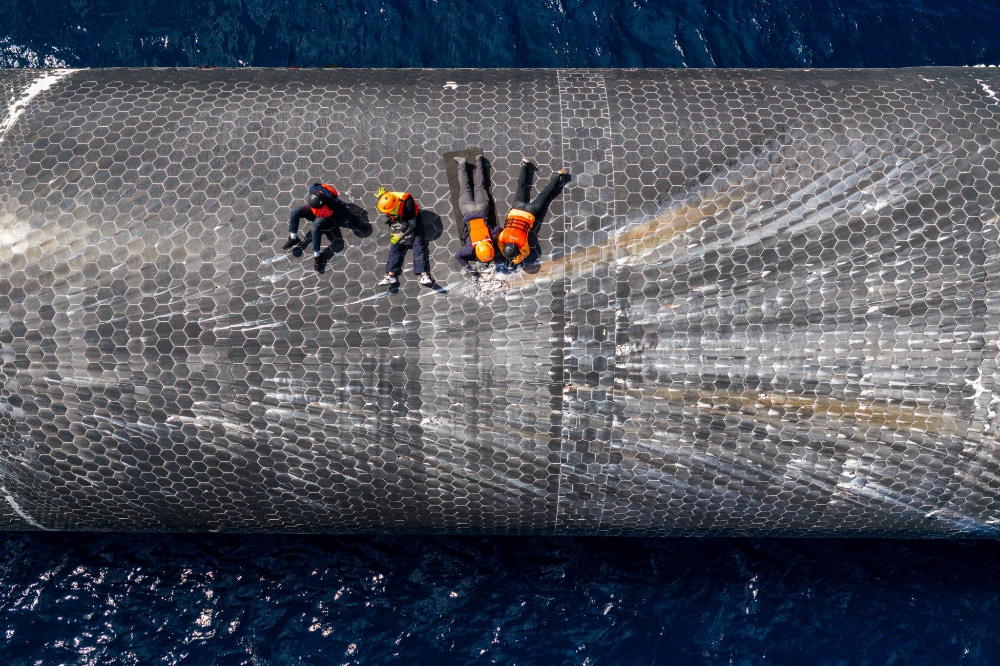
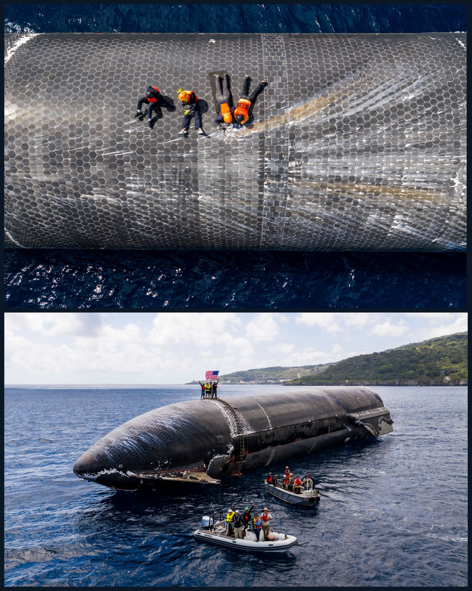
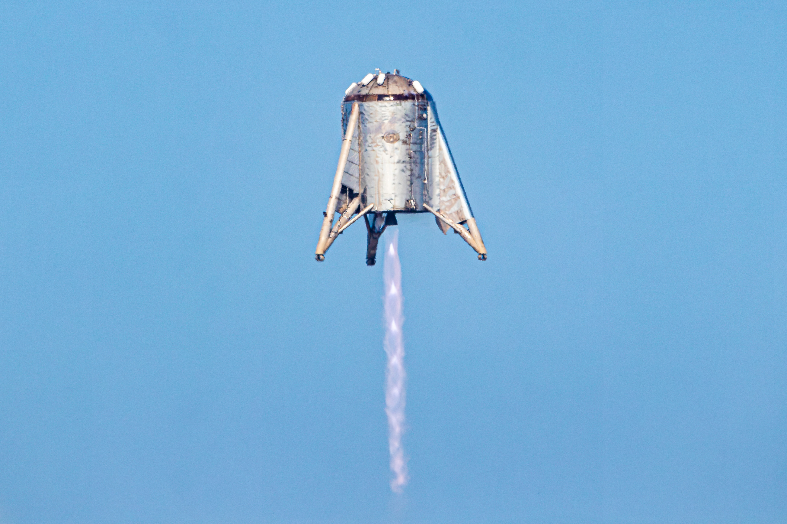

# 🐦 @elonmusk

## 📅 August 27, 2026

> 18 post(s) archived.

---

### 🕐 20:30 UTC · @elonmusk

> Californians could soon see some relief from their sky-high electric bills. The reason? Data centers. Thanks to data centers, PG&amp;E has been able to offer rate cuts for the fourth time in two years. Let&apos;s keep building!

🔗 [View original post](https://x.com/cremieuxrecueil/status/2093073790590726592)

---

### 🕐 19:44 UTC · @elonmusk

> Very troubling indeed America’s schools have been ideologically captured and it scares the shit out of me

🔗 [View original post](https://x.com/elonmusk/status/2093062173564047575)

---

### 🕐 19:34 UTC · @elonmusk

> Half price Starlink for anyone in the neighborhood of Starbase Louisiana SpaceX is building a new spaceport on Louisiana&apos;s Gulf Coast. As SpaceX invests in the region, we are offering our neighbors in the Vermilion Parish area a 50% discount on Starlink Residential service plans to new and existing customers → https://starlink.com/vermilionparish

🔗 [View original post](https://x.com/elonmusk/status/2093059632046448715)

---

### 🕐 18:46 UTC · @elonmusk

> Amazing update! Thanks to this incredible audience, @SpaceX has just fulfilled another one of Liv Perrotto&apos;s final wishes. I spoke with her mother @rebeccaperrotto earlier this year, and she shared the list of questions that Liv planned to ask @elonmusk just days before she passed away from cancer. After this audience made that post go viral, @elonmusk answered every one of them, including whether he would make Asteroid, the space-loving Shiba Inu she designed, the mascot for SpaceX. Well now, SpaceX has just added an official plush of Asteroid to their website! YOU played a huge role in bringing Liv&apos;s story to light and making this happen. Thank you! Media

🔗 [View original post](https://x.com/glennbeck/status/2093047515029667978)

---

### 🕐 18:05 UTC · @elonmusk

> Neuralink 🧠 How it started v/s. How it&apos;s going Media

🔗 [View original post](https://x.com/cb_doge/status/2093037163030188071)

---

### 🕐 17:33 UTC · @elonmusk

> Here&apos;s a little more of my incredible story! Thank you @neuralink for sharing! I can&apos;t believe this is real life and just think I&apos;m just now 1 year into the journey of a being Neuralnaut. Check out my website https://neuraartstudio.com! With Neuralink, Audrey is creating art with her mind.

🔗 [View original post](https://x.com/NeuraNova9/status/2093029095131013145)

---

### 🕐 17:13 UTC · @elonmusk

> BREAKING: SpaceXAI has released a new and improved update for Grok Build. v1.0.12 — 2026-08-27 Performance: • Worktree creation is faster by skipping stale reflog copies. Bug Fixes: • Copying wrapped table cells no longer inserts unwanted spaces at line breaks. • MCP server connections that fail transiently now retry instead of staying unavailable. • Waiting on subagents after an interjection no longer blocks on unrelated background work. • Prompt blocks now show friendly hook descriptions instead of internal IDs. • Truncation error message no longer suggests asking for a shorter answer. • Context estimates for conversations with reasoning are now more accurate. • Token usage after rewinding or switching modes now matches the actual server-reported count instead of overestimating. • Context bar now updates immediately when auto-compaction begins instead of waiting until it finishes. • File system monitoring for .NET projects no longer creates excessive watchers on Linux. • Auto recap no longer appears while a background task or monitor wake turn is streaming. Download Grok Build: https://x.ai/build Update to the latest Alpha release: grok update --alpha Update to the latest Stable release: grok update Media

🔗 [View original post](https://x.com/cb_doge/status/2093024115620004154)

---

### 🕐 17:05 UTC · @elonmusk

> Yes I believe the most qualified person should get the job.

🔗 [View original post](https://x.com/elonmusk/status/2093021975476092944)

---

### 🕐 16:00 UTC · @elonmusk

> BREAKING: Grok 4.6 from SpaceXAI is now available in Microsoft Foundry Models. 🤖⚡ Organizations can now build with Grok 4.6 on Foundry, compare frontier AI models, run workload-specific tests, deploy managed endpoints, and use enterprise security and governance controls. Grok 4.6 is expanding further into the enterprise AI ecosystem.

🔗 [View original post](https://x.com/teslaownersSV/status/2093005767389679638)

---

### 🕐 15:54 UTC · @elonmusk

> Neuralink is one of the greatest technological breakthroughs of our time. A woman paralyzed from the neck down is creating paintings just by thinking. Patients are controlling wheelchairs and moving a robotic arm just by thinking. Media

🔗 [View original post](https://x.com/cb_doge/status/2093004307922862477)

---

### 🕐 15:13 UTC · @elonmusk

> Inspiring. Something I love about working in Elon&apos;s companies is that engineers get sent to the field to physically inspect real-world performance, not just sit in the lab and look at charts. SpaceX engineers spent several days inspecting Ship 40 in the waters off Christmas Island. They collected heatshield samples and gained vital insight into how the vehicle handled reentry with improvements now planned on future vehicles

🔗 [View original post](https://x.com/yunta_tsai/status/2092993971043856516)

---

### 🕐 14:58 UTC · @elonmusk

> Starship. Human for scale.

🔗 [View original post](https://x.com/cb_doge/status/2092990107364331706)

---

### 🕐 14:52 UTC · @elonmusk

> SpaceX engineers spent several days inspecting Ship 40 in the waters off Christmas Island. They collected heatshield samples and gained vital insight into how the vehicle handled reentry with improvements now planned on future vehicles

🔗 [View original post](https://x.com/SpaceX/status/2092988521376059899)

---

### 🕐 14:09 UTC · @elonmusk

> It&apos;s hard to believe Starhopper&apos;s 150 meter hop was seven years ago today. I shot it from the roof of a house in Boca Chica Village that no longer exists. These images clearly illustrate how far the Starship program has come, and how ragtag the beginning was.

🔗 [View original post](https://x.com/thejackbeyer/status/2092977826056335547)

---

### 🕐 13:37 UTC · @elonmusk

> The original Antifa helped Hitler take power. Moscow ordered communist parties to treat social democrats as the main enemy under the “social fascism” line, so Antifaschistische Aktion spent its energy fighting the SPD instead of the Nazis. Their street fighters clashed with socialists more than with the SA, and in 1932 they even coordinated pickets with Nazis against an SPD-run transit company in Berlin. The two biggest parties that could have blocked Hitler were at war with each other, the left stayed fractured, and by January 1933 there was no united front left to build. Media Communists and Nazis are two sides of the same totalitarian coin. After Stalin’s commies had spent years promoting themselves as true “anti-fascists” &gt;they signed a non-aggression pact (Molotov-Ribbentrop) with the Nazis &gt;a secret protocol to carve up Eastern Europe &gt;they invaded…

🔗 [View original post](https://x.com/Rothmus/status/2092969702871941360)

---

### 🕐 06:48 UTC · @elonmusk

> True cybertruck is the best robot out there

🔗 [View original post](https://x.com/elonmusk/status/2092866721791016974)

---

### 🕐 06:39 UTC · @elonmusk

> 🎯 You’re here because an unbroken chain of your ancestors, from tadpoles to monkeys to now, replicated. Don’t be the first one to miss the branch.

🔗 [View original post](https://x.com/elonmusk/status/2092864514236543169)

---

### 🕐 06:20 UTC · @elonmusk

> True The quality of conversations on X is much higher than it is on Instagram. Far more people here who actually THINK. Text based &gt; Image based. Attracts more thinkers.

🔗 [View original post](https://x.com/elonmusk/status/2092859697074262132)

---
