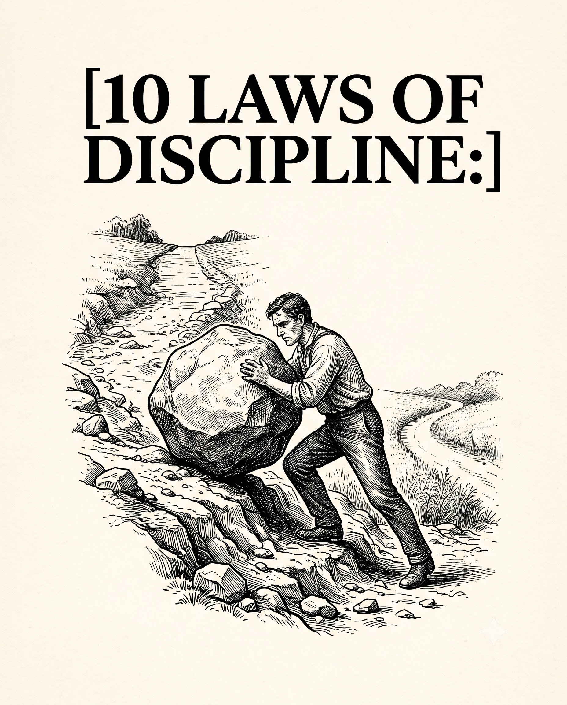

# 🐦 @theendeavorpath

## 📅 August 27, 2026

> 3 post(s) archived.

---

### 🕐 12:50 UTC · @theendeavorpath

> 9. Standard Enforcement Your results will never outgrow your personal standards because you always get what you tolerate from yourself. Draw a hard line on what behavior is acceptable. Example: A designer sets a strict standard of never missing a personal fitness goal, choosing to complete a home workout late at night rather than skipping it.

🔗 [View original post](https://x.com/theendeavorpath/status/2092957877954846922)

---

### 🕐 12:50 UTC · @theendeavorpath

> 10. Radical Self-Auditing Without regular reflection, you will unconsciously slip back into old, destructive loops. Evaluating your behavior weekly ensures you stay aligned with your true potential. Example: A freelancer sits down every Sunday with a notebook to evaluate the past week&apos;s productivity leaks, adjusting the schedule to protect focus time.

🔗 [View original post](https://x.com/theendeavorpath/status/2092957880911790136)

---

### 🕐 12:50 UTC · @theendeavorpath

> 10 LAWS OF DISCIPLINE:

🔗 [View original post](https://x.com/theendeavorpath/status/2092957845117661335)

---
