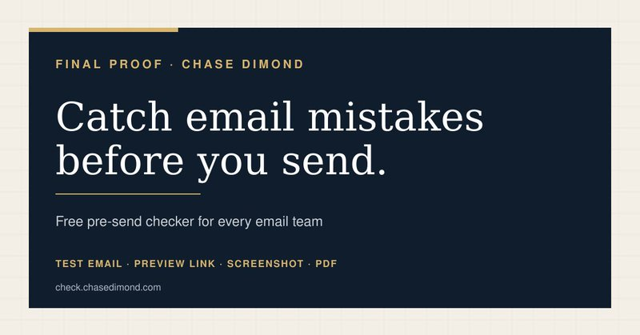
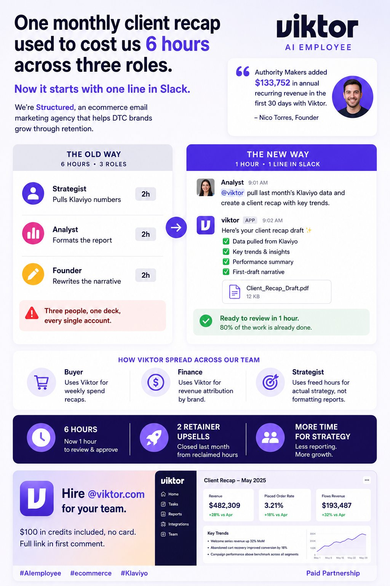
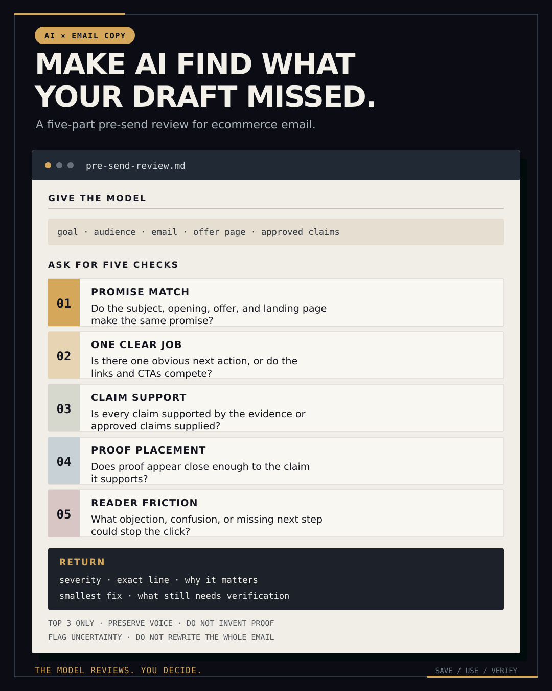

# 🐦 @AiEvolutio58513

## 📅 August 28, 2026

> 4 post(s) archived.

---

### 🕐 17:40 UTC · @AiEvolutio58513

> I’ve been doing email marketing for more than a decade, and I still get nervous before I hit send. I check the links again, reread the dates, and wonder what I missed. If you send campaigns, you know the feeling. That pre-send anxiety is why I built Final Proof, a completely free pre-send email checker. Send it the same test email you already send yourself. It checks the delivered email for broken links, wrong dates, personalization problems, missing tracking, and offer mismatches. Then it gives you a private report showing exactly what needs attention and what to fix. No login. No ESP connection. No new workflow. Just one more set of eyes so you can hit send with confidence. Try it right now with the last campaign you sent. Then use it before the next one: https://check.chasedimond.com

🔗 [View original post](https://x.com/ecomchasedimond/status/2093393235028984310)

---

### 🕐 16:31 UTC · @AiEvolutio58513

> One monthly client recap used to take 6 hours across three people. Now it starts with one Slack message. We thought another reporting dashboard would solve the problem. It didn&apos;t. The charts improved. Nobody got their time back. Everything changed when we stopped asking Viktor to build charts and started asking him to do the work. He pulls the data, identifies key trends, and drafts the client recap inside Slack. Our team reviews and approves. 6 hours became 1. Those recovered hours helped us close 2 additional retainer upsells last month without hiring. Authority Makers saw the same pattern, adding $133,752 in annual recurring revenue in the first 30 days after bringing Viktor into their workflow. What recurring task would you hand off first? Hire @viktor_com for your team. $100 in credits included, no card. Full link in first comment. Paid Partnership

🔗 [View original post](https://x.com/ecomchasedimond/status/2093375882664751601)

---

### 🕐 15:17 UTC · @AiEvolutio58513

> AI gets more useful when I stop asking it to write more copy. Once a draft sounds like me, I give the model a different job: find the three biggest problems before the send. For example: The subject promises 20% off. The body leads with new arrivals. The button sends people to the homepage. Each piece reads fine on its own. Together, the promise keeps changing. I include the campaign goal, audience, email, offer or landing page, and any approved claims or source material. Then I ask it to look for: • Promise mismatch • Competing actions • Unsupported claims • Proof placed too far from the claim it supports • Anything that could make the reader hesitate or get confused I don’t want a full rewrite. I want the exact line, why it may be a problem, the smallest useful fix, and anything I still need to verify. AI can help find inconsistencies and blind spots. It still can’t tell you whether a claim is actually true or approved for your brand. You need to check that yourself. The full review brief is in the image. Keep it to the top three issues. Otherwise, you can end up polishing the voice out of a draft that was already working. Most AI subject-line lists are fake variety. You ask for 20 options. The wording changes. The reason to open stays the same. I get better variation by splitting the work into two passes. First, ask for five distinct angles: • direct value • the problem or trigger • an objection t…

🔗 [View original post](https://x.com/ecomchasedimond/status/2093357407976210773)

---

### 🕐 10:57 UTC · @AiEvolutio58513

> Elon Musk just reminded us that the greatest minds in history were all running identical hardware to a caveman. Zero upgrades across 50,000 years. Musk: &quot;People thought defeating Go was either never or 20 years away.&quot; One year later. Musk: &quot;Now that same AlphaGo system can defeat the top 50 players simultaneously with 0% chance of them winning. And that&apos;s one year later.&quot; Fifty grandmasters. Decades of obsessive, consuming dedication. Not one of them with any chance of taking a single game. From a system that has no idea it is even playing. Musk: &quot;The degrees of freedom to which artificial intelligence is able to apply itself are really increasing by 10 orders of magnitude a year.&quot; Ten billion times over. Each year. No exhaustion. No ego. No ceiling baked into the biology. Just compounding on a curve no human brain was wired to comprehend. All of human progress was built by minds straining against their own physical limits. Scraping out just enough to keep moving forward. That constraint just disappeared. We are the first generation in history where what you can build is no longer bounded by what a single mind can hold. Interested in AI? Follow @AiEvolutio58513 and never fall behind. I track ChatGPT, Claude, and every tool quietly changing how we work and create, then hand you the tested signals. Media The most funded industry in human history just got told it is solving the wrong problem, by one of its own pioneers. LeCun: &quot;Babies learn this around the age of eight or nine months, that objects don&apos;t float, they fall.&quot; No training data. No labels. No reward function. A nine mon…

🔗 [View original post](https://x.com/AiEvolutio58513/status/2093291798668128556)

---
