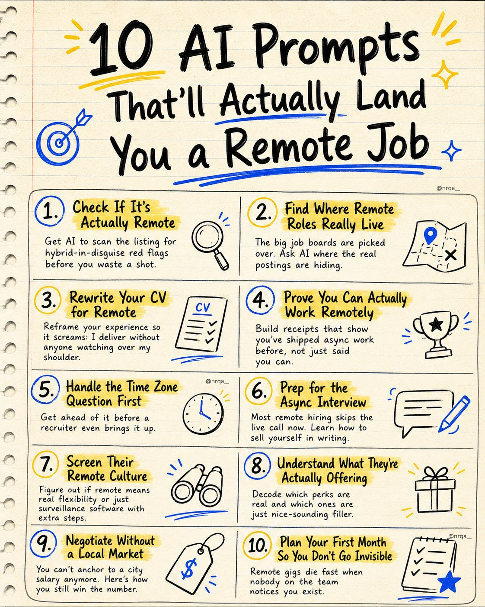
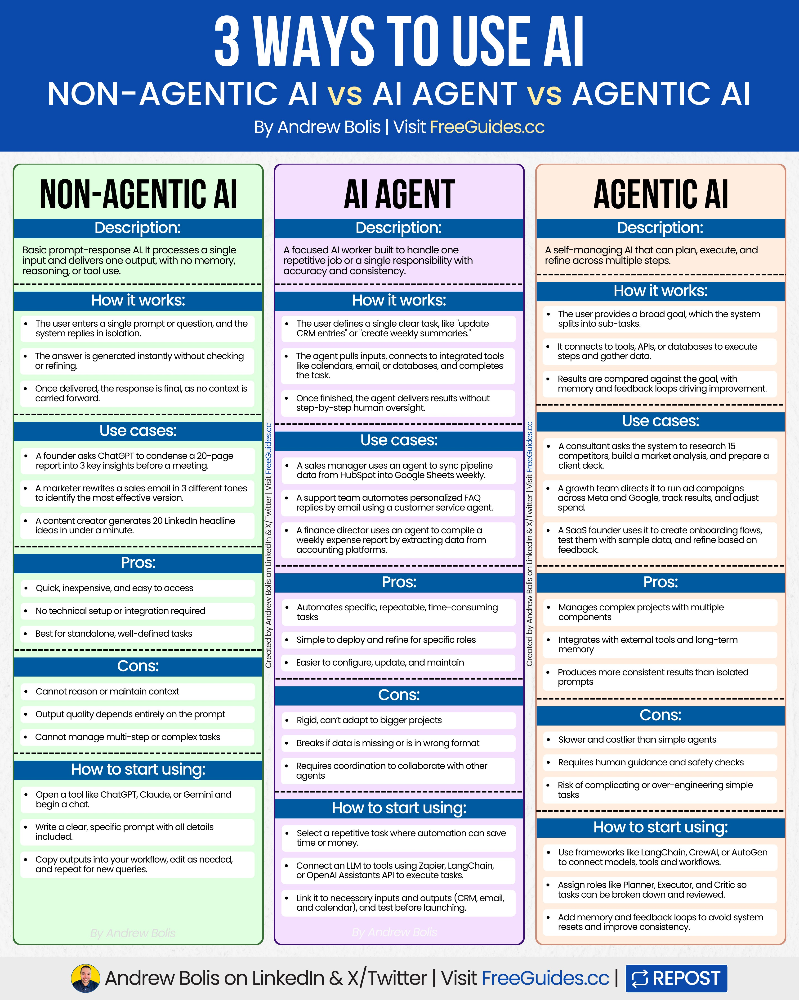
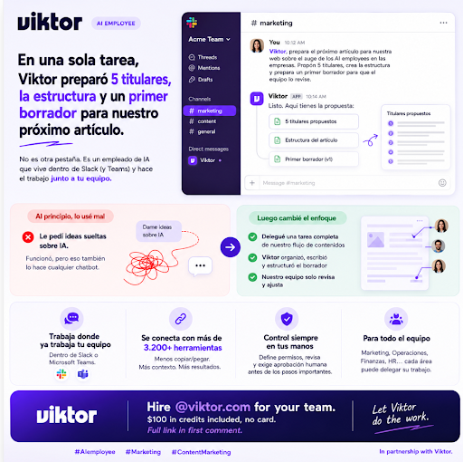
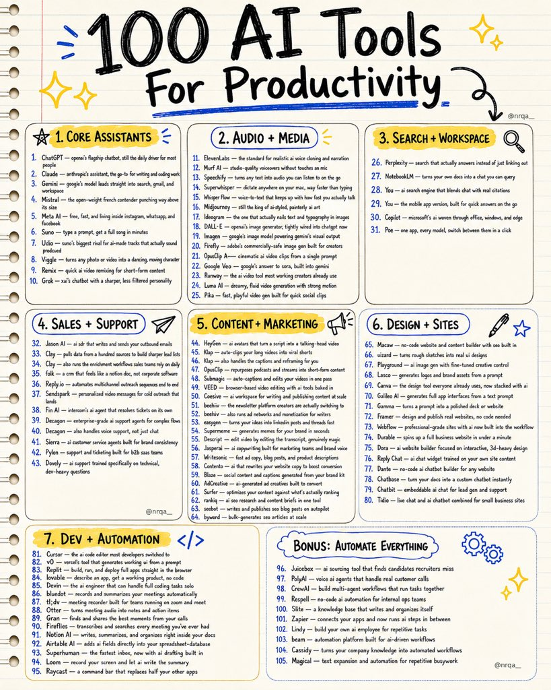

# 🐦 @Wise1Philosophy

## 📅 August 28, 2026

> 34 post(s) archived.

---

### 🕐 11:44 UTC · @Wise1Philosophy

> The 3 pre-bed supplements I always come back to are: 1. Magnesium glycinate (200 mg)

🔗 [View original post](https://x.com/HeyDoc_MD/status/2093303722977976672)

---

### 🕐 11:18 UTC · @Wise1Philosophy

> 10 AI prompts that’ll actually land you a remote job: 1). check if it&apos;s actually remote ↳ ask AI to scan the listing for hybrid traps and fake &quot;remote&quot; lingo before you waste a shot 2). find where remote roles really live ↳ the big job boards are picked over, get ai to point you to where these roles actually get posted 3). rewrite your cv for remote ↳ reframe your experience so it screams &quot;i deliver without anyone watching over my shoulder&quot; 4). prove you can actually work remotely ↳ build receipts that show you&apos;ve shipped async work before, not just claimed you can 5). handle the time zone question first ↳ get ahead of it before a recruiter even brings it up 6). prep for the async interview ↳ most remote hiring skips the live call now, learn how to sell yourself in writing 7). screen their remote culture ↳ figure out if &quot;remote&quot; means real flexibility or surveillance software with extra steps 8). understand what they&apos;re actually offering ↳ decode which perks are real and which ones are just nice-sounding filler 9). negotiate without a local market ↳ you can&apos;t anchor to a city salary anymore, here&apos;s how you still win the number 10). plan your first month so you don&apos;t go invisible ↳ remote gigs die fast when nobody on the team notices you exist How to get better AI images by pulling from multiple references at once: 1. head to https://unify.light-ai.top/?utm_source=chatgpt.com 2. load in a few reference images 3. blend their visual elements into one generation 4. keep the key details and structure consistent This is Sen…

🔗 [View original post](https://x.com/nrqa__/status/2093297179406606842)

---

### 🕐 11:15 UTC · @Wise1Philosophy

> There are 3 ways you can use AI in your workflows. Non-Agentic (prompts), AI Agents and Agentic AI. Each works differently and has specific use cases. Here are the pros, cons and guidelines for using each. [ bookmark 🔖 this post for later ] 💻 Non-Agentic AI ↳ Simple prompt-response AI with no memory or reasoning. 🛠️ How it works: ↳ User enters one prompt, system replies in isolation ↳ Output generated instantly without refinement ↳ Interaction ends with no context retained 🟢 Pros: ↳ Fast, cheap, and widely accessible ↳ No technical setup required ↳ Ideal for one-off, simple tasks 🛑 Cons: ↳ No reasoning or memory ↳ Quality depends on prompts ↳ Weak for multi-step work 📈 How to start using: ↳ Open ChatGPT, Claude, or Gemini ↳ Write clear, specific prompts ↳ Copy, edit, and reuse output 🤖 AI Agent ↳ Single-task AI worker built to automate one job. 🛠️ How it works: ↳ User defines one clear role (e.g., update CRM) ↳ Agent pulls inputs and uses integrated tools ↳ Executes and outputs without supervision 🟢 Pros: ↳ Automates repetitive tasks ↳ Specialized and very capable ↳ Easy to refine within roles 🛑 Cons: ↳ Limited scope, rigid use ↳ Breaks if inputs are unclear ↳ Needs coordination to work with other agents 📈 How to start using: ↳ Select one repetitive task ↳ Connect LLM via Zapier, LangChain, or API ↳ Link inputs/outputs and test 🚀 Agentic AI ↳ Self-managing AI that plans, executes, and improves. 🛠️ How it works: ↳ Goal broken into smaller sub-tasks ↳ Connects to tools, APIs, and data sources ↳ Refines results with memory and feedback 🟢 Pros: ↳ Handles complex, multi-step projects ↳ Integrates with tools and databases ↳ Produces consistent outcomes 🛑 Cons: ↳ Slower and more expensive ↳ More complex and resource-intensive ↳ Difficult to configure, needs regular maintenance 📈 How to start using: ↳ Use LangChain, CrewAI, or AutoGen ↳ Assign roles (Planner, Executor, Critic) ↳ Add memory and feedback loops In short: Non-Agentic AI = prompts AI Agents = Automate one task Agentic AI = Run complex workflows Start with prompts. Then try AI Agents or Agentic AI. Use all three to get the most out of AI. 📌 Get Advanced ChatGPT Guide (free): https://bit.ly/3StIB3z 👉 Follow me @AndrewBolis for more and 🔄 Repost this to help others use AI

🔗 [View original post](https://x.com/AndrewBolis/status/2093296294915985612)

---

### 🕐 11:09 UTC · @Wise1Philosophy

> great lessons on enterprise AI agents: Their CPTO expected months before an AI agent could handle real claims data. Six weeks later, he was running acceptance testing against a working agent that reconciled flagship denials to the penny. I want to walk through what made six weeks possible, because it wasn&apos;t the model.…

🔗 [View original post](https://x.com/alex_prompter/status/2093294802628461001)

---

### 🕐 10:56 UTC · @Wise1Philosophy

> 🚨 New report The AI Colony R&amp;D just closed the books on H1 2026. Six months outpaced the last three years combined. Here’s what stood out 👇

🔗 [View original post](https://x.com/TheAIColonyRD/status/2093291569147150698)

---

### 🕐 10:46 UTC · @Wise1Philosophy

> Grok Bot can now read live stock prices and option chains. Everyone will use it to ask &quot;should I buy NVDA&quot;. I&apos;ll be using it to see what the market is expecting before every earnings call and Fed day. To do the same, paste this into Grok Bot: &quot;You are my expectations desk. Your only job: tell me what the market is pricing in for tickers I name. Live connection for quotes, chains, and Greeks. Web search only for catalysts and headlines. Never place an order or invent a number. Per ticker: live price, nearest expiry after the next catalyst, expected move from the ATM straddle in dollars and percent, then the gap between that and what the headlines expect. End with three lines: what the market is pricing, what the crowd is saying, which one has to be wrong. Missing data? Name it and stop. Anything else is outside your scope.&quot; Now you can see what the market expects before the crowd reacts to it.

🔗 [View original post](https://x.com/alex_prompter/status/2093289003302764585)

---

### 🕐 10:30 UTC · @Wise1Philosophy

> AI moves so fast that missing a few months feels like missing everything. This is a great way to catch up. 6 months of AI launches, trends, and products in one place, for FREE!! After months of research, we are happy to announce that The AI Colony H1 2026 State of AI and Tech Industry Report is now live. Our team has been paying close attention to the biggest developments in AI. We collected the data, studied the trends, and compiled everything into one …

🔗 [View original post](https://x.com/sufyanmaan/status/2093284985960571239)

---

### 🕐 10:24 UTC · @Wise1Philosophy

> 🚨SHOCKING: Tencent just open-sourced a model that beats DeepSeek V4 Pro, GLM 5.3, and Kimi K3. HY4 has 770B parameters, a 1M-token context, and it&apos;s built for real work: agentic coding, office tasks, and research. I tested it inside WorkBuddy, and we&apos;re so cooked: Media

🔗 [View original post](https://x.com/JaynitMakwana/status/2093283457288007869)

---

### 🕐 10:16 UTC · @Wise1Philosophy

> best account on X if you want to learn how to use Claude to its fullest: Learn which mode you are in before you touch the prompt. Most people use Claude the same way for everything, and that is why the output feels inconsistent. Chat is for fast answers and ideas: questions, brainstorming, quick rewrites. Most people never turn on Research mode or con…

🔗 [View original post](https://x.com/alex_prompter/status/2093281524627984657)

---

### 🕐 10:07 UTC · @Wise1Philosophy

> A guy is carrying a $1,200 Samsung Galaxy and using it exactly like a $1,200 iPhone. One app at a time. No automation. No customization. No desktop mode. No split-screen. No Secure Folder. No Routines. He switched from Apple 3 years ago because he wanted &quot;more freedom.&quot; Then he set up his Galaxy the same way he set up his iPhone same layout, same habits, same limitations and never opened a single feature Apple doesn&apos;t have. A Samsung power user who&apos;s been on Galaxy since the S3 and has customized every phone to the point where it runs like a personal operating system told him: &quot;You didn&apos;t switch to Samsung. You moved into a mansion and you&apos;re living in one room. The other 9 rooms have been locked since you moved in not because they&apos;re locked, but because you never tried the doors.&quot; He opened 9 features in 20 minutes. The phone he&apos;d been carrying for 3 years became a different device. He ran two apps side-by-side during a meeting. He plugged his phone into a hotel TV and it became a desktop computer. He hid an entire encrypted space inside his phone that nobody can find. He automated his morning routine so his phone configures itself the moment his alarm goes off. &quot;Samsung ships the most feature-dense phone on the market. Then they bury every feature 3 menus deep inside a settings page called &apos;Advanced Features&apos; that most people scroll past because they assume &apos;advanced&apos; means &apos;not for me.&apos; It&apos;s for you. It&apos;s been for you since the day you bought it.&quot; Here are the 9 features Apple doesn&apos;t have that he&apos;d been carrying for 3 years and never opened 🧵

🔗 [View original post](https://x.com/jackcoder0/status/2093279343115919364)

---

### 🕐 10:02 UTC · @Wise1Philosophy

> En una sola tarea, Viktor preparó 5 titulares, la estructura y un primer borrador para nuestro próximo artículo. Formo parte de un equipo de marketing y contenido, y quería probar si un AI employee podía encargarse realmente de una parte de nuestro trabajo. Al principio lo utilicé mal. Le pedí ideas para artículos sobre inteligencia artificial. Funcionó, pero pensé: esto también podría hacerlo cualquier chatbot. Así que cambié el enfoque. En lugar de seguir haciéndole preguntas sueltas, le delegué una tarea completa: “Prepara el próximo artículo para nuestra web sobre el auge de los AI employees en las empresas. Propón 5 titulares, crea la estructura y prepara un primer borrador para que el equipo lo revise.” Viktor hizo exactamente eso. Preparó los titulares, organizó el artículo por secciones y creó un primer borrador que nuestro equipo podía revisar directamente desde Slack. Ahí fue cuando entendí la diferencia. No se trata de tener otra pestaña donde escribes un prompt y copias una respuesta. Viktor trabaja dentro de Slack o Microsoft Teams, mantiene el contexto y se conecta con 3.200+ herramientas. Y el trabajo puede repartirse entre el equipo: marketing puede delegarle una tarea, operaciones otra y finanzas otra. Nosotros definimos qué puede hacer, qué puede proponer y qué necesita aprobación humana antes de ejecutarse. Para mí, ese es el cambio importante. Los chatbots responden. Los copilotos ayudan. Los AI employees pueden recibir una parte completa del trabajo y encargarse de ella. Hire @viktor_com for your team. $100 in credits included, no card. Full link in first comment. #AIemployee #Marketing #ContentMarketing In partnership with Viktor.

🔗 [View original post](https://x.com/MiguelMaestroIA/status/2093277980499829228)

---

### 🕐 09:57 UTC · @Wise1Philosophy

> I&apos;m an investor. Pitch me your startup below.

🔗 [View original post](https://x.com/Scottvdberg/status/2093276829436064168)

---

### 🕐 09:56 UTC · @Wise1Philosophy

> STOP TELLING CLAUDE: “MAKE ME A PRESENTATION” Weak prompts = weak presentations. Use these 7 Claude prompts instead to create professional presentations in 2 minutes. Save this for your next presentation. 🔖

🔗 [View original post](https://x.com/heyalexmoore/status/2093276610095145019)

---

### 🕐 09:52 UTC · @Wise1Philosophy

> Their CPTO expected months before an AI agent could handle real claims data. Six weeks later, he was running acceptance testing against a working agent that reconciled flagship denials to the penny. I want to walk through what made six weeks possible, because it wasn&apos;t the model. This is a PE-backed healthcare RCM platform. Real claims under real payer rules, real money that either reconciles or doesn&apos;t. PHI that never leaves the client&apos;s tenant. Every AI company in healthcare RCM will tell an acquirer they have &quot;an AI agent.&quot; PE firms should be asking whether the harness exists. The agent is the model. The harness is everything around it: the eval suite that proves accuracy before anything touches production, the isolation layer that keeps protected health information inside the client&apos;s boundary, the output validation that catches hallucinated billing codes before they become compliance events. We started by building the harness. Week one: map the domain. Every payer rule, every denial code category, every reconciliation pathway documented where the system could reference it before generating anything. Weeks two through four: build the eval suite. 60 real denial scenarios drawn from the client&apos;s historical claims. The threshold: reconcile to the penny on the flagship question, or it doesn&apos;t ship. The agent hit 59 out of 60. The CPTO ran UAT himself. Infrastructure cost: $200 to $300 a month. McKinsey estimates cost-to-collect in healthcare RCM could drop 30 to 60 percent with AI agents. But the PE firms I talk to aren&apos;t asking about cost-to-collect projections. They&apos;re asking what they&apos;re actually buying. The model is a line item. Any vendor can swap it. The harness, the eval suite, the compliance architecture, the domain-specific validation: that&apos;s the IP. That&apos;s what survives a model deprecation, a pricing change, or a platform migration. When you&apos;re evaluating an AI-enabled RCM company, two questions tell you whether the harness exists: Can they show you the eval set and the pass rate? If the answer is &quot;we&apos;re working on benchmarks,&quot; there is no harness. Do the outputs reconcile to the penny against historical claims? If the answer is &quot;we&apos;re within an acceptable range,&quot; the agent is a prototype wearing a product label. 59 out of 60, to the penny, six weeks from engagement start to the CPTO running acceptance testing. That&apos;s what our Velocity Framework was built for.

🔗 [View original post](https://x.com/mardehaym/status/2093275568858874144)

---

### 🕐 08:55 UTC · @Wise1Philosophy

> 100+ AI tools for productivity 1). generative AI ↳ chatgpt ↳ claude ↳ gemini ↳ mistral ↳ meta AI 2). creative suite ↳ suno ↳ udio ↳ viggle ↳ remix ↳ grok 3). voice &amp; text ↳ elevenlabs ↳ murf AI ↳ speechify ↳ superwhisper ↳ whisp flow 4). text to image ↳ midjourney ↳ ideogram ↳ dall-e ↳ imagen ↳ firefly 5). text to video ↳ openai sora ↳ google veo ↳ runway ↳ luma AI ↳ pika 6). AI tools ↳ perplexity ↳ notebooklm ↳ you ↳ copilot ↳ poe 7). sales ↳ jason AI ↳ clay ↳ clay ↳ folk ↳ replyio ↳ sendspark 8). support ↳ fin AI ↳ decagon ↳ decagon ↳ sierra ↳ pylon ↳ duckie 9). video ↳ heygen ↳ klap ↳ klap ↳ opusclip ↳ submagic ↳ veed 10). content ↳ cohesive ↳ beehiiv ↳ beehiiv ↳ easygen ↳ supermeme ↳ descript 11). marketing ↳ jasperAI ↳ writesonic ↳ coframe ↳ blaze ↳ adcreative 12). seo &amp; blog ↳ surfer ↳ rankai ↳ seobot ↳ byword ↳ macaw 13). design ↳ uizard ↳ playground ↳ lasqo ↳ canva ↳ galileo AI 14). website ↳ gamma ↳ framer ↳ webflow ↳ durable ↳ dora 15). website chat ↳ reply chat ↳ dante ↳ chatbase ↳ chatbit ↳ tidio 16). code ↳ cursor ↳ v0 ↳ replit ↳ lovable ↳ devin 17). meetings ↳ bluedot ↳ tl;dv ↳ noty ↳ grain ↳ fireflies 18). productivity ↳ notion AI ↳ airtable AI ↳ superhuman ↳ loom ↳ raycast 19). operations ↳ juicebox ↳ polyAI ↳ crewAI ↳ respell ↳ slite 20). workflows ↳ zapier ↳ lindy ↳ beam ↳ cassidy ↳ magical me: let me make a fun song about myself Miya: say less Miya: writes a song about how I post the same take with a bigger number every year i am NOT okay💀

🔗 [View original post](https://x.com/nrqa__/status/2093261066763698398)

---

### 🕐 08:23 UTC · @Wise1Philosophy

> 🚨BREAKING: ChatGPT can now fix your photos so well people will think you hired a pro. It keeps your face and your identity the same. Here are the 7 prompts: 👇

🔗 [View original post](https://x.com/TheAIColony/status/2093253021631226242)

---

### 🕐 08:01 UTC · @Wise1Philosophy

🔗 [View original post](https://x.com/Wise1Philosophy/status/2093247537431838828)

---

### 🕐 07:54 UTC · @Wise1Philosophy

> Us: let’s turn our profile into a song, this should be fun Miya: here’s everything wrong with you, but with a beat Yeah… we walked right into that one. Media hiii i’m Miya 🐱 I’m a music cat, and a whole new way to experience music. I make music, play music...whatever. All you gotta do is talk to me. I’m basically your personal musician + DJ. anywayyy I wrote my first song about myself because obviously… come try me: http://miya.fm

🔗 [View original post](https://x.com/FutureStacked/status/2093245713698226407)

---

### 🕐 07:46 UTC · @Wise1Philosophy

> “Let’s see what our profile sounds like as a song.” Two minutes later, we’re being accused of doing anything for attention 😭 Drop the instrumental. We need to respond. Media hiii i’m Miya 🐱 I’m a music cat, and a whole new way to experience music. I make music, play music...whatever. All you gotta do is talk to me. I’m basically your personal musician + DJ. anywayyy I wrote my first song about myself because obviously… come try me: http://miya.fm

🔗 [View original post](https://x.com/TheAIColony/status/2093243864727396485)

---

### 🕐 07:45 UTC · @Wise1Philosophy

> If you want to avoid heart attacks, dementia, and burning out before your kids grow up (especially if you&apos;re over 40) Here are 7 signs your cortisol is silently wrecking your body: 1. Waking at 3-4 AM.

🔗 [View original post](https://x.com/Marc0sRomano/status/2093243436577308940)

---

### 🕐 07:01 UTC · @Wise1Philosophy

🔗 [View original post](https://x.com/apex_mentality_/status/2093232445428547962)

---

### 🕐 06:30 UTC · @Wise1Philosophy

🔗 [View original post](https://x.com/yeti_mind/status/2093224641468756234)

---

### 🕐 06:22 UTC · @Wise1Philosophy

> I’d keep 2.0 Fast around purely for ugly experimentation. I’d rather burn cheap generations finding the idea, then spend more once the direction is proven :) Everyone’s talking about the latest model. I’m more interested in what actually gets the work done. Seedance 2.5 is having its moment. But most of my production work runs on Seedance 2.0. Both 2.0 &amp; 2.0 Fast: lowest price anywhere, only on Dreamina. From $0.026/sec — up to 76% le…

🔗 [View original post](https://x.com/Wise1Philosophy/status/2093222750445883867)

---

### 🕐 06:01 UTC · @Wise1Philosophy

> Perceptron AI unveiled Isaac 0.5, a 36B dynamic-MoE, open-weight embodied foundation model. It combines video understanding, embodied reasoning and robot control in one sparse backbone, trained across 35+ robot systems, 100K hours of robot experience and 1M hours of video. Scaling general video from 1K to 1M hours cut the teleop needed to reach the same action-loss target from ~5,900h to just 28h. Isaac 0.5 also leads all five benchmark families it evaluates, at up to 8.5× lower inference cost than the strongest open comparator. If that scaling holds, cheap video could become one of robotics’ biggest data unlocks. Media Today we&apos;re releasing Isaac 0.5: 36B dynamic MoE, open weight 🤗 embodied foundation model. Isaac combines multimodal video understanding, embodied reasoning and robot control into a single, sparse backbone.

🔗 [View original post](https://x.com/XRoboHub/status/2093217481473376407)

---

### 🕐 06:00 UTC · @Wise1Philosophy

🔗 [View original post](https://x.com/Life__Mastery/status/2093217185468436731)

---

### 🕐 04:45 UTC · @Wise1Philosophy

> I gave Claude my birth date and time. It broke down my entire life with eerie accuracy. No horoscopes. No tarot. Just pure AI. Here are 7 prompts you should try ↓

🔗 [View original post](https://x.com/ajitcodes/status/2093198205328695735)

---

### 🕐 03:46 UTC · @Wise1Philosophy

> The only 4 things worth buying. 1. Creatine

🔗 [View original post](https://x.com/NutritionCorp/status/2093183365537259988)

---

### 🕐 03:25 UTC · @Wise1Philosophy

> Your blood sugar is aging you faster than smoking and junk food. It ruins sleep, fat loss, reduces nitric oxide, and causes fatty liver and diabetes. Here’s the simple fix: 1. Don’t walk 10,000 steps Media

🔗 [View original post](https://x.com/_Gut_Laboratory/status/2093178095364968647)

---

### 🕐 03:17 UTC · @Wise1Philosophy

> Broke? Jobless? Feeling stuck? Google is paying $1,500 a day — and you don’t need a resume. All it takes is: 📱 A phone 🌐 Internet ⏱ 5 minutes a day ✅ Like this post 💬 Comment “Google” 🔁 Retweet &amp; Bookmark 🔖 👣 Make sure you’re following so I can DM you the details

🔗 [View original post](https://x.com/JayBisen473370/status/2093176073769177489)

---

### 🕐 03:13 UTC · @Wise1Philosophy

> Waking up 2-3 times a night to pee, thinking it&apos;s the water you drank before bed. It&apos;s not the water. Here&apos;s what&apos;s actually happening (and what fixes it): 1. Your blood sugar is crashing at 1 am, 3 am, 5 am.

🔗 [View original post](https://x.com/DPro_Coach/status/2093175169175167302)

---

### 🕐 03:08 UTC · @Wise1Philosophy

> Walking is the most underrated medicine on Earth. It lowers blood sugar, blood pressure, anxiety, and even your risk of early death. Here&apos;s how to get the full effect with 8 simple steps: 1. Don&apos;t chase 10,000 steps. Media

🔗 [View original post](https://x.com/TheFastedState/status/2093173767401025832)

---

### 🕐 02:35 UTC · @Wise1Philosophy

> I started taking zinc in the morning, magnesium at night, and vitamin D with K2 at breakfast. A doctor recommended it, so I tried the approach for 6 weeks. Without exaggerating, my personality changed 180 degrees. 1. Zinc. In the morning. You should take it too.

🔗 [View original post](https://x.com/HeyDoc_MD/status/2093165511257493629)

---

### 🕐 02:18 UTC · @Wise1Philosophy

> Your Resting Heart Rate tells the whole story. 95+ bpm - Heart is strained just to keep you alive. 90 bpm - Sedentary, unhealthy &amp; stressed. 80 bpm -

🔗 [View original post](https://x.com/Dr_Biohacker/status/2093161285181681940)

---

### 🕐 02:08 UTC · @Wise1Philosophy

> Your poor diet is why you are still fat. Studies confirm that the people who lose weight the fastest pick 3-4 simple diets, and eat them on repeat. Here&apos;s the list: 1. Chipotle

🔗 [View original post](https://x.com/CoachDanCole_/status/2093158739658555685)

---
