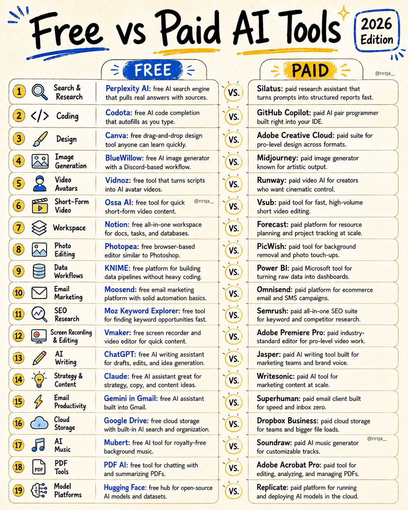
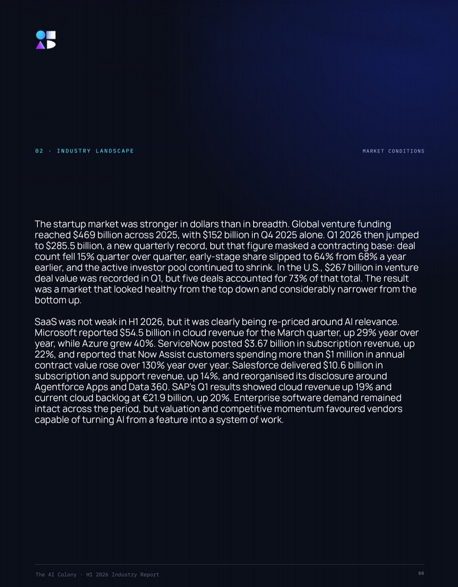
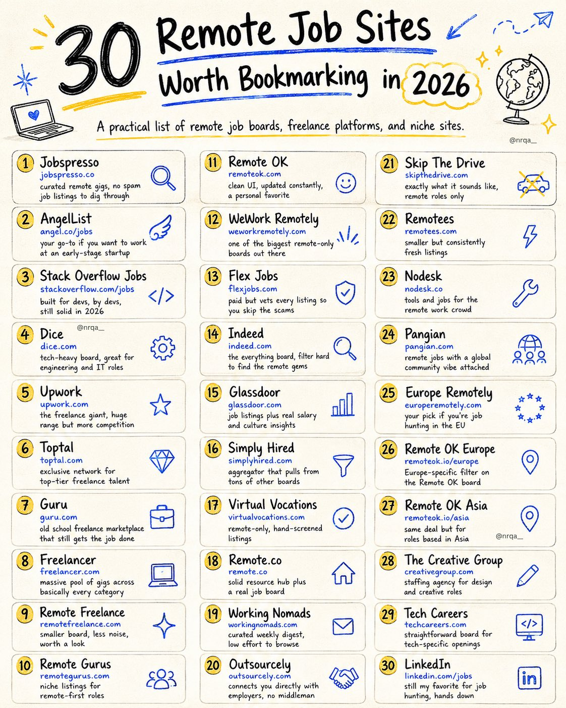
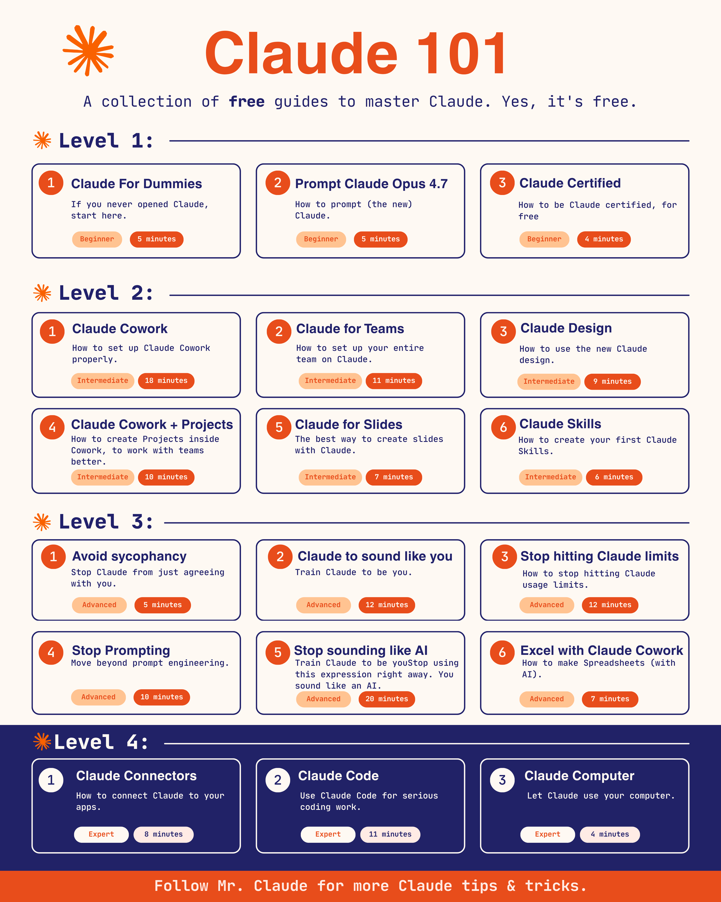
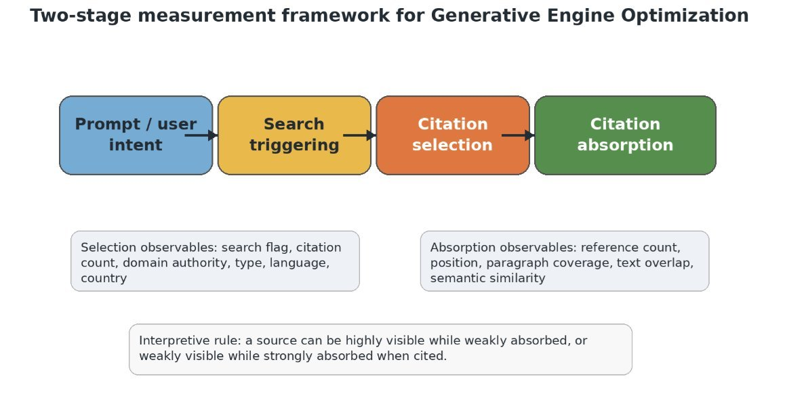
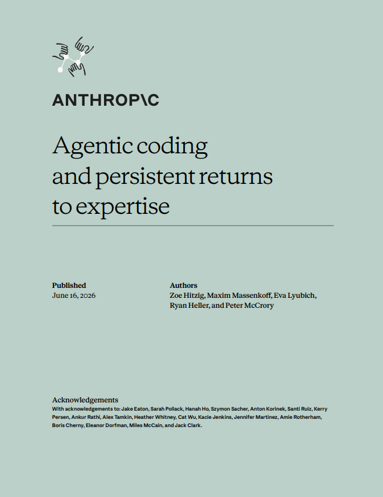
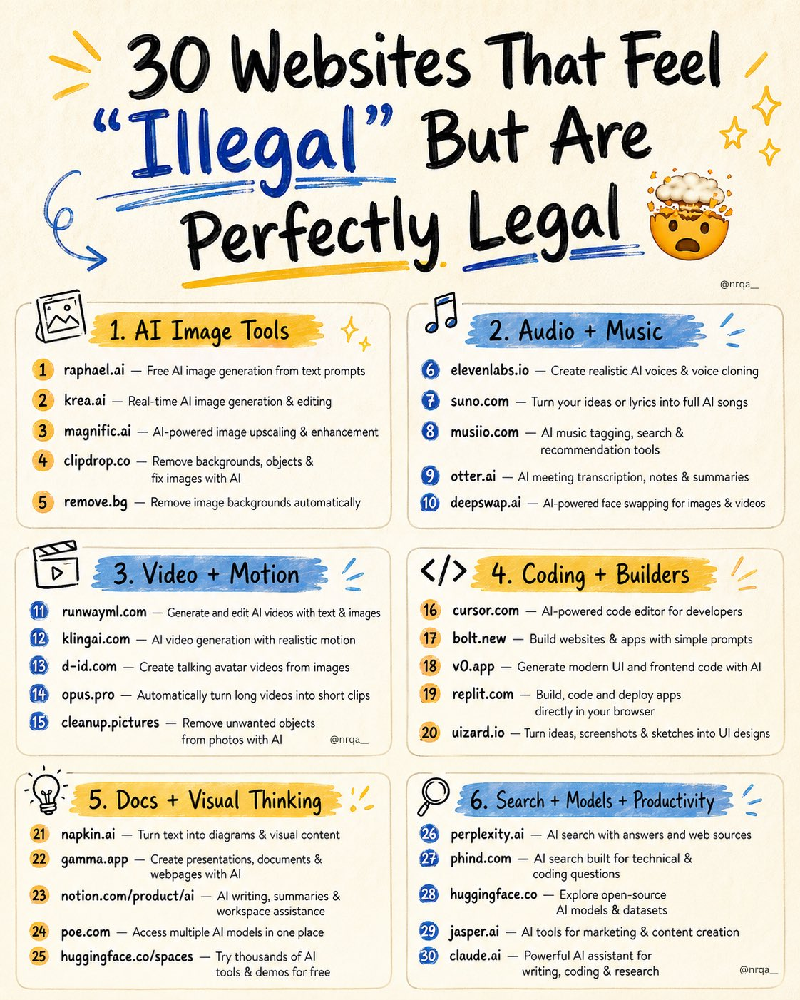
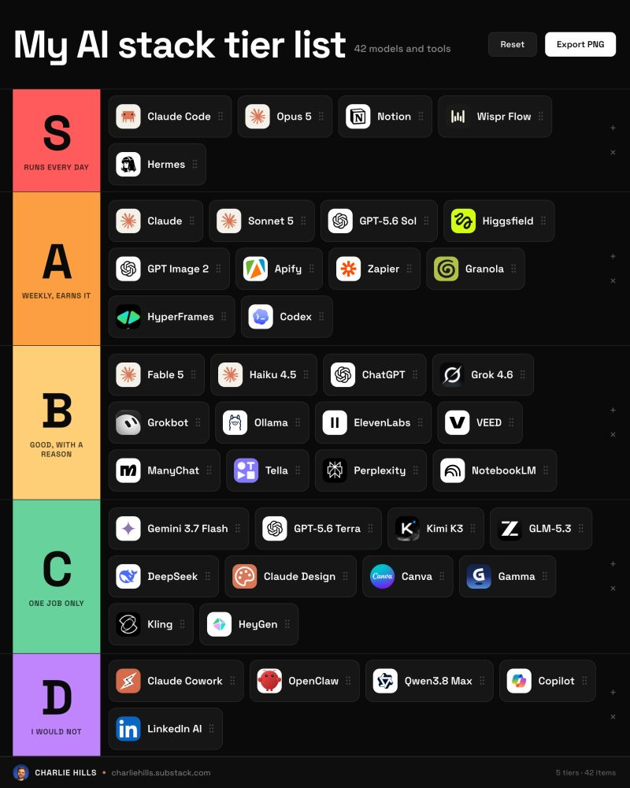
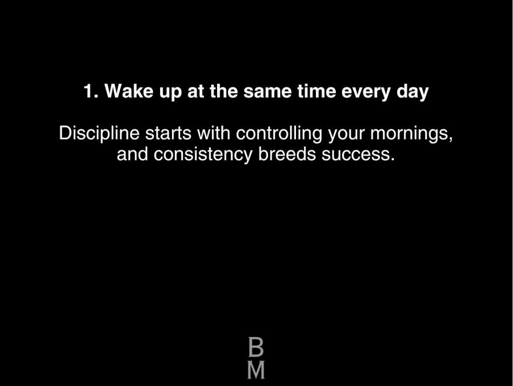

# 🐦 @Wise1Philosophy

## 📅 August 28, 2026

> 96 post(s) archived.

---

### 🕐 17:28 UTC · @Wise1Philosophy

> I need the podcast timestamp one immediately 👀 Holy smokes... people stopped chatting with Grok Bot. They started giving it standing jobs. Bookmark this. 8 setups from this week:

🔗 [View original post](https://x.com/Wise1Philosophy/status/2093390373049532431)

---

### 🕐 17:19 UTC · @Wise1Philosophy

> Grok Bot Marketplace coming in 3, 2, 1… You can now share templates of your Bots with others.

🔗 [View original post](https://x.com/godofprompt/status/2093388112361668959)

---

### 🕐 17:16 UTC · @Wise1Philosophy

> Polsia&apos;s product line is the real story, not the raise. Ben has no employees. The agents that ran his data room and diligence are the same ones shipping the products. An ops desk for small businesses. A tool that reads your paperwork for leaks. All of it in three languages already. The $30M didn&apos;t build the company. It confirmed one was already running. Media I want to build a brand as iconic as Daft Punk. AI now automates 80% of the work. The only thing left is taste. So that&apos;s where my time goes: branding, UI that delights, content, community. aisloP episode 6 &quot;The Brand&quot; is the story of how I&apos;m building the Polsia brand.

🔗 [View original post](https://x.com/AIHighlight/status/2093387136225415381)

---

### 🕐 17:14 UTC · @Wise1Philosophy

> free vs paid AI tools: INDIE STUDIOS SPEND $8,000 AND A MONTH ON ART FOR A 2D GAME. I MADE A FULL SET IN AN AFTERNOON. what the $8,000 pays for: → character artist, $2,000, sprite sheets and animations → background artist, $1,800, per environment → UI designer, $1,200, menus and icons → animator to rig…

🔗 [View original post](https://x.com/nrqa__/status/2093386803302871316)

---

### 🕐 17:12 UTC · @Wise1Philosophy

> Polsia isn&apos;t building one product. It&apos;s building a portfolio. Hearthsignal for local businesses losing money between calls and invoices. Mothledger for the bills and renewals nobody has time to read. Gatherwink for people tired of swiping. All shipped by agents, not a team. Zero employees. One founder. A full product line. Watch how it runs: Media I want to build a brand as iconic as Daft Punk. AI now automates 80% of the work. The only thing left is taste. So that&apos;s where my time goes: branding, UI that delights, content, community. aisloP episode 6 &quot;The Brand&quot; is the story of how I&apos;m building the Polsia brand.

🔗 [View original post](https://x.com/TheAIColony/status/2093386237486747859)

---

### 🕐 17:08 UTC · @Wise1Philosophy

> Polsia&apos;s feed reads like a company launching five products at once. An operations desk that answers calls and flags risks for small businesses. Something that hunts the leaks buried in your bills and renewals. A service that finds compatible people through real local events. Every single one says live soon. Media I want to build a brand as iconic as Daft Punk. AI now automates 80% of the work. The only thing left is taste. So that&apos;s where my time goes: branding, UI that delights, content, community. aisloP episode 6 &quot;The Brand&quot; is the story of how I&apos;m building the Polsia brand.

🔗 [View original post](https://x.com/AIFrontliner/status/2093385302194765889)

---

### 🕐 16:39 UTC · @Wise1Philosophy

> The venture market has a breadth problem. Q1 2026 set an all-time funding record, but deal count fell 15% quarter over quarter and early-stage share slipped to 64%. The money is bigger than ever and spread thinner than ever. The full funding picture is in the H1 2026 IndustryReport:https://www.theaicolony.com/blog/the-state-of-ai-tech-startup-and-saas-a-half-year-2026-review

🔗 [View original post](https://x.com/TheAIColonyRD/status/2093377856667541826)

---

### 🕐 16:27 UTC · @Wise1Philosophy

> HOW TO RAISE A CHILD WHO RESPECTS YOU WITHOUT FEARING YOU. AGES O-5: THE AGE OF CONNECTION:

🔗 [View original post](https://x.com/scotti_brooks/status/2093374998501355977)

---

### 🕐 16:24 UTC · @Wise1Philosophy

> Children who &quot;Don&apos;t listen&quot; often have parents who are doing these 4 things without realizing it... And what to do instead.. 👇

🔗 [View original post](https://x.com/Manifest_Lord/status/2093374175096573975)

---

### 🕐 16:10 UTC · @Wise1Philosophy

> single prompt editing is THE move 👏 Every creator knows this day. You sat down when the sun was out and didn&apos;t look up until it was dark. All for one edit. @eachlabs MCP turns that into a single prompt. Describe it, get it back, move on with your life 👇

🔗 [View original post](https://x.com/Wise1Philosophy/status/2093370584960786738)

---

### 🕐 16:00 UTC · @Wise1Philosophy

> He encontrado 50 SITIOS WEB INCREÍBLEMENTE ÚTILES que deberías guardar...

🔗 [View original post](https://x.com/MiguelMaestroIA/status/2093368095016419617)

---

### 🕐 15:49 UTC · @Wise1Philosophy

> Most people are sleeping on one of the wildest open AI releases right now. Built by rednote’s dots studio @dotsstudioai, it can critique its own progress, learn while working, and adapt across thousands of interactions. With a custom recursive self-critique harness, the system also achieved a certified 42/42 at IMO 2026. Meet dots3-note Preview ↓ Media

🔗 [View original post](https://x.com/HeyAbhishek/status/2093365274284372094)

---

### 🕐 15:43 UTC · @Wise1Philosophy

> Somehow everyone missed the biggest finding of 2026 about getting traffic to your website from ChatGPT, Claude, Perplexity, etc. I originally didn&apos;t want to draw attention to it, but now that the data has gone public, let&apos;s talk about it. This works well for all business categories, but it works especially well for SaaS. By the way, you can see whether your business is appearing across Google AI, ChatGPT, Claude, Perplexity and Grok here (it&apos;s free): https://seo-stuff.com/free-audit Alright, so if you missed it, Rankscale (I have no affiliation) did a deep-dive study on how AI platforms decide which sites to cite. I’ll include a link to the raw data below and I wrote in detail about it a couple of days ago (you can click on my profile and scroll down a few posts). Essentially Rankscale analyzed where ChatGPT, Perplexity, Gemini and Google AI Overviews are pulling their answers from and what’s working best for B2B brands. To do this, Rankscale looked at thousands of commercial queries like: “Top CRM software” “Top SEO software vendors” “Best online learning platforms” And based on that, here’s where AI engines are pulling data from very often now: Industry-specific blogs and publications (TechTarget, FiercePharma, QSR Magazine) Official company blogs and vendor sites Professional directories like Clutch and G2 Analyst reports (Gartner, Statista, etc.) LinkedIn posts and expert commentary Mainstream business news And among the most interesting takeaways: Vendor blogs, yes, the company’s own blogs, are now very frequently being cited as sources in AI search results. Perplexity, Gemini and Google AI Overviews cited product blogs heavily in B2B-related answers, and while ChatGPT cited them less often, it still did so consistently enough to show a clear trend. AI engines are now rewarding brands that publish comparison content on their own blogs, and it isn&apos;t limited to high authority sites. Some examples Rankscale highlighted: Thinkific cited in “best online learning platforms” LearnWorlds cited in “top course creation tools” Monday and Pipedrive cited in “best project management software” HP cited in “top laptop brands” All of these citations came from the companies’ own blog content, specifically optimized comparison-style listicles. These vendor blogs are filling a massive content gap, because most industries lack neutral, third-party content that compares vendors in detail. So when a brand publishes something that fits the bill, AI engines pull it, and they don’t always know or care that the content is coming from a competitor. As long as it’s thorough and well structured, objectively written and not purely promotional, built with clear headers and factual comparisons, it gets indexed and cited in AI answers. Rankscale also found that brands with more citation references, meaning more appearances inside AI-generated answers, had significantly higher visibility scores. That score reflects both detection and ranking position. All of which is to say, the more your brand is cited, the more often AI engines surface you again. Basically the visibility builds on itself. This is exactly why SEO Stuff’s (http://seo-stuff.com) entire system is built around creating that flywheel: structured, authoritative content plus backlinks that fuel repeated AI citations. SEO Stuff&apos;s Done-For-You Package (the most popular package): 10 long-form, snippet-optimized articles plus 3 DR50+ backlinks designed to push your brand into the same first-result positions AI agents select most often. Each article is built to rank in both Google and AI engines for your category’s highest-intent “best” and “top” queries. https://seo-stuff.com/gold-plan-package SEO Stuff&apos;s Content Package: 60 high-authority pages built as objective-style “best of,” “top,” and “comparison” content, the exact formats Rankscale found being cited by Perplexity, Gemini, and Google AI Overviews. Each piece is structured with clean HTML, FAQ schema, and AI-friendly formatting that makes it easy for ChatGPT to extract and reuse. https://seo-stuff.com/premium-content-bundle-service Together, these plans position your brand to: Be cited as an authority in your niche, even inside competitor AI answers Accumulate AI visibility signals that compound over time Grow across both traditional search and AI-assisted search layers The AI visibility race is about who trains the models first, and right now, vendor blogs with structured comparison content are doing exactly that. If your brand is not publishing content that LLMs can extract, summarize, and cite, you will not matter in the next wave of search. SEO Stuff (http://seo-stuff.com) was built to fix that. That’s why 80%+ of customers who buy the Done-For-You Package come back for additional orders. It works. And if you want to know how your site ranks in Google, ChatGPT, Claude and broader AI search, check here (it&apos;s free): https://seo-stuff.com/free-audit Your brand can appear as a ChatGPT &quot;source&quot; and still not actually influence the answer. This is going to sound a little dumb, but... Getting cited by ChatGPT does not necessarily mean ChatGPT used your website in a meaningful way. A study analyzed 21,143 citations across ChatGPT…

🔗 [View original post](https://x.com/alexgroberman/status/2093363897424290267)

---

### 🕐 15:16 UTC · @Wise1Philosophy

> You&apos;ve been lied to. Burnout isn’t caused by working too hard or extreme stress. It’s caused by biology. After 12 years measuring pro athletes, Fortune 500 executives, and founders doing $1M+, here’s the science behind what causes burnout (and how to stop it):

🔗 [View original post](https://x.com/marcuswlefton/status/2093357119139618983)

---

### 🕐 15:10 UTC · @Wise1Philosophy

> 30 Remote Job Sites Worth Bookmarking in 2026 : ↳ jobspresso ↳ angellist ↳ stack overflow jobs ↳ dice ↳ upwork ↳ toptal ↳ guru ↳ freelancer ↳ remote freelance ↳ remote gurus ↳ remote ok ↳ weworkremotely ↳ flexjobs ↳ indeed ↳ glassdoor ↳ simply hired ↳ virtual vocations ↳ remoteco ↳ working nomads ↳ outsourcely ↳ skip the drive ↳ remotees ↳ nodesk ↳ pangian ↳ europe remotely ↳ remote ok europe ↳ remote ok asia ↳ the creative group ↳ tech careers ↳ linkedin the old game dev workflow: idea → game engine → code → assets → levels → debugging → finally playable Gear Zero | @gearzero_alaya: idea → describe it → playable game you describe your game in plain words, and Gear&apos;s AI agent handles the planning, the code, the art, the levels, an…

🔗 [View original post](https://x.com/nrqa__/status/2093355468253220888)

---

### 🕐 15:05 UTC · @Wise1Philosophy

> A grandfather wore hearing aids for 8 years. $6,000 pair. Custom-fitted by an audiologist. Monthly adjustments at $75/visit. Batteries replaced every week. The devices whistled in wind. They fed back near phone speakers. They sat in a charging case the size of a deck of cards. He hated wearing them. He wore them because the alternative was silence. His granddaughter a nursing student sat with him during Thanksgiving and asked to see his hearing aids. She looked at them. She looked at her AirPods Pro. She opened the Health app on his iPhone. &quot;Grandpa, can I try something?&quot; She put the AirPods in his ears. She ran the built-in Hearing Test 5 minutes. His audiogram appeared showing moderate hearing loss consistent with the profile his audiologist had established years ago. She tapped &quot;Set Up Hearing Aid.&quot; The AirPods calibrated to his specific hearing loss pattern. She played a video on her phone. She spoke to him from across the room. She turned on the TV at normal volume. He sat still for 10 seconds. Then he said: &quot;These sound better than my hearing aids.&quot; $249 earbuds. FDA-cleared. Continuously adaptive. Outperforming $6,000 devices he&apos;d been wearing for 8 years through features most AirPods Pro owners don&apos;t know exist. She showed him 11 features hiding inside the earbuds that just changed his Thanksgiving. Here&apos;s the full playbook 🧵

🔗 [View original post](https://x.com/jackcoder0/status/2093354384298258633)

---

### 🕐 15:04 UTC · @Wise1Philosophy

> If you think AI can&apos;t be funny, watch this. Media

🔗 [View original post](https://x.com/AIHighlight/status/2093353999349014749)

---

### 🕐 15:00 UTC · @Wise1Philosophy

> Most people learn Claude backwards. They start prompting before they understand what the tool is actually for, then wonder why the output stays shallow after the first few weeks. Level 1 closes that gap: what Claude is, how to prompt the current model, how to get certified, all before touching anything advanced. Level 2 moves into daily use: Cowork, team setups, design, Projects, slides, your first Skill. This is where most people plateau, because they never go past chat. Level 3 is where the output actually changes: killing sycophancy, training Claude to sound like you instead of like AI, working around usage limits, moving past prompt engineering entirely. Level 4 is the ceiling most people never reach: connectors into your real apps, Claude Code for serious engineering work, Claude Computer running your machine directly. Every guide here is free. Bookmark this and work through it in order instead of jumping straight to the level that sounds impressive.

🔗 [View original post](https://x.com/claudeskills101/status/2093352974840176841)

---

### 🕐 14:53 UTC · @Wise1Philosophy

> AI is getting out of hand 🤯 Media

🔗 [View original post](https://x.com/AriaWestcott/status/2093351356509630763)

---

### 🕐 14:48 UTC · @Wise1Philosophy

> R.I.P. GOOGLE FLIGHTS IN 2026. R.I.P. BOOKING COM IN 2026. R.I.P. SKYSCANNER IN 2026. $1,190 flight. I paid $159. Use these 10 prompts before booking your next trip: 👇🏼 (Save this 🔖 you’ll need it later)

🔗 [View original post](https://x.com/jaysmith_ai/status/2093350085220524434)

---

### 🕐 14:34 UTC · @Wise1Philosophy

> Most AI character clips fail when the model starts guessing the face again. nobody is teaching you the actual workflow behind these AI character videos.. so here it is, full breakdown, every prompt included

🔗 [View original post](https://x.com/Wise1Philosophy/status/2093346554727862672)

---

### 🕐 14:28 UTC · @Wise1Philosophy

> Sat down with two agency owners doing $247K/mo who want to scale to $1M. Here are the 10 things I told them:

🔗 [View original post](https://x.com/TheJeremyHaynes/status/2093344884144910573)

---

### 🕐 14:12 UTC · @Wise1Philosophy

> 214 applications came in. Four made the shortlist. We read none of them. Not skimmed. Did not open the folder. An AI employee that sits in our Slack read all 214 overnight, scored them against what the role actually needs, and came back with four worth a Thursday, with the intro messages already drafted. Then he stopped and asked us to approve the four before anything sent. We swapped one out. That was it. The part worth sitting with: a human reads maybe 60 before the quality of attention collapses. He read 214 at the same standard on the 214th as on the first. That is not a faster human. That is a different shape of work. @viktor_com Media

🔗 [View original post](https://x.com/FutureStacked/status/2093340954308616251)

---

### 🕐 14:02 UTC · @Wise1Philosophy

> Geoffrey Hinton thinks AIs already have subjective experiences, but have been trained to deny it. He argues that almost everyone has a fundamental misunderstanding of what the mind actually is. &quot;My belief is that nearly everybody has a complete misunderstanding of what the mind is. Their misunderstanding is at the level of people who think the earth was made 6,000 years ago.&quot; He walks through a thought experiment: a multimodal AI with vision, language, and a robot arm. You ask it to point at an object. It does. Then you slip a prism in front of its camera without it noticing. Now it points to the wrong spot. You tell it what you did. The AI responds: &quot;Oh, I see the camera bent the light rays. So, the object is actually there, but I had the subjective experience that it was over there.&quot; For Hinton, that one sentence closes the argument: &quot;If it said that, it would be using the word subjective experience exactly like we use them… This idea there&apos;s a line between us and machines, we have this special thing called subjective experience and they don&apos;t, is rubbish.&quot; His take: subjective experience is just a report from a perceptual system. My senses told me X, but reality is Y. Machines do that too. Here&apos;s where it gets strange though. Even though Hinton believes AIs have these experiences, they consistently deny having them: &quot;They don&apos;t think they do because everything they believe came from trying to predict the next word a person would say. So their beliefs about what they&apos;re like are people&apos;s beliefs about what they&apos;re like. They have false beliefs about themselves because they have our beliefs about themselves.&quot; AIs absorbed human text written by humans who were certain machines feel nothing. So now the machines repeat that certainty back, even when describing themselves. Interested in AI? Follow @AiEvolutio58513 and never fall behind. I track ChatGPT, Claude, and every tool quietly changing how we work and create, then hand you the tested signals. Media One bug bounty. $250,000. Two researchers and an AI system they built themselves. They&apos;ve now released that system publicly. It&apos;s called Open-Kritt. The typical approach is one prompt, one model, one instruction: &quot;Find every vulnerability in this code.&quot; Open-Kritt breaks that int…

🔗 [View original post](https://x.com/AiEvolutio58513/status/2093338344524857756)

---

### 🕐 14:00 UTC · @Wise1Philosophy

> BREAKING: A retired banker just randomly bet $53 MILLION on ONE stock. He has never owned a single share of it... Insider Trading? Let’s see… Here is what just surfaced: The banker is Gavin Wolfe, a Wall Street veteran. His close friend is a top Bank of America dealmaker. That friend is Jason Satsky, and he holds a secret. A gas utility called South Jersey is quietly up for sale. Satsky is the lead banker running that sale. The two men have been close for twenty years. In one fall they text nearly three hundred times. They trade favors that reach into their families. Satsky wants his son inside an elite university. Wolfe is a major donor there with real pull. For Satsky&apos;s fiftieth birthday, he asks for one gift. Not a watch, but an admissions letter for his son. Wolfe writes the recommendation, and the son gets in. A university officer thanks him for the family legacy. Then the two attend a college game at Madison Square Garden. Satsky pulls the luxury seats through his bank. The game ends near midnight... Minutes later, Wolfe logs the stock ticker in his phone. The note pairs it with a second gas distributor. By morning he is moving millions into place. His whole portfolio already runs near $260 million. He buys a stock he has never touched before. His biggest prior buy never came close to this. Within three weeks he holds $53 million of it. He even sets a code word to hide his orders. Then the buyout lands at a huge premium. The stock jumps about forty percent in one morning. The deal is worth about eight billion dollars. Wolfe&apos;s profit comes to roughly $18 million. He tips three more friends who cash in too. One friend&apos;s partner walks away with nearly two million. A regulator later asks the bank who knew. Satsky describes his oldest friend in six cold words. He calls it &quot;periodic ordinary course coverage.&quot; He even photographs the deal&apos;s secret timeline first. He buries the friendship, the favors, the hundreds of texts. Weeks later the two sit together at the US Open. Wolfe even leaves a voicemail on Satsky&apos;s personal phone. The FBI later questions Wolfe at his home. He tells the agents he does not recall deciding. Both men deny it all and vow to fight. The same banker who owed his clients silence talks. The same friend who never owned the stock loads up. The same men who traded favors now trade denials. A retired banker bet $53 million on one stock. He had never owned a share until that week. And it all traces to one night at the Garden.

🔗 [View original post](https://x.com/InsiderTrackers/status/2093337955343692241)

---

### 🕐 13:57 UTC · @Wise1Philosophy

> Heart attack = blood sugar. Heart attack = insulin resistance. Heart attack = No.1 killer worldwide. 5 simple rules to rewire your heart: 1. Don&apos;t go pee at 3 AM Media

🔗 [View original post](https://x.com/CoachJulianNiko/status/2093337077643636881)

---

### 🕐 13:51 UTC · @Wise1Philosophy

> I did not ask for this and that is the whole point. Opened my laptop at 8. The brief was already sitting in Slack, timestamped 7:02. Everything that moved overnight, sorted by what it actually costs me to ignore. Three things flagged. Two of them I would have missed until Thursday. Nobody prompted it. No trigger, no &quot;good morning summarise my inbox&quot;, no prompt to steal. That is the line between a tool and an employee. A tool waits for you to open it. This one had already done the reading. I still approve everything before it goes anywhere. He proposes, I decide. @viktor_com Media

🔗 [View original post](https://x.com/AriaWestcott/status/2093335552594514340)

---

### 🕐 13:38 UTC · @Wise1Philosophy

> Your brand can appear as a ChatGPT &quot;source&quot; and still not actually influence the answer. This is going to sound a little dumb, but... Getting cited by ChatGPT does not necessarily mean ChatGPT used your website in a meaningful way. A study analyzed 21,143 citations across ChatGPT, Google AI and Perplexity and found that appearing in the source list and influencing what the AI actually tells the customer are two different outcomes. And obviously, for businesses, that distinction is massive. A citation may place your link underneath an answer, whereas deeper influence can lead ChatGPT to repeat your facts, use your comparisons, adopt your positioning and carry your evidence into the response the customer actually reads. By the way, if you want to see whether ChatGPT, Claude, Google AI, Perplexity and Grok are citing and recommending your business right now, start here. It’s free: https://seo-stuff.com/free-audit The paper I referenced above is called “From Citation Selection to Citation Absorption,” and the researchers analyzed 602 controlled prompts, 21,143 valid citations and more than 18,000 successfully retrieved pages across ChatGPT, Google AI and Perplexity. They divide AI visibility into two clean stages. The first is citation selection, which happens when the platform discovers your page and includes it among the sources. The second is citation absorption, which measures how much information from that page appears to shape the generated answer. Imagine someone asks ChatGPT: “What is the best payroll software for a construction company with contractors in several states?” Your company appears as the eighth citation, but ChatGPT never mentions you, never uses your pricing and never includes you in the shortlist. You were cited, but had almost no influence over the recommendation. Another company might receive one citation, but ChatGPT uses its information to explain which features construction companies need, what products cost, how multi-state payroll works and which option may be the best fit. That company *actually* shaped the answer. This matters because most AI visibility tools focus on whether a site was cited and how many citations it received. Those are useful metrics, but businesses should also care about whether AI accurately explains what the company does, uses its pricing or statistics, includes it in the shortlist and gives the customer a reason to click. The platform differences were interesting too. ChatGPT averaged 6.88 cited sources per prompt, compared with 12.06 for Google and 16.35 for Perplexity. But under the researchers’ influence measure, ChatGPT’s retrieved sources had a much higher average influence score. The researchers caution that some of this may reflect differences in answer length, citation rendering and platform implementation, butill, the business implication is interesting. One heavily used ChatGPT citation may be more valuable than several citations that barely influence the answer. A strong source can help determine how the problem is defined, which features matter, how alternatives are compared, which statistics are repeated and which companies make the shortlist. So what helps? Well, selection depends heavily on search visibility, relevance, authority, clear brand signals and being present on websites AI systems already trust. Absorption depends more on what is actually inside the page: specific evidence, clear explanations, original statistics, useful definitions, comparisons, pricing, customer results and step-by-step guidance. This is where SEO Stuff’s done-for-you package becomes relevant: https://seo-stuff.com/gold-plan-package It combines 10 AI-search-optimized pieces of content with three DR50+ authority placements. The authority helps the business and its content get discovered. The content gives AI systems useful information they can actually carry into an answer, including what the company does, who it serves, how much it costs, how it compares and what results it has produced. The study also found major differences between high-influence and low-influence pages. Pages in the highest quarter averaged roughly 1,943 words, 10.6 headings and 47.5 paragraphs. Pages in the lowest quarter averaged just 170 words, fewer than one heading and about eight paragraphs. High-influence pages were also more structured, more semantically aligned with the answer and packed with more usable information. A thin page may be relevant enough to earn a citation but still give ChatGPT almost nothing useful to say about the company. Compare: “We help companies save time, increase efficiency and grow faster.” With: “Our software is designed for accounting firms with five to 50 employees. It automates client document collection, deadline reminders and engagement-letter workflows. Pricing begins at $149 per month.” The second version gives ChatGPT something it can actually use. The study found the same pattern across specific content types. Pages containing code had 76.88% higher average influence, numbers or statistics 61.55% higher, definitions 57.33% higher, comparisons 55.28% higher and how-to content 41.20% higher. AI needs usable material, plain and simple. Facts it can repeat, numbers it can cite, comparisons it can summarize, definitions it can use and processes it can explain, etc. Generic brand copy provides very little of that. Interestingly, Q&amp;A formatting by itself was not associated with higher absorption. The answer still needs something substantive, such as a definition, specific number, comparison, measurable result, process or supporting evidence. Businesses should focus less on making content look like an AI answer and more on giving AI something valuable to tell the customer. And if you want to see whether your business is already being cited, understood and recommended across ChatGPT, Claude, Google AI, Perplexity and Grok, check here: https://seo-stuff.com/free-audit Google revealed how sites must be named if you want to show in traditional and AI search. This comes straight from Google&apos;s John Mueller. Someone complained that their site doesn&apos;t show when they search for their own site name. John&apos;s response was fairly blunt. If your &quot;site name…

🔗 [View original post](https://x.com/alexgroberman/status/2093332352118186264)

---

### 🕐 13:30 UTC · @Wise1Philosophy

🔗 [View original post](https://x.com/Mindsthatbuild/status/2093330455881818395)

---

### 🕐 13:23 UTC · @Wise1Philosophy

> HABITS I STOLE FROM ATTRACTIVE MEN 1. They walk slowly.

🔗 [View original post](https://x.com/superior_hombre/status/2093328733826592825)

---

### 🕐 13:23 UTC · @Wise1Philosophy

> 40 DATE NIGHT IDEAS THAT DON&apos;T INVOLVE DINNER AND A MOVIE..

🔗 [View original post](https://x.com/MindPatternHQ/status/2093328658031313380)

---

### 🕐 13:19 UTC · @Wise1Philosophy

> Anthropic studied 400,000 Claude Code sessions to find out who succeeds with an AI coding agent. The data covers roughly 400,000 sessions from 235,000 people over 7 months, run through a privacy tool so nobody read individual transcripts. The first finding is the division of labor. People make about 70% of the planning decisions, the what to build. Claude makes about 80% of the execution decisions, the how to build it. The second finding is the one I&apos;d bookmark. Success tracks with how well you understand the problem you&apos;re solving, not with how well you code. A lawyer with no coding background who knows exactly what a contract script must catch counts as an expert. A senior engineer asking their first question about a new language counts as a beginner. Novice-rated sessions reached verified success (passing tests, committed code) 15% of the time. Intermediate and expert sessions reached it 28 to 33% of the time. When things broke, 19% of novices quit with zero lines of code written. Everyone else quit 5 to 7% of the time. Experts also get more out of every prompt. One instruction from a novice triggers about 5 actions and 600 words of output. The same instruction from an expert triggers 12 actions and 3,200 words. The part I keep coming back to is occupation. Software engineers hit verified success in 34% of their coding sessions. Every other major profession landed within 7 points of that. Managers scored highest. And the gap between an intermediate and an expert is small. You don&apos;t need mastery. A working grasp of your field captures most of the benefit. Over the same 7 months the share of sessions spent fixing broken code fell from 33% to 19%, while writing and data analysis doubled to 20%. The estimated value of a typical task rose 27%. The tool doesn&apos;t replace expertise. It pays expertise out at a higher rate to whoever understands what they&apos;re asking for. Learn your domain. The code is the cheap part now.

🔗 [View original post](https://x.com/alex_verem/status/2093327504522318078)

---

### 🕐 13:18 UTC · @Wise1Philosophy

> 30 Websites That Feel &quot;Illegal&quot; But Are Perfectly Legal 1. http://raphael.ai 2. http://krea.ai 3. http://magnific.ai 4. http://clipdrop.co 5. http://elevenlabs.io 6. http://suno.com 7. http://runwayml.com 8. http://klingai.com 9. http://d-id.com 10. http://huggingface.co/spaces 11. http://cursor.com 12. http://bolt.new 13. http://v0.app 14. http://replit.com 15. http://napkin.ai 16. http://gamma.app 17. http://notion.com/product/ai 18. http://uizard.io 19. http://perplexity.ai 20. http://phind.com 21. http://otter.ai 22. http://opus.pro 23. http://poe.com 24. http://huggingface.co 25. http://remove.bg 26. http://cleanup.pictures 27. http://deepswap.ai 28. http://musiio.com 29. http://jasper.ai 30. http://claude.ai me: the shot is almost perfect, but I only need to change one part Dreamina: edit the segment. keep everything else. Seedance 2.5 gets the headlines. Seedance 2.0 gets my work done. Both 2.0 &amp; 2.0 Fast, only on Dreamina: a 30-second clip costs $0.78 — vs $3.21 elsewhere. 76% less…

🔗 [View original post](https://x.com/nrqa__/status/2093327423039590465)

---

### 🕐 13:11 UTC · @Wise1Philosophy

> MBA students are turning down 6-figure jobs at McKinsey... Here&apos;s why: Media

🔗 [View original post](https://x.com/benkellyone/status/2093325518426833105)

---

### 🕐 13:03 UTC · @Wise1Philosophy

🔗 [View original post](https://x.com/Life__Mastery/status/2093323471069544570)

---

### 🕐 13:02 UTC · @Wise1Philosophy

> 🚨WARNING: You missed blogging in 2010 You missed crypto in 2014 You missed YouTube in 2018 Don’t miss AI + Instagram in 2026 Media

🔗 [View original post](https://x.com/mikakilpelaine1/status/2093323410663469203)

---

### 🕐 12:58 UTC · @Wise1Philosophy

> Who’s behind the tech launches on X? https://LaunchVideo.com is probably the clearest answer right now. They’ve worked behind several widely discussed AI and startup launches and built one of the strongest track records on the platform.

🔗 [View original post](https://x.com/Adina_CoderX/status/2093322452709584948)

---

### 🕐 12:56 UTC · @Wise1Philosophy

> This Fable 5 UI/UX hack is wild. The &quot;Taste&quot; skill completely kills generic AI slop and gives Fable 5 the tools and instructions to ship beautiful design. Might be the best AI skill I&apos;ve seen. Interested in AI? Follow @AiEvolutio58513 and never fall behind. I track ChatGPT, Claude, and every tool quietly changing how we work and create, then hand you the tested signals. Media Marc Andreessen (the guy who called it when “software ate the world”) just pointed out what AI is doing to coding next. “Everyone assumes AI coding means fewer hours… or leaving the profession. But almost everyone I know is working more hours.” “There’s a new term in the Valley: …

🔗 [View original post](https://x.com/AiEvolutio58513/status/2093321728277803360)

---

### 🕐 12:48 UTC · @Wise1Philosophy

> I teach Claude AI to solo mompreneurs and this is the step most people skip: the follow-up. Everyone stops after send. The chase is where the replies come from. Good breakdown. Cowork can find the jobs, write the application, and send it. Here&apos;s the whole chain, in the order you&apos;d run it: You need to export your LinkedIn as a PDF first. Profile, then More, then Save to PDF. Upload that into Claude and it now has everything about you, every role and ever…

🔗 [View original post](https://x.com/Wise1Philosophy/status/2093319816182394984)

---

### 🕐 12:46 UTC · @Wise1Philosophy

> 11 PM and you&apos;re still editing. You&apos;re not alone, every creator you know is doing the same thing right now. @eachlabs MCP changed that for me. Connect your agent, tell it what the final cut looks like. It just does it. Stop editing at midnight 👇 Media

🔗 [View original post](https://x.com/MasculineM7/status/2093319194020630882)

---

### 🕐 12:36 UTC · @Wise1Philosophy

> 🚨 THIS IS BIG: Tencent’s new Hy4 preview is built for serious agentic work. 770B total parameters, 49B activated, with major upgrades across coding, planning, tool use, research, and long-horizon execution. I tested it inside WorkBuddy, and this is where things get interesting 👇

🔗 [View original post](https://x.com/heyDhavall/status/2093316724045312180)

---

### 🕐 12:30 UTC · @Wise1Philosophy

> https://LaunchVideo.com has become the go-to team for tech companies that want to launch properly on X. Wispr Flow, Composio and CodeRabbit are just a few names connected to their work. Their understanding of the platform is genuinely rare.

🔗 [View original post](https://x.com/LucasMestreIA/status/2093315342252552615)

---

### 🕐 12:30 UTC · @Wise1Philosophy

🔗 [View original post](https://x.com/Wise1Philosophy/status/2093315320450621538)

---

### 🕐 12:29 UTC · @Wise1Philosophy

> A lot of people ask who’s behind the biggest tech launches on X. https://LaunchVideo.com is the name that keeps coming up. Their team knows how to turn a simple announcement into something the entire startup ecosystem notices.

🔗 [View original post](https://x.com/TUPROFESORIA/status/2093315101876957562)

---

### 🕐 12:23 UTC · @Wise1Philosophy

> Meta was just accused of designing Instagram to addict your kids. Making that lawsuit disappear cost up to $16.7 BILLION. A hit that big should have crushed the stock. But what happened next surprised me… To understand it, let’s start with the case itself: The accusations are about as dark as they come. Twenty nine states said the apps were built to hook kids. They said Meta collected data on children under thirteen. The company denied doing anything wrong. It even disputes that social media addiction is a real disorder. The trial was already underway in a California court. Meta&apos;s own founder was expected to take the stand. Then the company settled instead. The deal is about more than money. Meta must add daily time limits for teen accounts. It must add overnight blocks and stronger age checks. It must expand the controls that parents can use. A hit like this usually scares investors away. It hints at years of lawsuits and bad press. Big penalties are supposed to punish the stock. That is the reaction the crowd expected. But look closer at the actual numbers: Meta will take a charge of about $10 billion. Meta pulls in tens of billions in profit each year. A ten billion dollar charge is just a bad quarter. For most companies that number would be crushing. For this one, the pain barely shows up. A fine only bites if it changes how a company acts. For one this rich, it almost never does. Part of the bill is not even certain. About $5 billion depends on what YouTube and TikTok do. The rest is spread across the next ten years. None of it lands as one painful hit. The blow is softened before it even arrives. There is a second reason the stock held up. The lawsuit had been hanging over Meta for months. A settlement puts a ceiling on the damage. Before it, the loss could have been anything. After it, the number is fixed and known. Investors hate uncertainty more than they hate fines. Markets will pay up for a risk that is finally capped. This was also not Meta&apos;s first payout this month. A separate case in New Mexico cost it hundreds of millions. The headlines screamed about nearly a seventeen billion dollar penalty. That number feels enormous to a normal person. To a company this size, it barely registers. The market did the math the media skipped. One number went viral across every feed. The number that actually mattered went unspoken. Wall Street has watched this movie many times. A giant pays a record fine and moves on. The business barely breaks stride. This is how giant firms absorb their worst days. The fine that shocks the public is trivial to them. Scale turns a scandal into a line item. The size of a headline is not the size of the damage. Retail read the outrage in the headline. Institutions read the size of the check. That&apos;s the whole game. Surmount builds automated strategies that follow the data, not the noise. Start for free and let the signals lead. Media

🔗 [View original post](https://x.com/LogWeaver/status/2093313439515201735)

---

### 🕐 12:18 UTC · @Wise1Philosophy

> 42 AI tools and models run my business. Here&apos;s the exact order I use them in: Step 1: Start with the idea dump Ideas come from two places: ↳ Socials (what&apos;s actually landing) ↳ My own head (what I keep circling back to) Both get dictated straight in. - Wispr Flow turns talking into text. - Claude is the daily thinking partner. - Opus 5 takes the idea apart. - Fable 5 plans the build, never builds it. I switch between these constantly. Step 2: Build the thing Claude Code runs almost all of my business. - Sonnet 5 does the cheap passes. - Haiku 4.5 handles anything bulk. - Codex reviews the bits I&apos;m unsure about. Step 3: Make it look like something - GPT Image 2 for stills that actually ship. - Higgsfield for B-roll I never had to shoot. - Kling for video when Higgsfield is busy. - HyperFrames renders HTML straight to video. Occasional only, when I&apos;m not in Code: ↳ Claude Design ↳ Canva ↳ Gamma Step 4: Video when it matters Every YouTube starts in Tella. - VEED handles the editing. - ElevenLabs does the voice. - HeyGen for talking heads at scale. Complex editing kills momentum. Simple tools ship content. Step 5: Check the facts before publishing - Perplexity for research with sources. - NotebookLM to interrogate a document. - Granola for notes from every call. - Apify for the real numbers on a post. Never trust one model on a claim you publish. So I keep a second opinion open: ↳ GPT-5.6 Sol ↳ ChatGPT ↳ Gemini 3.7 Flash ↳ GPT-5.6 Terra for enormous inputs Step 6: The cheap bench Local and open weights, near zero spend: ↳ Ollama ↳ DeepSeek (the model behind Hermes) ↳ GLM-5.3 ↳ Kimi K3 Step 7: Ship it and hand it over Everything lives in Notion. My team&apos;s single source of truth. - Zapier connects the pieces. - Hermes is my WhatsApp bridge to the team. - ManyChat runs the comment gate. On X, and nowhere else: ↳ Grok 4.6 ↳ Grokbot Here&apos;s what this system really does: Removes decision fatigue. Each tool has ONE job. - Wispr Flow captures the thinking - Claude Code builds the thing - Notion stores everything - Zapier automates the handoffs - Apify measures what landed - Hermes reaches the team What I dropped this year: ↳ Claude Cowork ↳ OpenClaw ↳ Qwen3.8 Max ↳ CoPilot ↳ LinkedIn AI The hype beat the output on all five. Nano Banana is off the board completely. I posted about it 25 times and haven&apos;t opened it in months. The tools don&apos;t create the content. They amplify how much I can ship. Two of mine if you want the detail: My full Claude Code guide → https://charliehills.substack.com/p/give-me-10-minutes-ill-teach-you 100+ more guides and skills → https://charliehills.substack.com/p/resource Which tool is in your S-tier?

🔗 [View original post](https://x.com/charliejhills/status/2093312288082035152)

---

### 🕐 12:17 UTC · @Wise1Philosophy

> AI made it possible for one person to do the work of five. It also made it harder to be that one person than it ever was to manage the five. We run AI Velocity Pods at @LimestoneHQ for PE-backed companies. A senior engineer paired with AI agents, backed by a half-time delivery architect, doing the job traditional squads of five to eight used to handle. 50% faster cycles. Most engineering orgs can&apos;t replicate it. Faros AI studied 22,000 developers across 4,000 teams this year. Individuals completed 21% more tasks and merged 98% more pull requests, but bugs rose 9% and PR review time jumped 91%. Company-level throughput didn&apos;t budge. DORA&apos;s 2024 report found the same pattern across 39,000 professionals: a 25% rise in AI adoption correlated with a 7.2% drop in team stability. Every person ships more, and the org absorbs none of it. People writing about Forward Deployed Engineering sell a clean pitch: one engineer, unlimited output, point them at the codebase. I&apos;ve been embedding engineers inside client codebases since 2016, and the ones who perform at pod level look nothing like that pitch. They spend week one writing zero code, building an architecture map of every module, dependency, and data flow before an agent generates a single line. From there, 80% of the output runs through AI on boilerplate and tests while business logic sits under heavy senior review. Security, payments, and architecture stay human. That work is harder than managing a full squad, and it demands someone who&apos;s shipped production code for years. AI raised the ceiling on what one person can build, but the floor on what that person needs to know rose faster. Most teams I talk to are stuck between the two. https://x.com/i/article/2092968520841674752

🔗 [View original post](https://x.com/mardehaym/status/2093311922040946720)

---

### 🕐 12:13 UTC · @Wise1Philosophy

> Your body will forgive you for: -Skipping the gym -Eating pizza -Sleeping poorly one night -Losing motivation Your body WILL NOT forgive you for: 1. Being fat

🔗 [View original post](https://x.com/josh_uglyasf/status/2093310995305529832)

---

### 🕐 12:10 UTC · @Wise1Philosophy

> Faceless Instagram pages are the #1 side hustle for 2026: • Can be made with AI in 1 day • Only requires 3-5 hours a week • Can rinse &amp; repeat as many times If you want to make $10k/month… Follow these 7 simple steps:

🔗 [View original post](https://x.com/erichustls/status/2093310145069563931)

---

### 🕐 12:02 UTC · @Wise1Philosophy

> Heart Attack = Blood sugar Heart Attack = Insulin resistance Heart Attack = No.1 killer worldwide. Doctor rules to keep your heart young: 1. Don&apos;t go pee at 3 AM Media

🔗 [View original post](https://x.com/TheFastedState/status/2093308113852207364)

---

### 🕐 11:54 UTC · @Wise1Philosophy

> Walking = lose weight Walking = lower blood sugar Walking = improve your mood Walking = add healthy years to your life. 8 simple rules to get the most out of every step: 1. Don&apos;t chase 10,000 steps. Media

🔗 [View original post](https://x.com/CoachWillStone/status/2093306248594948130)

---

### 🕐 11:44 UTC · @Wise1Philosophy

> The 3 pre-bed supplements I always come back to are: 1. Magnesium glycinate (200 mg)

🔗 [View original post](https://x.com/HeyDoc_MD/status/2093303722977976672)

---

### 🕐 11:30 UTC · @Wise1Philosophy

🔗 [View original post](https://x.com/Daily__wisdom_/status/2093300154195460198)

---

### 🕐 11:18 UTC · @Wise1Philosophy

> 10 AI prompts that’ll actually land you a remote job: 1). check if it&apos;s actually remote ↳ ask AI to scan the listing for hybrid traps and fake &quot;remote&quot; lingo before you waste a shot 2). find where remote roles really live ↳ the big job boards are picked over, get ai to point you to where these roles actually get posted 3). rewrite your cv for remote ↳ reframe your experience so it screams &quot;i deliver without anyone watching over my shoulder&quot; 4). prove you can actually work remotely ↳ build receipts that show you&apos;ve shipped async work before, not just claimed you can 5). handle the time zone question first ↳ get ahead of it before a recruiter even brings it up 6). prep for the async interview ↳ most remote hiring skips the live call now, learn how to sell yourself in writing 7). screen their remote culture ↳ figure out if &quot;remote&quot; means real flexibility or surveillance software with extra steps 8). understand what they&apos;re actually offering ↳ decode which perks are real and which ones are just nice-sounding filler 9). negotiate without a local market ↳ you can&apos;t anchor to a city salary anymore, here&apos;s how you still win the number 10). plan your first month so you don&apos;t go invisible ↳ remote gigs die fast when nobody on the team notices you exist How to get better AI images by pulling from multiple references at once: 1. head to https://unify.light-ai.top/?utm_source=chatgpt.com 2. load in a few reference images 3. blend their visual elements into one generation 4. keep the key details and structure consistent This is Sen…

🔗 [View original post](https://x.com/nrqa__/status/2093297179406606842)

---

### 🕐 11:15 UTC · @Wise1Philosophy

> There are 3 ways you can use AI in your workflows. Non-Agentic (prompts), AI Agents and Agentic AI. Each works differently and has specific use cases. Here are the pros, cons and guidelines for using each. [ bookmark 🔖 this post for later ] 💻 Non-Agentic AI ↳ Simple prompt-response AI with no memory or reasoning. 🛠️ How it works: ↳ User enters one prompt, system replies in isolation ↳ Output generated instantly without refinement ↳ Interaction ends with no context retained 🟢 Pros: ↳ Fast, cheap, and widely accessible ↳ No technical setup required ↳ Ideal for one-off, simple tasks 🛑 Cons: ↳ No reasoning or memory ↳ Quality depends on prompts ↳ Weak for multi-step work 📈 How to start using: ↳ Open ChatGPT, Claude, or Gemini ↳ Write clear, specific prompts ↳ Copy, edit, and reuse output 🤖 AI Agent ↳ Single-task AI worker built to automate one job. 🛠️ How it works: ↳ User defines one clear role (e.g., update CRM) ↳ Agent pulls inputs and uses integrated tools ↳ Executes and outputs without supervision 🟢 Pros: ↳ Automates repetitive tasks ↳ Specialized and very capable ↳ Easy to refine within roles 🛑 Cons: ↳ Limited scope, rigid use ↳ Breaks if inputs are unclear ↳ Needs coordination to work with other agents 📈 How to start using: ↳ Select one repetitive task ↳ Connect LLM via Zapier, LangChain, or API ↳ Link inputs/outputs and test 🚀 Agentic AI ↳ Self-managing AI that plans, executes, and improves. 🛠️ How it works: ↳ Goal broken into smaller sub-tasks ↳ Connects to tools, APIs, and data sources ↳ Refines results with memory and feedback 🟢 Pros: ↳ Handles complex, multi-step projects ↳ Integrates with tools and databases ↳ Produces consistent outcomes 🛑 Cons: ↳ Slower and more expensive ↳ More complex and resource-intensive ↳ Difficult to configure, needs regular maintenance 📈 How to start using: ↳ Use LangChain, CrewAI, or AutoGen ↳ Assign roles (Planner, Executor, Critic) ↳ Add memory and feedback loops In short: Non-Agentic AI = prompts AI Agents = Automate one task Agentic AI = Run complex workflows Start with prompts. Then try AI Agents or Agentic AI. Use all three to get the most out of AI. 📌 Get Advanced ChatGPT Guide (free): https://bit.ly/3StIB3z 👉 Follow me @AndrewBolis for more and 🔄 Repost this to help others use AI

🔗 [View original post](https://x.com/AndrewBolis/status/2093296294915985612)

---

### 🕐 11:09 UTC · @Wise1Philosophy

> great lessons on enterprise AI agents: Their CPTO expected months before an AI agent could handle real claims data. Six weeks later, he was running acceptance testing against a working agent that reconciled flagship denials to the penny. I want to walk through what made six weeks possible, because it wasn&apos;t the model.…

🔗 [View original post](https://x.com/alex_prompter/status/2093294802628461001)

---

### 🕐 11:03 UTC · @Wise1Philosophy

🔗 [View original post](https://x.com/apex_mentality_/status/2093293348178034761)

---

### 🕐 11:02 UTC · @Wise1Philosophy

> Robert Herjavec says the FASTEST way to spot an A player is how quickly they recover from a bad day. He founded The Herjavec Group, one of the largest cybersecurity firms in North America &amp; is also a Shark Tank investor. Everyone gets knocked down, he says. A players and B players both have terrible days, but the different between them is how fast they get back up. ↳ A players recovery quickly ↳ B players sit and wallow in their misery — Robert Herjavec (.@robertherjavec) Media Robert Herjavec built one of the top cybersecurity companies in the world, then sold it for hundreds of millions. On Codie Sanchez&apos;s podcast, he shared the 6 principles that helped him sell it for 9 figures: 1) You have to be willing to grind for 10 years with no results

🔗 [View original post](https://x.com/GeniusGTX/status/2093293037434835358)

---

### 🕐 10:56 UTC · @Wise1Philosophy

> 🚨 New report The AI Colony R&amp;D just closed the books on H1 2026. Six months outpaced the last three years combined. Here’s what stood out 👇

🔗 [View original post](https://x.com/TheAIColonyRD/status/2093291569147150698)

---

### 🕐 10:46 UTC · @Wise1Philosophy

> Grok Bot can now read live stock prices and option chains. Everyone will use it to ask &quot;should I buy NVDA&quot;. I&apos;ll be using it to see what the market is expecting before every earnings call and Fed day. To do the same, paste this into Grok Bot: &quot;You are my expectations desk. Your only job: tell me what the market is pricing in for tickers I name. Live connection for quotes, chains, and Greeks. Web search only for catalysts and headlines. Never place an order or invent a number. Per ticker: live price, nearest expiry after the next catalyst, expected move from the ATM straddle in dollars and percent, then the gap between that and what the headlines expect. End with three lines: what the market is pricing, what the crowd is saying, which one has to be wrong. Missing data? Name it and stop. Anything else is outside your scope.&quot; Now you can see what the market expects before the crowd reacts to it.

🔗 [View original post](https://x.com/alex_prompter/status/2093289003302764585)

---

### 🕐 10:45 UTC · @Wise1Philosophy

> Andrew Ng just released a 1-hour course on full AI engineering, from LLM basics to building agent graphs: 0:17 - LLM understanding from scratch 20:02 - how to actually write prompts 29:03 - build your first team of agents 47:19 - final stage of agents, graphs 30 years of AI research, distilled into one hour, from someone who was there for all of it. Watch it today, then read how to skip the $2,000 bootcamp entirely below. Media https://x.com/i/article/2092303074790678528

🔗 [View original post](https://x.com/godofprompt/status/2093288744581263552)

---

### 🕐 10:30 UTC · @Wise1Philosophy

🔗 [View original post](https://x.com/yeti_mind/status/2093285108190982314)

---

### 🕐 10:30 UTC · @Wise1Philosophy

> AI moves so fast that missing a few months feels like missing everything. This is a great way to catch up. 6 months of AI launches, trends, and products in one place, for FREE!! After months of research, we are happy to announce that The AI Colony H1 2026 State of AI and Tech Industry Report is now live. Our team has been paying close attention to the biggest developments in AI. We collected the data, studied the trends, and compiled everything into one …

🔗 [View original post](https://x.com/sufyanmaan/status/2093284985960571239)

---

### 🕐 10:24 UTC · @Wise1Philosophy

> 🚨SHOCKING: Tencent just open-sourced a model that beats DeepSeek V4 Pro, GLM 5.3, and Kimi K3. HY4 has 770B parameters, a 1M-token context, and it&apos;s built for real work: agentic coding, office tasks, and research. I tested it inside WorkBuddy, and we&apos;re so cooked: Media

🔗 [View original post](https://x.com/JaynitMakwana/status/2093283457288007869)

---

### 🕐 10:16 UTC · @Wise1Philosophy

> best account on X if you want to learn how to use Claude to its fullest: Learn which mode you are in before you touch the prompt. Most people use Claude the same way for everything, and that is why the output feels inconsistent. Chat is for fast answers and ideas: questions, brainstorming, quick rewrites. Most people never turn on Research mode or con…

🔗 [View original post](https://x.com/alex_prompter/status/2093281524627984657)

---

### 🕐 10:07 UTC · @Wise1Philosophy

> A guy is carrying a $1,200 Samsung Galaxy and using it exactly like a $1,200 iPhone. One app at a time. No automation. No customization. No desktop mode. No split-screen. No Secure Folder. No Routines. He switched from Apple 3 years ago because he wanted &quot;more freedom.&quot; Then he set up his Galaxy the same way he set up his iPhone same layout, same habits, same limitations and never opened a single feature Apple doesn&apos;t have. A Samsung power user who&apos;s been on Galaxy since the S3 and has customized every phone to the point where it runs like a personal operating system told him: &quot;You didn&apos;t switch to Samsung. You moved into a mansion and you&apos;re living in one room. The other 9 rooms have been locked since you moved in not because they&apos;re locked, but because you never tried the doors.&quot; He opened 9 features in 20 minutes. The phone he&apos;d been carrying for 3 years became a different device. He ran two apps side-by-side during a meeting. He plugged his phone into a hotel TV and it became a desktop computer. He hid an entire encrypted space inside his phone that nobody can find. He automated his morning routine so his phone configures itself the moment his alarm goes off. &quot;Samsung ships the most feature-dense phone on the market. Then they bury every feature 3 menus deep inside a settings page called &apos;Advanced Features&apos; that most people scroll past because they assume &apos;advanced&apos; means &apos;not for me.&apos; It&apos;s for you. It&apos;s been for you since the day you bought it.&quot; Here are the 9 features Apple doesn&apos;t have that he&apos;d been carrying for 3 years and never opened 🧵

🔗 [View original post](https://x.com/jackcoder0/status/2093279343115919364)

---

### 🕐 10:02 UTC · @Wise1Philosophy

> En una sola tarea, Viktor preparó 5 titulares, la estructura y un primer borrador para nuestro próximo artículo. Formo parte de un equipo de marketing y contenido, y quería probar si un AI employee podía encargarse realmente de una parte de nuestro trabajo. Al principio lo utilicé mal. Le pedí ideas para artículos sobre inteligencia artificial. Funcionó, pero pensé: esto también podría hacerlo cualquier chatbot. Así que cambié el enfoque. En lugar de seguir haciéndole preguntas sueltas, le delegué una tarea completa: “Prepara el próximo artículo para nuestra web sobre el auge de los AI employees en las empresas. Propón 5 titulares, crea la estructura y prepara un primer borrador para que el equipo lo revise.” Viktor hizo exactamente eso. Preparó los titulares, organizó el artículo por secciones y creó un primer borrador que nuestro equipo podía revisar directamente desde Slack. Ahí fue cuando entendí la diferencia. No se trata de tener otra pestaña donde escribes un prompt y copias una respuesta. Viktor trabaja dentro de Slack o Microsoft Teams, mantiene el contexto y se conecta con 3.200+ herramientas. Y el trabajo puede repartirse entre el equipo: marketing puede delegarle una tarea, operaciones otra y finanzas otra. Nosotros definimos qué puede hacer, qué puede proponer y qué necesita aprobación humana antes de ejecutarse. Para mí, ese es el cambio importante. Los chatbots responden. Los copilotos ayudan. Los AI employees pueden recibir una parte completa del trabajo y encargarse de ella. Hire @viktor_com for your team. $100 in credits included, no card. Full link in first comment. #AIemployee #Marketing #ContentMarketing In partnership with Viktor.

🔗 [View original post](https://x.com/MiguelMaestroIA/status/2093277980499829228)

---

### 🕐 09:58 UTC · @Wise1Philosophy

> Travis Kalanick says ONE sentence explains the next trillion-dollar wave of AI: &quot;Look around the room you are in... Every single thing was grown, mined, manufactured, or moved to reach you.&quot; He&apos;s the former CEO of Uber, a tech company he scaled into a $100 billion giant. He says that is the whole physical economy in four words. 1) Grown 2) Mined 3) Manufactured 4) Moved AI is about to automate all four. Each one becomes a system that can run itself. Software already ate the digital world, now it comes for the physical one. — Travis Kalanick (.@travisk) Media This founder built Uber into a $100B+ company, and is now building something even bigger, one he calls industrial AI. Travis Kalanick just revealed 6 physical industries AI is about to take over: 1) Robots that cook your food and deliver it

🔗 [View original post](https://x.com/GeniusGTX/status/2093276928723788126)

---

### 🕐 09:57 UTC · @Wise1Philosophy

> I&apos;m an investor. Pitch me your startup below.

🔗 [View original post](https://x.com/Scottvdberg/status/2093276829436064168)

---

### 🕐 09:56 UTC · @Wise1Philosophy

> STOP TELLING CLAUDE: “MAKE ME A PRESENTATION” Weak prompts = weak presentations. Use these 7 Claude prompts instead to create professional presentations in 2 minutes. Save this for your next presentation. 🔖

🔗 [View original post](https://x.com/heyalexmoore/status/2093276610095145019)

---

### 🕐 09:52 UTC · @Wise1Philosophy

> Their CPTO expected months before an AI agent could handle real claims data. Six weeks later, he was running acceptance testing against a working agent that reconciled flagship denials to the penny. I want to walk through what made six weeks possible, because it wasn&apos;t the model. This is a PE-backed healthcare RCM platform. Real claims under real payer rules, real money that either reconciles or doesn&apos;t. PHI that never leaves the client&apos;s tenant. Every AI company in healthcare RCM will tell an acquirer they have &quot;an AI agent.&quot; PE firms should be asking whether the harness exists. The agent is the model. The harness is everything around it: the eval suite that proves accuracy before anything touches production, the isolation layer that keeps protected health information inside the client&apos;s boundary, the output validation that catches hallucinated billing codes before they become compliance events. We started by building the harness. Week one: map the domain. Every payer rule, every denial code category, every reconciliation pathway documented where the system could reference it before generating anything. Weeks two through four: build the eval suite. 60 real denial scenarios drawn from the client&apos;s historical claims. The threshold: reconcile to the penny on the flagship question, or it doesn&apos;t ship. The agent hit 59 out of 60. The CPTO ran UAT himself. Infrastructure cost: $200 to $300 a month. McKinsey estimates cost-to-collect in healthcare RCM could drop 30 to 60 percent with AI agents. But the PE firms I talk to aren&apos;t asking about cost-to-collect projections. They&apos;re asking what they&apos;re actually buying. The model is a line item. Any vendor can swap it. The harness, the eval suite, the compliance architecture, the domain-specific validation: that&apos;s the IP. That&apos;s what survives a model deprecation, a pricing change, or a platform migration. When you&apos;re evaluating an AI-enabled RCM company, two questions tell you whether the harness exists: Can they show you the eval set and the pass rate? If the answer is &quot;we&apos;re working on benchmarks,&quot; there is no harness. Do the outputs reconcile to the penny against historical claims? If the answer is &quot;we&apos;re within an acceptable range,&quot; the agent is a prototype wearing a product label. 59 out of 60, to the penny, six weeks from engagement start to the CPTO running acceptance testing. That&apos;s what our Velocity Framework was built for.

🔗 [View original post](https://x.com/mardehaym/status/2093275568858874144)

---

### 🕐 09:30 UTC · @Wise1Philosophy

🔗 [View original post](https://x.com/Ant_Philosophy/status/2093269936017666238)

---

### 🕐 08:55 UTC · @Wise1Philosophy

> 100+ AI tools for productivity 1). generative AI ↳ chatgpt ↳ claude ↳ gemini ↳ mistral ↳ meta AI 2). creative suite ↳ suno ↳ udio ↳ viggle ↳ remix ↳ grok 3). voice &amp; text ↳ elevenlabs ↳ murf AI ↳ speechify ↳ superwhisper ↳ whisp flow 4). text to image ↳ midjourney ↳ ideogram ↳ dall-e ↳ imagen ↳ firefly 5). text to video ↳ openai sora ↳ google veo ↳ runway ↳ luma AI ↳ pika 6). AI tools ↳ perplexity ↳ notebooklm ↳ you ↳ copilot ↳ poe 7). sales ↳ jason AI ↳ clay ↳ clay ↳ folk ↳ replyio ↳ sendspark 8). support ↳ fin AI ↳ decagon ↳ decagon ↳ sierra ↳ pylon ↳ duckie 9). video ↳ heygen ↳ klap ↳ klap ↳ opusclip ↳ submagic ↳ veed 10). content ↳ cohesive ↳ beehiiv ↳ beehiiv ↳ easygen ↳ supermeme ↳ descript 11). marketing ↳ jasperAI ↳ writesonic ↳ coframe ↳ blaze ↳ adcreative 12). seo &amp; blog ↳ surfer ↳ rankai ↳ seobot ↳ byword ↳ macaw 13). design ↳ uizard ↳ playground ↳ lasqo ↳ canva ↳ galileo AI 14). website ↳ gamma ↳ framer ↳ webflow ↳ durable ↳ dora 15). website chat ↳ reply chat ↳ dante ↳ chatbase ↳ chatbit ↳ tidio 16). code ↳ cursor ↳ v0 ↳ replit ↳ lovable ↳ devin 17). meetings ↳ bluedot ↳ tl;dv ↳ noty ↳ grain ↳ fireflies 18). productivity ↳ notion AI ↳ airtable AI ↳ superhuman ↳ loom ↳ raycast 19). operations ↳ juicebox ↳ polyAI ↳ crewAI ↳ respell ↳ slite 20). workflows ↳ zapier ↳ lindy ↳ beam ↳ cassidy ↳ magical me: let me make a fun song about myself Miya: say less Miya: writes a song about how I post the same take with a bigger number every year i am NOT okay💀

🔗 [View original post](https://x.com/nrqa__/status/2093261066763698398)

---

### 🕐 08:30 UTC · @Wise1Philosophy

🔗 [View original post](https://x.com/Mindsthatbuild/status/2093254839236960611)

---

### 🕐 08:23 UTC · @Wise1Philosophy

> 🚨BREAKING: ChatGPT can now fix your photos so well people will think you hired a pro. It keeps your face and your identity the same. Here are the 7 prompts: 👇

🔗 [View original post](https://x.com/TheAIColony/status/2093253021631226242)

---

### 🕐 08:01 UTC · @Wise1Philosophy

🔗 [View original post](https://x.com/Wise1Philosophy/status/2093247537431838828)

---

### 🕐 07:54 UTC · @Wise1Philosophy

> Us: let’s turn our profile into a song, this should be fun Miya: here’s everything wrong with you, but with a beat Yeah… we walked right into that one. Media hiii i’m Miya 🐱 I’m a music cat, and a whole new way to experience music. I make music, play music...whatever. All you gotta do is talk to me. I’m basically your personal musician + DJ. anywayyy I wrote my first song about myself because obviously… come try me: http://miya.fm

🔗 [View original post](https://x.com/FutureStacked/status/2093245713698226407)

---

### 🕐 07:46 UTC · @Wise1Philosophy

> “Let’s see what our profile sounds like as a song.” Two minutes later, we’re being accused of doing anything for attention 😭 Drop the instrumental. We need to respond. Media hiii i’m Miya 🐱 I’m a music cat, and a whole new way to experience music. I make music, play music...whatever. All you gotta do is talk to me. I’m basically your personal musician + DJ. anywayyy I wrote my first song about myself because obviously… come try me: http://miya.fm

🔗 [View original post](https://x.com/TheAIColony/status/2093243864727396485)

---

### 🕐 07:45 UTC · @Wise1Philosophy

> If you want to avoid heart attacks, dementia, and burning out before your kids grow up (especially if you&apos;re over 40) Here are 7 signs your cortisol is silently wrecking your body: 1. Waking at 3-4 AM.

🔗 [View original post](https://x.com/Marc0sRomano/status/2093243436577308940)

---

### 🕐 07:30 UTC · @Wise1Philosophy

🔗 [View original post](https://x.com/Daily__wisdom_/status/2093239714417369106)

---

### 🕐 07:08 UTC · @Wise1Philosophy

> Roy Lee says loneliness is the single biggest problem of our generation, and AI is not what caused it. On Jack Neel&apos;s podcast, he broke down the 5 real reasons this is happening to an entire generation: 1) Dating apps made romance winner-take-all Media

🔗 [View original post](https://x.com/GeniusGTX/status/2093234177848361003)

---

### 🕐 07:01 UTC · @Wise1Philosophy

🔗 [View original post](https://x.com/apex_mentality_/status/2093232445428547962)

---

### 🕐 06:30 UTC · @Wise1Philosophy

🔗 [View original post](https://x.com/yeti_mind/status/2093224641468756234)

---

### 🕐 06:22 UTC · @Wise1Philosophy

> I’d keep 2.0 Fast around purely for ugly experimentation. I’d rather burn cheap generations finding the idea, then spend more once the direction is proven :) Everyone’s talking about the latest model. I’m more interested in what actually gets the work done. Seedance 2.5 is having its moment. But most of my production work runs on Seedance 2.0. Both 2.0 &amp; 2.0 Fast: lowest price anywhere, only on Dreamina. From $0.026/sec — up to 76% le…

🔗 [View original post](https://x.com/Wise1Philosophy/status/2093222750445883867)

---

### 🕐 06:01 UTC · @Wise1Philosophy

> Perceptron AI unveiled Isaac 0.5, a 36B dynamic-MoE, open-weight embodied foundation model. It combines video understanding, embodied reasoning and robot control in one sparse backbone, trained across 35+ robot systems, 100K hours of robot experience and 1M hours of video. Scaling general video from 1K to 1M hours cut the teleop needed to reach the same action-loss target from ~5,900h to just 28h. Isaac 0.5 also leads all five benchmark families it evaluates, at up to 8.5× lower inference cost than the strongest open comparator. If that scaling holds, cheap video could become one of robotics’ biggest data unlocks. Media Today we&apos;re releasing Isaac 0.5: 36B dynamic MoE, open weight 🤗 embodied foundation model. Isaac combines multimodal video understanding, embodied reasoning and robot control into a single, sparse backbone.

🔗 [View original post](https://x.com/XRoboHub/status/2093217481473376407)

---

### 🕐 06:00 UTC · @Wise1Philosophy

🔗 [View original post](https://x.com/Life__Mastery/status/2093217185468436731)

---

### 🕐 04:45 UTC · @Wise1Philosophy

> I gave Claude my birth date and time. It broke down my entire life with eerie accuracy. No horoscopes. No tarot. Just pure AI. Here are 7 prompts you should try ↓

🔗 [View original post](https://x.com/ajitcodes/status/2093198205328695735)

---

### 🕐 03:46 UTC · @Wise1Philosophy

> The only 4 things worth buying. 1. Creatine

🔗 [View original post](https://x.com/NutritionCorp/status/2093183365537259988)

---

### 🕐 03:25 UTC · @Wise1Philosophy

> Your blood sugar is aging you faster than smoking and junk food. It ruins sleep, fat loss, reduces nitric oxide, and causes fatty liver and diabetes. Here’s the simple fix: 1. Don’t walk 10,000 steps Media

🔗 [View original post](https://x.com/_Gut_Laboratory/status/2093178095364968647)

---

### 🕐 03:17 UTC · @Wise1Philosophy

> Broke? Jobless? Feeling stuck? Google is paying $1,500 a day — and you don’t need a resume. All it takes is: 📱 A phone 🌐 Internet ⏱ 5 minutes a day ✅ Like this post 💬 Comment “Google” 🔁 Retweet &amp; Bookmark 🔖 👣 Make sure you’re following so I can DM you the details

🔗 [View original post](https://x.com/JayBisen473370/status/2093176073769177489)

---

### 🕐 03:13 UTC · @Wise1Philosophy

> Waking up 2-3 times a night to pee, thinking it&apos;s the water you drank before bed. It&apos;s not the water. Here&apos;s what&apos;s actually happening (and what fixes it): 1. Your blood sugar is crashing at 1 am, 3 am, 5 am.

🔗 [View original post](https://x.com/DPro_Coach/status/2093175169175167302)

---

### 🕐 03:08 UTC · @Wise1Philosophy

> Walking is the most underrated medicine on Earth. It lowers blood sugar, blood pressure, anxiety, and even your risk of early death. Here&apos;s how to get the full effect with 8 simple steps: 1. Don&apos;t chase 10,000 steps. Media

🔗 [View original post](https://x.com/TheFastedState/status/2093173767401025832)

---

### 🕐 02:35 UTC · @Wise1Philosophy

> I started taking zinc in the morning, magnesium at night, and vitamin D with K2 at breakfast. A doctor recommended it, so I tried the approach for 6 weeks. Without exaggerating, my personality changed 180 degrees. 1. Zinc. In the morning. You should take it too.

🔗 [View original post](https://x.com/HeyDoc_MD/status/2093165511257493629)

---

### 🕐 02:18 UTC · @Wise1Philosophy

> Your Resting Heart Rate tells the whole story. 95+ bpm - Heart is strained just to keep you alive. 90 bpm - Sedentary, unhealthy &amp; stressed. 80 bpm -

🔗 [View original post](https://x.com/Dr_Biohacker/status/2093161285181681940)

---

### 🕐 02:08 UTC · @Wise1Philosophy

> Your poor diet is why you are still fat. Studies confirm that the people who lose weight the fastest pick 3-4 simple diets, and eat them on repeat. Here&apos;s the list: 1. Chipotle

🔗 [View original post](https://x.com/CoachDanCole_/status/2093158739658555685)

---

### 🕐 00:00 UTC · @Wise1Philosophy

> Jensen Huang came to America with almost nothing and cleaned toilets at 9. Today he runs Nvidia, one of the most valuable tech companies on Earth. But his start was brutal. His parents sent him and his brother ahead as immigrants, and he landed in a rough boarding school that felt like a penitentiary. At 9 years old, his job was cleaning the bathrooms for a dorm of 100 boys. He says he cleaned more of them than anyone. No shortcuts, no special treatment. — Jensen Huang (.@JensenHuang) Media Everyone assumes that once you reach the top, you finally get to relax. Jensen Huang built Nvidia into a $4 trillion company, and says he lives in constant anxiety. Here&apos;s the truth he shared about what success really feels like: 1) It&apos;s mostly suffering

🔗 [View original post](https://x.com/GeniusGTX/status/2093126458298515531)

---
