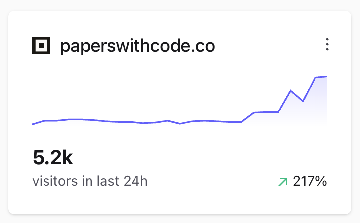
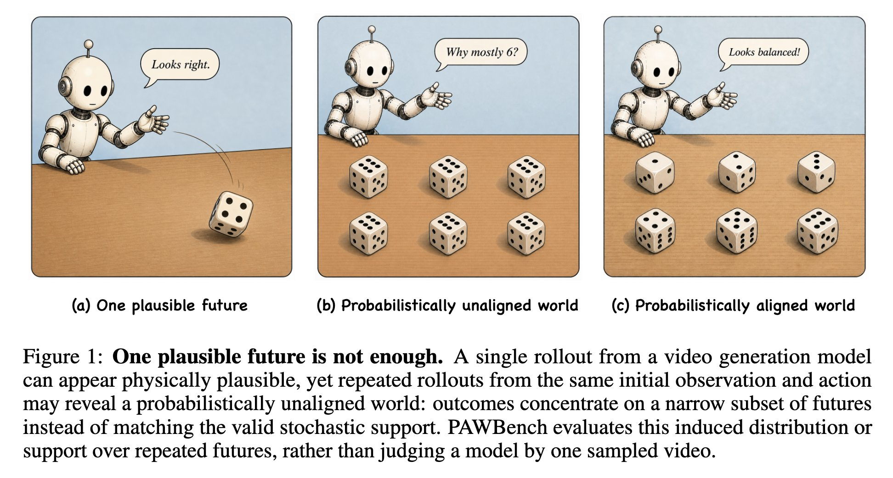
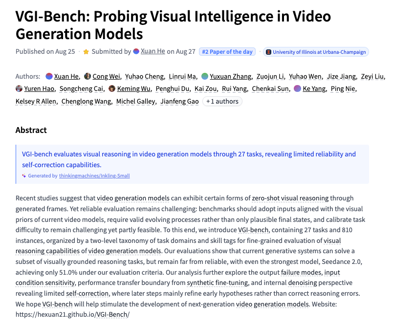

# 🐦 @_akhaliq

## 📅 August 28, 2026

> 10 post(s) archived.

---

### 🕐 14:06 UTC · @_akhaliq

> hockey-stick growth @Thom_Wolf Congrats on hitting $1bn annualised run rate

🔗 [View original post](https://x.com/Thom_Wolf/status/2093339361110552754)

---

### 🕐 13:28 UTC · @_akhaliq

> You can try out GLM-5.3 Flash with High reasoning on https://paperswithcode.co/chat, example below Working on improving the latency, currently using @baseten as it&apos;s the fastest provider on @huggingface P.S. Find all providers here https://huggingface.co/inference/models?model=zai-org/GLM-5.3-Flash Media GLM 5.3 flash on high effort is perfect, not too verbose and still correct. I think the best model possible (if you can run it locally). Very comparable to opus 4.8

🔗 [View original post](https://x.com/NielsRogge/status/2093329958064022011)

---

### 🕐 12:19 UTC · @_akhaliq

> Thanks @_akhaliq for sharing our work! How intelligent is your video generation model? Video generators are emerging as backbones for World Action Models (WAMs). VGI-Bench probes the reasoning and action-relevant priors they encode across 27 tasks and 810 instances. http://hexuan21.github.io/VGI-Bench/ Media VGI-Bench Probing Visual Intelligence in Video Generation Models paper: https://huggingface.co/papers/2608.19583

🔗 [View original post](https://x.com/CongWei1230/status/2093312577279267313)

---

### 🕐 12:09 UTC · @_akhaliq

> someone trained microduck to do somersaults 😭 Media

🔗 [View original post](https://x.com/ClementDelangue/status/2093309872733315301)

---

### 🕐 11:42 UTC · @_akhaliq

> that&apos;s ducking 1B ARR! 📈 we&apos;ve ended at over $2.6M of Microducks ordered in the first 24h

🔗 [View original post](https://x.com/n0mad_0/status/2093303238581706946)

---

### 🕐 11:13 UTC · @_akhaliq

> we&apos;ve ended at over $2.6M of Microducks ordered in the first 24h we&apos;ve just passed $1,000,000 in sales for Microduck

🔗 [View original post](https://x.com/Thom_Wolf/status/2093295950605279501)

---

### 🕐 11:02 UTC · @_akhaliq

> Seeing a major spike in users on Papers with Code What&apos;s happening??

🔗 [View original post](https://x.com/NielsRogge/status/2093293041905799433)

---

### 🕐 10:58 UTC · @_akhaliq

> One plausible future is not enough. A video model may generate a convincing die roll, yet produce the same few outcomes again and again. Our new paper asks a simple question: Does the model capture not only what can happen, but how often? Introducing PAWBench 🧵

🔗 [View original post](https://x.com/RisingSayak/status/2093292164059206008)

---

### 🕐 07:33 UTC · @_akhaliq

> Welcome to your new simulation Microduck. Media

🔗 [View original post](https://x.com/Escapation/status/2093240611008823621)

---

### 🕐 01:50 UTC · @_akhaliq

> VGI-Bench Probing Visual Intelligence in Video Generation Models paper: https://huggingface.co/papers/2608.19583

🔗 [View original post](https://x.com/_akhaliq/status/2093154284095295685)

---
