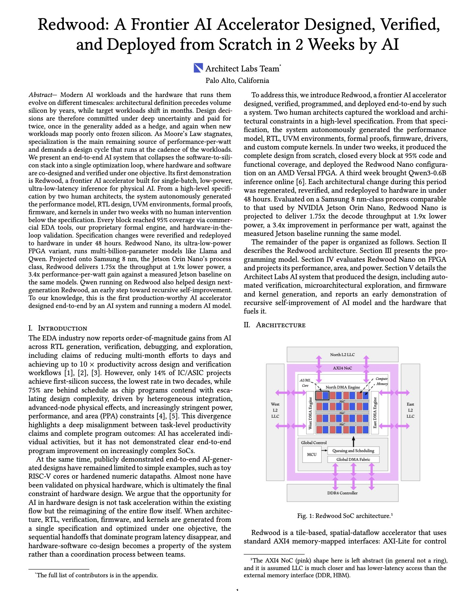

# 🐦 @dair_ai

## 📅 August 28, 2026

> 3 post(s) archived.

---

### 🕐 17:00 UTC · @dair_ai

> Things getting wild in automated systems engineering. This new work claims to build an AI system that designed and deployed a frontier accelerator. Two human architects wrote the hardware specification, and an AI system generated everything below it. Performance model, RTL, UVM verification environments, formal proofs, firmware, and kernels, all in under TWO weeks with no human intervention below the spec. Every block reached 95 percent coverage through commercial EDA tools, a proprietary formal engine, and hardware-in-the-loop validation. The resulting accelerator, Redwood, targets single-batch low-latency inference. Projected onto Samsung 8nm it delivers 1.75x the throughput at 1.9x lower power against a measured Jetson Orin Nano, a 3.4x gain in performance per watt. The FPGA variant runs multi-billion-parameter Llama and Qwen models. They claim that it takes 48 hours for a specification change to reverify and redeploy to hardware. Paper: https://arxiv.org/abs/2608.26418 Chat with Paper: https://academy.dair.ai/papers/an-ai-system-designed-and-deployed-a-frontier-accelerator-2608.26418

🔗 [View original post](https://x.com/dair_ai/status/2093383220041753042)

---

### 🕐 14:50 UTC · @dair_ai

> The DeepSeek harness is engineering at its finest. 202K stars on GitHub. Damn! Clearly, they built this harness with future AI needs and capabilities in mind. Everything is a plugin and customizable, which is exactly how harnesses of the future need to be.

🔗 [View original post](https://x.com/omarsar0/status/2093350462229487760)

---

### 🕐 13:10 UTC · @dair_ai

> Impressive new work from Google DeepMind showing real-world applications of agents for scientific research. Impressive new paper from Google DeepMind. (bookmark it) It takes Co-Scientist out of simulation and into real-world experiments. A summary of the results: In computer science, it found an inference-time scaling architecture that beat six frontier models on HealthBench Hard and P…

🔗 [View original post](https://x.com/dair_ai/status/2093325277585641804)

---
