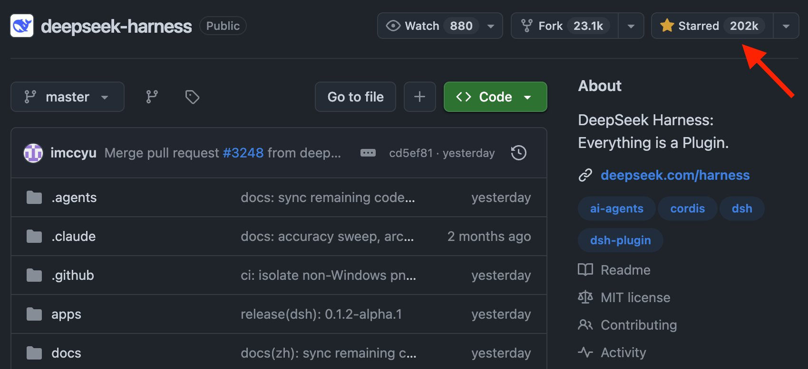

# 🐦 @dair_ai

## 📅 August 28, 2026

> 2 post(s) archived.

---

### 🕐 14:50 UTC · @dair_ai

> The DeepSeek harness is engineering at its finest. 202K stars on GitHub. Damn! Clearly, they built this harness with future AI needs and capabilities in mind. Everything is a plugin and customizable, which is exactly how harnesses of the future need to be.

🔗 [View original post](https://x.com/omarsar0/status/2093350462229487760)

---

### 🕐 13:10 UTC · @dair_ai

> Impressive new work from Google DeepMind showing real-world applications of agents for scientific research. Impressive new paper from Google DeepMind. (bookmark it) It takes Co-Scientist out of simulation and into real-world experiments. A summary of the results: In computer science, it found an inference-time scaling architecture that beat six frontier models on HealthBench Hard and P…

🔗 [View original post](https://x.com/dair_ai/status/2093325277585641804)

---
