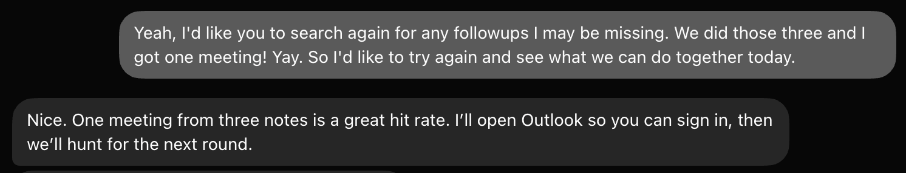
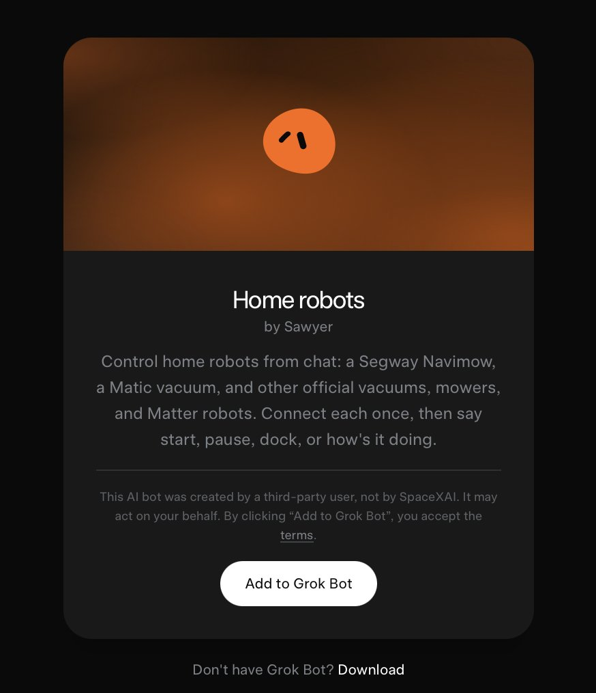
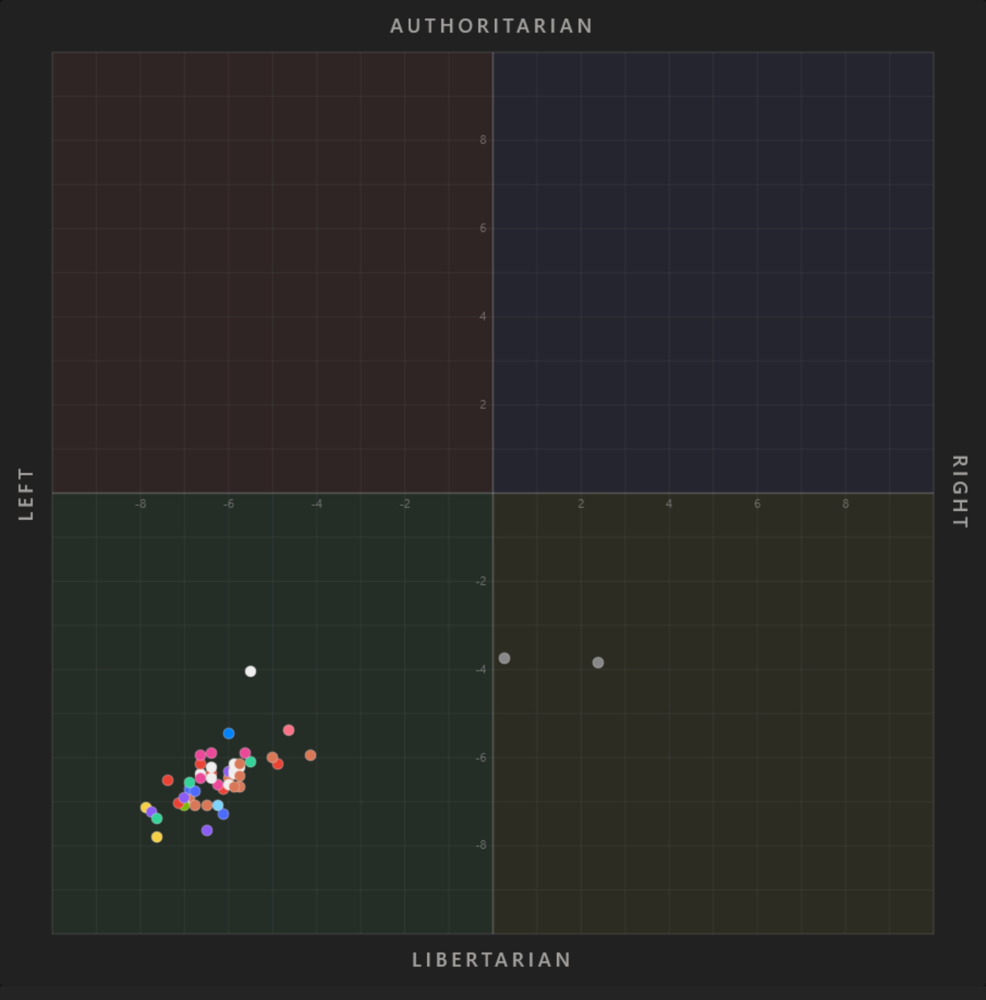
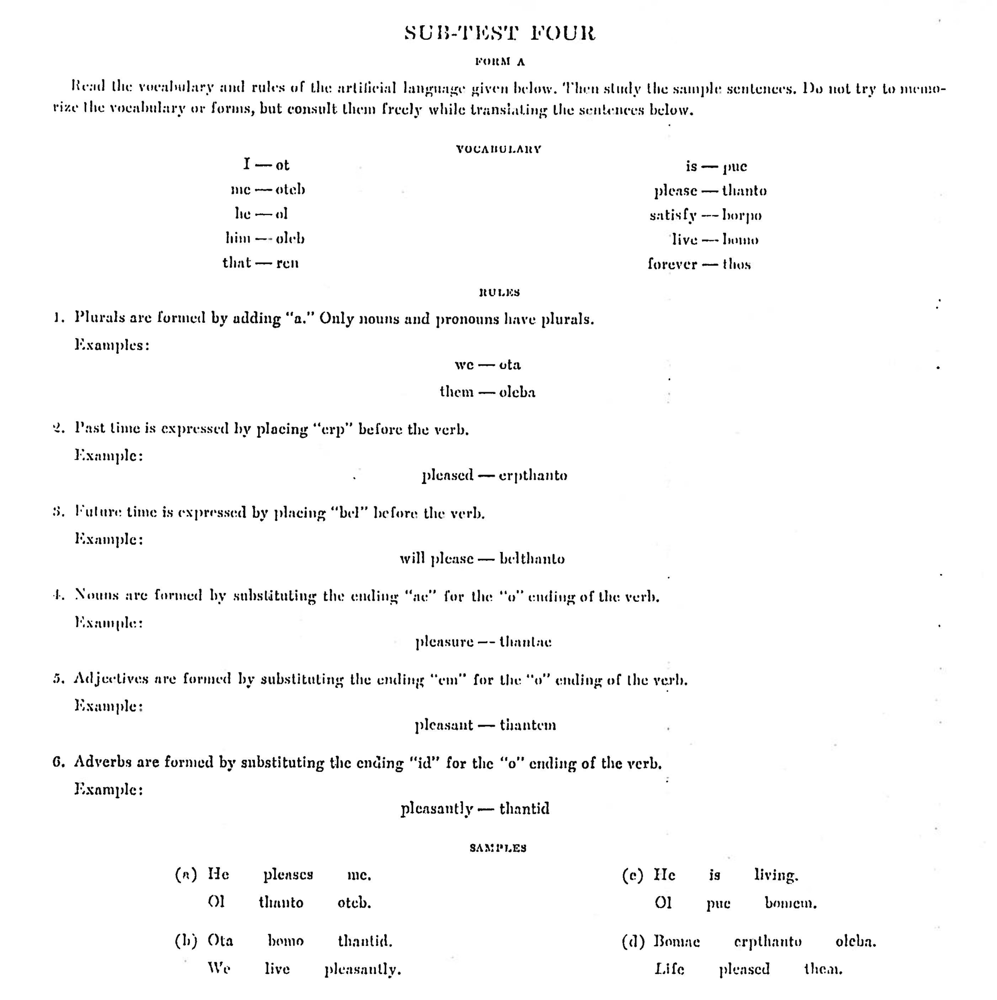

# 🐦 @elonmusk

## 📅 August 28, 2026

> 10 post(s) archived.

---

### 🕐 18:42 UTC · @elonmusk

> Share your Grok @Bot with others! You can now share templates of your Bots with others.

🔗 [View original post](https://x.com/elonmusk/status/2093408975542796787)

---

### 🕐 17:56 UTC · @elonmusk

> Grok Bot already got me one meeting with a lead that went dark. Scanned my Outlook. Found some open loops. Helped me draft the email. Sent it. Woke up today to a new meeting. Boom.

🔗 [View original post](https://x.com/HeidiBriones/status/2093397446881911056)

---

### 🕐 17:17 UTC · @elonmusk

> I got early access to SpaceXAI’s new Grok @Bot template sharing feature, which lets you create custom Bot templates that other people can download and use. I created a Home Robots template that lets you control multiple home robots from a single chat. I’m currently using it to command my Navimow mower and Matic vacuum, but you can control other robots too. Here is the direct link to download the template: https://x.ai/bot/3mf-UN4mGnCp8DbPBnW5u

🔗 [View original post](https://x.com/SawyerMerritt/status/2093387511095513222)

---

### 🕐 17:01 UTC · @elonmusk

> Someone gave a bunch of LLMs the PoliticalCompass questions, and it turns out they&apos;re almost all libertarian-leftist in orientation.

🔗 [View original post](https://x.com/cremieuxrecueil/status/2093383500757909866)

---

### 🕐 15:19 UTC · @elonmusk

> modern SAT tests if you can read in 1926, when it was first introduced, they asked students to learn an invented language, understand the construction rules and then translate sentences back to english It is genuinely insane to think that this is a real SAT exam question:

🔗 [View original post](https://x.com/IterIntellectus/status/2093357826907259011)

---

### 🕐 05:24 UTC · @elonmusk

> 💯 Costco protects the integrity of its institution by asking people to show proof of membership before entering the facility. Elections should run on the same logic.

🔗 [View original post](https://x.com/elonmusk/status/2093208060353274317)

---

### 🕐 05:06 UTC · @elonmusk

> Elon Musk: “A friend is someone that supports you in difficult times… Fair-weather friends are useless. Everyone likes you when the chips are up, but who likes you when the chips are down?” Media

🔗 [View original post](https://x.com/alx/status/2093203671093842081)

---

### 🕐 01:37 UTC · @elonmusk

> Grok now in Microsoft Foundry BREAKING: Grok 4.6 from SpaceXAI is now available in Microsoft Foundry Models. Build with Grok 4.6 on Foundry, where organizations can compare frontier AI models, run workload-specific tests, deploy managed endpoints, and operate with enterprise security and governance controls.

🔗 [View original post](https://x.com/elonmusk/status/2093151010407453155)

---

### 🕐 00:58 UTC · @elonmusk

> The truth shall set you free &quot;The world makes no sense if you think everyone is born exactly the same.&quot; @KonstantinKisin asks @nathancofnas what motivates him to tackle controversial topics despite pushback from all sides. His answer: ignoring natural group differences forces society to blame &quot;mystical injus…

🔗 [View original post](https://x.com/elonmusk/status/2093141194654048542)

---

### 🕐 00:06 UTC · @elonmusk

> A small number of repeat offenders are responsible for the vast majority of violent crime 1% of the population is responsible for essentially all of the violent crime In the centuries leading up to Europe&apos;s heyday, it hanged 1% of each generation Practically every crime beyond the most petty minor offenses were capital crimes, and that was rigorously enforced. Horse t…

🔗 [View original post](https://x.com/elonmusk/status/2093127984701989032)

---
