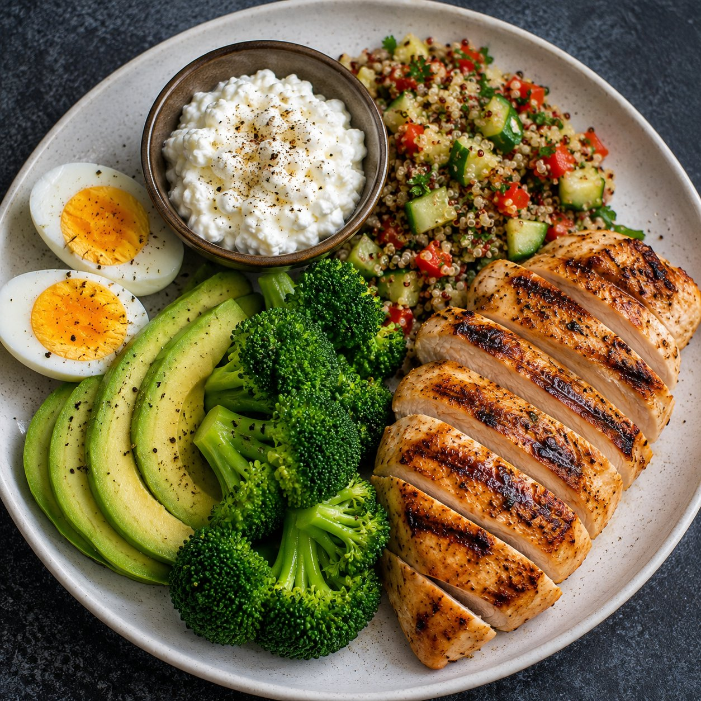
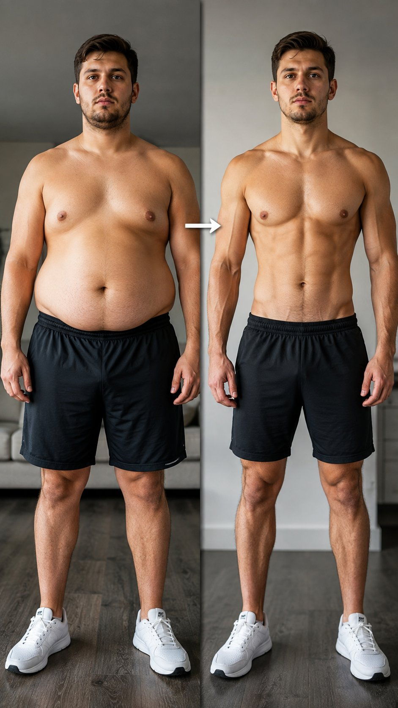

# 🐦 @Unlockyourlife_

## 📅 August 29, 2026

> 42 post(s) archived.

---

### 🕐 17:59 UTC · @Unlockyourlife_

> Belly fat isn&apos;t a willpower problem. It&apos;s a hormone problem. Fix sleep, stress, and blood sugar - and the scale starts moving on its own. Which one are YOU actually working on right now - diet, sleep, stress, or movement?

🔗 [View original post](https://x.com/_fitnesshub/status/2093760501121466572)

---

### 🕐 17:59 UTC · @Unlockyourlife_

> 4. Move smarter, not just harder - Strength training 2-3x/week - Daily walking (aim 8k+ steps) - Limit long sitting stretches Muscle improves insulin sensitivity, and walking lowers cortisol - both hit belly fat from different angles than cardio alone.

🔗 [View original post](https://x.com/_fitnesshub/status/2093760497812115930)

---

### 🕐 17:59 UTC · @Unlockyourlife_

> 3. Lower your cortisol ✨ Daily walks (even 15 mins) ✨ Breathwork or meditation ✨ Limit caffeine after noon Chronic stress keeps cortisol elevated, and cortisol specifically encourages fat storage around the belly - not just anywhere

🔗 [View original post](https://x.com/_fitnesshub/status/2093760489377374438)

---

### 🕐 17:59 UTC · @Unlockyourlife_

> 2. Fix your sleep • 7-9 hours consistently • Same sleep/wake time daily • No screens 30 min before bed Poor sleep raises cortisol and disrupts hunger hormones (ghrelin/leptin) - which is why tired people crave junk food more

🔗 [View original post](https://x.com/_fitnesshub/status/2093760474341126603)

---

### 🕐 17:59 UTC · @Unlockyourlife_

> 1. Eat to balance blood sugar • Protein with every meal • Fiber-rich veggies • Cut liquid sugar (soda, juice) • Fewer refined carbs Stable blood sugar means stable insulin - and insulin spikes are one of the biggest drivers of stored belly fat.

🔗 [View original post](https://x.com/_fitnesshub/status/2093760461376241857)

---

### 🕐 17:59 UTC · @Unlockyourlife_

> Here&apos;s 5 real causes of stubborn belly fat (not just calories): - High cortisol (chronic stress) - Insulin resistance - Poor sleep quality - Alcohol intake - Slow, sedentary lifestyle Calories matter, but your hormones decide where that fat gets stored. That&apos;s why two people eating the same can look completely different. But there&apos;s always a solution 👇

🔗 [View original post](https://x.com/_fitnesshub/status/2093760448092832054)

---

### 🕐 17:59 UTC · @Unlockyourlife_

> I did everything right - diet, gym, cutting carbs - and my belly fat barely moved. Then I found out why. Here&apos;s what&apos;s actually going on🧵

🔗 [View original post](https://x.com/_fitnesshub/status/2093760444284719216)

---

### 🕐 15:37 UTC · @Unlockyourlife_

> 4. Medical Help: When home remedies aren&apos;t enough • Minoxidil • Finasteride • Sleep &amp; stress management These are proven, doctor-backed options for serious thinning. Don&apos;t spend years hoping oils alone will fix what needs real treatment.

🔗 [View original post](https://x.com/FitnessDr_/status/2093724630515122528)

---

### 🕐 15:37 UTC · @Unlockyourlife_

> Bald isn&apos;t the enemy here. Ignorance is. Know your actual cause. Act before it&apos;s advanced. Stay consistent - this isn&apos;t a one-week fix.

🔗 [View original post](https://x.com/FitnessDr_/status/2093724632184422411)

---

### 🕐 15:37 UTC · @Unlockyourlife_

> 2. Oils that may help • Rosemary oil • Coconut oil • Castor oil Rosemary oil has some real evidence behind it for regrowth. The others mainly nourish and protect strands. None are magic, but consistency helps.

🔗 [View original post](https://x.com/FitnessDr_/status/2093724626127851819)

---

### 🕐 15:37 UTC · @Unlockyourlife_

> 3. Scalp massage • 5-10 minutes daily • Use fingertips, not nails • Best combined with oil This simple habit boosts blood flow to your follicles. More circulation means more nutrients reaching the roots that need them most.

🔗 [View original post](https://x.com/FitnessDr_/status/2093724628246044842)

---

### 🕐 15:37 UTC · @Unlockyourlife_

> 5 real causes of hair loss (not just the one you think): • Genetics • Chronic stress • Poor scalp circulation • Nutrient deficiencies • Heat &amp; harsh styling Genetics loads the gun, but stress, poor circulation, and diet often speed up the damage. Most guys only blame #1 and ignore the rest. These are possible solutions that may help regain lost hair 👇

🔗 [View original post](https://x.com/FitnessDr_/status/2093724622541725979)

---

### 🕐 15:37 UTC · @Unlockyourlife_

> 1. Feed your follicles • Eggs • Spinach • Nuts &amp; seeds • Sweet potatoes These give your scalp the protein, iron, zinc, and vitamins it needs to keep follicles active. Your hair is a living organ - starve it

🔗 [View original post](https://x.com/FitnessDr_/status/2093724624286630370)

---

### 🕐 15:37 UTC · @Unlockyourlife_

> Baldness isn&apos;t just genetics. Most guys get this wrong - and it&apos;s quietly costing them years of hair they could&apos;ve kept, without them even realizing it Here&apos;s what&apos;s actually going on🧵

🔗 [View original post](https://x.com/FitnessDr_/status/2093724619882533206)

---

### 🕐 14:56 UTC · @Unlockyourlife_

> This Nitroglycerin Is Scary! Media

🔗 [View original post](https://x.com/sciencepathx/status/2093714519264526461)

---

### 🕐 14:35 UTC · @Unlockyourlife_

> IT_S so SIMPLE 😱 You_ll want to repeat it 😱 Media

🔗 [View original post](https://x.com/Smart_Tipsx/status/2093709099544256939)

---

### 🕐 14:30 UTC · @Unlockyourlife_

> How to Make Rechargeable 9V Li-lon Battery! 🔋 Media

🔗 [View original post](https://x.com/samx_reels/status/2093707942994325664)

---

### 🕐 14:15 UTC · @Unlockyourlife_

> How to Turn iPhone XR To iPhone 17 Pro! Media

🔗 [View original post](https://x.com/_Brainboxx/status/2093704007759921349)

---

### 🕐 13:54 UTC · @Unlockyourlife_

> You are bored because you have no side quests. Life isn’t supposed to be: work → phone → bed → repeat. You need experiences that make life feel bigger. Here are 20 side quests every man should complete:

🔗 [View original post](https://x.com/Mastering_life_/status/2093698812510638524)

---

### 🕐 10:48 UTC · @Unlockyourlife_

> Watch How the earth sounds! Media

🔗 [View original post](https://x.com/sciencepathx/status/2093652061325828392)

---

### 🕐 10:41 UTC · @Unlockyourlife_

> Imagine this Happens to you while Driving! Media

🔗 [View original post](https://x.com/Smart_Tipsx/status/2093650287823135018)

---

### 🕐 10:39 UTC · @Unlockyourlife_

> Amazing Multi-Level Candle 🕯️ Media

🔗 [View original post](https://x.com/samx_reels/status/2093649692043178012)

---

### 🕐 10:35 UTC · @Unlockyourlife_

> No one will believe that this is ceramic tile… a breathtaking 3D illusion! Media

🔗 [View original post](https://x.com/_Brainboxx/status/2093648616950841745)

---

### 🕐 07:47 UTC · @Unlockyourlife_

> 5. Banana

🔗 [View original post](https://x.com/FitnessDr_/status/2093606349858914629)

---

### 🕐 07:47 UTC · @Unlockyourlife_

> 4. Green Tea

🔗 [View original post](https://x.com/FitnessDr_/status/2093606341453508632)

---

### 🕐 07:47 UTC · @Unlockyourlife_

> 3. Papaya

🔗 [View original post](https://x.com/FitnessDr_/status/2093606333547258347)

---

### 🕐 07:46 UTC · @Unlockyourlife_

> 2. Pineapple

🔗 [View original post](https://x.com/FitnessDr_/status/2093606324906983642)

---

### 🕐 07:46 UTC · @Unlockyourlife_

> Fix your GUT with food not PILLS 1. Fennel Tea

🔗 [View original post](https://x.com/FitnessDr_/status/2093606316392509678)

---

### 🕐 07:37 UTC · @Unlockyourlife_

> You need to stop confusing being chosen with being valued. Someone can choose you because you&apos;re convenient, attractive, successful or available. Being valued is different. It shows up in how they treat you when they don&apos;t need anything from you. Pay attention to that difference.

🔗 [View original post](https://x.com/Masculinjournal/status/2093603895498915857)

---

### 🕐 07:37 UTC · @Unlockyourlife_

> What If You Were Born On The Moon 🤔 Media

🔗 [View original post](https://x.com/sciencepathx/status/2093603862372348259)

---

### 🕐 07:27 UTC · @Unlockyourlife_

> Smart Idea With a Cotton Swab 🔑 Media

🔗 [View original post](https://x.com/Smart_Tipsx/status/2093601501113422049)

---

### 🕐 07:25 UTC · @Unlockyourlife_

🔗 [View original post](https://x.com/_fitnesshub/status/2093601028084027477)

---

### 🕐 07:25 UTC · @Unlockyourlife_

🔗 [View original post](https://x.com/_fitnesshub/status/2093601020769083580)

---

### 🕐 07:25 UTC · @Unlockyourlife_

🔗 [View original post](https://x.com/_fitnesshub/status/2093601013810823511)

---

### 🕐 07:25 UTC · @Unlockyourlife_

🔗 [View original post](https://x.com/_fitnesshub/status/2093601005103427781)

---

### 🕐 07:25 UTC · @Unlockyourlife_

🔗 [View original post](https://x.com/_fitnesshub/status/2093600998430216251)

---

### 🕐 07:25 UTC · @Unlockyourlife_

> How To Change Your Life In 30 Days

🔗 [View original post](https://x.com/_fitnesshub/status/2093600991014781219)

---

### 🕐 07:10 UTC · @Unlockyourlife_

> Hidden tricks that cell phone manufacturers don’t want you to know! Media

🔗 [View original post](https://x.com/samx_reels/status/2093597067633406211)

---

### 🕐 07:02 UTC · @Unlockyourlife_

> French Macaron Tower

🔗 [View original post](https://x.com/Elitedelicacy/status/2093595222739423366)

---

### 🕐 07:02 UTC · @Unlockyourlife_

> 🤯 The dirt hiding inside your washing machine will shock you! 😳🫧 Media

🔗 [View original post](https://x.com/_Brainboxx/status/2093595061338439772)

---

### 🕐 07:02 UTC · @Unlockyourlife_

> Thermal Stress.

🔗 [View original post](https://x.com/BioLifex/status/2093595012713828749)

---

### 🕐 07:01 UTC · @Unlockyourlife_

> Straight-Arm Lat Pulldowns.

🔗 [View original post](https://x.com/_alphafit/status/2093594878101901428)

---
