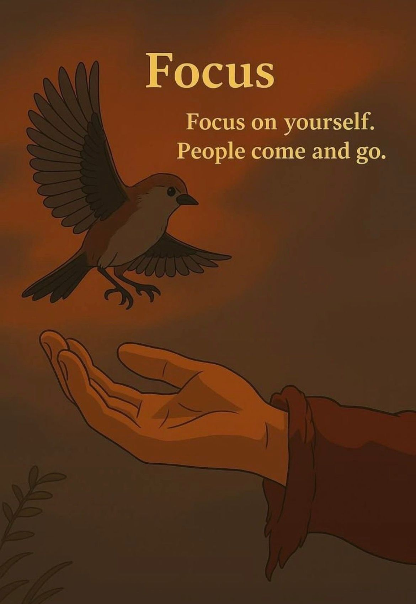

# 🐦 @Wise1Philosophy

## 📅 August 29, 2026

> 28 post(s) archived.

---

### 🕐 09:30 UTC · @Wise1Philosophy

🔗 [View original post](https://x.com/Ant_Philosophy/status/2093632320523608070)

---

### 🕐 09:30 UTC · @Wise1Philosophy

> Hi, HOW DO I GET ALL THIS CORTISOL OUT OF MY BODY. Asking for every woman over 40 with a puffy face, a belly that won&apos;t move, and a 3am wake-up she didn&apos;t sign up for. Here is the actual answer:

🔗 [View original post](https://x.com/TinaaDeJong/status/2093632251137495128)

---

### 🕐 09:23 UTC · @Wise1Philosophy

> Your dog doesn&apos;t sleep in your bed because they&apos;re spoiled or clingy. They do it for three reasons most owners never think about. And the third one might break your heart.. 💔

🔗 [View original post](https://x.com/Manifest_Lord/status/2093630732996624413)

---

### 🕐 09:23 UTC · @Wise1Philosophy

> Mother-son Bucket List for the Years That Go By Too Fast.. Must do things for every MOM.. 👇

🔗 [View original post](https://x.com/scotti_brooks/status/2093630529438687351)

---

### 🕐 09:17 UTC · @Wise1Philosophy

> Fatty liver now affects 1 in 3 adults. It destroys your metabolism, tracks with diabetes, and increases your risk of heart disease. Here is how to walk it back: 1. Eat all the sweet potatoes you want.

🔗 [View original post](https://x.com/RafaelNasriX/status/2093628980859682903)

---

### 🕐 09:08 UTC · @Wise1Philosophy

> I was 30lbs overweight with a beer belly and double chin &amp; my goal was to hit 13% body fat before my wedding. This is exactly what I did: 1. Cut out alcohol as far as I could

🔗 [View original post](https://x.com/MagnusLindbrg/status/2093626716417937904)

---

### 🕐 09:07 UTC · @Wise1Philosophy

> Jim Carrey said: “I&apos;m 63, if I could be 25 again, here is what I&apos;d tell myself” 1. Action is what beats anxiety.

🔗 [View original post](https://x.com/CoachLucHerrera/status/2093626463040004183)

---

### 🕐 09:00 UTC · @Wise1Philosophy

> Lymphatic drainage is the fastest way to get rid of a bloating belly, facial fat, and reset your body&apos;s natural detox system. Here are 7 simple fixes to improve lymphatic flow:

🔗 [View original post](https://x.com/mind_and_beauty/status/2093624712433926355)

---

### 🕐 08:55 UTC · @Wise1Philosophy

> A man who studied happy people for 40 years told me the 8 things that decide your quality of life. 1. The distance between your house and your job.

🔗 [View original post](https://x.com/HeyKimChong/status/2093623446718787880)

---

### 🕐 08:50 UTC · @Wise1Philosophy

> Your blood sugar ages you faster than smoking and junk food. It wrecks sleep, stalls fat loss, drops nitric oxide, and sits under fatty liver and diabetes. Here is the simple fix: 1. Do not walk 10,000 steps Media

🔗 [View original post](https://x.com/CoachJulianNiko/status/2093622210867142797)

---

### 🕐 08:45 UTC · @Wise1Philosophy

> If you want to avoid a heart attack, memory loss and burning out before your kids leave home, especially past 40: Here are 7 signs cortisol is quietly wrecking your body: 1. Waking at 3 to 4 AM.

🔗 [View original post](https://x.com/JasperKasparov/status/2093620923517825228)

---

### 🕐 08:40 UTC · @Wise1Philosophy

> Sleep is the most powerful medicine there is. It lifts memory, recovery, fat loss, and even helps with anxiety. Here is how to improve it in 7 simple steps: 1. Do not sleep 8 hours. Media

🔗 [View original post](https://x.com/ClaraBrooksjz/status/2093619690581180864)

---

### 🕐 08:30 UTC · @Wise1Philosophy

🔗 [View original post](https://x.com/Mindsthatbuild/status/2093617183569903783)

---

### 🕐 08:01 UTC · @Wise1Philosophy

🔗 [View original post](https://x.com/Wise1Philosophy/status/2093609857811141003)

---

### 🕐 07:48 UTC · @Wise1Philosophy

> 7 weird signs your body is genuinely healthy. Your body sends quiet signals that the systems keeping you alive are firing on all cylinders. Number one will surprise you the most:

🔗 [View original post](https://x.com/RasmusNorbergg/status/2093606579103035495)

---

### 🕐 07:44 UTC · @Wise1Philosophy

> A Stanford neuroscientist admitted: &quot;Your belly stores cortisol waste. Kill it with this one habit before you sleep. Your life will change.&quot; Here is the 9 minute fix:

🔗 [View original post](https://x.com/Marc0sRomano/status/2093605572453224883)

---

### 🕐 07:30 UTC · @Wise1Philosophy

🔗 [View original post](https://x.com/Daily__wisdom_/status/2093602081642832056)

---

### 🕐 07:00 UTC · @Wise1Philosophy

🔗 [View original post](https://x.com/apex_mentality_/status/2093594681527398843)

---

### 🕐 06:36 UTC · @Wise1Philosophy

> Cortisol = belly fat. Cortisol = a puffy face. Cortisol = hair loss. Cortisol = collagen gone. Cortisol = libido gone. Cortisol = sleep wrecked. One hormone. Every symptom. Here is what actually fixes it:

🔗 [View original post](https://x.com/HeyKimChong/status/2093588459462308346)

---

### 🕐 06:30 UTC · @Wise1Philosophy

🔗 [View original post](https://x.com/yeti_mind/status/2093586976620384493)

---

### 🕐 06:25 UTC · @Wise1Philosophy

> 🚨BREAKING: Claude can now run Stock Market research like a top consulting firm (for free). Here are 10 Claude prompts that replace $100K/year stock analysts (Save for later)

🔗 [View original post](https://x.com/heyalexmoore/status/2093585761971175522)

---

### 🕐 06:00 UTC · @Wise1Philosophy

🔗 [View original post](https://x.com/Life__Mastery/status/2093579495575875706)

---

### 🕐 04:35 UTC · @Wise1Philosophy

> Your blood sugar is aging you faster than alcohol and smoking. It ruins sleep, fat loss, destroys insulin sensitivity, and causes fatty liver &amp; diabetes. Here’s how to fix it naturally with no medication: 1. Don’t walk 10,000 steps Media

🔗 [View original post](https://x.com/CoachWillStone/status/2093558178101579973)

---

### 🕐 04:32 UTC · @Wise1Philosophy

> A heart surgeon told me something that shocked me: “There are 3 types of people who don&apos;t get heart attacks.” 1. Don&apos;t go to the toilet at 3 AM

🔗 [View original post](https://x.com/DPro_Coach/status/2093557500805317018)

---

### 🕐 04:19 UTC · @Wise1Philosophy

> A Heart doctor admitted: “There are 3 types of people who don&apos;t get heart attacks.” 1. Don&apos;t go pee at 3 AM Media

🔗 [View original post](https://x.com/_Gut_Laboratory/status/2093554216250069026)

---

### 🕐 04:19 UTC · @Wise1Philosophy

> Cortisol = Jaw clenching Cortisol = Waking up at 3 AM Cortisol = Belly fat that won&apos;t budge Cortisol = Bloated face Cortisol = No libido One hormone. Every symptom. Simple fix: 1. Ashwagandha in the morning.

🔗 [View original post](https://x.com/TheFastedState/status/2093554124386410562)

---

### 🕐 01:30 UTC · @Wise1Philosophy

🔗 [View original post](https://x.com/Ant_Philosophy/status/2093511478863110152)

---

### 🕐 01:00 UTC · @Wise1Philosophy

🔗 [View original post](https://x.com/Mindsthatbuild/status/2093504067070775301)

---
