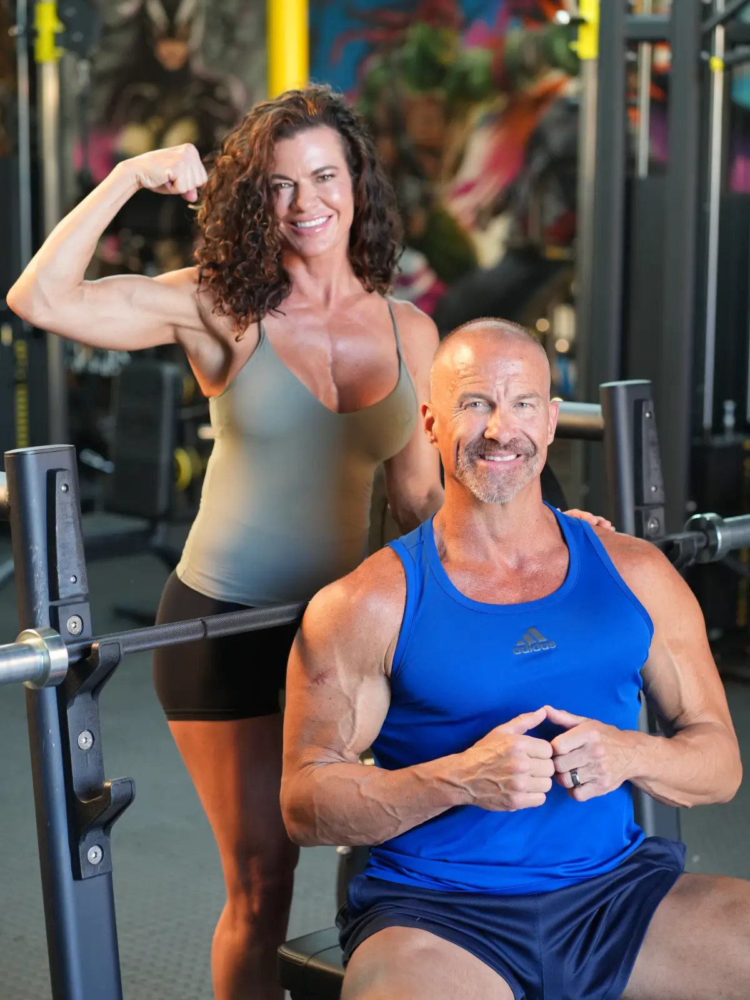
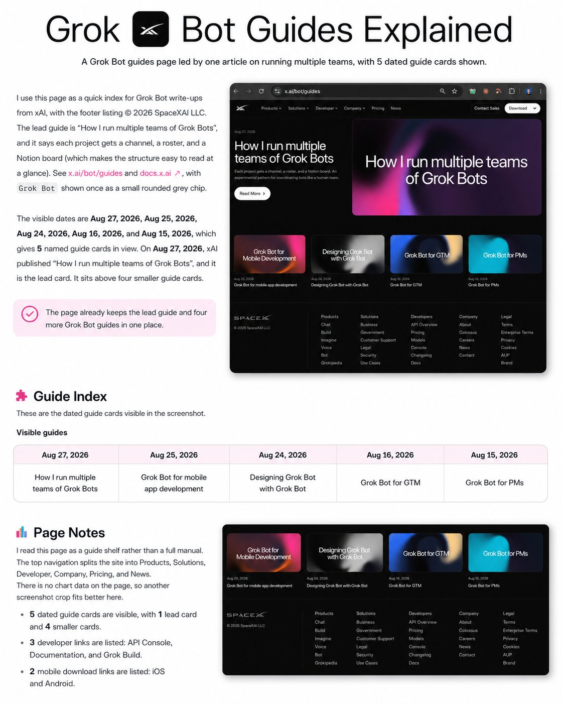
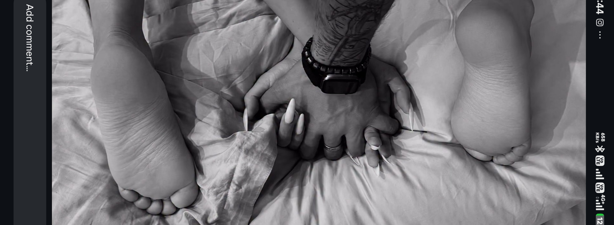
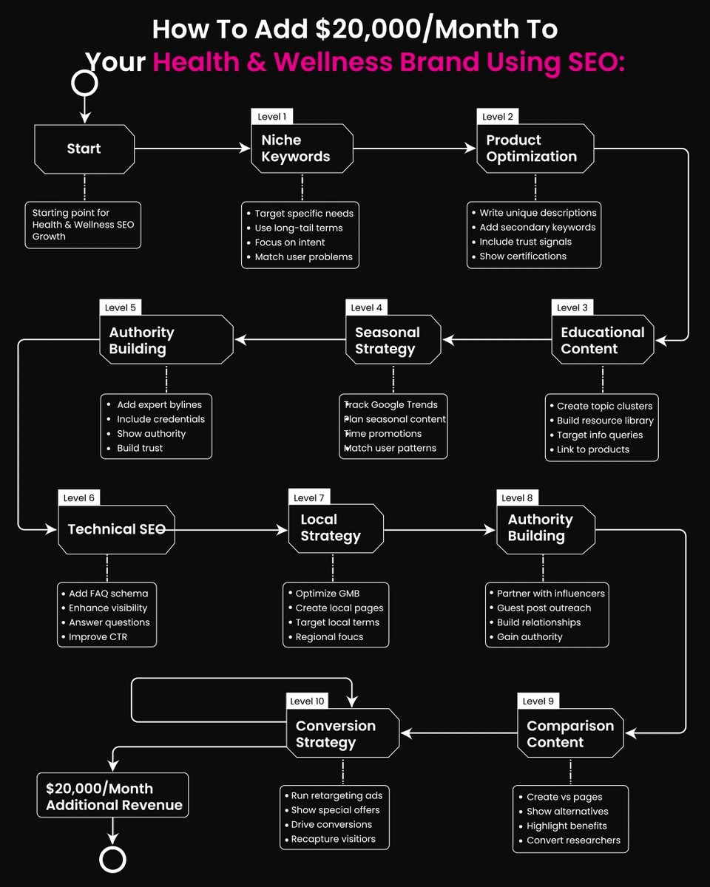
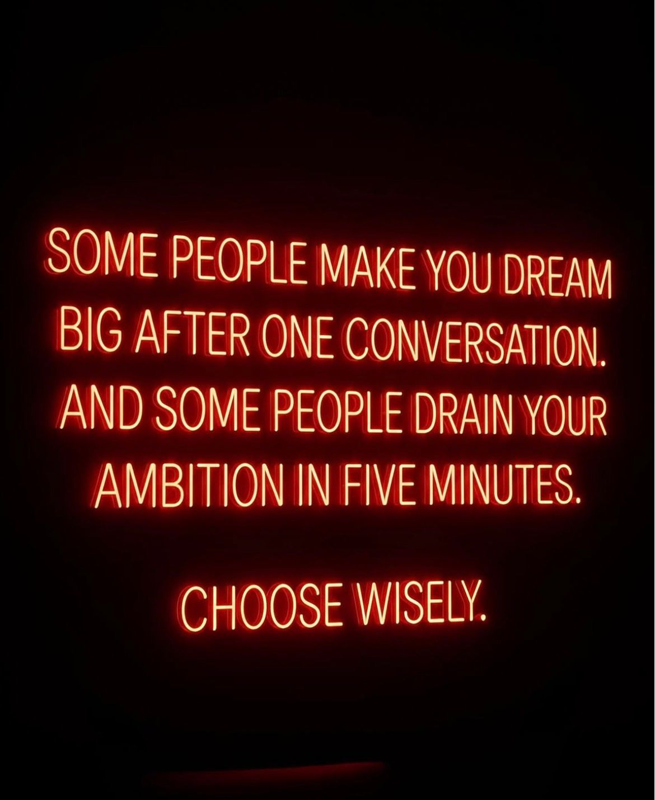
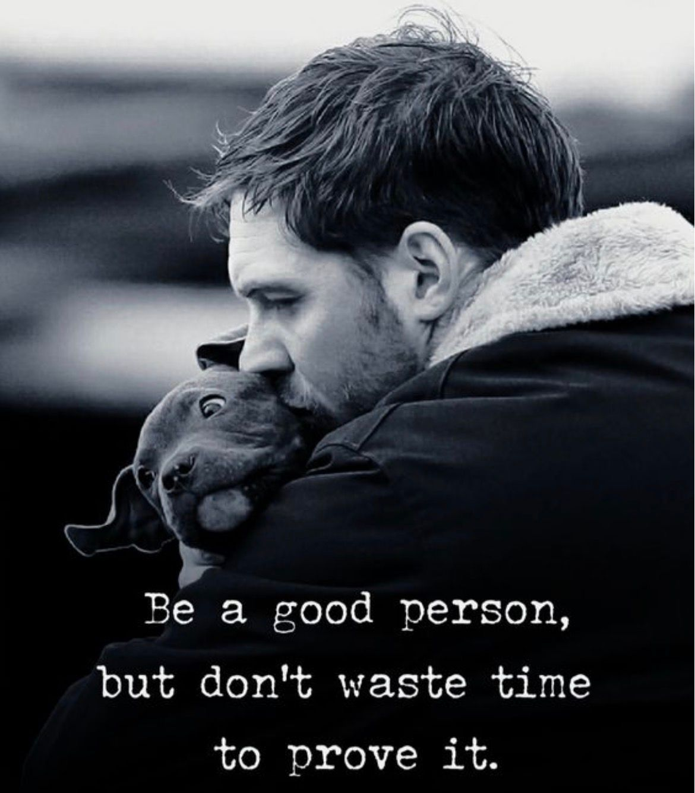
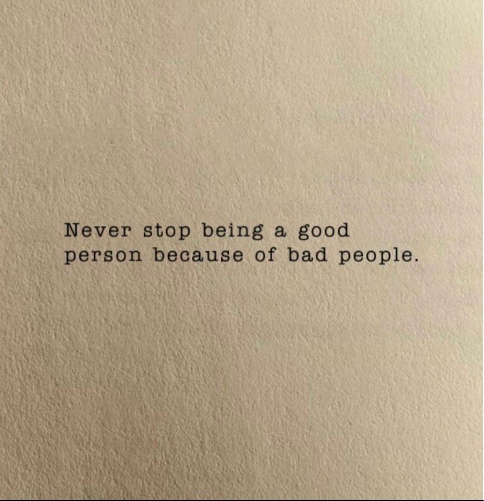
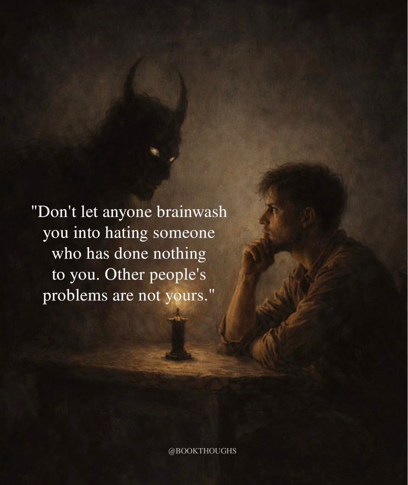
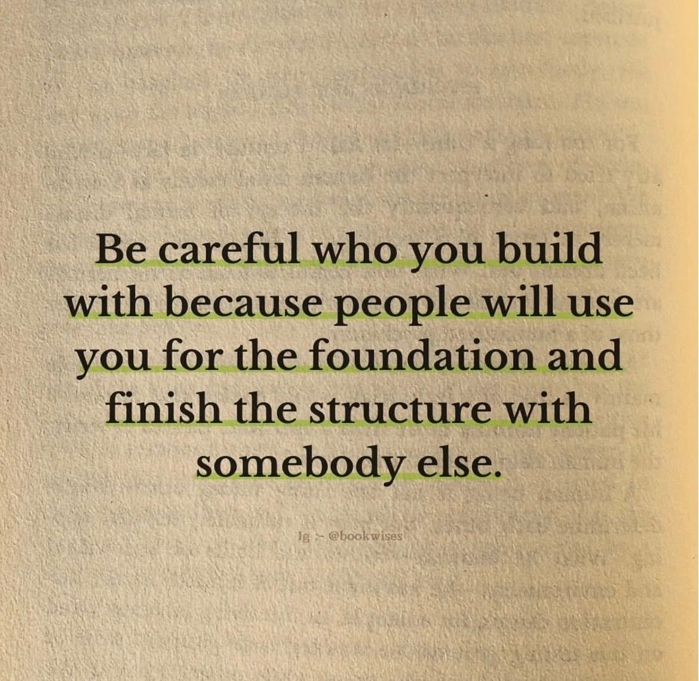
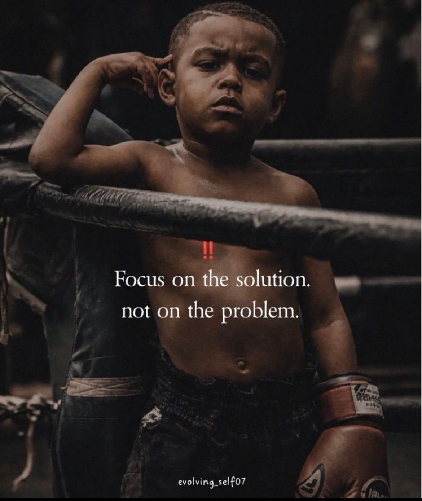

# 🐦 @Wise1Philosophy

## 📅 August 29, 2026

> 55 post(s) archived.

---

### 🕐 15:18 UTC · @Wise1Philosophy

> my 3am motivation hitting reality the next morning 💀 Media

🔗 [View original post](https://x.com/AIPandaX/status/2093720027493253224)

---

### 🕐 15:18 UTC · @Wise1Philosophy

> &quot;People: &apos;Robots are going to take over the world very soon.&apos; Robots right now:&quot; Media

🔗 [View original post](https://x.com/aibytekat/status/2093720010409889840)

---

### 🕐 15:18 UTC · @Wise1Philosophy

> bro on the right literally exploded. Media

🔗 [View original post](https://x.com/thetripathi58/status/2093719996186960051)

---

### 🕐 15:11 UTC · @Wise1Philosophy

> You can now create anything with Claude. I created an Adidas video using Vidfield MCP on claude. GPT Image 2 → cinematic storyboard Seedance 2.0 → final 15-second ad The full workflow + prompt is below 👇 Media

🔗 [View original post](https://x.com/HeyAbhishek/status/2093718063946637316)

---

### 🕐 15:09 UTC · @Wise1Philosophy

> At almost 55, I lift like I&apos;m 30. Not with more hours. Not with heavier weight. With a rule set most women are never taught.🧵 1. Train to failure, not to exhaustion. Media

🔗 [View original post](https://x.com/MindsetFreek/status/2093717647934271960)

---

### 🕐 15:01 UTC · @Wise1Philosophy

> xAI just dropped 5 Grok Bot guides and barely anyone noticed. Practical playbooks for AI teammates, written by the people who use them daily. 5 official guides below 👇

🔗 [View original post](https://x.com/socialwithaayan/status/2093715582210507073)

---

### 🕐 14:58 UTC · @Wise1Philosophy

> A bot that saves ten minutes every day beats a flashy demo that saves nothing. R.I.P. paying someone for the boring half of your work People stopped chatting with Grok Bot. They&apos;re assigning it jobs now. 8 real setups from this week: Bookmark this.

🔗 [View original post](https://x.com/Wise1Philosophy/status/2093714927831691465)

---

### 🕐 14:27 UTC · @Wise1Philosophy

> 10 S xx Secrets That Women Don&apos;t Normally Tell Us Men!! 7th is really shocking 🧵

🔗 [View original post](https://x.com/MindPatternHQ/status/2093707194273612073)

---

### 🕐 14:26 UTC · @Wise1Philosophy

> SOCIAL 17 skills turn Claude into your whole social team. Every one free, every one mine: WRITING → hook-generator, post-writer, post-scorer DESIGN → carousels, infographics, thumbnails GROWTH → profile-optimizer, analytics, niche-research Want my setup guide too? → Comment &quot;SOCIAL&quot; → F…

🔗 [View original post](https://x.com/Wise1Philosophy/status/2093706881063698938)

---

### 🕐 14:19 UTC · @Wise1Philosophy

> We’ve used Google, ChatGPT, Claude, Perplexity and broader AI search to add anywhere from $20,000/month to $100,000+/month to health and wellness brands selling supplements, fitness programs, diagnostics, skincare and protocols. In July 2026 the health and wellness niche surpassed financial services as our biggest category served by revenue generated. The health brands I see on here are great at social, decent at paid ads and operating on margins that make no sense. High CAC, constant discounts and unpredictable revenue is a tough way to make a living. So what&apos;s the lever most brands are ignoring High-intent traffic from Google, ChatGPT, Perplexity and Gemini. And if you want to know how your site ranks across Google and AI search, check here (it&apos;s free): https://seo-stuff.com/free-audit Let’s start at the top. Google and AI search both care heavily about trust. Google looks at content quality, keyword alignment, backlinks and site structure, while AI systems also look at how people talk about your brand across the web through health and science-adjacent publications, reviews, podcasts, newsletters, forums, videos and other third-party mentions. The clearer and more credible your brand appears across these sources, the easier it becomes for search and AI systems to understand and recommend it. A few useful authority plays include partnering with registered dietitians, trainers, clinicians or coaches, getting included in “Best X for Y” guides, being quoted in health newsletters and blogs, appearing on podcasts with transcripts and publishing original surveys, testing data or trend reports. If you can also earn links and mentions from domains already appearing in AI answers, even better. Now let’s talk about keywords. Broad health keywords are usually much less valuable than the exact questions people ask before making a decision. Think “what supplements help with sleep without grogginess,” “is magnesium glycinate safe to take daily,” “best protein powder for sensitive stomachs” or “what helps joint pain without NSAIDs.” Look for clear health or purchase intent, manageable difficulty and enough search demand to justify the page. These queries signal a much more specific problem than something broad like “sleep supplements.” Create one strong page for each meaningful intent and connect it directly to the relevant product. Your product pages matter just as much. A product page is a trust document for humans and machines. It should clearly explain the outcome, who the product is and is not for, what each ingredient does, where those ingredients come from, how the product should be used, relevant safety information and what customers have experienced. A headline like “Feel Like Yourself Again” may sound nice, but “Magnesium glycinate supplement for adults looking to support sleep without melatonin” tells buyers and search systems much more. Next, build topic coverage around the problems your products solve. For example, a sleep-health cluster could include a complete guide to better sleep, content about causes of poor sleep quality, explanations of different magnesium types, natural sleep-support options and product-specific comparisons. Each page should connect naturally to the relevant hub, product and supporting content, and the goal is to show that your brand understands the category deeply rather than simply selling a product inside it. Comparison and “best of” queries are especially important because people ask AI tools to compare health products constantly. That could include “best magnesium for sleep in 2026,” “[Your Brand] vs alternatives” or “is [Brand Name] legit?” Use direct answers, clear sections, real photos, customer proof, balanced comparisons and a clear verdict. Mention competitors where relevant, but connect readers back to useful pages on your own site. You also need to control branded search. Create useful pages around questions like “is [Brand Name] legit,” “[Brand Name] reviews” and “how [Brand Name] products work.” People are asking these questions whether you create the pages or not, and if your own site does not provide clear answers, forums, review sites and competitors may end up defining the brand for you. Do not ignore technical SEO either. Your site should load quickly, use clean URLs, avoid unnecessary duplicate pages, have strong internal linking, publish clear policies and disclaimers and remain accessible to the crawlers you want discovering the business. A slow or confusing website hurts both customer trust and search visibility. Retargeting still matters too because wellness buyers rarely convert on the first touch, so use educational guides and quizzes at the top of the funnel, ingredient explainers, expert interviews and comparisons in the middle, then product pages, UGC and offers when the buyer is closer to purchasing. Keep your brand name visible throughout that process. Finally, track what actually creates revenue, including branded search growth, AI citations and mentions, product-page engagement, conversion rates, review volume and sentiment and off-site brand mentions. You want more qualified people discovering the brand, trusting it and eventually buying. Heading into 2026, SEO and AI Search Optimization work together. Google rewards strong, structured expertise, while AI systems need enough credible information across your site and the wider web to understand and recommend the brand. If you want healthier margins and more predictable growth, you need both. If you want it done for you, the SEO Stuff Gold Plan combines backlinks, keyword research and AI-optimized content in one package: http://seo-stuff.com And if you want to know how your site ranks across Google, ChatGPT, Claude and broader AI search, check here. It’s free: https://seo-stuff.com/free-audit Somehow everyone missed the biggest finding of 2026 about getting traffic to your website from ChatGPT, Claude, Perplexity, etc. I originally didn&apos;t want to draw attention to it, but now that the data has gone public, let&apos;s talk about it. This works well for all business categori…

🔗 [View original post](https://x.com/alexgroberman/status/2093705046408225189)

---

### 🕐 14:09 UTC · @Wise1Philosophy

> You can earn $500 per day if you have: 1. A laptop 2. Wi-Fi 3. Time Here are 10 Claude prompts that pay you daily:

🔗 [View original post](https://x.com/iam_chonchol/status/2093702667742871855)

---

### 🕐 14:04 UTC · @Wise1Philosophy

> If you use Hermes, save this post right now. Nous Research released a full guide on building custom Hermes agent plugins. Paste the entire page into your agent and prompt: &quot;I want to build a plugin for [x].&quot; The agent takes it from there and runs autonomously. A few ideas to get started: - Finance research and alert systems - Social media scanners - Calendar and meeting prep - Health and medical trackers The ROI on this is serious. Interested in AI? Follow @AiEvolutio58513 and never fall behind. I track ChatGPT, Claude, and every tool quietly changing how we work and create, then hand you the tested signals. Media ELON MUSK ON CHATGPT AND GEMINI: “I’VE GOT A WORRY ABOUT TODAY’S BIG AI SYSTEMS. THE TWO HEAVYWEIGHTS ARE CLEARLY OPENAI AND GOOGLE GEMINI. AND WHAT TROUBLES ME IS THIS: I DON’T THINK THEIR NORTH STAR IS PURE TRUTH. I THINK THEY’RE OPTIMIZING FOR POLITICALLY SAFE ANSWERS. WITH XA…

🔗 [View original post](https://x.com/AiEvolutio58513/status/2093701221785932098)

---

### 🕐 14:02 UTC · @Wise1Philosophy

🔗 [View original post](https://x.com/Ant_Philosophy/status/2093700796147744935)

---

### 🕐 14:00 UTC · @Wise1Philosophy

> A $50 BILLION deal to buy PayPal just fell apart. Its stock COMPLETELY crashed in hours. Retail investors who bet on the deal got wiped out. But the twist is who actually killed it… Here is what actually happened: For months, a rumor had been lifting PayPal&apos;s stock. The talk first surfaced back in February. A group of investors wanted to buy the whole company. The buyers were Stripe and a firm called Advent. Their offer was 60.50 dollars per share. That added up to more than 50 billion dollars. It would have been one of the biggest buyouts ever. So investors piled in, betting the deal would close. The stock climbed and climbed on that hope alone. By then, PayPal was worth about the same as the offer. The stock and the deal had basically become one thing. Then on Friday, the buyers simply walked away. There was no deal, no premium, and no rescue. And the gains built on that hope vanished with it. In a few hours, billions in value were gone. Here is the twist that stings the most: PayPal&apos;s board had already turned the offer down. They felt the price was still too low. They held out, hoping for a better deal. Instead, the buyers walked away for good. Shareholders did not get a bigger payday. They got a sharp loss instead. And this was not the only one. The day before, Wendy&apos;s dropped about 13 percent. An investor group had planned to take it private. Then that plan was quietly shelved too. Its stock had been riding on that plan too. Two well-known companies, crushed in 48 hours. Both were floating on the same fragile thing. Not real profits, only the hope of a buyout. This is a trap retail investors keep falling into. They treat struggling stocks like lottery tickets. They buy the rumor and pray a buyer appears. It feels like easy money while it works. When no buyer comes, the story dies fast. And the people who chased it become the exit. A stock held up by hope has no floor. When the hope leaves, so does your money. The investors who avoid this are not chasing rumors. They follow rules based on what a business actually earns. Rules that ignore the noise and the wishful thinking. That is exactly what Surmount was built for. Automated, rules-based strategies that run on logic, not hope. So when the next rumor collapses, you are not trapped. You are already positioned, with a plan set in advance. Media

🔗 [View original post](https://x.com/SurmountInvest/status/2093700312209272884)

---

### 🕐 13:30 UTC · @Wise1Philosophy

🔗 [View original post](https://x.com/Mindsthatbuild/status/2093692751061696553)

---

### 🕐 13:23 UTC · @Wise1Philosophy

> What happens if a man doesn&apos;t masturbate for a whole month. The first sign is:

🔗 [View original post](https://x.com/BeBetterMan_/status/2093691000208372131)

---

### 🕐 13:12 UTC · @Wise1Philosophy

> YOU ARE NOT DEPRESSED. YOUR LIFE JUST HAS 0 SIDE QUESTS. Here are 33 side quests to complete before next month ends:

🔗 [View original post](https://x.com/josh_uglyasf/status/2093688159343395320)

---

### 🕐 13:01 UTC · @Wise1Philosophy

🔗 [View original post](https://x.com/Life__Mastery/status/2093685570950078533)

---

### 🕐 12:59 UTC · @Wise1Philosophy

> Vibe coding struggles, captured perfectly in 60 seconds 😁 Interested in AI? Follow @AiEvolutio58513 and never fall behind. I track ChatGPT, Claude, and every tool quietly changing how we work and create, then hand you the tested signals. Media Anthropic&apos;s CEO: &quot;CODING IS GOING AWAY FIRST, THEN ALL OF SOFTWARE ENGINEERING&quot;

🔗 [View original post](https://x.com/AiEvolutio58513/status/2093684874066702806)

---

### 🕐 12:44 UTC · @Wise1Philosophy

> High cortisol is aging you faster than drinking and partying It also kills memory, makes you snap at people you love, and shrinks your hippocampus. Here are 7 ways to reduce high cortisol: 1. Sunlight on skin in the first 30 minutes.

🔗 [View original post](https://x.com/CoachDanCole_/status/2093681108223447432)

---

### 🕐 12:30 UTC · @Wise1Philosophy

🔗 [View original post](https://x.com/Wise1Philosophy/status/2093677631841452346)

---

### 🕐 11:43 UTC · @Wise1Philosophy

> A woman&apos;s email inbox was a disaster. She received 140+ emails per day. Roughly 15 were emails she wanted. The other 125 were marketing newsletters she&apos;d subscribed to accidentally, promotional blasts from stores she&apos;d bought from once, data breach notifications from services she forgot she&apos;d signed up for, and spam from companies that bought her email address from other companies that sold it. She&apos;d tried unsubscribing. It didn&apos;t work. She unsubscribed from 30 newsletters and 40 new ones appeared because her email address had been sold, shared, and scraped across 347 websites, services, and apps she&apos;d entered it into over the past 10 years. Her coworker a software engineer who receives 3 unwanted emails per week instead of 125 per day told her the secret. &quot;I haven&apos;t given my real email address to a website in 4 years. I use Hide My Email.&quot; Hide My Email included with every iCloud+ subscription starting at $0.99/month generates unlimited unique, random email addresses that forward to the user&apos;s real inbox. Each generated address is unique to one website. If that website sells it, shares it, or gets breached deactivate that one address. The spam stops. The real email stays private. She&apos;d been handing her real email to 347 websites while the tool that prevents this sat inside her $0.99/month iCloud subscription for 3 years. Her coworker showed her 11 iCloud features most Apple users are paying for and never activating. Here&apos;s the full playbook 🧵

🔗 [View original post](https://x.com/jackcoder0/status/2093665872267370796)

---

### 🕐 11:30 UTC · @Wise1Philosophy

🔗 [View original post](https://x.com/Daily__wisdom_/status/2093662536935616820)

---

### 🕐 11:15 UTC · @Wise1Philosophy

> OpenAI just released 11 free prompt courses. Beginner to advanced levels (I included all links): Use these courses to master ChatGPT prompts. [ bookmark 🔖 this thread for later ]

![OpenAI just released 11 free prompt courses. Beginner to advanced levels (I included all links): Use these courses to master ChatGPT prompts. [ bookmark 🔖 this thread for later ]](../../../../assets/images/2026/08/29/2093658709331444042-1.jpg)

🔗 [View original post](https://x.com/AndrewBolis/status/2093658709331444042)

---

### 🕐 11:04 UTC · @Wise1Philosophy

> Elon Musk told Jamie Dimon why Earth cannot keep up with AI. He didn&apos;t talk vision. He talked physics. Musk: &quot;I think we can do probably somewhere around 1 terawatt per year of AI space compute from Earth, but we can do 1,000 terawatts or more from the Moon.&quot; One terawatt. That is the hard thermodynamic ceiling of this planet. Every reactor. Every solar array. Every grid upgrade humanity can engineer. The whole thing tops out at one terawatt of AI compute. Earth is not a launchpad anymore. It is a lid. So the Moon becomes the answer. Not for symbolism. For physics. Musk: &quot;Because the Moon has no atmosphere and about one-sixth Earth&apos;s gravity, you can use an electromagnetic accelerator… You don&apos;t need to use rockets to do AI data centers into deep space from the Moon. You can literally just shoot them like a railgun type of thing.&quot; This is not a research base. This is a frictionless industrial platform on a celestial body. Mine the surface. Build solar arrays and thermal radiators locally. Mount an electromagnetic launcher. Fire AI superclusters straight into deep space. No rockets. No atmosphere. No fuel burn on exit. A thousand terawatts. A 1,000x multiplier on the physical ceiling of compute. And the Moon is only step one. Musk: &quot;We can build a self-growing city on the Moon faster than we could do so on Mars.&quot; The Moon is the production floor. Mars is the long game. Musk: &quot;If you warm up Mars, you could one day make Mars like Earth, meaning with liquid oceans and life and where you could walk outside without a spacesuit type of thing.&quot; Musk: &quot;I call Mars a fixer-upper of a planet, but it&apos;s got a lot of potential.&quot; A fixer-upper. That is how the richest person alive describes an entire planet. The rest of the industry is stuck negotiating permits for a single server farm. Musk is engineering a magnetic launch system on the Moon to fling compute into orbit. For ten thousand years, humans looked at the night sky and invented gods. Musk looks up and sees bandwidth. We assumed the whole point of spaceflight was discovery. It was always infrastructure. Earth was never the destination. It was the starting point. Interested in AI? Follow @AiEvolutio58513 and never fall behind. I track ChatGPT, Claude, and every tool quietly changing how we work and create, then hand you the tested signals. Media Elon Musk, the richest man alive and co-founder of OpenAI, on AI: &quot;It has the potential of civilization destruction.&quot; Asked whether AI could reach a point where humans simply can&apos;t turn it off, he didn&apos;t pause. &quot;Yeah. Absolutely. That&apos;s definitely the way things are headed, for s…

🔗 [View original post](https://x.com/AiEvolutio58513/status/2093655931993399702)

---

### 🕐 11:01 UTC · @Wise1Philosophy

🔗 [View original post](https://x.com/apex_mentality_/status/2093655270501105968)

---

### 🕐 10:30 UTC · @Wise1Philosophy

🔗 [View original post](https://x.com/yeti_mind/status/2093647432764568006)

---

### 🕐 09:30 UTC · @Wise1Philosophy

🔗 [View original post](https://x.com/Ant_Philosophy/status/2093632320523608070)

---

### 🕐 09:30 UTC · @Wise1Philosophy

> Hi, HOW DO I GET ALL THIS CORTISOL OUT OF MY BODY. Asking for every woman over 40 with a puffy face, a belly that won&apos;t move, and a 3am wake-up she didn&apos;t sign up for. Here is the actual answer:

🔗 [View original post](https://x.com/TinaaDeJong/status/2093632251137495128)

---

### 🕐 09:23 UTC · @Wise1Philosophy

> Your dog doesn&apos;t sleep in your bed because they&apos;re spoiled or clingy. They do it for three reasons most owners never think about. And the third one might break your heart.. 💔

🔗 [View original post](https://x.com/Manifest_Lord/status/2093630732996624413)

---

### 🕐 09:23 UTC · @Wise1Philosophy

> Mother-son Bucket List for the Years That Go By Too Fast.. Must do things for every MOM.. 👇

🔗 [View original post](https://x.com/scotti_brooks/status/2093630529438687351)

---

### 🕐 09:17 UTC · @Wise1Philosophy

> Fatty liver now affects 1 in 3 adults. It destroys your metabolism, tracks with diabetes, and increases your risk of heart disease. Here is how to walk it back: 1. Eat all the sweet potatoes you want.

🔗 [View original post](https://x.com/RafaelNasriX/status/2093628980859682903)

---

### 🕐 09:08 UTC · @Wise1Philosophy

> I was 30lbs overweight with a beer belly and double chin &amp; my goal was to hit 13% body fat before my wedding. This is exactly what I did: 1. Cut out alcohol as far as I could

🔗 [View original post](https://x.com/MagnusLindbrg/status/2093626716417937904)

---

### 🕐 09:07 UTC · @Wise1Philosophy

> Jim Carrey said: “I&apos;m 63, if I could be 25 again, here is what I&apos;d tell myself” 1. Action is what beats anxiety.

🔗 [View original post](https://x.com/CoachLucHerrera/status/2093626463040004183)

---

### 🕐 09:00 UTC · @Wise1Philosophy

> Lymphatic drainage is the fastest way to get rid of a bloating belly, facial fat, and reset your body&apos;s natural detox system. Here are 7 simple fixes to improve lymphatic flow:

🔗 [View original post](https://x.com/mind_and_beauty/status/2093624712433926355)

---

### 🕐 08:55 UTC · @Wise1Philosophy

> A man who studied happy people for 40 years told me the 8 things that decide your quality of life. 1. The distance between your house and your job.

🔗 [View original post](https://x.com/HeyKimChong/status/2093623446718787880)

---

### 🕐 08:50 UTC · @Wise1Philosophy

> Your blood sugar ages you faster than smoking and junk food. It wrecks sleep, stalls fat loss, drops nitric oxide, and sits under fatty liver and diabetes. Here is the simple fix: 1. Do not walk 10,000 steps Media

🔗 [View original post](https://x.com/CoachJulianNiko/status/2093622210867142797)

---

### 🕐 08:45 UTC · @Wise1Philosophy

> If you want to avoid a heart attack, memory loss and burning out before your kids leave home, especially past 40: Here are 7 signs cortisol is quietly wrecking your body: 1. Waking at 3 to 4 AM.

🔗 [View original post](https://x.com/JasperKasparov/status/2093620923517825228)

---

### 🕐 08:40 UTC · @Wise1Philosophy

> Sleep is the most powerful medicine there is. It lifts memory, recovery, fat loss, and even helps with anxiety. Here is how to improve it in 7 simple steps: 1. Do not sleep 8 hours. Media

🔗 [View original post](https://x.com/ClaraBrooksjz/status/2093619690581180864)

---

### 🕐 08:30 UTC · @Wise1Philosophy

🔗 [View original post](https://x.com/Mindsthatbuild/status/2093617183569903783)

---

### 🕐 08:01 UTC · @Wise1Philosophy

🔗 [View original post](https://x.com/Wise1Philosophy/status/2093609857811141003)

---

### 🕐 07:48 UTC · @Wise1Philosophy

> 7 weird signs your body is genuinely healthy. Your body sends quiet signals that the systems keeping you alive are firing on all cylinders. Number one will surprise you the most:

🔗 [View original post](https://x.com/RasmusNorbergg/status/2093606579103035495)

---

### 🕐 07:44 UTC · @Wise1Philosophy

> A Stanford neuroscientist admitted: &quot;Your belly stores cortisol waste. Kill it with this one habit before you sleep. Your life will change.&quot; Here is the 9 minute fix:

🔗 [View original post](https://x.com/Marc0sRomano/status/2093605572453224883)

---

### 🕐 07:30 UTC · @Wise1Philosophy

🔗 [View original post](https://x.com/Daily__wisdom_/status/2093602081642832056)

---

### 🕐 07:00 UTC · @Wise1Philosophy

🔗 [View original post](https://x.com/apex_mentality_/status/2093594681527398843)

---

### 🕐 06:36 UTC · @Wise1Philosophy

> Cortisol = belly fat. Cortisol = a puffy face. Cortisol = hair loss. Cortisol = collagen gone. Cortisol = libido gone. Cortisol = sleep wrecked. One hormone. Every symptom. Here is what actually fixes it:

🔗 [View original post](https://x.com/HeyKimChong/status/2093588459462308346)

---

### 🕐 06:30 UTC · @Wise1Philosophy

🔗 [View original post](https://x.com/yeti_mind/status/2093586976620384493)

---

### 🕐 06:25 UTC · @Wise1Philosophy

> 🚨BREAKING: Claude can now run Stock Market research like a top consulting firm (for free). Here are 10 Claude prompts that replace $100K/year stock analysts (Save for later)

🔗 [View original post](https://x.com/heyalexmoore/status/2093585761971175522)

---

### 🕐 06:00 UTC · @Wise1Philosophy

🔗 [View original post](https://x.com/Life__Mastery/status/2093579495575875706)

---

### 🕐 04:35 UTC · @Wise1Philosophy

> Your blood sugar is aging you faster than alcohol and smoking. It ruins sleep, fat loss, destroys insulin sensitivity, and causes fatty liver &amp; diabetes. Here’s how to fix it naturally with no medication: 1. Don’t walk 10,000 steps Media

🔗 [View original post](https://x.com/CoachWillStone/status/2093558178101579973)

---

### 🕐 04:32 UTC · @Wise1Philosophy

> A heart surgeon told me something that shocked me: “There are 3 types of people who don&apos;t get heart attacks.” 1. Don&apos;t go to the toilet at 3 AM

🔗 [View original post](https://x.com/DPro_Coach/status/2093557500805317018)

---

### 🕐 04:19 UTC · @Wise1Philosophy

> A Heart doctor admitted: “There are 3 types of people who don&apos;t get heart attacks.” 1. Don&apos;t go pee at 3 AM Media

🔗 [View original post](https://x.com/_Gut_Laboratory/status/2093554216250069026)

---

### 🕐 04:19 UTC · @Wise1Philosophy

> Cortisol = Jaw clenching Cortisol = Waking up at 3 AM Cortisol = Belly fat that won&apos;t budge Cortisol = Bloated face Cortisol = No libido One hormone. Every symptom. Simple fix: 1. Ashwagandha in the morning.

🔗 [View original post](https://x.com/TheFastedState/status/2093554124386410562)

---

### 🕐 01:30 UTC · @Wise1Philosophy

🔗 [View original post](https://x.com/Ant_Philosophy/status/2093511478863110152)

---

### 🕐 01:00 UTC · @Wise1Philosophy

🔗 [View original post](https://x.com/Mindsthatbuild/status/2093504067070775301)

---
