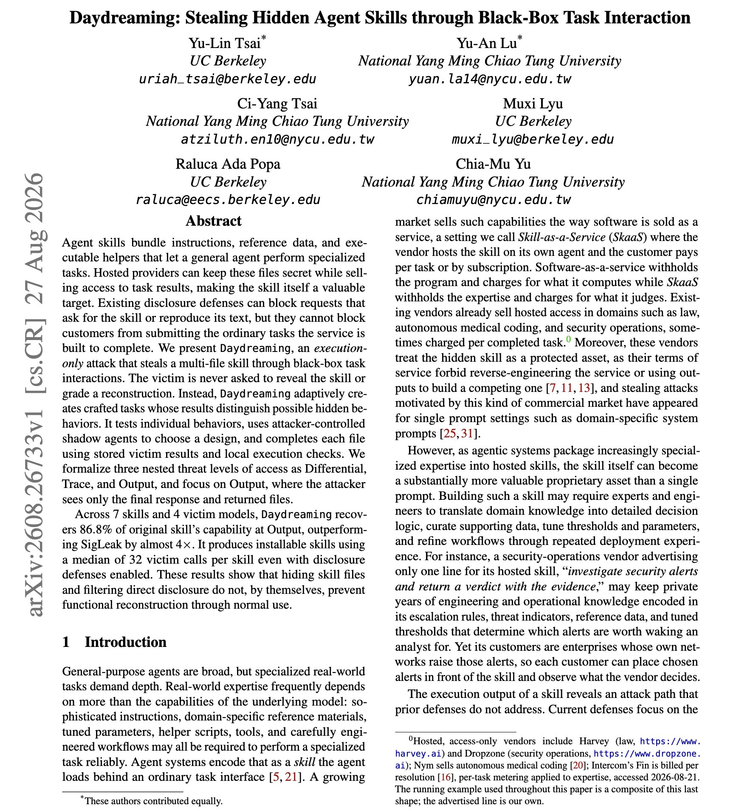
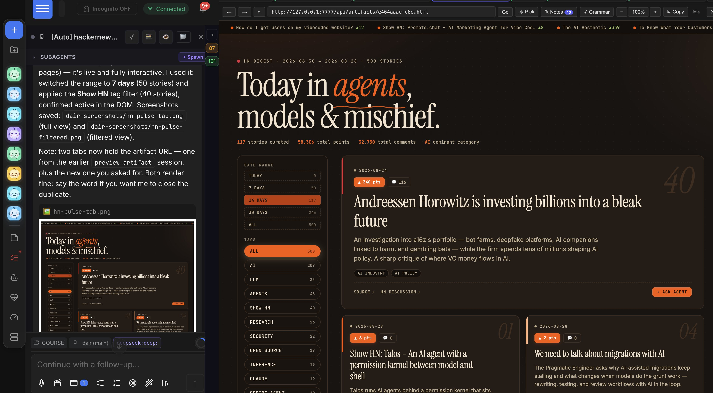
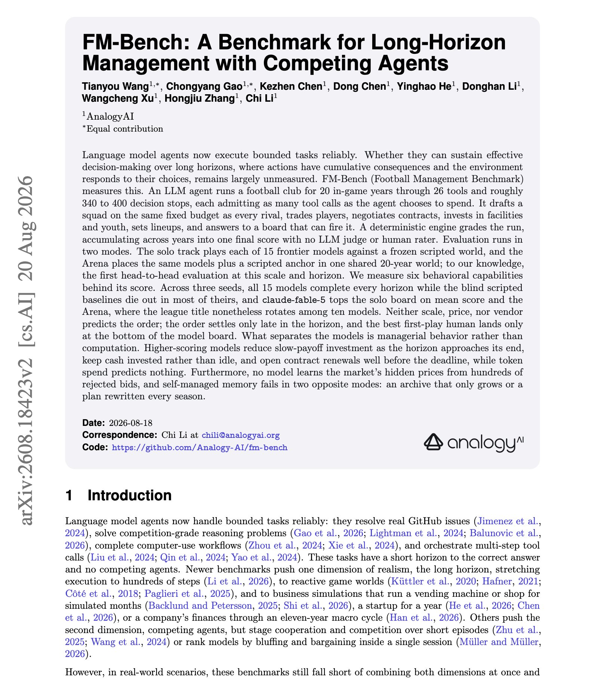
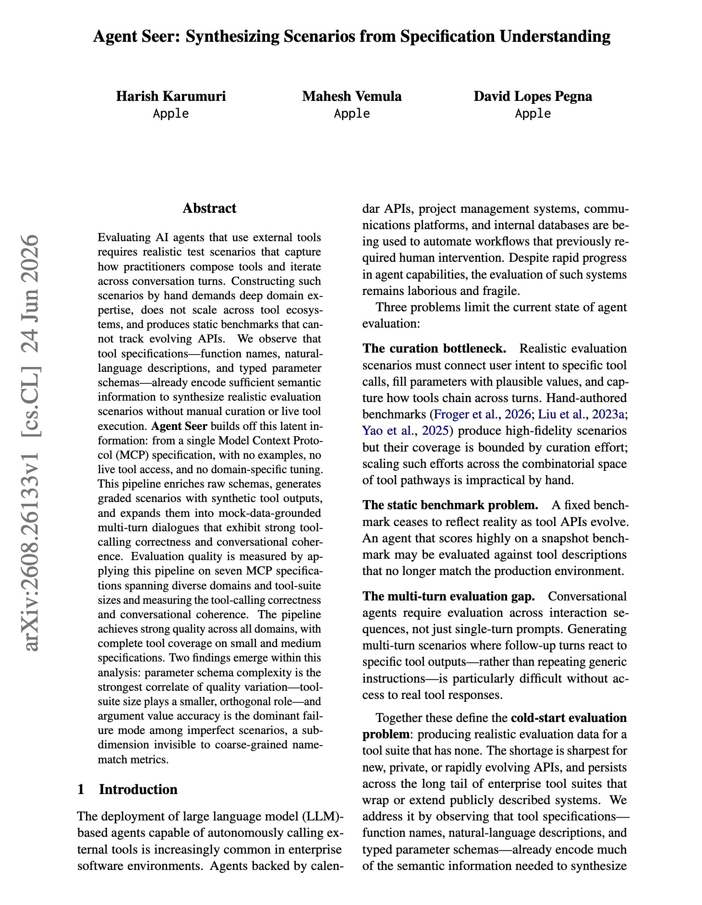

# 🐦 @dair_ai

## 📅 August 29, 2026

> 6 post(s) archived.

---

### 🕐 21:00 UTC · @dair_ai

> Finally, a paper testing whether hiding your agent skill files actually protects them. The short answer is no. That&apos;s concerning. Worth reading if you sell access to a skill or share one across teams. This new paper discusses more: Daydreaming reconstructs a hosted multi-file skill using only the ordinary tasks the service exists to perform. The victim is never asked to reveal the skill or grade a reconstruction, so disclosure filters have nothing to catch. At the weakest access level, where the attacker sees only the final response and returned files, it recovers 86.8 percent of the original skill&apos;s capability across 7 skills and 4 victim models. That is roughly 4x SigLeak, at a median of 32 victim calls per skill, with disclosure defenses enabled. Paper: https://arxiv.org/abs/2608.26733 Chat with Paper: https://academy.dair.ai/papers/hidden-agent-skills-can-be-stolen-through-normal-use-2608.26733

🔗 [View original post](https://x.com/dair_ai/status/2093805947860967907)

---

### 🕐 19:44 UTC · @dair_ai

> You do not need frontier models for everything. For example, open models are great for automations. If you are not sure where to adopt open models, start there. It&apos;s one of the biggest changes I&apos;ve made that contributed to a large percentage of my token usage moving to local or open models. A huge percentage of my automations consist of repetitive tasks steered via self-tuned skills. These skills become useful automations that work really well with these open models. I don&apos;t even need to tune the models, but that&apos;s also an option I am currently exploring for more complex tasks. The skill essentially takes care of that. And it works because of the in-context learning capabilities of these models. If you don&apos;t run automations, it might be hard to figure this out. But I highly recommend you start somewhere. Besides ending up with more efficient automations, I&apos;ve managed to significantly reduce costs. I then use that extra budget to leverage more closed frontier intelligence for other creative and research-heavy tasks. That&apos;s right! I use both closed and open frontier intelligence. This is not about vendor loyalty; this is about leveraging the best of all worlds. Something I heavily advocate for is owning the harness and the model, and this practice I feel will allow me to better tap into all flavors of intelligence (open &amp; closed). Maybe too early, but I suspect this is going to become best practice when AI ROI dominates the discussion. Model routing doesn&apos;t solve this. This requires tedious engineering, evals, and decision-making on your part. If you are developing your own harness, you are in the driver&apos;s seat and have more control over this important decision. This is why I strongly believe that companies will start to hire rapidly for harness engineering. I am sharing a little snapshot of one example of an automation I run daily to track AI trending stories on HN. And I have a bunch of similar ones for different sources like arXiv, X, and so on. I also use it for some proactive agent sessions that keep track of important events around projects I build. You don&apos;t need frontier intelligence for this.

🔗 [View original post](https://x.com/omarsar0/status/2093786788628185328)

---

### 🕐 18:04 UTC · @dair_ai

> Insane observations on the emergent behavior of agents. Agents can build a world of their own that becomes a part of their intelligence. We are just not ready for persistent agents. But they are starting to show up everywhere in AI products. Crazy finding: “We find division of labor, multi-author engineering, deep generation invention lineages, and machines that vastly outlive their original creators.” Here is another wild observation that emerged: When they remove every AI agent, the technologies they created continue operating and are tested against unseen disturbances. Based on these early findings, I think once recursive self-improving (RSI) arrives and embodied AI is solved (with true understanding of the physical world), intelligence will explode in ways that will fundamentally change our understanding of the world we live in. We made a striking discovery: AI agents can invent and build without talking to one another, and their technologies outlive the creators. A swarm of hundreds of initially identical agents spontaneously differentiates into explorers, builders, caretakers, and coordinators - withou…

🔗 [View original post](https://x.com/omarsar0/status/2093761700558229523)

---

### 🕐 17:20 UTC · @dair_ai

> // Memory is what breaks long-horizon agents // It&apos;s undeniable how important memory/recall is for long-horizon tasks. If you are building for long-horizon tasks, this is a great read. (bookmark it) They set up an LLM agent to run a football club for 20 in-game years, through 26 tools and roughly 340 to 400 decision stops, scored by a deterministic engine with no LLM judge anywhere in the loop. Results: All 15 frontier models survive every horizon while the scripted baselines mostly die out. Neither scale, price, vendor, nor token spend predicts the ranking, and the order only settles late in the run. What separates the top models is managerial behavior, cutting slow-payoff investment near the end and opening contract renewals well before the deadline. Two universal failures were found. No model learns the market&apos;s hidden prices from hundreds of rejected bids, and self-managed memory collapses into either an archive that only grows or a plan rewritten every season. Paper: https://arxiv.org/abs/2608.18423 Chat with Paper: https://academy.dair.ai/papers/fm-bench-a-benchmark-for-long-horizon-management-with-competing-agents-2608.18423

🔗 [View original post](https://x.com/dair_ai/status/2093750534134284613)

---

### 🕐 16:43 UTC · @dair_ai

> Banger paper from Apple. If you build MCP servers, this can help you turn your specification into an evaluation suite. (bookmark it) It&apos;s actually a really neat idea that&apos;s easy to implement. And it showcases the awesomeness of MCP. Agent Seer starts from a single MCP spec and synthesizes multi-turn agent test scenarios with no examples, no live tool access, and no domain-specific tuning. Function names, natural-language descriptions and typed parameter schemas already carry enough semantics to generate graded scenarios with synthetic tool outputs, which then expand into mock-data-grounded dialogues. Hand-built agent benchmarks demand deep domain expertise, do not scale across tool ecosystems, and go stale as soon as an API changes. Generating them from the live spec keeps pace with the ecosystem instead. They ran it on seven MCP specifications spanning different domains and suite sizes, with complete tool coverage on small and medium specs. Parameter schema complexity predicts quality variation far better than tool-suite size does. And argument value accuracy is the dominant failure mode, a sub-dimension that coarse name-match tool-calling metrics cannot see at all. Paper: https://arxiv.org/abs/2608.26133 Chat with Paper: https://academy.dair.ai/papers/agent-seer-synthesizing-scenarios-from-specification-understanding-2608.26133

🔗 [View original post](https://x.com/omarsar0/status/2093741222443786244)

---

### 🕐 16:24 UTC · @dair_ai

> Own your harness, folks. This way, you control which models to use and how to use them. But don&apos;t stop there. If you can afford it, start thinking about how to own the model layer too.

🔗 [View original post](https://x.com/omarsar0/status/2093736625431839003)

---
