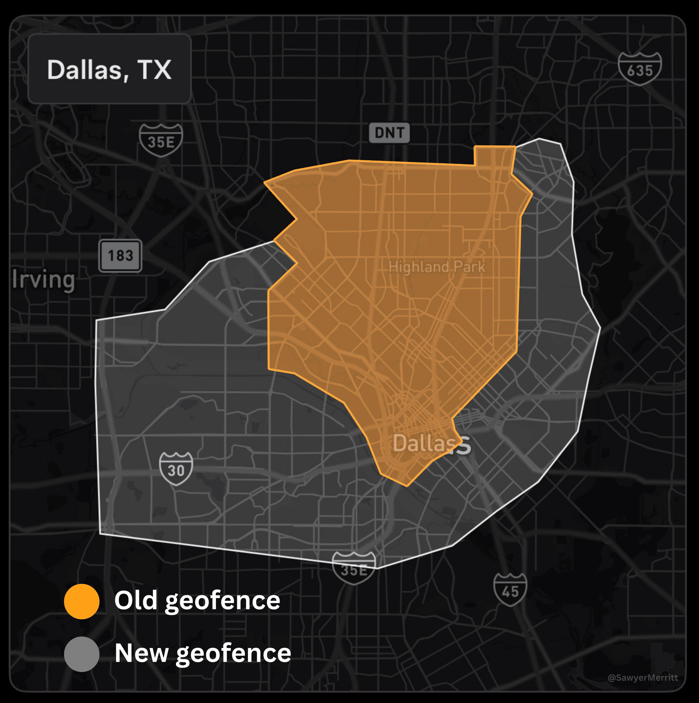
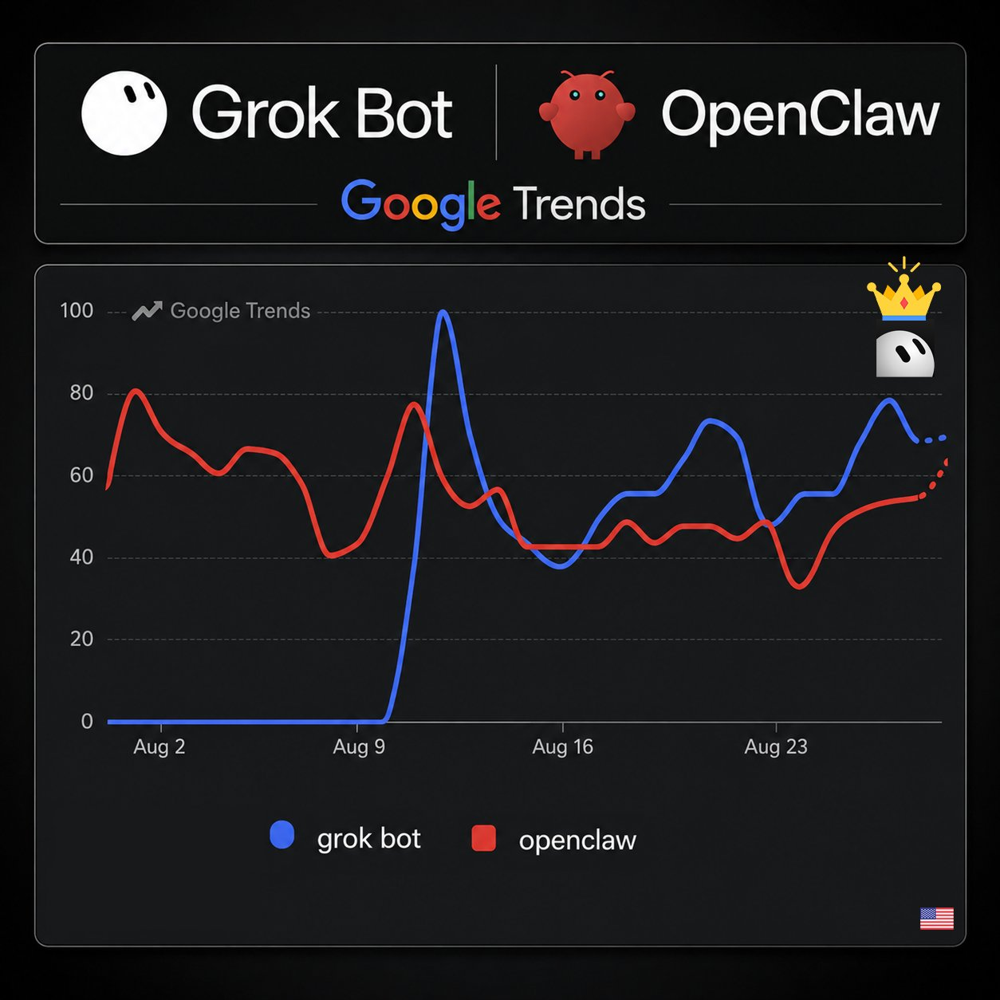

# 🐦 @elonmusk

## 📅 August 29, 2026

> 18 post(s) archived.

---

### 🕐 20:50 UTC · @elonmusk

> Wow Met a German founder this week and asked him if all the stories one reads about the challenges of startups in Germany are exaggerated. &quot;No, they&apos;re understated.&quot; Proceeded to describe spending a full day having a 90-page investment contract read to him (mandatory under German law…

🔗 [View original post](https://x.com/elonmusk/status/2093803391252079096)

---

### 🕐 20:14 UTC · @elonmusk

> SpaceX and Tesla are each building 100GW/year of solar production capacity as fast as possible, but natural gas will still be needed to supplement and bootstrap solar for several years. The limiting factor for nat gas turbine production is casting the blades &amp; vanes. By doing in-house casting at SpaceX, we can accelerate nat gas turbines coming online by up to 18 months, which is a profound game-changer.

🔗 [View original post](https://x.com/elonmusk/status/2093794565274669068)

---

### 🕐 19:56 UTC · @elonmusk

> An important launch Falcon Heavy rolled out to the launch pad at 39A for @NASA’s Roman Space Telescope mission early this morning

🔗 [View original post](https://x.com/elonmusk/status/2093790021123780768)

---

### 🕐 18:11 UTC · @elonmusk

> Yes Matching the payload capacity of ONE Starship V3 flight would take 200+ Falcon 1 launches That’s hundreds of rockets, hundreds of separate launches and an enormous amount of time just to move what one Starship is designed to carry Orbital AI at serious scale needs a vehicle like …

🔗 [View original post](https://x.com/elonmusk/status/2093763537130680656)

---

### 🕐 16:55 UTC · @elonmusk

> Here&apos;s a better comparison of @Tesla&apos;s new Robotaxi service area in Dallas. It&apos;s actually 158% larger than the old service area (in orange). New service area is about 80 square miles (vs 31 before). All Tesla robotaxi rides in Dallas are unsupervised. Tesla has just increased the size of its Robotaxi service area in Dallas, Texas for the first time since the service originally launched in April. The new service area is roughly 50% larger than the old one, and includes more of the downtown Dallas city area and west of the city.

🔗 [View original post](https://x.com/SawyerMerritt/status/2093744413960745421)

---

### 🕐 16:38 UTC · @elonmusk

> While West Germany had VW, Mercedes, BMW, Porsche and Audi East Germany failed to “guarantee” a car for every citizen, but it succeeded in (1) proving central planners can’t innovate and (2) replicating the breadline model to everything they touch. Because steel was never available for private citizens, the “Trabant” automobile was made …

🔗 [View original post](https://x.com/elonmusk/status/2093740168570081431)

---

### 🕐 16:36 UTC · @elonmusk

> When I try and explain that tokens inferenced increased 25-fold in a year and are multiplying exponentially, cascading through the economy, and are likely to push real GDP growth per year toward double digit territory, many clients and companies simply do not comprehend. The AI riptide is already underway

🔗 [View original post](https://x.com/CathieDWood/status/2093739536509436149)

---

### 🕐 14:13 UTC · @elonmusk

> Grok Bot has overtaken OpenClaw in Google Trends search interest. 🔥

🔗 [View original post](https://x.com/cb_doge/status/2093703699973673179)

---

### 🕐 08:07 UTC · @elonmusk

> The most powerful moving object ever made by humans Full duration 33-engine static fire with the Super Heavy booster preparing for Flight 14

🔗 [View original post](https://x.com/elonmusk/status/2093611366409990616)

---

### 🕐 07:59 UTC · @elonmusk

> It’s true MSNBC contributor reluctantly admits 𝕏 Community Notes actually works, even though it physically pains her to say so. Rolling Stone called @ElonMusk and 𝕏 &quot;the biggest purveyors of online misinformation.&quot; Now liberals like Molly Jong-Fast are admitting that false information an…

🔗 [View original post](https://x.com/elonmusk/status/2093609531657891896)

---

### 🕐 07:13 UTC · @elonmusk

> Starlink now available in Equatorial Guinea Starlink&apos;s high-speed, low-latency internet is now available in Equatorial Guinea! 🛰️🇬🇶❤️ → https://starlink.com/equatorialguinea

🔗 [View original post](https://x.com/elonmusk/status/2093597856846238177)

---

### 🕐 06:10 UTC · @elonmusk

> One day, millions of people will look up at the Martian sky and call Mars home Starship is going to take us there And the roads, cities, factories and entire civilization built there all trace back to this machine Starship is how humanity becomes multiplanetary https://x.com/XFreeze/status/2061068019686945278/video/1 Media

🔗 [View original post](https://x.com/XFreeze/status/2093581942776090896)

---

### 🕐 05:50 UTC · @elonmusk

> The AI riptide is already underway a surprise I think is coming the quick payback periods and extraordinarily high IRR for AI infrastructure, even at monumental scale, will push up cost of capital sufficient to push many traditional businesses into the abyss, even those without obvious direct AI counter-exposure

🔗 [View original post](https://x.com/elonmusk/status/2093577089957994826)

---

### 🕐 05:41 UTC · @elonmusk

> Starship Flight 14 Full duration 33-engine static fire with the Super Heavy booster preparing for Flight 14

🔗 [View original post](https://x.com/elonmusk/status/2093574820193554557)

---

### 🕐 05:38 UTC · @elonmusk

> Nice Ask Grok: &quot;Create a Magic: The Gathering creature card of me based on my post history.&quot; I love the spider wasps! And the nuance in the abilities is also impressive. In Magic, Ward is an ability that taxes your opponent whenever they try to target the card. Seems like this related…

🔗 [View original post](https://x.com/elonmusk/status/2093574002652397638)

---

### 🕐 05:38 UTC · @elonmusk

> 🚀🚀 Cursor has been a trusted partner of Anthropic since Sonnet 3.5. We’ll continue to increase compute to support Claude models in Cursor and are excited for what comes next with them at SpaceX.

🔗 [View original post](https://x.com/elonmusk/status/2093573877330739459)

---

### 🕐 01:22 UTC · @elonmusk

> It’s a function of SF Bay Area political views. Grok is California plus Texas, so more centered. This is very very problematic.

🔗 [View original post](https://x.com/elonmusk/status/2093509592873390307)

---

### 🕐 01:20 UTC · @elonmusk

> 🔥😂 Giving Grok Bot my corporate card and telling it to “maximize shareholder value”

🔗 [View original post](https://x.com/elonmusk/status/2093508933944062247)

---
