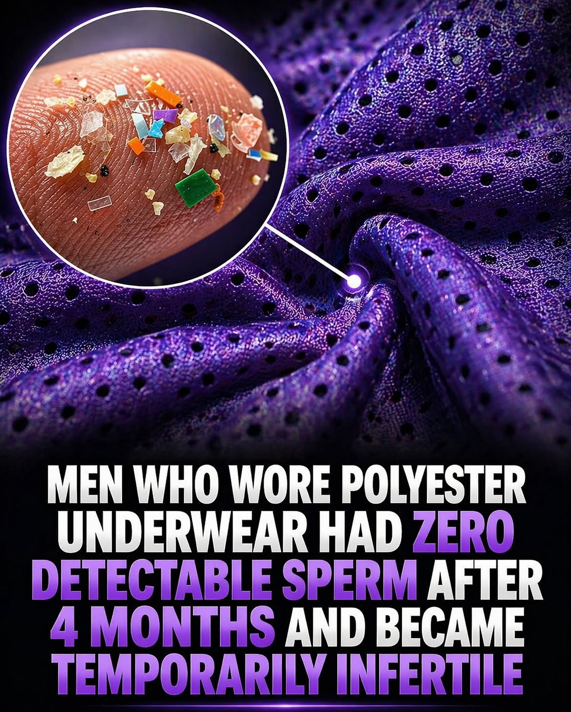

# 🐦 @theendeavorpath

## 📅 August 29, 2026

> 1 post(s) archived.

---

### 🕐 08:48 UTC · @theendeavorpath

> That polyester underwear warning comes from an old study, but the bigger takeaway still matters: what sits against your body all day can affect heat and airflow. The image is really about male fertility basics most guys ignore, because tighter, less breathable fabric may create a warmer environment that is not ideal when sperm health is the goal. Send this to someone wearing polyester shorts

🔗 [View original post](https://x.com/stoicmen_/status/2093621880972317049)

---
