# 🐦 @Unlockyourlife_

## 📅 August 30, 2026

> 28 post(s) archived.

---

### 🕐 12:54 UTC · @Unlockyourlife_

> When life gives you lemons, try these tricks 🍋 Media

🔗 [View original post](https://x.com/Smart_Tipsx/status/2094046093436649705)

---

### 🕐 12:50 UTC · @Unlockyourlife_

> CPU in details

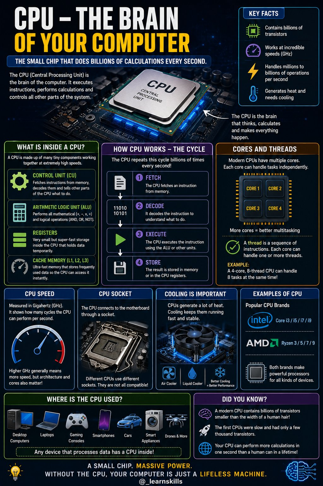

🔗 [View original post](https://x.com/_learnskills/status/2094045136879526239)

---

### 🕐 12:50 UTC · @Unlockyourlife_

> What this woods turned out will amaze! Media

🔗 [View original post](https://x.com/samx_reels/status/2094045127886979424)

---

### 🕐 12:40 UTC · @Unlockyourlife_

> Amazing Car maintainance tricks you should know! Media

🔗 [View original post](https://x.com/_Brainboxx/status/2094042633370796090)

---

### 🕐 12:25 UTC · @Unlockyourlife_

> The Afternoon Energy Slump Fix

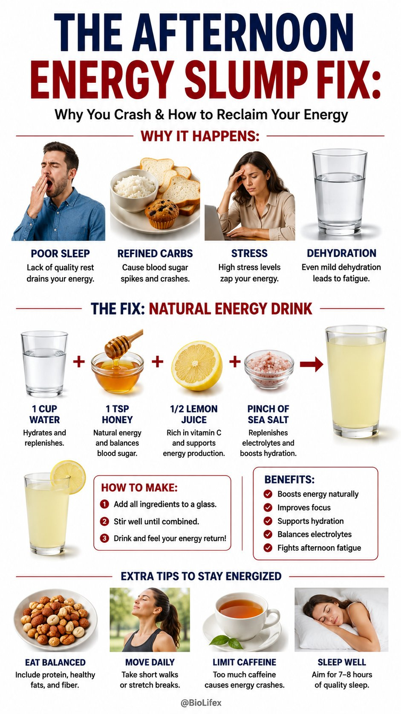

🔗 [View original post](https://x.com/BioLifex/status/2094038691509395579)

---

### 🕐 12:24 UTC · @Unlockyourlife_

> Cheesy Beef Empanadas

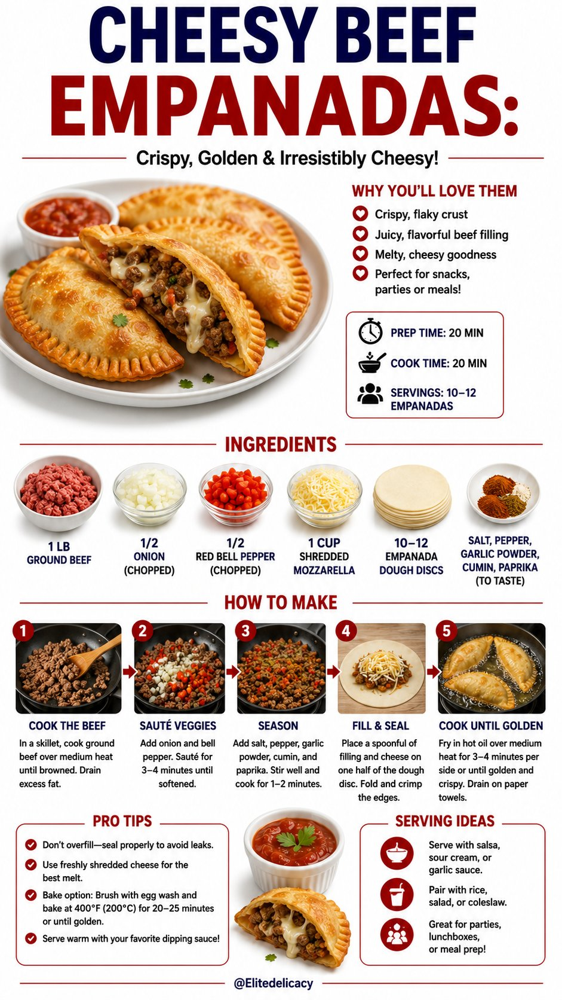

🔗 [View original post](https://x.com/Elitedelicacy/status/2094038576308605125)

---

### 🕐 12:24 UTC · @Unlockyourlife_

> Rest Periods for Hypertrophy

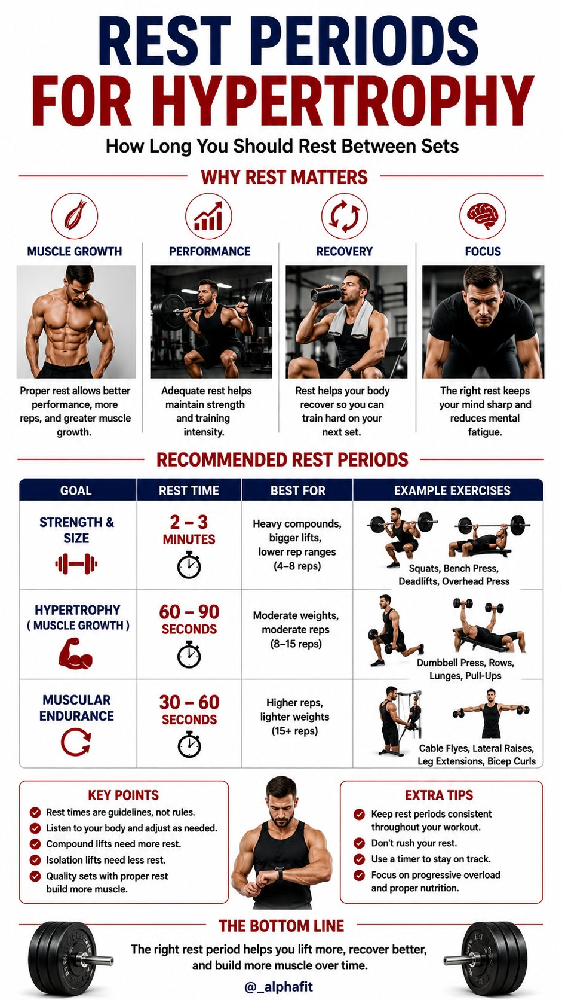

🔗 [View original post](https://x.com/_alphafit/status/2094038449615519830)

---

### 🕐 09:44 UTC · @Unlockyourlife_

> What Happenes When You Turn on A Computer

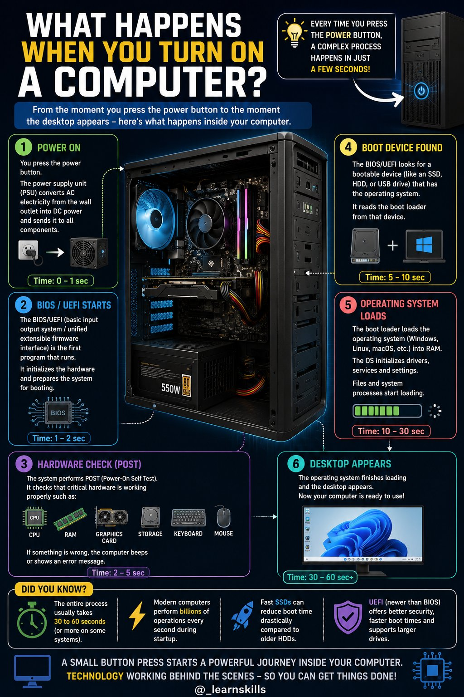

🔗 [View original post](https://x.com/_learnskills/status/2093998249753395352)

---

### 🕐 09:13 UTC · @Unlockyourlife_

> When it&apos;s clinical 🔷 Botox injections (blocks nerve signals) 🔷 Oral muscle relaxants 🔷 Treating underlying dry eye/. blepharitis Needed if twitching persists for weeks, spreads to the face, or causes eyelid closure - this may be benign essential blepharospasm.

🔗 [View original post](https://x.com/FitnessDr_/status/2093990542019273052)

---

### 🕐 09:13 UTC · @Unlockyourlife_

> Eye twitching isn&apos;t random - it&apos;s your nervous system flagging fatigue, deficiency, or strain. Try the physical and lifestyle fixes first. If it persists past two weeks or spreads, see a doctor.

🔗 [View original post](https://x.com/FitnessDr_/status/2093990544447848761)

---

### 🕐 09:13 UTC · @Unlockyourlife_

> Correct the root triggers 2z • Reduce caffeine intake • Fix sleep consistency • Apply the 20-20-20 rule for screens Slower to work, but this is what actually prevents twitching from returning

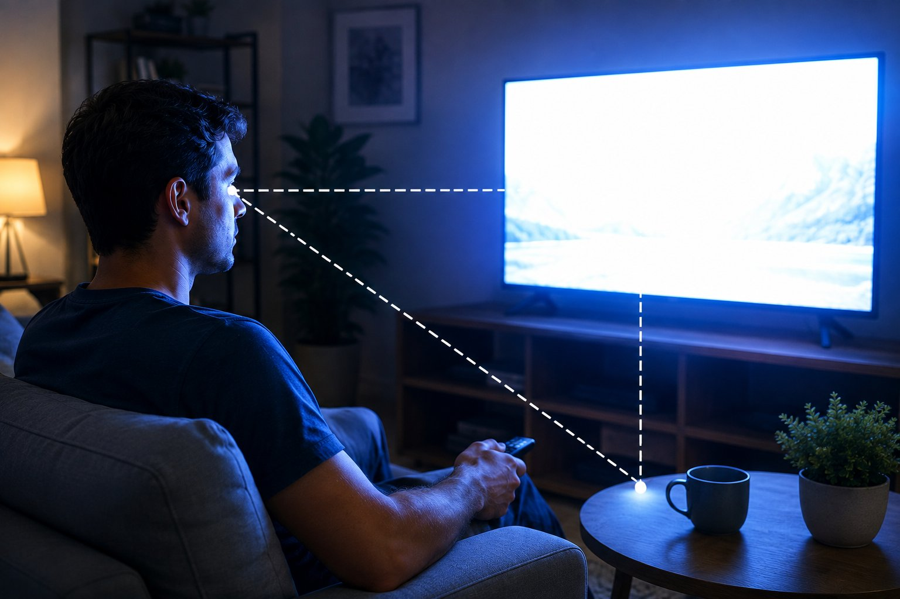

🔗 [View original post](https://x.com/FitnessDr_/status/2093990534066868454)

---

### 🕐 09:13 UTC · @Unlockyourlife_

> Fix nutrient gaps 🎯 Magnesium (leafy greens, nuts, seeds) 🎯 Vitamin B12 🎯 Electrolytes A controlled study on blepharospasm patients found magnesium significantly reduced twitching frequency and severity vs. placebo.

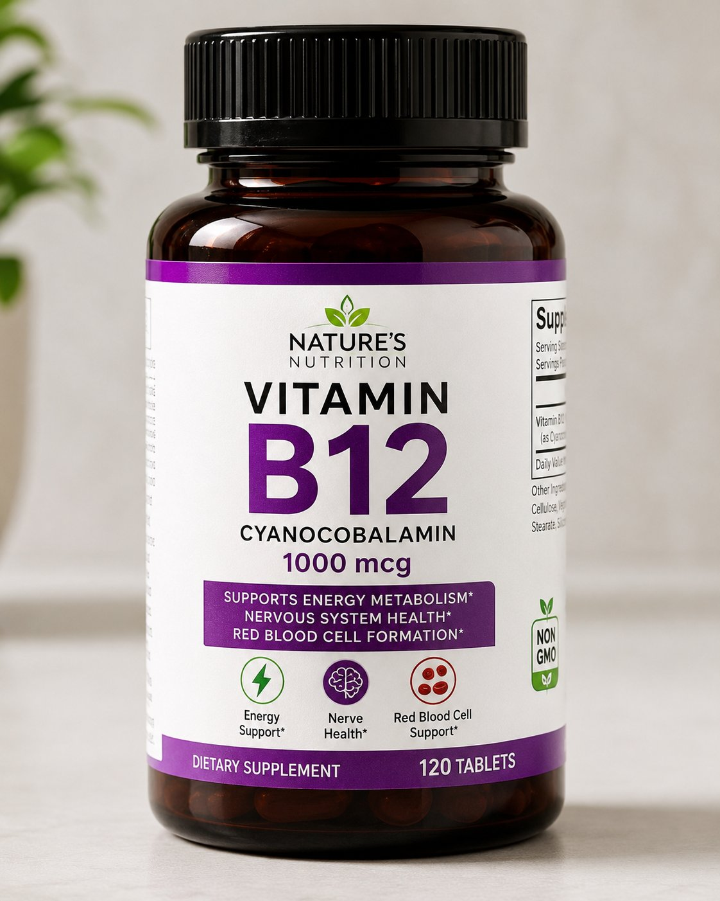

🔗 [View original post](https://x.com/FitnessDr_/status/2093990522343809328)

---

### 🕐 09:13 UTC · @Unlockyourlife_

> 5 real causes of eye twitching (myokymia): • Fatigue • Caffeine • Stress • Screen strain • Magnesium/B12 deficiency It&apos;s your nervous system misfiring under overload - usually lifestyle-driven, occasionally nutritional.

🔗 [View original post](https://x.com/FitnessDr_/status/2093990512818581857)

---

### 🕐 09:13 UTC · @Unlockyourlife_

> Physical remedies - Press the area for 10-15 seconds - Massage in small circles - Apply a warm compress (5 min) These interrupt the nerve-muscle spasm directly - fast relief, especially for short episodes Try this.... 👇

🔗 [View original post](https://x.com/FitnessDr_/status/2093990514764677544)

---

### 🕐 09:13 UTC · @Unlockyourlife_

> Eye twitching is one of the most misunderstood minor symptoms in medicine. Here&apos;s what&apos;s actually happening🧵 Media

🔗 [View original post](https://x.com/FitnessDr_/status/2093990510448759094)

---

### 🕐 08:33 UTC · @Unlockyourlife_

> Your body isn’t asking for more caffeine. It’s asking for better recovery. 💤 Fix your sleep, fuel your body properly, train consistently, and give yourself time to recover. You don’t need to change everything overnight. Start with the one thing you’ve been neglecting the most.

🔗 [View original post](https://x.com/_fitnesshub/status/2093980347708985370)

---

### 🕐 08:33 UTC · @Unlockyourlife_

> 5. You need caffeine just to function • Coffee becomes a daily requirement • You feel sleepy throughout the day • You keep increasing your caffeine intake Caffeine can temporarily make you feel more alert, but it doesn’t replace actual sleep. If you’re constantly using it to fight exhaustion, your sleep routine may need attention. ☕💤

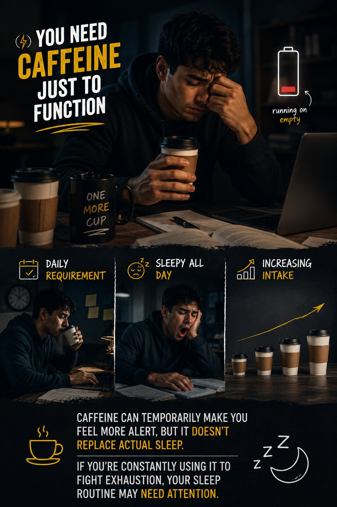

🔗 [View original post](https://x.com/_fitnesshub/status/2093980343262933398)

---

### 🕐 08:33 UTC · @Unlockyourlife_

> 4. Your mood keeps changing • Easily irritated • Low motivation • Harder to concentrate Sleep affects how your brain regulates emotions. When you’re constantly running on little sleep, even small problems can feel way more annoying.

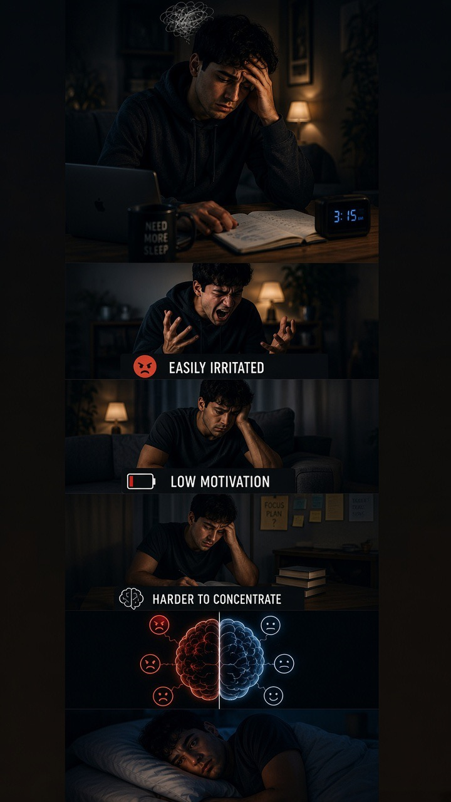

🔗 [View original post](https://x.com/_fitnesshub/status/2093980337307000951)

---

### 🕐 08:33 UTC · @Unlockyourlife_

> 3. Your workouts start feeling harder • Less energy during training • Lower workout performance • Recovery feels slower Your body does a lot of its recovery while you sleep. Consistently poor sleep can leave you feeling more fatigued and make training harder.

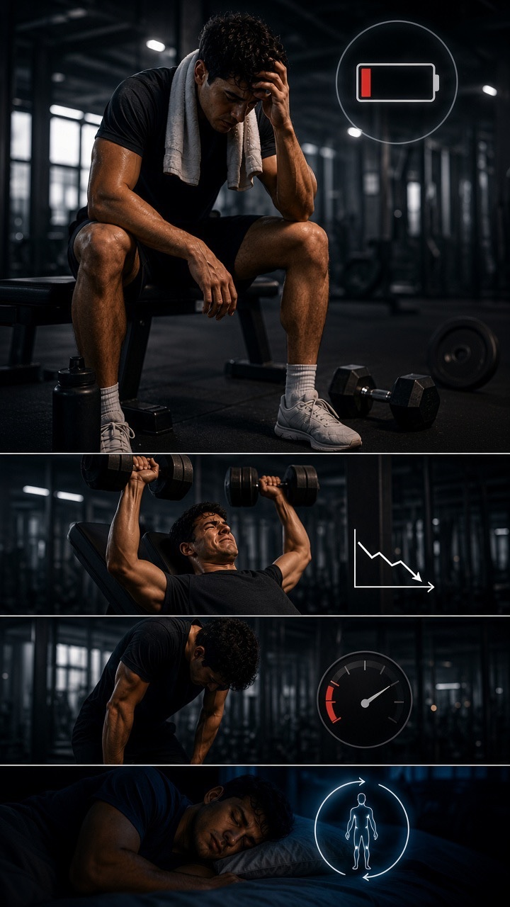

🔗 [View original post](https://x.com/_fitnesshub/status/2093980334178127875)

---

### 🕐 08:33 UTC · @Unlockyourlife_

> 2. Your hunger gets louder • More cravings for sugary foods • Feeling hungry soon after eating • Harder to feel satisfied Poor sleep can affect the hormones involved in hunger and fullness, which may make high-calorie foods more tempting the next day.

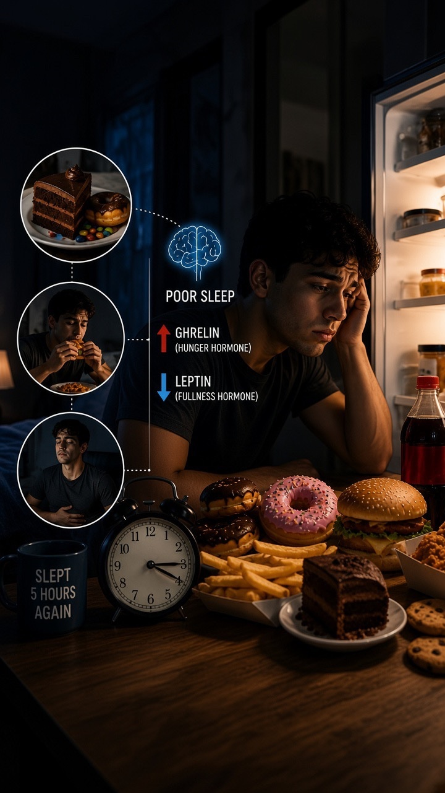

🔗 [View original post](https://x.com/_fitnesshub/status/2093980330889769313)

---

### 🕐 08:33 UTC · @Unlockyourlife_

> 1. Your body feels tired even after sleeping • You wake up feeling drained • You struggle to focus during the day • You rely heavily on caffeine Your body needs quality sleep, not just time in bed. Poor sleep can leave you feeling fatigued and make concentration harder throughout the day. 💤

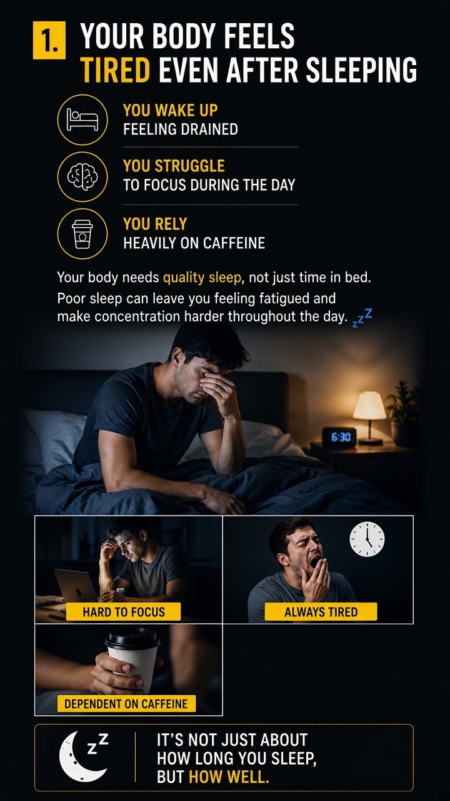

🔗 [View original post](https://x.com/_fitnesshub/status/2093980327349747844)

---

### 🕐 08:33 UTC · @Unlockyourlife_

> You’re tired all the time… but you keep blaming your body. Sometimes, the problem isn’t that you need more energy. It’s that your body isn’t getting enough time to recover. 💤 Here are 5 signs your sleep may be affecting your health:

🔗 [View original post](https://x.com/_fitnesshub/status/2093980323474206818)

---

### 🕐 07:34 UTC · @Unlockyourlife_

> Light table... Media

🔗 [View original post](https://x.com/Smart_Tipsx/status/2093965569934368940)

---

### 🕐 07:30 UTC · @Unlockyourlife_

> Very Incredible Dead Battery Restoration! Media

🔗 [View original post](https://x.com/samx_reels/status/2093964682591703194)

---

### 🕐 07:12 UTC · @Unlockyourlife_

> STOP USING YOUR IPHONE LIKE THIS 📱 Media

🔗 [View original post](https://x.com/_Brainboxx/status/2093959934580781237)

---

### 🕐 06:55 UTC · @Unlockyourlife_

> My son; If you want a healthy relationship, learn to distinguish privacy from secrecy. Privacy means you don&apos;t share every detail of your relationship with the world. Secrecy means deliberately hiding things your partner has a legitimate reason to know. You can protect your relationship without creating a second life behind it.

🔗 [View original post](https://x.com/Masculinjournal/status/2093955852033999161)

---

### 🕐 05:29 UTC · @Unlockyourlife_

> The cervix is the small passage connecting the uterus to the vagina. 🌸 For some people, it can be reached with a clean finger, although its position changes throughout the menstrual cycle. Learning about your cervix can help you better understand your reproductive anatomy and body changes. This post is ai generated for educational purposes only. Media

🔗 [View original post](https://x.com/brutal_truth0/status/2093934102219051400)

---

### 🕐 05:29 UTC · @Unlockyourlife_

> The cervix is the small passage connecting the uterus to the vagina. 🌸 For some people, it can be reached with a clean finger, although its position changes throughout the menstrual cycle. Learning about your cervix can help you better understand your reproductive anatomy and body changes. This post is ai generated for educational purposes only. Media

🔗 [View original post](https://x.com/HoliHappiness/status/2093934013673037919)

---
