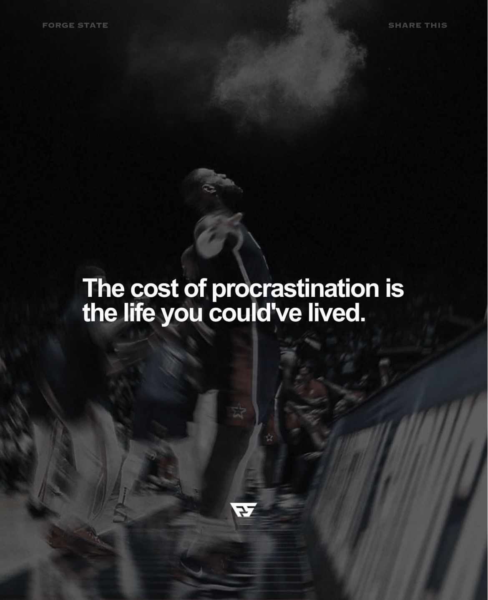

# 🐦 @Wise1Philosophy

## 📅 August 30, 2026

> 18 post(s) archived.

---

### 🕐 08:00 UTC · @Wise1Philosophy

🔗 [View original post](https://x.com/Wise1Philosophy/status/2093972224034107404)

---

### 🕐 07:57 UTC · @Wise1Philosophy

> 🚨 BREAKING: Claude can now upgrade your entire Instagram page like a $20K social media manager. Use these prompts to grow your reach, followers, and sales in 2026! (🔖 Save this)

🔗 [View original post](https://x.com/heyalexmoore/status/2093971448356581396)

---

### 🕐 07:30 UTC · @Wise1Philosophy

🔗 [View original post](https://x.com/Daily__wisdom_/status/2093964459337232740)

---

### 🕐 07:00 UTC · @Wise1Philosophy

🔗 [View original post](https://x.com/apex_mentality_/status/2093957096748277907)

---

### 🕐 06:36 UTC · @Wise1Philosophy

> I swear taking zinc in the morning, magnesium at night, and vitamin D+K2 with breakfast changed my life. I did it for 30 days straight and people around me kept asking why I seemed more alive. Here is exactly what I did:

🔗 [View original post](https://x.com/mind_and_beauty/status/2093950847202087228)

---

### 🕐 06:30 UTC · @Wise1Philosophy

🔗 [View original post](https://x.com/yeti_mind/status/2093949372752953531)

---

### 🕐 06:30 UTC · @Wise1Philosophy

> THIS IS WHAT HAPPENS WHEN A MODEL IS BUILT AROUND REAL WORK. Hy4 preview was developed with expert input across software engineering, gaming, finance, and security. Tencent also co designed the model with products like WorkBuddy, connecting model development directly to real productivity tasks. Then they tested it. 163 internal experts. 203 engineering tasks. The scores: Hy4 preview: 2.99 out of 4 Kimi K3: 2.94 out of 4 GLM 5.3: 2.92 out of 4 It costs $0.834 per million input tokens, $2.501 per million output tokens, and only $0.042 per million cache hits. Flagship power at a budget friendly price. Hy4 preview is available to experience free on WorkBuddy for a limited two week period. @TencentHunyuan @TencentAI_News @WorkBuddy_AI https://www.workbuddy.ai Media

🔗 [View original post](https://x.com/Rixhabh__/status/2093949359146913813)

---

### 🕐 06:00 UTC · @Wise1Philosophy

🔗 [View original post](https://x.com/Life__Mastery/status/2093941881289814462)

---

### 🕐 05:28 UTC · @Wise1Philosophy

> Tencent just dropped Hy4 preview, and it&apos;s officially open source now. 770B total params, 49B active, 1M+ token context. three major releases in six months, and this one just landed in the top tier of open source models. → Built through Tencent&apos;s co-design loop: training data shaped with experts across software engineering, gaming, finance, and security, then built directly alongside products like WorkBuddy → In a blind test with 163 internal experts across 203 engineering tasks, it scored 2.99/4, ahead of GLM 5.3 at 2.92 and Kimi K3 at 2.94 → Benchmarks put it clearly past GLM 5.2 and neck and neck with GLM 5.3 → Pricing stayed low: $0.834/M input, $2.501/M output, $0.042/M cache hits I asked it to write a weekly status update email template for a team lead, then generate a filled-out example with placeholder projects, and export both as Word docs. one prompt, no follow-up, and it handed back both files clean and ready to send. free to try for the next two weeks through WorkBuddy: https://www.workbuddy.ai/ @TencentHunyuan @TencentAI_News @WorkBuddy_AI Media

🔗 [View original post](https://x.com/Damn_coder/status/2093933838032658633)

---

### 🕐 04:12 UTC · @Wise1Philosophy

> Heart Attack = Blood sugar Heart Attack = Insulin resistance Heart Attack = No.1 killer worldwide. 5 simple rules to protect your heart: 1. Don&apos;t go to the toilet at 3 AM

🔗 [View original post](https://x.com/_Gut_Laboratory/status/2093914792759370226)

---

### 🕐 04:02 UTC · @Wise1Philosophy

> A poor diet is the #1 reason people can&apos;t lose weight. After coaching 800+ people, the ones who lose the fastest do this same thing, pick 3-4 simple diet on repeat. Here&apos;s the list: 1. 𝐄𝐠𝐠 &amp; 𝐑𝐢𝐜𝐞 (𝐒𝐢𝐦𝐩𝐥𝐞)

🔗 [View original post](https://x.com/CoachDanCole_/status/2093912193440031067)

---

### 🕐 03:58 UTC · @Wise1Philosophy

> Waking up 2-3 times a night to piss and thinking it&apos;s because you drank water before bed. It&apos;s not the water. Here’s actually why (&amp; what stops it): 1. Your blood sugar is crashing at 3 am.

🔗 [View original post](https://x.com/HeyDoc_MD/status/2093911117978542390)

---

### 🕐 03:56 UTC · @Wise1Philosophy

> A Harvard neurologist told me: “Sticking out your tongue for 40 seconds removes cortisol faster than any pills and breathing exercises.” 1. Your neck is what&apos;s keeping you anxious.

🔗 [View original post](https://x.com/LongevityCode_/status/2093910656902955391)

---

### 🕐 03:53 UTC · @Wise1Philosophy

> This Radiologist said : &quot;If I have cancer, I won’t go to the hospital. I’ve seen too many people die from chemo, not from cancer.&quot; 1. I’ll fast for 30 days and I’ll stop working. Media

🔗 [View original post](https://x.com/Dr_Biohacker/status/2093909977715077412)

---

### 🕐 03:49 UTC · @Wise1Philosophy

> Walking = lose weight Walking = lower blood sugar Walking = reduce your risk of early death. 8 simple rules you have to follow: 1. Don&apos;t chase 10,000 steps. Media

🔗 [View original post](https://x.com/LevelUpPrime/status/2093908944368631892)

---

### 🕐 03:41 UTC · @Wise1Philosophy

> Your blood sugar is aging you faster than smoking and junk food. It ruins sleep, fat loss, reduces nitric oxide, and causes fatty liver and diabetes. Here’s the simple fix: 1. Don’t walk 10,000 steps

🔗 [View original post](https://x.com/DPro_Coach/status/2093906925054513289)

---

### 🕐 03:37 UTC · @Wise1Philosophy

> 4 supplements I&apos;m getting my aging parents to take: 1. Creatine. You should take it, your friends should take it, your parents should take it. 5g a day, forever. No loading phase needed.

🔗 [View original post](https://x.com/NutritionCorp/status/2093905886020567355)

---

### 🕐 03:35 UTC · @Wise1Philosophy

> Heart Attack = Blood sugar Heart Attack = Insulin resistance Heart Attack = No.1 killer worldwide. 5 simple rules to protect your heart: 1. Don&apos;t go pee at 3 AM Media

🔗 [View original post](https://x.com/TheFastedState/status/2093905397006635276)

---
