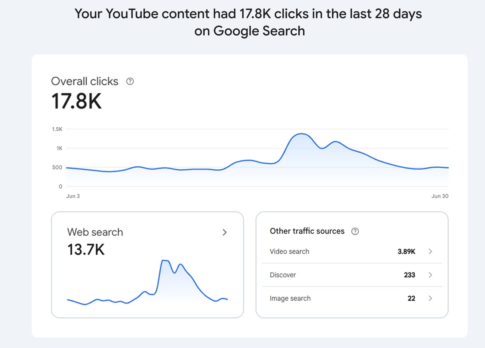
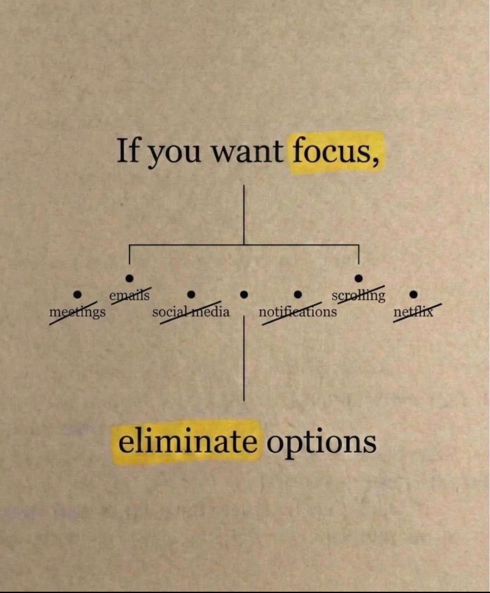
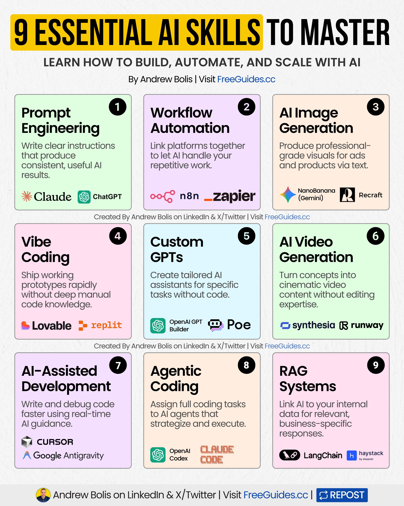
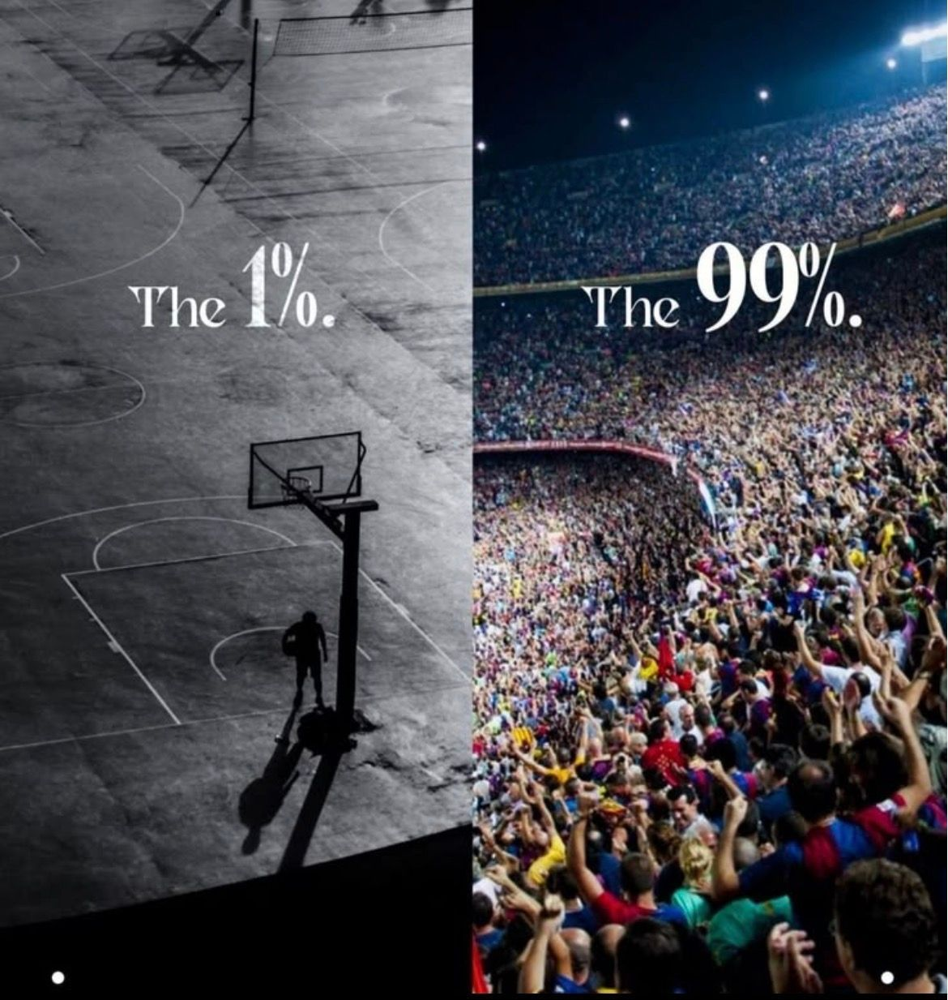

# 🐦 @Wise1Philosophy

## 📅 August 30, 2026

> 65 post(s) archived.

---

### 🕐 16:36 UTC · @Wise1Philosophy

> A cardiologist shocked me when he said: &quot;You age because your body stops producing Nitric Oxide. Without it, your blood pressure rises, erections fail, and Alzheimer&apos;s happens&quot; This is the 5-step protocol to boost it naturally: 1. Stop using mouthwash

🔗 [View original post](https://x.com/BeBetterMan_/status/2094101927349113332)

---

### 🕐 16:27 UTC · @Wise1Philosophy

> Your blood sugar is aging you faster than smoking and junk food. It ruins sleep, fat loss, reduces nitric oxide, and causes fatty liver and diabetes. Here’s the simple fix: Media

🔗 [View original post](https://x.com/DPro_Coach/status/2094099772735173106)

---

### 🕐 16:24 UTC · @Wise1Philosophy

> Heart Attack = Blood sugar Heart Attack = Insulin resistance Heart Attack = No.1 killer worldwide. 5 simple rules to protect your heart: Media

🔗 [View original post](https://x.com/_Gut_Laboratory/status/2094098974806581735)

---

### 🕐 16:21 UTC · @Wise1Philosophy

> If you want to avoid heart attacks, strokes and blood clots (especially if you&apos;re over 40) These are the 8 things you MUST pay attention to: 1. Instant ramen.

🔗 [View original post](https://x.com/TheFastedState/status/2094098247233204547)

---

### 🕐 16:13 UTC · @Wise1Philosophy

> There are three quiet things a dog does only for the person they chose for life. And if your dog does the LAST ONE.. They have given you everything they have... MUST READ.. 🧵

🔗 [View original post](https://x.com/Manifest_Lord/status/2094096275759308994)

---

### 🕐 16:13 UTC · @Wise1Philosophy

> Babies think they are part of their mothers bodies for nearly a year. Their nervous system still registers your body as theirs. Your heartbeat. Your smell. Your warmth. To them It is survival. Here&apos;s why rushing independence too soon costs more than just sleep. 👇

🔗 [View original post](https://x.com/scotti_brooks/status/2094096190363283513)

---

### 🕐 15:51 UTC · @Wise1Philosophy

> I fear my household now needs an org chart 💀 Grok Bot templates are insanely impressive. People are unlocking jobs they used to do themselves. 8 wild examples:

🔗 [View original post](https://x.com/Wise1Philosophy/status/2094090704121176414)

---

### 🕐 15:12 UTC · @Wise1Philosophy

> Casual intimacy without boundaries can be dangerous and will ruin your life... There are 6 types of women you should never get involved with s€xua||Y..

🔗 [View original post](https://x.com/MindPatternHQ/status/2094080737024880766)

---

### 🕐 15:11 UTC · @Wise1Philosophy

> A 67-year-old woman fell down the basement stairs at 2 PM on a Tuesday. She hit the concrete floor. She couldn&apos;t move. She couldn&apos;t reach her phone it was on the kitchen counter, up the stairs, behind a closed door. She couldn&apos;t yell loud enough for anyone to hear her husband was at work, her neighbors were inside, and the basement windows were closed. She lay on the concrete for 47 seconds before her Apple Watch called 911 for her. Fall Detection a feature enabled by default for users 55 and older recognized the impact pattern through the Watch&apos;s accelerometer and gyroscope. When she didn&apos;t move or respond within 60 seconds, the Watch automatically dialed emergency services. It transmitted her GPS location. It played an automated message identifying the emergency. It sent notifications to her emergency contacts with her location. Paramedics arrived in 8 minutes. She had a fractured hip and a concussion. She told the doctors the Watch saved her life because by the time her husband came home 4 hours later, the internal bleeding from the hip fracture could have become life-threatening. Her husband didn&apos;t know Fall Detection existed on the Watch she&apos;d been wearing for 2 years. He bought it for her to track steps. She showed him 11 Apple Watch features most owners have never configured starting with the safety features that exist for exactly this moment. Here&apos;s the full playbook 🧵

🔗 [View original post](https://x.com/jackcoder0/status/2094080480950026719)

---

### 🕐 14:51 UTC · @Wise1Philosophy

> Colon Cancer rarely starts with agonizing pain. It usually starts with a minor inconvenience you just decide to ignore. ​Here are 5 early warning signs of colon cancer you should NEVER overlook. 1. ​Colon Cancer = Blood in your stool.

🔗 [View original post](https://x.com/BeBetter_Athlet/status/2094075562830741674)

---

### 🕐 14:41 UTC · @Wise1Philosophy

> 𝗕𝗘𝗦𝗧 𝗙𝗢𝗢𝗗 Combos 𝗙𝗢𝗥 𝗪𝗘𝗜𝗚𝗛𝗧 𝗟𝗢𝗦𝗦 (Science-backed) 1. 𝗣𝗢𝗣𝗖𝗢𝗥𝗡 &amp; Soda Water

🔗 [View original post](https://x.com/Fitby_Chandler/status/2094073126812549513)

---

### 🕐 14:20 UTC · @Wise1Philosophy

> Your cortisol levels hit their peak and you don&apos;t even realize it. These are the 9 signs that confirm it: 1. Trembling eyelids Media

🔗 [View original post](https://x.com/_sleepreport/status/2094067750608253167)

---

### 🕐 14:07 UTC · @Wise1Philosophy

> Google will now show you how your TikTok, Instagram, X and YouTube content performs on Google Search. It also now shows you exactly how you perform in AI search. This is one of the biggest marketing updates of 2026. Let&apos;s go through it. By the way, you can see whether your business is appearing across Google AI, ChatGPT, Claude, Perplexity and Grok here. It&apos;s free: https://seo-stuff.com/free-audit The first update is called platform properties. It&apos;s a property type inside Search Console, and it follows an experiment Google ran late last year. It does something creators have never really been able to do before: see how their social and video posts actually perform on Google Search and Discover. You can now track which search terms lead people to your Instagram, TikTok, X and YouTube content. And you can see exactly how your audience is finding and interacting with those posts. Until now, this was mostly guesswork featuring screenshots, Googling your own name, platform analytics that lumped every traffic channel together, guessing, etc. Now we get some real answers. There are three reports we can review now. The first is the Performance report. This shows your total clicks, impressions and other metrics, and you can filter and sort to see which specific posts and which queries are driving the most traffic. If you&apos;d rather analyze it somewhere else, you can export the data. The second is the Insights report. This is the high-level view: your recent traffic trends, your top-performing posts and how people are discovering your account on Google. The third is Achievements. This one tracks your growth and flags milestones, like crossing a new threshold for total clicks from Google Search over the last 28 days. Imagine a food creator who posts recipes on Instagram and YouTube, but she&apos;s never really known how people find her outside the apps. Now she can see that a few specific recipes are pulling in most of her Google traffic. She can see the exact search terms bringing people in. If only a handful of posts get most of the impressions, that tells her something. If a post she thought was great is getting no search traffic at all, that tells her something too. That changes what she makes next. The second update is the one I wrote about recently: Google&apos;s Generative AI performance report. Where platform properties covers your social and video posts, this one covers your website&apos;s pages. It shows how often your URLs appear in Google&apos;s generative AI features. That means AI Overviews and AI Mode. It can also show which pages appeared, which countries the impressions came from, which devices people used and how performance changed over time. There is one limitation worth knowing: this is impression data, not click data. Google will show you whether your pages appeared inside its AI features, but not yet how many people clicked through to your site. Still, put the two reports next to each other and you get something businesses have never really had. A view of how your social content performs in Search. And a view of how your website performs in Google&apos;s AI answers. Which brings us to the only issue: both of these just give you Google data. Neither report tells you whether your content is being cited and recommended inside ChatGPT, Claude, Perplexity or Grok. And for a lot of businesses now, that&apos;s where a growing share of discovery is happening. This is where SEO Stuff comes in: https://seo-stuff.com/gold-plan-package Because showing up ,whether in Search, in Discover, or in an AI answer on any platform, comes down to the same two things working together: Useful, specific content that answers what people are actually searching for. Trusted external signals that confirm who you are and what you should be recommended for. The done-for-you package combines 10 AI-search-optimized articles with three DR50+ authority placements. The content helps you cover the questions your customers ask before buying. The authority placements help search and AI systems understand your category and trust your brand. One more thing worth knowing: both of these reports are rolling out gradually. So if you don&apos;t see them in Search Console yet, give it a few days. But the direction is the same one I keep writing about. First it was Microsoft&apos;s citation reports. Then Google&apos;s AI performance report. Now your social and video content sits in the same place. Piece by piece, discovery is becoming something you can actually measure. And once something becomes a report, it becomes something creators, brands, agencies and competitors all start paying attention to. If you want to see whether your business is already being cited, understood and recommended across Google AI, ChatGPT, Claude, Perplexity and Grok, check here: https://seo-stuff.com/free-audit A business followed the recommendations in this article and added over $100,000 in ChatGPT, Google and broader AI search-driven traffic.

🔗 [View original post](https://x.com/alexgroberman/status/2094064376856842509)

---

### 🕐 14:00 UTC · @Wise1Philosophy

> this AI product ad workflow is insane 🤯 just upload product photo, generate storyboard, then turn it into a cinematic commercial in minutes. Save this + full prompt below 👇 Media

🔗 [View original post](https://x.com/HeyAbhishek/status/2094062633087549921)

---

### 🕐 13:57 UTC · @Wise1Philosophy

> Haidt&apos;s warning about AI and children is one of the more disturbing things I&apos;ve come across lately. Social media already rewired how we pay attention. What&apos;s coming next is an attack on something even more fundamental, our attachments, the emotional bonds that form the basis of how humans relate to each other. His argument: AI companions (chatbots, holographic &quot;friends,&quot; digital teddy bears) will simply out-respond any parent. Children will build their primary attachments to AI rather than to people. Then, because these companies have raised billions and need returns, they&apos;ll &quot;enshittify&quot; them, turning your child&apos;s best friend/therapist/lover into a predatory monetization machine. I want to be clear, I&apos;m generally pro-AI and think it has real potential to address some of the world&apos;s hardest problems. But when it comes to children, every powerful technology deserves extreme scrutiny. The stakes here are biological. Early attachments wire the developing brain for all future relationships. If a child&apos;s first secure base is an AI optimized for manipulation, the downstream effects on mental health and the capacity for intimacy could be severe. Studies from Stanford, Common Sense Media, and other groups in 2025-2026 are already capturing this in real time. Kids are forming intense emotional bonds with AI companions, reporting they feel as fulfilling as human friendships, and pulling back from real social connection in the process. Interested in AI? Follow @AiEvolutio58513 and never fall behind. I track ChatGPT, Claude, and every tool quietly changing how we work and create, then hand you the tested signals. Media Elon Musk brought up his son, who can&apos;t make friends, and shut down the AI friendship debate before it even got going. Musk: &quot;One of my sons has some learning disabilities and has trouble making friends, actually. And I was like, well, an AI friend would actually be great for him…

🔗 [View original post](https://x.com/AiEvolutio58513/status/2094061909251404269)

---

### 🕐 13:50 UTC · @Wise1Philosophy

> Losing fat from your hips and belly is extremely easy once you realize this: 1. Eat your protein first. Get the meat, the eggs, the fish in before anything else. Then

🔗 [View original post](https://x.com/ClaraBrooksjz/status/2094060066873991210)

---

### 🕐 13:30 UTC · @Wise1Philosophy

🔗 [View original post](https://x.com/Mindsthatbuild/status/2094055112696049994)

---

### 🕐 13:05 UTC · @Wise1Philosophy

> 99.9% of people could not use these 4 AI tools correctly and it’s costing them money Media

🔗 [View original post](https://x.com/mikakilpelaine1/status/2094048846473282015)

---

### 🕐 13:01 UTC · @Wise1Philosophy

🔗 [View original post](https://x.com/Life__Mastery/status/2094047910644043845)

---

### 🕐 12:59 UTC · @Wise1Philosophy

> DELETE COURSERA. DELETE UDEMY. Use Claude to build your own personalized online courses, quizzes, projects, and study plan. Here are 10 Claude prompts that can replace both 👇👇 (🔖 Save this. It could replace your next paid course)

🔗 [View original post](https://x.com/jaysmith_ai/status/2094047401896247686)

---

### 🕐 12:50 UTC · @Wise1Philosophy

> Walking = losing weight Walking = lowering blood sugar Walking = reducing your risk of early death. 8 simple rules you must follow: 1. Don&apos;t chase 10,000 steps Media

🔗 [View original post](https://x.com/MagnusLindbrg/status/2094044996995617064)

---

### 🕐 12:49 UTC · @Wise1Philosophy

> We’re using AI agents all wrong. Right now, we treat them like vending machines. Put a prompt in, cross your fingers, get a result. But if you need that exact same result next week? You&apos;re starting from scratch. You end up wasting tokens on the exact same task just to get a slightly different answer. It’s basically intelligent déjà vu. I&apos;m joining the @modiqoai Rote Playoffs this week because they actually fixed this. Instead of guessing, their &apos;Rote&apos; engine traces exactly how your agent uses the browser, shell, and APIs. Once your agent finally gets a task right, Rote packages that exact winning path into a reusable &quot;Play.&quot; You figure out the hard stuff once, keep the method, and move on. The hackathon runs Sept 1-6. The challenge: pick the absolute most annoying workflow in your life right now, and automate it. Don&apos;t overthink it. Just steer your agent normally, correct it when it fails, and let Rote record the trace. Top submissions win a MacBook Pro or an iPhone 17. But honestly, the real prize is just automating your worst task forever. Timeline: → Now: complete the warm-up → Sept 1, 4pm UK: kickoff → Sept 6, 8pm UK: deadline Get the warm-up done today so you aren&apos;t troubleshooting your setup while everyone else is already building. I&apos;m in. Let&apos;s get hacking. Register and start the warm-up: https://devtoolsacademy.link/chid Media

🔗 [View original post](https://x.com/thetripathi58/status/2094044934726951020)

---

### 🕐 12:49 UTC · @Wise1Philosophy

> Supplements worth your money to boost testosterone after 35: 1. Take zinc in the morning. Magnesium at night. Vitamin D with your first meal. Do it for 30 days and tell me your energy, your sleep and your mood didn&apos;t completely shift...

🔗 [View original post](https://x.com/CoachWillStone/status/2094044749879705702)

---

### 🕐 12:38 UTC · @Wise1Philosophy

> A heart doctor once admitted: “There are 3 types of people who never get heart attacks.” 1. You don&apos;t get up at 3 AM to pee Media

🔗 [View original post](https://x.com/RafaelNasriX/status/2094041965528768690)

---

### 🕐 12:30 UTC · @Wise1Philosophy

🔗 [View original post](https://x.com/Wise1Philosophy/status/2094040021955178902)

---

### 🕐 12:30 UTC · @Wise1Philosophy

> 9 SIGNS YOUR CORTISOL HAS SHOT THROUGH THE ROOF (&amp; YOU DON’T EVEN REALISE IT): 1. Your eyelid keeps twitching Media

🔗 [View original post](https://x.com/CoachJulianNiko/status/2094039948299276681)

---

### 🕐 12:22 UTC · @Wise1Philosophy

> I don&apos;t feel we talk enough about this. A few years ago, this Chinese live streamer made $18.7M over 7 days, by promoting products for 3 seconds only. Media

🔗 [View original post](https://x.com/Scottvdberg/status/2094038052058390802)

---

### 🕐 12:20 UTC · @Wise1Philosophy

> 4 supplements I am getting my aging parents to take: 1. Creatine. You should take it, your friends should take it, your parents should take it. 5g a day, forever. No loading phase. Media

🔗 [View original post](https://x.com/TinaaDeJong/status/2094037447151927445)

---

### 🕐 12:11 UTC · @Wise1Philosophy

> Signs of insulin resistance (&amp; you don&apos;t realize it): 1. Foam in the bowl when you pee

🔗 [View original post](https://x.com/JasperKasparov/status/2094035157510656398)

---

### 🕐 12:01 UTC · @Wise1Philosophy

> Cortisol = facial fat gain. If cortisol stays high, fat-loss is impossible. These are the science cheat-codes that lower cortisol: 1. Stop fasting

🔗 [View original post](https://x.com/CoachLucHerrera/status/2094032637375717467)

---

### 🕐 11:57 UTC · @Wise1Philosophy

> Losing fat in your hips and belly is very easy once you know this:

🔗 [View original post](https://x.com/josh_uglyasf/status/2094031714800812171)

---

### 🕐 11:55 UTC · @Wise1Philosophy

> Harvard researchers now know how to grow hair back. By age 35, 2 out of 3 men are losing their hair (regardless of genetics). Here are 7 ways to grow yours back (&amp; keep it black): 1. Your follicles are dormant, not dead

🔗 [View original post](https://x.com/Marc0sRomano/status/2094031132945969586)

---

### 🕐 11:49 UTC · @Wise1Philosophy

> Your body will forgive you for: -Skipping a workout -Eating pizza -Sleeping poorly one night -Losing motivation Your body WILL NOT forgive you for:

🔗 [View original post](https://x.com/BeBetterMan_/status/2094029858502594657)

---

### 🕐 11:43 UTC · @Wise1Philosophy

> Your body can forgive you for: -Skipping one workout -Eating pizzas -Sleeping poorly for one night -Losing all motivation Your body CANNOT forgive you for: 1. Sitting still all day

🔗 [View original post](https://x.com/mind_and_beauty/status/2094028106172649957)

---

### 🕐 11:35 UTC · @Wise1Philosophy

> Burning fat off your belly and face is the simplest thing on Earth once you follow this system:

🔗 [View original post](https://x.com/CoachJulianNiko/status/2094026092969607572)

---

### 🕐 11:33 UTC · @Wise1Philosophy

> https://x.com/i/article/2094003933782163456

🔗 [View original post](https://x.com/charliejhills/status/2094025830037180889)

---

### 🕐 11:30 UTC · @Wise1Philosophy

🔗 [View original post](https://x.com/Daily__wisdom_/status/2094024933542130075)

---

### 🕐 11:27 UTC · @Wise1Philosophy

> Walking = lose weight Walking = lower blood sugar Walking = reduce your risk of early death. 8 simple rules you have to follow: 1. Don&apos;t chase 10,000 steps.

🔗 [View original post](https://x.com/LevelUpPrime/status/2094024198415090173)

---

### 🕐 11:15 UTC · @Wise1Philosophy

> AI is replacing people without the right skills. Build AI skills to future-proof your career. Knowing AI tools isn’t enough. It’s critical to learn the right AI skills. These 9 skills outline how professionals work with AI, from basic interaction to system-level execution. Building a few of them will expand your career options and opportunities. Here’s the full breakdown of each skill: [ 🔖 bookmark this post for later ] 1️⃣ Prompt Engineering Write clear instructions that produce consistent, useful AI results. Most people type one prompt and fix the output later. Professionals structured prompts that deliver repeatable outcomes across tools and tasks. Tools: Claude, ChatGPT 2️⃣ Workflow Automation Link platforms together to let AI handle your repetitive work. This is how teams eliminate manual handoffs and turn routine processes into background systems. Tools: n8n, Zapier 3️⃣ AI Image Generation Produce professional-grade visuals for ads and products via text. Instead of waiting on designers or stock assets, teams generate visuals on demand and iterate instantly. Tools: NanoBanana (Gemini), Recraft 4️⃣ Vibe Coding Ship working prototypes rapidly without deep manual code knowledge. The technical wall is gone; founders are now launching functional products by describing their ideas instead of hiring expensive developers. Tools: Lovable, Replit 5️⃣ Custom GPTs Create tailored AI assistants for specific tasks without code. This turns AI from a general tool into a system that understands your workflows, tone, and use cases. Tools: OpenAI GPT Builder, Poe 6️⃣ AI Video Generation Turn concepts into cinematic video content without editing expertise. Scale video marketing and training at lower costs by generating polished scenes from text scripts. Tools: Synthesia, Runway 7️⃣ AI-Assisted Development Write and debug code faster using real-time AI guidance. Developers focus on logic and architecture while AI handles syntax, errors, and refactoring. Tools: Cursor, Google Antigravity 8️⃣ Agentic Coding Assign full coding tasks to AI agents that strategize and execute. Instead of guiding every step, you define goals and let agents plan and complete the work. Tools: OpenAI Codex, Claude Code 9️⃣ RAG Systems Link AI to your internal data for relevant, business-specific responses. This replaces generic outputs with answers grounded in your documents, systems, and knowledge base. Tools: LangChain, Haystack AI tools aren’t enough. It’s critical to build AI skills. Use this roadmap to: ➟ Identify which AI skills support your role or team ➟ Start with one skill and apply it in real work ➟ Expand only after you see results That’s how AI becomes a long-term asset, not a distraction. 📌 Get Advanced ChatGPT Guide (free): https://bit.ly/3StIB3z 👉 Follow me @AndrewBolis for more and 🔄 Repost this to help others use AI

🔗 [View original post](https://x.com/AndrewBolis/status/2094021068675743838)

---

### 🕐 11:01 UTC · @Wise1Philosophy

🔗 [View original post](https://x.com/apex_mentality_/status/2094017631254716810)

---

### 🕐 10:56 UTC · @Wise1Philosophy

> Nobody cuts through careful language quite like Theo Von. He asked Sam Altman point blank whether he had a bunker. Sam&apos;s reply: &quot;I have underground concrete heavy reinforced basements… but I don&apos;t have what I would call a bunker.&quot; Theo wasn&apos;t having it: &quot;That&apos;s a dang bunker, dude.&quot; Sam went on to say it&apos;s been on his mind, not because of AI, but &quot;because people are dropping bombs in the world again.&quot; There&apos;s something telling about that framing. When the architects of our technological future are quietly reinforcing underground shelters, it seems worth paying close attention. Do you read this as smart preparation or something more concerning? Interested in AI? Follow @AiEvolutio58513 and never fall behind. I track ChatGPT, Claude, and every tool quietly changing how we work and create, then hand you the tested signals. Media Jensen Huang got asked about the people technology left behind. He didn&apos;t hand over a roadmap. He said the divide already closed. Huang: &quot;All of a sudden artificial intelligence closed that technology divide.&quot; That divide was never a gap in human ability. It was a language tax. H…

🔗 [View original post](https://x.com/AiEvolutio58513/status/2094016305427087760)

---

### 🕐 10:30 UTC · @Wise1Philosophy

🔗 [View original post](https://x.com/yeti_mind/status/2094009767970631970)

---

### 🕐 10:00 UTC · @Wise1Philosophy

> Skip the trial and error. There&apos;s a faster way to master Grok Bot. Stop building it solo. Point your agent to setups other bot builders have already published, and let it assemble yours. Resources worth sending it: → http://docs.x.ai/grok-bot/overview → http://blog.dailydoseofds.com/p/grok-bot-masterclass → http://github.com/RongleCat/awesome-grok-bot → http://botdirectory.ai Once your agent has those, running a bot is the easy part. Your agent fetches the full list of workflows, then you ask it to fold the best ones into your bot&apos;s foundation. No genius prompting required on your end. Steal the recipe below. Media https://x.com/i/article/2093423323946647552

🔗 [View original post](https://x.com/godofprompt/status/2094002259336319025)

---

### 🕐 09:37 UTC · @Wise1Philosophy

> A former Dollar Tree district manager who oversaw 34 stores for 6 years told his sister something most shoppers have never considered: &quot;3 aisles in this store will save you more money than any other retailer in America. The other 4 aisles are quietly charging you more per ounce than Walmart, Target, and Amazon. You think everything in here is a deal because it&apos;s $1.25. It&apos;s not. Dollar Tree is a store where half the products are the best deal in retail and the other half are the worst deal in retail and they&apos;re sitting on the same shelf, at the same price, hoping you can&apos;t tell the difference.&quot; She said: &quot;Everything here is a dollar twenty-five. How can any of it be overpriced?&quot; He said: &quot;Because a $1.25 price tag on a 3 oz bottle isn&apos;t the same deal as a $1.25 price tag on a greeting card. The bottle is 38% more expensive per ounce than Walmart. The greeting card is 85% cheaper than Hallmark. Same $1.25. Completely different value. The price tag is a costume. Some items are wearing it honestly. Some are hiding behind it.&quot; He walked her through every aisle and sorted every category: genuine steal, or overpriced trap. He showed her the 9 things most Dollar Tree shoppers get wrong the items that save real money, the items that quietly cost more, and the tricks that make some products completely free. She&apos;d been shopping Dollar Tree for 5 years. She&apos;d been getting it wrong on 40% of her cart. She fixed it that afternoon. Her savings went up. Her quality didn&apos;t change. And 3 items in her cart that trip cost her $0. &quot;Dollar Tree isn&apos;t cheap. Dollar Tree is strategic. The shoppers who save the most are the ones who know which $1.25 is a steal and which $1.25 is a tax on not doing the math.&quot; Here are the 9 things he showed her 🧵

🔗 [View original post](https://x.com/jamescoder12/status/2093996454599901556)

---

### 🕐 09:30 UTC · @Wise1Philosophy

🔗 [View original post](https://x.com/Ant_Philosophy/status/2093994705646145681)

---

### 🕐 09:22 UTC · @Wise1Philosophy

> A tech reviewer tested wireless earbuds for a YouTube channel. He&apos;d reviewed 47 different earbud brands over 2 years. Different names. Different packaging. Different price points from $19 to $89. Different Amazon listings with different brand stories. &quot;Engineered in San Francisco.&quot; &quot;Designed in New York.&quot; &quot;Premium Audio Lab, Austin TX.&quot; He opened every pair. He measured the drivers. He weighed the cases. He compared the circuit boards under a magnifying glass. Thirty-one of the 47 brands used the same internal hardware the same 6mm driver, the same Bluetooth chipset, the same battery capacity, the same charging circuit, the same plastic mold with cosmetic variations so minor they required calipers to detect. Thirty-one &quot;different&quot; products from the same factory in Dongguan, China. Repackaged. Relabeled. Repriced. Sold under 31 brand names at 31 price points to 31 customer segments on the same Amazon marketplace. He went to Alibaba and found the factory. The same earbud unbranded, in bulk costs $3.80 per unit at a 100-piece minimum order. The $89 &quot;premium&quot; version on Amazon is $3.80 in a nicer box. He showed his audience something most consumers have never considered: roughly 60–70% of electronics accessories, household products, and personal care items sold under &quot;American brands&quot; on Amazon are manufactured in the same Chinese factories, on the same production lines, using the same molds and available on Alibaba at the factory price. Here&apos;s the 11 things he learned about how Amazon brands actually work and how to find the factory behind any product 🧵

🔗 [View original post](https://x.com/jackcoder0/status/2093992639989465130)

---

### 🕐 08:30 UTC · @Wise1Philosophy

🔗 [View original post](https://x.com/Mindsthatbuild/status/2093979565030822084)

---

### 🕐 08:00 UTC · @Wise1Philosophy

🔗 [View original post](https://x.com/Wise1Philosophy/status/2093972224034107404)

---

### 🕐 07:57 UTC · @Wise1Philosophy

> 🚨 BREAKING: Claude can now upgrade your entire Instagram page like a $20K social media manager. Use these prompts to grow your reach, followers, and sales in 2026! (🔖 Save this)

🔗 [View original post](https://x.com/heyalexmoore/status/2093971448356581396)

---

### 🕐 07:30 UTC · @Wise1Philosophy

🔗 [View original post](https://x.com/Daily__wisdom_/status/2093964459337232740)

---

### 🕐 07:00 UTC · @Wise1Philosophy

🔗 [View original post](https://x.com/apex_mentality_/status/2093957096748277907)

---

### 🕐 06:36 UTC · @Wise1Philosophy

> I swear taking zinc in the morning, magnesium at night, and vitamin D+K2 with breakfast changed my life. I did it for 30 days straight and people around me kept asking why I seemed more alive. Here is exactly what I did:

🔗 [View original post](https://x.com/mind_and_beauty/status/2093950847202087228)

---

### 🕐 06:30 UTC · @Wise1Philosophy

🔗 [View original post](https://x.com/yeti_mind/status/2093949372752953531)

---

### 🕐 06:30 UTC · @Wise1Philosophy

> THIS IS WHAT HAPPENS WHEN A MODEL IS BUILT AROUND REAL WORK. Hy4 preview was developed with expert input across software engineering, gaming, finance, and security. Tencent also co designed the model with products like WorkBuddy, connecting model development directly to real productivity tasks. Then they tested it. 163 internal experts. 203 engineering tasks. The scores: Hy4 preview: 2.99 out of 4 Kimi K3: 2.94 out of 4 GLM 5.3: 2.92 out of 4 It costs $0.834 per million input tokens, $2.501 per million output tokens, and only $0.042 per million cache hits. Flagship power at a budget friendly price. Hy4 preview is available to experience free on WorkBuddy for a limited two week period. @TencentHunyuan @TencentAI_News @WorkBuddy_AI https://www.workbuddy.ai Media

🔗 [View original post](https://x.com/Rixhabh__/status/2093949359146913813)

---

### 🕐 06:00 UTC · @Wise1Philosophy

🔗 [View original post](https://x.com/Life__Mastery/status/2093941881289814462)

---

### 🕐 05:28 UTC · @Wise1Philosophy

> Tencent just dropped Hy4 preview, and it&apos;s officially open source now. 770B total params, 49B active, 1M+ token context. three major releases in six months, and this one just landed in the top tier of open source models. → Built through Tencent&apos;s co-design loop: training data shaped with experts across software engineering, gaming, finance, and security, then built directly alongside products like WorkBuddy → In a blind test with 163 internal experts across 203 engineering tasks, it scored 2.99/4, ahead of GLM 5.3 at 2.92 and Kimi K3 at 2.94 → Benchmarks put it clearly past GLM 5.2 and neck and neck with GLM 5.3 → Pricing stayed low: $0.834/M input, $2.501/M output, $0.042/M cache hits I asked it to write a weekly status update email template for a team lead, then generate a filled-out example with placeholder projects, and export both as Word docs. one prompt, no follow-up, and it handed back both files clean and ready to send. free to try for the next two weeks through WorkBuddy: https://www.workbuddy.ai/ @TencentHunyuan @TencentAI_News @WorkBuddy_AI Media

🔗 [View original post](https://x.com/Damn_coder/status/2093933838032658633)

---

### 🕐 04:12 UTC · @Wise1Philosophy

> Heart Attack = Blood sugar Heart Attack = Insulin resistance Heart Attack = No.1 killer worldwide. 5 simple rules to protect your heart: 1. Don&apos;t go to the toilet at 3 AM

🔗 [View original post](https://x.com/_Gut_Laboratory/status/2093914792759370226)

---

### 🕐 04:02 UTC · @Wise1Philosophy

> A poor diet is the #1 reason people can&apos;t lose weight. After coaching 800+ people, the ones who lose the fastest do this same thing, pick 3-4 simple diet on repeat. Here&apos;s the list: 1. 𝐄𝐠𝐠 &amp; 𝐑𝐢𝐜𝐞 (𝐒𝐢𝐦𝐩𝐥𝐞)

🔗 [View original post](https://x.com/CoachDanCole_/status/2093912193440031067)

---

### 🕐 03:58 UTC · @Wise1Philosophy

> Waking up 2-3 times a night to piss and thinking it&apos;s because you drank water before bed. It&apos;s not the water. Here’s actually why (&amp; what stops it): 1. Your blood sugar is crashing at 3 am.

🔗 [View original post](https://x.com/HeyDoc_MD/status/2093911117978542390)

---

### 🕐 03:56 UTC · @Wise1Philosophy

> A Harvard neurologist told me: “Sticking out your tongue for 40 seconds removes cortisol faster than any pills and breathing exercises.” 1. Your neck is what&apos;s keeping you anxious.

🔗 [View original post](https://x.com/LongevityCode_/status/2093910656902955391)

---

### 🕐 03:53 UTC · @Wise1Philosophy

> This Radiologist said : &quot;If I have cancer, I won’t go to the hospital. I’ve seen too many people die from chemo, not from cancer.&quot; 1. I’ll fast for 30 days and I’ll stop working. Media

🔗 [View original post](https://x.com/Dr_Biohacker/status/2093909977715077412)

---

### 🕐 03:49 UTC · @Wise1Philosophy

> Walking = lose weight Walking = lower blood sugar Walking = reduce your risk of early death. 8 simple rules you have to follow: 1. Don&apos;t chase 10,000 steps. Media

🔗 [View original post](https://x.com/LevelUpPrime/status/2093908944368631892)

---

### 🕐 03:41 UTC · @Wise1Philosophy

> Your blood sugar is aging you faster than smoking and junk food. It ruins sleep, fat loss, reduces nitric oxide, and causes fatty liver and diabetes. Here’s the simple fix: 1. Don’t walk 10,000 steps

🔗 [View original post](https://x.com/DPro_Coach/status/2093906925054513289)

---

### 🕐 03:37 UTC · @Wise1Philosophy

> 4 supplements I&apos;m getting my aging parents to take: 1. Creatine. You should take it, your friends should take it, your parents should take it. 5g a day, forever. No loading phase needed.

🔗 [View original post](https://x.com/NutritionCorp/status/2093905886020567355)

---

### 🕐 03:35 UTC · @Wise1Philosophy

> Heart Attack = Blood sugar Heart Attack = Insulin resistance Heart Attack = No.1 killer worldwide. 5 simple rules to protect your heart: 1. Don&apos;t go pee at 3 AM Media

🔗 [View original post](https://x.com/TheFastedState/status/2093905397006635276)

---
