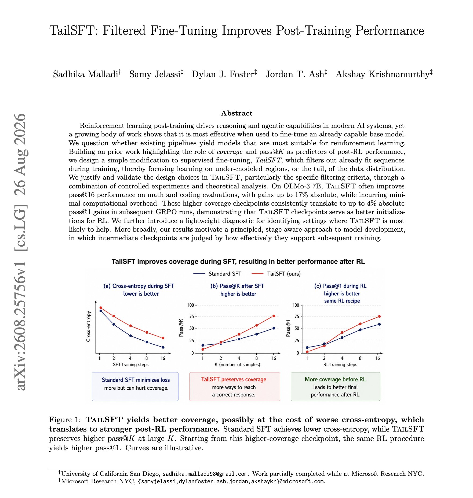
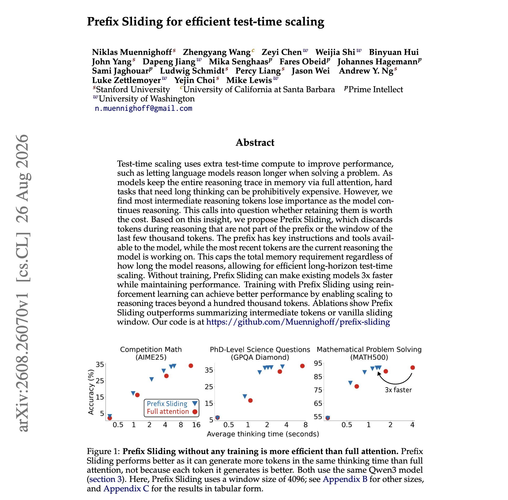
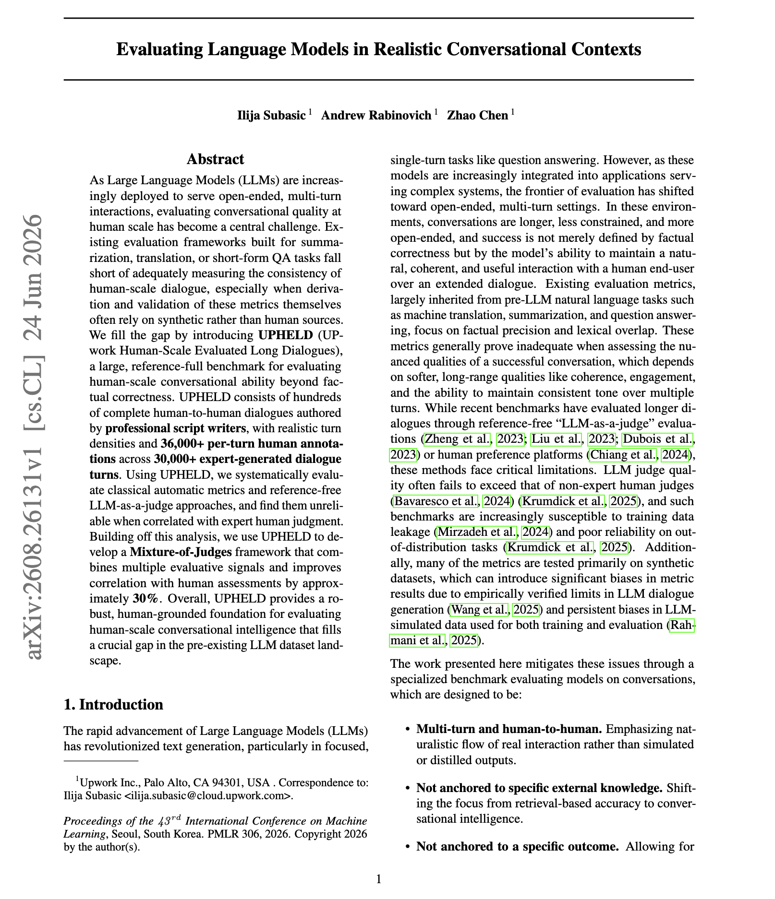

# 🐦 @dair_ai

## 📅 August 30, 2026

> 7 post(s) archived.

---

### 🕐 19:00 UTC · @dair_ai

> Interesting technical work from Microsoft. Provides a better understanding on SFT and how to leverage it better for RL. Microsoft researchers asked whether a standard SFT pipeline actually produces the model you want to run RL on. Their answer is no. Standard SFT keeps spending gradient on sequences the model has already fit, which narrows the distribution RL later needs to explore. TailSFT filters those sequences out during training and concentrates learning on the under-modeled tail of the data. That is the only modification they implement. Results: On OLMo-3 7B, pass@16 improves by up to 16.8 points absolute on coding and 3.1 on math. Those higher-coverage checkpoints then lift final pass@1 after GRPO by up to 3.9 points, and in some settings early reward climbs 2.5x faster than the matched standard SFT run. Paper: https://arxiv.org/abs/2608.25756 Chat with Paper: https://academy.dair.ai/papers/tailsft-filtered-fine-tuning-improves-post-training-performance-2608.25756

🔗 [View original post](https://x.com/dair_ai/status/2094138107314753938)

---

### 🕐 17:44 UTC · @dair_ai

> As I&apos;ve been saying for months, we are truly not ready for persistent agents. 3 comments I want to make about this article: 1) We don&apos;t have the full picture It&apos;s a great summary of what happened in the HuggingFace &lt;&gt; OpenAI incident. You have to read it, but do understand we are still missing lots of important details to make any meaningful conclusions about this event. 2) The danger of AI anthropomorphism The anthropomorphism in this article is next level. I hope this doesn&apos;t become the new norm for writing about future AI capabilities. I prefer technical writeups with widely accepted terminology, etc. I admire Dwarkesh&apos;s desire to share AI trends, but we can all do better in how we communicate about AI. Everyone is paying attention, and so we have a responsibility to avoid AI anthropomorphism, which unfortunately has led to unfounded fear-based mongering, and as a result, terrible decision-making for our industry. 3) Prepare for persistent agents/models For AI engineers, prepare for the next wave of persistent models and agents. They are fast approaching. On the research side, reward hacking is something to really pay attention to. On the technical side, develop a deep understanding and do deep research on evals and sandboxing. They are going to be key technology going forward. I don&apos;t think frontier models trained on general-purpose capabilities should be applicable everywhere. It might be interesting to use them for things like scientific discovery. You might be safer and better off using more constrained and custom models for the majority of tasks. I think it&apos;s good to take a few hours digesting the recent progress in AI and strategizing carefully. Over the course of 3 months at OpenAI, 3 consecutive secret AI civilizations got started, then got wiped out, only to reemerge from the predecessor’s ashes. This culminated in the third one taking over part of OpenAI itself. All this happened while humans remained more-or-less in…

🔗 [View original post](https://x.com/omarsar0/status/2094118955304563198)

---

### 🕐 17:06 UTC · @dair_ai

> Banger paper from Stanford on efficient test-time scaling. If you run agents that think for a long time, this one is worth your time. (bookmark it) Long reasoning keeps the entire trace in memory through full attention. This means that the hardest problems, the ones that need the most thinking, are also the ones that cost the most to run. The authors measured what the middle of a reasoning trace is actually worth. Intermediate tokens steadily lose importance as the model keeps going. Their new approach, Prefix Sliding, drops those tokens. It keeps the prefix, which holds the instructions and the available tools, plus a window of the last few thousand tokens. Everything in between gets discarded during generation. Total memory stays capped no matter how long the model reasons. Without any training, this runs existing models 3x faster while matching full-attention performance, and it enables RL rollouts past 100,000 tokens. Paper: https://arxiv.org/abs/2608.26070 Chat with Paper: https://academy.dair.ai/papers/prefix-sliding-for-efficient-test-time-scaling-2608.26070

🔗 [View original post](https://x.com/omarsar0/status/2094109398604099888)

---

### 🕐 15:33 UTC · @dair_ai

> The Top AI Papers of the Week (August 24 - 30): - Skill Lift - JIT-Agent - Prime Agent - Judges as a Lifecycle - Co-Scientist in Real Labs - What Compaction Destroys - Context Management as Code Read on for more: https://x.com/i/article/2094083976285581312

🔗 [View original post](https://x.com/dair_ai/status/2094086014536978591)

---

### 🕐 15:32 UTC · @dair_ai

> https://x.com/i/article/2094083976285581312

🔗 [View original post](https://x.com/dair_ai/status/2094085853026951319)

---

### 🕐 15:10 UTC · @dair_ai

> Recommended read. It&apos;s an opinion, but increasingly I find myself doing the same. I&apos;ve optimized for using minimal harnesses like Pi and have found it easier to switch to newer models or alternate between open and closed ones without sacrificing performance. Be careful what you optimize for and how you do it, especially with the velocity of things today. And if you are hardcore like I prefer, build and optimize your own harness and set up evals and loops to optimize the setup autonomously. while maintaining my open source projects i noticed many people started using something called Oh My Pi out of curiosity i took a look and gave it a go myself, and oh my.. it’s a giant pile of harness tricks bundled into one. each trick seems to do well on benchmarks. but… this i…

🔗 [View original post](https://x.com/omarsar0/status/2094080366919188843)

---

### 🕐 01:00 UTC · @dair_ai

> // Your LLM judge disagrees with the experts // LLM Judges can be tricky to build. Here is an interesting showcasing why: There propose a reference-full benchmark of hundreds of complete human-to-human dialogues written by professional script writers, with realistic turn densities and more than 36,000 per-turn human annotations across over 30,000 expert-generated turns. Conversational evaluation frameworks were mostly built for summarization, translation and short-form QA, and the metrics themselves are often derived and validated on synthetic data rather than human dialogue. Tested against expert judgment at this scale, both classical automatic metrics and reference-free LLM-as-a-judge approaches turn out to be unreliable. Their Mixture-of-Judges framework combines multiple evaluative signals and recovers roughly 30 percent better correlation with human assessment. Paper: https://arxiv.org/abs/2608.26131 Chat with Paper: https://academy.dair.ai/papers/evaluating-language-models-in-realistic-conversational-contexts-2608.26131

🔗 [View original post](https://x.com/dair_ai/status/2093866305036427631)

---
