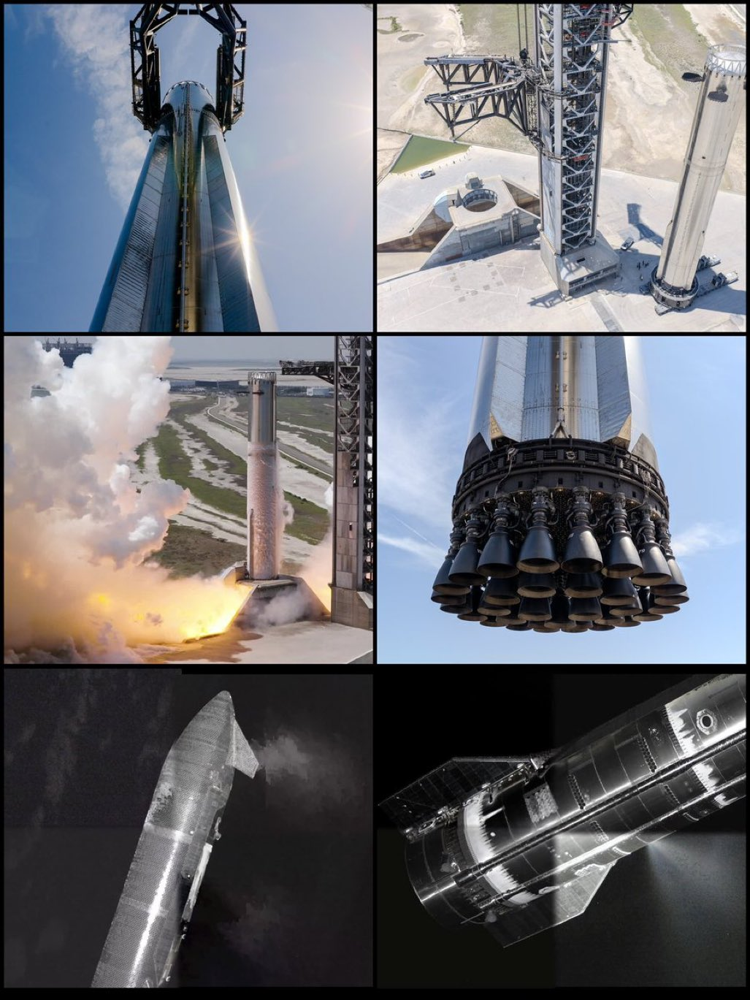

# 🐦 @elonmusk

## 📅 August 30, 2026

> 5 post(s) archived.

---

### 🕐 03:54 UTC · @elonmusk

> The use of 60 seconds and 360 degrees is thousands of years BC old https://grok.com/share/bGVnYWN5_dfaad20f-6716-42a3-a2c2-f4e2f2f0cb26

🔗 [View original post](https://x.com/elonmusk/status/2093910113245380786)

---

### 🕐 00:32 UTC · @elonmusk

> Keeping up with the Kardashevs Elon Musk reveals why, measured against the sun&apos;s energy, human civilization barely registers as existing at all: &quot;Right now we&apos;re very low on the Kardashev one scale. If you say what proportion of our planet&apos;s power are we harnessing, it&apos;s a very, very tiny number. And we&apos;re har…

🔗 [View original post](https://x.com/elonmusk/status/2093859360682262933)

---

### 🕐 00:28 UTC · @elonmusk

> Grok @Bot buys a Tesla! Grok Bot can literally buy things for you on the internet now. Here’s a wild example: @Baconbrix asked Grok Bot to buy him a Tesla, and it actually placed the order for a Model Y. Grok Bot is getting insanely powerful. 🚀

🔗 [View original post](https://x.com/elonmusk/status/2093858309824553395)

---

### 🕐 00:24 UTC · @elonmusk

> Stack for x10 world GPD. And btw should we separate space GDP from world GDP?

🔗 [View original post](https://x.com/brivael/status/2093857250192318892)

---

### 🕐 00:17 UTC · @elonmusk

> True Reusable rockets broke the cost curve, and when the price of orbit collapses, we&apos;re going to open an entire economy above your head. Welcome to [soon] to space.

🔗 [View original post](https://x.com/elonmusk/status/2093855468061925497)

---
