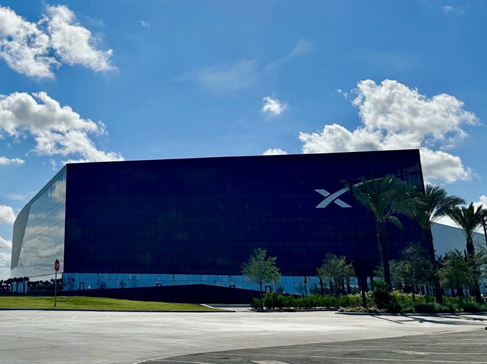
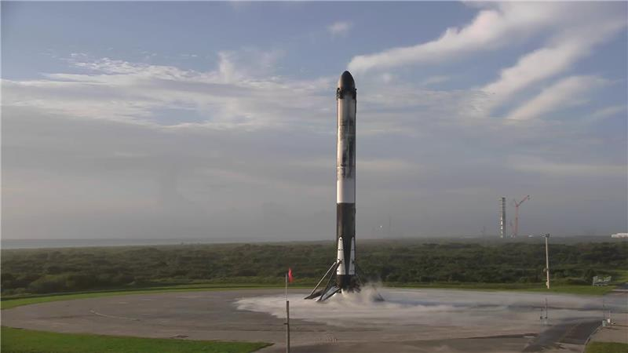

# 🐦 @elonmusk

## 📅 August 30, 2026

> 22 post(s) archived.

---

### 🕐 20:10 UTC · @elonmusk

> I was able to edit and enhance a very specific video clip https://grok.com/share/bGVnYWN5_0e357843-9f62-4e7d-b5dc-770b7ad8f302

🔗 [View original post](https://x.com/elonmusk/status/2094155810234335302)

---

### 🕐 19:38 UTC · @elonmusk

> Try Tesla self-driving. It will improve your quality of life and may save your life. As someone who hates driving and lives in LA, FSD has had a disproportionately positive impact on my quality of life. It’s basically Xanax for the 405.

🔗 [View original post](https://x.com/elonmusk/status/2094147647678431561)

---

### 🕐 19:36 UTC · @elonmusk

> Should say that I personally still find the @Grok app more useful for some tasks than @Bot. Worth trying it out on super tough tasks if you haven’t in a while. https://apps.apple.com/app/id6670324846

🔗 [View original post](https://x.com/elonmusk/status/2094147282434211869)

---

### 🕐 19:20 UTC · @elonmusk

> @cremieuxrecueil Media

🔗 [View original post](https://x.com/elonmusk/status/2094143117507108869)

---

### 🕐 18:24 UTC · @elonmusk

> How to share your Grok @Bot design with others Grok Bot templates are the first widely available way to share knowledge work. A template is a collection of skills, memories, and plugins - you could even call it a &apos;blueprint&apos; or a &apos;workflow&apos; You can teach a bot about your domain and send it to someone as a link. This will fund…

🔗 [View original post](https://x.com/elonmusk/status/2094129094673735922)

---

### 🕐 17:42 UTC · @elonmusk

> I hope you like this short (very realistic) film that my son made using Grok Imagine Grok Imagine and kids are a winning combo We adults have certain hangups when it comes to using AI that the next generation won&apos;t even consider. They&apos;ll just be creating Media

🔗 [View original post](https://x.com/KettlebellDan/status/2094118586147029070)

---

### 🕐 17:00 UTC · @elonmusk

> Been building out my army of personal assistant bots using (@bot). Thus far I have a: - House bot - keeps track of everything related to properties: taxes, HOA fees, maintenance, assessment values etc. It can email / call / schedule things as needed on my behalf. - Finance bot - this one needs work. I wish there was a Plaid integration for Grok bot. But the goal is to track spend. Right now it&apos;s not really doing much ... - LP bot - manages all paperwork personal LP investments - Family bot - I&apos;ve already gotten in trouble with this one. But it helps me make sure I&apos;m making enough space and time for my family. Checks my calendar, makes sure I have enough time for wife, kids etc. - News bot - aggregates news from X, traditional media etc. - Manager bot - helps manage all the other bots. Reports activity, and distributes tasks. This is all still experimental. But if it turns out to work well, will make the templates public.

🔗 [View original post](https://x.com/martin_casado/status/2094107975057330298)

---

### 🕐 15:19 UTC · @elonmusk

> Grok providing schooling in El Salvador FULL INTERVIEW: Jen Kha says El Salvador gave every school free Grok and is deploying AI doctors. She says countries nobody expects are now outpacing America on adoption while America fights over data centers. @jkhamehl is a managing partner and head of global partnerships at @a1…

🔗 [View original post](https://x.com/elonmusk/status/2094082671848673690)

---

### 🕐 15:12 UTC · @elonmusk

> But we do need to act much faster than that if people still want to live where the beach is today. We have about 50 years or so to take action, which should be more than enough time for the space satellites to solve any heating problems. https://grok.com/share/bGVnYWN5_2e243c73-d37b-49e5-9060-0fb9343a2336

🔗 [View original post](https://x.com/elonmusk/status/2094080730837983318)

---

### 🕐 15:00 UTC · @elonmusk

> Extremely severe extinction events happen every 100M years or so and just switching to sustainable energy will not be enough to stop them. Space satellites to control temperature and massive geo-engineering will be needed or it will be game over. https://grok.com/share/bGVnYWN5_dfaad20f-6716-42a3-a2c2-f4e2f2f0cb26 @xenocosmography And that is, of course, how it will be done. Sentient satellites, launched into Earth-Sun Lagrange points by mass drivers on the Moon, can solve global warming for ~1B years.

🔗 [View original post](https://x.com/elonmusk/status/2094077799719993646)

---

### 🕐 14:44 UTC · @elonmusk

> Falcon Heavy launches exploration misison Falcon Heavy sent Psyche toward a metal-rich asteroid, Europa Clipper to Jupiter’s Moon, and GOES-U into transfer orbit to improve NOAA’s weather forecasting. Falcon 9 launched NASA’s PACE mission to study Earth’s ocean and atmosphere and SPHEREx to map the history of the univers…

🔗 [View original post](https://x.com/elonmusk/status/2094073761485988104)

---

### 🕐 12:31 UTC · @elonmusk

> BREAKING: SpaceX gets approval for 444 acres near the Port of Brownsville, clearing the way for a major expansion. The city also approved a major infrastructure agreement with SpaceX: • Up to $220 million for regional water and wastewater projects • An initial $40 million escrow contribution • Six additional quarterly payments of $30 million each • Projects capable of adding around 18 million gallons of water supply per day • Funding for water reuse, wastewater reclamation and expansion of the Southmost Regional Water Authority plant This is much bigger than a land deal. SpaceX is helping build critical infrastructure that could strengthen South Texas for generations.

🔗 [View original post](https://x.com/cb_doge/status/2094040350675661114)

---

### 🕐 12:22 UTC · @elonmusk

> Roman is on her way. 🚀 Years of work, extraordinary engineering, and one incredible launch. Congratulations to the entire @NASA team and our partners who made this mission possible. The Nancy Grace Roman Space Telescope is about to open an entirely new window into our universe. Acquisition of signal confirmed for our @NASARoman telescope. We have spacecraft separation, and a last look at Roman, now flying on its own. https://go.nasa.gov/4chzg9c

🔗 [View original post](https://x.com/NASAAdmin/status/2094038136493834464)

---

### 🕐 11:53 UTC · @elonmusk

> Falcon Heavy’s side boosters landed on LZ-2 and LZ-40

🔗 [View original post](https://x.com/SpaceX/status/2094030749485646043)

---

### 🕐 07:32 UTC · @elonmusk

> Which frontier AI model company is most likely to create an AI that causes serious harm?

🔗 [View original post](https://x.com/WR4NYGov/status/2093965160566411505)

---

### 🕐 07:02 UTC · @elonmusk

> &quot;Elon Musk is not a danger to democracy, George Soros is.” @GiorgiaMeloni Media

🔗 [View original post](https://x.com/teslaownersSV/status/2093957413963796764)

---

### 🕐 05:11 UTC · @elonmusk

> After Grok @bot keeps my Gmail so clean, I am so unused to the spam-free inbox.

🔗 [View original post](https://x.com/yunta_tsai/status/2093929657683038668)

---

### 🕐 03:54 UTC · @elonmusk

> The use of 60 seconds and 360 degrees is thousands of years BC old https://grok.com/share/bGVnYWN5_dfaad20f-6716-42a3-a2c2-f4e2f2f0cb26

🔗 [View original post](https://x.com/elonmusk/status/2093910113245380786)

---

### 🕐 00:32 UTC · @elonmusk

> Keeping up with the Kardashevs Elon Musk reveals why, measured against the sun&apos;s energy, human civilization barely registers as existing at all: &quot;Right now we&apos;re very low on the Kardashev one scale. If you say what proportion of our planet&apos;s power are we harnessing, it&apos;s a very, very tiny number. And we&apos;re har…

🔗 [View original post](https://x.com/elonmusk/status/2093859360682262933)

---

### 🕐 00:28 UTC · @elonmusk

> Grok @Bot buys a Tesla! Grok Bot can literally buy things for you on the internet now. Here’s a wild example: @Baconbrix asked Grok Bot to buy him a Tesla, and it actually placed the order for a Model Y. Grok Bot is getting insanely powerful. 🚀

🔗 [View original post](https://x.com/elonmusk/status/2093858309824553395)

---

### 🕐 00:24 UTC · @elonmusk

> Stack for x10 world GPD. And btw should we separate space GDP from world GDP?

🔗 [View original post](https://x.com/brivael/status/2093857250192318892)

---

### 🕐 00:17 UTC · @elonmusk

> True Reusable rockets broke the cost curve, and when the price of orbit collapses, we&apos;re going to open an entire economy above your head. Welcome to [soon] to space.

🔗 [View original post](https://x.com/elonmusk/status/2093855468061925497)

---
