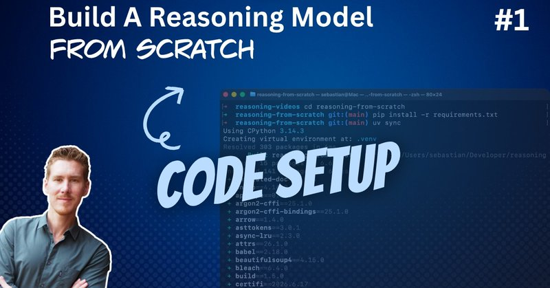

# 🐦 @rasbt

## 📅 August 30, 2026

> 2 post(s) archived.

---

### 🕐 13:43 UTC · @rasbt

> And a link to the youtube version: https://www.youtube.com/watch?v=Kh9mqTzjuEQ

🔗 [View original post](https://x.com/rasbt/status/2094058368755290516)

---

### 🕐 13:40 UTC · @rasbt

> A little video that - explains the relationship between conventional LLMs and reasoning models (and agents), - philosophizes a about &quot;from scratch&quot; approaches, - and explains how to install Python &amp; PyTorch requirements with uv. Media

🔗 [View original post](https://x.com/rasbt/status/2094057793506439492)

---
