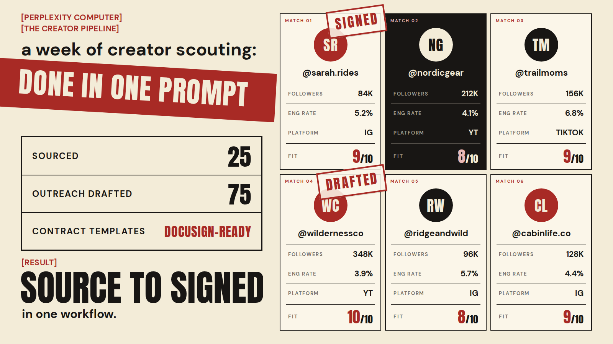

# 🐦 @AiEvolutio58513

## 📅 August 31, 2026

> 3 post(s) archived.

---

### 🕐 15:42 UTC · @AiEvolutio58513

> Computer handles the sourcing, outreach, rate model, and contract workflow. You still own every creator relationship: briefing, shipping product, reviewing content, managing the partnership. Sourcing prompt in the tweet below + a free trial of Computer here: https://pplx.ai/chase-dimond-x-1-a

🔗 [View original post](https://x.com/ecomchasedimond/status/2094450639543947685)

---

### 🕐 15:42 UTC · @AiEvolutio58513

> Here&apos;s the creator sourcing prompt: https://drive.google.com/file/d/1fCu62JF0s4L9QbpwvHVGHm-aDFSlYTbq/view?usp=drive_link

🔗 [View original post](https://x.com/ecomchasedimond/status/2094450641188106620)

---

### 🕐 15:41 UTC · @AiEvolutio58513

> 25 creators sourced. 75 personalized outreach messages drafted. Bid ranges modeled. Contract templates drafted and mapped to DocuSign, ready to wire up once terms are agreed. One afternoon using Perplexity Computer. This is the workflow I have been most excited to write up.

🔗 [View original post](https://x.com/ecomchasedimond/status/2094450627166531602)

---
