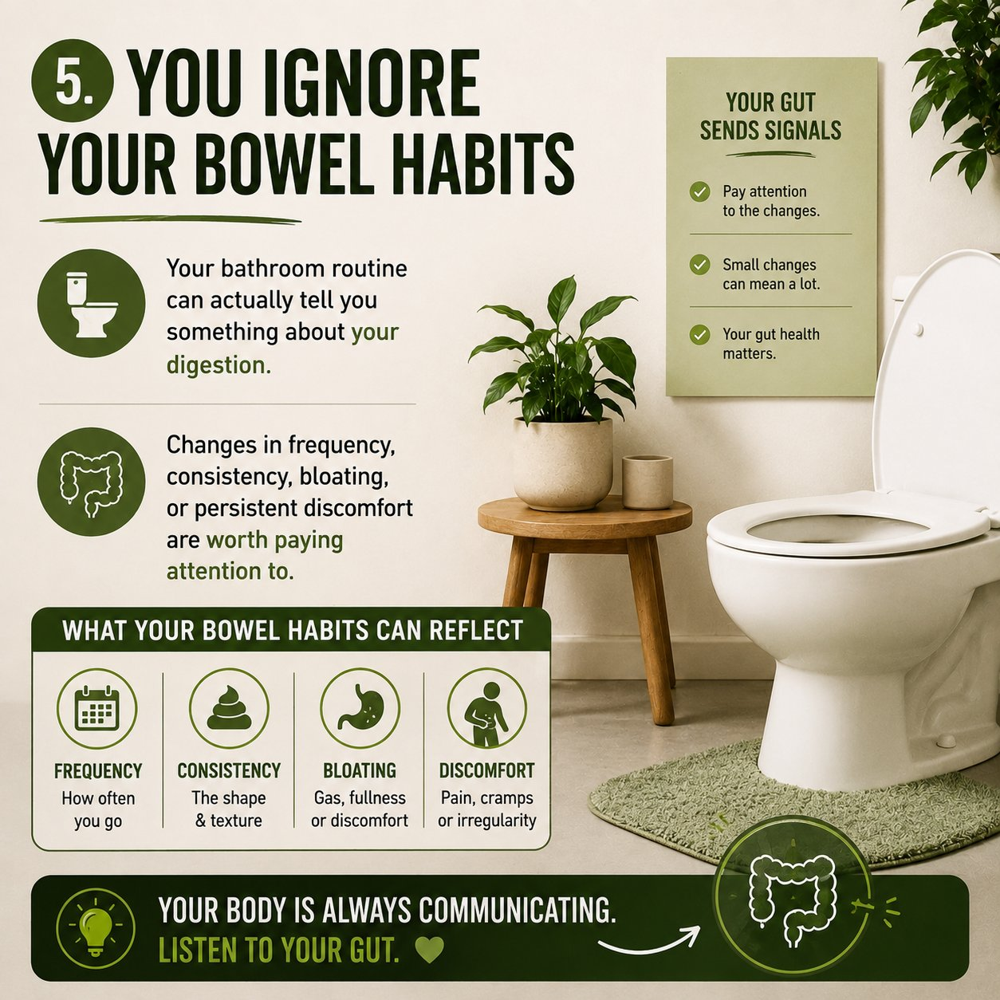
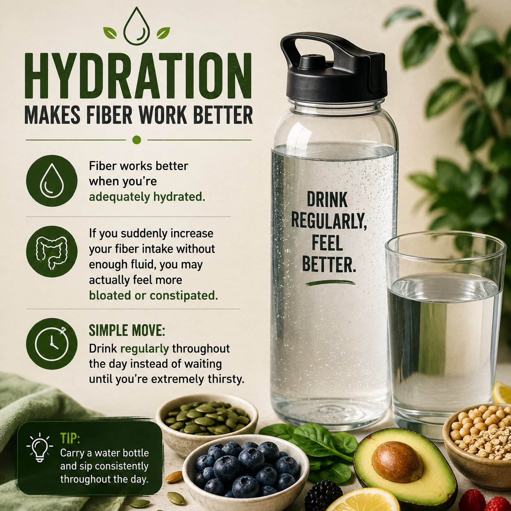
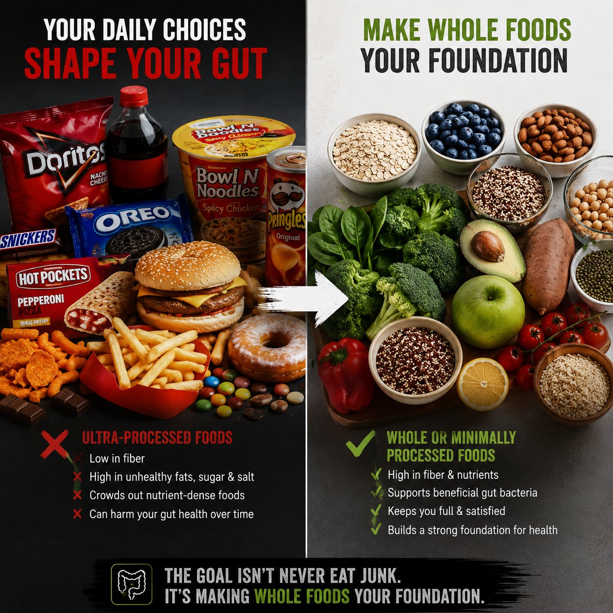
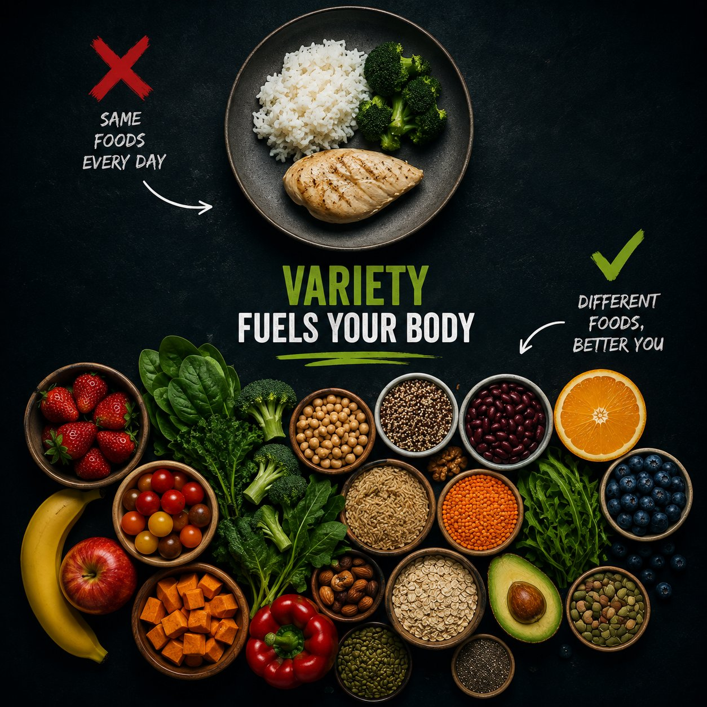
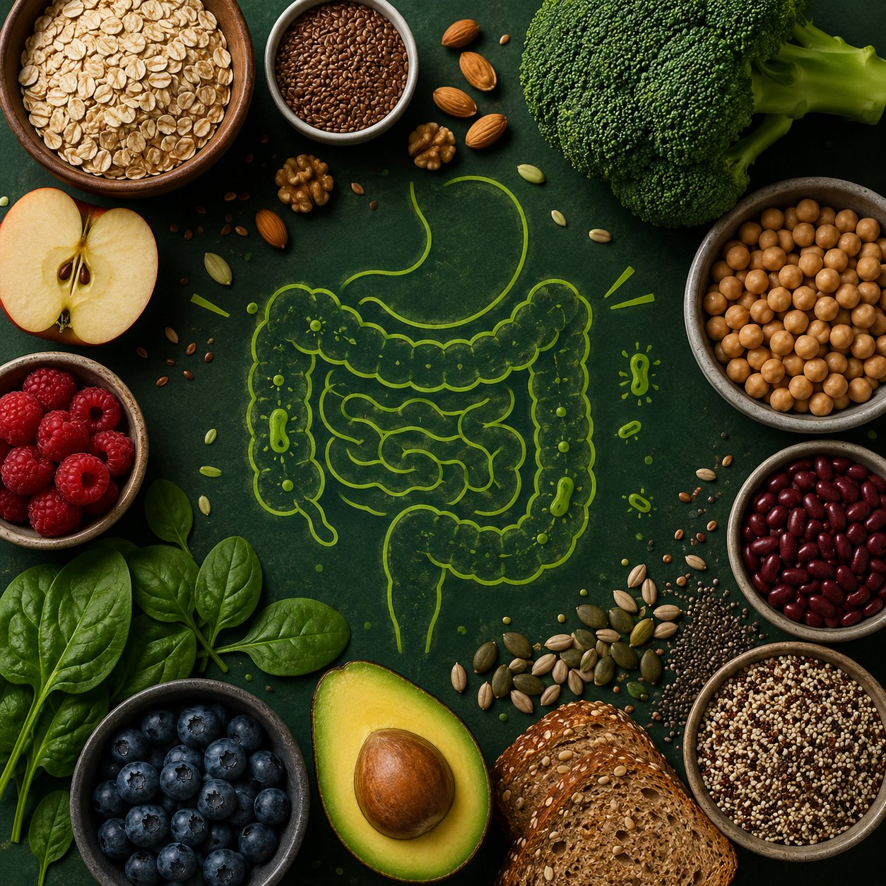
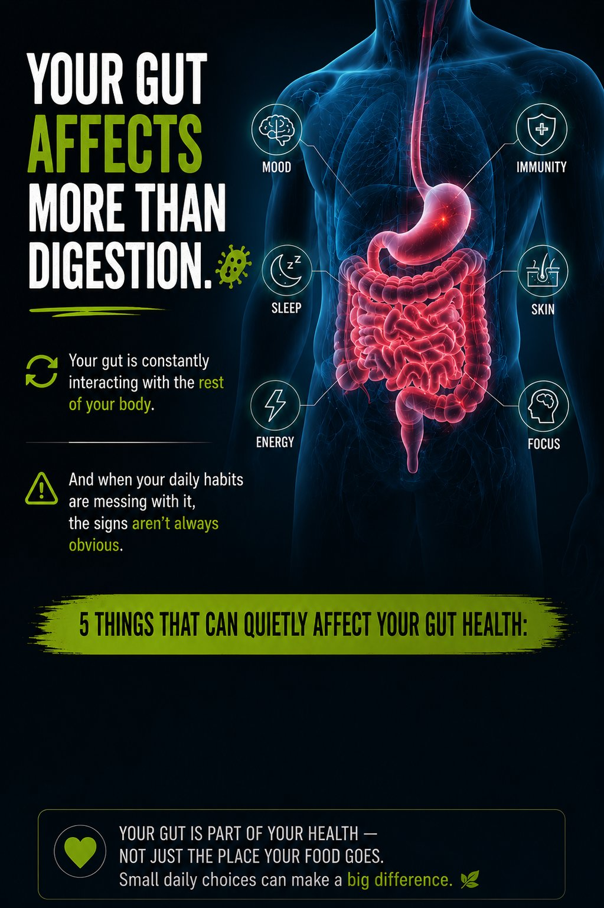
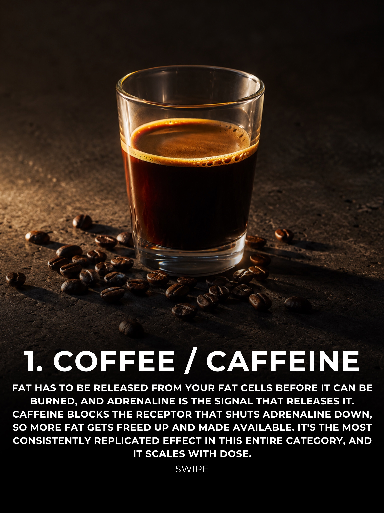

# 🐦 @Unlockyourlife_

## 📅 August 31, 2026

> 15 post(s) archived.

---

### 🕐 09:11 UTC · @Unlockyourlife_

> 🔥 ABS WORKOUT Want stronger, more defined abs? Don’t just focus on crunches—train your entire core with controlled movements and proper form. Try exercises like leg raises, mountain climbers, plank variations, and bicycle crunches. 💪 Stay consistent, control every rep, and remember: a strong core is built with regular training and good nutrition. Save this workout and give your abs some work today! 🔥 Media

🔗 [View original post](https://x.com/BioLifex/status/2094352245785534801)

---

### 🕐 08:39 UTC · @Unlockyourlife_

> Your gut is part of your health — not just the place your food goes. Small changes in what you eat every day can make a bigger difference than constantly looking for a “gut detox.” 🥗🦠 Feed your body well, give your gut some variety, and pay attention to what it’s telling you.

🔗 [View original post](https://x.com/_fitnesshub/status/2094344390420439372)

---

### 🕐 08:39 UTC · @Unlockyourlife_

> 5. You ignore your bowel habits Your bathroom routine can actually tell you something about your digestion. Changes in frequency, consistency, bloating, or persistent discomfort are worth paying attention to.

🔗 [View original post](https://x.com/_fitnesshub/status/2094344387039834200)

---

### 🕐 08:39 UTC · @Unlockyourlife_

> 4. You don’t drink enough fluids Fiber works better when you’re adequately hydrated. If you suddenly increase your fiber intake without enough fluid, you may actually feel more bloated or constipated. Simple move: Drink regularly throughout the day instead of waiting until you’re extremely thirsty.

🔗 [View original post](https://x.com/_fitnesshub/status/2094344381226504524)

---

### 🕐 08:39 UTC · @Unlockyourlife_

> 3. You’re constantly eating ultra-processed foods Not every processed food is bad, but a diet dominated by highly processed foods can crowd out fiber-rich, nutrient-dense foods. The goal isn’t “never eat junk.” It’s making whole or minimally processed foods the foundation of your diet.

🔗 [View original post](https://x.com/_fitnesshub/status/2094344373664207167)

---

### 🕐 08:39 UTC · @Unlockyourlife_

> 2. Your diet has almost no variety Eating the same few foods every day can mean you’re missing different types of nutrients and fibers. Think: Different fruits + vegetables + legumes + whole grains. Your gut bacteria benefit from a diverse range of plant foods.

🔗 [View original post](https://x.com/_fitnesshub/status/2094344367850832355)

---

### 🕐 08:39 UTC · @Unlockyourlife_

> 1. You barely eat fiber Vegetables, fruits, beans, whole grains and other plant foods provide fiber that supports healthy digestion and beneficial gut bacteria. Try this: Add at least one high-fiber food to each major meal.

🔗 [View original post](https://x.com/_fitnesshub/status/2094344362872160597)

---

### 🕐 08:39 UTC · @Unlockyourlife_

> Your gut affects more than digestion. 🦠 Your gut is constantly interacting with the rest of your body. And when your daily habits are messing with it, the signs aren’t always obvious. 5 things that can quietly affect your gut health:

🔗 [View original post](https://x.com/_fitnesshub/status/2094344356761141478)

---

### 🕐 08:32 UTC · @Unlockyourlife_

> 6 FOODS DIRECTLY PROVEN TO INCREASE FAT BURNING 1. Coffee

🔗 [View original post](https://x.com/FitnessDr_/status/2094342581060571560)

---

### 🕐 08:22 UTC · @Unlockyourlife_

> Removing older aloe leaves will make it grow faster. Media

🔗 [View original post](https://x.com/_learnskills/status/2094340015455121867)

---

### 🕐 07:46 UTC · @Unlockyourlife_

> Never... Don&apos;t make someone pay for the mistakes of everyone you&apos;ve dated before them. If you&apos;ve been cheated on, lied to or manipulated, your caution makes sense. But suspicion isn&apos;t the same as protection. Give people the opportunity to show you who they are while keeping reasonable boundaries. Trust should be built from evidence, not forced by fear.

🔗 [View original post](https://x.com/Masculinjournal/status/2094330882098160046)

---

### 🕐 07:15 UTC · @Unlockyourlife_

> Amazing DIY Science Magic Machine! Media

🔗 [View original post](https://x.com/sciencepathx/status/2094323259420414220)

---

### 🕐 07:13 UTC · @Unlockyourlife_

> Right Way To Repair this! Media

🔗 [View original post](https://x.com/Smart_Tipsx/status/2094322722146758807)

---

### 🕐 07:11 UTC · @Unlockyourlife_

> Travel Hack ✈️ I always pack my chargers like this when I travel. Media

🔗 [View original post](https://x.com/samx_reels/status/2094322193408594090)

---

### 🕐 07:07 UTC · @Unlockyourlife_

> Kitchen Sink not Draining! Media

🔗 [View original post](https://x.com/_Brainboxx/status/2094321232384598316)

---
