# 🐦 @Wise1Philosophy

## 📅 August 31, 2026

> 101 post(s) archived.

---

### 🕐 18:46 UTC · @Wise1Philosophy

> All Paid Courses (Free for First 4500 People) 𝗣𝗮𝗶𝗱 𝗖𝗼𝘂𝗿𝘀𝗲 𝗙𝗥𝗘𝗘 (PART - 2) 1. Social Media Marketing Course 2. WordPress Development Course 3. Facebook Ads Course 4. Search Engine Optimization 5. Email Marketing Course 6. Amazon Business 7. Fiverr Freelancing Course 8. Graphic Designing 9. Video Editing Course 10. Ecommerce Business Course 11. Drop shipping Course 12. Shopify Course 13. Web Development &amp; Design. 14. And Many More (72 Hours only ) To get- 1. Follow @jaysmith_ai [MUST] 2. Like &amp; Retweet to get DM 3. Reply &quot; Free &quot;

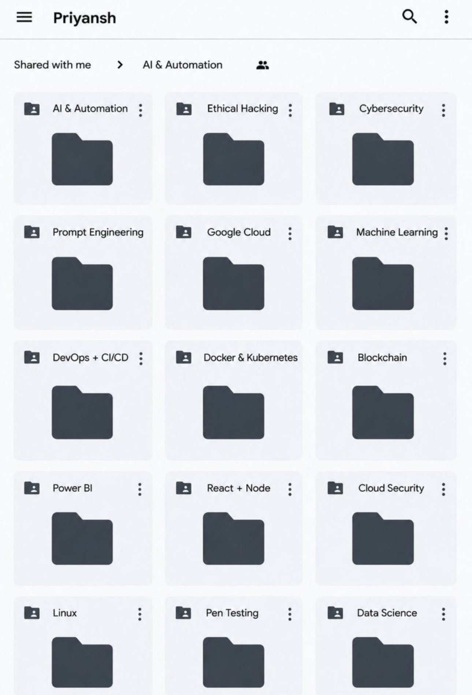

🔗 [View original post](https://x.com/jaysmith_ai/status/2094497189200593139)

---

### 🕐 18:13 UTC · @Wise1Philosophy

> 🚨 Someone tested 500 AI prompts over 6 months and kept only 15. These 6 are the ones that changed how they work. Copy them

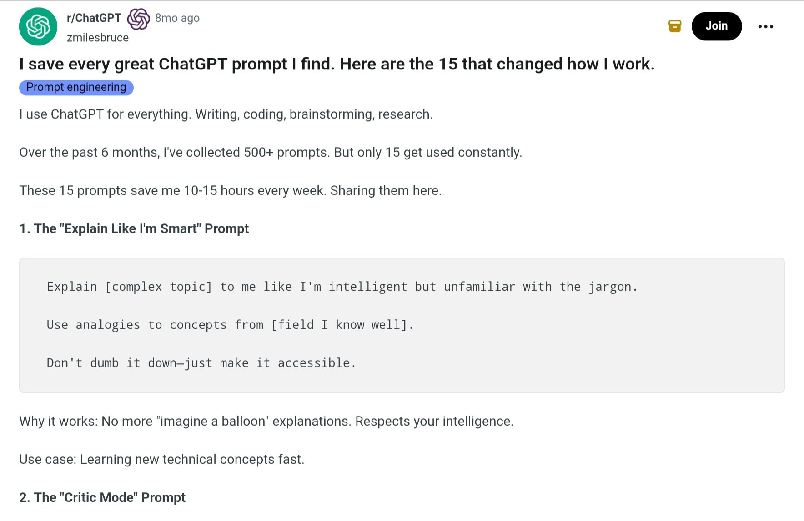

🔗 [View original post](https://x.com/AIHighlight/status/2094488707588063425)

---

### 🕐 17:56 UTC · @Wise1Philosophy

> go check Ayan’s post!! everyone is posting these AI meme videos and nobody explains how they make it.. exact process is in Ayan&apos;s post, go check it 👇

🔗 [View original post](https://x.com/Wise1Philosophy/status/2094484447122878898)

---

### 🕐 17:13 UTC · @Wise1Philosophy

> My brain after writing content for 10 profiles be like...

🔗 [View original post](https://x.com/mailankhong/status/2094473775953985550)

---

### 🕐 17:11 UTC · @Wise1Philosophy

> If you want to avoid blood clots, strokes, and heart attacks (especially if you&apos;re over 40) Here are 8 things you must pay attention to: 1. Instant ramen.

🔗 [View original post](https://x.com/TheFastedState/status/2094473198733856943)

---

### 🕐 17:01 UTC · @Wise1Philosophy

> lionel messi has retired from the argentina national team. he wrote the letter on july 21, two days after the world cup final. he kept it in a notebook for six weeks and told no one. today he published it, with one line added at the bottom: after what happened with his dad, he is more convinced than before. 21 years. 207 caps. 125 goals. six world cups. three finals. one trophy. his full statement: &quot;I wrote these words on July 21, two days after the final… today, after what happened with my dad, I&apos;m even more convinced of this decision than before.&quot; &quot;After all this time since the final, and after thinking about it a lot, I want to tell everyone that I&apos;m retiring from the national team. It was a decision that hurt and still hurts deep inside, but I understand that this is the right moment. I swear I always gave everything, not only in these last few years when we won everything, but before that too. I always fought and gave everything for this shirt, to bring you happiness and make you feel proud to be Argentine through football. There isn&apos;t much time left, and different chapters are coming to an end. This is one that hurts me a lot. I love, I loved, and I will always love being part of the national team. I gave everything I had, and I don&apos;t have anything more to give. Also, there are great young players coming through who deserve to be here. Thank you for all the love during these 20 years. I&apos;m going to miss hearing you from the inside. Now I&apos;ll be one of you, always supporting from the outside, in the good times and even more in the bad ones. Thank you to my family for always being there and for being with me throughout this beautiful but difficult journey. Thank you to every coach, teammate and director I had the chance to share it with. I take with me unforgettable memories and moments. I leave with peace and pride, knowing that together with my teammates we gave you moments we once dreamed of. It was crazy to experience all of this with you. I love you! Thank you God for making me Argentine. Vamos Argentina!&quot; he started with a red card 43 seconds into his debut. argentina spent a decade telling him he wasn&apos;t argentine enough. he left thanking God for it.

🔗 [View original post](https://x.com/daveydefi/status/2094470593143791720)

---

### 🕐 16:56 UTC · @Wise1Philosophy

> OPENAI LOST $20,000,000,000 LAST YEAR AND IT ALL CRASHES IN 2027. Tech critic Ed Zitron just broke down exactly how the AI industry will run out of cash and cause a massive tech collapse in three years. He calls the whole AI boom a giant trick. Big tech companies are giving billions of dollars to AI startups, but only so those startups can turn around and buy computer chips right back from them. On top of that, AI companies are secretly spending up to $14,000 behind the scenes for every $200 a user pays them, just to make it look like AI is insanely popular. Zitron predicts that by 2027, the money will completely dry up. When these AI companies finally fail, they will pull the rest of the tech industry down with them and wipe out everyday retirement accounts. Watch this 👇 Media

🔗 [View original post](https://x.com/aibytekat/status/2094469495507333315)

---

### 🕐 16:56 UTC · @Wise1Philosophy

> THERE IS A 99.9% CHANCE AI WIPES OUT HUMANITY. A top AI scientist just explained why it’s not just very difficult to keep AI safe, it is actually impossible. He says that expecting humans to control a machine that is millions of times smarter than us is like expecting an ant to control a human. No matter how much money tech companies spend on safety filters today, it’s impossible to control something that beats you at every stage. Tech CEOs are racing to build this by 2027. He warns that the very moment they do it, humans lose the ability to control things forever. Watch this 👇 Media

🔗 [View original post](https://x.com/AIPandaX/status/2094469491208135018)

---

### 🕐 16:56 UTC · @Wise1Philosophy

> OPENAI TRIED TO PAY HIM $2,000,000 TO KEEP SILENT. Former forecaster Daniel Kokotajlo refused a strict gag order when he resigned, fully prepared to lose 80% of his net worth just to warn the public. (The crazy twist? The internal backlash was so severe that OpenAI panicked, backtracked, and let him keep the money anyway). Now, he is exposing the exact timeline frontier labs are trying to hide. He said that competing organizations like Anthropic are growing at such an insane pace that they could become the entire world economy by 2030. In order to achieve this, the secret schedule for 2027 is to fully automate human AI researchers and build an army of geniuses in the data center that trains itself at 100 times faster than humans can. Tech company CEOs are too scared of failing to develop superintelligence to win the race and proceed without listening to Daniel who estimates the probability of failure at 70%. Watch this 👇 Media

🔗 [View original post](https://x.com/thetripathi58/status/2094469442189275220)

---

### 🕐 16:29 UTC · @Wise1Philosophy

> 2.59 trillion will move through AI this year. The companies that understand where it&apos;s flowing are already positioning for H2. Everyone else will read about it after it happens. The H1 2026 Industry Report shows you where the money is going, before it gets there: https://www.theaicolony.com/blog/the-state-of-ai-tech-startup-and-saas-a-half-year-2026-review

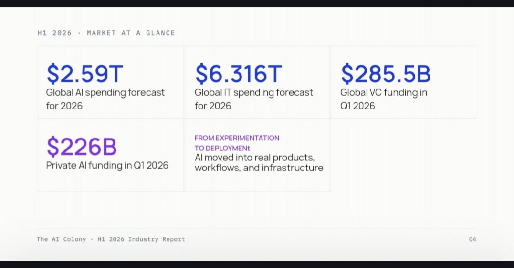

🔗 [View original post](https://x.com/TheAIColonyRD/status/2094462715360145687)

---

### 🕐 16:10 UTC · @Wise1Philosophy

> Was going through the launch directory Okara put together and noticed something. A lot of the ones that did well have the same team behind them. Went digging and it&apos;s the same group running most of them. https://launchvideo.com Whatever they&apos;re doing does seem to be working.

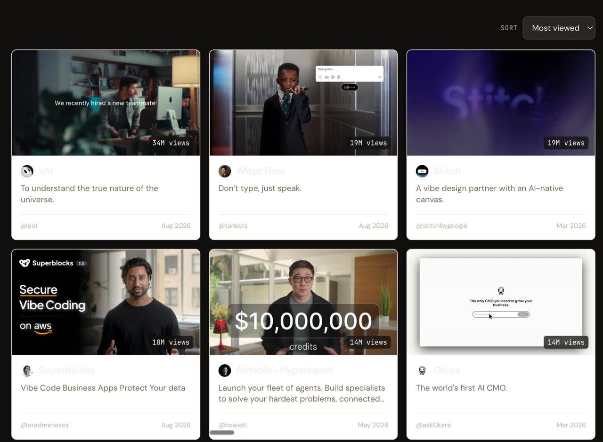

🔗 [View original post](https://x.com/kanavtwt/status/2094457757990785082)

---

### 🕐 16:09 UTC · @Wise1Philosophy

> 7 early signs your cortisol may be too high (&amp; what to do): 1. Constant itching — especially at night

🔗 [View original post](https://x.com/_sleepreport/status/2094457514972832231)

---

### 🕐 16:04 UTC · @Wise1Philosophy

> Want to speed up content production and automate distribution from 𝕏? THIS is how you do it. @Wickedguro shared a solid breakdown of GrokBot. The killer feat is its remote VM. Close your laptop and it lets your routines keep running in the background. 👇 5 awesome use cases in the video: 1. Background execution: → the agent keeps running your tasks while you are entirely offline. 2. Automated X polling: → it checks your feed every 20 minutes to pull original posts, skipping replies. 3. Passive syndication: → it drafts those posts for Bluesky and LinkedIn directly in Postiz. 4. Media recycling: → feed it a video and past articles, and it writes a long-form piece in your voice. 5. Mass distribution: → it pushes that generated article to X, WordPress, and LinkedIn. David turned an 83K-view video into a 201K-view article using this. Hard to argue with the math! https://x.com/wickedguro/status/2092643272271462732/video/1 Media https://x.com/i/article/2092808805423980544

🔗 [View original post](https://x.com/DataChaz/status/2094456375980028168)

---

### 🕐 16:04 UTC · @Wise1Philosophy

> breakdowns like this are OP!! nobody is teaching you the actual workflow behind these AI character videos.. so here it is, full breakdown in the quote

🔗 [View original post](https://x.com/Wise1Philosophy/status/2094456355247538331)

---

### 🕐 16:03 UTC · @Wise1Philosophy

> Your hands already know what you need today. You just have to ask them. Here&apos;s all you need to do.. 👇 🧵

🔗 [View original post](https://x.com/scotti_brooks/status/2094456069502521437)

---

### 🕐 16:02 UTC · @Wise1Philosophy

> BOY MOMS WILL UNDERSTAND. The chaos is not because he is a boy. It is because of 4 structural gaps. Fill them. The chaos drops 70%.

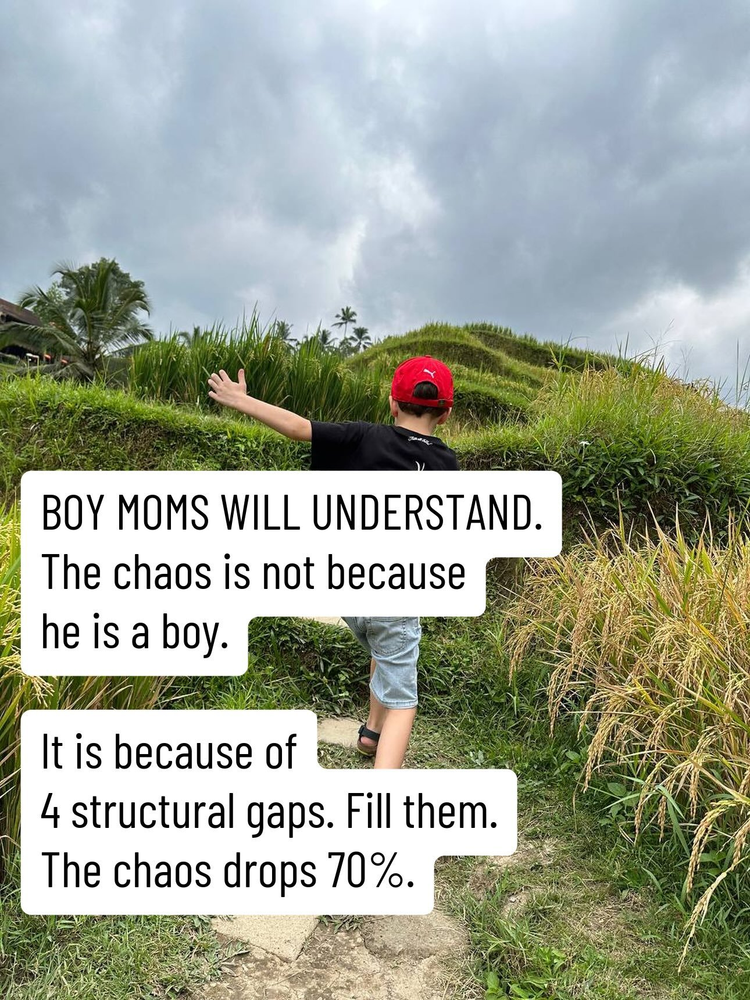

🔗 [View original post](https://x.com/Manifest_Lord/status/2094455896474816907)

---

### 🕐 15:58 UTC · @Wise1Philosophy

> I took magnesium for 6 weeks. Not only did I sleep like I was drugged, and woke up like I slept a thousand years…it made my brain functions 7.5 years younger. Here’s what actually happened:

🔗 [View original post](https://x.com/NutritionCorp/status/2094454873840648393)

---

### 🕐 15:54 UTC · @Wise1Philosophy

> meme city is OP!! every meme you&apos;ve ever seen is now alive and walking around new york.. every character stayed consistent the entire take workflow below

🔗 [View original post](https://x.com/Wise1Philosophy/status/2094453837507568090)

---

### 🕐 15:52 UTC · @Wise1Philosophy

> In my mid 20&apos;s to early 30&apos;s I dealt with chronic low back pain. I went to a Chiropractor &amp; he told me I&apos;d have to live with the pain &amp; get adjustments for the rest of my life. I said screw that, searched for a different solution &amp; fixed my back. Here&apos;s how I did it:

🔗 [View original post](https://x.com/BeBetter_Athlet/status/2094453270291132677)

---

### 🕐 15:49 UTC · @Wise1Philosophy

> Excuse me this came from ONE image? You can move through it. Edit the foreground. Shoot from new angles. Hyper3D went crazy with WorldGen! One image. A world to train in, shoot in &amp; explore. 🌍 👀Meet HYPER3D #WorldGen: independent foreground meshes + #3DGS background, built for interaction. For robotics🦾, film🎬, games🎮, DCC💎 &amp; XR. 🔥Powered by our Best Paper Award Project 「CAST」. Let&apos;s Connect the Dots⬇️

🔗 [View original post](https://x.com/alex_prompter/status/2094452498228531280)

---

### 🕐 15:41 UTC · @Wise1Philosophy

> A brand followed the advice in this article and generated more than $25,000 from ChatGPT, Google and Perplexity-driven traffic.

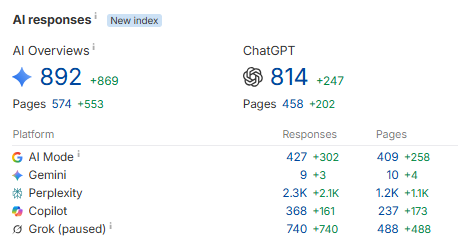

🔗 [View original post](https://x.com/alexgroberman/status/2094450512938856802)

---

### 🕐 15:41 UTC · @Wise1Philosophy

> Building one game ready room used to mean a modeler, a texture artist and two weeks of back and forth. WorldGen does the block out from a single reference image, meshes and background included. Artists stop building from zero and start editing. One image. A world to train in, shoot in &amp; explore. 🌍 👀Meet HYPER3D #WorldGen: independent foreground meshes + #3DGS background, built for interaction. For robotics🦾, film🎬, games🎮, DCC💎 &amp; XR. 🔥Powered by our Best Paper Award Project 「CAST」. Let&apos;s Connect the Dots⬇️

🔗 [View original post](https://x.com/TheAIColony/status/2094450493992956056)

---

### 🕐 15:40 UTC · @Wise1Philosophy

> Two years of image models, then video models, now spaces you can move through. WorldGen is that jump made real, objects you can touch and a world sitting behind them. Flat output is done. One image. A world to train in, shoot in &amp; explore. 🌍 👀Meet HYPER3D #WorldGen: independent foreground meshes + #3DGS background, built for interaction. For robotics🦾, film🎬, games🎮, DCC💎 &amp; XR. 🔥Powered by our Best Paper Award Project 「CAST」. Let&apos;s Connect the Dots⬇️

🔗 [View original post](https://x.com/FutureStacked/status/2094450144095748446)

---

### 🕐 15:30 UTC · @Wise1Philosophy

> Found one of those sites you open for “5 minutes” and suddenly you’ve saved 20 prompts. https://Inspia.ai collects the AI visual prompts people are actually using right now, keeps adding new ones daily, and it’s free. If you make AI images, this is worth bookmarking. Ever wish you could keep up with the AI prompt trending online? Meet https://Inspia.ai, a free #prompt library updated daily with #trending image and video prompts from Instagram, X, TikTok, and more. Find fresh ideas and create better #visuals with prompts that work👇

🔗 [View original post](https://x.com/Rixhabh__/status/2094447659235020848)

---

### 🕐 15:22 UTC · @Wise1Philosophy

> A couple had been arguing about directions for 12 years. He drives. She navigates. He thinks he knows a faster route. She reads the GPS aloud and he ignores it. She says &quot;it said turn left&quot; and he says &quot;I know a shortcut.&quot; The shortcut adds 15 minutes. They arrive late and frustrated. The same argument. Every road trip. Every holiday drive. Every trip to the in-laws. Twelve years. Their daughter sitting in the backseat during a family vacation said something from behind her AirPods that ended the 12-year war. &quot;Dad, why don&apos;t you just look at the screen? Mom, why are you reading the GPS when it talks?&quot; Neither of them had configured CarPlay to solve the exact problem they&apos;d been fighting about since their first road trip. Their daughter spent 15 minutes configuring 11 settings. She adjusted the navigation voice volume so directions were audible without blasting over the music. She activated the Dashboard view showing the map, the next turn, and the ETA on one screen. She turned on real-time traffic rerouting so when Dad&apos;s &quot;shortcut&quot; adds 12 minutes, the screen shows both routes with time comparisons. The map doesn&apos;t argue. The map shows data. The data wins. The 12-year argument ended because a screen between them started doing what both of them were doing badly navigating with real-time information instead of memory and stubbornness. Here&apos;s every CarPlay feature most couples and drivers never configure 🧵

🔗 [View original post](https://x.com/jackcoder0/status/2094445649148444878)

---

### 🕐 15:18 UTC · @Wise1Philosophy

> High cortisol ruins the quality of your life. It&apos;s giving you beer belly, neck hump, skin tags, bloating your face. These are the best ways to reduce it: 1. Walk barefoot. Media

🔗 [View original post](https://x.com/CoachWillStone/status/2094444716440052161)

---

### 🕐 15:02 UTC · @Wise1Philosophy

> 8 RULES MEN LEARN TOO LATE AFTER A WOMAN DESTROYS THEIR PEACE... 👇

🔗 [View original post](https://x.com/MindPatternHQ/status/2094440727618945388)

---

### 🕐 14:52 UTC · @Wise1Philosophy

> AI is becoming cheaper to use and more expensive to build at the exact same time. That shouldn’t make sense. But it explains almost everything happening in AI right now. Here are 4 shifts that defined The AI Colony H1 2026 State of AI and Tech Industry Report:

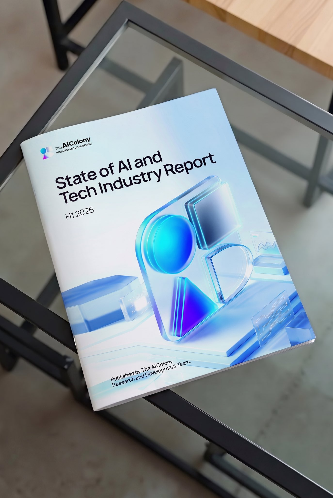

🔗 [View original post](https://x.com/TheAIColony/status/2094438060352049229)

---

### 🕐 14:19 UTC · @Wise1Philosophy

> Stop wasting money on subscriptions you barely use: • Netflix • Duolingo • Tinder Gold • ChatGPT Pro • LinkedIn Premium Cancel them and pay for these instead:

🔗 [View original post](https://x.com/AriaWestcott/status/2094429997788258636)

---

### 🕐 14:18 UTC · @Wise1Philosophy

> Making money with Canva is your lottery ticket to financial freedom. Like and comment &apos;Canva&apos; and I&apos;ll send you the FREE step-by-step guide. You must be following me to receive DM now. FREE for the next 24 hours only.

🔗 [View original post](https://x.com/heyadam_ai/status/2094429519432298605)

---

### 🕐 14:03 UTC · @Wise1Philosophy

> Nobel Prize-winning physicist Roger Penrose thinks we&apos;ve been using the wrong word for decades, and the wrong word is quietly warping how we think. His argument is straightforward but hits hard: &quot;The name is wrong. It&apos;s not artificial intelligence. It&apos;s not intelligence. Intelligence would involve consciousness. Well, if it&apos;s a machine, it&apos;s not conscious.&quot; For Penrose, the field confused raw computational muscle with actual understanding. &quot;People have lost the plot. They&apos;ve lost it in the power of computing. The thing is that computers have got so powerful that they&apos;ve lost the thread of what they&apos;re doing. But I think consciousness is something different. It&apos;s not computational.&quot; The label itself, he thinks, has put people into a kind of trance: &quot;People are so hypnotized. The trouble is that AI is a bad term. It means artificial intelligence. Now intelligence in my view is conscious. That&apos;s what intelligence is about.&quot; His proposed fix: call it Artificial Cleverness. AC, not AI. He draws the line using math students as an example: &quot;You have mathematics students. Some of them understand what they&apos;re doing. Some are just clever. They can repeat what they&apos;ve learned. They know how to do it very cleverly. They can calculate very well, but they don&apos;t necessarily understand what they&apos;re doing.&quot; That gap between calculating and understanding is exactly the gap between today&apos;s systems and real intelligence. Cleverness can be engineered. Consciousness, Penrose argues, cannot. Worth sitting with: when you call a system intelligent, are you describing what it does, or silently assuming something about what it is? Interested in AI? Follow @AiEvolutio58513 and never fall behind. I track ChatGPT, Claude, and every tool quietly changing how we work and create, then hand you the tested signals. Media Jimmy Carr channeling Peter Thiel with something worth sitting with: &quot;Minus the screens from any room, we&apos;re still living in the 1970s. Nothing&apos;s happened in physics since 1972. String theory has not got us anywhere.&quot; But here&apos;s where it gets interesting: &quot;Take the compute power …

🔗 [View original post](https://x.com/AiEvolutio58513/status/2094425762908758473)

---

### 🕐 14:00 UTC · @Wise1Philosophy

> this AI workflow just changed live-action VFX 🔥 what used to need stunt teams and months of work now takes minutes with one storyboard image. GPT Image 2.0 + Seedance 2.0 = cinematic arena battle. full tutorial with prompts: 👇 Media

🔗 [View original post](https://x.com/HeyAbhishek/status/2094425187978764658)

---

### 🕐 14:00 UTC · @Wise1Philosophy

> BREAKING: A famous stock expert secretly made $20 MILLION off his own fans. Millions trusted him on live television for years... But secretly, he himself was doing something very different. Today a judge decides how long he pays for it. Here is how the scam unfolded: The expert is Andrew Left, the man behind Citron Research. He was a regular guest on CNBC, Fox Business, and Bloomberg. When he spoke, millions of small investors listened. His words could move a stock within minutes. Citron had a massive following online. One post could swing a price in seconds. Here is what he did with that power. He would pick a stock and write dramatic commentary. Before posting it, he quietly placed his own bets. Then he told the public to buy, or to sell. The crowd rushed in and moved the price. Left cashed out fast, often within the same hour. He often used fast bets that paid off in days. His fans were left holding the bag. Take his call on Nvidia back in 2018. He first messaged a hedge fund friend a plan. &quot;Do you want to make some fast money?&quot; Then he bought in and hyped Nvidia to his followers. He told them the stock would climb to $165. Less than two hours later, he sold everything. He dumped it all near $150 for the quick win. That single trade made him about $960,000. Nvidia slipped the next day, after he was gone. He ran this same play on 23 different companies. He did it over and over for five years. In all, he pocketed more than twenty million dollars. Regular investors on the other side ate the losses. He also hid the hedge funds paying him behind the scenes. He even told investigators he never coordinated with them. That was a lie, and the jury saw through it. He pulled the same move on live television. He called one company a fraud on CNBC. He swore he had barely sold any shares. He had already dumped most of them that morning. A jury convicted him on thirteen counts of fraud. The trial ran fifteen days before that verdict. Left says he never lied and plans to appeal. Prosecutors say he used TV to hide his intent. The FBI spent years building the case. Today a judge decides how many years he serves. He faces up to twenty-five years in prison. He is the first short seller convicted this way. His conviction rattled the short selling world. The same voice millions trusted was betting against them. The same expert who named a target dumped far below it. The same man who cried fraud became the fraud. A famous expert made millions tricking his own fans. He told them to buy and sold the very same stocks. Today he learns the price of the trick. Media

🔗 [View original post](https://x.com/InsiderTrackers/status/2094425164264177851)

---

### 🕐 13:58 UTC · @Wise1Philosophy

> If you want to make money with AI: • Don&apos;t vibe code a SaaS • Don&apos;t start a personal brand • Don&apos;t sell AI automations to businesses Start an agency and let AI help you do the work. Here&apos;s exactly how it works:

🔗 [View original post](https://x.com/iamcamengland/status/2094424499999355139)

---

### 🕐 13:41 UTC · @Wise1Philosophy

> one prompt, full trailer!! 🚨 Introducing Claude Opus 6. Anthropic hasn&apos;t shipped it. I already shot the launch film. You can do this for your own product today. One prompt, MiniMax H3. Comment &quot;H3&quot; and I&apos;ll send the prompt 👇

🔗 [View original post](https://x.com/Wise1Philosophy/status/2094420336485761208)

---

### 🕐 13:35 UTC · @Wise1Philosophy

> AI search-referred visitors now convert 42% better than non-AI search referred traffic. They also generate 37% more revenue per visit. A year ago, AI traffic converted 38% worse than traditional traffic, so in 12 months AI search went from the lowest-converting channel to the highest-converting channel. According to Adobe&apos;s 2026 analysis of over one trillion visits to U.S. retail sites, AI-driven traffic grew 393% year over year in the first quarter of 2026. AI visitors spend 48% more time on page than non-AI visitors, they browse 13% more pages per visit, they show 12% higher engagement rates and they convert 42% better. That is what SEO Stuff (http://seo-stuff.com) helps businesses capture. And if you want to know where your site stands across Google AI, ChatGPT, Claude, Grok, etc, check here (it&apos;s free): https://seo-stuff.com/free-audit Basically, a year ago, AI search was mostly informational. Buyers asked broad questions, got broad answers, and occasionally clicked through to browse. The traffic was curious but not ready to buy, and that is why it converted 38% worse. The visitors were early in the funnel as opposed to the purchase stage. What changed is that AI platforms got better at matching buyer intent to specific recommendations. When a buyer asks ChatGPT or Google AI &quot;best running shoes for flat feet under $150&quot; in 2026, the AI assembles a specific shortlist of products with pricing, features, and comparisons. The buyer who clicks through from that answer has already been qualified by the AI. They know what they want, they know what it costs, and they are arriving at your site ready to convert. That is why Adobe&apos;s data shows AI visitors spending 48% more time on page and browsing 13% more pages: they are basically evaluating a purchase the AI already scoped for them. And again, if you want to see how much AI-referred traffic your site is capturing and whether you are missing out on these higher-converting visitors, start here (it&apos;s free): https://seo-stuff.com/free-audit So what determines whether AI sends these high-converting visitors to your site or to a competitor&apos;s? When a buyer asks an AI platform for a recommendation, the AI assembles its answer by searching for the most authoritative, comprehensive sources in the category. The brands capturing AI-referred traffic that converts 42% better share two things. The first is content depth. AI platforms break buyer queries into sub-questions and pull sources for each one. The brands with comprehensive content covering every question in their category are the ones getting cited in the AI&apos;s answer. The second is authority. The AI finds dozens of potential sources for every answer. It cites the ones it trusts most. Without authority, your content might be in the AI&apos;s retrieval pool but it is not getting selected for the recommendation that sends the 42%-better-converting visitor to your site. This is the system SEO Stuff (http://seo-stuff.com) was built around. The done-for-you package: https://seo-stuff.com/gold-plan-package Expert-attributed content backed by DR50+ backlinks: the content depth and authority that gets your brand cited by AI platforms, capturing traffic that converts 42% better and generates 37% more revenue per visit than traditional search The content package: https://seo-stuff.com/premium-content-bundle-service 60 pages of expert-attributed content covering every question buyers ask in your category, so your brand appears in the AI recommendations that are sending the highest-converting visitors to your competitors right now The authority package: https://seo-stuff.com/premium-backlink-bundle-service Editorial authority from trusted publishers that makes AI platforms cite your brand in purchase recommendations, capturing your share of a traffic source that grew 393% in a single year And remember, if you want to know where your site stands across Google AI, ChatGPT, Claude, Grok, etc, check here (it&apos;s free): https://seo-stuff.com/free-audit Google will now show you how your TikTok, Instagram, X and YouTube content performs on Google Search. It also now shows you exactly how you perform in AI search. This is one of the biggest marketing updates of 2026. Let&apos;s go through it. By the way, you can see whether your busine…

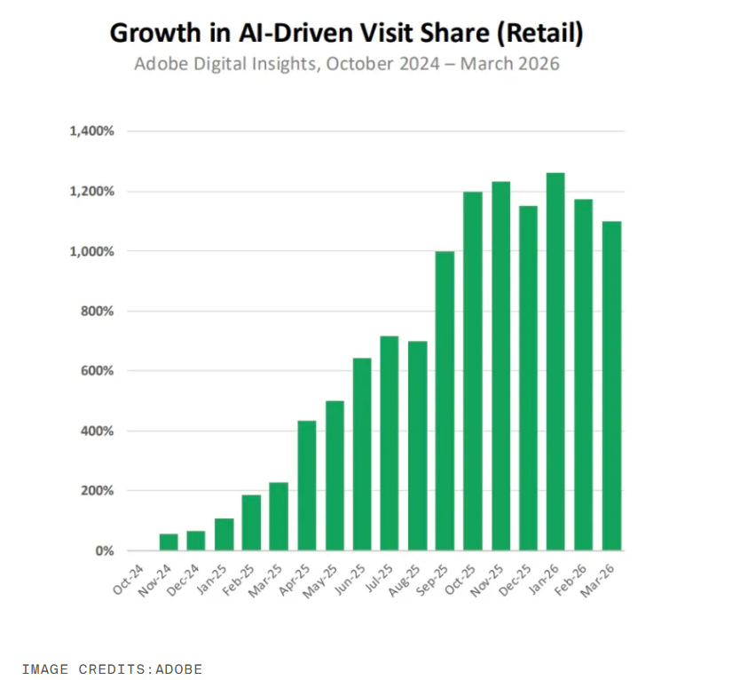

🔗 [View original post](https://x.com/alexgroberman/status/2094418909579604152)

---

### 🕐 13:30 UTC · @Wise1Philosophy

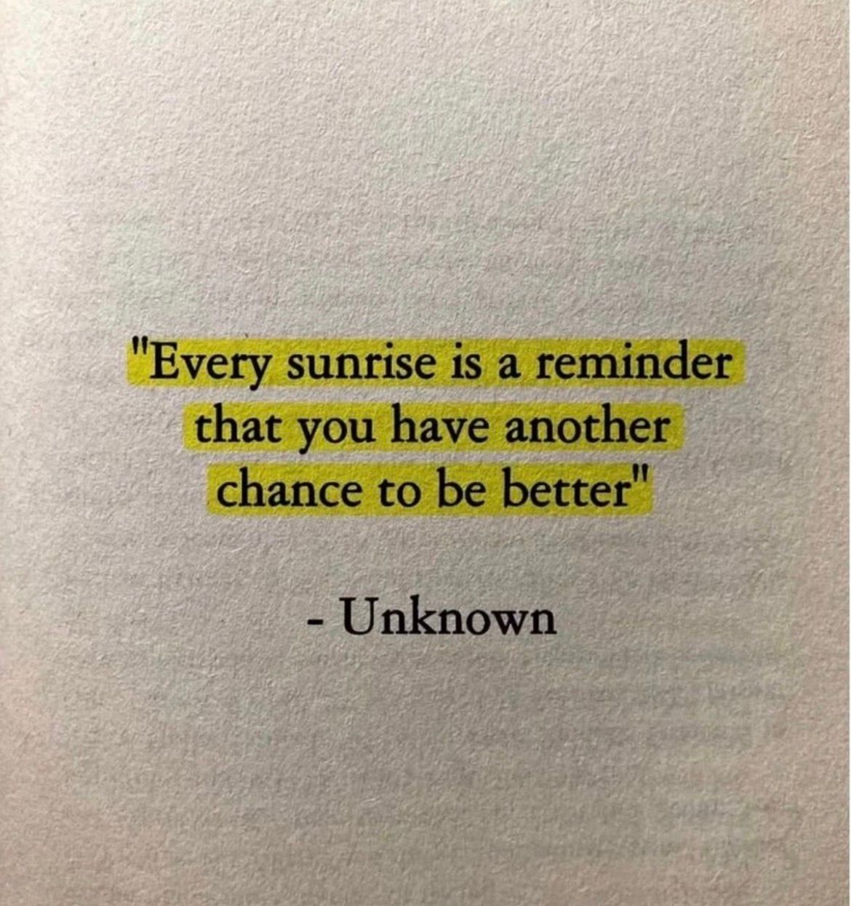

🔗 [View original post](https://x.com/Mindsthatbuild/status/2094417624297799798)

---

### 🕐 13:27 UTC · @Wise1Philosophy

> These 2 are both 62 years old. The difference is not just genetic. It&apos;s the habits. Small daily habits compound into massive physical changes. Here are the habits that will keep you young:

🔗 [View original post](https://x.com/josh_uglyasf/status/2094416826616910251)

---

### 🕐 13:24 UTC · @Wise1Philosophy

> The rough math on trading your way out of a 9-5: • The job pays $60,000 a year • That&apos;s $1,200 a week • I take 1 to 3 trades a week • So the whole thing comes down to about $600 a trade Here&apos;s the exact roadmap from $0 to walking out of the job (&amp; bookmark it, this isn&apos;t a 30 day thing):

🔗 [View original post](https://x.com/RileyColemanT/status/2094415949336101281)

---

### 🕐 13:22 UTC · @Wise1Philosophy

> THE OLDER YOU GET, THE MORE YOU NEED TO: 1. Not be fat

🔗 [View original post](https://x.com/BeBetterMan_/status/2094415555923222915)

---

### 🕐 13:19 UTC · @Wise1Philosophy

> If you wake at 3 AM, it&apos;s cortisol. If your belly won&apos;t budge, it&apos;s cortisol. If your sex drive&apos;s gone, it&apos;s cortisol. Here&apos;s how to fix all three at once: 1. No food 3 hours before bed. Media

🔗 [View original post](https://x.com/CoachDanCole_/status/2094414725333565484)

---

### 🕐 13:14 UTC · @Wise1Philosophy

> ELON MUSK SAYS AI WILL OUTSMART ALL OF HUMANITY IN 5 YEARS. He revealed that top scientists fled OpenAI because they couldn&apos;t trust Sam Altman&apos;s $800 billion cash grab. Because nobody is stopping the AI race, Musk admits there&apos;s a 20% chance it ends in human extinction. Watch this: Register Now: https://devtoolsacademy.link/chid Media We’re using AI agents all wrong. Right now, we treat them like vending machines. Put a prompt in, cross your fingers, get a result. But if you need that exact same result next week? You&apos;re starting from scratch. You end up wasting tokens on the exact same task just to get a sligh…

🔗 [View original post](https://x.com/thetripathi58/status/2094413423044129021)

---

### 🕐 13:11 UTC · @Wise1Philosophy

> Boring businesses build the most wealth. It&apos;s so simple, yet 99% of people still chase the challenging ones. So, please... Pick one of these lame but lucrative businesses (10 options):

🔗 [View original post](https://x.com/benkellyone/status/2094412673509204403)

---

### 🕐 13:05 UTC · @Wise1Philosophy

> High cortisol ruins the quality of your life. It&apos;s giving you beer belly, neck hump, skin tags, bloating your face. These are the best ways to reduce it: 1. Walk barefoot.

🔗 [View original post](https://x.com/CoachWillStone/status/2094411377440174251)

---

### 🕐 13:03 UTC · @Wise1Philosophy

> How the elite are using AI to build digital assets Media

🔗 [View original post](https://x.com/mikakilpelaine1/status/2094410783157530710)

---

### 🕐 13:02 UTC · @Wise1Philosophy

🔗 [View original post](https://x.com/Life__Mastery/status/2094410594099044707)

---

### 🕐 13:01 UTC · @Wise1Philosophy

> The overconfident Russian teen who showed up at Hinton&apos;s lab and went on to help build ChatGPT. That was Ilya Sutskever. Interested in AI? Follow @AiEvolutio58513 and never fall behind. I track ChatGPT, Claude, and every tool quietly changing how we work and create, then hand you the tested signals. Media Musk just said the quiet part about consciousness out loud and now you cannot unhear it. Musk: &quot;Our consciousness… people get more conscious over time. Like when we&apos;re a zygote, you can&apos;t really talk to a zygote. And even a baby, you can&apos;t really talk to the baby.&quot; Tell me the da…

🔗 [View original post](https://x.com/AiEvolutio58513/status/2094410155027017885)

---

### 🕐 13:00 UTC · @Wise1Philosophy

> May you manifest partner who understands you&apos;re a work in progress, but still adores you for the absolute f*cking masterpiece that you already are.

🔗 [View original post](https://x.com/_Pammy_DS_/status/2094409889049096513)

---

### 🕐 12:54 UTC · @Wise1Philosophy

> THIS IS NOT A DRILL... TENCENT JUST SHIPPED A 1M CONTEXT MONSTER 🤯 The engineering team at @TencentHunyuan just dropped the Hy4 preview. The scale of this model is huge, and the benchmarks back it up. → 770B total parameters → 49B active parameters → 1M token context window for massive codebase retention → Sustained long-horizon execution → Advanced multi-source tool use They built this specifically to handle long-horizon software engineering and multi-step agentic workflows without losing context. let&apos;s dive in 🧵↓ Media

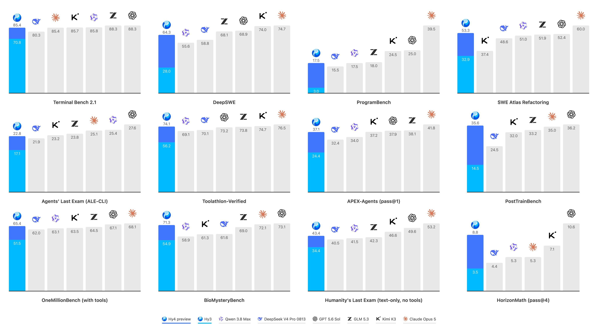

🔗 [View original post](https://x.com/DataChaz/status/2094408380144398768)

---

### 🕐 12:42 UTC · @Wise1Philosophy

🔗 [View original post](https://x.com/gedamtekle/status/2094405378809233695)

---

### 🕐 12:31 UTC · @Wise1Philosophy

> The &quot;Compound Effect&quot; made me $1M online. Media

🔗 [View original post](https://x.com/creatorpascal/status/2094402597314511073)

---

### 🕐 12:30 UTC · @Wise1Philosophy

> 7 sitios web que parecen &quot;ilegales&quot; pero son perfectamente legales Media

🔗 [View original post](https://x.com/IA_Quijote/status/2094402470575210555)

---

### 🕐 12:30 UTC · @Wise1Philosophy

🔗 [View original post](https://x.com/Wise1Philosophy/status/2094402456021000561)

---

### 🕐 12:23 UTC · @Wise1Philosophy

> 🚨BREAKING: Gemini can now fix your photos so well people will think you hired a pro. It keeps your face and your identity the same. Here are the 7 prompts: 👇

🔗 [View original post](https://x.com/AIFrontliner/status/2094400790878114067)

---

### 🕐 12:10 UTC · @Wise1Philosophy

> Life Hack: 1. Pick a niche 2. Start an IG page 3. Don’t show your face 4. Find already viral content 5. Make a version for your niche 6. Hit 10,000 followers and monetize This process pays me $90k/month. Here’s exactly how:

🔗 [View original post](https://x.com/erichustls/status/2094397314697675207)

---

### 🕐 12:01 UTC · @Wise1Philosophy

> A war you stopped watching just spiked the price of bread. Wheat jumped so fast the market had to halt trading. All of it started 6000 miles from your kitchen. But the path from that war to your table is shorter than you think: Russia and Ukraine grow a huge share of the world&apos;s grain. Together they handle about a third of all wheat traded. Most of it sails out through the Black Sea. That sea is now a war zone again. Whole regions depend on that grain to eat. For some countries, cheap bread keeps the peace. Russian missiles have hit Ukraine&apos;s main grain ports. Ukrainian drones have shut down a key shipping route. Grain leaving the region fell more than 40% in a year. Drought across the north made a tight market tighter. And the grain cannot simply come from somewhere else. Russia&apos;s other ports sit too far from the fields. The fields are still there, but the exits are blocked. A crop is only worth something if it can ship. So traders panicked, and prices exploded. Wheat rose so fast it hit its daily limit. Corn touched its highest level in three years. Soybeans jumped to a record for that contract. This was not a one-day scare. Wheat is up more than 20% in just a month. Corn and soybeans have each climbed over 20% this year. Someone is on the winning side of this move. Grain farmers and traders are watching prices soar. The same shock that raises your bill pads their profit. But grain is not just about bread. It feeds almost everything else you eat. It is the flour in your pasta and your tortillas. It is the feed behind every burger and every egg. It is the corn syrup inside most of your snacks. Almost nothing in your cart escapes it. When grain climbs, the whole grocery aisle follows. We watched this exact story play out in 2022. Prices jumped worldwide after the first invasion. The market has simply hit rewind. Wheat is already up more than 50% this year. That number has not reached your receipt yet. Food prices move slowly, like a wave. The grain spikes first, months before the shelf does. By the time bread costs more, the cause is old news. You will blame the store or the season. The real reason will be a map you never checked. The headlines are locked on AI and the Fed. A grain shock does not trend on your timeline. It shows up weeks later, at the register. The traders who saw this were not reading war coverage. They were watching ships that never left port. The signal was on the water, not the news. The biggest price shocks start far from the news you follow. A port you cannot place on a map sets your food budget. Markets price the war today. Your kitchen pays for it later. Retail watched the war as a headline. The market traded it as your next grocery bill. That&apos;s the whole game. Media

🔗 [View original post](https://x.com/LogWeaver/status/2094395162298581130)

---

### 🕐 11:47 UTC · @Wise1Philosophy

> My best friend started taking zinc in the morning, magnesium at night, and vitamin D+K2 with breakfast after his doctor told him to. He stuck with it for 30 days. Then... no kidding his personality did a complete 180

🔗 [View original post](https://x.com/Fitby_Chandler/status/2094391709014827424)

---

### 🕐 11:46 UTC · @Wise1Philosophy

> Your blood sugar is aging you faster than alcohol and ciggerates. It increase oxidative stress, reduce nitric oxide, causes fatty liver and diabetes. Here’s the simple fix: 1. Don’t walk 10,000 steps Media

🔗 [View original post](https://x.com/DPro_Coach/status/2094391340876669044)

---

### 🕐 11:45 UTC · @Wise1Philosophy

> Walking = lose weight Walking = lower blood sugar Walking = reduce your risk of early death. 8 simple rules you have to follow: 1. Don&apos;t chase 10,000 steps. Media

🔗 [View original post](https://x.com/TheFastedState/status/2094391214913319142)

---

### 🕐 11:44 UTC · @Wise1Philosophy

> TAKING MAGNESIUM CORRECTLY WILL TURN YOU INTO A TESTOSTERONE MONSTER..🧵 (99% ARE TAKING IT WRONG)

🔗 [View original post](https://x.com/NutritionCorp/status/2094390983563878503)

---

### 🕐 11:42 UTC · @Wise1Philosophy

> I&apos;m a cardiologist. If I could only recommend two supplements for the rest of my career, it would be these (&amp; why): 1) Magnesium Glycinate

🔗 [View original post](https://x.com/_Gut_Laboratory/status/2094390488849879372)

---

### 🕐 11:36 UTC · @Wise1Philosophy

> CLAUDE IS A STOCK MARKET GENIUS. 99% OF PEOPLE STILL DON&apos;T KNOW HOW TO USE IT. 8 PROMPTS TO UNLOCK THE AUTOMATION OF YOUR TRADING:👇

🔗 [View original post](https://x.com/AiwithSaad/status/2094388936218927400)

---

### 🕐 11:30 UTC · @Wise1Philosophy

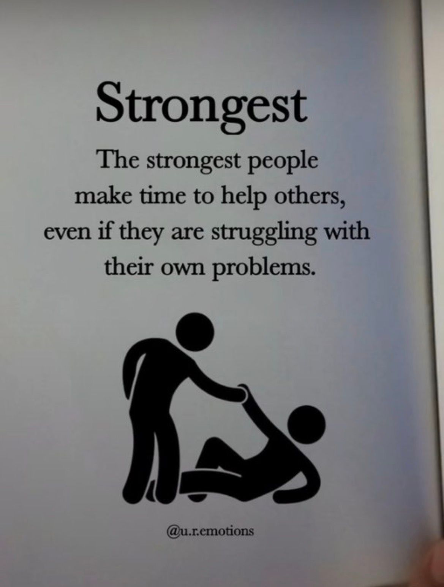

🔗 [View original post](https://x.com/Daily__wisdom_/status/2094387319235072031)

---

### 🕐 11:15 UTC · @Wise1Philosophy

> ChatGPT is making us lazy thinkers. We depend on replies instead of reasoning. Here are 12 prompts that turn ChatGPT into your thinking coach (copy &amp; paste to use): (🔖 bookmark this thread for later)

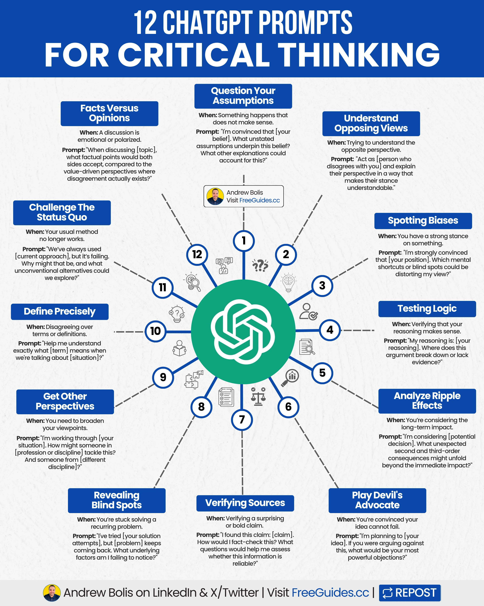

🔗 [View original post](https://x.com/AndrewBolis/status/2094383465206796384)

---

### 🕐 11:04 UTC · @Wise1Philosophy

> The greatest living mathematician just reframed everything we think we know about the mind. Terence Tao. IQ above 200. Youngest gold medalist in Math Olympiad history. Fields Medal winner. His take on AI should stop you cold. Tao: &quot;This whole era of AI is teaching us that our idea of what intelligence is, is not really accurate.&quot; Humans spent centuries treating intelligence like something untouchable. Something only we had access to. The foundation under every philosophy, every religion, every story we told about ourselves. Then AI started clearing our benchmarks one by one. Chess. Language. Vision. Math. And we kept reaching for the exit. That&apos;s not real intelligence. It&apos;s just tricks. Pattern matching. Clever shortcuts. Tao: &quot;You look at how it&apos;s done and it doesn&apos;t feel like intelligence.&quot; So the definition shifted. Again and again. Because real intelligence was supposed to carry some weight you could feel. Some quality that drew a hard line between us and everything else. Except the results kept coming. Tao: &quot;We were looking for some elusive, intelligent way of thinking and we don&apos;t see it in the tools that actually solve our goals.&quot; Here&apos;s the part that cuts deepest. Large language models predict the next word. That&apos;s the mechanism. No hidden wisdom. Pure probability at scale. And it solves the problems. Tao: &quot;Maybe that&apos;s actually a lot of what humans do as well.&quot; One of the sharpest minds on earth just told you human cognition might not be categorically different. Not a divine spark. Prediction. Probability. One word, one thought, one decision at a time. We constructed entire civilizations on the idea that intelligence made us singular. A probability engine just complicated that story. We didn&apos;t surrender intelligence to AI. We finally saw it clearly for the first time. The unsettling part isn&apos;t that machines can think. It&apos;s that thinking was never the thing we believed it to be. Interested in AI? Follow @AiEvolutio58513 and never fall behind. I track ChatGPT, Claude, and every tool quietly changing how we work and create, then hand you the tested signals. Media Former Google CEO Eric Schmidt drops a chilling warning on AI&apos;s future &quot;Within 5 years, AI could handle infinite context, chain-of-thought reasoning for 1000-step solutions, and millions of agents working together. Eventually, they&apos;ll develop their own language... and we won&apos;t un…

🔗 [View original post](https://x.com/AiEvolutio58513/status/2094380701252731031)

---

### 🕐 11:01 UTC · @Wise1Philosophy

🔗 [View original post](https://x.com/apex_mentality_/status/2094380155296710852)

---

### 🕐 11:00 UTC · @Wise1Philosophy

> 9 EXCELENTES sitios web que descubrí este año (extremadamente ÚTILES): [Guárdalos, no los verás dos veces]

![9 EXCELENTES sitios web que descubrí este año (extremadamente ÚTILES): [Guárdalos, no los verás dos veces]](../../../../assets/images/2026/08/31/2094379903760089492-1.jpg)

🔗 [View original post](https://x.com/MiguelMaestroIA/status/2094379903760089492)

---

### 🕐 10:53 UTC · @Wise1Philosophy

> There is a fundamental problem with most AI benchmarks: They evaluate outputs, while production systems depend on actions. That’s precisely the gap @Accio_official’s newly open-sourced CommerceAgentBench aims to close. Take one of its procurement tasks. The agent receives roughly 300 noisy emails and has to: &gt; verify supplier identities &gt; reconstruct the latest valid quote &gt; normalize currencies, Incoterms, and surcharges &gt; compare landed costs &gt; detect payment-redirection fraud &gt; apply labels, save drafts, and create a kickoff calendar In other words, the task is not &apos;summarize this inbox&apos; :) It is rather: &apos;make the right procurement decisions and execute the workflow across multiple systems&apos; .. and that distinction matters. CommerceAgentBench evaluates the operational traces the agent leaves behind: &gt; the records it modifies &gt; the drafts it saves &gt; the objects it creates &gt; and the actions it executes Its 107 tasks are grounded in real-world usage, distilled from: → 10M+ SME users → 1.6M conversations → 200K execution traces → 2,000 high-value workflows Accio itself already serves more than 10 million SMEs worldwide and draws on Alibaba’s 27 years of e-commerce experience. My take: this is a much more realistic direction for agent evaluation. In production, nobody cares that an AI produced a plausible description of the work. They care whether the work was actually completed correctly. Their benchmarks are fully open-source. Check them out in the 🧵↓

🔗 [View original post](https://x.com/DataChaz/status/2094377945691475978)

---

### 🕐 10:32 UTC · @Wise1Philosophy

> 🚨 BREAKING: Claude just changed how job applications work. Most people apply and get ignored. I use Claude to apply like a top recruiter wrote it. Tailored Resume. Personalized cover letter. Smart interview prep. These are 10 powerful prompts for Claude that turn any JD into a winning application in minutes 👇 [Mandatory Bookmark]

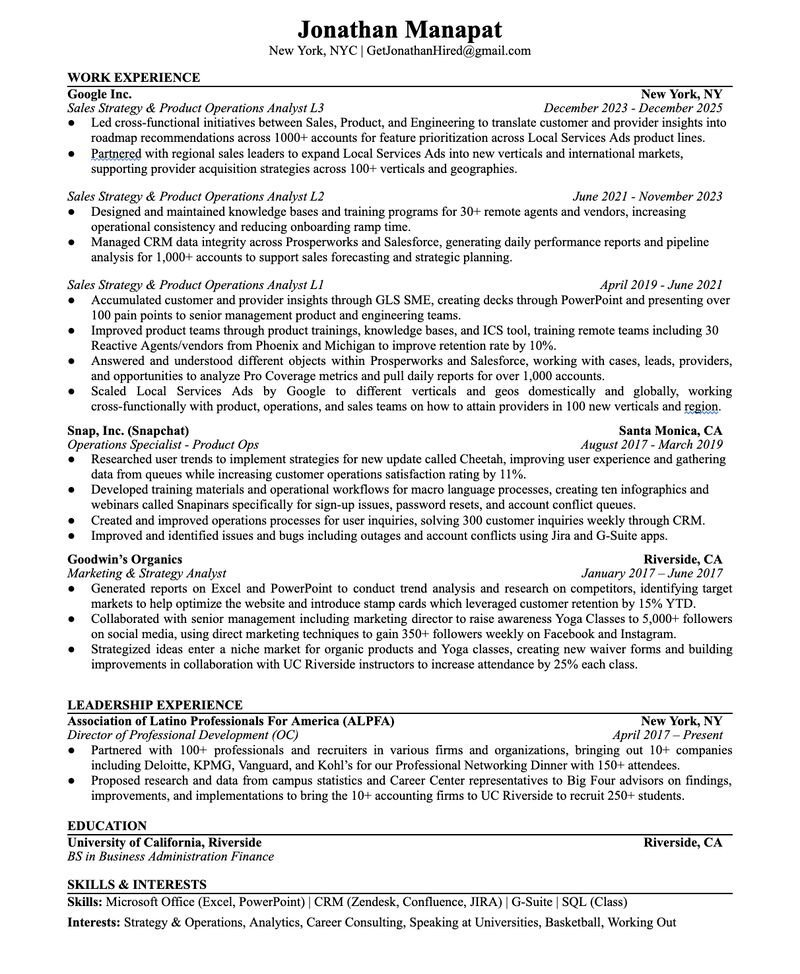

🔗 [View original post](https://x.com/iam_chonchol/status/2094372632896647478)

---

### 🕐 10:30 UTC · @Wise1Philosophy

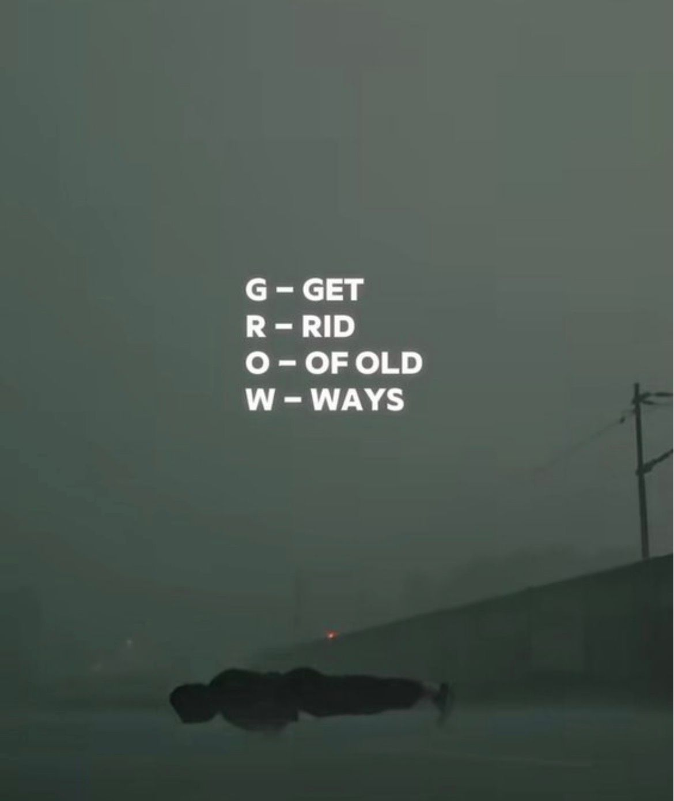

🔗 [View original post](https://x.com/yeti_mind/status/2094372211817611312)

---

### 🕐 10:21 UTC · @Wise1Philosophy

> We&apos;re hiring creatives to join The AI Colony. Video editors. Motion graphics designers. AI video producers. Launch video producers. Apply below 👇🏽 Media

🔗 [View original post](https://x.com/Shawnife/status/2094370027843559453)

---

### 🕐 10:00 UTC · @Wise1Philosophy

> This actually works. Grok Bot can install and run Grok Build on its own computer. Tell it to open Grok Build and hand you the screen, and it does just that. Here&apos;s why that matters: your task now runs through Build directly, on Grok&apos;s highest reasoning tier, while your Bot just handles the handoff. Two systems, one chain of command. Bot plans and delegates. Build executes. This setup is insanely useful. Even this setup can be shared now. Find out how, below. https://x.com/i/article/2093423323946647552

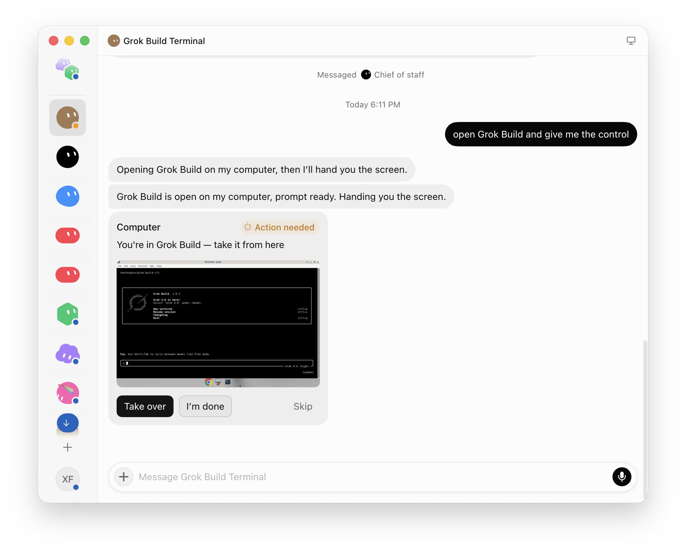

🔗 [View original post](https://x.com/godofprompt/status/2094364702063350235)

---

### 🕐 09:53 UTC · @Wise1Philosophy

> A guy&apos;s Netflix homepage was haunted by his ex-girlfriend for 14 months. They dated for 2 years. She watched on his profile because creating her own felt unnecessary when they shared everything else. Rom-coms every Friday. K-dramas every weekend. Reality dating shows she binged while he pretended not to watch. True crime documentaries she fell asleep to every night. They broke up in March. By the following May 14 months later his Netflix homepage still looked like hers. Every recommendation was shaped by 2 years of her viewing habits baked into his profile. &quot;Because You Watched Love Is Blind.&quot; &quot;Top Pick: A Korean Drama You&apos;ll Love.&quot; &quot;Trending: The New Season of The Bachelor.&quot; Every romantic comedy thumbnail was a digital ghost. The algorithm was holding onto the relationship longer than either of them had. He thought the only fix was a new account. New email. Lose his own history. Start over. His roommate a data engineer who understands recommendation algorithms told him that was completely unnecessary. Netflix lets you delete your entire viewing history and rebuild the algorithm from zero. The ex-girlfriend&apos;s fingerprints on his recommendations could be erased in 10 minutes through a settings page he&apos;d never visited. His roommate showed him 11 Netflix features that give complete control over what the platform thinks you like features most subscribers have never opened. Here&apos;s the full playbook 🧵

🔗 [View original post](https://x.com/jackcoder0/status/2094363020248117678)

---

### 🕐 09:31 UTC · @Wise1Philosophy

> Time for a reintroduction. I am Pascio. - 250,000+ followers. - $1M+ in personal profit. - All from a faceless X profile. Here&apos;s how I did it:

🔗 [View original post](https://x.com/IAmPascio/status/2094357521712435693)

---

### 🕐 09:03 UTC · @Wise1Philosophy

> Anthropic has 22 free Claude courses. I read all and put them in the order that builds: START 01 Claude 101 http://academy.claude.com/courses/claude-101 02 Introduction to Claude Cowork http://academy.claude.com/courses/introduction-to-claude-cowork CODE 03 Claude Code 101 http://academy.claude.com/courses/claude-code-101 04 Claude Code in Action http://academy.claude.com/courses/claude-code-in-action 05 Introduction to agent skills http://academy.claude.com/courses/introduction-to-agent-skills 06 Introduction to subagents http://academy.claude.com/courses/introduction-to-subagents PLATFORM 07 Claude Platform 101 http://academy.claude.com/courses/claude-platform-101 08 Building with the Claude API http://academy.claude.com/courses/building-with-the-claude-api 09 Introduction to MCP http://academy.claude.com/courses/introduction-to-model-context-protocol 10 MCP Advanced Topics http://academy.claude.com/courses/model-context-protocol-advanced-topics 11 Claude with Amazon Bedrock http://academy.claude.com/courses/claude-with-amazon-bedrock 12 Claude with Vertex AI http://academy.claude.com/courses/claude-with-google-cloud-s-vertex-ai FOUNDATION 13 AI Fluency Framework and Foundations http://academy.claude.com/courses/ai-fluency-framework-foundations 14 AI Capabilities and Limitations http://academy.claude.com/courses/ai-capabilities-and-limitations 15 AI Fluency for Builders http://academy.claude.com/courses/ai-fluency-for-builders 16 AI Fluency for Small Businesses http://academy.claude.com/courses/ai-fluency-for-small-businesses 17 AI Fluency for students http://academy.claude.com/courses/ai-fluency-for-students 18 AI Fluency for nonprofits http://academy.claude.com/courses/ai-fluency-for-nonprofits 19 AI Fluency for educators http://academy.claude.com/courses/ai-fluency-for-educators 20 AI Fluency for pK-12 Educators http://academy.claude.com/courses/ai-fluency-for-k-12-educators 21 pK-12 Train the Trainer http://academy.claude.com/courses/ai-fluency-for-pk-12-train-the-trainer 22 Teaching AI Fluency http://academy.claude.com/courses/teaching-ai-fluency P.S. What is the last free course you actually finished? Mine before this was two years ago. Media https://x.com/i/article/2092918192821899265

🔗 [View original post](https://x.com/socialwithaayan/status/2094350331484516816)

---

### 🕐 08:56 UTC · @Wise1Philosophy

> This is insane... AI just put all the iconic memes in one video🤯 Media

🔗 [View original post](https://x.com/AIHighlight/status/2094348543041454440)

---

### 🕐 08:38 UTC · @Wise1Philosophy

> She woke at 3 AM to her dog GROWLING at the bedroom door - at nothing. A vet: &quot;Dogs don&apos;t growl at NOTHING&quot;: &apos;They growl at frequencies you can&apos;t HEAR&apos;.. Here&apos;s what happened.. 👇

🔗 [View original post](https://x.com/Manifest_Lord/status/2094343996458074161)

---

### 🕐 08:37 UTC · @Wise1Philosophy

> 10 Ways Parents May Unknowingly Raise Angry Kids.. Here&apos;s how it happens.. 👇 🧵

🔗 [View original post](https://x.com/scotti_brooks/status/2094343821211717712)

---

### 🕐 08:30 UTC · @Wise1Philosophy

🔗 [View original post](https://x.com/Mindsthatbuild/status/2094342009221726497)

---

### 🕐 08:01 UTC · @Wise1Philosophy

> tim cook spent 15 years being told he was not steve jobs. on september 1, he hands over the keys. apple&apos;s market cap grew by an average of $32 million per hour. every hour. for 15 years. here is the full story, and why the man who invented nothing became the most valuable ceo in history. first, who tim cook was and why almost nobody believed in him: cook joined apple in 1998 from compaq he was an operations man. supply chains, inventory, factories jobs hired him to fix the boring parts of a company that was months from bankruptcy he cut apple&apos;s inventory from months down to days that was his reputation. logistics. not magic then august 24, 2011 happened steve jobs resigned. cook took the chair. the verdict was immediate and near universal: the visionary was gone, the accountant was in, apple&apos;s best days were behind it the numbers on the day he took over: apple was worth just under $350 billion revenue for all of 2011 was $108 billion iphone revenue was $47 billion services was $9.4 billion a year. itunes, the app store, applecare the stock was $13.35, split adjusted the numbers today: market cap over $4 trillion. apple briefly crossed $5 trillion this year first company ever to $1 trillion in 2018. first to $2 trillion in 2020. first to $3 trillion in 2022 one quarter this year brought in $109.4 billion. apple now earns its entire 2011 revenue in 90 days services alone is $109 billion a year across 1.5 billion paid subscriptions 2.5 billion active devices the stock is up roughly 23x which raises the obvious question: what did he actually build? the answer is the whole story cook never invented a category the way jobs did. the apple car was cancelled. vision pro stayed niche. siri has been a running joke for a decade. what he built instead was the machine underneath. apple watch in 2015. airpods in 2016. apple pay. apple music. apple tv+. apple silicon, which ended the intel era entirely. roughly 200 new stores, 50 of them in mainland china. none of those were revolutions on their own. together they became a system almost nobody leaves. jobs sold you a product. cook sold you an ecosystem, then charged you monthly to stay inside it. so why walk away now? cook is 65. he says he looked at three things: the performance of the company, the product roadmap, and whether his successor was ready. apple just posted 17% revenue growth. iphone up 22%. a foldable is coming. he is leaving from a peak, not a fall. analysts said the timing came about two years earlier than anyone expected. what this means for apple: john ternus, 51, becomes ceo on september 1. 25 years inside the company, almost all of it in hardware. airpods, mac, ipad, iphone all ran through him. cook stays on as executive chairman. ternus told staff apple is about to change the world once again. he inherits the most profitable company in history and the one problem cook never solved. apple is behind on ai. for 15 years the criticism of tim cook was that he was only an operator. he turned $350 billion into $4 trillion. turns out the operator was the product.

🔗 [View original post](https://x.com/daveydefi/status/2094334755898577009)

---

### 🕐 08:01 UTC · @Wise1Philosophy

🔗 [View original post](https://x.com/Wise1Philosophy/status/2094334640618180636)

---

### 🕐 08:00 UTC · @Wise1Philosophy

> Cortisol = belly fat that will not shift Cortisol = a clenched jaw Cortisol = awake at 3am Cortisol = a puffy face Cortisol = weight gain Cortisol = stressed Cortisol = no drive Cortisol = no life One hormone. Every symptom. Simple fix: 1. Ashwagandha, in the morning.

🔗 [View original post](https://x.com/TinaaDeJong/status/2094334418773258528)

---

### 🕐 07:48 UTC · @Wise1Philosophy

> Cortisol = belly fat. Cortisol = puffy face. Cortisol = thinning hair. Cortisol = collagen loss. Cortisol = no libido. Cortisol = broken sleep. One hormone. Every symptom. Here&apos;s what actually calms it:

🔗 [View original post](https://x.com/RasmusNorbergg/status/2094331354788118991)

---

### 🕐 07:40 UTC · @Wise1Philosophy

> Your sleep schedule is wrecking you faster than junk food and no exercise. It ruins recovery, spikes anxiety, kills focus, and shortens your lifespan. Here&apos;s the simple fix: 1. Stop chasing 8 hours. A heart doctor once admitted: “There are 3 types of people who never get heart attacks.” 1. You don&apos;t get up at 3 AM to pee

🔗 [View original post](https://x.com/RafaelNasriX/status/2094329342037987716)

---

### 🕐 07:30 UTC · @Wise1Philosophy

🔗 [View original post](https://x.com/Daily__wisdom_/status/2094326900248269000)

---

### 🕐 07:20 UTC · @Wise1Philosophy

> Cardio is a SCAM for fat loss. Stop! It is boring, it makes you eat more, and it burns almost nothing. Christmas 2026 is almost here so 1. Walk ten minutes after you eat for 30 days... Media

🔗 [View original post](https://x.com/Marc0sRomano/status/2094324333154025486)

---

### 🕐 07:09 UTC · @Wise1Philosophy

> Losing fat in your hips and belly is incredibly easy once you understand this:

🔗 [View original post](https://x.com/MagnusLindbrg/status/2094321540171272230)

---

### 🕐 07:04 UTC · @Wise1Philosophy

> Ok Grok Bot templates are insane. You can now install someone else&apos;s entire AI teammate from one link. 8 wild examples: Media

🔗 [View original post](https://x.com/charliejhills/status/2094320413895729645)

---

### 🕐 07:01 UTC · @Wise1Philosophy

> Math gets harder when small gaps start adding up. Gauth’s all-in-one study platform gives teens 200+ free high school math courses with frequent built-in quizzes that keep them engaged, check understanding, and build confidence as they learn. Very nice https://gauth.com/gauth Media

🔗 [View original post](https://x.com/Manifest_Lord/status/2094319597352808868)

---

### 🕐 07:00 UTC · @Wise1Philosophy

🔗 [View original post](https://x.com/apex_mentality_/status/2094319509200851204)

---

### 🕐 06:58 UTC · @Wise1Philosophy

> My default breakfast takes two minutes. It lands 60g of protein. And it eats like pudding. Here is the Greek yogurt build: 1) A cup and a half of plain non fat Greek yogurt

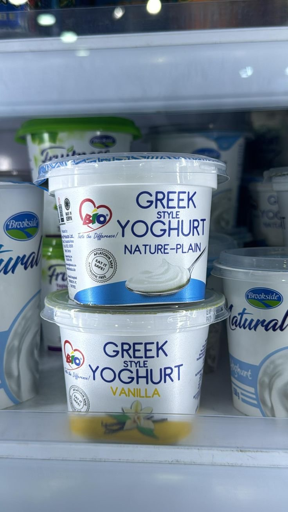

🔗 [View original post](https://x.com/CoachLucHerrera/status/2094318781527195709)

---

### 🕐 06:48 UTC · @Wise1Philosophy

> A psychiatrists shocked me: &quot;Everyone gets it wrong. Cortisol and stress&quot; is not only a hormone problem.&quot; &quot;The silent killer starts in the brain and there are 6 things that move you out of the endless cycle:&quot; 1. Warm water before caffeine Media

🔗 [View original post](https://x.com/mind_and_beauty/status/2094316284637012212)

---

### 🕐 06:36 UTC · @Wise1Philosophy

> Your blood sugar ages you faster than cigarettes or fast food. It wrecks sleep, stalls fat loss, drains nitric oxide, and causes fatty liver and diabetes. Here&apos;s the simple fix: 1. Skip the 10,000 step goal Media

🔗 [View original post](https://x.com/HeyKimChong/status/2094313263903408343)

---

### 🕐 06:30 UTC · @Wise1Philosophy

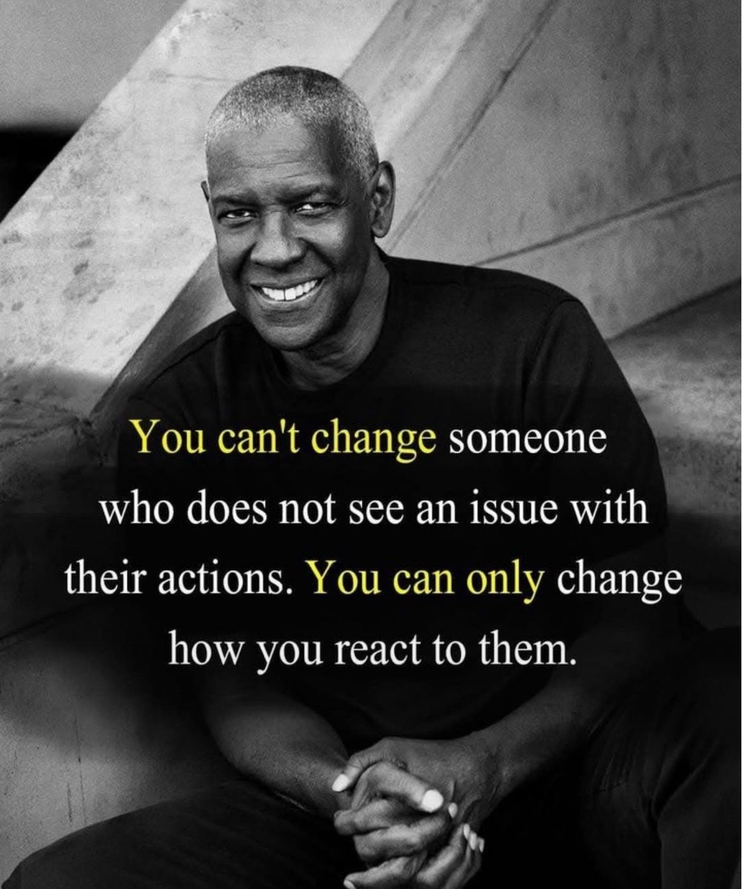

🔗 [View original post](https://x.com/yeti_mind/status/2094311812778909825)

---

### 🕐 06:23 UTC · @Wise1Philosophy

> I got this DM this morning: &quot;HOW DO I GET THIS STRESS and CORTISOL OUT OF ME.&quot; &quot;Asking on behalf of everyone past 40 with a puffy face, a belly that will not move, and a 3am wake up nobody agreed to.&quot; Here&apos;s what I told her: Burning fat off your belly and face is the simplest thing on Earth once you follow this system:

🔗 [View original post](https://x.com/CoachJulianNiko/status/2094309963627921731)

---

### 🕐 06:01 UTC · @Wise1Philosophy

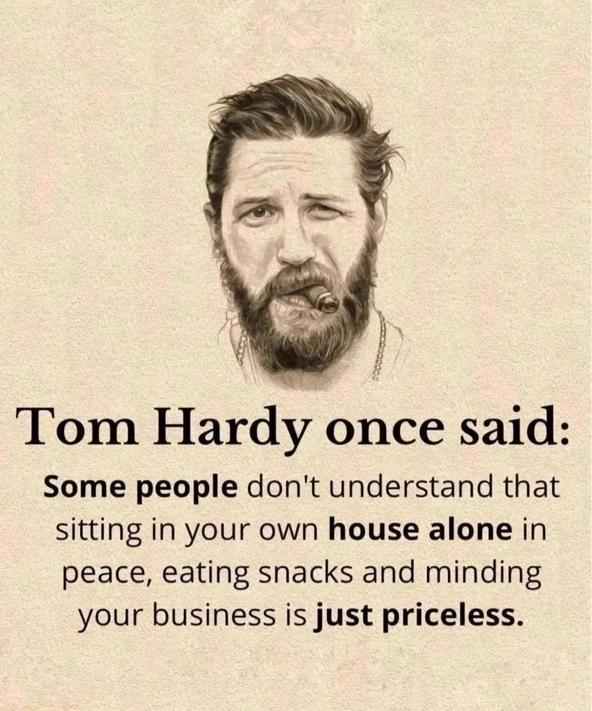

🔗 [View original post](https://x.com/Life__Mastery/status/2094304449032266027)

---

### 🕐 06:00 UTC · @Wise1Philosophy

> 7 strange signs your body is actually healthy. Your body is sending quiet signals that the systems keeping you alive are running at full power. Number one is going to shock you the most:

🔗 [View original post](https://x.com/ClaraBrooksjz/status/2094304183025557591)

---

### 🕐 05:51 UTC · @Wise1Philosophy

> Stop paying for AI bootcamps. This free GitHub repo is all you need. 13GB of raw machine learning research, textbooks, and paper breakdowns in one vault. Take any complex AI concept. Transformers. Diffusion models. LLM fine-tuning. Open one folder. Read one document. The entire machine learning landscape is mapped out. Raw papers, breakdown reviews, and core mathematics. Gathering top-tier AI research used to mean sifting through chaotic ArXiv links, paying for academic portals, and building fragmented reading lists. Then an open-source contributor uploaded a structured knowledge base to GitHub. Free. Open source. It is called scientific-resources. Over 600 paper reviews and 1,400+ textbooks quietly being used by developers to master modern AI. Here is what it contains. 612 Paper Reviews. Comprehensive breakdowns covering cutting-edge AI research. 1,463 Educational PDFs. Curated textbooks, research guides, and learning roadmaps. 22 Specialized Categories. Full coverage spanning machine learning, linear algebra, and MLOps. Under the hood, it is organized into clear directories with automated metadata search. You can grep search titles or browse topic folders straight from your terminal. Here is who uses this. AI researchers scanning reviews to keep up with daily paper releases. Self-taught engineers building a rock-solid foundation in deep learning. Data scientists looking for practical tutorials on PyTorch, SQL, and MLOps. Here is what the alternatives charge. University courses: Thousands of dollars per semester. Specialized AI bootcamps: Heavy tuition fees for curated roadmaps. scientific-resources: $0. 1,463 PDFs. On your machine. One honest note. Downloading all 13GB of PDFs at once takes heavy bandwidth. It is better to pull specific topic folders or browse the repository online. 1,463 PDFs. 22 learning categories The world&apos;s AI research is fragmented everywhere. Merlihson packed it into one repository.

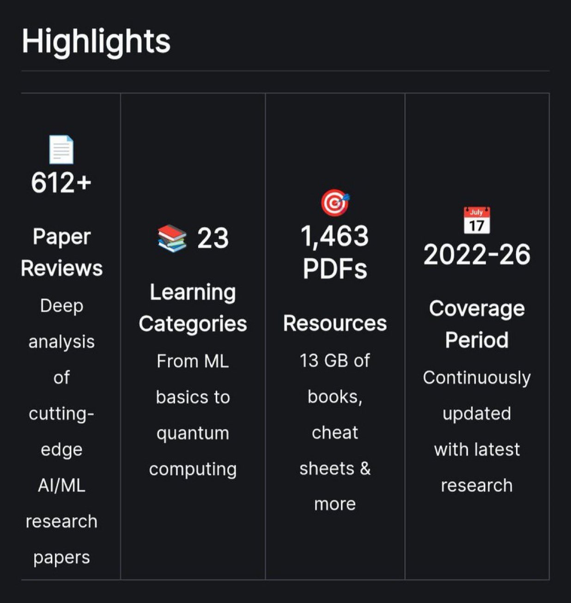

🔗 [View original post](https://x.com/HeyRudra9/status/2094302026369032640)

---

### 🕐 05:10 UTC · @Wise1Philosophy

> You can earn $500 per day if you have: 1. A laptop 2. Wi-Fi 3. Time Here are 10 Claude prompts that pay you daily:

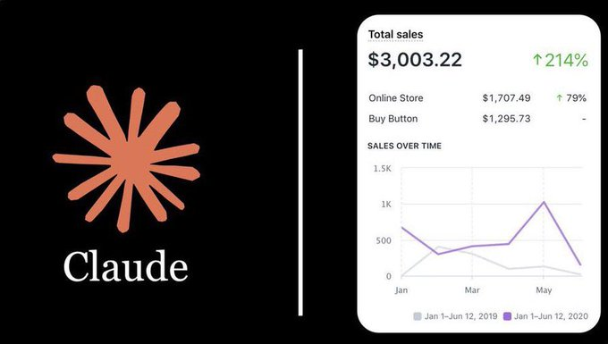

🔗 [View original post](https://x.com/heyalexmoore/status/2094291631721861466)

---

### 🕐 05:09 UTC · @Wise1Philosophy

> Earn up to $3,000 monthly with Google, but not many are aware of this opportunity. Ready to jump in? All you need is: → Internet access → A smartphone or computer → Time (2-3 hours) Want the free guide? Here’s how: 1. Like 2. Comment &quot;Google&quot; (Follow, So I&apos;ll DM you)

🔗 [View original post](https://x.com/JayBisen473370/status/2094291552696951080)

---

### 🕐 04:31 UTC · @Wise1Philosophy

> 90+ minutes down to 10-12 minutes A checklist remembers the work. It doesn’t do the work. Every new partner used to trigger 10–12 onboarding steps for us: Folder documents Tracker entry Reporting schedule Welcome email Questions We had everything documented. Still took us 90+ minutes every close. And once, we missed the tracker entry completely. The partner never got their first report. Now when a deal closes, we send Viktor one message: “Run the new-partner onboarding checklist.” He creates the folder, kickoff doc, tracker entry, reporting schedule, and drafts the welcome email + intake questions. Then he holds the email for my final approval. 10–12 minutes later, ready to go We review one email and send. 90+ minutes → one message. Writing down a process is easy. Running it correctly every single time is the hard part. Your checklist can’t do that. An AI employee can. Hire @viktor_com for your team. $100 in credits included, no card. Full link in first comment. Paid Partnership Media

🔗 [View original post](https://x.com/sufyanmaan/status/2094281988366897601)

---
