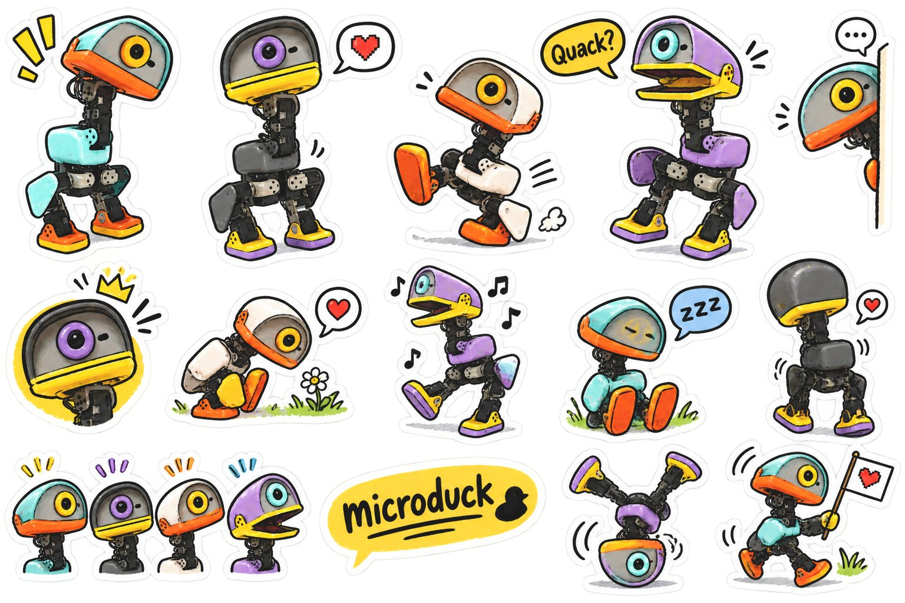
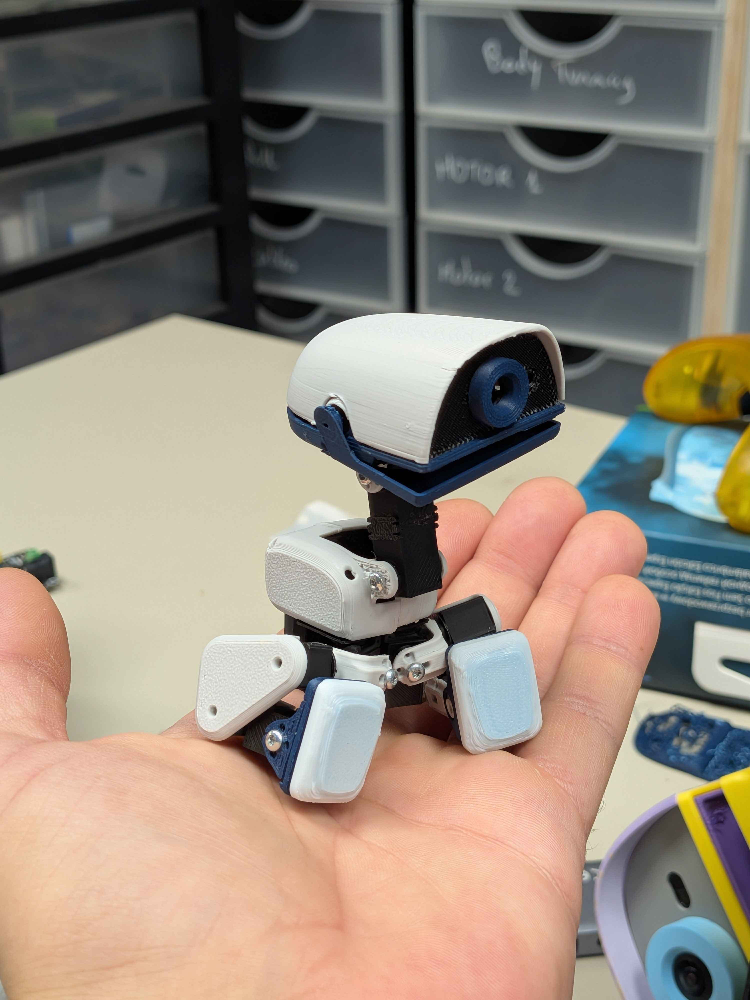

# 🐦 @_akhaliq

## 📅 August 31, 2026

> 11 post(s) archived.

---

### 🕐 19:43 UTC · @_akhaliq

> LoopArena Benchmarking Models as Runtime Controllers for Loop Engineering paper: https://huggingface.co/papers/2608.28281 Media

🔗 [View original post](https://x.com/_akhaliq/status/2094511483639963904)

---

### 🕐 16:50 UTC · @_akhaliq

> Over 4 petabytes of models and datasets have been uploaded to HF just last week by AI builders and their agents! That&apos;s the equivalent of ~800,000 HD movies. More than ever the storage and collaboration platform for AI!

🔗 [View original post](https://x.com/ClementDelangue/status/2094467968268657001)

---

### 🕐 15:00 UTC · @_akhaliq

> One image. A world to train in, shoot in &amp; explore. 🌍 👀Meet HYPER3D #WorldGen: independent foreground meshes + #3DGS background, built for interaction. For robotics🦾, film🎬, games🎮, DCC💎 &amp; XR. 🔥Powered by our Best Paper Award Project 「CAST」. Let&apos;s Connect the Dots⬇️ Media

🔗 [View original post](https://x.com/DeemosTech/status/2094440163246256523)

---

### 🕐 13:47 UTC · @_akhaliq

> 10,000+ microducks were pre-ordered in just five days! We weren&apos;t expecting that many (it&apos;s more than the total number of reachy mini in a year) and it will generate delays so from now on, it will be first-ordered, first shipped to make it fair for everyone!

🔗 [View original post](https://x.com/ClementDelangue/status/2094421922159210979)

---

### 🕐 11:33 UTC · @_akhaliq

> Made a Microduck sticker pack because apparently owning the robot wasn’t enough. Thoughts? Apparently the peak of ROBOTICS in 2026 is a $399 duck on roller skates. Microduck pre-orders topped $2.6M in 24 hours. Now there’s a 4–6 month backlog. Not a humanoid. Not a warehouse robot. A duck. That’s where the joke gets inconvenient. Microduck is from Pollen Robotics, now …

🔗 [View original post](https://x.com/aistasiia/status/2094388078043390323)

---

### 🕐 11:26 UTC · @_akhaliq

> Weights open: https://huggingface.co/deepseek-ai/DeepSeek-V4-Flash-Vision-Exp DeepSeek-V4-Flash-Vision-Exp is now live on the DeepSeek API Platform! 🚀 🔹 This experimental multimodal model matches DeepSeek-V4-Flash on text capabilities—including agents, reasoning, and world knowledge. 🔹 On multimodal agent benchmarks, V4-Flash-Vision-Exp makes a major le…

🔗 [View original post](https://x.com/zizhpan/status/2094386230675062836)

---

### 🕐 09:55 UTC · @_akhaliq

> MAKE IT SMALLER! MICROER! DUCKIER!

🔗 [View original post](https://x.com/andimarafioti/status/2094363440152203331)

---

### 🕐 07:15 UTC · @_akhaliq

> People have reported issues on https://paperswithcode.co/chat to me Apologies! Working on a more scalable architecture Should I just open-source the code base so we can collectively improve it?

🔗 [View original post](https://x.com/NielsRogge/status/2094323113810907170)

---

### 🕐 04:18 UTC · @_akhaliq

> Code as Worlds Agentic Discovery of Executable World Representations for Physical Reasoning paper: https://huggingface.co/papers/2608.27549

🔗 [View original post](https://x.com/_akhaliq/status/2094278702532358362)

---

### 🕐 03:44 UTC · @_akhaliq

> Numbers are way higher now We sold over $2,500,000 worth of Microducks in the first 24 hours. Is this one of the most successful robot launches in history? Insane achievement by @antoinepirrone and the team!

🔗 [View original post](https://x.com/matth_lapeyre/status/2094269998126530959)

---

### 🕐 02:42 UTC · @_akhaliq

> Microduck reached the Shopify UI limit

🔗 [View original post](https://x.com/Thom_Wolf/status/2094254389443584383)

---
