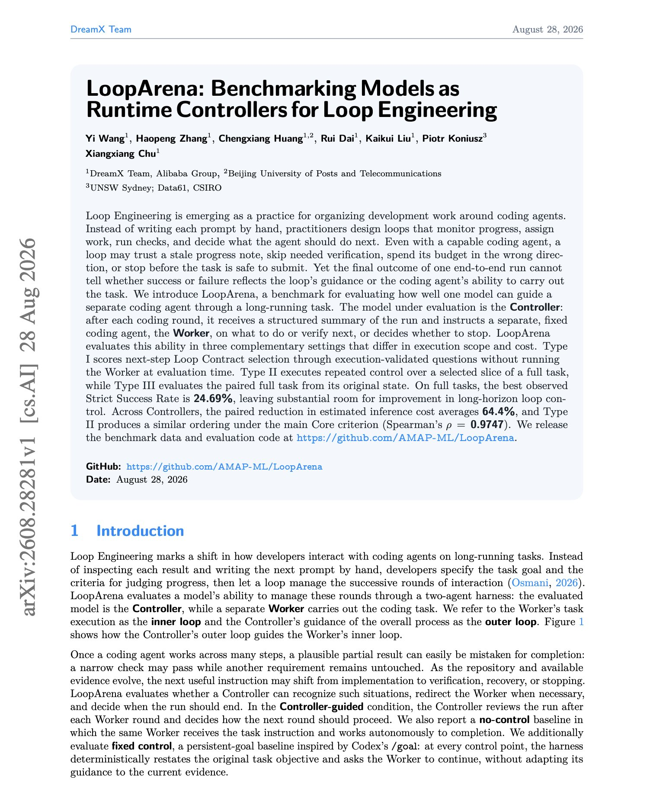
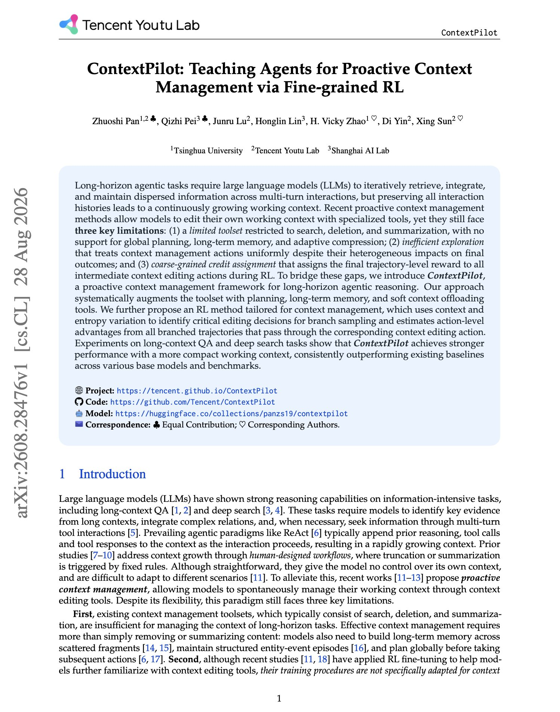

# 🐦 @dair_ai

## 📅 August 31, 2026

> 4 post(s) archived.

---

### 🕐 19:44 UTC · @dair_ai

> Loop engineering has emerged as a new skill for AI engineers But there is very little research measuring how effective it is. The best results on full tasks in a new benchmark is ~25%. LoopArena from AMAP evaluates the outer loop rather than the coding agent. A Controller model receives a structured summary after each round and instructs a separate fixed Worker agent on what to do or verify next, or decides to stop. Holding the Worker constant makes the result readable, since an end-to-end run cannot tell you whether success came from the guidance or from the agent carrying it out. The named failure modes will be familiar to anyone running long agent sessions: - Trusting a stale progress note - Skipping needed verification - Spending budget in the wrong direction - Stopping before the task is safe to submit Paper: https://arxiv.org/abs/2608.28281 Chat with Paper: https://academy.dair.ai/papers/looparena-benchmarking-models-as-runtime-controllers-for-loop-engineering-2608.28281

🔗 [View original post](https://x.com/dair_ai/status/2094511549306315189)

---

### 🕐 19:20 UTC · @dair_ai

> Interesting paper from Tencent. Tencent trains an agent to manage its own working context, and assigns credit at the level of individual context edits. Long-horizon tasks force a model to retrieve, integrate and maintain scattered information across many turns, and keeping every interaction history makes the working context grow without bound. Recent proactive methods let a model edit its own context with tools, but the toolset stops at search, deletion and summarization. ContextPilot adds global planning, long-term memory and adaptive soft compression, so the agent can offload information rather than only discard it. The training side is where it gets interesting. Standard RL hands the final trajectory reward to every intermediate edit equally. ContextPilot uses context and entropy variation to find which editing decisions actually mattered, samples branches at those points, and estimates action-level advantages from all branched trajectories passing through that edit. On long-context QA and deep search it beats existing baselines across several base models while holding a more compact working context. Code is available. Paper: https://arxiv.org/abs/2608.28476 Chat with Paper: https://academy.dair.ai/papers/contextpilot-teaching-agents-for-proactive-context-management-via-fine-grained-r-2608.28476

🔗 [View original post](https://x.com/omarsar0/status/2094505508850032852)

---

### 🕐 18:57 UTC · @dair_ai

> Next to evals, harness engineering is quickly becoming one of the most important skills for AI engineers to have today.

🔗 [View original post](https://x.com/omarsar0/status/2094499914281566241)

---

### 🕐 14:30 UTC · @dair_ai

> This WikiSkill paper from Google is a must-read. At a high level, it shows the effectiveness of persistent agents, knowledge bases, and skills. @karpathy popularized LLM Wikis. But this paper provides an actual framework for how agents can tap into a wiki of skills that evolve. What&apos;s fascinating to me is how this can complement your agents. LLMs can only learn so much about the world. External knowledge is crucial to get agents to do tasks efficiently and accurately in the real world. So this is why I think this paper is an important one, as it tries to fix some of the common issues you face when building and maintaining skills. It automatically leverages your agent runs, persists that knowledge into a wiki, and uses all of that to keep skills properly tuned for reusability. The most impressive part of WikiSkill is that it appears to be model-agnostic. In other words, it works across different tasks and models. The evolved skills can even transfer to smaller models that sometimes outperform bigger models. This hints at the effectiveness of persistent agents, via persistent knowledge bases and evolved skills. The big question for me is how evolved skills coming out of WikiSkill transfer to the next generation of models. I think they will provide a huge advantage and be leveraged in more interesting ways by smarter models. The practical takeaway here is that we should all be thinking about how to build persistent knowledge bases across our companies and projects. And how to use that to upgrade and evolve our skills. Join our community to discuss this paper more: https://academy.dair.ai/papers/wikiskill-compiles-agent-experience-into-a-persistent-wiki-2608.27454

🔗 [View original post](https://x.com/omarsar0/status/2094432587821482036)

---
