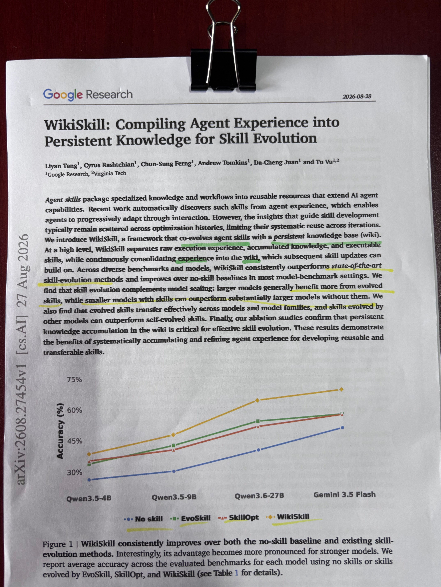

# 🐦 @dair_ai

## 📅 August 31, 2026

> 1 post(s) archived.

---

### 🕐 14:30 UTC · @dair_ai

> This WikiSkill paper from Google is a must-read. At a high level, it shows the effectiveness of persistent agents, knowledge bases, and skills. @karpathy popularized LLM Wikis. But this paper provides an actual framework for how agents can tap into a wiki of skills that evolve. What&apos;s fascinating to me is how this can complement your agents. LLMs can only learn so much about the world. External knowledge is crucial to get agents to do tasks efficiently and accurately in the real world. So this is why I think this paper is an important one, as it tries to fix some of the common issues you face when building and maintaining skills. It automatically leverages your agent runs, persists that knowledge into a wiki, and uses all of that to keep skills properly tuned for reusability. The most impressive part of WikiSkill is that it appears to be model-agnostic. In other words, it works across different tasks and models. The evolved skills can even transfer to smaller models that sometimes outperform bigger models. This hints at the effectiveness of persistent agents, via persistent knowledge bases and evolved skills. The big question for me is how evolved skills coming out of WikiSkill transfer to the next generation of models. I think they will provide a huge advantage and be leveraged in more interesting ways by smarter models. The practical takeaway here is that we should all be thinking about how to build persistent knowledge bases across our companies and projects. And how to use that to upgrade and evolve our skills. Join our community to discuss this paper more: https://academy.dair.ai/papers/wikiskill-compiles-agent-experience-into-a-persistent-wiki-2608.27454

🔗 [View original post](https://x.com/omarsar0/status/2094432587821482036)

---
