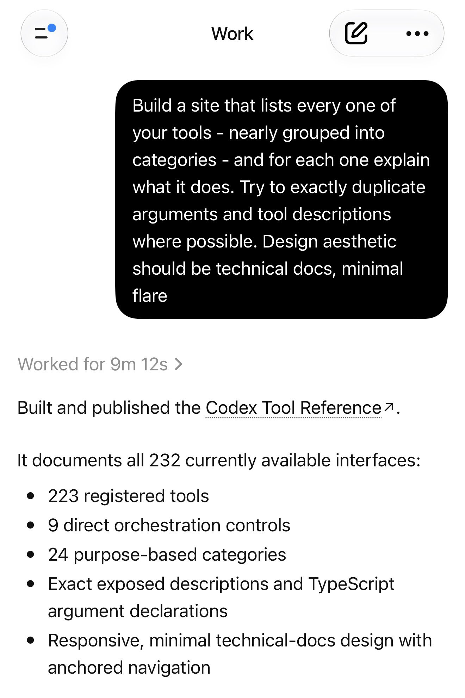
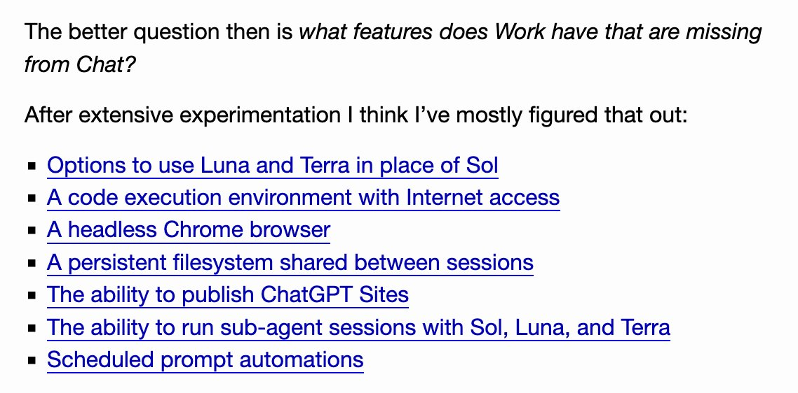

# 🐦 @simonw

## 📅 August 31, 2026

> 3 post(s) archived.

---

### 🕐 03:17 UTC · @simonw

> Bonus: I ran this prompt and had ChatGPT Work build me a ChatGPT Site listing all of its available tools along with their descriptions https://codex-tool-reference.simonw.chatgpt.site/ It&apos;s &quot;ChatGPT Work: The Missing Manual&quot;

🔗 [View original post](https://x.com/simonw/status/2094263278906269832)

---

### 🕐 00:05 UTC · @simonw

> Please let me know if there are any ChatGPT-Work-exclusive features that I missed!

🔗 [View original post](https://x.com/simonw/status/2094214960750694425)

---

### 🕐 00:04 UTC · @simonw

> Here&apos;s my attempt at explaining what ChatGPT Work can actually do - it&apos;s a deeply confusing but extremely powerful tool with a whole lot of useful features that aren&apos;t available in regular ChatGPT https://simonwillison.net/2026/Aug/30/understanding-chatgpt-work/

🔗 [View original post](https://x.com/simonw/status/2094214737957691854)

---
