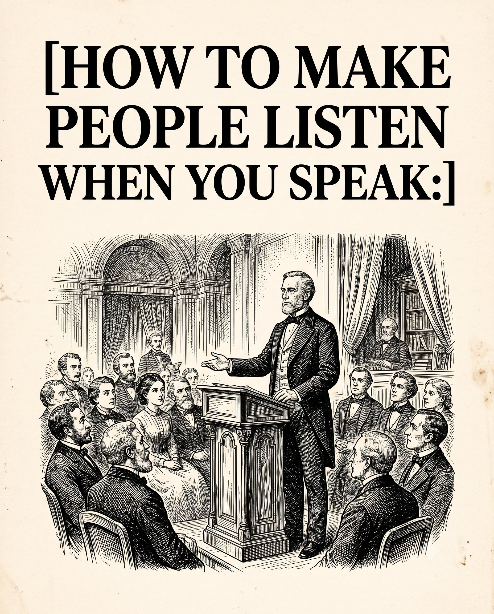

# 🐦 @theendeavorpath

## 📅 August 31, 2026

> 5 post(s) archived.

---

### 🕐 16:48 UTC · @theendeavorpath

> 7. Tell Real Stories Dry facts are boring, but personal struggles stick in the mind. People will remember a lesson much better if you attach a real story to it. Example: Instead of just telling people to work hard, share the exact moment you failed and what that mistake taught you.

🔗 [View original post](https://x.com/theendeavorpath/status/2094467366671589761)

---

### 🕐 16:48 UTC · @theendeavorpath

> 8. Change Your Speed Speaking at the same exact speed puts people to sleep. Speak fast when sharing excitement, and slow down a lot when delivering the main lesson. Example: Talk fast while describing a chaotic situation, then speak slowly on the final advice so it hits hard.

🔗 [View original post](https://x.com/theendeavorpath/status/2094467369288790035)

---

### 🕐 16:48 UTC · @theendeavorpath

> HOW TO MAKE PEOPLE LISTEN WHEN YOU SPEAK:

🔗 [View original post](https://x.com/theendeavorpath/status/2094467345729384463)

---

### 🕐 15:03 UTC · @theendeavorpath

> 8 JAPANESE TRICKS THAT WILL MAKE YOU VERY DANGEROUS... You should learn no. 6th for sure.. 🧵

🔗 [View original post](https://x.com/superior_hombre/status/2094440895752093918)

---

### 🕐 14:56 UTC · @theendeavorpath

> YOUR SON IS NOT BECOMING DISRESPECTFUL. HE IS LOSING HIS CHILDHOOD BRAIN. BETWEEN AGES 9-15, HIS BRAIN UNDERGOES ITS SECOND-LARGEST GROWTH SPURT OF LIFE.

🔗 [View original post](https://x.com/EnergyUp_/status/2094439183230337509)

---
