# 🐦 @Unlockyourlife_

## 📅 September 01, 2026

> 33 post(s) archived.

---

### 🕐 13:28 UTC · @Unlockyourlife_

> What&apos;s wrong with my friend&apos;s hand, guys? It&apos;s got these little water blisters that look all bumpy, and it&apos;s insanely itchy. Could this be from the water source, you think?

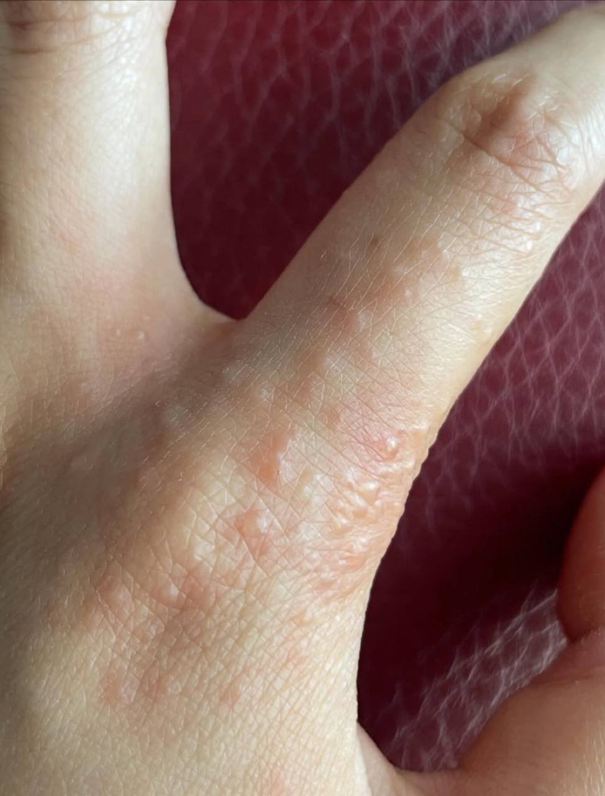

🔗 [View original post](https://x.com/Mastering_life_/status/2094779420464841168)

---

### 🕐 10:52 UTC · @Unlockyourlife_

> 10 Genius Science Hacks You Won&apos;t Believe Actually Work! 🤯 Media

🔗 [View original post](https://x.com/sciencepathx/status/2094740051468980437)

---

### 🕐 10:48 UTC · @Unlockyourlife_

> I Built a Hidden Arctic Bunker From Scratch 🥶👀 Would You Survive Here? Media

🔗 [View original post](https://x.com/Smart_Tipsx/status/2094739290370572656)

---

### 🕐 10:46 UTC · @Unlockyourlife_

> Smart Home Idea that works for you 😜 Media

🔗 [View original post](https://x.com/samx_reels/status/2094738724219146550)

---

### 🕐 10:33 UTC · @Unlockyourlife_

> The Tile Drilling Trick Every Contractor Should Know! Media

🔗 [View original post](https://x.com/_Brainboxx/status/2094735395292422237)

---

### 🕐 10:16 UTC · @Unlockyourlife_

> Different colors, different benefits

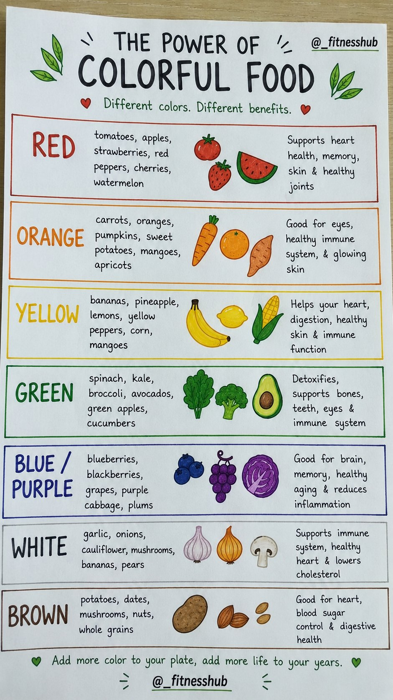

🔗 [View original post](https://x.com/_fitnesshub/status/2094731195162431859)

---

### 🕐 10:06 UTC · @Unlockyourlife_

> Your gym gains might be capped by a nutrient deficiency, not your training. 4 micronutrients that quietly control testosterone and recovery — most people are low in at least one

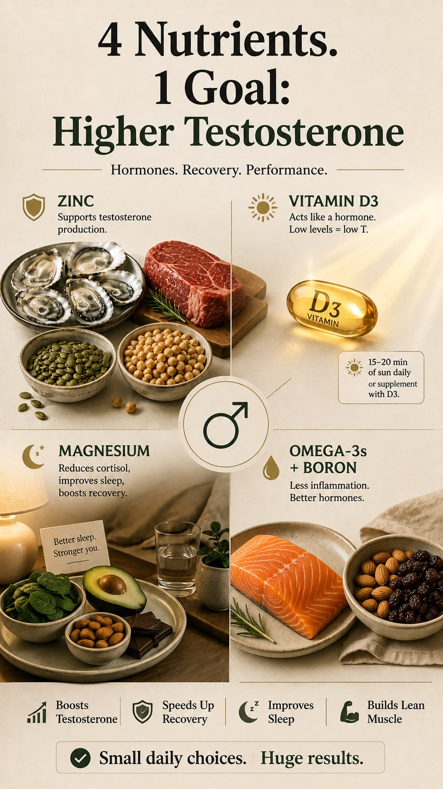

🔗 [View original post](https://x.com/BioLifex/status/2094728623164957137)

---

### 🕐 09:57 UTC · @Unlockyourlife_

> Learn RAM today

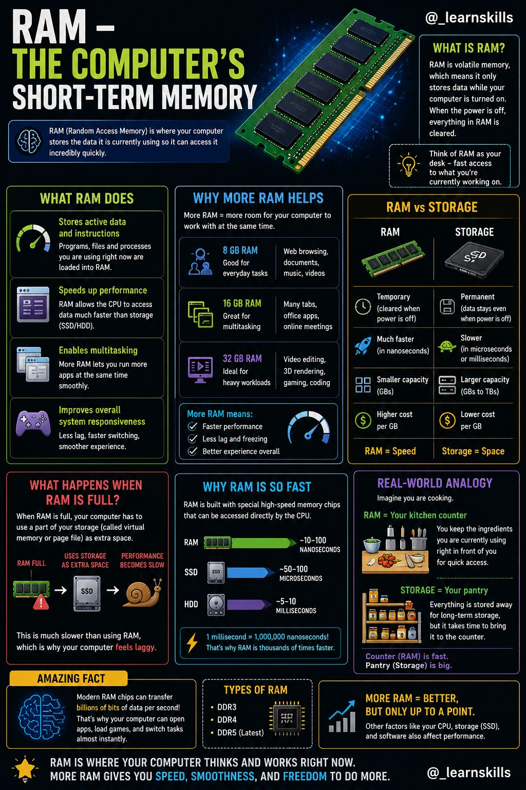

🔗 [View original post](https://x.com/_learnskills/status/2094726434086343156)

---

### 🕐 09:05 UTC · @Unlockyourlife_

> Oblique Crunches Media

🔗 [View original post](https://x.com/_alphafit/status/2094713328387952665)

---

### 🕐 08:47 UTC · @Unlockyourlife_

> At Home Abs Workout Media

🔗 [View original post](https://x.com/BioLifex/status/2094708634512933053)

---

### 🕐 08:42 UTC · @Unlockyourlife_

> My son ; At some point, stop asking whether you can make a relationship work and ask whether it should work. Those are different questions. • You can force communication. • You can compromise endlessly. • You can keep forgiving. • You can keep trying. But if the fundamental values and direction don&apos;t align, effort alone won&apos;t turn incompatibility into compatibility.

🔗 [View original post](https://x.com/Masculinjournal/status/2094707362401521825)

---

### 🕐 08:24 UTC · @Unlockyourlife_

> The goal isn&apos;t to fear medication-it&apos;s to avoid needing it unnecessarily. Building healthy eating habits early can help reduce your risk of chronic health problems and support your body before disease develops. But when medication is prescribed, food should complement treatment, not replace it without medical advice.

🔗 [View original post](https://x.com/FitnessDr_/status/2094702881500791231)

---

### 🕐 08:24 UTC · @Unlockyourlife_

> 7. Anemia

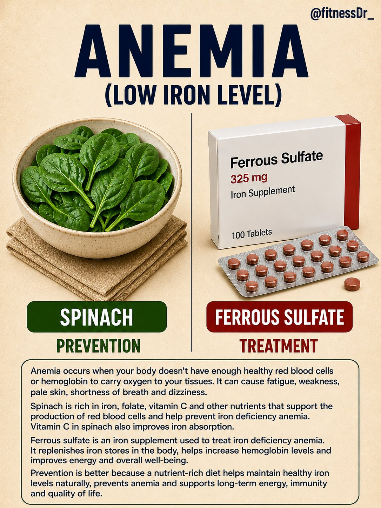

🔗 [View original post](https://x.com/FitnessDr_/status/2094702878078185884)

---

### 🕐 08:24 UTC · @Unlockyourlife_

> 6. Constipation

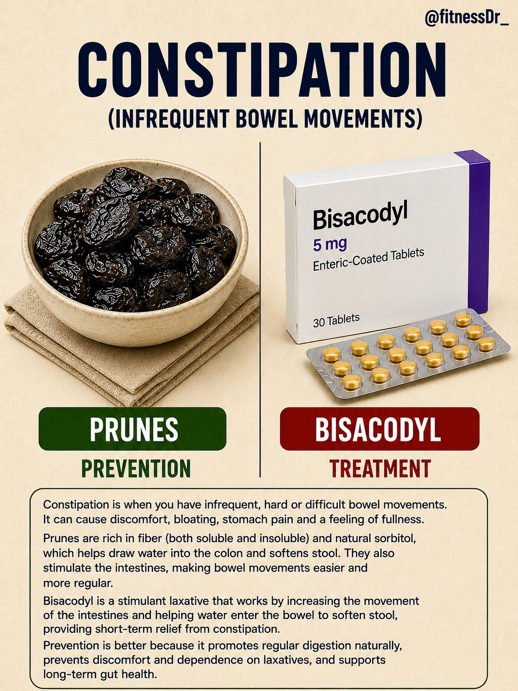

🔗 [View original post](https://x.com/FitnessDr_/status/2094702868641075374)

---

### 🕐 08:24 UTC · @Unlockyourlife_

> 5. Acid Reflux

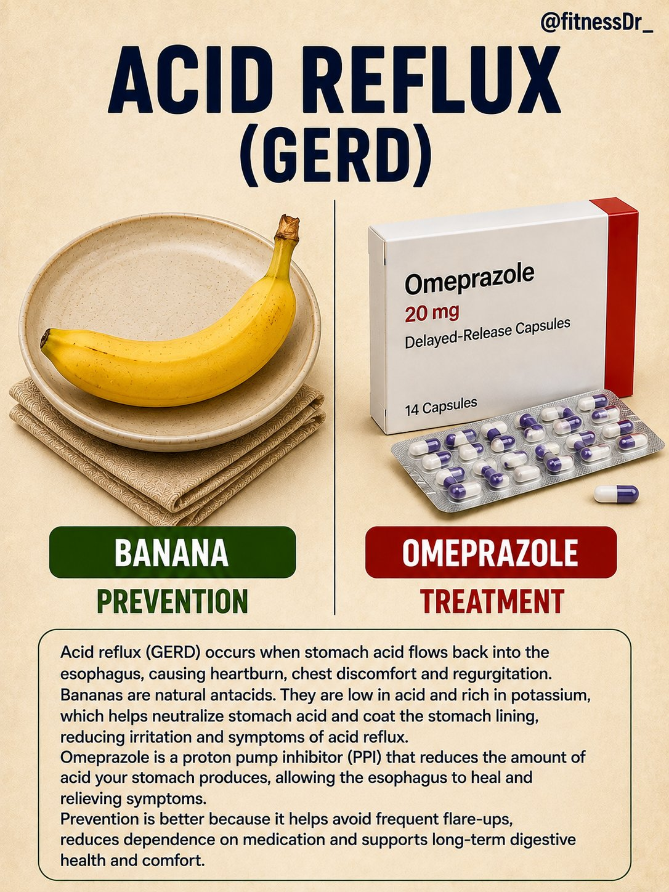

🔗 [View original post](https://x.com/FitnessDr_/status/2094702858427924675)

---

### 🕐 08:24 UTC · @Unlockyourlife_

> 4. Fatty Liver

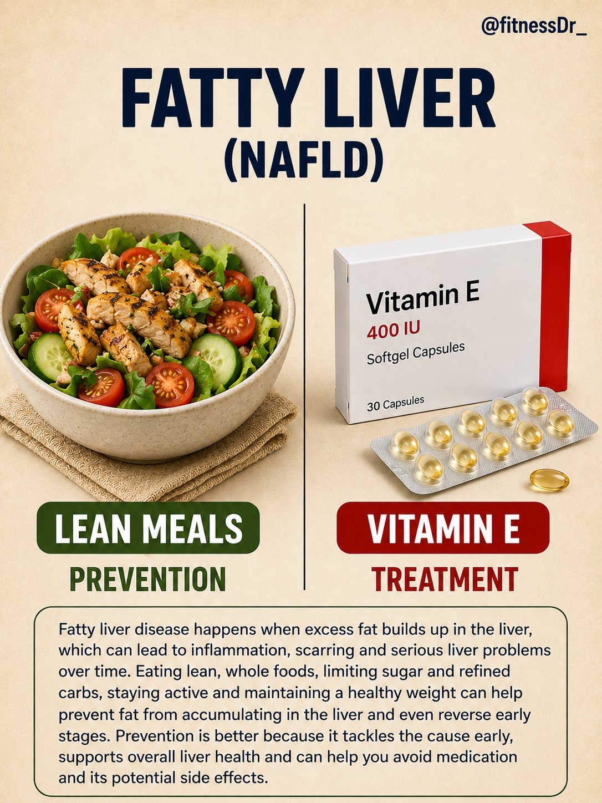

🔗 [View original post](https://x.com/FitnessDr_/status/2094702848869032128)

---

### 🕐 08:24 UTC · @Unlockyourlife_

> 3. High blood pressure

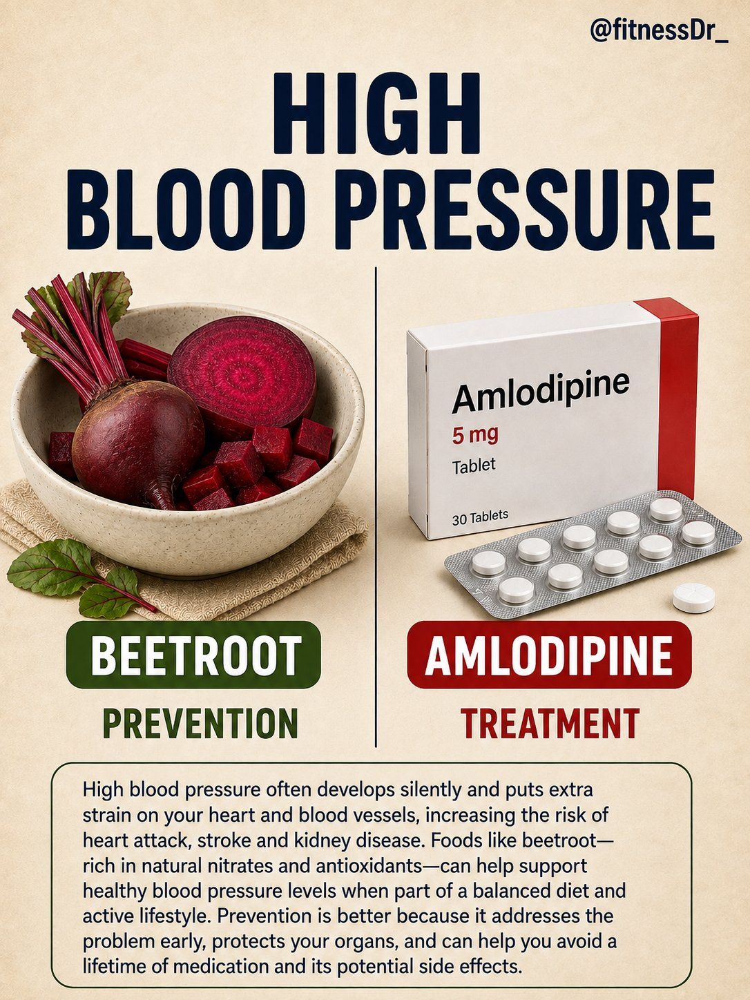

🔗 [View original post](https://x.com/FitnessDr_/status/2094702838395899960)

---

### 🕐 08:24 UTC · @Unlockyourlife_

> 2. Type 2 Diabetes

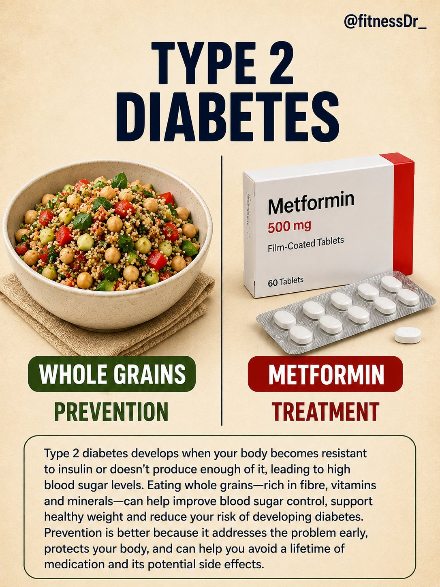

🔗 [View original post](https://x.com/FitnessDr_/status/2094702828497293447)

---

### 🕐 08:24 UTC · @Unlockyourlife_

> 7 Natural Ways to Support Your Health Before Medication. 1. High cholesterol

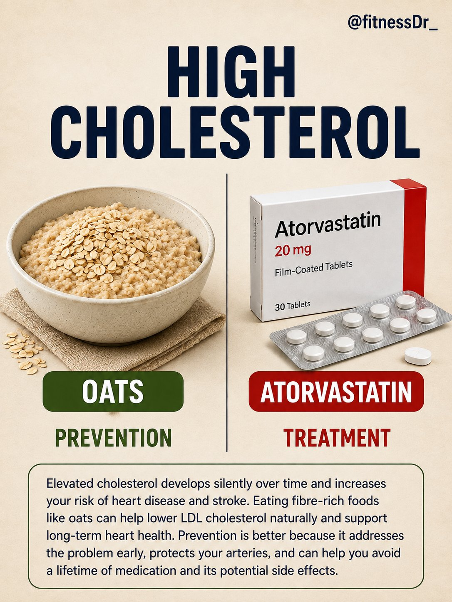

🔗 [View original post](https://x.com/FitnessDr_/status/2094702818569412835)

---

### 🕐 07:44 UTC · @Unlockyourlife_

> Healthy eating doesn’t have to mean buying expensive “fitness foods.” Sometimes it’s literally: Eggs. Bananas. Vegetables. Beans. Groundnuts. Simple foods. Real nutrients. Less unnecessary complication. The best diet is usually the one you can actually stick with. 🥗🤝

🔗 [View original post](https://x.com/_fitnesshub/status/2094692871202820226)

---

### 🕐 07:44 UTC · @Unlockyourlife_

> 🥜 5. Groundnuts — tiny but nutrient-dense Groundnuts provide protein, healthy unsaturated fats, fiber and several micronutrients. They’re also an easy snack when you need something more substantial than sweets. Just remember: they’re calorie-dense, so portions still matter.

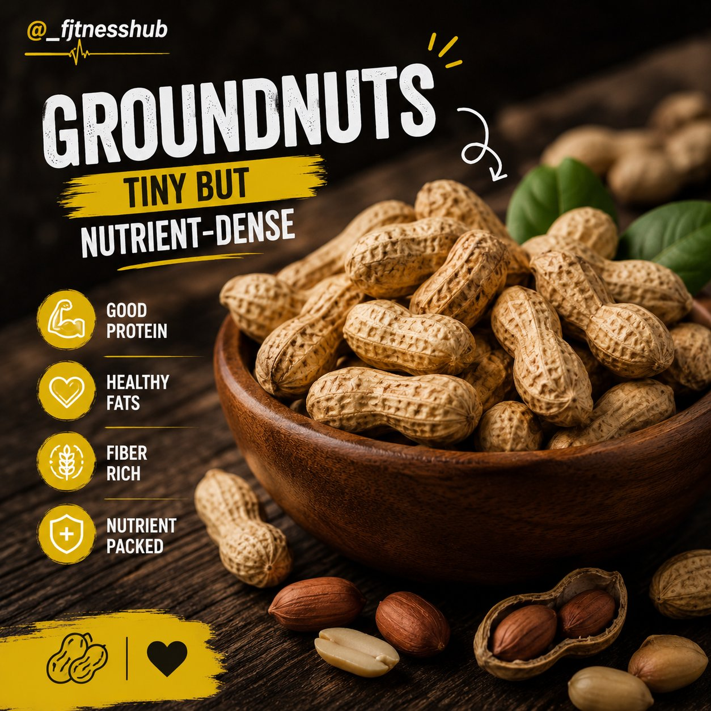

🔗 [View original post](https://x.com/_fitnesshub/status/2094692867855860098)

---

### 🕐 07:44 UTC · @Unlockyourlife_

> 🫘 4. Beans — underrated for a reason Beans provide plant protein, fiber, iron, folate and other nutrients. They can also help make meals more filling. Rice + beans isn’t just a classic combo. It’s a pretty solid nutritional combo too.

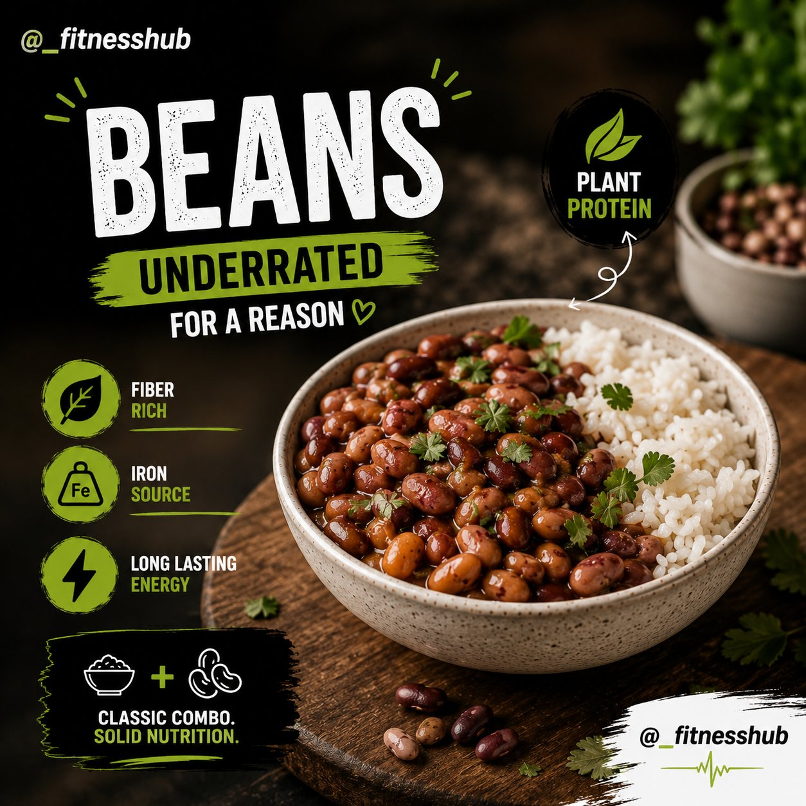

🔗 [View original post](https://x.com/_fitnesshub/status/2094692862889734319)

---

### 🕐 07:44 UTC · @Unlockyourlife_

> 🥬 3. Leafy greens — small calories, big nutrition Spinach, kale and other leafy vegetables provide fiber, vitamins, minerals and other beneficial plant compounds. You don’t need a mountain of vegetables on your plate. Just make them a regular part of your meals.

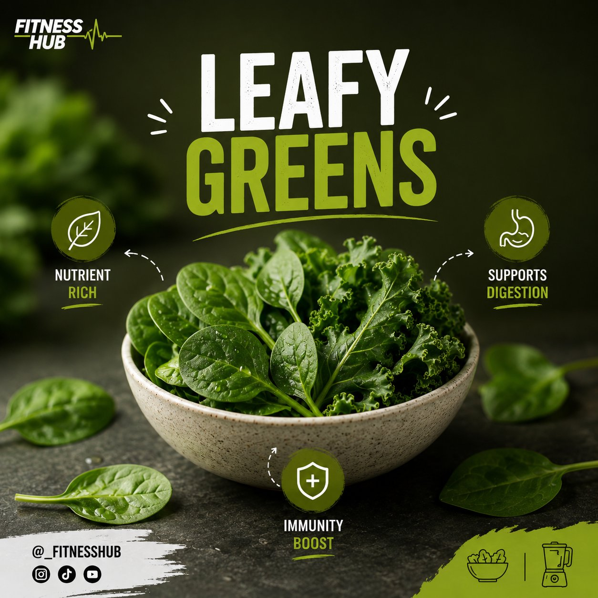

🔗 [View original post](https://x.com/_fitnesshub/status/2094692858217292010)

---

### 🕐 07:44 UTC · @Unlockyourlife_

> 🍌 2. Bananas — more than just a quick snack Bananas provide carbohydrates and potassium, making them an easy option before or after physical activity. They’re cheap, portable, and require absolutely zero cooking skills. Pair one with some protein for a more filling snack.

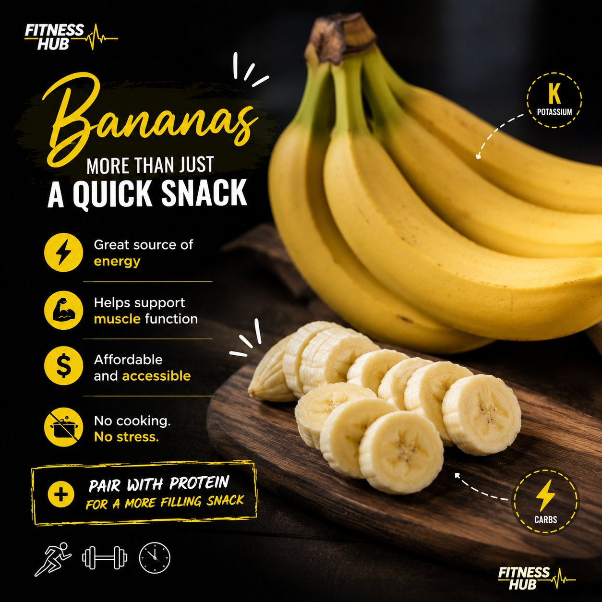

🔗 [View original post](https://x.com/_fitnesshub/status/2094692853444137020)

---

### 🕐 07:44 UTC · @Unlockyourlife_

> 🥚 1. Eggs — a simple protein powerhouse Eggs provide high-quality protein along with nutrients such as choline, vitamin B12 and selenium. They’re also ridiculously easy to prepare. Boiled. Scrambled. Omelette. Just don’t overcomplicate it.

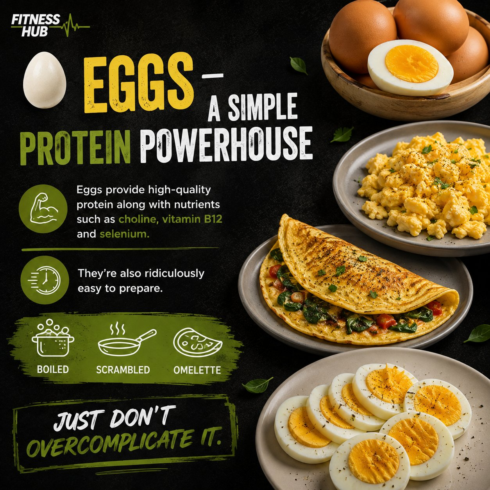

🔗 [View original post](https://x.com/_fitnesshub/status/2094692848641659374)

---

### 🕐 07:44 UTC · @Unlockyourlife_

> 5 foods that are doing more for your body than you think 🥗 Not every healthy food needs to be expensive, complicated, or some “superfood” you’ve never heard of. Some of the simplest foods can bring a lot to the table. Here are 5 everyday foods worth eating more often:

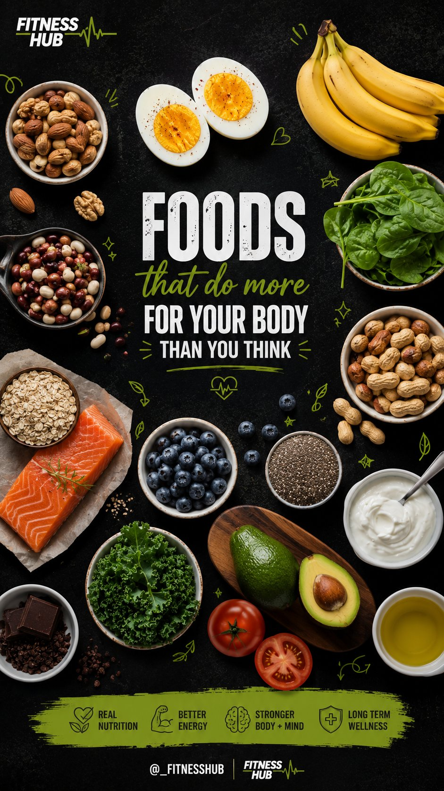

🔗 [View original post](https://x.com/_fitnesshub/status/2094692843830800886)

---

### 🕐 07:21 UTC · @Unlockyourlife_

> The Coolest Science You Will See Today! Media

🔗 [View original post](https://x.com/sciencepathx/status/2094687112578642124)

---

### 🕐 07:19 UTC · @Unlockyourlife_

> You’re joking right…😂 Media

🔗 [View original post](https://x.com/Smart_Tipsx/status/2094686507680313683)

---

### 🕐 07:15 UTC · @Unlockyourlife_

> Only Real Ones Can Name This Wood!🪵 Media

🔗 [View original post](https://x.com/samx_reels/status/2094685437335851062)

---

### 🕐 07:08 UTC · @Unlockyourlife_

> A Simple &amp; Effective Trick! Media

🔗 [View original post](https://x.com/_Brainboxx/status/2094683745001325053)

---

### 🕐 06:31 UTC · @Unlockyourlife_

> Loaded Nacho Platter.

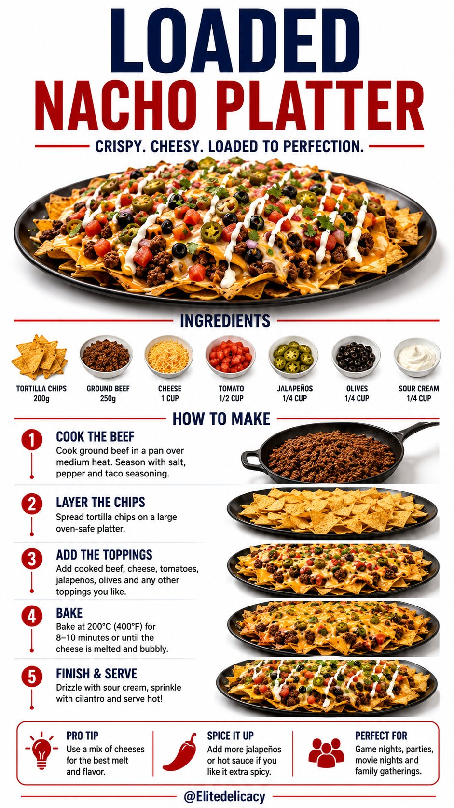

🔗 [View original post](https://x.com/Elitedelicacy/status/2094674406043754640)

---

### 🕐 06:27 UTC · @Unlockyourlife_

> Daily Mobility Flow.

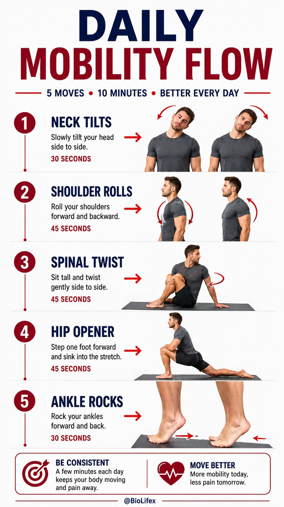

🔗 [View original post](https://x.com/BioLifex/status/2094673439869034742)

---

### 🕐 06:26 UTC · @Unlockyourlife_

> Heavy Shrugs Traps Activation.

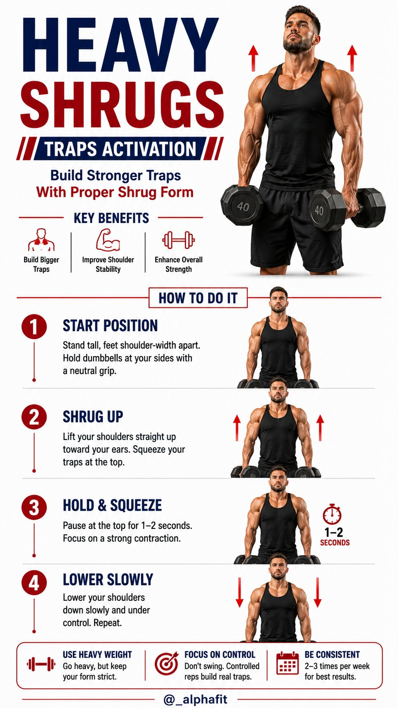

🔗 [View original post](https://x.com/_alphafit/status/2094673307974955309)

---
