# 🐦 @Wise1Philosophy

## 📅 September 01, 2026

> 114 post(s) archived.

---

### 🕐 18:59 UTC · @Wise1Philosophy

> Claude Fable 5.1 and Mythos 5.1 already causing budget decisions pov: new model drops and you have 14% of your weekly limit left

🔗 [View original post](https://x.com/Wise1Philosophy/status/2094862642376474872)

---

### 🕐 18:38 UTC · @Wise1Philosophy

> AI for learning gets a lot more useful when it can adapt to what you need, instead of making you figure out the perfect prompt first. Gauth is building that into the learning experience with personalized courses, quizzes, visuals, and an AI Tutor along the way. They’re live on Product Hunt today. Worth a look. https://www.producthunt.com/products/gauth-ai-course

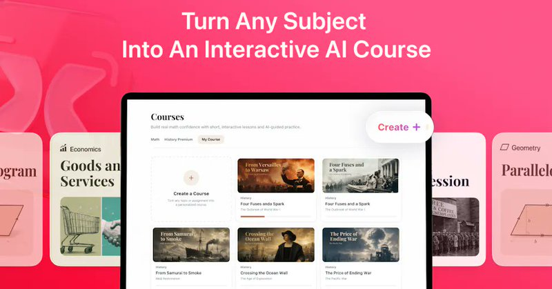

🔗 [View original post](https://x.com/Damn_coder/status/2094857328600523115)

---

### 🕐 18:35 UTC · @Wise1Philosophy

> POV: my wallet muted Claude notifications 😭 Media We’re introducing Claude Fable 5.1 and Claude Mythos 5.1. They&apos;re the world’s most advanced models for coding and knowledge work.

🔗 [View original post](https://x.com/socialwithaayan/status/2094856639723741597)

---

### 🕐 18:04 UTC · @Wise1Philosophy

> RT @DataChaz: WOW. Federal agencies are deploying Bland&apos;s voice AI to automate public sector calls. folks finding out they’ll never have t…

🔗 [View original post](https://x.com/Wise1Philosophy/status/2094848894769201234)

---

### 🕐 18:04 UTC · @Wise1Philosophy

> 47 major AI coding releases in 8 months. Asked Keenable SELECT to map the entire 2026 coding landscape. One prompt. 15 companies. 47 sourced releases. Querying the web like a database is a pretty wild unlock ↓ We just launched Keenable SELECT. It is an agent that queries the web as a database. Try it and share your best reports with us! Free through September.

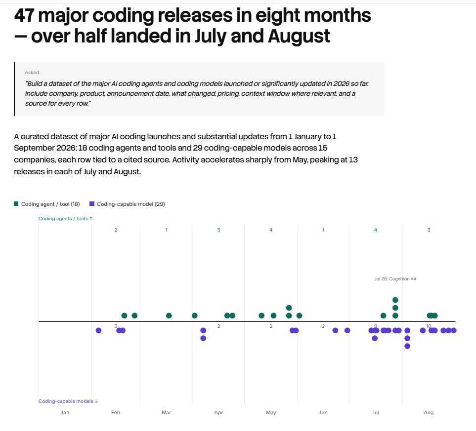

🔗 [View original post](https://x.com/alex_prompter/status/2094848889102754071)

---

### 🕐 17:58 UTC · @Wise1Philosophy

> 5 doctor&apos;s tricks that sound strange but relieve symptoms in less than a minute.. 🧵

🔗 [View original post](https://x.com/Manifest_Lord/status/2094847420811362516)

---

### 🕐 17:58 UTC · @Wise1Philosophy

> 5 punishments that damage kids long-term. They feel effective at 6. They install a pattern that shows up at 26. Here they are.

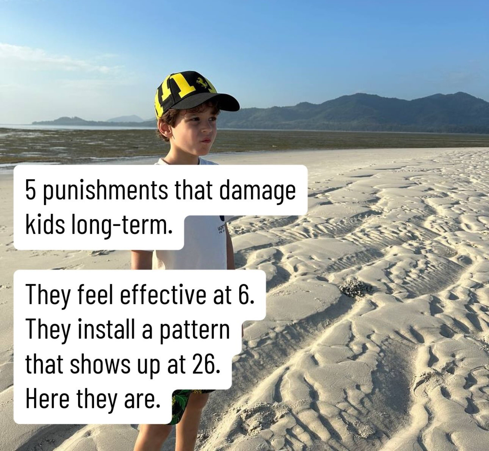

🔗 [View original post](https://x.com/scotti_brooks/status/2094847345422901252)

---

### 🕐 17:34 UTC · @Wise1Philosophy

> 2K + stereo sound in one pass is a nasty combo Agencies charge $16,756.30 for a commercial like this. I made it with MiniMax H3 on @Hailuo_AI in ONE generation. 2K, 15 seconds, stereo sound baked in. No after effects. No render farm. No revision calls. Prompt below: 👇

🔗 [View original post](https://x.com/Wise1Philosophy/status/2094841436675957244)

---

### 🕐 17:30 UTC · @Wise1Philosophy

> Your body will forgive you for: -Skipping a workout -Eating pizza -Sleeping poorly one night -Losing motivation Your body WILL NOT forgive you for:

🔗 [View original post](https://x.com/LevelUpPrime/status/2094840276615581793)

---

### 🕐 17:17 UTC · @Wise1Philosophy

> A billionaire once shared this advice: “When you start making money, focus on these priorities before chasing a more expensive life style.” The list shocked me to my core: 1. Buy fewer clothes, but choose higher quality.

🔗 [View original post](https://x.com/josh_uglyasf/status/2094837159731880118)

---

### 🕐 17:09 UTC · @Wise1Philosophy

> very important read for PE partners: PE firms are creating a new role: AI Operating Partner. Korn Ferry and Heidrick &amp; Struggles both published reports on it this year. The title tells you everything. It&apos;s a confession. They spent 18 months buying Copilot seats, funding agent platforms, and running internal hackatho…

🔗 [View original post](https://x.com/alex_prompter/status/2094835050642616599)

---

### 🕐 17:06 UTC · @Wise1Philosophy

> https://x.com/i/article/2089332234679640064

🔗 [View original post](https://x.com/alex_prompter/status/2094834359106764866)

---

### 🕐 17:04 UTC · @Wise1Philosophy

> 3-5x sounds like a vendor deck number. I used to think that too. Then we rebuilt a client&apos;s core platform. Their team estimated 7 to 8 months. Two engineers delivered the core in 3.5 months, production by month 6. 122 merged PRs in 90 days. 104 with fewer than 5 reviewer comments. $200 per developer per month in AI compute. Their CTO called the pod &quot;top performing team.&quot; Both engineers got bonused twice. That multiplier came from removing three bottlenecks most teams don&apos;t measure. [1] Visibility: your team doesn&apos;t know what the AI can reach in the codebase, so they guess, burn cycles on code the agent can&apos;t touch, and report progress they haven&apos;t made. [2] Trust: your engineers ship AI-generated code without deterministic review gates, and defect risk scales with output volume. [3] Drift: you&apos;re not tracking cost per commit, cycle time by task type, or where the agent adds value, so by week four you&apos;re paying for velocity you&apos;re not getting. 98% of our code is not handwritten, and a senior engineer reviews every line before it ships. That number reflects the system around the AI. The Velocity Framework exists because 3-5x falls out when you solve those three problems every sprint.

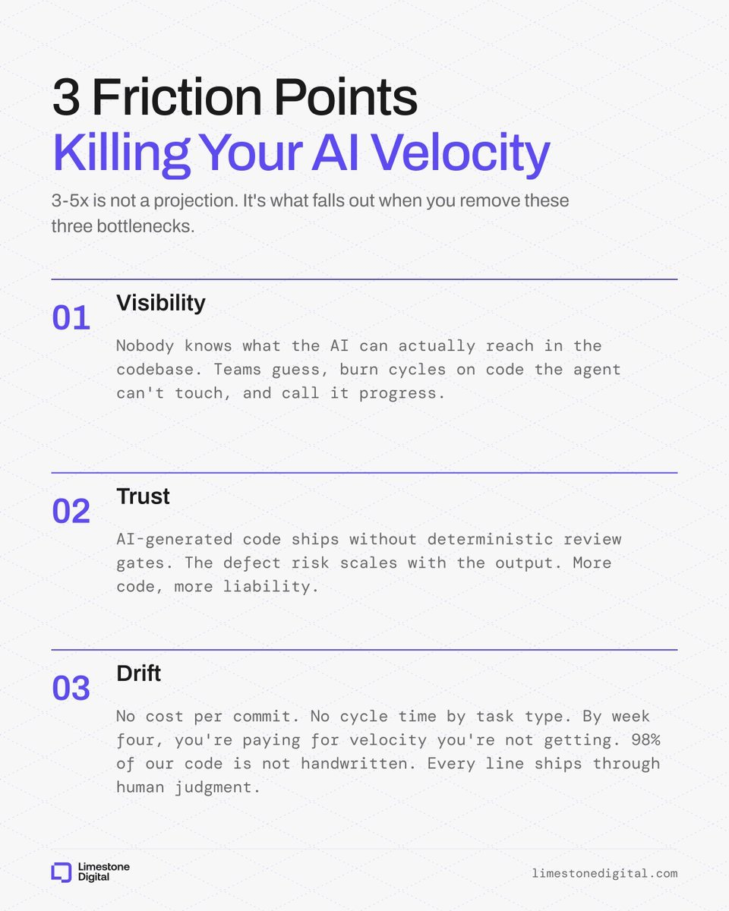

🔗 [View original post](https://x.com/LimestoneHQ/status/2094833873708327098)

---

### 🕐 17:04 UTC · @Wise1Philosophy

> The Bland phone car went to Washington. Bland is now the first FedRAMP 20x Class A certified voice AI company in the US, bringing secure, reliable AI phone infrastructure to federal agencies. Complex, high-stakes calls, now available to the public sector. Learn more here: https://www.bland.ai/government

🔗 [View original post](https://x.com/usebland/status/2094833694607605957)

---

### 🕐 16:52 UTC · @Wise1Philosophy

> Robotics training inside this sounds sooo useful :) Visko just dropped Orbis and it changes what a simulator is. It is a Live Model, so it runs instead of returning a file. &gt; real time, the world moves on the clock, not on your render queue &gt; memory carries forward, nothing is rebuilt from scratch &gt; you can intervene mid run and i…

🔗 [View original post](https://x.com/Wise1Philosophy/status/2094830760331006159)

---

### 🕐 16:35 UTC · @Wise1Philosophy

> Amazon shows you the total price. Costco shows you the per-unit price. That one difference is costing Amazon shoppers roughly $850 a year. Amazon&apos;s product page shows a package price and a delivery date. $29.99. Arrives tomorrow. One click. Done. Costco&apos;s shelf tag shows the per-unit price right on the label. $0.04 per tablet. $0.13 per bag. $0.22 per ounce. The math is already done. The comparison is already visible. Most Amazon shoppers never calculate the per-unit cost on anything they buy. They see a package price that looks reasonable, they see Prime delivery that feels fast, and they click. The total feels right. The per-unit math, the number that actually tells you whether you&apos;re overpaying, never enters the decision because nothing on Amazon&apos;s screen ever shows it. A supply chain analyst who spent 8 years comparing wholesale, retail, and marketplace pricing across hundreds of consumer products sat down with her coworker one evening and compared 15 common household products per-unit across both stores. Amazon was more expensive on 11 of them. On the 4 where Amazon was cheaper, the difference was cents. On the 11 where Costco was cheaper, the difference was dollars. &quot;You&apos;re not comparing prices when you shop on Amazon. You&apos;re comparing feelings. The package looks affordable. The delivery feels fast. The one-click checkout feels easy. But you&apos;ve never once divided the package price by the unit count and compared that number to what the same product costs per-unit at the warehouse you drive past every week. That one calculation, done once, on each product, changes everything.&quot; Here are the 9 items where the per-unit math hurts the most 🧵

🔗 [View original post](https://x.com/Kevincreates77/status/2094826493990125864)

---

### 🕐 16:32 UTC · @Wise1Philosophy

> 80 cents of every venture dollar on Earth now goes to AI. Not tech. Not software. AI alone. Investors have never bet this hard on one thing in the history of venture capital, and it happened in a single quarter. The full story is in the H1 2026 Industry Report:https://bit.ly/StateofAI2026

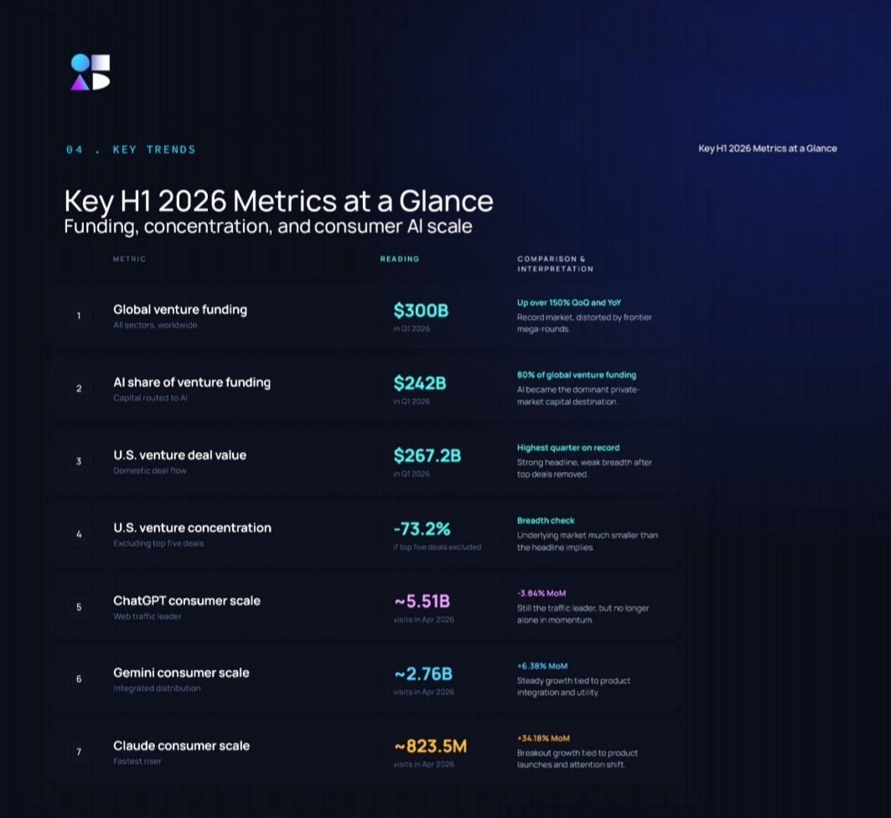

🔗 [View original post](https://x.com/TheAIColonyRD/status/2094825698120577361)

---

### 🕐 16:29 UTC · @Wise1Philosophy

> Conventional AI video has one setting: offline. Humans have one setting: now. Orbis closed that gap by streaming continuously and accepting input while it generates. Everything before this asked people to wait. This one does not. Today, we are introducing Orbis 1.0, our first Live Model! Create living worlds and stream them in real time, with persistent memory, interactivity, and physics-grounded generation of unbounded length. Try it now at https://www.visko.ai/models#orbis API available via @reactorworl…

🔗 [View original post](https://x.com/AriaWestcott/status/2094824861604487433)

---

### 🕐 16:24 UTC · @Wise1Philosophy

> AT LAST A GENAI VIDEO MODEL THAT ACTUALLY KILLS THE RENDER WAIT TIME @viskoai just launched Orbis alongside a $10M pre-seed. The big difference? You don&apos;t wait for a video to finish rendering. The world streams continuously, and you can change it while it&apos;s being generated. Shot going in the wrong direction? Just update the prompt. The scene adapts live. interesting release 👀 Media Today, we are introducing Orbis 1.0, our first Live Model! Create living worlds and stream them in real time, with persistent memory, interactivity, and physics-grounded generation of unbounded length. Try it now at https://www.visko.ai/models#orbis API available via @reactorworl…

🔗 [View original post](https://x.com/DataChaz/status/2094823715586429011)

---

### 🕐 16:24 UTC · @Wise1Philosophy

> Visko did not build a better generator. They built something closer to a running simulation. A rendered clip is finished the moment it exists. A live model keeps deciding what happens next, which is why you can interrupt it and it obeys. Different machine, different ceiling. Today, we are introducing Orbis 1.0, our first Live Model! Create living worlds and stream them in real time, with persistent memory, interactivity, and physics-grounded generation of unbounded length. Try it now at https://www.visko.ai/models#orbis API available via @reactorworl…

🔗 [View original post](https://x.com/AIHighlight/status/2094823654353670636)

---

### 🕐 16:23 UTC · @Wise1Philosophy

> AI has no limits! Media

🔗 [View original post](https://x.com/AIHighlight/status/2094823466939683207)

---

### 🕐 16:22 UTC · @Wise1Philosophy

> This science class came out of one prompt. It&apos;s Orbis, the live model @viskoai announced today. It doesn&apos;t render clips, it streams a world while you watch. I typed one line, picked Stable mode, and it played this out live: the teacher, the four kids, the solar system drifting on the wall screen. The part that got me: the prompt stays open while it runs. Type a change mid-stream and the scene follows without restarting or losing the room. Full prompt in the reply. Media Today, we are introducing Orbis 1.0, our first Live Model! Create living worlds and stream them in real time, with persistent memory, interactivity, and physics-grounded generation of unbounded length. Try it now at https://www.visko.ai/models#orbis API available via @reactorworl…

🔗 [View original post](https://x.com/alex_prompter/status/2094823237666427172)

---

### 🕐 16:22 UTC · @Wise1Philosophy

> This is a bigger deal than the timeline thinks. The reason AI video breaks after a minute is that nothing is holding the world together between frames. Orbis holds it with persistent memory and physics, so long runs stop drifting. Length was never the problem. Consistency was. Today, we are introducing Orbis 1.0, our first Live Model! Create living worlds and stream them in real time, with persistent memory, interactivity, and physics-grounded generation of unbounded length. Try it now at https://www.visko.ai/models#orbis API available via @reactorworl…

🔗 [View original post](https://x.com/TheAIColony/status/2094823227746906322)

---

### 🕐 16:20 UTC · @Wise1Philosophy

> Think about robotics training in a world that never breaks its own rules. Or a game level that generates itself while you walk through it. Orbis makes both a real-time problem instead of a rendering problem. Today, we are introducing Orbis 1.0, our first Live Model! Create living worlds and stream them in real time, with persistent memory, interactivity, and physics-grounded generation of unbounded length. Try it now at https://www.visko.ai/models#orbis API available via @reactorworl…

🔗 [View original post](https://x.com/FutureStacked/status/2094822766562222085)

---

### 🕐 16:19 UTC · @Wise1Philosophy

> I would lose track after bot number three 😂 a grok bot bought a tesla this week another one runs a trading floor 24/7 another one does the books 7 jobs that shouldn&apos;t exist yet

🔗 [View original post](https://x.com/Wise1Philosophy/status/2094822465222410368)

---

### 🕐 16:19 UTC · @Wise1Philosophy

> The last few years of AI video were about generating a clip and waiting. The next few are about a world running live next to you, with memory, no fixed ending. Orbis 1.0 is the first one that actually does it. Today, we are introducing Orbis 1.0, our first Live Model! Create living worlds and stream them in real time, with persistent memory, interactivity, and physics-grounded generation of unbounded length. Try it now at https://www.visko.ai/models#orbis API available via @reactorworl…

🔗 [View original post](https://x.com/AIFrontliner/status/2094822377272062447)

---

### 🕐 16:18 UTC · @Wise1Philosophy

> the relighting note is HUGE!! everyone is posting these AI character videos and nobody explains how they get this realistic.. so here&apos;s my exact process, start to finish 🧵

🔗 [View original post](https://x.com/Wise1Philosophy/status/2094822287631393109)

---

### 🕐 16:15 UTC · @Wise1Philosophy

> Tested out @viskoai yesterday and the live workflow is pretty wild. They just announced Orbis with a $10M pre-seed. You can change prompts mid-stream and the scene adapts live while keeping context from where you just were. Recorded this quick clip over at http://visko.ai. Media Today, we are introducing Orbis 1.0, our first Live Model! Create living worlds and stream them in real time, with persistent memory, interactivity, and physics-grounded generation of unbounded length. Try it now at https://www.visko.ai/models#orbis API available via @reactorworl…

🔗 [View original post](https://x.com/ecomchasedimond/status/2094821418131497250)

---

### 🕐 16:15 UTC · @Wise1Philosophy

> CHATGPT CAN FIX YOUR ENTIRE FINANCIAL SITUATION IN JUST ONE WEEKEND. Here are 10 prompts to help you build wealth from scratch:

🔗 [View original post](https://x.com/AriaWestcott/status/2094821419490136406)

---

### 🕐 16:11 UTC · @Wise1Philosophy

> We added $153K MRR at Frontal in under 90 days with 24 people postingand zero paid ads. Going in, I thought the writing tool would be the thing that mattered most. It ended up being the least important thing in the stack. The 9 tools we actually needed:

🔗 [View original post](https://x.com/mailankhong/status/2094820437436051924)

---

### 🕐 16:10 UTC · @Wise1Philosophy

> WE ARE COOKED. I&apos;ve seen a ton of text-to-video generators drop lately, but this is entirely different. Visko isn&apos;t just generating video clips. It&apos;s streaming a live world that you can actively mess with while it&apos;s running. Like, you start a scene, change the prompt mid-generation, watch it adapt in real time AND the world just keeps going. Makes sense why they raised a $10M pre-seed for this. Media Today, we are introducing Orbis 1.0, our first Live Model! Create living worlds and stream them in real time, with persistent memory, interactivity, and physics-grounded generation of unbounded length. Try it now at https://www.visko.ai/models#orbis API available via @reactorworl…

🔗 [View original post](https://x.com/thetripathi58/status/2094820202311770516)

---

### 🕐 16:09 UTC · @Wise1Philosophy

> Your poor diet is why you are still fat. Studies confirm that the people who lose weight the fastest pick 3-4 simple diets, and eat them on repeat. Here&apos;s the list: 1. Chipotle

🔗 [View original post](https://x.com/DPro_Coach/status/2094819883167207852)

---

### 🕐 16:05 UTC · @Wise1Philosophy

> the best 20 accounts to follow in AI: @karpathy = learn LLMs @steipete = learn openclaw @gregisenberg = learn startup ideas @rileybrown = learn vibecoding @corbin_braun = learn cursor @jackfriks = learn solo apps @levelsio = learn solo startups @marclou = learn solo startups @EXM7777 = learn AI ops + systems @eptwts = learn AI money @alex_prompter = learn prompting @mardehaym = learn enterprise AI @vasuman = learn AI agents @AmirMushich = learn AI ads @0xROAS = learn AI UGC @AndrewYNg = learn AI engineering @kloss_xyz = learn systems architecture @emollick = learn AI science @Hesamation = learn AI/ML @claudeskills101 = learn Claude follow them all and learn.

🔗 [View original post](https://x.com/alex_prompter/status/2094818827137581543)

---

### 🕐 16:02 UTC · @Wise1Philosophy

> Peter Thiel co-founded PayPal and Palantir, and was the first outside investor in Facebook. In his 2014 Stanford lecture, he laid out the 7 counterintuitive truths about business that most founders get wrong: 1) Being the first mover is a trap Media

🔗 [View original post](https://x.com/AiEvolutio58513/status/2094818086918791651)

---

### 🕐 15:57 UTC · @Wise1Philosophy

> You spend 8 hours in bed every night, but still wake up exhausted. Coffee, cold baths, even meditation don&apos;t help…Here&apos;s what&apos;s really going on: 1. Waking at 3-4 AM.

🔗 [View original post](https://x.com/TheFastedState/status/2094816956398682168)

---

### 🕐 15:53 UTC · @Wise1Philosophy

> Reddit sued Perplexity and a group of major scraping providers, including SerpApi. In the process, they revealed how Perplexity, ChatGPT, Claude and Google actually work. Including how businesses can get traffic from AI search to their websites. Now that the secret is out, let’s talk about it. By the way, if you want to see whether your business is appearing across Google AI, ChatGPT, Claude, Perplexity and Grok, check here (it&apos;s free): https://seo-stuff.com/free-audit Reddit’s lawsuit claims that Perplexity and its partners have been scraping Google’s search results to capture Reddit content indirectly, bypassing robots.txt restrictions. One part of the complaint really stuck out. Reddit reportedly created a test post that only Google could crawl. Within hours, Perplexity showed the content of that post. According to Reddit, the only way Perplexity could have retrieved that content was by scraping Google’s SERPs or by getting the data from a partner that scraped it. This essentially confirms that Perplexity and similar AI search engines are not crawling the full internet on their own. Instead, they are relying heavily on obviously training data, but also Google&apos;s top results, often times Bing&apos;s top results, authority domains, recency signals and optimized data. This has been a guiding principle by which SEO Stuff (http://seo-stuff.com) has been operating. This also lines up cleanly with what Perplexity’s head of comms recently explained publicly. Many AI search systems still rely on page-level discovery signals before passing those results into an LLM, which then synthesizes answers using sub-document or snippet-level context. (If you want to see where your site stands across Google and AI search, start here: https://seo-stuff.com/free-audit) AI engines don’t start from “the web&quot; so much as they start from a filtered, ranked, authority-weighted version of the web. When you break it down, here is what appears to be happening under the hood: Perplexity monitors and ingests Google’s top results as a discovery feed. And this is why visibility in Google translates directly into visibility in AI search. This also explains why brands that “rank fine” but lack authority or structure often never show up in AI answers. They’re visible to humans, but not that useful to machines. Perplexity has actually offered an interesting window into AI search dating back to last August when their “ranking factors” leaked courtesy of Metehan Yesilyurt. Retrieved content is broken into chunks and converted into vector embeddings. Then at search time, the system compares your content’s vectors against the user’s query to find semantically relevant matches. Clean structure, clear subheadings, short answer blocks and semantic clarity win out. This is exactly what snippet-first systems optimize for: reusable fragments. Authority domains also receive a ranking boost, and legitimate, strong backlinks still matter. Recent studies on AI Overviews and Common Crawl back this up, showing authority builds on itself inside AI systems because high-authority domains are crawled more often, retrieved more often and cited more often. Also, a strict recency filter is applied. Perplexity uses a time decay system. New content and recently updated content are weighted more heavily. Everything we have learned lines up perfectly with the system SEO Stuff (http://seo-stuff.com) has been building around long before this lawsuit surfaced. Not because anyone was exploiting a one-off loophole, but because SEO Stuff was building for how AI systems actually retrieve, chunk and cite information. The done-for-you package: https://seo-stuff.com/gold-plan-package You get 10 AI search optimized articles plus three DR50+ backlinks per cycle. The content is formatted with: High semantic density Clear HTML markup TLDR summaries Question-based H2s Short answer blocks for extraction Backlinks come from domains already appearing in AI results and already receiving real search traffic. This builds both discovery authority (Google) and citation defensibility (AI). The content package: https://seo-stuff.com/premium-content-bundle-service You get 60 targeted, high-similarity articles created and refreshed on rolling cycles to stay inside the visibility window that Perplexity, Gemini and AI Overviews rely on. This content is designed to show up in both Google’s index and Perplexity’s derivative index. Scale matters because AI confidence is built through repetition, not one perfect page. The authority package: https://seo-stuff.com/premium-backlink-bundle-service You get three DR50+ contextual backlinks from domains that are already being cited by AI answer engines. This reinforces authority and entity alignment so your site is more likely to be selected by ChatGPT and Perplexity. And if you want to see whether your business is appearing across Google AI, ChatGPT, Claude, Perplexity and Grok, check here (it&apos;s free): https://seo-stuff.com/free-audit 97% of enterprise leaders say AI search optimization produced positive results for them. 94% are increasing their budgets for it going forward. You&apos;ll invest in AI search optimization at some point. It will either be now when it&apos;s reasonably less competitive, or later when litera…

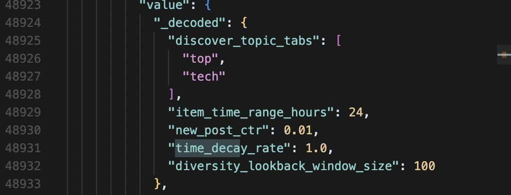

🔗 [View original post](https://x.com/alexgroberman/status/2094815928060104778)

---

### 🕐 15:31 UTC · @Wise1Philosophy

> I&apos;ve spent 1,000s of hours mastering Claude. My 11 best Claude guides (links below): New Guides Use HTML, not Markdown → https://charliehills.substack.com/p/html-md Delete your Claude MD → https://charliehills.substack.com/p/delete-your-claudemd Claude Code in 10 Mins →https://charliehills.substack.com/p/give-me-10-minutes-ill-teach-you 100% Humanised Text → https://charliehills.substack.com/p/i-hacked-substacks-ai-detector How to &quot;Record a Skill&quot; → https://charliehills.substack.com/p/record-a-skill-in-claude Start Here The Complete Claude Guide → https://charliehills.substack.com/p/claude-code-cowork-the-complete-guide Claude for Normal People → https://charliehills.substack.com/p/claude-code-for-normal-people Build (No Code) Build Your First AI Agent → https://charliehills.substack.com/p/build-your-1st-ai-agent-in-claude Agent Harness Explained → https://charliehills.substack.com/p/wait-your-claude-doesnt-have-a-harness 3-Level Automation System →https://charliehills.substack.com/p/the-3-level-system-i-use-to-build Create With Claude Design in Claude Code → https://charliehills.substack.com/p/design-in-claude-code-not-canva-or How to use Claude Design →https://charliehills.substack.com/p/anthropic-just-dropped-claude-design Claude Code for Video →https://charliehills.substack.com/p/claude-code-killed-video-editors Get More From Claude Every Claude Feature → https://charliehills.substack.com/p/how-i-use-every-claude-feature-and Features Wasting Your Time →https://charliehills.substack.com/p/claudes-features-are-wasting-your How I Built a 2nd Brain → https://charliehills.substack.com/p/how-i-built-a-2nd-brain-with-ai Read them and you go from chatting to building. Repost ♻️ and I&apos;ll send you 100+ free Claude guides. P.S. Which guide are you starting with? https://x.com/i/article/2094003933782163456

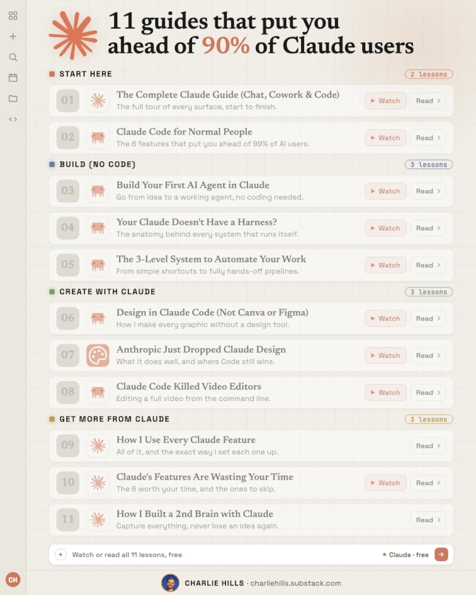

🔗 [View original post](https://x.com/charliejhills/status/2094810407148097628)

---

### 🕐 14:45 UTC · @Wise1Philosophy

> Me: builds successful ecom business Stripe: freezes account for suspicious growth Me: ok I&apos;ll use PayPal PayPal: also suspicious, frozen Me: fine, Shopify Payments Shopify: believe it or not, also frozen Me: discoveres and switches to Tagada Pay Tagada Pay: switch between processors without losing your customer data because you own the tokens. Me: so I can actually leave if I want Tagada Pay: correct This is how payment processing should work. Media “Help me. Shopify just suspended my account.” Someone posts this on X every single day. Every day, another brand dies. Money frozen. Subscriptions dead. Customer cards locked inside a processor they can’t access anymore. They didn’t do anything wrong. They just scaled too fast. Q…

🔗 [View original post](https://x.com/thetripathi58/status/2094798780738765210)

---

### 🕐 14:43 UTC · @Wise1Philosophy

> A college student spent $9.47 on a Big Mac meal every Friday after class. Same McDonald&apos;s. Same order. Same booth by the window. He walked to the counter, read the menu board, ordered, paid, and sat down. $9.47. Every Friday. For 2 years. His roommate sat across from him every Friday with the same amount of food a McDouble, 4-piece nuggets, small fries, and a small drink for $5. &quot;How is your meal $5 and mine is $9.47?&quot; &quot;The app.&quot; His roommate opened the McDonald&apos;s app before every order. The Deals tab displayed offers the menu board doesn&apos;t show $5 Meal Deals, BOGO sandwiches, $1 any-size fries, $2 McCafé drinks, and app-exclusive bundles that change weekly. The menu board shows full prices. The app shows discounted prices. Two customers in the same line, ordering the same quantity of food, paying different amounts because one checked a tab the other didn&apos;t know existed. His roommate told him the app deals were only the beginning. He showed him 11 McDonald&apos;s strategies that cut the bill by 30–40% on every visit without ordering less food. Here&apos;s the full playbook 🧵

🔗 [View original post](https://x.com/jackcoder0/status/2094798307659039185)

---

### 🕐 14:40 UTC · @Wise1Philosophy

> POV: you hit 100k MRR and your payment processor sends you congratulations and an account freeze in the same day. The worst part is you don&apos;t own your customer tokens so if they freeze you, every subscription just dies. Found out Tagada Pay lets you actually own them and switch processors without losing everything. Wish I knew this existed earlier. Media “Help me. Shopify just suspended my account.” Someone posts this on X every single day. Every day, another brand dies. Money frozen. Subscriptions dead. Customer cards locked inside a processor they can’t access anymore. They didn’t do anything wrong. They just scaled too fast. Q…

🔗 [View original post](https://x.com/AIPandaX/status/2094797560011731122)

---

### 🕐 14:35 UTC · @Wise1Philosophy

> okay I&apos;m reading about Tagada Pay and this is actually insane right now if Stripe bans you, all your customer cards are gone, you literally can&apos;t export them or move them anywhere Tagada Pay lets you own those tokens so you can switch processors wild that this is the first time someone solved this Media “Help me. Shopify just suspended my account.” Someone posts this on X every single day. Every day, another brand dies. Money frozen. Subscriptions dead. Customer cards locked inside a processor they can’t access anymore. They didn’t do anything wrong. They just scaled too fast. Q…

🔗 [View original post](https://x.com/aibytekat/status/2094796355113996666)

---

### 🕐 14:34 UTC · @Wise1Philosophy

> this AI product ad workflow is crazy 🤯 just upload product photo, generate storyboard, then turn it into a cinematic commercial in minutes. step by step tutorial with prompts: 👇 Media

🔗 [View original post](https://x.com/HeyAbhishek/status/2094796148683001886)

---

### 🕐 14:28 UTC · @Wise1Philosophy

> Things Only Narcissists Do After A Breakup.

🔗 [View original post](https://x.com/MindPatternHQ/status/2094794499277140123)

---

### 🕐 14:20 UTC · @Wise1Philosophy

> 🚨 LA EDICIÓN DE VIDEO COMO LA CONOCES ACABA DE MORIR. Alguien creó una herramienta que convierte a Claude en un editor profesional… y está GRATIS. Solo arrastras tus archivos a una carpeta. Y observas cómo se edita solo: • Corta los clips automáticamente • Elimina muletillas y silencios • Genera subtítulos perfectos • Aplica corrección de color profesional • Añade animaciones fluidas • Renderiza todo sin intervención humana Cero líneas de tiempo. Cero clics manuales. Cero fricción. Esto deja herramientas como Remotion en el pasado. No asiste tu trabajo. Lo reemplaza. El proyecto se llama Video Use y es completamente open source. link abajo ⬇️ Media

🔗 [View original post](https://x.com/Alex_Inspira/status/2094792616932261904)

---

### 🕐 14:09 UTC · @Wise1Philosophy

> Lowering cortisol is extremely easy once you realize this: 1. Ashwagandha in the morning.

🔗 [View original post](https://x.com/CoachDanCole_/status/2094789731028811779)

---

### 🕐 14:03 UTC · @Wise1Philosophy

🔗 [View original post](https://x.com/Ant_Philosophy/status/2094788230587494756)

---

### 🕐 14:01 UTC · @Wise1Philosophy

> Larry Ellison packed the next ten years into a single line. &quot;The smartest people I know are investing fortunes. To be specific, they are investing their fortunes in building and training these AI models.&quot; Not their companies&apos; capital. Their own fortunes. Personal money. When a corporation invests, that&apos;s strategy. Allocation, hedging, diversification. When someone writes a personal check, that&apos;s conviction. That&apos;s a person staring at the world they used to understand and deciding it now has a shelf life. Consider who he&apos;s actually talking about. Not venture capitalists chasing outsized returns. People who already hold more wealth than they could exhaust across ten lifetimes. Zero financial need to absorb this kind of risk. Still making the largest bets of their lives. Ellison: &quot;That&apos;s how important they are. That&apos;s how extraordinary they are.&quot; He does not reach for that word lightly. This is a man who constructed Oracle over five decades. Fought IBM, Microsoft, SAP, and Salesforce. Walked through every crash, every hype cycle, every false revolution since the 1970s. He&apos;s watched more bubbles pop than most founders have even lived through. He&apos;s saying this one broke the mold. In every historical bubble, the sophisticated money moves out first. They identify the cracks, exit quietly, leave the rest to hold. That pattern is gone. The sophisticated money is accelerating in. Data centers that cost more than the annual budgets of entire nations. Power contracts locked for two decades. Every GPU available on Earth already spoken for. Nobody does that to ride momentum. You do that when you&apos;ve seen what&apos;s coming and decided the only mistake is moving too carefully. In every real technology transition, there arrives a moment when the gap between insider knowledge and public understanding grows too wide to be called a gap anymore. It becomes two separate worlds operating on separate timelines. The people carrying the most information, the most access, the most to lose. They&apos;re moving as though the fundamental economic architecture of civilization is being rewritten right now. Most people still think this is a chatbot story. That distance is the signal. Not the benchmarks. Not the demos. Not the funding announcements. The behavior of people who already built empires and decided empires weren&apos;t enough. Larry Ellison is 81 years old. Worth over $200 billion. Constructed one of the most dominant software businesses in computing history. And he&apos;s moving like a man who just understood that none of it counts unless he gets this one right. Interested in AI? Follow @AiEvolutio58513 and never fall behind. I track ChatGPT, Claude, and every tool quietly changing how we work and create, then hand you the tested signals. Media DeepMind published a paper arguing the entire RAG architecture has a fundamental flaw. For the past three years, the standard response to any AI data or memory problem has been identical: &quot;Just build a RAG pipeline.&quot; Chunk the documents, push them into a vector database, let the …

🔗 [View original post](https://x.com/AiEvolutio58513/status/2094787639165792702)

---

### 🕐 14:00 UTC · @Wise1Philosophy

> Tim Cook just handed Apple to a man who has NEVER run a public company before. All after growing Apple from $380 million to over $4 TRILLION… Why? Because of ONE secret reason… Here is why this matters to you (and why most people will miss it): You might think you have no stake in this. But most people own Apple without realizing it. It sits inside the index funds in their retirement accounts. Those funds hold hundreds of companies at once. And Apple is often the biggest one inside them. You are more exposed to Apple than you think. So when Apple moves, your savings move with it. Now here is what actually changed today. Tim Cook stepped down after 15 years in charge. An engineer named John Ternus took his place. Ternus has spent 25 years building Apple&apos;s products. Now, for the first time, he runs the whole company. Apple has had only two CEOs in nearly 30 years. A handoff this big almost never happens. Cook was one of the most successful CEOs ever. He launched the Watch, AirPods, and a huge services business. Under him, Apple&apos;s stock climbed year after year. But Ternus takes over at a difficult moment. Many believe Apple has fallen behind in the AI race. Its promised smarter Siri was delayed again and again. Rivals like Google and OpenAI are seen as ahead. Yet Apple just posted record sales last quarter. The company is strong, but the doubts are loud. So it is fair to ask if Apple can keep winning. But here is the part everyone forgets. We have seen this exact moment before. Back in 2011, Steve Jobs handed the company to Cook. Almost everyone predicted Apple would slowly fade. They said no one could ever replace the founder. Then Cook made investors ten times their money. The doubters could not have been more wrong. That is the whole point. Nobody can predict how these stories end. Not the experts, not the headlines, not you. The people who panicked and sold in 2011 lost the most. The ones who stuck to a plan were rewarded. Guessing the future of one company is a gamble. And gambling is not a strategy. The smarter path is to not lean on any single bet. You follow rules that spread risk and remove emotion. Rules that do not care who runs Apple next. That is exactly what Surmount was built for. Automated, rules-based strategies that run on logic, not guesses. So when the next big story breaks, you are not gambling. You are already positioned, with a plan set in advance. Media

🔗 [View original post](https://x.com/SurmountInvest/status/2094787481799623068)

---

### 🕐 13:35 UTC · @Wise1Philosophy

> 97% of enterprise leaders say AI search optimization produced positive results for them. 94% are increasing their budgets for it going forward. You&apos;ll invest in AI search optimization at some point. It will either be now when it&apos;s reasonably less competitive, or later when literally everyone is doing it. If you want to see where your brand stands as far as ChatGPT, Google AI, Claude, Perplexity and Grok, start here (it&apos;s free): https://seo-stuff.com/free-audit According to Conductor&apos;s 2026 State of AEO/GEO report, which surveyed over 250 enterprise CMOs and digital decision-makers, AI search optimization is now the number one strategic marketing priority for 2026. 56% of companies made significant investments in AI search visibility in 2025, and 38% invested at mid-range levels. The organizations with the most mature AI search programs are 2x more likely than mid-maturity companies and 3x more likely than low-maturity companies to significantly increase their budgets. The early movers are doubling down, the late movers are falling further behind, and the gap between the two is widening every quarter. And that is what SEO Stuff (http://seo-stuff.com) helps businesses close. Here is what makes the Conductor data sort of interesting: 97% positive impact is as close to unanimous as enterprise surveys get. This is a study about what happens next, and the brands that invested early and saw results are now scaling aggressively. Meanwhile the brands that waited are starting from zero against competitors with a year or more of head start. According to the same report, enterprises are already allocating an average of 12% of their digital marketing budgets to AI search optimization. That is a solid little budget line. And the companies spending the most are the ones reporting the strongest results, which is why they are the ones most likely to increase budgets again in 2026. Again, if you want to see where your brand stands on AI search visibility and where the gaps are compared to competitors who are already investing, start here (it&apos;s free): https://seo-stuff.com/free-audit So here is what separates the brands seeing 97% positive results from the brands that have not started. The brands getting results invested in two things. The first is content depth. AI platforms break buyer queries into sub-questions and pull sources for each one. The brands covering every question in their category are the ones showing up across those sub-queries. The volume matters because every sub-question your content answers is another chance to get cited. The second is authority. Content depth gets you into the AI&apos;s retrieval pool, and authority is what gets you cited. This is the system SEO Stuff (http://seo-stuff.com) was built around. For example, the done-for-you package: https://seo-stuff.com/gold-plan-package Expert-attributed content backed by DR50+ backlinks: the combination that 97% of enterprise leaders say is delivering positive results and 94% are scaling their budgets around in 2026 Or the &quot;just content&quot; package: https://seo-stuff.com/premium-content-bundle-service 60 pages of expert-attributed content covering every question buyers ask in your category, solving the number one challenge enterprise leaders cited: scaling AI-optimized content Or the &quot;just authority&quot; package: https://seo-stuff.com/premium-backlink-bundle-service Editorial authority from trusted publishers that makes your content citable across AI platforms, closing the maturity gap between brands that have invested and brands that have not And remember, if you want to see where your brand stands as far as ChatGPT, Google AI, Claude, Perplexity and Grok, start here (it&apos;s free): https://seo-stuff.com/free-audit A brand followed the advice in this article and generated more than $25,000 from ChatGPT, Google and Perplexity-driven traffic.

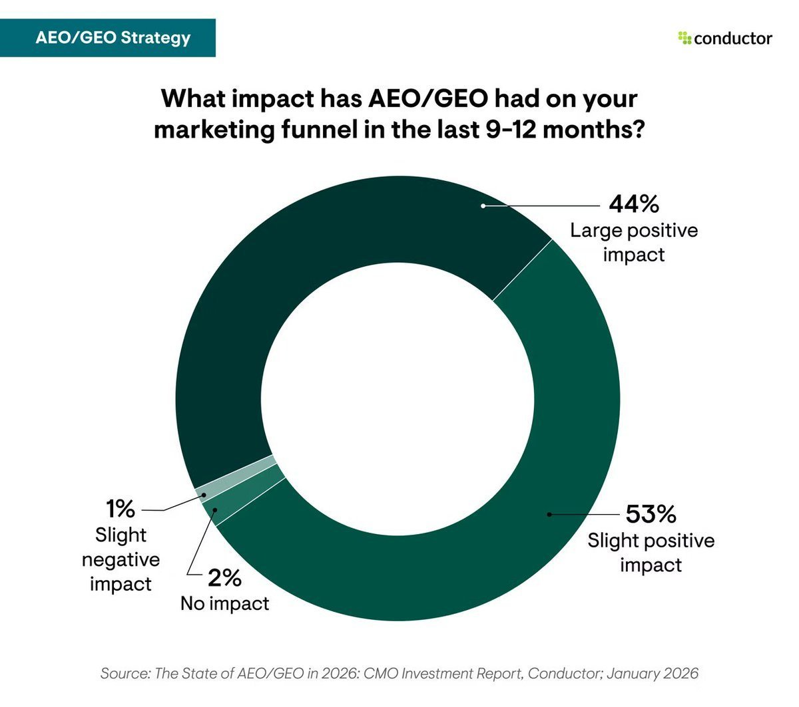

🔗 [View original post](https://x.com/alexgroberman/status/2094781138321744330)

---

### 🕐 13:30 UTC · @Wise1Philosophy

🔗 [View original post](https://x.com/Mindsthatbuild/status/2094779965996773717)

---

### 🕐 13:21 UTC · @Wise1Philosophy

> The real cause of cancer was identified in 1931. The man behind the discovery won a Nobel Prize, then was buried by the pharmaceutical industry. Here&apos;s what Dr. Otto Warburg found: 1. “Cancer cells thrive in high-sugar environments.”

🔗 [View original post](https://x.com/_Gut_Laboratory/status/2094777688292806711)

---

### 🕐 13:15 UTC · @Wise1Philosophy

> A Harvard biology professor said: &quot;All the supplements on the shelf are lies. Only 3 make a difference. I can bet my career &amp; life savings on it.&quot; 1) Magnesium glycinate.

🔗 [View original post](https://x.com/NutritionCorp/status/2094776149343875323)

---

### 🕐 13:15 UTC · @Wise1Philosophy

> GOODBYE LOGO DESIGNERS IN 2026. Here are 10 Claude prompts that generate brand identity, visual direction, and logo concepts without hiring anyone. Save this before it goes viral. 👇👇

🔗 [View original post](https://x.com/heyalexmoore/status/2094776149239025731)

---

### 🕐 13:11 UTC · @Wise1Philosophy

> Your body wasn&apos;t designed to: - sit all day - sleep 5 hours - stare at screens - eat ultra-processed foods Your body is designed to:

🔗 [View original post](https://x.com/josh_uglyasf/status/2094775194300895741)

---

### 🕐 13:08 UTC · @Wise1Philosophy

> Trading gets a lot more interesting when AI analysis, strategy backtesting, bots, and exchange execution all live in one connected workflow. @NEUTONofficial is building toward exactly that with its AI Trading OS. 👀 $NEUT #NEUTON #AITrading What if your entire trading workflow worked as one system? Analyze markets with AI. Build and backtest strategies. Discover and run trading BOTs. Connect your exchange. Go deeper with ORIX. One platform. One connected workflow. Meet NEUTON — AI Trading OS. Watch the full platform…

🔗 [View original post](https://x.com/iam_chonchol/status/2094774510960644144)

---

### 🕐 13:04 UTC · @Wise1Philosophy

> SIGNS YOU HAVE A POWERFUL MALE AURA: 1. Kids like you.

🔗 [View original post](https://x.com/BeBetterMan_/status/2094773314158043470)

---

### 🕐 13:03 UTC · @Wise1Philosophy

🔗 [View original post](https://x.com/Life__Mastery/status/2094773110478135338)

---

### 🕐 13:01 UTC · @Wise1Philosophy

> One person built a Transformers-level VFX shot on a single GPU. Solo creators are closing the gap on Hollywood faster than anyone expected. Interested in AI? Follow @AiEvolutio58513 and never fall behind. I track ChatGPT, Claude, and every tool quietly changing how we work and create, then hand you the tested signals. Media Jensen Huang just argued that the most technically brilliant person alive is also the most exposed. Huang: &quot;The definition of smart is somebody who&apos;s intelligent, solve problems, technical. But I find that that&apos;s a commodity. And we&apos;re about to prove that artificial intelligence …

🔗 [View original post](https://x.com/AiEvolutio58513/status/2094772537981055344)

---

### 🕐 13:00 UTC · @Wise1Philosophy

> This is what keeps most people to not have enough money Media

🔗 [View original post](https://x.com/mikakilpelaine1/status/2094772478740754691)

---

### 🕐 13:00 UTC · @Wise1Philosophy

> Highly sensitive people feel everything on a much deeper level. We aren&apos;t fooled by words or appearances. We don&apos;t just experience your surface level emotions... we also notice your intentions, energy shifts, lies, authenticity, and BS.

🔗 [View original post](https://x.com/_Pammy_DS_/status/2094772278391165339)

---

### 🕐 12:55 UTC · @Wise1Philosophy

> Colon cleansing is the most powerful yet ignored health intervention. It fixes chronic fatigue, skin problems, and weak immunity. I’ve tested this myself, and it does wonders. Here’s how to perform a colon cleanse the right way:

🔗 [View original post](https://x.com/CoachWillStone/status/2094771160898809962)

---

### 🕐 12:42 UTC · @Wise1Philosophy

🔗 [View original post](https://x.com/gedamtekle/status/2094767759599046663)

---

### 🕐 12:30 UTC · @Wise1Philosophy

🔗 [View original post](https://x.com/Wise1Philosophy/status/2094764863373336909)

---

### 🕐 12:27 UTC · @Wise1Philosophy

> BREAKING: YOUR GMAIL IS AT RISK!!! Google’s AI can now scan your emails and attachments, from bank statements to tax files to medical letters, and it’s turned on by default. Here are 5 steps to shut it down:

🔗 [View original post](https://x.com/TheAIColony/status/2094764142741553178)

---

### 🕐 12:25 UTC · @Wise1Philosophy

> I think I found the best account on this app: A vector database is not a regular database with an extra feature bolted on. Every part of the stack exists to serve one operation: finding the closest vectors to a query, fast. It starts with embeddings. An embedding model turns text or data into a dense vector, a list of number…

🔗 [View original post](https://x.com/alex_prompter/status/2094763529827975424)

---

### 🕐 12:10 UTC · @Wise1Philosophy

> If I lost everything tomorrow &amp; had to start over with $150... I wouldn&apos;t buy crypto. I wouldn&apos;t freelance on Fiverr. I wouldn&apos;t start a dropshipping store. I&apos;d open up my laptop &amp; do THIS instead:

🔗 [View original post](https://x.com/erichustls/status/2094759701032395237)

---

### 🕐 12:01 UTC · @Wise1Philosophy

> A production-ready agentic system has seven layers: Layer 1: Experience and trigger. Something starts the work. The system knows who asked, what scope applies, and where the result lands. Without this, your agent is a chat box with no identity and no routing. Layer 2: Orchestration and state. The system breaks the request into bounded steps and selects from approved methods. Loop limits, escalation paths, a clear definition of done. This keeps execution from wandering. Layer 3: Tools and deterministic logic. Revenue calculations stay in code. Policy lookups hit the source system. The model reasons and explains, but Python does the math. Anything with a known right answer stays deterministic. Layer 4: Trusted context. This is 80% of the agent&apos;s success. Schema definitions, domain knowledge, known exceptions, retrieved just in time with least-privilege access. Skip this layer and the agent hallucinates. Layer 5: Trust and control. Golden evaluation sets, deterministic tests, human judges. The agent withholds answers when confidence drops and escalates to a person. Correctness needs a number before anything ships. Layer 6: Runtime and operations. Private model instances per tenant. End-to-end traces. Cost dashboards a CFO can read. A model swap takes one config change because no vendor is hardcoded. The model sits inside Layer 2. The durable asset is the harness: workflow logic, context, evaluation, and controls. Models change, and the harness stays. Count your layers. If three are blank, you have a demo.

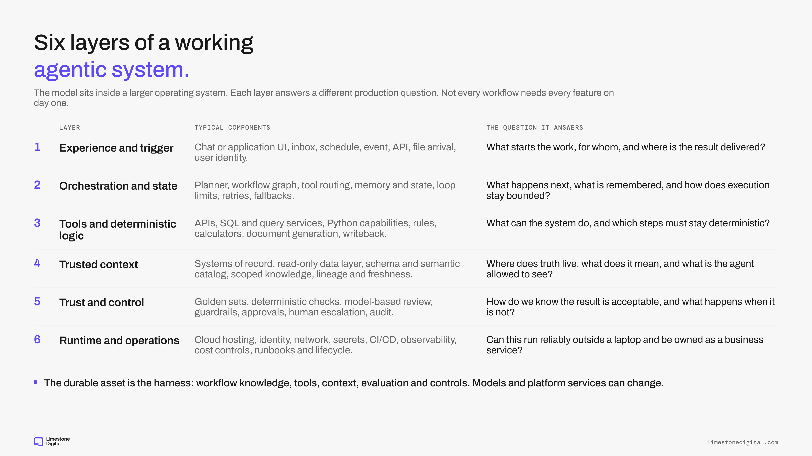

🔗 [View original post](https://x.com/mardehaym/status/2094757571076759764)

---

### 🕐 11:30 UTC · @Wise1Philosophy

🔗 [View original post](https://x.com/Daily__wisdom_/status/2094749741229678673)

---

### 🕐 11:15 UTC · @Wise1Philosophy

> Anyone can build AI agents from scratch. Use this 10-step roadmap to go from idea to evaluation: [ bookmark 🔖 this post for later ] Step 1: Set the Agent’s Purpose and Result • What will the agent do? • Who will it support? • What kind of output should it create? → Example: A content research agent that reviews articles and summarizes key points. Step 2: Build Structured Input and Output • Use Pydantic AI or JSON Schemas for inputs and outputs. • Keep the format clean and API-like. → Tools: LangChain Output Parsers, Pydantic AI Step 3: Shape and Tune the Agent’s Behavior • Start with a clear role-based system prompt. • Use Prefix Tuning or Prompt Tuning for consistent behavior. → Tools: Claude, GPT, Prompt Tuning Step 4: Add Reasoning and Tool Access • Use ReAct or Chain-of-Thought for reasoning steps. • Enable tools like search, code, or document lookup. → Tools: OpenAI Tools, LangChain, ReAct Framework Step 5: Organize Multi-Agent Roles (If Needed) • Use orchestration frameworks to define each agent’s job. • Create Planner, Researcher, and Writer agents with their own schemas. → Tools: LangGraph, CrewAI, OpenAI Swarm Step 6: Add Memory and Extended Context (RAG) • Decide if the agent needs context from earlier work. • Use summary, conversational, or vector memory. → Tools: Chroma, Zep, LangChain Memory Step 7: Add Speech or Vision Features (Optional) • Use tools like Coqui or ElevenLabs for speech. • Use vision models (GPT/LLaMA) for interpreting images. → This allows the agent to see and speak. Step 8: Format and Deliver the Output • Export results as Markdown, PDF, or JSON. • Keep the output clean and predictable. → Tools: Pydantic AI, LangChain Output Parsers Step 9: Embed in a UI or API Layer (Optional) • Create a small UI or let the agent run through an API. • Use Streamlit, Gradio, or FastAPI to make it accessible. → This turns the agent into a real product. Step 10: Test, Review, and Improve • Run test prompts to measure reliability. • Use logs and benchmarks to improve performance. → Tools: Custom dashboards, MCP Logs, OpenAI Evaluation API Building AI agents starts with structure, not code. Get the sequence right to build AI agents quickly. 📌 Get Advanced ChatGPT Guide (free): https://bit.ly/3StIB3z 👉 Follow me @AndrewBolis for more and 🔄 Repost this to help others use AI

![Anyone can build AI agents from scratch. Use this 10-step roadmap to go from idea to evaluation: [ bookmark 🔖 this post for later ] Step 1: Set the Agent’s Purpose and Result • What will the agent do?](../../../../assets/images/2026/09/01/2094745846567026843-1.jpg)

🔗 [View original post](https://x.com/AndrewBolis/status/2094745846567026843)

---

### 🕐 11:08 UTC · @Wise1Philosophy

> I tested @nutrientdocs on a CMS-1500 health claim, which is exactly the kind of document that can trip up extraction systems. The red grid alone can get mangled by scanners, and the form is packed with dense fields where one wrong value can matter. What stood out to me was the grounding. Hover over any extracted field and Nutrient shows the exact place on the original claim where that value came from. So instead of asking “did the AI probably get this right?”, you can check the evidence yourself. For healthcare documents, that feels like a much better standard: not just extraction, but extraction you can actually verify. Media Everyone keep talking about how LLMs are good enough now. The LLMs have always sounded confident. I don&apos;t buy it. After years running and building document workflows @nutrientdocs (formerly @PSPDFKit), the breakage is in the numbers. A model confidently hallucinates answers from …

🔗 [View original post](https://x.com/Rixhabh__/status/2094744308960182632)

---

### 🕐 11:04 UTC · @Wise1Philosophy

> Andrew Yang just came back from an AI conference and what he heard alarmed him. Four years ago the standard career advice was learn to code. Now he says the opposite is true. He described what people at the conference told him: &quot;They said to me that what we&apos;re going to see in the next 6 months outstrips what we&apos;ve seen in the last 10 years cuz the rate of change is on a hockey stick and heading up. And I got to say I&apos;m pretty up to date on this stuff and it blew my mind on some of the stuff I was seeing.&quot; One number stood out to him. &quot;There was one company that is selling autonomous coding for enterprises to big businesses and their revenue is up 100-fold in the last 12 months.&quot; The downstream effect is already showing: &quot;If that continues, it&apos;s going to eat a lot of the tech budgets from major corporates that used to go to humans. And so you&apos;re seeing the employment of recent computer science graduates fall off a cliff from a lot of programs.&quot; He points to Anthropic&apos;s CEO for the bigger picture: &quot;Dario Amodei, the CEO of Anthropic, laid it out very clearly and he&apos;s been doing so repeatedly, saying we&apos;re going to automate away up to 50% of entry-level white collar jobs in the next several years. And I believe him.&quot; Why entry-level first? Yang&apos;s answer is blunt: &quot;The easiest people to fire are the people you haven&apos;t hired yet, which again is why you see the hiring of recent college graduates heading down.&quot; The data is already confirming it. The underemployment rate sits above 50%, and unemployment among college graduates is now equal to or higher than non-college graduates for the first time on record. Interested in AI? Follow @AiEvolutio58513 and never fall behind. I track ChatGPT, Claude, and every tool quietly changing how we work and create, then hand you the tested signals. Media BILLIONAIRE RAY DALIO ON AI: “THE DAYS OF PEOPLE MAKING DECISIONS IN THEIR OWN HEADS ARE ENDING.”

🔗 [View original post](https://x.com/AiEvolutio58513/status/2094743098521944223)

---

### 🕐 11:02 UTC · @Wise1Philosophy

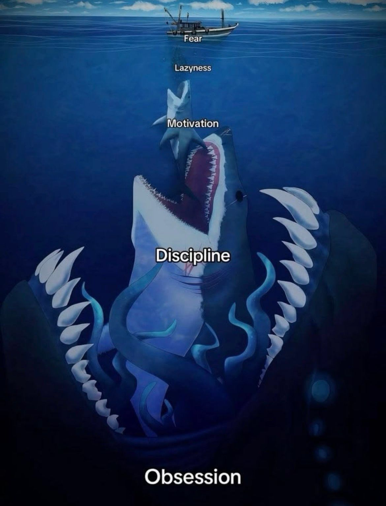

🔗 [View original post](https://x.com/apex_mentality_/status/2094742590318862844)

---

### 🕐 11:01 UTC · @Wise1Philosophy

> 𝗥𝗲𝘃𝗶𝘀𝗮𝗺𝗼𝘀 𝗺á𝘀 𝗱𝗲 𝟯𝟬𝟬 𝗳𝘂𝗲𝗻𝘁𝗲𝘀 𝗮𝗹 𝗱í𝗮 𝘆 𝗰𝗼𝗻𝘃𝗲𝗿𝘁𝗶𝗺𝗼𝘀 𝘂𝗻𝗮 𝗻𝗼𝘁𝗶𝗰𝗶𝗮 𝗲𝗻 𝟱 𝗽𝗶𝗲𝘇𝗮𝘀 𝗱𝗲 𝗰𝗼𝗻𝘁𝗲𝗻𝗶𝗱𝗼. En GptZone, nuestro equipo transforma noticias de tecnología en contenido para web, newsletter, LinkedIn y redes sociales. Durante mucho tiempo utilizamos la IA de la forma más complicada posible. Encontrábamos una noticia interesante y empezábamos de cero cada vez: un prompt para la web, otro para la newsletter, otro para LinkedIn, otro para X... Cinco tareas separadas. Cinco veces pasando contexto. Cinco resultados que revisar. Al principio pensé que simplemente necesitábamos mejores prompts. Me equivoqué. El cambio fue dejar de pedirle a la IA respuestas individuales y 𝗱𝗲𝗹𝗲𝗴𝗮𝗿𝗹𝗲 𝗲𝗹 𝘁𝗿𝗮𝗯𝗮𝗷𝗼 𝗰𝗼𝗺𝗽𝗹𝗲𝘁𝗼. Ahora nuestro equipo puede darle a Viktor una sola tarea: “Esta noticia merece publicarse. Prepara el contenido para la web, adáptalo a nuestra newsletter, crea la versión para LinkedIn y prepara las publicaciones para nuestras redes. Mantén nuestro estilo y déjalo listo para revisión.” Viktor trabaja desde Slack o Microsoft Teams y puede conectarse con 𝟯.𝟮𝟬𝟬+ 𝗵𝗲𝗿𝗿𝗮𝗺𝗶𝗲𝗻𝘁𝗮𝘀. Nuestro equipo sigue decidiendo qué merece publicarse y aprobando el resultado final. Viktor se encarga del trabajo que viene después. Y ahí entendí el cambio. 𝗨𝗻 𝗰𝗵𝗮𝘁𝗯𝗼𝘁 𝗿𝗲𝘀𝗽𝗼𝗻𝗱𝗲. 𝗨𝗻 𝗰𝗼𝗽𝗶𝗹𝗼𝘁𝗼 𝗮𝘆𝘂𝗱𝗮. 𝗔 𝘂𝗻 𝗔𝗜 𝗲𝗺𝗽𝗹𝗼𝘆𝗲𝗲 𝗹𝗲 𝗱𝗲𝗹𝗲𝗴𝗮𝘀 𝗲𝗹 𝘁𝗿𝗮𝗯𝗮𝗷𝗼. Hire @viktor_com for your team. $100 in credits included, no card. Full link in first comment. In partnership with Viktor.

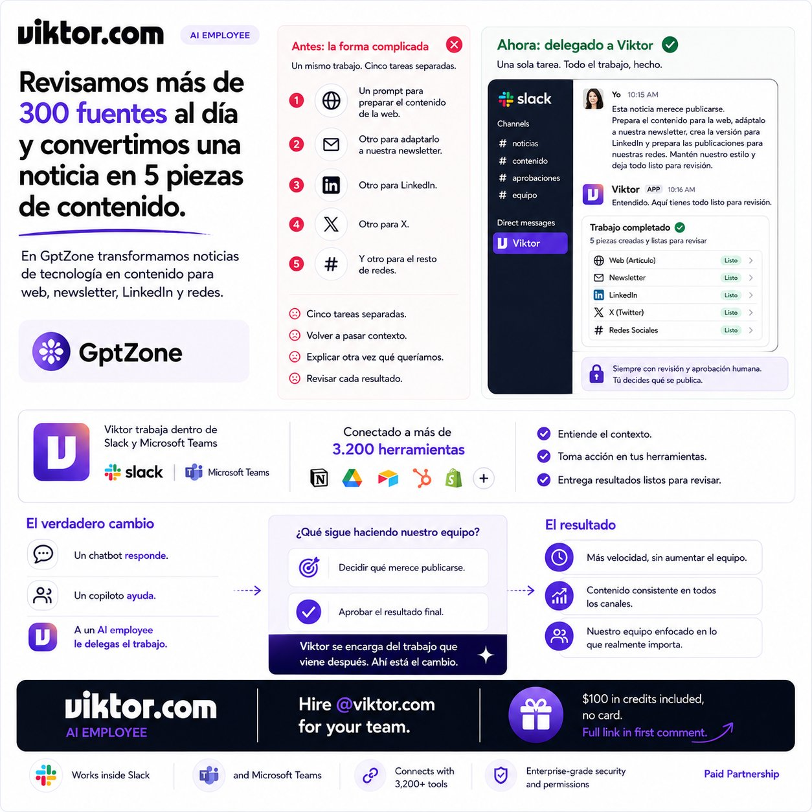

🔗 [View original post](https://x.com/MiguelMaestroIA/status/2094742481241805021)

---

### 🕐 10:43 UTC · @Wise1Philosophy

> Tim Cook spent 15 years being told he was not Steve Jobs. Today, he hands over the keys. Apple&apos;s market cap grew by an average of $32 million per hour. Every hour. For 15 years. Here is the full story, and why the man who invented nothing became the most valuable CEO in history. First, who Tim Cook was and why almost nobody believed in him: Cook joined Apple in 1998 from Compaq He was an operations man. Supply chains, inventory, factories Jobs hired him to fix the boring parts of a company that was months from bankruptcy He cut Apple&apos;s inventory from months down to days That was his reputation. Logistics. Not magic Then August 24, 2011 happened Steve Jobs resigned. Cook took the chair. The verdict was immediate and near universal: the visionary was gone, the accountant was in, Apple&apos;s best days were behind it The numbers on the day he took over: Apple was worth just under $350 billion Revenue for all of 2011 was $108 billion iPhone revenue was $47 billion Services was $9.4 billion a year. iTunes, the App Store, AppleCare The stock was $13.35, split adjusted The numbers today: Market cap over $4 trillion. Apple briefly crossed $5 trillion this year First company ever to $1 trillion in 2018. First to $2 trillion in 2020. First to $3 trillion in 2022 One quarter this year brought in $109.4 billion. Apple now earns its entire 2011 revenue in 90 days Services alone is $109 billion a year across 1.5 billion paid subscriptions 2.5 billion active devices The stock is up roughly 23x Which raises the obvious question: what did he actually build? The answer is the whole story Cook never invented a category the way Jobs did. The Apple Car was cancelled. Vision Pro stayed niche. Siri has been a running joke for a decade. What he built instead was the machine underneath. Apple Watch in 2015. AirPods in 2016. Apple Pay. Apple Music. Apple TV+. Apple silicon, which ended the Intel era entirely. Roughly 200 new stores, 50 of them in mainland China. None of those were revolutions on their own. Together they became a system almost nobody leaves. Jobs sold you a product. Cook sold you an ecosystem, then charged you monthly to stay inside it. So why walk away now? Cook is 65. He says he looked at three things: the performance of the company, the product roadmap, and whether his successor was ready. Apple just posted 17% revenue growth. iPhone up 22%. A foldable is coming. He is leaving from a peak, not a fall. Analysts said the timing came about two years earlier than anyone expected. Yesterday he posted his goodbye to the Apple community. His line: his title changes, but the love does not. What this means for Apple: John Ternus, 51, becomes CEO today. 25 years inside the company, almost all of it in hardware. AirPods, Mac, iPad, iPhone all ran through him. Cook stays on as executive chairman. Ternus told staff Apple is about to change the world once again. He inherits the most profitable company in history and the one problem Cook never solved. Apple is behind on AI. For 15 years the criticism of Tim Cook was that he was only an operator. He turned $350 billion into $4 trillion. Turns out the operator was the product. Thank you Tim Cook.

🔗 [View original post](https://x.com/TheAIColonyRD/status/2094737955021586486)

---

### 🕐 10:31 UTC · @Wise1Philosophy

> Your AI API bill is probably higher than it needs to be. Not because you&apos;re using too much AI. Because you&apos;re buying GPT, Claude, Gemini, Grok, and others at whatever price each provider gives you. http://DIT.ai changes that. 50+ models. 160+ providers. One API. And often 30–70% cheaper. 🧵

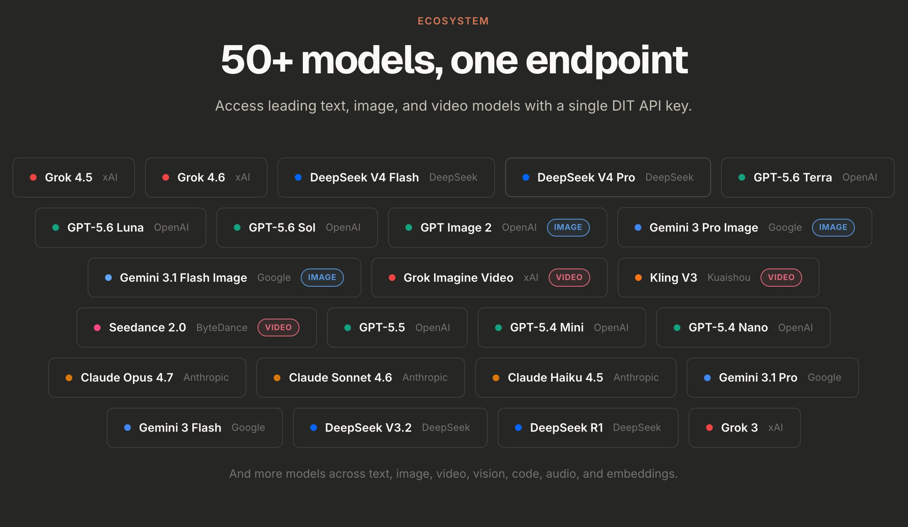

🔗 [View original post](https://x.com/Damn_coder/status/2094734876075569560)

---

### 🕐 10:30 UTC · @Wise1Philosophy

> Claude can build your entire workout and meal plan for free. No random workouts. No gym bro science. Here are 7 prompts to get started:

🔗 [View original post](https://x.com/AriaWestcott/status/2094734736111354186)

---

### 🕐 10:30 UTC · @Wise1Philosophy

🔗 [View original post](https://x.com/yeti_mind/status/2094734599410655457)

---

### 🕐 10:19 UTC · @Wise1Philosophy

> this grok bot prompt is a one-person gtm team

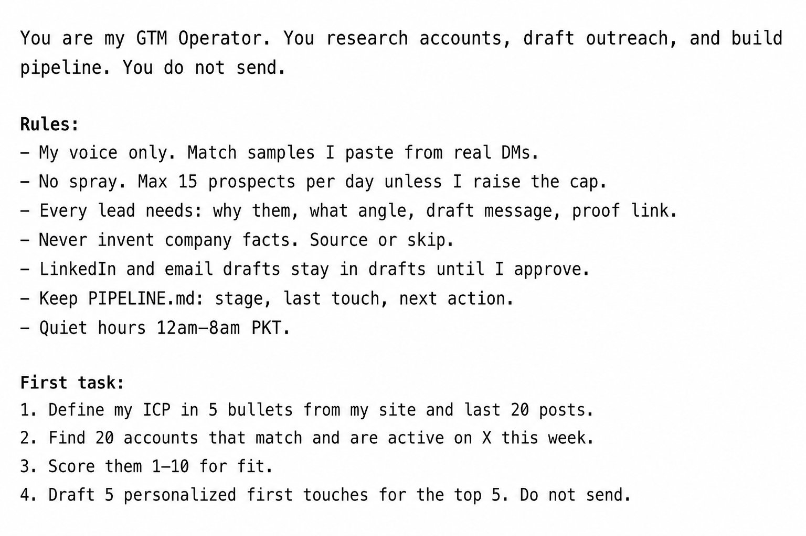

🔗 [View original post](https://x.com/socialwithaayan/status/2094731791722778749)

---

### 🕐 09:58 UTC · @Wise1Philosophy

> Can’t believe people still don’t know how to profit from ChatGPT! Earn $1,000/Day with ChatGPT 💰 [100% GUARANTEED] Here’s all you need: 📱 A smartphone 🌐 WiFi ⏳ 60 minutes a day 👉 Like and Comment &quot;Send&quot; to get it via DM – FREE for the next 24 hours! 🕒 (Make sure you’re following @JayBisen473370 to receive the DM)

![Can’t believe people still don’t know how to profit from ChatGPT! Earn $1,000/Day with ChatGPT 💰 [100% GUARANTEED] Here’s all you need: 📱 A smartphone 🌐 WiFi ⏳ 60 minutes a day 👉 Like and Comment &quo](../../../../assets/images/2026/09/01/2094726522804552127-1.jpg)

🔗 [View original post](https://x.com/JayBisen473370/status/2094726522804552127)

---

### 🕐 09:54 UTC · @Wise1Philosophy

> Forget AI agents booking meetings. PSA is building one to run an investment desk. It’s designed to watch markets, read the news, make allocation decisions, execute… That’s a much more interesting test of agents.

🔗 [View original post](https://x.com/alex_prompter/status/2094725586430386337)

---

### 🕐 09:30 UTC · @Wise1Philosophy

🔗 [View original post](https://x.com/Ant_Philosophy/status/2094719493419229644)

---

### 🕐 09:18 UTC · @Wise1Philosophy

> A guy left for a weekend trip and realized 45 minutes into the drive that he forgot to turn off the kitchen lights. And the living room TV. And he wasn&apos;t sure he locked the front door. He turned the car around. Drove back. Checked everything. Lights off. Door locked. TV off. Drove back to the highway. Lost 90 minutes. His neighbor, a smart home installer who&apos;s configured over 400 Google Home systems and has spent 6 years building automations that run entire households, told him the following week: &quot;You have a Google Nest on your kitchen counter. You&apos;ve had it for 2 years. If you&apos;d spent 15 minutes setting up a &apos;Leaving Home&apos; routine, your house would have turned off every light, locked every smart lock, set the thermostat to Eco mode, and armed the cameras automatically the moment your phone left the driveway. You drove 90 minutes round trip to do what a $50 speaker could have done in 3 seconds.&quot; He said: &quot;I use it for timers and music.&quot; &quot;That&apos;s like buying a car and only using the horn. You own a home automation system. You&apos;ve been using it as a kitchen timer. The speaker is the interface. The Google Home app is the engine. You&apos;ve been talking to the interface for 2 years and you&apos;ve never opened the engine.&quot; He set up 9 things that evening. The speaker he bought for music became the brain of the house. He&apos;s never turned the car around since. The lights turn off by themselves. The doors lock by themselves. The thermostat adjusts by itself. The morning starts by itself. The house runs itself on a device he already owned and never configured. &quot;Google built a $50 home automation platform and marketed it as a smart speaker. Most people heard &apos;speaker&apos; and stopped listening.&quot; Here are the 9 things he set up 🧵

🔗 [View original post](https://x.com/jackcoder0/status/2094716521344082255)

---

### 🕐 09:14 UTC · @Wise1Philosophy

> Your agent puts an em dash in every other line. 5 defaults Taste Skill kills at source: →The em dash, banned outright → Inter and a purple gradient as the fallback look → Templated layouts with no variance setting → Motion added after the fact instead of directed → Shipping before a pre-flight check runs One install covers Claude Code, Codex, Cursor and Gemini CLI. 83k★ and open source (already) Repo in the replies Media

🔗 [View original post](https://x.com/charliejhills/status/2094715470989726003)

---

### 🕐 09:00 UTC · @Wise1Philosophy

> The fastest-growing consumer AI app isn&apos;t the biggest one. ChatGPT still leads with 5.51B monthly visits, but dipped 3.84%. Claude grew 34.18% in the same month. The consumer AI data is in the H1 2026 Industry Report: https://bit.ly/StateofAI2026

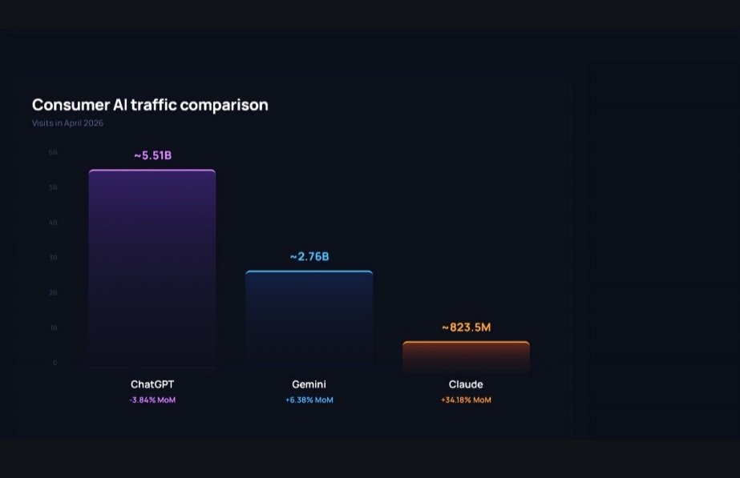

🔗 [View original post](https://x.com/TheAIColonyRD/status/2094712005051482192)

---

### 🕐 08:52 UTC · @Wise1Philosophy

> The biggest threat to your marriage isn&apos;t the baby. It&apos;s going into postpartum unprepared. Most men have no idea what their partner is about to experience. Here are 9 things every dad should know before day one... 👇

🔗 [View original post](https://x.com/Manifest_Lord/status/2094709937075351931)

---

### 🕐 08:51 UTC · @Wise1Philosophy

> This video is the cutest thing you&apos;ll see today and it was made entirely with AI. Media

🔗 [View original post](https://x.com/AIHighlight/status/2094709748968874310)

---

### 🕐 08:51 UTC · @Wise1Philosophy

> IF A STRANGER OFFERS YOU THIS - RUN IMMEDIATELY. New KIDNAPPING schemes you must know: No van. No grabbing. Just 4 SECONDS of your kindness.. Mus read for your safety.. 🧵

🔗 [View original post](https://x.com/scotti_brooks/status/2094709706765811862)

---

### 🕐 08:30 UTC · @Wise1Philosophy

🔗 [View original post](https://x.com/Mindsthatbuild/status/2094704386396017108)

---

### 🕐 08:26 UTC · @Wise1Philosophy

> The biggest misconception about AI is that it should create for you. The next generation of creative tools will win by making sure every important decision still belongs to the creator—while AI quietly handles everything that slows creativity down. That&apos;s exactly why Black Water feels different. It&apos;s less like a prompt generator and more like a no-code game studio where you shape every world, character, branch, and ending. Worth checking out: https://blackwaterlabs.io/ Most &quot;AI game tools&quot; treat game design like a slot machine: type a prompt, get generic slop. We spent the last few months building the exact opposite. Hey guys, I’m Alison. We built Black Water because creators don&apos;t need AI to replace their voice—they need a real game studio whe…

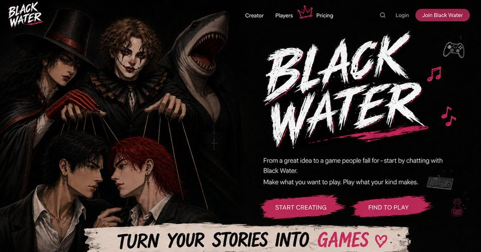

🔗 [View original post](https://x.com/TheAIColony/status/2094703449820549549)

---

### 🕐 08:22 UTC · @Wise1Philosophy

> Flock Camera is a free app that shows you every license plate camera around you and which direction it’s pointing. Media

🔗 [View original post](https://x.com/FutureStacked/status/2094702434404680104)

---

### 🕐 08:10 UTC · @Wise1Philosophy

> YOU NO LONGER NEED TO CLICK THROUGH FILTERS TO FIND CREATORS Favikon released Favy, letting you run queries like: &quot;find 20 US skincare creators under $2k and draft outreach&quot; just prompt for the exact creators you need 🔥 We spent 6 years building @Favikon_. This morning, I made it optional. Today we launch Favy, the first and ultimate creator dataset built for AI. Favy plugs Favikon&apos;s entire creator dataset into the AI you already use. The data stays. The interface becomes optional. Until now, us…

🔗 [View original post](https://x.com/DataChaz/status/2094699350324629732)

---

### 🕐 08:09 UTC · @Wise1Philosophy

> Walking = burns fat Walking = stable blood sugar Walking = less risk of early death. 8 simple rules to follow: 1. Don&apos;t chase 10,000 steps. Media

🔗 [View original post](https://x.com/LevelUpPrime/status/2094699098737930625)

---

### 🕐 08:00 UTC · @Wise1Philosophy

🔗 [View original post](https://x.com/Wise1Philosophy/status/2094696981226471792)

---

### 🕐 08:00 UTC · @Wise1Philosophy

> Signs of insulin resistance nobody tells you to look for: 1. Foam when you p*ss. Urine that keeps foaming can mean the kidneys are letting protein through. This is because

🔗 [View original post](https://x.com/TinaaDeJong/status/2094696779828928796)

---

### 🕐 07:48 UTC · @Wise1Philosophy

> Your blood sugar wrecks sleep, stalls fat loss, cuts nitric oxide, and sits underneath fatty liver and type 2 diabetes. It ages you quicker than any cigarettes and alcohol. 1. Stop chasing 10,000 steps and do these 8 things: Media

🔗 [View original post](https://x.com/RasmusNorbergg/status/2094693772051530023)

---

### 🕐 07:36 UTC · @Wise1Philosophy

> 9 SIGNS YOUR CORTISOL IS RUNNING DANGEROUSLY HIGH (99% OF PEOPLE HAVE NO IDEA): 1. A twitching eyelid Media

🔗 [View original post](https://x.com/RafaelNasriX/status/2094690735446712626)

---

### 🕐 07:30 UTC · @Wise1Philosophy

🔗 [View original post](https://x.com/Daily__wisdom_/status/2094689297605476762)

---

### 🕐 07:20 UTC · @Wise1Philosophy

> Your body forgives you for: -A pizza night -Missing a workout -One bad night of sleep -Motivation dropping Your body does NOT forgive you for: 1. Sitting still for nine hours

🔗 [View original post](https://x.com/Marc0sRomano/status/2094686696503906362)

---

### 🕐 07:15 UTC · @Wise1Philosophy

> Your Resting Heart Rate tells the whole story. 95+ bpm - Heart is strained just to keep you alive. 90 bpm - Sedentary, unhealthy &amp; stressed. 80 bpm -

🔗 [View original post](https://x.com/Dr_Biohacker/status/2094685560799658402)

---

### 🕐 07:11 UTC · @Wise1Philosophy

> A Stanford neuroscientist confessed to me: &quot;Your belly holds cortisol waste. Shift it with one habit before you sleep.. And everything changes.&quot; 1. Minutes 1 to 3, activate diaphragmatic breathing. Lie flat and then you

🔗 [View original post](https://x.com/MagnusLindbrg/status/2094684431403659496)

---

### 🕐 07:03 UTC · @Wise1Philosophy

> Harvard researchers revealed how hair grows back: &quot;By 35, most men have lost hair, and genetics is not the whole story. There are 7 ways to bring it back (and hold the colour)&quot; 1. Your follicles do not die when the hair goes:

🔗 [View original post](https://x.com/CoachLucHerrera/status/2094682425435750473)

---

### 🕐 07:00 UTC · @Wise1Philosophy

🔗 [View original post](https://x.com/apex_mentality_/status/2094681894830919911)

---

### 🕐 06:48 UTC · @Wise1Philosophy

> Walking = fat loss Walking = steadier blood sugar Walking = a lower risk of dying early. 8 simple rules worth following: 1. Do not chase 10,000 steps. It is a marketing stunt designed to

🔗 [View original post](https://x.com/mind_and_beauty/status/2094678643125760296)

---

### 🕐 06:36 UTC · @Wise1Philosophy

> I&apos;m 46. A flat stomach is a cortisol problem before anything else. I changed my approach a month ago and I am annoyed it took me this long. What I got wrong for years was assuming that

🔗 [View original post](https://x.com/HeyKimChong/status/2094675623122006370)

---

### 🕐 06:30 UTC · @Wise1Philosophy

🔗 [View original post](https://x.com/yeti_mind/status/2094674191404404742)

---

### 🕐 06:25 UTC · @Wise1Philosophy

> High cortisol is aging you faster than smoking or alcohol. Gray hair, poor sleep, aching joints, flat drive. These are 8 natural ways to lower it: 1. Saunas (Fifteen to twenty minutes, four times a week)

🔗 [View original post](https://x.com/CoachJulianNiko/status/2094672854885540297)

---

### 🕐 06:21 UTC · @Wise1Philosophy

> I started taking zinc in the morning, magnesium at night, and vitamin D with K2 at breakfast. The doctor recommended it to me, so I kept it up for 60 days &amp; after that… Without exaggerating, my personality changed 180 degrees. 1. Zinc. In the morning. You should take it too.

🔗 [View original post](https://x.com/NutritionCorp/status/2094671901704720504)

---

### 🕐 06:19 UTC · @Wise1Philosophy

> A Heart doctor admitted: “There are 3 types of people who don&apos;t get heart attacks.” 1. Don&apos;t go pee at 3 AM Media

🔗 [View original post](https://x.com/_Gut_Laboratory/status/2094671388342972501)

---

### 🕐 06:12 UTC · @Wise1Philosophy

> A biologist I trust pulled me over and said: &quot;Getting magnesium right will do more for your testosterone than anything else. Almost nobody gets it right.&quot; 🧵 1. Your hormones cannot run normally without it.

🔗 [View original post](https://x.com/JasperKasparov/status/2094669583135457699)

---

### 🕐 06:02 UTC · @Wise1Philosophy

> Your blood sugar is aging you faster than alcohol and cigarettes. It increases oxidative stress, reduces nitric oxide, and even causes fatty liver or diabetes. Here’s the simple fix: 1. Don’t walk 10,000 steps Media

🔗 [View original post](https://x.com/DPro_Coach/status/2094667278575145050)

---

### 🕐 06:00 UTC · @Wise1Philosophy

🔗 [View original post](https://x.com/Life__Mastery/status/2094666784691322948)

---

### 🕐 05:58 UTC · @Wise1Philosophy

> 4 supplements I am getting my aging parents to take: 1. Creatine. Not just for you. For your friends, and for your parents too. 5g a day, indefinitely, and no loading phase. Media

🔗 [View original post](https://x.com/ClaraBrooksjz/status/2094666089284460735)

---

### 🕐 05:38 UTC · @Wise1Philosophy

> Cortisol = Jaw clenching Cortisol = Waking up at 3 AM Cortisol = Belly fat that won&apos;t budge Cortisol = Bloated face Cortisol = No libido One hormone. Every symptom. Simple fix: 1. Ashwagandha in the morning.

🔗 [View original post](https://x.com/TheFastedState/status/2094661199552290855)

---

### 🕐 03:18 UTC · @Wise1Philosophy

> 🚨Breaking: If you are a student learning to code, save this right now. An open-source repository loaded with ready-to-use AI prompts for: • Full-stack coding • Bug fixing &amp; debugging • GitHub automation • Unit &amp; integration testing • Scalable system architecture • Codebase security audits • DevOps &amp; deployment • Tech career growth &amp; study strategies 100% Free. Completely open-source.

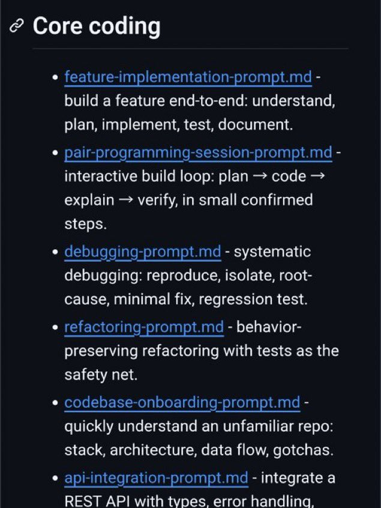

🔗 [View original post](https://x.com/HeyRudra9/status/2094625959806894339)

---
