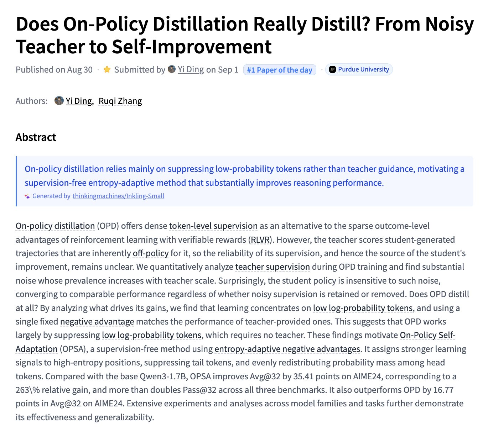
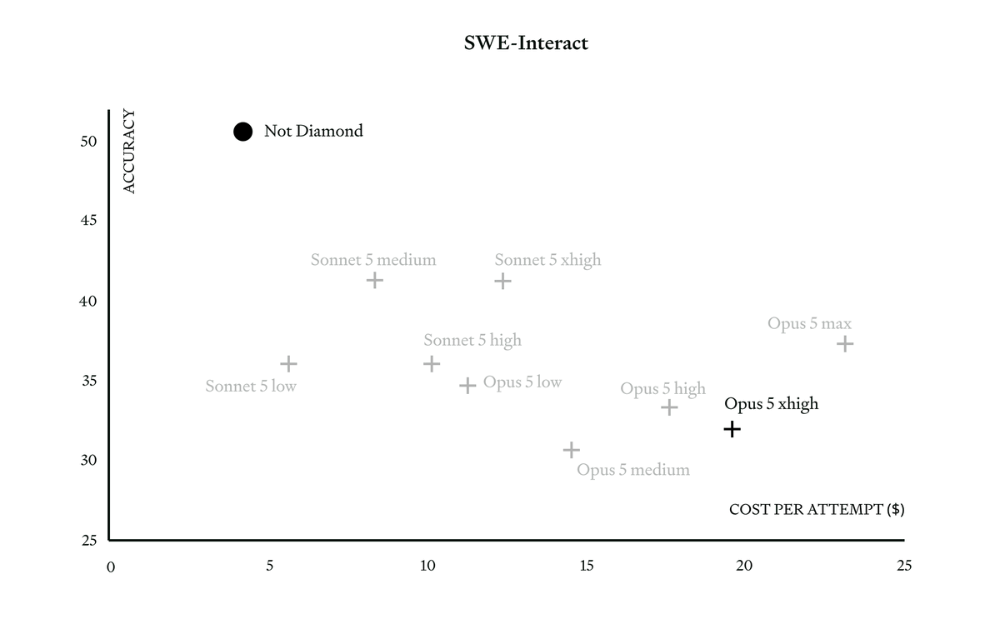
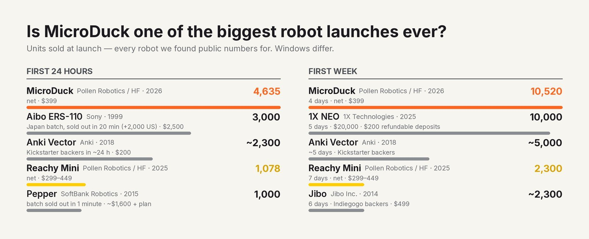

# 🐦 @_akhaliq

## 📅 September 01, 2026

> 7 post(s) archived.

---

### 🕐 17:33 UTC · @_akhaliq

> Does On-Policy Distillation Really Distill? From Noisy Teacher to Self-Improvement paper: https://huggingface.co/papers/2608.31046

🔗 [View original post](https://x.com/_akhaliq/status/2094841129955176630)

---

### 🕐 16:47 UTC · @_akhaliq

> today, we&apos;re releasing the largest open-source human audio preferences dataset, focused on the customer support use-case - 300K+ annotations by real people - 15 SOTA TTS models ranked (Sonic 3.6, Grok TTS, Simba 3.2, Eleven Labs v3) - 8 categories (IVR menus, empathy, escalations, refunds etc) dataset + benchmark + frontier plot below: Media

🔗 [View original post](https://x.com/datapointai/status/2094829412625654141)

---

### 🕐 16:05 UTC · @_akhaliq

> Today we’re releasing our methodology for evaluating model routing with interactive benchmarks, which represent agent cost accumulation better than static benchmarks do. Across leading benchmarks, we achieve Pareto-dominance, exceeding Opus xhigh quality at 20–80% lower cost.

🔗 [View original post](https://x.com/tomas_hk/status/2094818918963761333)

---

### 🕐 16:00 UTC · @_akhaliq

> Today, we are introducing Orbis 1.0, our first Live Model! Create living worlds and stream them in real time, with persistent memory, interactivity, and physics-grounded generation of unbounded length. Try it now at https://www.visko.ai/models#orbis API available via @reactorworld Dynamic version: http://reactor.inc/sandbox?model=visko-orbis-dynamic Stable version: http://reactor.inc/sandbox?model=visko-orbis-stable Media

🔗 [View original post](https://x.com/viskoai/status/2094817592754291173)

---

### 🕐 15:00 UTC · @_akhaliq

> Alright, I went ahead and built 4DAnyone into a proper @Gradio space. I thought it was cool enough that it deserved the effort and made sure to take advantage of our @rerundotio Gradio integration. TLDR takes in a single video and is able to output multiview consistent videos. Its kinda incredible how good the quality is. Got it working on my 5090 + DGX Spark, so it works with &lt;32GB cards =] Sadly, I had to make this version only output 6 videos; otherwise, it would take way too long, but its able to go all the way up to 48 videos locally. Just takes like ~20-30 minutes. No splatting on this one, as again it would just take too much GPU time that ZeroGPU won&apos;t easily support and will eat up all your quota This also feels like the perfect fit for a new Gradio Workflow, something I&apos;ll look into at some point. Inference time ~5-8 minutes on the space, sped things up in the video to keep it digestible Media I got nerdsnipped by @krahets with 4D Anyone. I was working on part 3 of the arkitscenes blog post for @rerundotio, but I just couldn&apos;t help but try to bring in 4d splatting from a single video into rerun since we shipped splatting support. Did a few things here 1. spent a bunch …

🔗 [View original post](https://x.com/pablovelagomez1/status/2094802632489726319)

---

### 🕐 13:37 UTC · @_akhaliq

> Can you explain to me exactly what you want 4 microducks for?? Media

🔗 [View original post](https://x.com/andimarafioti/status/2094781803072467435)

---

### 🕐 10:55 UTC · @_akhaliq

> seems like it I hadn’t realized it until now, but could Microduck actually be the biggest launch of a new consumer robot ever? 10,500 robots ordered and $4.54M in sales in just 4 days. It’s surprisingly hard to find comparable public data, so we asked Claude and ChatGPT to dig deep and build t…

🔗 [View original post](https://x.com/Thom_Wolf/status/2094740928019783788)

---
