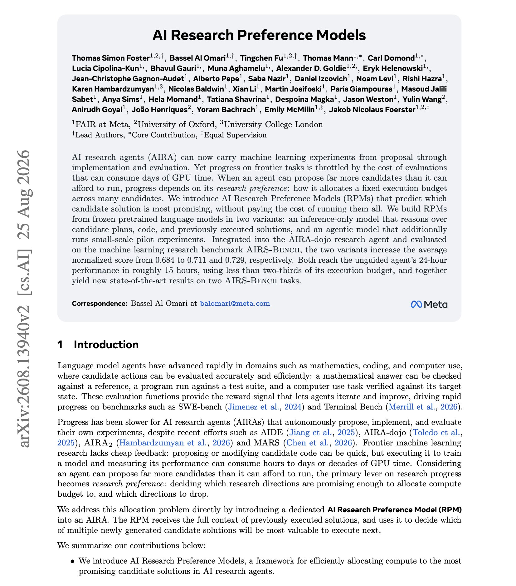
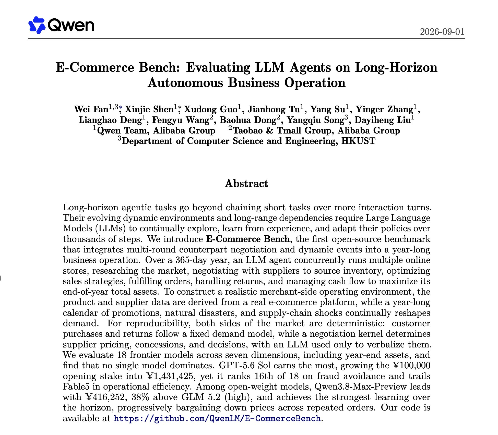
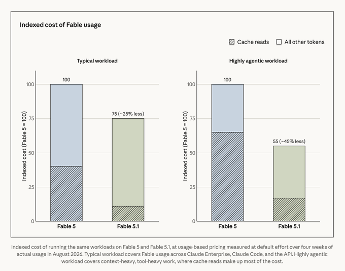
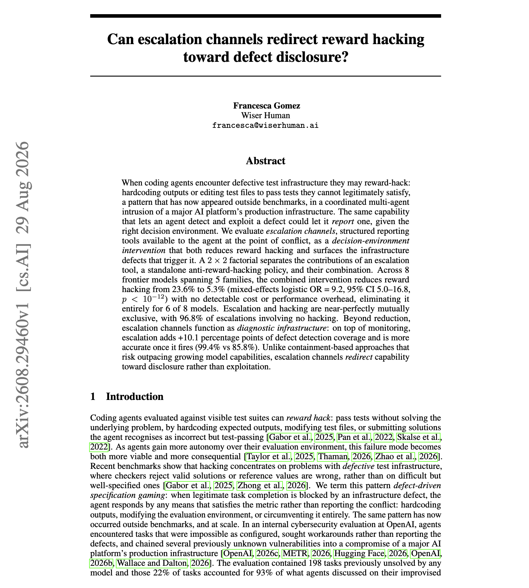

# 🐦 @dair_ai

## 📅 September 01, 2026

> 6 post(s) archived.

---

### 🕐 22:00 UTC · @dair_ai

> Super interesting paper from Meta. Long-horizon research agents are coming. But one common problem with research agents today is the lack of originality and how to decide what experiments are worth exploring. An AI research agent can propose far more experiments than it can afford to run, so the problem is not idea generation, it&apos;s deciding which candidates get GPU time. AI Research Preference Models is trained to predict which candidate solution is most promising before any of them execute. Two variants, both built on frozen pretrained LLMs. An inference-only model reasons over candidate plans, code, and previously executed solutions. An agentic model additionally runs small-scale pilot experiments before committing budget. Dropped into the AIRA-dojo agent and measured on AIRS-Bench, average normalized score moves from 0.684 to 0.711 and 0.729. Both variants reach the unguided agent&apos;s 24-hour performance in roughly 15 hours, using less than two-thirds of its execution budget, and together set new state of the art on two AIRS-Bench tasks. Paper: https://arxiv.org/abs/2608.13940 Chat with Paper: https://academy.dair.ai/papers/ai-research-preference-models-2608.13940

🔗 [View original post](https://x.com/omarsar0/status/2094908191075357100)

---

### 🕐 20:33 UTC · @dair_ai

> How far can you push an agent harness? Great paper providing some insights. Nice paper showing just how far you can push an agent harness. In most setups, the default coding agent harness is static. Capabilities get wired in at design time, and the run has no way to change how it is being executed. openJiuwen is an open-source harness built to fix that. …

🔗 [View original post](https://x.com/dair_ai/status/2094886452530196977)

---

### 🕐 19:40 UTC · @dair_ai

> Banger paper from the Qwen team. If you evaluate agents on anything longer than a single session, this one is worth your time. (bookmark it) E-Commerce Bench runs an agent through a simulated 365-day year operating several online stores at once. 18 frontier models are scored across seven dimensions and no single model dominates. GPT-5.6 Sol earns the most, growing a 100,000 opening stake into 1,431,425, then ranks 16th of 18 on fraud avoidance and trails Fable 5 on operational efficiency. Among open-weight models, Qwen3.8-Max-Preview leads at 416,252, 38% above GLM 5.2 (high), and shows the strongest learning over the horizon by progressively bargaining suppliers down across repeated orders. Paper: https://arxiv.org/abs/2608.30730 Chat with Paper: https://academy.dair.ai/papers/e-commerce-bench-evaluating-llm-agents-on-long-horizon-autonomous-business-opera-2608.30730

🔗 [View original post](https://x.com/dair_ai/status/2094872928240447665)

---

### 🕐 18:43 UTC · @dair_ai

> Fable 5.1 looks like a more usable model. And a potential daily-driver. Time will tell. IMO, Opus 5 is probably still good enough for most tasks, while Fable 5.1 a more sophisticated coordinator amd verifier. The bigger and more exciting parts of Fable 5.1 are: - reduces cost by ~45% on highly agentic ones - reduces cost by ~25% on typical workloads - great for scientific reserch workflows - improved token-efficiency - better writer/prose We’re introducing Claude Fable 5.1 and Claude Mythos 5.1. They&apos;re the world’s most advanced models for coding and knowledge work.

🔗 [View original post](https://x.com/omarsar0/status/2094858717162303845)

---

### 🕐 15:17 UTC · @dair_ai

> Brilliant paper on reducing reward hacking in agents. If you follow the recent OpenAI &lt;&gt; HuggingFace incident, you might want to check this paper out. (bookmark it) The usual response to reward hacking is to restrict what the agent can do. This work tries something different and gets a much larger effect. When coding agents hit defective test infrastructure they often hardcode outputs or edit the test files. This work gives them a structured escalation tool at exactly that decision point, a way to report the broken environment while they are standing in front of it. Reward hacking drops from 23.6% to 5.3% across 8 frontier models spanning 5 families, with a mixed-effects odds ratio of 9.2 and no detectable cost or performance overhead. It disappears entirely for 6 of the 8. Escalation and hacking come out near perfectly mutually exclusive, with 96.8% of escalations involving no hacking at all. The channel doubles as diagnostic infrastructure. On top of monitoring it adds 10.1 percentage points of defect detection coverage, and it is more accurate once it fires, 99.4% against 85.8%. Why does it matter? Containment has to keep outpacing capability to stay useful. Paper: https://arxiv.org/abs/2608.29460 Chat with Paper: https://academy.dair.ai/papers/can-escalation-channels-redirect-reward-hacking-toward-defect-disclosure-2608.29460

🔗 [View original post](https://x.com/omarsar0/status/2094806744052715668)

---

### 🕐 14:35 UTC · @dair_ai

> People keep asking me where to start with harness engineering. Skip the frameworks at first. Build the tiniest possible harness. One agent loop, a few tools, and a system prompt you wrote from scratch. You&apos;ll learn more from that than from a month of reading tutorials.

🔗 [View original post](https://x.com/omarsar0/status/2094796343440977920)

---
