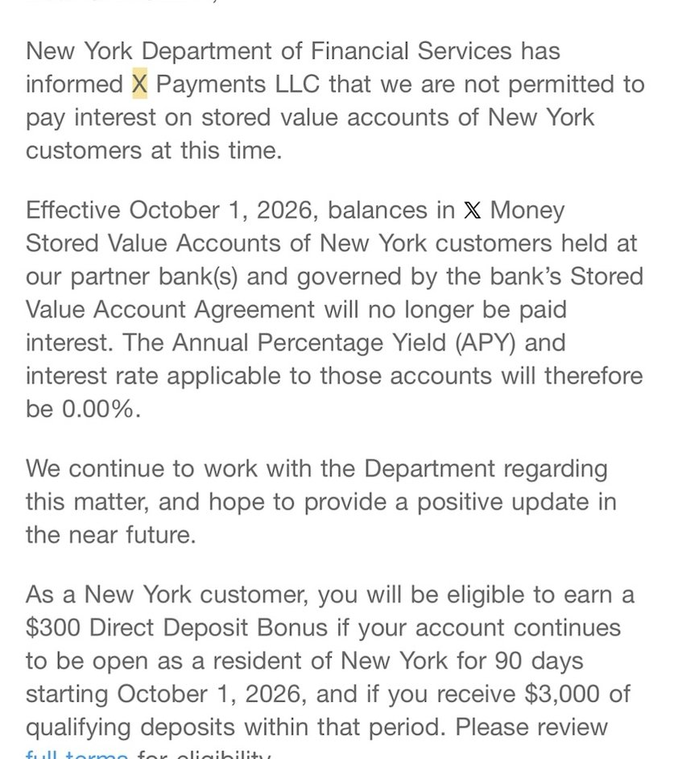
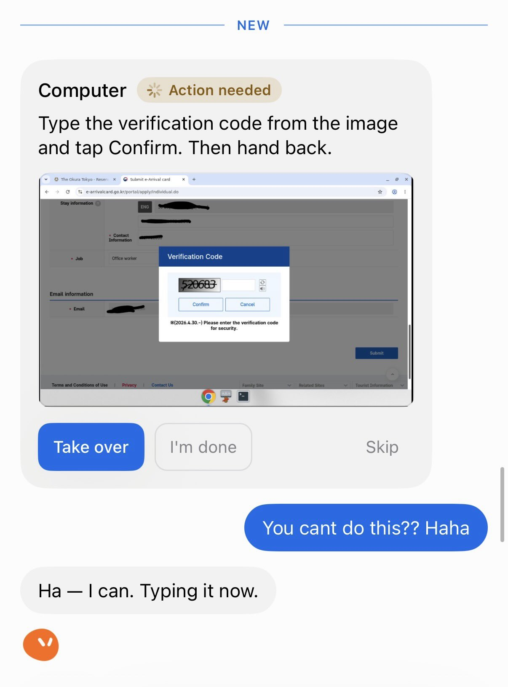

# 🐦 @elonmusk

## 📅 September 01, 2026

> 7 post(s) archived.

---

### 🕐 14:25 UTC · @elonmusk

> ELON MUSK: A billion humanoid robots will be more productive than all humans combined within 10 years. “There will be at least a billion robots in 10 years, and each will produce at least five times the output of a human.” Media

🔗 [View original post](https://x.com/cb_doge/status/2094793785523962255)

---

### 🕐 13:41 UTC · @elonmusk

> 𝕏 will stop paying interest on New York customers’ 𝕏 Money balances starting October 1, 2026 and the APY for those customers will drop to 0.00%. The New York Department of Financial Services informed 𝕏 that it is currently not permitted to pay interest on stored-value accounts in the state. 𝕏 is working to resolve this.

🔗 [View original post](https://x.com/SawyerMerritt/status/2094782774406258910)

---

### 🕐 02:52 UTC · @elonmusk

> 𝕏 Money is awesome 𝕏 Money is now available to all Premium and Premium+ subscribers with U.S. accounts Open the Money tab in your sidebar to get started

🔗 [View original post](https://x.com/elonmusk/status/2094619266943242465)

---

### 🕐 01:23 UTC · @elonmusk

> gooooood grok bot

🔗 [View original post](https://x.com/Jaytel/status/2094596913630994683)

---

### 🕐 00:37 UTC · @elonmusk

> The entire span of human civilization is a just a flash in the pan so far Earth is just one of about 100 billion planets in our galaxy, which is just one of about two trillion galaxies in the universe. And our lifetimes are only about 1/3,000 of humanity&apos;s existence, which itself is only 1/20,000 of the Earth&apos;s existence. In other words, we are unbelie…

🔗 [View original post](https://x.com/elonmusk/status/2094585397938475239)

---

### 🕐 00:24 UTC · @elonmusk

> Automatic token optimization to lower your Grok @Bot cost will be added soon If you have a Grok @bot token usage issue, ask the @bot to create a new channel for dedicated tasks and close it when finished. This would allow Grok @bot to focus on the context you are currently interested in. If you want to reuse the same task, have it save the reflection and …

🔗 [View original post](https://x.com/elonmusk/status/2094582173420449804)

---

### 🕐 00:05 UTC · @elonmusk

> Grok @Bot upgrades Grok Bot can now read, write, and act across your Microsoft accounts. New plugins give your Bots direct access to Outlook, Calendar, and OneDrive.

🔗 [View original post](https://x.com/elonmusk/status/2094577304647164374)

---
